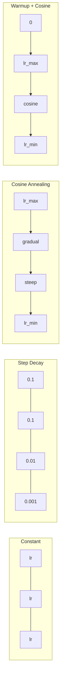
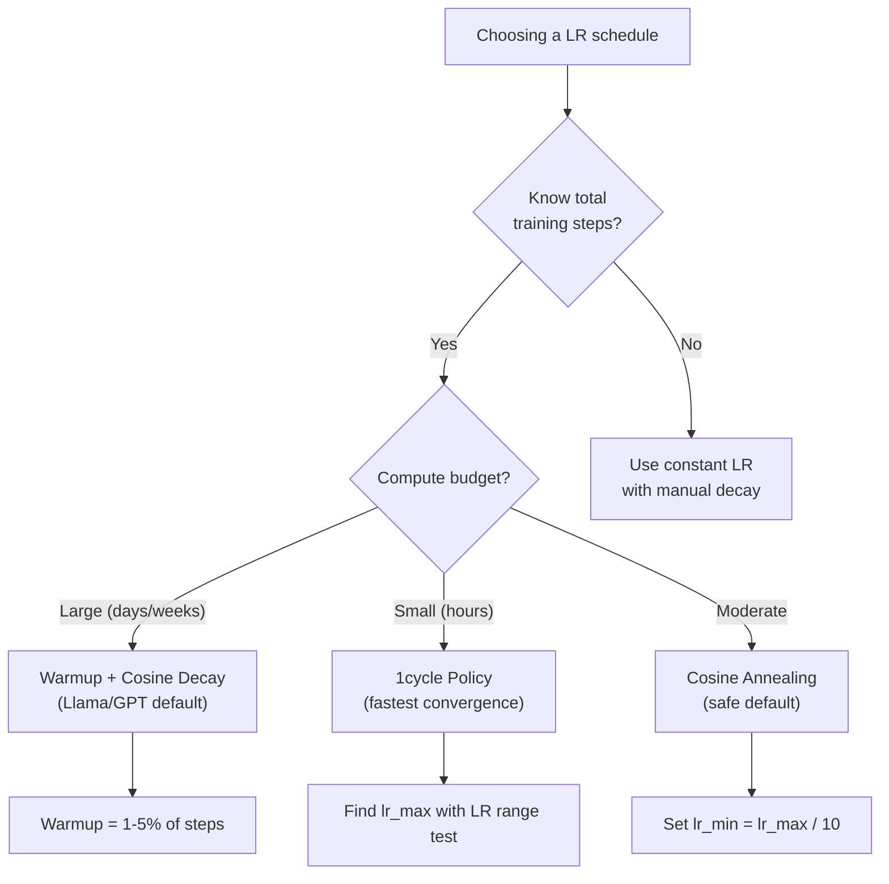
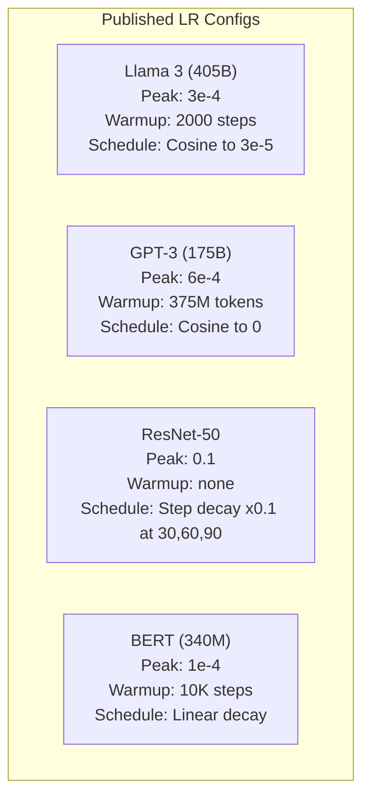

# Learning Rate Schedules and Warmup

> معدل التعلم هو المعلم الفائق الأكثر أهمية. ليس الهندسة المعمارية. ليس حجم مجموعة البيانات. ليست وظيفة التنشيط. معدل التعلم. إذا لم تقم بضبط أي شيء آخر، قم بضبط هذا.

**النوع:** بناء
** اللغات: ** بايثون
**المتطلبات:** الدرس 03.06 (المحسنون)، الدرس 03.08 (تهيئة الوزن)
**الوقت:** ~90 دقيقة

## Learning Objectives

- تنفيذ جداول معدل التعلم الثابتة، وتحلل الخطوة، وجيب التمام، والاحماء + جيب التمام، ودورة واحدة من الصفر
- توضيح أوضاع الفشل الثلاثة لاختيار معدل التعلم: التباعد (مرتفع جدًا)، والمماطلة (منخفض جدًا)، والتذبذب (بدون اضمحلال)
- اشرح سبب ضرورة الإحماء للمحسنين المعتمدين على آدم وكيف يعمل على استقرار التدريب المبكر
- مقارنة سرعة التقارب بين جميع الجداول الخمسة لنفس المهمة واختيار الجدول المناسب لميزانية التدريب المحددة

## The Problem

ضبط معدل التعلم على 0.1. يتباين التدريب - الخسارة تقفز إلى ما لا نهاية في 3 خطوات. اضبطه على 0.0001. يزحف التدريب - بعد 100 فترة، بالكاد يتحرك النموذج من العشوائية. اضبطه على 0.01. التدريب يعمل لمدة 50 حقبة، ثم تتأرجح الخسارة حول الحد الأدنى الذي لا يمكن أن يصل إليه أبدًا لأن الخطوات كبيرة جدًا.

معدل التعلم الأمثل ليس ثابتا. يتغير أثناء التدريب. في وقت مبكر، تريد خطوات كبيرة لتغطية الأرض بسرعة. في وقت متأخر من التدريب، تحتاج إلى خطوات صغيرة للوصول إلى الحد الأدنى الحاد. غالبًا ما يكون الفرق بين النموذج الدقيق بنسبة 90% والنموذج الدقيق بنسبة 95% هو الجدول الزمني فقط.

يستخدم كل نموذج رئيسي تم نشره في السنوات الثلاث الماضية جدولًا لمعدل التعلم. استخدم Llama 3 الذروة lr=3e-4 مع 2000 خطوة إحماء واضمحلال جيب التمام إلى 3e-5. GPT-3 تم استخدامه lr=6e-4 مع عملية إحماء أكثر من 375 مليون توكن. هذه ليست اختيارات تعسفية. إنها نتيجة عمليات مسح مكثفة للمعلمات الفائقة تكلف ملايين الدولارات.

أنت بحاجة إلى فهم الجداول الزمنية لأن الإعدادات الافتراضية لن تعمل على حل مشكلتك. عندما تقوم بضبط نموذج تم تدريبه مسبقًا، فإن الجدول الزمني الصحيح يختلف عن التدريب من الصفر. عند زيادة حجم الدفعة، يجب أن تتغير فترة الإحماء. عندما ينقطع التدريب عند الخطوة 10000، عليك أن تعرف ما إذا كانت مشكلة في الجدول الزمني أو أي شيء آخر.

## The Concept

### Constant Learning Rate

أبسط نهج. اختر رقمًا واستخدمه في كل خطوة.

```
lr(t) = lr_0
```

نادرا ما يكون الأمثل. إما أنها مرتفعة جدًا بالنسبة لنهاية التدريب (التذبذب حول الحد الأدنى) أو منخفضة جدًا بالنسبة للبداية (حساب ضائع في خطوات صغيرة). يعمل بشكل جيد للنماذج الصغيرة وتصحيح الأخطاء. اختيار رهيب لأي شيء يتدرب لأكثر من ساعة.

### Step Decay

نهج المدرسة القديمة من عصر ResNet. خفض معدل التعلم بعامل (عادةً 10x) في العصور الثابتة.

```
lr(t) = lr_0 * gamma^(floor(epoch / step_size))
```

حيث gamma = 0.1 وstep_size = 30 يعني: lr ينخفض ​​بمقدار 10x كل 30 حقبة. استخدم ResNet-50 هذا - lr=0.1، وانخفض بمقدار 10x في العصور 30 ​​و60 و90.

المشكلة: تعتمد نقاط الانحلال المثالية على مجموعة البيانات والهندسة المعمارية. انتقل إلى مشكلة مختلفة وتحتاج إلى إعادة ضبط وقت الإسقاط. تكون التحولات مفاجئة - يمكن أن ترتفع الخسارة عندما يتغير المعدل فجأة.

### Cosine Annealing

الاضمحلال السلس من الحد الأقصى لمعدل التعلم إلى الحد الأدنى، باتباع منحنى جيب التمام:

```
lr(t) = lr_min + 0.5 * (lr_max - lr_min) * (1 + cos(pi * t / T))
```

حيث t هو الخطوة الحالية وT هو العدد الإجمالي للخطوات.

عند t=0، حد جيب التمام هو 1، لذا lr = lr_max. عند t=T، حد جيب التمام هو -1، لذا lr = lr_min. يكون التحلل لطيفًا في البداية، ثم يتسارع في المنتصف، ثم يصبح لطيفًا مرة أخرى قرب النهاية.

هذا هو الوضع الافتراضي لمعظم الدورات التدريبية الحديثة. لا توجد معلمات تشعبية لضبطها بعد lr_max وlr_min. يتطابق شكل جيب التمام مع الملاحظة التجريبية بأن معظم التعلم يحدث في منتصف التدريب - فأنت تريد أحجام خطوات معقولة خلال تلك الفترة الحرجة.

### Warmup: Why You Start Small

يحافظ آدم وغيره من المُحسِّنين التكيفيين على تقديرات جارية لمتوسط ​​التدرج والتباين. في الخطوة 0، تتم تهيئة هذه التقديرات إلى الصفر. تعتمد التحديثات التدرجية القليلة الأولى على إحصائيات البيانات المهملة. إذا كان معدل التعلم الخاص بك كبيرًا خلال هذه الفترة، فإن النموذج يتخذ خطوات ضخمة وسيئة التوجيه.

يعمل الإحماء على إصلاح هذا. ابدأ بمعدل تعلم صغير (غالبًا lr_max / Warmup_steps أو حتى صفر) وقم بزيادة خطيًا إلى lr_max خلال الخطوات N الأولى. بحلول الوقت الذي تصل فيه إلى معدل التعلم الكامل، تكون إحصائيات آدم قد استقرت.

```
lr(t) = lr_max * (t / warmup_steps)     for t < warmup_steps
```

الإحماء النموذجي: 1-5% من إجمالي خطوات التدريب. تم تدريب Llama 3 للحصول على ما يقرب من 1.8 تريليون رمز وتم الإحماء لـ 2000 خطوة. GPT-3 تم تسخينها بأكثر من 375 مليون توكن.

### Linear Warmup + Cosine Decay

الافتراضي الحديث تصاعد خطيا، ثم تتحلل مع جيب التمام:

```
if t < warmup_steps:
    lr(t) = lr_max * (t / warmup_steps)
else:
    progress = (t - warmup_steps) / (total_steps - warmup_steps)
    lr(t) = lr_min + 0.5 * (lr_max - lr_min) * (1 + cos(pi * progress))
```

هذا ما تستخدمه اللاما، GPT، PaLM ومعظم المحولات الحديثة. الإحماء يمنع عدم الاستقرار المبكر. يؤدي اضمحلال جيب التمام إلى تسوية النموذج إلى الحد الأدنى الجيد.

### 1cycle Policy

اكتشاف ليزلي سميث (2018): زيادة معدل التعلم من قيمة منخفضة إلى قيمة عالية في النصف الأول من التدريب، ثم خفضه مرة أخرى في النصف الثاني. غير بديهي - لماذا *تزيد* معدل التعلم في منتصف الطريق؟

النظرية: يعمل معدل التعلم المرتفع بمثابة تنظيم عن طريق إضافة ضوضاء إلى مسار التحسين. يستكشف النموذج المزيد من مشهد الخسارة خلال مرحلة التكثيف، ويجد أحواضًا أفضل. يتم بعد ذلك تحسين مرحلة المنحدر إلى أسفل داخل أفضل حوض تم العثور عليه.

```
Phase 1 (0 to T/2):    lr ramps from lr_max/25 to lr_max
Phase 2 (T/2 to T):    lr ramps from lr_max to lr_max/10000
```

غالبًا ما تتدرب دورة 1 بشكل أسرع من التلدين جيب التمام لميزانية حسابية ثابتة. المقايضة: يجب أن تعرف العدد الإجمالي للخطوات مقدمًا.

### Schedule Shapes



### Decision Flowchart



### Real Numbers from Published Models



## Build It

### Step 1: Schedule Functions

تأخذ كل دالة الخطوة الحالية وترجع معدل التعلم في تلك الخطوة.

```python
import math


def constant_schedule(step, lr=0.01, **kwargs):
    return lr


def step_decay_schedule(step, lr=0.1, step_size=100, gamma=0.1, **kwargs):
    return lr * (gamma ** (step // step_size))


def cosine_schedule(step, lr=0.01, total_steps=1000, lr_min=1e-5, **kwargs):
    if step >= total_steps:
        return lr_min
    return lr_min + 0.5 * (lr - lr_min) * (1 + math.cos(math.pi * step / total_steps))


def warmup_cosine_schedule(step, lr=0.01, total_steps=1000, warmup_steps=100, lr_min=1e-5, **kwargs):
    if total_steps <= warmup_steps:
        return lr * (step / max(warmup_steps, 1))
    if step < warmup_steps:
        return lr * step / warmup_steps
    progress = (step - warmup_steps) / (total_steps - warmup_steps)
    return lr_min + 0.5 * (lr - lr_min) * (1 + math.cos(math.pi * progress))


def one_cycle_schedule(step, lr=0.01, total_steps=1000, **kwargs):
    mid = max(total_steps // 2, 1)
    if step < mid:
        return (lr / 25) + (lr - lr / 25) * step / mid
    else:
        progress = (step - mid) / max(total_steps - mid, 1)
        return lr * (1 - progress) + (lr / 10000) * progress
```

### Step 2: Visualize All Schedules

اطبع مخططًا نصيًا يوضح كيفية تطور كل جدول زمني عبر التدريب.

```python
def visualize_schedule(name, schedule_fn, total_steps=500, **kwargs):
    steps = list(range(0, total_steps, total_steps // 20))
    if total_steps - 1 not in steps:
        steps.append(total_steps - 1)

    lrs = [schedule_fn(s, total_steps=total_steps, **kwargs) for s in steps]
    max_lr = max(lrs) if max(lrs) > 0 else 1.0

    print(f"\n{name}:")
    for s, lr_val in zip(steps, lrs):
        bar_len = int(lr_val / max_lr * 40)
        bar = "#" * bar_len
        print(f"  Step {s:4d}: lr={lr_val:.6f} {bar}")
```

### Step 3: Training Network

شبكة بسيطة من طبقتين على مجموعة بيانات الدائرة، مثل الدروس السابقة، لكننا الآن نغير الجدول الزمني.

```python
import random


def sigmoid(x):
    x = max(-500, min(500, x))
    return 1.0 / (1.0 + math.exp(-x))


def relu(x):
    return max(0.0, x)


def relu_deriv(x):
    return 1.0 if x > 0 else 0.0


def make_circle_data(n=200, seed=42):
    random.seed(seed)
    data = []
    for _ in range(n):
        x = random.uniform(-2, 2)
        y = random.uniform(-2, 2)
        label = 1.0 if x * x + y * y < 1.5 else 0.0
        data.append(([x, y], label))
    return data


def train_with_schedule(schedule_fn, schedule_name, data, epochs=300, base_lr=0.05, **kwargs):
    random.seed(0)
    hidden_size = 8
    total_steps = epochs * len(data)

    std = math.sqrt(2.0 / 2)
    w1 = [[random.gauss(0, std) for _ in range(2)] for _ in range(hidden_size)]
    b1 = [0.0] * hidden_size
    w2 = [random.gauss(0, std) for _ in range(hidden_size)]
    b2 = 0.0

    step = 0
    epoch_losses = []

    for epoch in range(epochs):
        total_loss = 0
        correct = 0

        for x, target in data:
            lr = schedule_fn(step, lr=base_lr, total_steps=total_steps, **kwargs)

            z1 = []
            h = []
            for i in range(hidden_size):
                z = w1[i][0] * x[0] + w1[i][1] * x[1] + b1[i]
                z1.append(z)
                h.append(relu(z))

            z2 = sum(w2[i] * h[i] for i in range(hidden_size)) + b2
            out = sigmoid(z2)

            error = out - target
            d_out = error * out * (1 - out)

            for i in range(hidden_size):
                d_h = d_out * w2[i] * relu_deriv(z1[i])
                w2[i] -= lr * d_out * h[i]
                for j in range(2):
                    w1[i][j] -= lr * d_h * x[j]
                b1[i] -= lr * d_h
            b2 -= lr * d_out

            total_loss += (out - target) ** 2
            if (out >= 0.5) == (target >= 0.5):
                correct += 1
            step += 1

        avg_loss = total_loss / len(data)
        accuracy = correct / len(data) * 100
        epoch_losses.append(avg_loss)

    return epoch_losses
```

### Step 4: Compare All Schedules

تدريب نفس الشبكة مع كل جدول زمني ومقارنة سلوك الخسارة النهائية والتقارب.

```python
def compare_schedules(data):
    configs = [
        ("Constant", constant_schedule, {}),
        ("Step Decay", step_decay_schedule, {"step_size": 15000, "gamma": 0.1}),
        ("Cosine", cosine_schedule, {"lr_min": 1e-5}),
        ("Warmup+Cosine", warmup_cosine_schedule, {"warmup_steps": 3000, "lr_min": 1e-5}),
        ("1cycle", one_cycle_schedule, {}),
    ]

    print(f"\n{'Schedule':<20} {'Start Loss':>12} {'Mid Loss':>12} {'End Loss':>12} {'Best Loss':>12}")
    print("-" * 70)

    for name, schedule_fn, extra_kwargs in configs:
        losses = train_with_schedule(schedule_fn, name, data, epochs=300, base_lr=0.05, **extra_kwargs)
        mid_idx = len(losses) // 2
        best = min(losses)
        print(f"{name:<20} {losses[0]:>12.6f} {losses[mid_idx]:>12.6f} {losses[-1]:>12.6f} {best:>12.6f}")
```

### Step 5: LR Too High vs Too Low

قم بتوضيح أوضاع الفشل الثلاثة: مرتفع جدًا (التباعد)، ومنخفض جدًا (الزحف)، والصحيح تمامًا.

```python
def lr_sensitivity(data):
    learning_rates = [1.0, 0.1, 0.01, 0.001, 0.0001]

    print("\nLR Sensitivity (constant schedule, 100 epochs):")
    print(f"  {'LR':>10} {'Start Loss':>12} {'End Loss':>12} {'Status':>15}")
    print("  " + "-" * 52)

    for lr in learning_rates:
        losses = train_with_schedule(constant_schedule, f"lr={lr}", data, epochs=100, base_lr=lr)
        start = losses[0]
        end = losses[-1]

        if end > start or math.isnan(end) or end > 1.0:
            status = "DIVERGED"
        elif end > start * 0.9:
            status = "BARELY MOVED"
        elif end < 0.15:
            status = "CONVERGED"
        else:
            status = "LEARNING"

        end_str = f"{end:.6f}" if not math.isnan(end) else "NaN"
        print(f"  {lr:>10.4f} {start:>12.6f} {end_str:>12} {status:>15}")
```

## Use It

PyTorch يوفر الجداول في `torch.optim.lr_scheduler`:

```python
import torch
import torch.optim as optim
from torch.optim.lr_scheduler import CosineAnnealingLR, OneCycleLR, StepLR

model = nn.Sequential(nn.Linear(10, 64), nn.ReLU(), nn.Linear(64, 1))
optimizer = optim.Adam(model.parameters(), lr=3e-4)

scheduler = CosineAnnealingLR(optimizer, T_max=1000, eta_min=1e-5)

for step in range(1000):
    loss = train_step(model, optimizer)
    scheduler.step()
```

للإحماء + جيب التمام، استخدم جدولة لامدا أو `get_cosine_schedule_with_warmup` من HuggingFace:

```python
from transformers import get_cosine_schedule_with_warmup

scheduler = get_cosine_schedule_with_warmup(
    optimizer,
    num_warmup_steps=2000,
    num_training_steps=100000,
)
```

وظيفة HuggingFace هي ما تستخدمه معظم نصوص الضبط الدقيق لـ Llama وGPT. عندما تكون في شك، استخدم الإحماء + جيب التمام مع الإحماء = 3-5% من إجمالي الخطوات. إنه يعمل لكل شيء تقريبًا.

## Ship It

ينتج هذا الدرس:
- `outputs/prompt-lr-schedule-advisor.md` - مطالبة توصي بجدول معدل التعلم المناسب والمعلمات الفائقة لإعداد التدريب الخاص بك

## Exercises

1. قم بتنفيذ الاضمحلال الأسي: lr(t) = lr_0 * gamma^t حيث gamma = 0.999. قارن مع جيب التمام الصلب في مجموعة بيانات الدائرة.

2. تنفيذ اختبار نطاق معدل التعلم (ليزلي سميث): تدرب لبضع مئات من الخطوات مع زيادة LR بشكل كبير من 1e-7 إلى 1. خسارة قطعة الأرض مقابل LR. الحد الأقصى الأمثل LR هو قبل أن تبدأ الخسارة في الزيادة.

3. تدرب مع الإحماء + جيب التمام ولكن قم بتغيير مدة الإحماء: 0%، 1%، 5%، 10%، 20% من إجمالي الخطوات. ابحث عن المكان المناسب حيث يكون التدريب أكثر استقرارًا.

4. تنفيذ الصلب جيب التمام مع عمليات إعادة التشغيل الدافئة (SGDR): إعادة ضبط معدل التعلم إلى lr_max كل خطوات T والانحلال مرة أخرى. قارنه بجيب التمام القياسي في فترة تدريب أطول.

5. قم ببناء "جراح الجدولة" الذي يراقب فقدان التدريب ويتحول تلقائيًا من الإحماء إلى جيب التمام عندما تستقر الخسارة، ويقلل من lr إذا كانت ثبات الخسارة لفترة طويلة جدًا.

## Key Terms

| مصطلح | ماذا يقول الناس | ماذا يعني في الواقع |
|------|----------------|----------------------|
| معدل التعلم | "مدى سرعة تعلم النموذج" | العددية التي تضرب التدرج لتحديد حجم تحديث المعلمة |
| الجدول الزمني | "قم بتغيير LR بمرور الوقت" | وظيفة تحدد خطوة التدريب بمعدل التعلم، وهي مصممة لتحسين التقارب |
| الاحماء | "ابدأ بـ LR صغير" | تكثيف خطي LR من الصفر القريب إلى القيمة المستهدفة خلال خطوات N الأولى لتحقيق الاستقرار في إحصائيات المحسن |
| جيب التمام الصلب | "السلس LR الاضمحلال" | تقليل LR بعد منحنى جيب التمام من lr_max إلى lr_min خلال التدريب |
| خطوة الاضمحلال | "أسقط LR عند المعالم" | ضرب LR بعامل (عادة 0.1) على فترات زمنية ثابتة |
| سياسة دورة واحدة | "أعلى ثم أسفل" | طريقة ليزلي سميث في الانحدار LR للأعلى ثم للأسفل في دورة واحدة لتقارب أسرع |
| LR اختبار المدى | "ابحث عن أفضل معدل للتعلم" | تدريب لفترة وجيزة مع زيادة LR للعثور على القيمة التي تبدأ فيها الخسارة بالتباعد |
| جيب التمام مع إعادة التشغيل الدافئة | "إعادة الضبط والتكرار" | إعادة ضبط LR إلى lr_max بشكل دوري والتدهور مرة أخرى (SGDR) |
| إيتا مين | "الأرضية لـ LR" | الحد الأدنى لمعدل التعلم الذي ينخفض ​​​​الجدول إلى |
| ذروة معدل التعلم | "الحد الأقصى LR" | أعلى LR تم الوصول إليه أثناء التدريب، عادةً بعد الإحماء |

## Further Reading

- Loshchilov & Hutter، "SGDR: الهبوط التدرج العشوائي مع عمليات إعادة التشغيل الدافئة" (2017) - قدم الصلب جيب التمام وإعادة التشغيل الدافئة
- سميث، "التقارب الفائق: تدريب سريع جدًا للشبكات العصبية باستخدام معدلات تعلم كبيرة" (2018) - ورقة سياسة الدورة الأولى
- Touvron et al.، "Llama 2: Open Foundation and Fine-Tuned Chat Models" (2023) - يوثق جدول الإحماء + جيب التمام المستخدم على نطاق واسع
- جويال وآخرون، "دقيقة صغيرة كبيرة SGD: تدريب ImageNet في ساعة واحدة" (2017) - قاعدة القياس الخطي والإحماء لتدريب الدفعات الكبيرة
