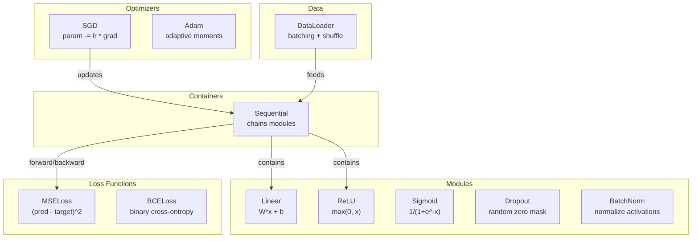
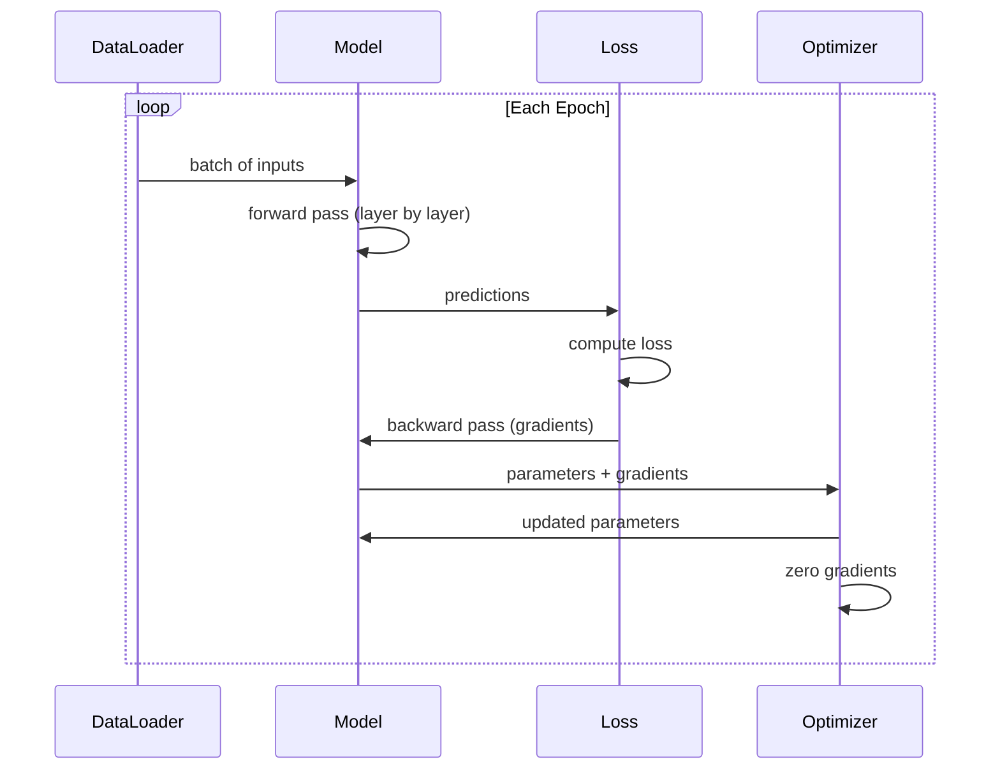
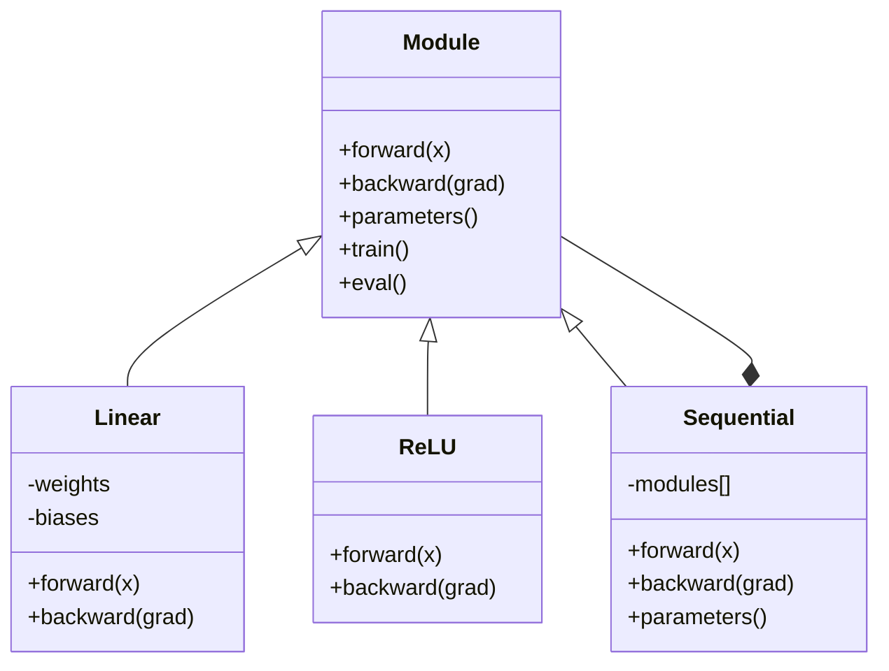

# قم ببناء الإطار المصغر الخاص بك
> لقد قمت ببناء الخلايا العصبية، والطبقات، والشبكات، والدعامة الخلفية، والتنشيطات، ووظائف الخسارة، والمحسنات، والتنظيم، والتهيئة، وجداول LR. كل ذلك كقطع منفصلة. الآن قم بتوصيلهم معًا في إطار. ليس PyTorch. ليس TensorFlow. لك.
**النوع:** بناء
** اللغات: ** بايثون
**المتطلبات الأساسية:** جميع مراحل المرحلة 03 (الدروس 01-09)
**الوقت:** ~120 دقيقة
## أهداف التعلم
- إنشاء إطار عمل كامل للتعلم العميق (حوالي 500 سطر) باستخدام Module وLinear وReLU وSigmoid وDropout وBatchNorm وSequential ووظائف الخسارة والمحسنات وDataLoader
- اشرح تجريد الوحدة النمطية (للأمام والخلف والمعلمات) وسبب ضرورة تبديل وضع التدريب/التقييم
- قم بتوصيل جميع المكونات في حلقة تدريب عاملة تعمل على تدريب شبكة من 4 طبقات على تصنيف الدوائر
- قم بتعيين كل مكون من مكونات إطار العمل الخاص بك إلى ما يعادله PyTorch (nn.Module، nn.Sequential، optim.Adam، DataLoader)
## المشكلة
لديك عشرة دروس من الكتل البرمجية الإنشائية متناثرة عبر ملفات منفصلة. فصل `Value` هنا، وحلقة تدريب هناك، وتهيئة الوزن في ملف آخر، وجداول معدل التعلم في ملف آخر. لتدريب شبكة، عليك النسخ واللصق من خمسة دروس مختلفة وربطها معًا يدويًا.
هذا هو ما تحل الأطر. PyTorch يمنحك `nn.Module`، `nn.Sequential`، `optim.Adam`، `DataLoader`، ونمط حلقة التدريب الذي يربطهم معًا. يمنحك TensorFlow `keras.Layer`، `keras.Sequential`، `keras.optimizers.Adam`. هذه ليست سحرية. إنها أنماط تنظيمية make من الممكن تحديد الشبكات وتدريبها وتقييمها دون إعادة اختراع السباكة في كل مرة.
ستقوم ببناء نفس الشيء في حوالي 500 سطر من لغة بايثون. لا نومي. لا تبعيات خارجية. إطار عمل يمكنه تحديد أي شبكة تغذية للأمام، وتدريبها باستخدام SGD أو Adam، وتجميع البيانات، وتطبيق التسرب وتسوية الدُفعات، واستخدام أي تنشيط، وجدولة معدل التعلم.
عند الانتهاء، ستفهم بالضبط ما يحدث عندما تكتب `model = nn.Sequential(...)` في PyTorch. سوف تفهم سبب وجود `model.train()` و`model.eval()`. سوف تفهم لماذا `optimizer.zero_grad()` مكالمة منفصلة. سوف تفهم كل ذلك، لأنك بنيت كل ذلك.
##المفهوم
### تجريد الوحدة
كل طبقة في PyTorch ترث من `nn.Module`. تحتوي الوحدة على ثلاث مسؤوليات:
1. **forward()** -- حساب المخرجات المعطاة للمدخلات
2. **parameters()** -- إرجاع جميع الأوزان القابلة للتدريب
3. **backward()** -- حساب التدرجات (يتم التعامل معها بواسطة autograd في PyTorch، وهي واضحة في موقعنا)
الطبقة الخطية هي وحدة نمطية. تنشيط ReLU هو وحدة نمطية. الطبقة المتسربة هي وحدة نمطية. طبقة تطبيع الدفعة هي وحدة نمطية. لديهم جميعا نفس الواجهة.
### حاوية تسلسلية
`nn.Sequential` وحدات السلاسل. التمرير إلى الأمام: قم بتغذية البيانات من خلال الوحدة 1، ثم الوحدة 2، ثم الوحدة 3. التمرير إلى الخلف: عكس السلسلة. الحاوية نفسها عبارة عن وحدة نمطية - فهي تحتوي على الأمام () والمعلمات () والخلف (). هذا هو النمط المركب: سلسلة من الوحدات هي في حد ذاتها وحدة.
### التدريب مقابل وضع التقييم
يقوم التسرب بتصفية الخلايا العصبية بشكل عشوائي أثناء التدريب ولكنه يمرر كل شيء خلال التقييم. تستخدم تسوية الدُفعة إحصائيات الدُفعة أثناء التدريب ولكنها تستخدم المتوسطات أثناء التقييم. تقوم الطريقتان `train()` و`eval()` بتبديل هذا السلوك. تحتوي كل وحدة على علامة `training`.
### محسن
يقوم المحسن بتحديث المعلمات باستخدام تدرجاتها. SGD: `param -= lr * grad`. آدم: يحتفظ بتقديرات الزخم والتباين، ثم يقوم بالتحديث. لا يعرف المُحسِّن بنية الشبكة - فهو يرى فقط قائمة مسطحة من المعلمات وتدرجاتها.
### محمل البيانات
الخلط مهم لسببين. أولاً، لا يمكنك احتواء مجموعة البيانات بأكملها في الذاكرة للمشكلات الكبيرة. ثانيًا، يوفر نزول التدرج الصغير ضوضاء تساعد على الهروب من الحد الأدنى المحلي. يقوم DataLoader بتقسيم البيانات إلى دفعات والتبديل اختياريًا بين العصور.
### بنية الإطار


### حلقة التدريب


### التسلسل الهرمي للوحدة


## بنائها
### الخطوة 1: الفئة الأساسية للوحدة
الواجهة المجردة التي تنفذها كل طبقة.
```python
class Module:
    def __init__(self):
        self.training = True

    def forward(self, x):
        raise NotImplementedError

    def backward(self, grad):
        raise NotImplementedError

    def parameters(self):
        return []

    def train(self):
        self.training = True

    def eval(self):
        self.training = False
```

### الخطوة 2: الطبقة الخطية
اللبنة الأساسية. يخزن الأوزان والتحيزات، ويحسب Wx + b للأمام، وتدرجات الوزن/الإدخال للخلف.
```python
import math
import random


class Linear(Module):
    def __init__(self, fan_in, fan_out):
        super().__init__()
        std = math.sqrt(2.0 / fan_in)
        self.weights = [[random.gauss(0, std) for _ in range(fan_in)] for _ in range(fan_out)]
        self.biases = [0.0] * fan_out
        self.weight_grads = [[0.0] * fan_in for _ in range(fan_out)]
        self.bias_grads = [0.0] * fan_out
        self.fan_in = fan_in
        self.fan_out = fan_out
        self.input = None

    def forward(self, x):
        self.input = x
        output = []
        for i in range(self.fan_out):
            val = self.biases[i]
            for j in range(self.fan_in):
                val += self.weights[i][j] * x[j]
            output.append(val)
        return output

    def backward(self, grad):
        input_grad = [0.0] * self.fan_in
        for i in range(self.fan_out):
            self.bias_grads[i] += grad[i]
            for j in range(self.fan_in):
                self.weight_grads[i][j] += grad[i] * self.input[j]
                input_grad[j] += grad[i] * self.weights[i][j]
        return input_grad

    def parameters(self):
        params = []
        for i in range(self.fan_out):
            for j in range(self.fan_in):
                params.append((self.weights, i, j, self.weight_grads))
            params.append((self.biases, i, None, self.bias_grads))
        return params
```

### الخطوة 3: وحدات التنشيط
ReLU وSigmoid وTanh كوحدات. يقوم كل منهما بتخزين ما يحتاجه للتمرير للخلف.
```python
class ReLU(Module):
    def __init__(self):
        super().__init__()
        self.mask = None

    def forward(self, x):
        self.mask = [1.0 if v > 0 else 0.0 for v in x]
        return [max(0.0, v) for v in x]

    def backward(self, grad):
        return [g * m for g, m in zip(grad, self.mask)]


class Sigmoid(Module):
    def __init__(self):
        super().__init__()
        self.output = None

    def forward(self, x):
        self.output = []
        for v in x:
            v = max(-500, min(500, v))
            self.output.append(1.0 / (1.0 + math.exp(-v)))
        return self.output

    def backward(self, grad):
        return [g * o * (1 - o) for g, o in zip(grad, self.output)]


class Tanh(Module):
    def __init__(self):
        super().__init__()
        self.output = None

    def forward(self, x):
        self.output = [math.tanh(v) for v in x]
        return self.output

    def backward(self, grad):
        return [g * (1 - o * o) for g, o in zip(grad, self.output)]
```

### الخطوة 4: وحدة التسرب
أصفار العناصر بشكل عشوائي أثناء التدريب. يتم قياس العناصر المتبقية بمقدار 1/(1-p) بحيث تظل القيم المتوقعة كما هي. لا يفعل شيئا أثناء التقييم.
```python
class Dropout(Module):
    def __init__(self, p=0.5):
        super().__init__()
        self.p = p
        self.mask = None

    def forward(self, x):
        if not self.training:
            return x
        self.mask = [0.0 if random.random() < self.p else 1.0 / (1 - self.p) for _ in x]
        return [v * m for v, m in zip(x, self.mask)]

    def backward(self, grad):
        if self.mask is None:
            return grad
        return [g * m for g, m in zip(grad, self.mask)]
```

### الخطوة 5: وحدة BatchNorm
تطبيع عمليات التنشيط إلى متوسط ​​صفري وتباين الوحدة لكل ميزة عبر المجموعة. يحافظ على إحصائيات التشغيل لوضع التقييم.
```python
class BatchNorm(Module):
    def __init__(self, size, momentum=0.1, eps=1e-5):
        super().__init__()
        self.size = size
        self.gamma = [1.0] * size
        self.beta = [0.0] * size
        self.gamma_grads = [0.0] * size
        self.beta_grads = [0.0] * size
        self.running_mean = [0.0] * size
        self.running_var = [1.0] * size
        self.momentum = momentum
        self.eps = eps
        self.x_norm = None
        self.std_inv = None
        self.batch_input = None

    def forward_batch(self, batch):
        batch_size = len(batch)
        output_batch = []

        if self.training:
            mean = [0.0] * self.size
            for sample in batch:
                for j in range(self.size):
                    mean[j] += sample[j]
            mean = [m / batch_size for m in mean]

            var = [0.0] * self.size
            for sample in batch:
                for j in range(self.size):
                    var[j] += (sample[j] - mean[j]) ** 2
            var = [v / batch_size for v in var]

            self.std_inv = [1.0 / math.sqrt(v + self.eps) for v in var]

            self.x_norm = []
            self.batch_input = batch
            for sample in batch:
                normed = [(sample[j] - mean[j]) * self.std_inv[j] for j in range(self.size)]
                self.x_norm.append(normed)
                output = [self.gamma[j] * normed[j] + self.beta[j] for j in range(self.size)]
                output_batch.append(output)

            for j in range(self.size):
                self.running_mean[j] = (1 - self.momentum) * self.running_mean[j] + self.momentum * mean[j]
                self.running_var[j] = (1 - self.momentum) * self.running_var[j] + self.momentum * var[j]
        else:
            std_inv = [1.0 / math.sqrt(v + self.eps) for v in self.running_var]
            for sample in batch:
                normed = [(sample[j] - self.running_mean[j]) * std_inv[j] for j in range(self.size)]
                output = [self.gamma[j] * normed[j] + self.beta[j] for j in range(self.size)]
                output_batch.append(output)

        return output_batch

    def forward(self, x):
        result = self.forward_batch([x])
        return result[0]

    def backward(self, grad):
        if self.x_norm is None:
            return grad
        for j in range(self.size):
            self.gamma_grads[j] += self.x_norm[0][j] * grad[j]
            self.beta_grads[j] += grad[j]
        return [grad[j] * self.gamma[j] * self.std_inv[j] for j in range(self.size)]

    def parameters(self):
        params = []
        for j in range(self.size):
            params.append((self.gamma, j, None, self.gamma_grads))
            params.append((self.beta, j, None, self.beta_grads))
        return params
```

### الخطوة 6: الحاوية التسلسلية
وحدات السلاسل. للأمام من اليسار إلى اليمين، وللخلف من اليمين إلى اليسار.
```python
class Sequential(Module):
    def __init__(self, *modules):
        super().__init__()
        self.modules = list(modules)

    def forward(self, x):
        for module in self.modules:
            x = module.forward(x)
        return x

    def backward(self, grad):
        for module in reversed(self.modules):
            grad = module.backward(grad)
        return grad

    def parameters(self):
        params = []
        for module in self.modules:
            params.extend(module.parameters())
        return params

    def train(self):
        self.training = True
        for module in self.modules:
            module.train()

    def eval(self):
        self.training = False
        for module in self.modules:
            module.eval()
```

### الخطوة 7: وظائف الخسارة
MSE والإنتروبيا الثنائية. يقوم كل منها بإرجاع قيمة الخسارة ويوفر back() الذي يُرجع التدرج.
```python
class MSELoss:
    def __call__(self, predicted, target):
        self.predicted = predicted
        self.target = target
        n = len(predicted)
        self.loss = sum((p - t) ** 2 for p, t in zip(predicted, target)) / n
        return self.loss

    def backward(self):
        n = len(self.predicted)
        return [2 * (p - t) / n for p, t in zip(self.predicted, self.target)]


class BCELoss:
    def __call__(self, predicted, target):
        self.predicted = predicted
        self.target = target
        eps = 1e-7
        n = len(predicted)
        self.loss = 0
        for p, t in zip(predicted, target):
            p = max(eps, min(1 - eps, p))
            self.loss += -(t * math.log(p) + (1 - t) * math.log(1 - p))
        self.loss /= n
        return self.loss

    def backward(self):
        eps = 1e-7
        n = len(self.predicted)
        grads = []
        for p, t in zip(self.predicted, self.target):
            p = max(eps, min(1 - eps, p))
            grads.append((-t / p + (1 - t) / (1 - p)) / n)
        return grads
```

### الخطوة 8: SGD ومحسنات آدم
يأخذ كلاهما قائمة المعلمات ويقومان بتحديث الأوزان باستخدام التدرجات.
```python
class SGD:
    def __init__(self, parameters, lr=0.01):
        self.params = parameters
        self.lr = lr

    def step(self):
        for container, i, j, grad_container in self.params:
            if j is not None:
                container[i][j] -= self.lr * grad_container[i][j]
            else:
                container[i] -= self.lr * grad_container[i]

    def zero_grad(self):
        for container, i, j, grad_container in self.params:
            if j is not None:
                grad_container[i][j] = 0.0
            else:
                grad_container[i] = 0.0


class Adam:
    def __init__(self, parameters, lr=0.001, beta1=0.9, beta2=0.999, eps=1e-8):
        self.params = parameters
        self.lr = lr
        self.beta1 = beta1
        self.beta2 = beta2
        self.eps = eps
        self.t = 0
        self.m = [0.0] * len(parameters)
        self.v = [0.0] * len(parameters)

    def step(self):
        self.t += 1
        for idx, (container, i, j, grad_container) in enumerate(self.params):
            if j is not None:
                g = grad_container[i][j]
            else:
                g = grad_container[i]

            self.m[idx] = self.beta1 * self.m[idx] + (1 - self.beta1) * g
            self.v[idx] = self.beta2 * self.v[idx] + (1 - self.beta2) * g * g

            m_hat = self.m[idx] / (1 - self.beta1 ** self.t)
            v_hat = self.v[idx] / (1 - self.beta2 ** self.t)

            update = self.lr * m_hat / (math.sqrt(v_hat) + self.eps)

            if j is not None:
                container[i][j] -= update
            else:
                container[i] -= update

    def zero_grad(self):
        for container, i, j, grad_container in self.params:
            if j is not None:
                grad_container[i][j] = 0.0
            else:
                grad_container[i] = 0.0
```

### الخطوة 9: أداة تحميل البيانات
يقسم البيانات إلى دفعات، ويخلط كل فترة بشكل اختياري.
```python
class DataLoader:
    def __init__(self, data, batch_size=32, shuffle=True):
        self.data = data
        self.batch_size = batch_size
        self.shuffle = shuffle

    def __iter__(self):
        indices = list(range(len(self.data)))
        if self.shuffle:
            random.shuffle(indices)
        for start in range(0, len(indices), self.batch_size):
            batch_indices = indices[start:start + self.batch_size]
            batch = [self.data[i] for i in batch_indices]
            inputs = [item[0] for item in batch]
            targets = [item[1] for item in batch]
            yield inputs, targets

    def __len__(self):
        return (len(self.data) + self.batch_size - 1) // self.batch_size
```

### الخطوة 10: تدريب شبكة من 4 طبقات على تصنيف الدوائر
سلك كل شيء معا. حدد نموذجًا، واختر الخسارة، واختر مُحسِّنًا، وقم بتشغيل حلقة التدريب.
```python
def make_circle_data(n=500, seed=42):
    random.seed(seed)
    data = []
    for _ in range(n):
        x = random.uniform(-2, 2)
        y = random.uniform(-2, 2)
        label = 1.0 if x * x + y * y < 1.5 else 0.0
        data.append(([x, y], [label]))
    return data


def train():
    random.seed(42)

    model = Sequential(
        Linear(2, 16),
        ReLU(),
        Linear(16, 16),
        ReLU(),
        Linear(16, 8),
        ReLU(),
        Linear(8, 1),
        Sigmoid(),
    )

    criterion = BCELoss()
    optimizer = Adam(model.parameters(), lr=0.01)

    data = make_circle_data(500)
    split = int(len(data) * 0.8)
    train_data = data[:split]
    test_data = data[split:]

    loader = DataLoader(train_data, batch_size=16, shuffle=True)

    model.train()

    for epoch in range(100):
        total_loss = 0
        total_correct = 0
        total_samples = 0

        for batch_inputs, batch_targets in loader:
            batch_loss = 0
            for x, t in zip(batch_inputs, batch_targets):
                pred = model.forward(x)
                loss = criterion(pred, t)
                batch_loss += loss

                optimizer.zero_grad()
                grad = criterion.backward()
                model.backward(grad)
                optimizer.step()

                predicted_class = 1.0 if pred[0] >= 0.5 else 0.0
                if predicted_class == t[0]:
                    total_correct += 1
                total_samples += 1

            total_loss += batch_loss

        avg_loss = total_loss / total_samples
        accuracy = total_correct / total_samples * 100

        if epoch % 10 == 0 or epoch == 99:
            print(f"Epoch {epoch:3d} | Loss: {avg_loss:.6f} | Train Accuracy: {accuracy:.1f}%")

    model.eval()
    correct = 0
    for x, t in test_data:
        pred = model.forward(x)
        predicted_class = 1.0 if pred[0] >= 0.5 else 0.0
        if predicted_class == t[0]:
            correct += 1
    test_accuracy = correct / len(test_data) * 100
    print(f"\nTest Accuracy: {test_accuracy:.1f}% ({correct}/{len(test_data)})")

    return model, test_accuracy
```

## استخدمه
إليك PyTorch المعادل لما قمت بإنشائه للتو:
```python
import torch
import torch.nn as nn
from torch.utils.data import DataLoader, TensorDataset

model = nn.Sequential(
    nn.Linear(2, 16),
    nn.ReLU(),
    nn.Linear(16, 16),
    nn.ReLU(),
    nn.Linear(16, 8),
    nn.ReLU(),
    nn.Linear(8, 1),
    nn.Sigmoid(),
)

criterion = nn.BCELoss()
optimizer = torch.optim.Adam(model.parameters(), lr=0.01)

for epoch in range(100):
    model.train()
    for inputs, targets in dataloader:
        optimizer.zero_grad()
        predictions = model(inputs)
        loss = criterion(predictions, targets)
        loss.backward()
        optimizer.step()

    model.eval()
    with torch.no_grad():
        test_predictions = model(test_inputs)
```

الهيكل متطابق. `Sequential`, `Linear`, `ReLU`, `Sigmoid`, `BCELoss`, `Adam`, `zero_grad`, `backward`, `step`, `train`, `eval`. كل مفهوم يعين واحدًا لواحد. الفرق هو أن PyTorch يتعامل مع الترقية التلقائية تلقائيًا (لا حاجة للتنفيذ العكسي() في كل وحدة)، ويعمل على GPU، وقد تم تحسينه لسنوات. لكن العظام هي نفسها.
الآن عندما ترى رمز PyTorch، فأنت تعرف بالضبط ما يحدث في كل سطر. هذا الفهم هو بيت القصيد.
## اشحنها
ينتج هذا الدرس:
- `outputs/prompt-framework-architect.md` -- مطالبة بتصميم بنيات الشبكات العصبية باستخدام تجريدات الإطار
## تمارين
1. أضف فئة `SoftmaxCrossEntropyLoss` للتصنيف متعدد الفئات. Softmax التنبؤات، وحساب الخسارة عبر الإنتروبيا، والتعامل مع التمريرة الخلفية المدمجة. اختبرها على مجموعة بيانات حلزونية من 3 فئات.
2. قم بتنفيذ جدولة معدل التعلم في المُحسّن: أضف طريقة `set_lr()` وسلك في جدول جيب التمام من الدرس 09. قم بتدريب مصنف الدائرة باستخدام الإحماء + جيب التمام ومقارنته بالثابت LR.
3. أضف أسلوب `save()` و`load()` إلى Sequential الذي يقوم بتسلسل جميع الأوزان إلى ملف JSON ويقوم بتحميلها مرة أخرى. تحقق من أن النموذج المحمل ينتج نفس التنبؤات مثل النموذج الأصلي.
4. تنفيذ تناقص الوزن (L2 التسوية) في مُحسِّن Adam. قم بإضافة معلمة `weight_decay` التي تعمل على تقليص الأوزان نحو الصفر في كل خطوة. قارن التدريب مع الاضمحلال = 0 مقابل الاضمحلال = 0.01.
5. استبدل حلقة التدريب لكل عينة بتراكم تدرج صغير مناسب: قم بتجميع التدرجات عبر جميع العينات في دفعة، ثم قم بتقسيمها حسب حجم الدفعة واتخذ خطوة تحسين واحدة. قياس ما إذا كان هذا يغير سرعة التقارب.
## المصطلحات الرئيسية
| مصطلح | ماذا يقول الناس | ماذا يعني في الواقع |
|------|----------------|----------------------|
| الوحدة | "طبقة" | التجريد الأساسي في إطار العمل - أي شيء به الأمام () والخلف () والمعلمات () |
| متسلسل | "تكديس الطبقات بالترتيب" | حاوية تربط الوحدات النمطية، وتطبقها بالتسلسل للأمام والخلف للخلف |
| تمريرة للأمام | "تشغيل الشبكة" | حساب المخرجات عن طريق تمرير المدخلات عبر كل وحدة بالترتيب |
| تمريرة للخلف | "حساب التدرجات" | نشر تدرج الخسارة من خلال كل وحدة في الاتجاه المعاكس لحساب تدرجات المعلمات |
| المعلمات | "الأوزان القابلة للتدريب" | جميع القيم الموجودة في الشبكة التي يمكن للمُحسِّن تحديثها - الأوزان والتحيزات |
| محسن | "الشيء الذي يُحدث الأوزان" | خوارزمية تستخدم التدرجات لتحديث المعلمات أو تنفيذ SGD أو Adam أو قواعد أخرى |
| محمل البيانات | "الشيء الذي يغذي البيانات" | مُكرِّر يقوم بتقسيم مجموعة البيانات إلى دفعات، والتبديل اختياريًا بين العصور |
| وضع التدريب | "model.train()" | علامة تتيح السلوك العشوائي مثل التسرب وتطبيع الدُفعات باستخدام إحصائيات الدُفعات |
| وضع التقييم | "model.eval()" | علامة تعمل على تعطيل التسرب وتستخدم الإحصائيات قيد التشغيل لتطبيع الدُفعة |
| درجة الصفر | "مسح التدرجات" | إعادة تعيين جميع تدرجات المعلمات إلى الصفر قبل حساب تدرجات الدفعة التالية |
## مزيد من القراءة
- باسزكي وآخرون، "PyTorch: أسلوب حتمي، مكتبة التعلم العميق عالية الأداء" (2019) - الورقة التي تصف قرارات تصميم PyTorch
- Cholet، "التعلم العميق باستخدام Python، الإصدار الثاني" (2021) - يغطي الفصل 3 الأجزاء الداخلية لـ Keras بنفس تجريد الوحدة/الطبقة
- جونسون، "Tiny-DNN" (https://github.com/tiny-dnn/tiny-dnn) - إطار عمل للتعلم العميق لـ C++ للرأس فقط لفهم الأجزاء الداخلية لإطار العمل