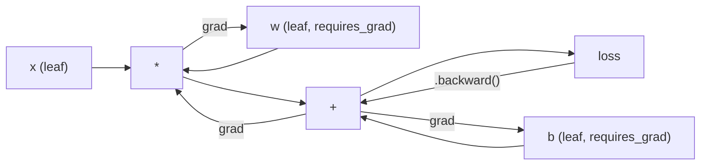
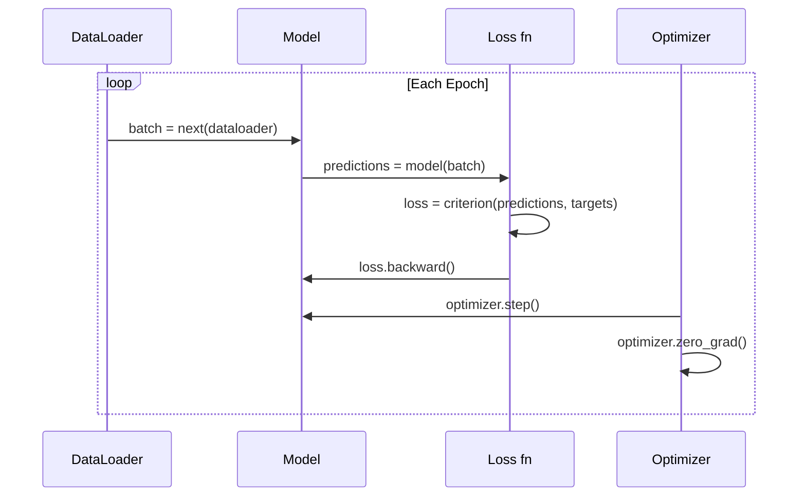

# مقدمة إلى PyTorch
> لقد صنعت المحرك من المكابس وأعمدة الكرنك. الآن تعرف على السيارة التي يقودها الجميع بالفعل.
**النوع:** بناء
** اللغات: ** بايثون
**المتطلبات الأساسية:** الدرس 03.10 (قم ببناء إطار العمل المصغر الخاص بك)
**الوقت:** ~75 دقيقة
## أهداف التعلم
- بناء وتدريب الشبكات العصبية باستخدام PyTorch's nn.Module وnn.Sequential وautograd
- استخدم الموترات PyTorch، والتسارع GPU، وحلقة التدريب القياسية (صفر_درجة، للأمام، الخسارة، للخلف، الخطوة)
- قم بتحويل مكونات إطار العمل المصغر من الصفر إلى مكافئاتها في PyTorch
- قم بإنشاء ملف تعريف ومقارنة سرعة التدريب بين إطار عمل Python الخالص وPyTorch في نفس المهمة
## المشكلة
لديك إطار عمل صغير. الطبقات الخطية، ReLU، التسرب، معيار الدُفعة، Adam، DataLoader، حلقة تدريب. يقوم بتدريب شبكة من 4 طبقات على مشكلة تصنيف الدائرة في لغة بايثون النقية.
كما أنه أبطأ بمقدار 500 مرة من PyTorch في نفس المشكلة.
يقوم إطار العمل المصغر الخاص بك بمعالجة عينة واحدة في كل مرة باستخدام حلقات Python المتداخلة. يرسل PyTorch نفس العمليات إلى نواة C++/CUDA المحسنة التي تعمل على GPU. في NVIDIA A100 واحد، يقوم PyTorch بتدريب ResNet-50 (25.6 مليون معلمة) على ImageNet (1.28 مليون صورة) في حوالي 6 ساعات. سيستغرق إطار العمل الخاص بك ما يقرب من 3000 ساعة للقيام بنفس المهمة - إذا لم تنفد الذاكرة أولاً.
السرعة ليست الفجوة الوحيدة. لا يحتوي إطار العمل الخاص بك على دعم GPU. لا يوجد تمييز تلقائي - لقد كتبت يدويًا بشكل عكسي () لكل وحدة. لا التسلسل. لا يوجد تدريب موزع. لا دقة مختلطة. لا توجد طريقة لتصحيح تدفق التدرج بدون عبارات الطباعة.
PyTorch يملأ كل واحدة من هذه الفجوات. وهو يفعل ذلك مع الحفاظ على نفس النموذج الذهني الذي قمت بإنشائه بالفعل: Module،ward()،parameters(), back(),Optimer.step(). يتم نقل المفاهيم من واحد إلى واحد. بناء الجملة متطابق تقريبا. الفرق هو أن PyTorch يغطي عقدًا من هندسة الأنظمة وراء نفس الواجهة التي صممتها من الصفر.
##المفهوم
### لماذا فاز PyTorch
في عام 2015، طلب منك TensorFlow تحديد رسم بياني حسابي ثابت قبل تشغيل أي شيء. لقد قمت بإنشاء الرسم البياني، وتجميعه، ثم تغذية البيانات من خلاله. تصحيح الأخطاء يعني التحديق في تصورات الرسم البياني. كان تغيير البنية يعني إعادة بناء الرسم البياني من الصفر.
تم إطلاق PyTorch في عام 2017 بفلسفة مختلفة: التنفيذ المتحمس. أنت تكتب بايثون. يتم تشغيله على الفور. `y = model(x)` يحسب y الآن، وليس "أضف node إلى الرسم البياني الذي سيحسب y لاحقًا." وهذا يعني أن أدوات تصحيح أخطاء بايثون القياسية قد نجحت. عملت الطباعة (). عملت بي دي بي. إذا/آخر في التمريرة الأمامية الخاصة بك عملت.
وبحلول عام 2020، كان السوق قد تحدث. ارتفعت حصة PyTorch في الأوراق البحثية ML من 7% (2017) إلى أكثر من 75% (2022). Meta وGoogle DeepMind وOpenAI وAnthropic وHugging Face جميعهم يستخدمون PyTorch كإطار عمل أساسي لهم. اعتمد TensorFlow 2.x التنفيذ المتحمّس استجابةً لذلك - وهو اعتراف ضمني بأن تصميم PyTorch كان صحيحًا.
الدرس: مركبات تجربة المطور. إن إطار العمل الذي يكون أبطأ بنسبة 10% ولكنه أسرع بنسبة 50% في تصحيح الأخطاء يفوز في كل مرة.
### الموترات
الموتر عبارة عن مصفوفة متعددة الأبعاد لها ثلاث خصائص مهمة: الشكل والنوع والجهاز.
```python
import torch

x = torch.zeros(3, 4)           # shape: (3, 4), dtype: float32, device: cpu
x = torch.randn(2, 3, 224, 224) # batch of 2 RGB images, 224x224
x = torch.tensor([1, 2, 3])     # from a Python list
```

**الشكل** هو البعد. العدد هو الشكل ()، والمتجه هو (ن،)، والمصفوفة هي (م، ن)، ومجموعة الصور هي (الدفعة، والقنوات، والارتفاع، والعرض).
**Dtype** يتحكم في الدقة والذاكرة.
| نوع d | بت | النطاق | حالة الاستخدام |
|-------|------|-------|----------|
| تعويم 32 | 32 | ~7 أرقام عشرية digits | التدريب الافتراضي |
| تعويم 16 | 16 | ~3.3 digits العشري | دقة مختلطة |
| بطفو16 | 16 | نفس النطاق مثل float32، دقة أقل | LLM تدريب |
| كثافة العمليات8 | 8 | -128 إلى 127 | الاستدلال الكمي |
**الجهاز** يحدد مكان حدوث الحساب.
```python
device = torch.device("cuda" if torch.cuda.is_available() else "cpu")
x = torch.randn(3, 4, device=device)
x = x.to("cuda")
x = x.cpu()
```

تتطلب كل عملية جميع الموترات على نفس الجهاز. هذا هو الخطأ رقم 1 PyTorch الذي يصيب المبتدئين: `RuntimeError: Expected all tensors to be on the same device`. قم بإصلاحه عن طريق نقل كل شيء إلى نفس الجهاز قبل الحساب.
**إعادة التشكيل** هي عملية زمنية ثابتة - فهي تغير البيانات الوصفية، وليس البيانات.
```python
x = torch.randn(2, 3, 4)
x.view(2, 12)      # reshape to (2, 12) -- must be contiguous
x.reshape(6, 4)    # reshape to (6, 4) -- works always
x.permute(2, 0, 1) # reorder dimensions
x.unsqueeze(0)     # add dimension: (1, 2, 3, 4)
x.squeeze()        # remove size-1 dimensions
```

### أوتوغراد
يتطلب إطار العمل المصغر الخاص بك تنفيذ Back() لكل وحدة. PyTorch لا. فهو يسجل كل عملية على الموترات في رسم بياني حلقي موجه (الرسم البياني الحسابي) ثم يجتاز هذا الرسم البياني في الاتجاه المعاكس لحساب التدرجات تلقائيًا.


الاختلاف الرئيسي عن إطار العمل الخاص بك: PyTorch يستخدم autodiff القائم على الشريط. تُلحق كل عملية بـ "شريط" أثناء التمريرة الأمامية. يؤدي الاتصال بـ `.backward()` إلى إعادة تشغيل الشريط في الاتجاه المعاكس.
```python
x = torch.randn(3, requires_grad=True)
y = x ** 2 + 3 * x
z = y.sum()
z.backward()
print(x.grad)  # dz/dx = 2x + 3
```

ثلاث قواعد للAutograd:
1. فقط موترات الأوراق ذات `requires_grad=True` هي التي تجمع التدرجات
2. تتراكم التدرجات بشكل افتراضي - اتصل بـ `optimizer.zero_grad()` قبل كل تمريرة للخلف
3. `torch.no_grad()` يعطل تتبع التدرج (يُستخدم أثناء التقييم)
### nn.Module
`nn.Module` هي الفئة الأساسية لكل مكون من مكونات الشبكة العصبية في PyTorch. لقد قمت بالفعل ببناء هذا التجريد في الدرس 10. يضيف إصدار PyTorch التسجيل التلقائي للمعلمات، واكتشاف الوحدة العودية، وإدارة الجهاز، وتسلسل إملاء الحالة.
```python
import torch.nn as nn

class MLP(nn.Module):
    def __init__(self, input_dim, hidden_dim, output_dim):
        super().__init__()
        self.layer1 = nn.Linear(input_dim, hidden_dim)
        self.relu = nn.ReLU()
        self.layer2 = nn.Linear(hidden_dim, output_dim)

    def forward(self, x):
        x = self.layer1(x)
        x = self.relu(x)
        x = self.layer2(x)
        return x
```

عندما تقوم بتعيين `nn.Module` أو `nn.Parameter` كسمة في `__init__`، يقوم PyTorch بتسجيله تلقائيًا. `model.parameters()` يجمع بشكل متكرر كل معلمة مسجلة. ولهذا السبب لن تضطر أبدًا إلى جمع الأوزان يدويًا كما فعلت في الإطار المصغر.
اللبنات الأساسية:
| الوحدة | ماذا يفعل | المعلمات |
|--------|------------|------------|
| nn.Linear(داخل، خارج) | وس + ب | داخل * خارج + خارج |
| nn.Conv2d(in_ch, out_ch, k) | الإلتواء ثنائي الأبعاد | in_ch*out_ch*k*k + out_ch |
| nn.BatchNorm1d(الميزات) | تطبيع التنشيط | 2* المميزات |
| nn.Dropout(ع) | التصفير العشوائي | 0 |
| nn.ReLU() | الحد الأقصى (0، س) | 0 |
| nn.GELU() | خطأ غاوسي خطي | 0 |
| nn.Embedding(vocab, dim) | جدول البحث | فوكب * خافت |
| nn.LayerNorm(dim) | التطبيع لكل عينة | 2 * خافت |
### وظائف الخسارة والمحسنات
PyTorch يشحن إصدارات جاهزة للإنتاج من كل شيء قمت بإنشائه.
**وظائف الخسارة** (من `torch.nn`):
| خسارة | مهمة | الإدخال |
|------|------|-------|
| nn.MSELoss() | الانحدار | أي شكل |
| nn.CrossEntropyLoss() | تصنيف متعدد الطبقات | Logits (ليس softmax) |
| nn.BCEWithLogitsLoss() | التصنيف الثنائي | Logits (ليس سيني) |
| nn.L1Loss() | الانحدار (قوي) | أي شكل |
| nn.CTCLoss() | محاذاة التسلسل | احتمالات السجل |
ملاحظة: `CrossEntropyLoss` يجمع بين `LogSoftmax` + `NLLLoss` داخليًا. قم بتمرير logits الخام، وليس مخرجات softmax. وهذا خطأ شائع ينتج تدرجات خاطئة بصمت.
**المُحسِّنات** (من `torch.optim`):
| محسن | متى تستخدم | نموذجي LR |
|-----------|-------------|-----------|
| SGD(params, lr, الزخم) | شبكات CNN، خطوط pipelines المضبوطة جيدًا | 0.01--0.1 |
| آدم (بارامز، لير) | نقطة البداية الافتراضية | 1هـ-3 |
| AdamW(params, lr,weight_decay) | محولات الضبط الدقيق | 1ه-4--1ه-3 |
| LBFGS(معامل) | على نطاق صغير، من الدرجة الثانية | 1.0 |
### حلقة التدريب
تتبع كل حلقة تدريب PyTorch نفس النمط المكون من 5 خطوات. أنت تعرف هذا بالفعل من الدرس 10.


النمط الكنسي:
```python
for epoch in range(num_epochs):
    model.train()
    for inputs, targets in train_loader:
        inputs, targets = inputs.to(device), targets.to(device)
        optimizer.zero_grad()
        outputs = model(inputs)
        loss = criterion(outputs, targets)
        loss.backward()
        optimizer.step()
```

خمسة أسطر داخل حلقة الدفعة. خمسة خطوط لتدريب GPT-4، وStable Diffusion، وLLaMA. تتغير الهندسة المعمارية. تتغير البيانات. هذه الأسطر الخمسة لا.
### مجموعة البيانات ومحمل البيانات
PyTorch's `Dataset` عبارة عن فئة مجردة بطريقتين: `__len__` و `__getitem__`. `DataLoader` يغلفها بتحميل البيانات المجمعة والخلطية ومتعددة العمليات.
```python
from torch.utils.data import Dataset, DataLoader

class MNISTDataset(Dataset):
    def __init__(self, images, labels):
        self.images = images
        self.labels = labels

    def __len__(self):
        return len(self.labels)

    def __getitem__(self, idx):
        return self.images[idx], self.labels[idx]

loader = DataLoader(dataset, batch_size=64, shuffle=True, num_workers=4)
```

يولد `num_workers=4` 4 عمليات لتحميل البيانات بالتوازي بينما يتدرب GPU على الدفعة الحالية. في أحمال العمل المرتبطة بالقرص (الصور الكبيرة والصوت)، يمكن أن يؤدي هذا وحده إلى مضاعفة سرعة التدريب.
### GPU التدريب
نقل النموذج إلى GPU:
```python
device = torch.device("cuda" if torch.cuda.is_available() else "cpu")
model = model.to(device)
```

يؤدي هذا إلى نقل كل معلمة ومخزن مؤقت بشكل متكرر إلى GPU. ثم قم بتحريك كل دفعة أثناء التدريب:
```python
inputs, targets = inputs.to(device), targets.to(device)
```

**الدقة المختلطة** تعمل على تقليل استخدام الذاكرة إلى النصف ومضاعفة الإنتاجية على وحدات معالجة الرسومات الحديثة (A100، H100، RTX 4090) عن طريق التشغيل للأمام/للخلف في float16 مع الحفاظ على الأوزان الرئيسية في float32:
```python
from torch.amp import autocast, GradScaler

scaler = GradScaler()
for inputs, targets in loader:
    with autocast(device_type="cuda"):
        outputs = model(inputs)
        loss = criterion(outputs, targets)
    scaler.scale(loss).backward()
    scaler.step(optimizer)
    scaler.update()
    optimizer.zero_grad()
```

### المقارنة: الإطار المصغر مقابل PyTorch مقابل JAX
| ميزة | الإطار المصغر (L10) | PyTorch | JAX |
|---------|---------------------|---------|-----|
| تمييز تلقائي | دليل للخلف () | أوتوغراد القائم على الشريط | التحويلات الوظيفية |
| تنفيذ | حريصة (حلقات بايثون) | حريصة (حبات C++) | تتبع + JIT مجمعة |
| GPU الدعم | لا | نعم (CUDA، ​​ROCm، MPS) | نعم (CUDA، TPU) |
| السرعة (MNIST MLP) | ~300 ثانية/عصر | ~0.5 ثانية/عصر | ~0.3 ثانية/عصر |
| نظام الوحدة | فئة الوحدة النمطية المخصصة | نن.الوحدة النمطية | دوال عديمة الجنسية (الكتان/الاعتدال) |
| التصحيح | طباعة () | طباعة ()، PDB، نقطة توقف () | أصعب (JIT طباعة فواصل التتبع) |
| النظام البيئي | لا شيء | Hugging Face، برق، تيم | الكتان، أوبتاكس، أورباكس |
| منحنى التعلم | أنت بنيته | معتدل | حاد (النموذج الوظيفي) |
| استخدام الإنتاج | مشاكل الألعاب | ميتا، OpenAI، أنثروبي، HF | جوجل ديب مايند، رحلة منتصف الليل |
## بنائها
طبقة MLP مكونة من 3 طبقات تم تدريبها على MNIST باستخدام PyTorch الأولية فقط. لا توجد أغلفة عالية المستوى. لا `torchvision.datasets`. نقوم بتنزيل وتحليل البيانات الأولية بأنفسنا.
### الخطوة 1: تحميل MNIST من الملفات الأولية
يتم شحن MNIST في شكل 4 ملفات مضغوطة بتنسيق gzp: صور التدريب (60,000 × 28 × 28)، تسميات التدريب، صور الاختبار (10,000 × 28 × 28)، تسميات الاختبار. نقوم بتنزيلها وتحليل التنسيق الثنائي.
```python
import torch
import torch.nn as nn
import struct
import gzip
import urllib.request
import os

def download_mnist(path="./mnist_data"):
    base_url = "https://storage.googleapis.com/cvdf-datasets/mnist/"
    files = [
        "train-images-idx3-ubyte.gz",
        "train-labels-idx1-ubyte.gz",
        "t10k-images-idx3-ubyte.gz",
        "t10k-labels-idx1-ubyte.gz",
    ]
    os.makedirs(path, exist_ok=True)
    for f in files:
        filepath = os.path.join(path, f)
        if not os.path.exists(filepath):
            urllib.request.urlretrieve(base_url + f, filepath)

def load_images(filepath):
    with gzip.open(filepath, "rb") as f:
        magic, num, rows, cols = struct.unpack(">IIII", f.read(16))
        data = f.read()
        images = torch.frombuffer(bytearray(data), dtype=torch.uint8)
        images = images.reshape(num, rows * cols).float() / 255.0
    return images

def load_labels(filepath):
    with gzip.open(filepath, "rb") as f:
        magic, num = struct.unpack(">II", f.read(8))
        data = f.read()
        labels = torch.frombuffer(bytearray(data), dtype=torch.uint8).long()
    return labels
```

### الخطوة الثانية: تحديد النموذج
طبقة ثلاثية MLP: 784 -> 256 -> 128 -> 10. تفعيلات ReLU. التسرب من أجل التنظيم. لا توجد قاعدة دفعة لإبقائها بسيطة.
```python
class MNISTModel(nn.Module):
    def __init__(self):
        super().__init__()
        self.net = nn.Sequential(
            nn.Linear(784, 256),
            nn.ReLU(),
            nn.Dropout(0.2),
            nn.Linear(256, 128),
            nn.ReLU(),
            nn.Dropout(0.2),
            nn.Linear(128, 10),
        )

    def forward(self, x):
        return self.net(x)
```

تنتج طبقة الإخراج 10 logits خام (واحد لكل digit). لا يوجد softmax -- `CrossEntropyLoss` يتعامل مع ذلك داخليًا.
عدد المعلمات: 784*256 + 256 + 256*128 + 128 + 128*10 + 10 = 235,146. صغيرة بالمعايير الحديثة. GPT-2 صغير بمساحة 124 مليونًا. هذا يتدرب في ثواني.
### الخطوة 3: حلقة التدريب
نمط الخطوة للأمام والخسارة والخلف المتعارف عليه.
```python
def train_one_epoch(model, loader, criterion, optimizer, device):
    model.train()
    total_loss = 0
    correct = 0
    total = 0
    for images, labels in loader:
        images, labels = images.to(device), labels.to(device)
        optimizer.zero_grad()
        outputs = model(images)
        loss = criterion(outputs, labels)
        loss.backward()
        optimizer.step()
        total_loss += loss.item() * images.size(0)
        _, predicted = outputs.max(1)
        correct += predicted.eq(labels).sum().item()
        total += labels.size(0)
    return total_loss / total, correct / total


def evaluate(model, loader, criterion, device):
    model.eval()
    total_loss = 0
    correct = 0
    total = 0
    with torch.no_grad():
        for images, labels in loader:
            images, labels = images.to(device), labels.to(device)
            outputs = model(images)
            loss = criterion(outputs, labels)
            total_loss += loss.item() * images.size(0)
            _, predicted = outputs.max(1)
            correct += predicted.eq(labels).sum().item()
            total += labels.size(0)
    return total_loss / total, correct / total
```

لاحظ `torch.no_grad()` أثناء التقييم. يؤدي هذا إلى تعطيل الترقية التلقائية، مما يقلل من استخدام الذاكرة ويسرع الاستدلال. وبدون ذلك، يقوم PyTorch بإنشاء رسم بياني حسابي لا تستخدمه أبدًا.
### الخطوة 4: قم بتوصيل كل شيء معًا
```python
def main():
    device = torch.device("cuda" if torch.cuda.is_available() else "cpu")

    download_mnist()
    train_images = load_images("./mnist_data/train-images-idx3-ubyte.gz")
    train_labels = load_labels("./mnist_data/train-labels-idx1-ubyte.gz")
    test_images = load_images("./mnist_data/t10k-images-idx3-ubyte.gz")
    test_labels = load_labels("./mnist_data/t10k-labels-idx1-ubyte.gz")

    train_dataset = torch.utils.data.TensorDataset(train_images, train_labels)
    test_dataset = torch.utils.data.TensorDataset(test_images, test_labels)
    train_loader = torch.utils.data.DataLoader(
        train_dataset, batch_size=64, shuffle=True
    )
    test_loader = torch.utils.data.DataLoader(
        test_dataset, batch_size=256, shuffle=False
    )

    model = MNISTModel().to(device)
    criterion = nn.CrossEntropyLoss()
    optimizer = torch.optim.Adam(model.parameters(), lr=1e-3)

    num_params = sum(p.numel() for p in model.parameters())
    print(f"Device: {device}")
    print(f"Parameters: {num_params:,}")
    print(f"Train samples: {len(train_dataset):,}")
    print(f"Test samples: {len(test_dataset):,}")
    print()

    for epoch in range(10):
        train_loss, train_acc = train_one_epoch(
            model, train_loader, criterion, optimizer, device
        )
        test_loss, test_acc = evaluate(
            model, test_loader, criterion, device
        )
        print(
            f"Epoch {epoch+1:2d} | "
            f"Train Loss: {train_loss:.4f} | Train Acc: {train_acc:.4f} | "
            f"Test Loss: {test_loss:.4f} | Test Acc: {test_acc:.4f}"
        )

    torch.save(model.state_dict(), "mnist_mlp.pt")
    print(f"\nModel saved to mnist_mlp.pt")
    print(f"Final test accuracy: {test_acc:.4f}")
```

الناتج المتوقع بعد 10 حقب: دقة اختبار تصل إلى 97.8% تقريبًا. وقت التدريب في CPU: ~30 ثانية. في GPU: ~5 ثوانٍ. في إطار العمل المصغر الخاص بك بنفس البنية: حوالي 45 دقيقة.
## استخدمه
### مقارنة سريعة: الإطار المصغر مقابل PyTorch
| الإطار المصغر (الدرس العاشر) | PyTorch |
|---------------------------|---------|
| `model = Sequential(Linear(784, 256), ReLU(), ...)` | __الكود_1__ |
| __الكود_2__ | __الكود_3__ |
| __الكود_4__ | __الكود_5__ |
| `grad = criterion.backward()` ثم `model.backward(grad)` | __الكود_8__ |
| __الكود_9__ | `optimizer.step()` |
| لا GPU | __الكود_11__ |
| دليل عكسي لكل وحدة | Autograd يتعامل مع كل شيء |
الواجهة متطابقة تقريبًا. الفرق هو كل شيء تحت الغطاء.
### حفظ وتحميل النماذج
```python
torch.save(model.state_dict(), "model.pt")

model = MNISTModel()
model.load_state_dict(torch.load("model.pt", weights_only=True))
model.eval()
```

احفظ دائمًا `state_dict()` (قاموس المعلمات)، وليس كائن النموذج. يستخدم حفظ كائن النموذج خيار Pickle، الذي ينقطع عند إعادة بناء التعليمات البرمجية. إملاءات الدولة محمولة.
### جدولة معدل التعلم
```python
scheduler = torch.optim.lr_scheduler.CosineAnnealingLR(
    optimizer, T_max=10
)
for epoch in range(10):
    train_one_epoch(model, train_loader, criterion, optimizer, device)
    scheduler.step()
```

PyTorch يشحن أكثر من 15 أداة جدولة: StepLR، وExponentialLR، وCosineAnnealingLR، وOneCycleLR، وReduceLROnPlateau. يتم توصيل جميعها بنفس واجهة المحسن.
## اشحنها
ينتج هذا الدرس قطعتين أثريتين:
- `outputs/prompt-pytorch-debugger.md` -- مطالبة لتشخيص حالات فشل تدريب PyTorch الشائعة
- `outputs/skill-pytorch-patterns.md` -- مرجع المهارات لأنماط التدريب PyTorch
## تمارين
1. **أضف تسوية الدفعة.** أدخل `nn.BatchNorm1d` بعد كل طبقة خطية (قبل التنشيط). قارن دقة الاختبار وسرعة التدريب مقابل إصدار التسرب فقط. يجب أن تصل قاعدة الدفعة إلى 98%+ في فترات أقل.
2. ** تنفيذ أداة اكتشاف معدل التعلم. ** تدريب لمدة عصر واحد مع زيادة معدل التعلم بشكل كبير (من 1e-7 إلى 1.0). خسارة قطعة الأرض مقابل LR. LR الأمثل هو قبل أن تبدأ الخسارة في الارتفاع. استخدم هذا لاختيار LR أفضل للنموذج MNIST.
3. **المنفذ إلى GPU بدقة مختلطة.** أضف `torch.amp.autocast` و`GradScaler` إلى حلقة التدريب. قياس الإنتاجية (عينات/ثانية) بدقة مختلطة وبدونها في GPU. في A100، توقع تسريعًا يصل إلى 2x.
4. **إنشاء مجموعة بيانات مخصصة.** تنزيل Fashion-MNIST (نفس تنسيق MNIST ولكن مع عناصر الملابس). قم بتنفيذ فئة `FashionMNISTDataset(Dataset)` باستخدام `__getitem__` و`__len__`. قم بتدريب نفس MLP وقارن الدقة. الموضة-MNIST أصعب -- توقع ~88% مقابل ~98%.
5. ** استبدل Adam بـ SGD + الزخم. ** تدرب بـ `SGD(params, lr=0.01, momentum=0.9)`. مقارنة منحنيات التقارب. ثم قم بإضافة جدولة `CosineAnnealingLR` ومعرفة ما إذا كان SGD سيلحق بآدم بحلول العصر 10.
## المصطلحات الرئيسية
| مصطلح | ماذا يقول الناس | ماذا يعني في الواقع |
|------|----------------|----------------------|
| الموتر | "مصفوفة متعددة الأبعاد" | مصفوفة مكتوبة ومتعرفة على الجهاز مع دعم التمايز التلقائي المضمن في كل عملية |
| أوتوغراد | "دعامة خلفية تلقائية" | نظام قائم على الشريط يسجل العمليات أثناء التمريرة الأمامية، ثم يعيد تشغيلها في الاتجاه المعاكس لحساب التدرجات الدقيقة |
| نن.الوحدة النمطية | "طبقة" | الفئة الأساسية لأي كتلة حسابية قابلة للتمييز - تسجل المعلمات، وتدعم التداخل، وتتعامل مع أوضاع التدريب/التقييم |
| State_dict | "الأوزان النموذجية" | تقوم معلمة تعيين OrderedDict بتعيين أسماء للموترات - التمثيل المحمول والقابل للتسلسل لنموذج مُدرب |
| .الخلف() | "حساب التدرجات" | اجتياز الرسم البياني الحسابي في الاتجاه المعاكس، وحساب التدرجات المتراكمة لكل موتر ورقي باستخدام require_grad=True |
| .إلى(الجهاز) | "الانتقال إلى GPU" | نقل كافة المعلمات والمخازن المؤقتة بشكل متكرر إلى الجهاز المحدد (CPU، CUDA، MPS) |
| محمل البيانات | "البيانات pipeline" | مُكرِّر يقوم بتجميع البيانات وتبديلها وموازتها بشكل اختياري من مجموعة البيانات |
| دقة مختلطة | "استخدم float16" | تدرب مع float16 للأمام/الخلف من أجل السرعة مع الحفاظ على أوزان float32 الرئيسية لتحقيق الاستقرار العددي |
| تنفيذ حريص | "قم بتشغيله الآن" | يتم تنفيذ العمليات فورًا عند استدعائها، ولا يتم تأجيلها إلى خطوة تجميع لاحقة - اختيار التصميم الأساسي الذي يميز PyTorch عن TF 1.x |
| Zero_grad | "إعادة ضبط التدرجات" | قم بتعيين كافة تدرجات المعلمات على الصفر قبل المرور للخلف التالي، حيث أن PyTorch يجمع التدرجات بشكل افتراضي |
## مزيد من القراءة
- باسزكي وآخرون، "PyTorch: أسلوب حتمي، مكتبة تعلم عميق عالية الأداء" (2019) - الورقة الأصلية التي تشرح مقايضات تصميم PyTorch
- PyTorch البرامج التعليمية: "تعلم PyTorch بالأمثلة" (https://pytorch.org/tutorials/beginner/pytorch_with_examples.html) - المسار الرسمي من الموترات إلى nn.Module
- PyTorch دليل ضبط الأداء (https://pytorch.org/tutorials/recipes/recipes/tuning_guide.html) - الدقة المختلطة، وعمال DataLoader، والذاكرة المثبتة، وتحسينات الإنتاج الأخرى
- هوراس هي، "جعل التعلم العميق يبدأ Brrrr" (https://horace.io/brrr_intro.html) -- لماذا يكون تدريب GPU سريعًا، مع إستراتيجيات التحسين الخاصة بـ PyTorch