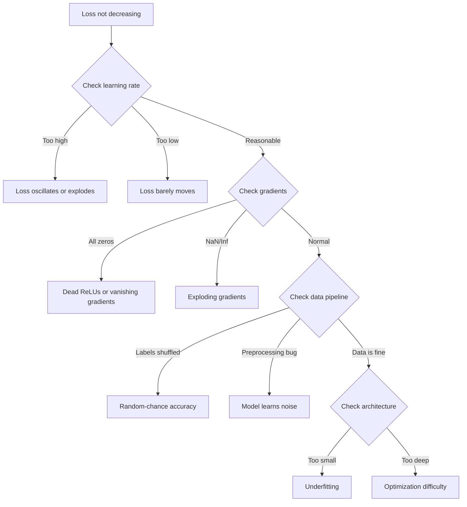
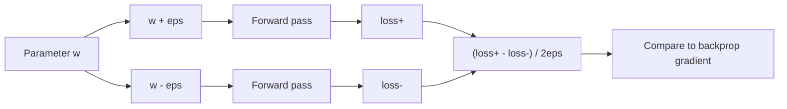
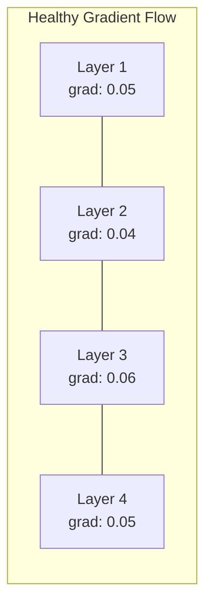
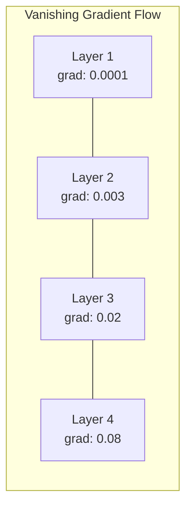
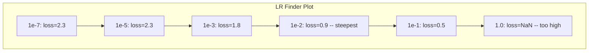

# تصحيح الشبكات العصبية
> تجميع شبكتك. ركض. أنتجت عددا. الرقم خاطئ ولا شيء تحطم. مرحبًا بك في أصعب أنواع تصحيح الأخطاء - النوع الذي لا توجد فيه أي رسالة خطأ.
**النوع:** ممارسة
**اللغات:** بايثون، PyTorch
**المتطلبات الأساسية:** المرحلة 03 الدروس 01-10 (خاصة الانتشار العكسي، ووظائف الخسارة، والمحسنات)
**الوقت:** ~90 دقيقة
## أهداف التعلم
- تشخيص حالات فشل الشبكة العصبية الشائعة (فقد NaN، منحنى الخسارة المسطح، التجهيز الزائد، التذبذب) باستخدام استراتيجيات تصحيح الأخطاء المنهجية
- قم بتطبيق تقنية "overfit one Batch" للتحقق من صحة بنية النموذج وحلقة التدريب
- فحص مقادير التدرج، وتوزيعات التنشيط، ومعايير الوزن لتحديد مشاكل التدرج التلاشي/الانفجار
- إنشاء قائمة مرجعية لتصحيح الأخطاء تغطي البيانات pipeline، وبنية النموذج، ووظيفة الخسارة، والمحسن، ومشكلات معدل التعلم
## المشكلة
تتعطل البرامج التقليدية عند كسرها. يلقي المؤشر الفارغ استثناءً. فشل عدم تطابق النوع في وقت الترجمة. ينتج عن خطأ واحد تلو الآخر مخرجات خاطئة بشكل واضح.
الشبكات العصبية لا تمنحك هذا الرفاهية.
تعمل الشبكة العصبية المعطلة على الانتهاء، وتطبع قيمة الخسارة، وتخرج التنبؤات. قد تنخفض الخسارة. قد تبدو التوقعات معقولة. لكن النموذج خاطئ بصمت - تعلم الاختصارات، أو حفظ الضوضاء، أو التقارب إلى الحد الأدنى المحلي عديم الفائدة. قدر باحثو Google أن 60-70% من ML وقت تصحيح الأخطاء يتم إنفاقه على الأخطاء "الصامتة" التي لا تنتج أي أخطاء ولكنها تؤدي إلى انخفاض جودة النموذج.
غالبًا ما يكون الفرق بين النموذج العامل والنموذج المكسور عبارة عن سطر واحد في غير مكانه: `zero_grad()` مفقود، وبُعد منقول، ومعدل تعلم يقل بمقدار 10x. تبدأ "وصفة تدريب الشبكات العصبية" (2019) الأساسية بهذا: "أخطاء الشبكة العصبية الأكثر شيوعًا هي الأخطاء التي لا تتعطل."
يعلمك هذا الدرس كيفية العثور على تلك الأخطاء.
##المفهوم
### عقلية التصحيح
ننسى تصحيح أخطاء الطباعة والصلاة. يتطلب تصحيح أخطاء الشبكة العصبية أسلوبًا منظمًا لأن حلقة ردود الفعل بطيئة (من دقائق إلى ساعات لكل عملية تدريب) والأعراض غامضة (قد تعني الخسارة السيئة 20 شيئًا مختلفًا).
القاعدة الذهبية: **ابدأ بسيطًا، وأضف التعقيد قطعة واحدة في كل مرة، وتحقق من كل قطعة بشكل مستقل.**


### العَرَض الأول: عدم انخفاض الخسارة
هذه هي الشكوى الأكثر شيوعا. تجري حلقة التدريب، وتمضي العصور، وتبقى الخسارة ثابتة أو تتأرجح بشكل كبير.
**معدل التعلم الخاطئ.** مرتفع جدًا: تتأرجح الخسارة أو تقفز إلى NaN. منخفض جدًا: تتناقص الخسارة ببطء شديد بحيث تبدو مسطحة. بالنسبة لآدم، ابدأ في 1e-3. بالنسبة لـ SGD، ابدأ في 1e-1 أو 1e-2. جرب دائمًا 3 معدلات تعلم تمتد كل منها 10x (على سبيل المثال، 1e-2، 1e-3، 1e-4) قبل استنتاج أن هناك شيئًا آخر خطأ.
**وحدات ReLU الميتة.** إذا تلقت خلية ReLU العصبية مدخلات سلبية كبيرة، فإنها تنتج 0 ويكون تدرجها 0. ولا يتم تنشيطها مرة أخرى أبدًا. إذا مات عدد كافٍ من الخلايا العصبية، فلن تتمكن الشبكة من التعلم. تحقق: قم بطباعة جزء التنشيط الذي يساوي 0 بالضبط بعد كل طبقة ReLU. إذا مات أكثر من 50%، قم بالتبديل إلى LeakyReLU أو قم بتقليل معدل التعلم.
**تلاشي التدرجات.** في الشبكات العميقة التي تحتوي على عمليات تنشيط سيني أو تانه، تتقلص التدرجات بشكل كبير أثناء انتشارها للخلف. بحلول الوقت الذي يصلون فيه إلى الطبقة الأولى، يكونون ~0. الطبقات الأولى تتوقف عن التعلم. الإصلاح: استخدم ReLU/GELU، أو أضف الاتصالات المتبقية، أو استخدم تسوية الدُفعات.
** انفجار التدرجات. ** المشكلة المعاكسة - تنمو التدرجات بشكل كبير. شائع في شبكات RNN والشبكات العميقة جدًا. الخسارة تقفز إلى NaN. إصلاح: قطع التدرج (`torch.nn.utils.clip_grad_norm_`)، أو خفض معدل التعلم، أو إضافة التسوية.
### العَرَض 2: انخفاض الخسارة ولكن النموذج سيء
الخسارة تنخفض. تصل دقة التدريب إلى 99%. لكن دقة الاختبار هي 55%. أو ينتج النموذج مخرجات لا معنى لها على بيانات حقيقية.
**التجهيز الزائد.** يحفظ النموذج بيانات التدريب بدلاً من أنماط التعلم. الفجوة بين التدريب وفقدان التحقق من الصحة تنمو مع مرور الوقت. الإصلاح: المزيد من البيانات، والتسرب، وتناقص الوزن، والتوقف المبكر، وزيادة البيانات.
**تسرب البيانات.** تسربت بيانات الاختبار إلى التدريب. الدقة عالية بشكل مثير للريبة. الأسباب الشائعة: الخلط قبل التقسيم، والمعالجة المسبقة للإحصائيات من مجموعة البيانات الكاملة، وتكرار العينات عبر الانقسامات. الإصلاح: التقسيم أولاً، المعالجة المسبقة ثانيًا، التحقق من التكرارات.
**أخطاء التسمية.** 5-10% من التسميات في معظم مجموعات البيانات الحقيقية خاطئة (Northcutt et al., 2021 - "أخطاء التسمية المنتشرة في مجموعات الاختبار"). يتعلم النموذج الضوضاء. الإصلاح: استخدم التعلم الواثق للعثور على الأمثلة ذات التسمية الخاطئة وإصلاحها، أو استخدم اقتطاع الخسارة لتجاهل العينات عالية الخسارة.
### العَرَض 3: فقدان NaN أو Inf
تصبح قيمة الخسارة `nan` أو `inf`. التدريب ميت.
**معدل التعلم مرتفع جدًا.** تجاوزت التحديثات المتدرجة الحد الأقصى لدرجة أن الأوزان تنفجر. الإصلاح: تقليل بمقدار 10x.
**log(0) أو log(negative).** حساب الخسارة عبر الإنتروبيا `log(p)`. إذا كان النموذج الخاص بك يُخرج بالضبط 0 أو احتمالًا سلبيًا، فسيتم انفجار السجل. إصلاح: تثبيت التوقعات على `[eps, 1-eps]` حيث `eps=1e-7`.
** القسمة على صفر. ** تطبيع الدفعة يقسم على الانحراف المعياري. الدفعة ذات القيم الثابتة لها std=0. الإصلاح: أضف epsilon إلى المقام (PyTorch يفعل ذلك بشكل افتراضي، ولكن قد لا تفعل ذلك التطبيقات المخصصة).
**تجاوز العددي.** تؤدي عمليات التنشيط الكبيرة التي يتم إدخالها في `exp()` إلى إنتاج Inf. Softmax عرضة بشكل خاص. الإصلاح: اطرح الحد الأقصى قبل الأسي (خدعة log-sum-exp).
### التقنية الأولى: فحص التدرج
قارن التدرجات التحليلية (من الدعامة الخلفية) بالتدرجات العددية (من الاختلافات المحدودة). إذا اختلفوا، فإن تمريرتك الخلفية بها خطأ.
التدرج الرقمي للمعلمة `w`:
```
grad_numerical = (loss(w + eps) - loss(w - eps)) / (2 * eps)
```

مقياس الاتفاق (الفرق النسبي):
```
rel_diff = |grad_analytical - grad_numerical| / max(|grad_analytical|, |grad_numerical|, 1e-8)
```

إذا `rel_diff < 1e-5`: صحيح. إذا كان `rel_diff > 1e-3`: من المؤكد تقريبًا وجود خطأ.


### التقنية الثانية: إحصائيات التنشيط
مراقبة المتوسط ​​والانحراف المعياري للتنشيطات بعد كل طبقة أثناء التدريب. تحافظ الشبكات السليمة على عمليات التنشيط بمتوسط ​​قريب من 0 وstd بالقرب من 1 (بعد التطبيع) أو على الأقل يحدها.
| مؤشر الصحة | يعني | الأمراض المنقولة جنسيا | التشخيص |
|-----------------|------|-----|-----------|
| صحي | ~0 | ~1 | الشبكة تتعلم بشكل طبيعي |
| مشبعة | >>0 أو <<0 | ~0 | التنشيط عالق عند القيم القصوى |
| ميت | 0 | 0 | الخلايا العصبية ميتة (جميع الأصفار) |
| تنفجر | >>10 | >>10 | التنشيط ينمو بلا حدود |
### التقنية الثالثة: تصور التدفق المتدرج
رسم متوسط ​​حجم التدرج لكل طبقة. في الشبكة السليمة، يجب أن تكون أحجام التدرج متشابهة تقريبًا عبر الطبقات. إذا كانت الطبقات المبكرة تحتوي على تدرجات أصغر بمقدار 1000 مرة من الطبقات اللاحقة، فهذا يعني أن لديك تدرجات متلاشية.




### التقنية الرابعة: اختبار التجهيز الزائد للدفعة الواحدة
تقنية التصحيح الأكثر أهمية في التعلم العميق.
خذ دفعة واحدة صغيرة (8-32 عينة). تدرب عليه لأكثر من 100 تكرار. يجب أن تصل الخسارة إلى ما يقرب من الصفر ويجب أن تصل دقة التدريب إلى 100٪. إذا لم يحدث ذلك، فهذا يعني أن النموذج أو حلقة التدريب الخاصة بك بها خطأ أساسي - فلا تنتقل إلى التدريب الكامل.
هذا الاختبار يمسك:
- وظائف الخسارة المكسورة
- تمريرات خلفية مكسورة
- البنية صغيرة جدًا بحيث لا تمثل البيانات
- المحسن غير متصل بمعلمات النموذج
- البيانات والتسميات غير محاذية
يستغرق هذا 30 ثانية للتشغيل ويوفر ساعات من تصحيح الأخطاء لعمليات التدريب الكاملة.
### التقنية الخامسة: الباحث عن معدل التعلم
اقترح ليزلي سميث (2017) مسح معدل التعلم من صغير جدًا (1e-7) إلى كبير جدًا (10) خلال فترة واحدة أثناء تسجيل الخسارة. خسارة المؤامرة مقابل معدل التعلم. معدل التعلم الأمثل هو تقريبًا 10 مرات أصغر من المعدل الذي تبدأ فيه الخسارة في الانخفاض بشكل أسرع.


أفضل LR في هذا المثال: ~1e-3 (ترتيب واحد من حيث الحجم قبل النقطة الأكثر انحدارًا).
### أخطاء PyTorch الشائعة
هذه هي الأخطاء التي تضيع معظم الساعات الجماعية في مجتمع PyTorch:
| علة | العَرَض | إصلاح |
|-----|---------|-----|
| نسيان `optimizer.zero_grad()` | تتراكم التدرجات عبر الدفعات، وتتأرجح الخسارة | أضف `optimizer.zero_grad()` قبل `loss.backward()` |
| نسيان `model.eval()` وقت الاختبار | يتصرف معيار التسرب والدفعة بشكل مختلف، وتختلف دقة الاختبار بين عمليات التشغيل | أضف `model.eval()` و `torch.no_grad()` |
| أشكال موتر خاطئة | البث الصامت يعطي نتائج خاطئة لا خطأ | طباعة الأشكال بعد كل عملية أثناء التصحيح |
| CPU/GPU عدم تطابق | __الكود_6__ | استخدم `.to(device)` في بيانات النموذج AND |
| عدم فصل الموترات | الرسم البياني الحسابي ينمو إلى الأبد، OOM | استخدم `.detach()` أو `with torch.no_grad()` |
| العمليات الموضعية التي تكسر Autograd | `RuntimeError: modified by in-place operation` | استبدل `x += 1` بـ `x = x + 1` |
| لم يتم تطبيع البيانات | الخسارة عالقة عند مستوى الفرصة العشوائية | تطبيع المدخلات إلى المتوسط=0، std=1 |
| التسميات كـ dtype خاطئة | تتوقع الإنتروبيا المتقاطعة `Long`، حصلت على `Float` | تسميات طاقم العمل: `labels.long()` |
### جدول التصحيح الرئيسي
| العَرَض | السبب المحتمل | أول شيء يجب تجربته |
|---------|------------|------------------|
| الخسارة عالقة في -log(1/num_classes) | نموذج يتنبأ بالتوزيع الموحد | التحقق من البيانات pipeline، والتحقق من تطابق التسميات مع المدخلات |
| خسارة NaN بعد خطوات قليلة | معدل التعلم مرتفع جدًا | تقليل LR بمقدار 10x |
| خسارة NaN على الفور | سجل (0) أو القسمة على صفر | أضف إبسيلون إلى عمليات السجل/التقسيم |
| خسارة تتأرجح بعنف | LR مرتفع جدًا أو حجم الدفعة صغير جدًا | تقليل LR وزيادة حجم الدفعة |
| تتناقص الخسارة ثم الهضاب | LR مرتفع جدًا بالنسبة لمرحلة الضبط الدقيق | أضف جدول LR (جيب التمام أو تسوس الخطوة) |
| تدريب ACC مرتفع، واختبار ACC منخفض | التجهيز الزائد | إضافة التسرب، وتسوس الوزن، والمزيد من البيانات |
| حساب التدريب = اختبار حساب = فرصة | نموذج لا يتعلم أي شيء | تشغيل اختبار التجهيز الزائد دفعة واحدة |
| حساب التدريب = اختبار حساب لكن كلاهما منخفض | غير مناسب | نموذج أكبر، طبقات أكثر، المزيد من الميزات |
| التدرجات كلها صفر | ReLUs الميتة أو الرسم البياني الحسابي المنفصل | قم بالتبديل إلى LeakyReLU، حدد `.requires_grad` |
| نفاد الذاكرة أثناء التدريب | الدفعة كبيرة جدًا أو لم يتم تحرير الرسم البياني | قم بتقليل حجم الدفعة، استخدم `torch.no_grad()` للتقييم |
## بنائها
مجموعة أدوات تشخيصية تراقب عمليات التنشيط والتدرجات ومنحنيات الخسارة. سوف تقوم بكسر الشبكة عمدًا واستخدام مجموعة الأدوات لتشخيص كل مشكلة.
### الخطوة 1: فئة NetworkDebugger
يتم ربطه بنموذج PyTorch لتسجيل إحصائيات التنشيط والتدرج لكل طبقة.
```python
import torch
import torch.nn as nn
import math


class NetworkDebugger:
    def __init__(self, model):
        self.model = model
        self.activation_stats = {}
        self.gradient_stats = {}
        self.loss_history = []
        self.lr_losses = []
        self.hooks = []
        self._register_hooks()

    def _register_hooks(self):
        for name, module in self.model.named_modules():
            if isinstance(module, (nn.Linear, nn.Conv2d, nn.ReLU, nn.LeakyReLU)):
                hook = module.register_forward_hook(self._make_activation_hook(name))
                self.hooks.append(hook)
                hook = module.register_full_backward_hook(self._make_gradient_hook(name))
                self.hooks.append(hook)

    def _make_activation_hook(self, name):
        def hook(module, input, output):
            with torch.no_grad():
                out = output.detach().float()
                self.activation_stats[name] = {
                    "mean": out.mean().item(),
                    "std": out.std().item(),
                    "fraction_zero": (out == 0).float().mean().item(),
                    "min": out.min().item(),
                    "max": out.max().item(),
                }
        return hook

    def _make_gradient_hook(self, name):
        def hook(module, grad_input, grad_output):
            if grad_output[0] is not None:
                with torch.no_grad():
                    grad = grad_output[0].detach().float()
                    self.gradient_stats[name] = {
                        "mean": grad.mean().item(),
                        "std": grad.std().item(),
                        "abs_mean": grad.abs().mean().item(),
                        "max": grad.abs().max().item(),
                    }
        return hook

    def record_loss(self, loss_value):
        self.loss_history.append(loss_value)

    def check_loss_health(self):
        if len(self.loss_history) < 2:
            return "NOT_ENOUGH_DATA"
        recent = self.loss_history[-10:]
        if any(math.isnan(v) or math.isinf(v) for v in recent):
            return "NAN_OR_INF"
        if len(self.loss_history) >= 20:
            first_half = sum(self.loss_history[:10]) / 10
            second_half = sum(self.loss_history[-10:]) / 10
            if second_half >= first_half * 0.99:
                return "NOT_DECREASING"
        if len(recent) >= 5:
            diffs = [recent[i+1] - recent[i] for i in range(len(recent)-1)]
            if max(diffs) - min(diffs) > 2 * abs(sum(diffs) / len(diffs)):
                return "OSCILLATING"
        return "HEALTHY"

    def check_activations(self):
        issues = []
        for name, stats in self.activation_stats.items():
            if stats["fraction_zero"] > 0.5:
                issues.append(f"DEAD_NEURONS: {name} has {stats['fraction_zero']:.0%} zero activations")
            if abs(stats["mean"]) > 10:
                issues.append(f"EXPLODING_ACTIVATIONS: {name} mean={stats['mean']:.2f}")
            if stats["std"] < 1e-6:
                issues.append(f"COLLAPSED_ACTIVATIONS: {name} std={stats['std']:.2e}")
        return issues if issues else ["HEALTHY"]

    def check_gradients(self):
        issues = []
        grad_magnitudes = []
        for name, stats in self.gradient_stats.items():
            grad_magnitudes.append((name, stats["abs_mean"]))
            if stats["abs_mean"] < 1e-7:
                issues.append(f"VANISHING_GRADIENT: {name} abs_mean={stats['abs_mean']:.2e}")
            if stats["abs_mean"] > 100:
                issues.append(f"EXPLODING_GRADIENT: {name} abs_mean={stats['abs_mean']:.2e}")
        if len(grad_magnitudes) >= 2:
            first_mag = grad_magnitudes[0][1]
            last_mag = grad_magnitudes[-1][1]
            if last_mag > 0 and first_mag / last_mag > 100:
                issues.append(f"GRADIENT_RATIO: first/last = {first_mag/last_mag:.0f}x (vanishing)")
        return issues if issues else ["HEALTHY"]

    def print_report(self):
        print("\n=== NETWORK DEBUGGER REPORT ===")
        print(f"\nLoss health: {self.check_loss_health()}")
        if self.loss_history:
            print(f"  Last 5 losses: {[f'{v:.4f}' for v in self.loss_history[-5:]]}")
        print("\nActivation diagnostics:")
        for item in self.check_activations():
            print(f"  {item}")
        print("\nGradient diagnostics:")
        for item in self.check_gradients():
            print(f"  {item}")
        print("\nPer-layer activation stats:")
        for name, stats in self.activation_stats.items():
            print(f"  {name}: mean={stats['mean']:.4f} std={stats['std']:.4f} zero={stats['fraction_zero']:.1%}")
        print("\nPer-layer gradient stats:")
        for name, stats in self.gradient_stats.items():
            print(f"  {name}: abs_mean={stats['abs_mean']:.2e} max={stats['max']:.2e}")

    def remove_hooks(self):
        for hook in self.hooks:
            hook.remove()
        self.hooks.clear()
```

### الخطوة الثانية: اختبار التجهيز الزائد لدفعة واحدة
```python
def overfit_one_batch(model, x_batch, y_batch, criterion, lr=0.01, steps=200):
    optimizer = torch.optim.Adam(model.parameters(), lr=lr)
    model.train()
    print("\n=== OVERFIT ONE BATCH TEST ===")
    print(f"Batch size: {x_batch.shape[0]}, Steps: {steps}")

    for step in range(steps):
        optimizer.zero_grad()
        output = model(x_batch)
        loss = criterion(output, y_batch)
        loss.backward()
        optimizer.step()

        if step % 50 == 0 or step == steps - 1:
            with torch.no_grad():
                preds = (output > 0).float() if output.shape[-1] == 1 else output.argmax(dim=1)
                targets = y_batch if y_batch.dim() == 1 else y_batch.squeeze()
                acc = (preds.squeeze() == targets).float().mean().item()
            print(f"  Step {step:3d} | Loss: {loss.item():.6f} | Accuracy: {acc:.1%}")

    final_loss = loss.item()
    if final_loss > 0.1:
        print(f"\n  FAIL: Loss did not converge ({final_loss:.4f}). Model or training loop is broken.")
        return False
    print(f"\n  PASS: Loss converged to {final_loss:.6f}")
    return True
```

### الخطوة 3: الباحث عن معدل التعلم
```python
def find_learning_rate(model, x_data, y_data, criterion, start_lr=1e-7, end_lr=10, steps=100):
    import copy
    original_state = copy.deepcopy(model.state_dict())
    optimizer = torch.optim.SGD(model.parameters(), lr=start_lr)
    lr_mult = (end_lr / start_lr) ** (1 / steps)

    model.train()
    results = []
    best_loss = float("inf")
    current_lr = start_lr

    print("\n=== LEARNING RATE FINDER ===")

    for step in range(steps):
        optimizer.zero_grad()
        output = model(x_data)
        loss = criterion(output, y_data)

        if math.isnan(loss.item()) or loss.item() > best_loss * 10:
            break

        best_loss = min(best_loss, loss.item())
        results.append((current_lr, loss.item()))

        loss.backward()
        optimizer.step()

        current_lr *= lr_mult
        for param_group in optimizer.param_groups:
            param_group["lr"] = current_lr

    model.load_state_dict(original_state)

    if len(results) < 10:
        print("  Could not complete LR sweep -- loss diverged too quickly")
        return results

    min_loss_idx = min(range(len(results)), key=lambda i: results[i][1])
    suggested_lr = results[max(0, min_loss_idx - 10)][0]

    print(f"  Swept {len(results)} steps from {start_lr:.0e} to {results[-1][0]:.0e}")
    print(f"  Minimum loss {results[min_loss_idx][1]:.4f} at lr={results[min_loss_idx][0]:.2e}")
    print(f"  Suggested learning rate: {suggested_lr:.2e}")

    return results
```

### الخطوة 4: مدقق التدرج
```python
def _flat_to_multi_index(flat_idx, shape):
    multi_idx = []
    remaining = flat_idx
    for dim in reversed(shape):
        multi_idx.insert(0, remaining % dim)
        remaining //= dim
    return tuple(multi_idx)


def gradient_check(model, x, y, criterion, eps=1e-4):
    model.train()
    x_double = x.double()
    y_double = y.double()
    model_double = model.double()

    print("\n=== GRADIENT CHECK ===")
    overall_max_diff = 0
    checked = 0

    for name, param in model_double.named_parameters():
        if not param.requires_grad:
            continue

        layer_max_diff = 0

        model_double.zero_grad()
        output = model_double(x_double)
        loss = criterion(output, y_double)
        loss.backward()
        analytical_grad = param.grad.clone()

        num_checks = min(5, param.numel())
        for i in range(num_checks):
            idx = _flat_to_multi_index(i, param.shape)
            original = param.data[idx].item()

            param.data[idx] = original + eps
            with torch.no_grad():
                loss_plus = criterion(model_double(x_double), y_double).item()

            param.data[idx] = original - eps
            with torch.no_grad():
                loss_minus = criterion(model_double(x_double), y_double).item()

            param.data[idx] = original

            numerical = (loss_plus - loss_minus) / (2 * eps)
            analytical = analytical_grad[idx].item()

            denom = max(abs(numerical), abs(analytical), 1e-8)
            rel_diff = abs(numerical - analytical) / denom

            layer_max_diff = max(layer_max_diff, rel_diff)
            checked += 1

        overall_max_diff = max(overall_max_diff, layer_max_diff)
        status = "OK" if layer_max_diff < 1e-5 else "MISMATCH"
        print(f"  {name}: max_rel_diff={layer_max_diff:.2e} [{status}]")

    model.float()

    print(f"\n  Checked {checked} parameters")
    if overall_max_diff < 1e-5:
        print("  PASS: Gradients match (rel_diff < 1e-5)")
    elif overall_max_diff < 1e-3:
        print("  WARN: Small differences (1e-5 < rel_diff < 1e-3)")
    else:
        print("  FAIL: Gradient mismatch detected (rel_diff > 1e-3)")
    return overall_max_diff
```

### الخطوة 5: الشبكات المعطلة عمدًا
الآن قم بتطبيق مجموعة الأدوات على الشبكات المعطلة وقم بتشخيص كل واحدة منها.
```python
def demo_broken_networks():
    torch.manual_seed(42)
    x = torch.randn(64, 10)
    y = (x[:, 0] > 0).long()

    print("\n" + "=" * 60)
    print("BUG 1: Learning rate too high (lr=10)")
    print("=" * 60)
    model1 = nn.Sequential(nn.Linear(10, 32), nn.ReLU(), nn.Linear(32, 2))
    debugger1 = NetworkDebugger(model1)
    optimizer1 = torch.optim.SGD(model1.parameters(), lr=10.0)
    criterion = nn.CrossEntropyLoss()
    for step in range(20):
        optimizer1.zero_grad()
        out = model1(x)
        loss = criterion(out, y)
        debugger1.record_loss(loss.item())
        loss.backward()
        optimizer1.step()
    debugger1.print_report()
    debugger1.remove_hooks()

    print("\n" + "=" * 60)
    print("BUG 2: Dead ReLUs from bad initialization")
    print("=" * 60)
    model2 = nn.Sequential(nn.Linear(10, 32), nn.ReLU(), nn.Linear(32, 32), nn.ReLU(), nn.Linear(32, 2))
    with torch.no_grad():
        for m in model2.modules():
            if isinstance(m, nn.Linear):
                m.weight.fill_(-1.0)
                m.bias.fill_(-5.0)
    debugger2 = NetworkDebugger(model2)
    optimizer2 = torch.optim.Adam(model2.parameters(), lr=1e-3)
    for step in range(50):
        optimizer2.zero_grad()
        out = model2(x)
        loss = criterion(out, y)
        debugger2.record_loss(loss.item())
        loss.backward()
        optimizer2.step()
    debugger2.print_report()
    debugger2.remove_hooks()

    print("\n" + "=" * 60)
    print("BUG 3: Missing zero_grad (gradients accumulate)")
    print("=" * 60)
    model3 = nn.Sequential(nn.Linear(10, 32), nn.ReLU(), nn.Linear(32, 2))
    debugger3 = NetworkDebugger(model3)
    optimizer3 = torch.optim.SGD(model3.parameters(), lr=0.01)
    for step in range(50):
        out = model3(x)
        loss = criterion(out, y)
        debugger3.record_loss(loss.item())
        loss.backward()
        optimizer3.step()
    debugger3.print_report()
    debugger3.remove_hooks()

    print("\n" + "=" * 60)
    print("HEALTHY NETWORK: Correct setup for comparison")
    print("=" * 60)
    model_good = nn.Sequential(nn.Linear(10, 32), nn.ReLU(), nn.Linear(32, 2))
    debugger_good = NetworkDebugger(model_good)
    optimizer_good = torch.optim.Adam(model_good.parameters(), lr=1e-3)
    for step in range(50):
        optimizer_good.zero_grad()
        out = model_good(x)
        loss = criterion(out, y)
        debugger_good.record_loss(loss.item())
        loss.backward()
        optimizer_good.step()
    debugger_good.print_report()
    debugger_good.remove_hooks()

    print("\n" + "=" * 60)
    print("OVERFIT-ONE-BATCH TEST (healthy model)")
    print("=" * 60)
    model_test = nn.Sequential(nn.Linear(10, 32), nn.ReLU(), nn.Linear(32, 2))
    overfit_one_batch(model_test, x[:8], y[:8], criterion)

    print("\n" + "=" * 60)
    print("LEARNING RATE FINDER")
    print("=" * 60)
    model_lr = nn.Sequential(nn.Linear(10, 32), nn.ReLU(), nn.Linear(32, 2))
    find_learning_rate(model_lr, x, y, criterion)

    print("\n" + "=" * 60)
    print("GRADIENT CHECK")
    print("=" * 60)
    model_grad = nn.Sequential(nn.Linear(10, 8), nn.ReLU(), nn.Linear(8, 2))
    gradient_check(model_grad, x[:4], y[:4], criterion)
```

## استخدمه
### PyTorch الأدوات المدمجة
```python
import torch
import torch.nn as nn

model = nn.Sequential(
    nn.Linear(768, 256),
    nn.ReLU(),
    nn.Linear(256, 10),
)

with torch.autograd.detect_anomaly():
    output = model(input_tensor)
    loss = criterion(output, target)
    loss.backward()

for name, param in model.named_parameters():
    if param.grad is not None:
        print(f"{name}: grad_mean={param.grad.abs().mean():.2e}")
```

### تكامل الأوزان والتحيزات
```python
import wandb

wandb.init(project="debug-training")

for epoch in range(100):
    loss = train_one_epoch()
    wandb.log({
        "loss": loss,
        "lr": optimizer.param_groups[0]["lr"],
        "grad_norm": torch.nn.utils.clip_grad_norm_(model.parameters(), float("inf")),
    })

    for name, param in model.named_parameters():
        if param.grad is not None:
            wandb.log({f"grad/{name}": wandb.Histogram(param.grad.cpu().numpy())})
```

### TensorBoard
```python
from torch.utils.tensorboard import SummaryWriter

writer = SummaryWriter("runs/debug_experiment")

for epoch in range(100):
    loss = train_one_epoch()
    writer.add_scalar("Loss/train", loss, epoch)

    for name, param in model.named_parameters():
        writer.add_histogram(f"weights/{name}", param, epoch)
        if param.grad is not None:
            writer.add_histogram(f"gradients/{name}", param.grad, epoch)
```

### قائمة التحقق من تصحيح الأخطاء (قبل التدريب الكامل)
1. قم بإجراء اختبار التجهيز الزائد لدفعة واحدة. إذا فشلت، توقف.
2. طباعة ملخص النموذج - التحقق من أن عدد المعلمات معقول.
3. قم بتشغيل تمريرة أمامية واحدة ببيانات عشوائية - تحقق من شكل الإخراج.
4. تدرب لمدة 5 فترات - تحقق من انخفاض الخسارة.
5. تحقق من إحصائيات التنشيط - لا توجد طبقات ميتة، ولا توجد انفجارات.
6. تحقق من تدفق التدرج - لا يختفي ولا ينفجر.
7. التحقق من البيانات pipeline - طباعة 5 عينات عشوائية مع التسميات.
## اشحنها
ينتج هذا الدرس:
- `outputs/prompt-nn-debugger.md` -- مطالبة لتشخيص فشل تدريب الشبكة العصبية
- `outputs/skill-debug-checklist.md` -- قائمة مرجعية لشجرة القرار لتصحيح أخطاء التدريب
أنماط النشر الرئيسية لتصحيح الأخطاء:
- إضافة خطافات مراقبة إلى نصوص التدريب على الإنتاج
- سجل إحصائيات التنشيط والتدرج إلى W&B أو TensorBoard في كل N خطوة
- تنفيذ تنبيهات تلقائية لفقدان NaN، أو الخلايا العصبية الميتة (> 80% صفر)، أو انفجار متدرج
- قم دائمًا بإجراء اختبار التجهيز الزائد دفعة واحدة عند تغيير البنيات أو البيانات pipelines
## تمارين
1. **أضف كاشف التدرج المتفجر.** قم بتعديل `NetworkDebugger` لاكتشاف متى تتجاوز التدرجات الحد الأدنى واقتراح قيمة قطع التدرج تلقائيًا. اختبره على شبكة مكونة من 20 طبقة بدون تطبيع.
2. ** قم ببناء جهاز إحياء الخلايا العصبية الميتة. ** اكتب دالة تحدد خلايا ReLU العصبية الميتة (تخرج دائمًا 0) وتعيد تهيئة أوزانها الواردة من خلال تهيئة Kaiming. أظهر أن هذا يستعيد شبكة ماتت فيها أكثر من 70% من الخلايا العصبية.
3. **تنفيذ أداة البحث عن معدل التعلم من خلال التخطيط.** قم بتوسيع `find_learning_rate` لحفظ النتائج بتنسيق CSV وكتابة برنامج نصي منفصل يقرأ CSV ويعرض LR مقابل منحنى الخسارة باستخدام matplotlib. حدد LR الأمثل لـ ResNet-18 في CIFAR-10.
4. **قم بإنشاء أداة التحقق من خط البيانات pipeline.** اكتب دالة تتحقق من: العينات المكررة عبر تقسيمات التدريب/الاختبار، وعدم توازن توزيع الملصقات (> نسبة 10:1)، وتسوية الإدخال (المتوسط ​​بالقرب من 0، والقياس بالقرب من 1)، وقيم NaN/Inf في البيانات. تشغيله على مجموعة بيانات تالفة عمدا.
5. **تصحيح فشل حقيقي.** خذ إطار العمل المصغر من الدرس 10، وأدخل خطأً دقيقًا (على سبيل المثال، تبديل مصفوفة الوزن إلى الخلف)، واستخدم فحص التدرج لتحديد المعلمة التي تحتوي على تدرجات غير صحيحة بالضبط. توثيق عملية التصحيح.
## المصطلحات الرئيسية
| مصطلح | ماذا يقول الناس | ماذا يعني في الواقع |
|------|----------------|----------------------|
| علة صامتة | "إنه يركض ولكنه يعطي نتائج سيئة" | خطأ لا ينتج عنه أي خطأ ولكنه يقلل من جودة النموذج - وضع الفشل السائد في ML |
| الميت ريلو | "ماتت الخلايا العصبية" | خلية عصبية ReLU تكون مدخلاتها سلبية دائمًا، لذا فهي تنتج 0 وتستقبل 0 تدرجًا بشكل دائم |
| تلاشي التدرجات | "الطبقات المبكرة تتوقف عن التعلم" | تتقلص التدرجات بشكل كبير خلال الطبقات، مما يجعل الأوزان في الطبقات المبكرة مجمدة بشكل فعال |
| انفجار التدرجات | "ذهبت الخسارة إلى NaN" | تنمو التدرجات بشكل كبير عبر الطبقات، مما يتسبب في تحديثات الوزن كبيرة جدًا لدرجة أنها تفيض |
| فحص التدرج | "التحقق من صحة الدعامة الخلفية" | مقارنة التدرجات التحليلية من الدعامة الخلفية إلى التدرجات العددية من الاختلافات المحدودة |
| التجهيز الزائد دفعة واحدة | "اختبار التصحيح الأكثر أهمية" | التدريب على دفعة صغيرة واحدة للتحقق من النموذج CAN تعلم - إذا لم يكن الأمر كذلك، فهذا يعني أن هناك شيئًا معطلًا بشكل أساسي |
| LR مكتشف | "قم بالمسح للعثور على معدل التعلم المناسب" | زيادة معدل التعلم بشكل كبير خلال فترة واحدة واختيار المعدل قبل تباعد الخسارة مباشرة |
| تسرب البيانات | "تسرب بيانات الاختبار إلى التدريب" | عندما تلوث المعلومات الواردة من مجموعة الاختبار التدريب، مما ينتج عنه دقة عالية بشكل مصطنع |
| إحصائيات التنشيط | "مراقبة صحة الطبقة" | تتبع المتوسط ​​والقياسي والجزء الصفري من مخرجات كل طبقة لاكتشاف الخلايا العصبية الميتة أو المشبعة أو المنفجرة |
| قطع التدرج | "الحد من حجم التدرج" | تقليص حجم التدرجات عندما يتجاوز معيارها الحد، مما يمنع انفجار تحديثات التدرج |
## مزيد من القراءة
- سميث، "معدلات التعلم الدورية لتدريب الشبكات العصبية" (2017) - الورقة التي تقدم اختبار نطاق معدل التعلم (LR Finder)
- Northcutt وآخرون، "أخطاء التسمية المنتشرة في مجموعات الاختبار تزعزع استقرار معايير التعلم الآلي" (2021) - يوضح أن 3-6% من التسميات في ImageNet، CIFAR-10، والمعايير الرئيسية الأخرى خاطئة
- تشانغ وآخرون، "فهم التعلم العميق يتطلب إعادة التفكير في التعميم" (2017) - الورقة التي توضح أن الشبكات العصبية يمكنها حفظ التسميات العشوائية، وهذا هو سبب نجاح اختبار التجهيز الزائد لدفعة واحدة
- وثائق PyTorch حول `torch.autograd.detect_anomaly` و`torch.autograd.set_detect_anomaly` لاكتشاف NaN/Inf المدمج