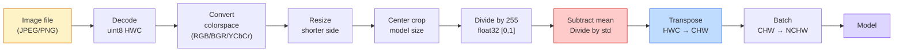
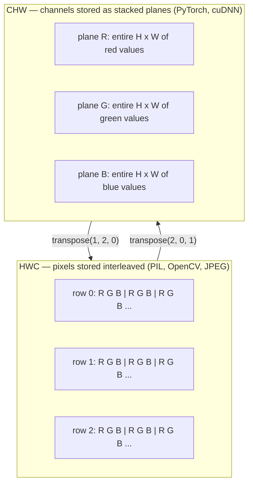

# أساسيات الصورة - البكسل، والقنوات، ومساحات الألوان
> الصورة عبارة عن موتر لعينات الضوء. كل نموذج رؤية ستستخدمه يبدأ من هذه الحقيقة الواحدة.
**النوع:** بناء
** اللغات: ** بايثون
**المتطلبات الأساسية:** المرحلة الأولى الدرس 12 (عمليات الموتر)، المرحلة الثالثة الدرس 11 (مقدمة إلى PyTorch)
**الوقت:** ~45 دقيقة
## أهداف التعلم
- اشرح كيف يتم تقسيم المشهد المستمر إلى وحدات بكسل ولماذا تحدد قرارات أخذ العينات/التكميم السقف لكل نموذج نهائي
- قراءة الصور وتقطيعها وفحصها كمصفوفات NumPy والتبديل بسلاسة بين تخطيطات HWC وCHW
- التحويل بين RGB، والتدرج الرمادي، وHSV، وYCbCr وتبرير سبب وجود كل مساحة لونية
- تطبيق المعالجة المسبقة على مستوى البكسل (التطبيع، والتوحيد، وتغيير الحجم، والقناة أولاً) تمامًا كما تتوقعها torchvision
## المشكلة
كل ورقة ستقرأها، وكل وزن مدرب مسبقًا ستقوم بتنزيله، وكل رؤية API ستستدعيها تفترض تشفيرًا محددًا للمدخلات. قم بتمرير صورة `uint8` حيث يريد النموذج `float32` وسيظل قيد التشغيل - وينتج القمامة بصمت. قم بتغذية BGR إلى شبكة تم تدريبها على RGB وستنخفض الدقة بمقدار عشر نقاط. قم بتسليم نموذج قنوات - الإدخال الأخير عندما تتوقع القنوات - أولاً وتتعامل طبقة التحويل الأولى مع الارتفاع كقناة مميزة. لا شيء من هذا يلقي خطأ. إنه يدمر مقاييسك فحسب، وتقضي أسبوعًا في البحث عن خطأ يكمن في كيفية تحميل الملف.
الالتواء ليس معقدًا بمجرد أن تعرف ما ينزلق عليه. الجزء الصعب هو أن "الصورة" تعني أشياء مختلفة بالنسبة للكاميرا، ووحدة فك ترميز JPEG، وPIL، وOpenCV، وtorchvision، ونواة CUDA. يحتوي كل مكدس على ترتيب المحور الخاص به ونطاق البايت واتفاقية القناة. مهندس رؤية لا يستطيع إبقاء هذه السفن المستقيمة مكسورة pipelines.
يعمل هذا الدرس على إصلاح الأساس حتى تتمكن بقية المرحلة من البناء عليه. في النهاية ستعرف ما هو البكسل، ولماذا يوجد ثلاثة أرقام لكل بكسل بدلاً من واحد، وما الذي يفعله "التطبيع باستخدام إحصائيات ImageNet" بالفعل، وكيفية التنقل بين التخطيطين أو الثلاثة التي سيفترضها كل درس آخر في هذه المرحلة.
##المفهوم
### خط المعالجة المسبقة الكامل pipe في لمحة
كل نظام رؤية للإنتاج هو نفس تسلسل التحويلات القابلة للعكس. إذا أخطأت في خطوة واحدة فسيرى النموذج مدخلات مختلفة عما تم تدريبه عليه.


الصندوقان الأحمر والأزرق هما المكان الذي تعيش فيه 80% من حالات الفشل الصامتة: فقدان التوحيد القياسي والتخطيط الخاطئ.
### البكسل هو عينة وليس مربعًا
يقوم مستشعر الكاميرا بإحصاء الفوتونات التي تهبط على شبكة من أجهزة الكشف الصغيرة. يقوم كل كاشف بدمج الضوء لجزء من الثانية ويصدر جهدًا يتناسب مع عدد الفوتونات التي تصل إليه. ثم يقوم المستشعر بفصل هذا الجهد إلى عدد صحيح. كاشف واحد يصبح بكسل واحد.
```
Continuous scene                 Sensor grid                     Digital image
(infinite detail)                (H x W detectors)               (H x W integers)

    ~~~~~                        +--+--+--+--+--+                 210 198 180 155 120
~ ~ ~ |  |  |  |  |  |                 205 195 178 152 118
  ~ ضوء ~ ----> +--+--+--+--+--+ ----> 200 190 175 150 115   ~~~~~                         |  |  |  |  |  |                 195 185 170 148 112
                                 +--+--+--+--+--+                 188 180 165 145 108
```

يحدث خياران في هذه الخطوة ويقومان بتثبيت السقف على كل شيء في اتجاه مجرى النهر:
- **العينات المكانية** تحدد عدد أجهزة الكشف لكل درجة من المشهد. عدد قليل جدًا، وتصبح الحواف خشنة (متعرجة). عدد كبير جدًا، وينفجر التخزين والحوسبة.
- **تكميم الشدة** يحدد مدى دقة تفريغ الجهد. 8 بت تعطي 256 مستوى وهي قياسية للعرض. 10، 12، 16 بت تعطي تدرجات أكثر سلاسة وأهمية للتصوير الطبي، HDR، وخطوط المستشعر الخام pipelines.
البكسل ليس مربعًا ملونًا بمساحة. وهو قياس واحد. عندما تقوم بتغيير الحجم أو التدوير، فإنك تقوم بإعادة تشكيل شبكة القياس تلك.
### لماذا ثلاث قنوات
يقوم أحد الكاشفات بإحصاء الفوتونات عبر الطيف المرئي بأكمله، وهو التدرج الرمادي. للحصول على اللون، يقوم المستشعر بتغطية الشبكة بفسيفساء من المرشحات الحمراء والخضراء والزرقاء. بعد إزالة التركيب، يحتوي كل موقع مكاني على ثلاثة أعداد صحيحة: استجابة الكاشف الذي تمت تصفيته باللون الأحمر، واستجابة الكاشف الذي تمت تصفيته باللون الأخضر، والاستجابة التي تمت تصفيتها باللون الأزرق في مكان قريب. هذه الأعداد الصحيحة الثلاثة هي ثلاثية RGB للبيكسل.
```
One pixel in memory:

    (R, G, B) = (210, 140, 30)   <- reddish-orange

An H x W RGB image:

    shape (H, W, 3)     stored as   H rows of W pixels of 3 values
                                    each in [0, 255] for uint8
```

ثلاثة ليس سحرا. تضيف كاميرات العمق قناة Z. تضيف الأقمار الصناعية نطاقات الأشعة تحت الحمراء والأشعة فوق البنفسجية. غالبًا ما تحتوي عمليات الفحص الطبي على قناة واحدة (الأشعة السينية، CT) أو عدة قنوات (فوق الطيفية). عدد القنوات هو المحور الأخير؛ تتعلم طبقات التحويل كيفية الاختلاط عبرها.
### اتفاقيتان للتخطيط: HWC وCHW
نفس الموتر، أمرين. كل مكتبة تختار واحدة.
```
HWC (height, width, channels)           CHW (channels, height, width)

   W ->                                    H ->
  +-----+-----+-----+                     +-----+-----+
H |R G B|R G B|R G B|                   C |R R R R R R|
| +-----+-----+-----+                   | +-----+-----+
v |R G B|R G B|R G B|                   v |G G G G G G|
  +-----+-----+-----+                     +-----+-----+
                                          |B B B B B B|
                                          +-----+-----+

   PIL, OpenCV, matplotlib,              PyTorch, most deep learning
   almost every image file on disk       frameworks, cuDNN kernels
```

CHW موجود لأن حبات الالتواء تنزلق عبر H وW. إن الحفاظ على محور القناة أولاً يعني أن كل نواة ترى مستوى ثنائي الأبعاد متجاورًا لكل قناة، والذي يتجه بشكل نظيف. تحتفظ تنسيقات القرص بـ HWC لأن ذلك يطابق كيفية خروج خطوط المسح من المستشعر.
التحويل من سطر واحد الذي ستكتبه ألف مرة:
```
img_chw = img_hwc.transpose(2, 0, 1)      # NumPy
img_chw = img_hwc.permute(2, 0, 1)        # PyTorch tensor
```

تخطيط الذاكرة، تصور:


### نطاقات البايت و dtype
هناك ثلاث اتفاقيات تهيمن:
| اتفاقية | نوع d | النطاق | أين تراه |
|------------|-------|------|------------------|
| الخام | `uint8` | [0، 255] | الملفات الموجودة على القرص، PIL، إخراج OpenCV |
| تطبيع | __الكود_1__ | [0.0، 1.0] | بعد `img.astype('float32') / 255` |
| موحدة | __الكود_3__ | تقريبًا [-2, +2] | بعد طرح المتوسط ​​والقسمة على std |
تم تدريب الشبكات التلافيفية على مدخلات موحدة. إحصائيات ImageNet `mean=[0.485, 0.456, 0.406]`، `std=[0.229, 0.224, 0.225]` هي المتوسط ​​الحسابي والانحراف المعياري للقنوات الثلاث عبر مجموعة تدريب ImageNet الكاملة، والتي يتم حسابها على [0، 1] بكسل تمت تسويته. إن تغذية `uint8` الخام في نموذج يتوقع تعويمًا موحدًا هو الفشل الصامت الأكثر شيوعًا في الرؤية التطبيقية.
### مساحات الألوان وسبب وجودها
RGB هو تنسيق الالتقاط ولكنه ليس دائمًا التمثيل الأكثر فائدة للنموذج.
```
 RGB               HSV                       YCbCr / YUV

 R red             H hue (angle 0-360)       Y luminance (brightness)
 G green           S saturation (0-1)        Cb chroma blue-yellow
 B blue            V value/brightness (0-1)  Cr chroma red-green

 Linear to         Separates color from      Separates brightness from
 sensor output     brightness. Useful for    color. JPEG and most video
                   color thresholding, UI    codecs compress the chroma
                   sliders, simple filters   channels harder because the
                                             human eye is less sensitive
                                             to chroma detail than to Y.
```

بالنسبة لمعظم شبكات CNN الحديثة، يمكنك تغذية RGB. تقابل مساحات أخرى عندما:
- **HSV** — كود CV الكلاسيكي، التجزئة على أساس اللون، موازنة اللون الأبيض.
- **YCbCr** — قراءة JPEG الداخلية، وخطوط pipe الفيديو، والنماذج فائقة الدقة التي تعمل على Y فقط.
- **تدرج الرمادي** — OCR، نماذج المستندات، أي حالة يكون فيها اللون متغيرًا مزعجًا وليس إشارة.
التدرج الرمادي من RGB عبارة عن مجموع مرجح، وليس متوسطًا، لأن العين البشرية أكثر حساسية للأخضر من اللون الأحمر أو الأزرق:
```
Y = 0.299 R + 0.587 G + 0.114 B       (ITU-R BT.601, the classic weights)
```

### نسبة العرض إلى الارتفاع وتغيير الحجم والاستيفاء
يحتوي كل طراز على حجم إدخال ثابت (224 × 224 لمعظم مصنفات ImageNet، أو 384 × 384 أو 512 × 512 لأجهزة الكشف الحديثة). نادرا ما تتطابق صورك. خيارات تغيير الحجم الثلاثة المهمة:
- **تغيير حجم الجانب الأقصر، ثم قص المنتصف** — وصفة ImageNet القياسية. يحافظ على نسبة العرض إلى الارتفاع، ويتخلص من شريط من وحدات البكسل الحافة.
- **تغيير الحجم واللوحة** — يحافظ على نسبة العرض إلى الارتفاع وكل بكسل، ويضيف أشرطة سوداء. معيار الكشف و OCR.
- **تغيير الحجم مباشرة إلى الهدف** — لتمديد الصورة. رخيصة الثمن، وتشوه الهندسة، وهي مناسبة للعديد من مهام التصنيف.
تحدد طريقة الاستيفاء كيفية حساب وحدات البكسل المتوسطة عندما لا تتم محاذاة الشبكة الجديدة مع الشبكة القديمة:
```
Nearest neighbour     fastest, blocky, only choice for masks/labels
Bilinear              fast, smooth, default for most image resizing
Bicubic               slower, sharper on upscaling
Lanczos               slowest, best quality, used for final display
```

القاعدة الأساسية: الخط الثنائي للتدريب، أو الخط الثنائي أو اللانكزوس للأصول التي ستنظر إليها، وهي الأقرب لأي شيء يحتوي على معرفات فئة عدد صحيح.
## بنائها
### الخطوة 1: تحميل الصورة وتفحص شكلها
استخدم الوسادة لتحميل أي JPEG أو PNG، وتحويله إلى NumPy، وطباعة ما حصلت عليه. للحصول على مثال حتمي يعمل دون اتصال بالإنترنت، قم بتجميع واحد.
```python
import numpy as np
from PIL import Image

def synthetic_rgb(h=128, w=192, seed=0):
    rng = np.random.default_rng(seed)
    yy, xx = np.meshgrid(np.linspace(0, 1, h), np.linspace(0, 1, w), indexing="ij")
    r = (np.sin(xx * 6) * 0.5 + 0.5) * 255
    g = yy * 255
    b = (1 - yy) * xx * 255
    rgb = np.stack([r, g, b], axis=-1) + rng.normal(0, 6, (h, w, 3))
    return np.clip(rgb, 0, 255).astype(np.uint8)

arr = synthetic_rgb()
# Or load from disk:
# arr = np.asarray(Image.open("your_image.jpg").convert("RGB"))

print(f"type:   {type(arr).__name__}")
print(f"dtype:  {arr.dtype}")
print(f"shape:  {arr.shape}     # (H, W, C)")
print(f"min:    {arr.min()}")
print(f"max:    {arr.max()}")
print(f"pixel at (0, 0): {arr[0, 0]}")
```

الإخراج المتوقع: `shape: (H, W, 3)`، `dtype: uint8`، النطاق `[0, 255]`. هذا هو التمثيل الأساسي على القرص سواء جاءت البايتات من كاميرا، أو وحدة فك ترميز JPEG، أو مولد اصطناعي.
### الخطوة 2: تقسيم القنوات وإعادة ترتيب التخطيط
اسحب R وG وB بشكل منفصل، ثم قم بالتحويل من HWC إلى CHW لـ PyTorch.
```python
R = arr[:, :, 0]
G = arr[:, :, 1]
B = arr[:, :, 2]
print(f"R shape: {R.shape}, mean: {R.mean():.1f}")
print(f"G shape: {G.shape}, mean: {G.mean():.1f}")
print(f"B shape: {B.shape}, mean: {B.mean():.1f}")

arr_chw = arr.transpose(2, 0, 1)
print(f"\nHWC shape: {arr.shape}")
print(f"CHW shape: {arr_chw.shape}")
```

ثلاث طائرات ذات تدرج رمادي، واحدة لكل قناة. CHW يعيد ترتيب المحاور فقط؛ لا يلزم نسخ البيانات بشكل صارم عندما يسمح تخطيط الذاكرة بذلك.
### الخطوة 3: تحويلات التدرج الرمادي وHSV
تدرج رمادي للمجموع المرجح، ثم دليل RGB-إلى-HSV.
```python
def rgb_to_grayscale(rgb):
    weights = np.array([0.299, 0.587, 0.114], dtype=np.float32)
    return (rgb.astype(np.float32) @ weights).astype(np.uint8)

def rgb_to_hsv(rgb):
    rgb_f = rgb.astype(np.float32) / 255.0
    r, g, b = rgb_f[..., 0], rgb_f[..., 1], rgb_f[..., 2]
    cmax = np.max(rgb_f, axis=-1)
    cmin = np.min(rgb_f, axis=-1)
    delta = cmax - cmin

    h = np.zeros_like(cmax)
    mask = delta > 0
    rmax = mask & (cmax == r)
    gmax = mask & (cmax == g)
    bmax = mask & (cmax == b)
    h[rmax] = ((g[rmax] - b[rmax]) / delta[rmax]) % 6
    h[gmax] = ((b[gmax] - r[gmax]) / delta[gmax]) + 2
    h[bmax] = ((r[bmax] - g[bmax]) / delta[bmax]) + 4
    h = h * 60.0

    s = np.where(cmax > 0, delta / cmax, 0)
    v = cmax
    return np.stack([h, s, v], axis=-1)

gray = rgb_to_grayscale(arr)
hsv = rgb_to_hsv(arr)
print(f"gray shape: {gray.shape}, range: [{gray.min()}, {gray.max()}]")
print(f"hsv   shape: {hsv.shape}")
print(f"hue range: [{hsv[..., 0].min():.1f}, {hsv[..., 0].max():.1f}] degrees")
print(f"sat range: [{hsv[..., 1].min():.2f}, {hsv[..., 1].max():.2f}]")
print(f"val range: [{hsv[..., 2].min():.2f}, {hsv[..., 2].max():.2f}]")
```

يظهر اللون بالدرجات والتشبع والقيمة في [0، 1]. يطابق اتفاقية OpenCV `hsv_full`.
### الخطوة 4: تطبيعها وتوحيدها وعكسها
انتقل من وحدات البايت الأولية إلى الموتر الدقيق الذي يتوقعه نموذج ImageNet المُدرب مسبقًا، ثم قم بالرجوع مرة أخرى.
```python
mean = np.array([0.485, 0.456, 0.406], dtype=np.float32)
std = np.array([0.229, 0.224, 0.225], dtype=np.float32)

def preprocess_imagenet(rgb_uint8):
    x = rgb_uint8.astype(np.float32) / 255.0
    x = (x - mean) / std
    x = x.transpose(2, 0, 1)
    return x

def deprocess_imagenet(chw_float32):
    x = chw_float32.transpose(1, 2, 0)
    x = x * std + mean
    x = np.clip(x * 255.0, 0, 255).astype(np.uint8)
    return x

x = preprocess_imagenet(arr)
print(f"preprocessed shape: {x.shape}     # (C, H, W)")
print(f"preprocessed dtype: {x.dtype}")
print(f"preprocessed mean per channel:  {x.mean(axis=(1, 2)).round(3)}")
print(f"preprocessed std  per channel:  {x.std(axis=(1, 2)).round(3)}")

roundtrip = deprocess_imagenet(x)
max_diff = np.abs(roundtrip.astype(int) - arr.astype(int)).max()
print(f"roundtrip max pixel diff: {max_diff}    # should be 0 or 1")
```

يجب أن يكون المتوسط ​​لكل قناة قريبًا من الصفر، وبالقياس القياسي بالقرب من واحد. زوج المعالجة المسبقة/إزالة المعالجة هو بالضبط ما تفعله كل مكالمة torchvision `transforms.Normalize` تحت الغطاء.
### الخطوة 5: تغيير الحجم باستخدام ثلاث طرق للاستكمال
قارن بين الأقرب، والثنائي، والتكعيبي على مستوى راقي بحيث يكون الفرق مرئيًا.
```python
target = (arr.shape[0] * 3, arr.shape[1] * 3)

nearest = np.asarray(Image.fromarray(arr).resize(target[::-1], Image.NEAREST))
bilinear = np.asarray(Image.fromarray(arr).resize(target[::-1], Image.BILINEAR))
bicubic = np.asarray(Image.fromarray(arr).resize(target[::-1], Image.BICUBIC))

def local_roughness(x):
    gy = np.diff(x.astype(float), axis=0)
    gx = np.diff(x.astype(float), axis=1)
    return float(np.abs(gy).mean() + np.abs(gx).mean())

for name, out in [("nearest", nearest), ("bilinear", bilinear), ("bicubic", bicubic)]:
    print(f"{name:>8}  shape={out.shape}  roughness={local_roughness(out):6.2f}")
```

أقرب الدرجات أعلى في الخشونة لأنها تحافظ على الحواف الصلبة. الخط الثنائي هو الأكثر سلاسة. يقع Bicubic في المنتصف، ويحافظ على الحدة الملحوظة بدون آثار الدرج.
## استخدمه
يجمع `torchvision.transforms` كل ما سبق في سطر واحد قابل للتركيب. الكود أدناه يكرر بالضبط ما يفعله `preprocess_imagenet`، بالإضافة إلى تغيير الحجم والاقتصاص.
```python
import torch
from torchvision import transforms
from PIL import Image

img = Image.fromarray(synthetic_rgb(256, 256))

pipeline = transforms.Compose([
    transforms.Resize(256),
    transforms.CenterCrop(224),
    transforms.ToTensor(),
    transforms.Normalize(mean=[0.485, 0.456, 0.406], std=[0.229, 0.224, 0.225]),
])

x = pipeline(img)
print(f"tensor type:  {type(x).__name__}")
print(f"tensor dtype: {x.dtype}")
print(f"tensor shape: {tuple(x.shape)}      # (C, H, W)")
print(f"per-channel mean: {x.mean(dim=(1, 2)).tolist()}")
print(f"per-channel std:  {x.std(dim=(1, 2)).tolist()}")

batch = x.unsqueeze(0)
print(f"\nbatched shape: {tuple(batch.shape)}   # (N, C, H, W) — ready for a model")
```

أربع خطوات، بهذا الترتيب الدقيق: `Resize(256)` يقيس الجانب الأقصر إلى 256؛ `CenterCrop(224)` يأخذ رقعة بحجم 224×224 من المنتصف؛ `ToTensor()` يقسم على 255 ويستبدل HWC بـ CHW؛ `Normalize` يطرح متوسط ​​ImageNet ويقسم على std. يؤدي عكس هذا الترتيب بصمت إلى تغيير ما يصل إلى النموذج.
## اشحنها
ينتج هذا الدرس:
- `outputs/prompt-vision-preprocessing-audit.md` — مطالبة تحول أي بطاقة نموذجية أو بطاقة مجموعة بيانات إلى قائمة مرجعية لمتغيرات المعالجة المسبقة الدقيقة التي يجب على الفريق احترامها.
- `outputs/skill-image-tensor-inspector.md` - مهارة تقوم، في ضوء أي موتر أو مصفوفة على شكل صورة، بالإبلاغ عن نوع dtype، والتخطيط، والنطاق، وما إذا كانت تبدو أولية، أو طبيعية، أو موحدة.
## تمارين
1. **(سهل)** قم بتحميل JPEG باستخدام OpenCV (`cv2.imread`) ومع الوسادة. اطبع كلا الشكلين والبكسل عند `(0, 0)`. اشرح الفرق بين ترتيب القنوات، ثم اكتب تحويلاً من سطر واحد يمثل make مصفوفة OpenCV المتطابقة مع مصفوفة الوسادة.
2. **(متوسط)** اكتب `standardize(img, mean, std)` ومعكوسه اللذين يجتازان معًا اختبار `roundtrip_max_diff <= 1` على أي صورة uint8. يجب أن تعمل وظائفك على صورة واحدة في HWC وعلى مجموعة في NCHW بنفس المكالمة.
3. **(صعب)** خذ موترًا قياسيًا من ImageNet ثلاثي القنوات وقم بتشغيله من خلال تحويل 1x1 الذي يتعلم مزيجًا مرجحًا من RGB في قناة واحدة ذات تدرج رمادي. قم بتهيئة الأوزان إلى `[0.299, 0.587, 0.114]`، وقم بتجميدها، وتحقق من تطابق الإخراج مع دليلك `rgb_to_grayscale` ضمن خطأ الفاصلة العائمة. ما هي تحويلات مساحة اللون الكلاسيكية الأخرى التي يمكن كتابتها على هيئة تلافيفات 1x1؟
## المصطلحات الرئيسية
| مصطلح | ماذا يقول الناس | ماذا يعني في الواقع |
|------|----------------|----------------------|
| بكسل | "مربع ملون" | عينة واحدة من شدة الضوء في موقع واحد على الشبكة - ثلاثة أرقام للون، ورقم واحد للتدرج الرمادي |
| قناة | "اللون" | إحدى الشبكات المكانية المتوازية المكدسة في موتر الصورة؛ المحور الأخير في HWC، الأول في CHW |
| HWC / CHW | "الشكل" | ترتيبات المحاور لموتر الصورة؛ القرص وPIL يستخدمان HWC وPyTorch ويستخدمان cuDNN CHW |
| تطبيع | "قياس الصورة" | اقسم على 255 بحيث تعيش البكسلات في [0، 1] - ضرورية ولكنها غير كافية |
| توحيد | "مركز الصفر" | اطرح المتوسط ​​واقسم على std لكل قناة بحيث يتطابق توزيع المدخلات مع ما تم تدريب النموذج عليه |
| تحويل التدرج الرمادي | "متوسط ​​القنوات" | مجموع مرجح بمعاملات 0.299/0.587/0.114 يطابق إدراك النصوع البشري |
| الاستيفاء | "كيفية تغيير الحجم لاختيار وحدات البكسل" | القاعدة التي تحدد قيم المخرجات عندما لا تتماشى الشبكة الجديدة مع الشبكة القديمة — الأقرب للتسميات، وخط ثنائي للتدريب، وثنائي التكعيب للعرض |
| نسبة الارتفاع | "العرض على الارتفاع" | النسبة التي تميز "تغيير الحجم والوسادة" عن "تغيير الحجم والتمدد" |
## مزيد من القراءة
- [Charles Poynton — A Guided Tour of Color Space](https://poynton.ca/PDFs/Guided_tour.pdf) — أوضح معالجة فنية لسبب وجود العديد من مساحات الألوان ومتى تكون كل واحدة منها مهمة
- [PyTorch Vision Transforms Docs](https://pytorch.org/vision/stable/transforms.html) — خط pipالكامل للتحويلات التي ستقوم بإنشائها فعليًا في الإنتاج
- [How JPEG Works (Colt McAnlis)](https://www.youtube.com/watch?v=F1kYBnY6mwg) — جولة مرئية دقيقة حول أخذ العينات الفرعية من اللون، DCT، ولماذا يقوم JPEG بتشفير YCbCr بدلاً من RGB
- [ImageNet Preprocessing Conventions (torchvision models)](https://pytorch.org/vision/stable/models.html) — مصدر الحقيقة لـ `mean=[0.485, 0.456, 0.406]` ولماذا تتوقعه كل عارضة أزياء في حديقة الحيوان