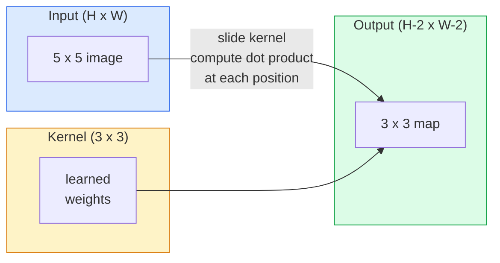
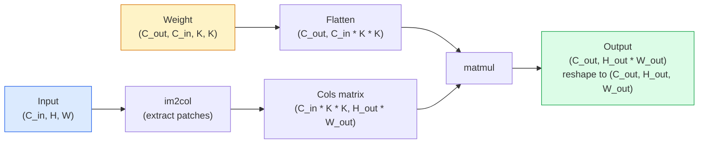

#التلافيفات من الصفر
> الالتواء عبارة عن طبقة كثيفة صغيرة تقوم بتمريرها عبر الصورة، وتتقاسم نفس الأوزان في كل مكان.
**النوع:** بناء
** اللغات: ** بايثون
**المتطلبات الأساسية:** المرحلة 3 (التعلم العميق الأساسي)، المرحلة 4 الدرس 01 (أساسيات الصورة)
**الوقت:** ~75 دقيقة
## أهداف التعلم
- تنفيذ تحويل ثنائي الأبعاد من البداية باستخدام NumPy فقط، بما في ذلك إصدار الحلقة المتداخلة وإصدار `im2col` المتجه
- حساب الحجم المكاني للإخراج لأي مجموعة من حجم الإدخال، وحجم النواة، والمساحة، والخطوة، وضبط صيغة `(H - K + 2P) / S + 1`
- تصميم النوى يدويًا (الحافة، والتعتيم، والشحذ، والسبل) وشرح سبب إنتاج كل منها لنمط التنشيط الذي تقوم به
- تكديس التلافيفات في مستخرج الميزات وربط عمق المكدس بحجم مجال الاستقبال
## المشكلة
ستحتاج الطبقة المتصلة بالكامل على صورة RGB بحجم 224x224 إلى 224 * 224 * 3 = 150,528 وزنًا مدخلاً لكل خلية عصبية. إن الطبقة المخفية الواحدة التي تحتوي على 1000 وحدة تحتوي بالفعل على 150 مليون معلمة - قبل أن تتعلم أي شيء مفيد. والأسوأ من ذلك أن هذه الطبقة ليس لديها فكرة أن الكلب الموجود في أعلى اليسار والكلب الموجود في أسفل اليمين هما نفس النمط. فهو يتعامل مع كل موضع بكسل على أنه مستقل، وهو أمر خاطئ تمامًا بالنسبة للصور: فترجمة قطة بثلاثة بكسلات لا ينبغي أن تجبر الشبكة على إعادة تعلم المفهوم.
الخاصيتان اللتان يحتاجهما نموذج الصورة هما **تكافؤ الترجمة** (يتغير الإخراج عندما يتغير الإدخال) و **مشاركة المعلمات** (يتم تشغيل كاشف الميزات نفسه في كل مكان). الطبقات الكثيفة لا تمنحك أيًا منهما. يمنحك Convolution كلا الأمرين مجانًا.
لم يتم اختراع الإلتواء للتعلم العميق. إنها نفس العملية التي تدعم ضغط JPEG، والتمويه الغاوسي في Photoshop، واكتشاف الحواف في الرؤية الصناعية، وكل مرشح صوتي تم شحنه على الإطلاق. السبب وراء سيطرة CNNs على ImageNet من عام 2012 إلى عام 2020 هو أن الالتواء هو الصحيح السابق للبيانات حيث ترتبط القيم القريبة ويمكن أن يظهر نفس النمط في أي مكان.
##المفهوم
### نواة واحدة، منزلقة
يأخذ الالتواء ثنائي الأبعاد مصفوفة وزن صغيرة تسمى النواة (أو المرشح)، ويمررها عبر المدخلات، وفي كل موقع يحسب مجموع المنتجات الحكيمة. يصبح هذا المجموع بكسل إخراج واحد.


مثال ملموس 3x3 على مدخل 5x5 (بدون حشوة، الخطوة 1):
```
Input X (5 x 5):                Kernel W (3 x 3):

  1  2  0  1  2                   1  0 -1
  0  1  3  1  0                   2  0 -2
  2  1  0  2  1                   1  0 -1
  1  0  2  1  3
  2  1  1  0  1

The kernel slides across every valid 3 x 3 window. Output Y is 3 x 3:

 Y[0,0] = sum( W * X[0:3, 0:3] )
 Y[0,1] = sum( W * X[0:3, 1:4] )
 Y[0,2] = sum( W * X[0:3, 2:5] )
 Y[1,0] = sum( W * X[1:4, 0:3] )
 ... and so on
```

هذه الصيغة الواحدة — **الأوزان المشتركة، والموقع، والنافذة المنزلقة** — هي الفكرة بأكملها. كل شيء آخر هو مسك الدفاتر.
### صيغة حجم الإخراج
بالنظر إلى الحجم المكاني للإدخال `H`، حجم النواة `K`، الحشو `P`، الخطوة `S`:
```
H_out = floor( (H - K + 2P) / S ) + 1
```

احفظ هذا. سوف تقوم بحسابها عشرات المرات لكل بنية.
| السيناريو | ح | ك | ف | س | ح_خارج |
|----------|---|---|---|---|-------|
| تحويل صالح، لا يوجد حشوة | 32 | 3 | 0 | 1 | 30 |
| نفس التحويل (يحافظ على الحجم) | 32 | 3 | 1 | 1 | 32 |
| الاختزال بنسبة 2 | 32 | 3 | 1 | 2 | 16 |
| حمام سباحة 2x2 | 32 | 2 | 0 | 2 | 16 |
| مجال استقبالي كبير | 32 | 7 | 3 | 2 | 16 |
"نفس الحشو" يعني اختيار P بحيث يكون H_out == H عندما يكون S == 1. بالنسبة إلى K الفردي، يكون ذلك P = (K - 1) / 2. ولهذا السبب تهيمن النوى 3x3 - فهي أصغر نواة فردية لا تزال تحتوي على مركز.
### الحشو
بدون الحشو، يؤدي كل التفاف إلى تقليص خريطة المعالم. قم بتكديس 20 منها وستصبح صورتك مقاس 224 × 224 مقاس 184 × 184، مما يؤدي إلى إهدار الحساب على الحدود وتعقيد الاتصالات المتبقية التي تحتاج إلى أشكال متطابقة.
```
Zero padding (P = 1) on a 5 x 5 input:

  0  0  0  0  0  0  0
  0  1  2  0  1  2  0
  0  0  1  3  1  0  0
  0  2  1  0  2  1  0       Now the kernel can centre on pixel
  0  1  0  2  1  3  0       (0, 0) and still have three rows and
  0  2  1  1  0  1  0       three columns of values to multiply.
  0  0  0  0  0  0  0
```

الأوضاع التي تقابلها عمليًا: `zero` (الأكثر شيوعًا)، `reflect` (عكس الحافة، وتجنب الحدود الصلبة في النماذج التوليدية)، `replicate` (نسخ الحافة)، `circular` (الالتفاف، يُستخدم في المشكلات الحلقية).
### خطوة
الخطوة هي حجم خطوة الشريحة. `stride=1` هو الإعداد الافتراضي. `stride=2` يخفض الأبعاد المكانية إلى النصف وهي الطريقة الكلاسيكية للاختزال داخل CNN بدون طبقة تجميع منفصلة - تستخدم كل بنية حديثة (ResNet، وConvNeXt، وMobileNet) تحويلات واسعة النطاق بدلاً من الحد الأقصى للتجميع في مكان ما.
```
Stride 1 on a 5 x 5 input, 3 x 3 kernel:

  starts: (0,0) (0,1) (0,2)        -> output row 0
          (1,0) (1,1) (1,2)        -> output row 1
          (2,0) (2,1) (2,2)        -> output row 2

  Output: 3 x 3

Stride 2 on the same input:

  starts: (0,0) (0,2)              -> output row 0
          (2,0) (2,2)              -> output row 1

  Output: 2 x 2
```

### قنوات إدخال متعددة
الصور الحقيقية لها ثلاث قنوات. إن الإلتواء 3x3 على مدخل RGB هو في الواقع حجم 3x3x3: شريحة 3x3 واحدة لكل قناة إدخال. في كل موضع مكاني، تقوم بالضرب والجمع عبر الشرائح الثلاث وإضافة انحياز.
```
Input:   (C_in,  H,  W)        3 x 5 x 5
Kernel:  (C_in,  K,  K)        3 x 3 x 3 (one kernel)
Output:  (1,     H', W')       2D map

For a layer that produces C_out output channels, you stack C_out kernels:

Weight:  (C_out, C_in, K, K)   e.g. 64 x 3 x 3 x 3
Output:  (C_out, H', W')       64 x 3 x 3

Parameter count: C_out * C_in * K * K + C_out   (the + C_out is biases)
```

هذا السطر الأخير هو الذي ستحسبه عند التخطيط للنموذج. يحتوي التحويل 3x3 المكون من 64 قناة على مدخل ثلاثي القنوات على معلمات `64 * 3 * 3 * 3 + 64 = 1,792`. رخيص.
###خدعة im2col
الحلقات المتداخلة سهلة القراءة ولكنها بطيئة. تريد وحدات معالجة الرسومات مضاعفة المصفوفات الكبيرة. الحيلة: تسوية كل نافذة مجال استقبال للمدخلات في عمود واحد من مصفوفة كبيرة، وتسوية النواة في صف واحد، ويصبح الالتواء بأكمله ماتمولًا واحدًا.


كل تنفيذ لتحويل الإنتاج هو أحد أشكال هذا بالإضافة إلى حيل تبليط ذاكرة التخزين المؤقت (التحويل المباشر، Winograd، FFT conv للنواة الكبيرة). افهم im2col وستفهم الجوهر.
### مجال الاستقبال
ينظر تحويل 3 × 3 واحد إلى 9 بكسلات إدخال. قم بتجميع تحويلين 3x3 وخلايا عصبية في الطبقة الثانية تنظر إلى 5x5 بكسل إدخال. ثلاث تحويلات 3x3 تعطي 7x7. على العموم:
```
RF after L stacked K x K convs (stride 1) = 1 + L * (K - 1)

With strides:   RF grows multiplicatively with stride along each layer.
```

السبب الكامل وراء نجاح "3x3 على طول الطريق" (VGG، ResNet، ConvNeXt) هو أن تحويلين 3x3 يرون نفس منطقة الإدخال مثل تحويل واحد 5x5 ولكن مع معلمات أقل وخطية إضافية بينهما.
## بنائها
### الخطوة 1: قم بتضمين مصفوفة
ابدأ بأصغر قيمة بدائية: دالة تحتوي على أصفار حول مصفوفة H x W.
```python
import numpy as np

def pad2d(x, p):
    if p == 0:
        return x
    h, w = x.shape[-2:]
    out = np.zeros(x.shape[:-2] + (h + 2 * p, w + 2 * p), dtype=x.dtype)
    out[..., p:p + h, p:p + w] = x
    return out

x = np.arange(9).reshape(3, 3)
print(x)
print()
print(pad2d(x, 1))
```

خدعة المحاور الزائدة `x.shape[:-2]` تعني أن نفس الوظيفة تعمل على `(H, W)` أو `(C, H, W)` أو `(N, C, H, W)` بدون تعديل.
### الخطوة 2: التفاف ثنائي الأبعاد مع حلقات متداخلة
التنفيذ المرجعي بطيء ولكن لا لبس فيه. هذا ما يفعله `torch.nn.functional.conv2d` من حيث المبدأ.
```python
def conv2d_naive(x, w, b=None, stride=1, padding=0):
    c_in, h, w_in = x.shape
    c_out, c_in_w, kh, kw = w.shape
    assert c_in == c_in_w

    x_pad = pad2d(x, padding)
    h_out = (h + 2 * padding - kh) // stride + 1
    w_out = (w_in + 2 * padding - kw) // stride + 1

    out = np.zeros((c_out, h_out, w_out), dtype=np.float32)
    for oc in range(c_out):
        for i in range(h_out):
            for j in range(w_out):
                hs = i * stride
                ws = j * stride
                patch = x_pad[:, hs:hs + kh, ws:ws + kw]
                out[oc, i, j] = np.sum(patch * w[oc])
        if b is not None:
            out[oc] += b[oc]
    return out
```

أربع حلقات متداخلة (قناة الإخراج، الصف، العمود، بالإضافة إلى المجموع الضمني على C_in، kh، kw). هذه هي الحقيقة الأساسية التي ستتحقق من كل تنفيذ أسرع مقابلها.
### الخطوة 3: التحقق باستخدام نواة مصممة يدويًا
قم ببناء نواة سوبل عمودية، ثم قم بتطبيقها على صورة خطوة اصطناعية، وشاهد الحافة العمودية تضيء.
```python
def synthetic_step_image():
    img = np.zeros((1, 16, 16), dtype=np.float32)
    img[:, :, 8:] = 1.0
    return img

sobel_x = np.array([
    [[-1, 0, 1],
     [-2, 0, 2],
     [-1, 0, 1]]
], dtype=np.float32)[None]

x = synthetic_step_image()
y = conv2d_naive(x, sobel_x, padding=1)
print(y[0].round(1))
```

توقع قيمًا موجبة كبيرة في العمود 7 (زيادة السطوع من اليسار إلى اليمين) والأصفار في كل مكان آخر. هذه الطبعة الوحيدة هي التحقق من سلامة عقلك من أن الرياضيات صحيحة.
### الخطوة 4: im2col
قم بتحويل كل نافذة بحجم kernel في الإدخال إلى عمود من المصفوفة. بالنسبة إلى `C_in=3, K=3`، يتكون كل عمود من 27 رقمًا.
```python
def im2col(x, kh, kw, stride=1, padding=0):
    c_in, h, w = x.shape
    x_pad = pad2d(x, padding)
    h_out = (h + 2 * padding - kh) // stride + 1
    w_out = (w + 2 * padding - kw) // stride + 1

    cols = np.zeros((c_in * kh * kw, h_out * w_out), dtype=x.dtype)
    col = 0
    for i in range(h_out):
        for j in range(w_out):
            hs = i * stride
            ws = j * stride
            patch = x_pad[:, hs:hs + kh, ws:ws + kw]
            cols[:, col] = patch.reshape(-1)
            col += 1
    return cols, h_out, w_out
```

إنها لا تزال حلقة بايثون، لكن الرفع الثقيل الآن سيكون عبارة عن ماتمول متجه واحد.
### الخطوة 5: تحويل سريع عبر im2col + matmul
استبدل الحلقة الرباعية بضرب مصفوفة واحدة.
```python
def conv2d_im2col(x, w, b=None, stride=1, padding=0):
    c_out, c_in, kh, kw = w.shape
    cols, h_out, w_out = im2col(x, kh, kw, stride, padding)
    w_flat = w.reshape(c_out, -1)
    out = w_flat @ cols
    if b is not None:
        out += b[:, None]
    return out.reshape(c_out, h_out, w_out)
```

التحقق من الصحة: ​​تشغيل كلا التطبيقين والمقارنة.
```python
rng = np.random.default_rng(0)
x = rng.normal(0, 1, (3, 16, 16)).astype(np.float32)
w = rng.normal(0, 1, (8, 3, 3, 3)).astype(np.float32)
b = rng.normal(0, 1, (8,)).astype(np.float32)

y_naive = conv2d_naive(x, w, b, padding=1)
y_im2col = conv2d_im2col(x, w, b, padding=1)

print(f"max abs diff: {np.max(np.abs(y_naive - y_im2col)):.2e}")
```

يجب أن يكون `max abs diff` حول `1e-5` — الفرق هو ترتيب تراكم الفاصلة العائمة، وليس خطأ.
### الخطوة 6: بنك من الحبوب المصممة يدويًا
خمسة مرشحات توضح ما يمكن أن تعبر عنه طبقة تحويل واحدة قبل أي تدريب.
```python
KERNELS = {
    "identity": np.array([[0, 0, 0], [0, 1, 0], [0, 0, 0]], dtype=np.float32),
    "blur_3x3": np.ones((3, 3), dtype=np.float32) / 9.0,
    "sharpen": np.array([[0, -1, 0], [-1, 5, -1], [0, -1, 0]], dtype=np.float32),
    "sobel_x": np.array([[-1, 0, 1], [-2, 0, 2], [-1, 0, 1]], dtype=np.float32),
    "sobel_y": np.array([[-1, -2, -1], [0, 0, 0], [1, 2, 1]], dtype=np.float32),
}

def apply_kernel(img2d, kernel):
    x = img2d[None].astype(np.float32)
    w = kernel[None, None]
    return conv2d_im2col(x, w, padding=1)[0]
```

عند تطبيقه على أي صورة ذات تدرج رمادي، يتم تخفيف التمويه وزيادة حدة الحواف، ويضيء Sobel-x الحواف الرأسية، ويضيء Sobel-y الحواف الأفقية. هذه هي بالضبط الأنماط التي انتهى الأمر بطبقة التحويل المدربة *الأولى* في AlexNet وVGG إلى تعلمها - لأن نموذج الصورة الجيد يحتاج إلى كاشفات الحافة والنقطة بغض النظر عن المهمة التي تأتي لاحقًا.
## استخدمه
يغلف `nn.Conv2d` الخاص بـ PyTorch نفس العملية باستخدام autograd، ونواة CUDA، وتحسين cuDNN. دلالات الشكل متطابقة.
```python
import torch
import torch.nn as nn

conv = nn.Conv2d(in_channels=3, out_channels=64, kernel_size=3, stride=1, padding=1)
print(conv)
print(f"weight shape: {tuple(conv.weight.shape)}   # (C_out, C_in, K, K)")
print(f"bias shape:   {tuple(conv.bias.shape)}")
print(f"param count:  {sum(p.numel() for p in conv.parameters())}")

x = torch.randn(8, 3, 224, 224)
y = conv(x)
print(f"\ninput  shape: {tuple(x.shape)}")
print(f"output shape: {tuple(y.shape)}")
```

قم بتبديل `padding=1` بـ `padding=0` وينخفض ​​الإخراج إلى 222x222. استبدل `stride=1` بـ `stride=2` وسيقل إلى 112x112. نفس الصيغة التي حفظتها أعلاه.
## اشحنها
ينتج هذا الدرس:
- `outputs/prompt-cnn-architect.md` — مطالبة، نظرًا لحجم الإدخال وميزانية المعلمة وحقل الاستقبال المستهدف، تصمم مجموعة من طبقات `Conv2d` مع K/S/P الصحيح في كل خطوة.
- `outputs/skill-conv-shape-calculator.md` — مهارة تنتقل عبر طبقة مواصفات الشبكة إلى طبقة وتعيد شكل الإخراج وحقل الاستلام وعدد المعلمات لكل كتلة.
## تمارين
1. **(سهل)** بالنظر إلى إدخال بتدرج رمادي مقاس 128x128 ومجموعة من `[Conv3x3(s=1,p=1), Conv3x3(s=2,p=1), Conv3x3(s=1,p=1), Conv3x3(s=2,p=1)]`، قم بحساب الحجم المكاني للإخراج وحقل الاستلام في كل طبقة يدويًا. تحقق باستخدام PyTorch `nn.Sequential` للتحويلات الوهمية.
2. **(متوسط)** قم بتوسيع `conv2d_naive` و`conv2d_im2col` لقبول وسيطة `groups`. أظهر أن `groups=C_in=C_out` يُنتج التفافًا عميقًا وأن عدد معلماته هو `C * K * K` بدلاً من `C * C * K * K`.
3. **(صعب)** قم بتنفيذ التمرير الخلفي لـ `conv2d_im2col` يدويًا: بالنظر إلى تدرج الإخراج، قم بحساب التدرج اللوني لـ `x` و`w`. تحقق من `torch.autograd.grad` على نفس المدخلات والأوزان. الحيلة: تدرج im2col هو `col2im`، وعليه تجميع النوافذ المتداخلة.
## المصطلحات الرئيسية
| مصطلح | ماذا يقول الناس | ماذا يعني في الواقع |
|------|----------------|----------------------|
| الإلتواء | "تحريك عامل التصفية" | منتج نقطي قابل للتعلم يتم تطبيقه في كل موقع مكاني بأوزان مشتركة؛ ارتباطًا متقاطعًا رياضيًا، لكن الجميع يطلق عليه اسم الإلتواء |
| النواة / الفلتر | "كاشف الميزة" | موتر ذو وزن صغير للشكل (C_in، K، K) ينتج ناتجه النقطي مع نافذة الإدخال بكسل إخراج واحد |
| خطوة | "إلى أي مدى تقفز" | حجم الخطوة بين مواضع النواة المتتالية؛ خطوة 2 نصفين لكل البعد المكاني |
| الحشو | "أصفار على الحواف" | تتم إضافة قيم إضافية حول الإدخال حتى تتمكن النواة من التركيز على وحدات البكسل الحدودية؛ `same` تحافظ الحشوة على حجم الإخراج مساوياً لحجم الإدخال |
| المجال الاستقبالي | "كم ترى الخلية العصبية" | تصحيح الإدخال الأصلي الذي يعتمد عليه تنشيط الإخراج المحدد، وينمو بعمق وخطوة |
| im2col | "خدعة GEMM" | إعادة ترتيب كل نافذة استقبال إلى أعمدة بحيث يصبح الالتواء مصفوفة واحدة كبيرة تتضاعف - جوهر كل نواة تحويل سريع |
| التحويل العميق | "نواة واحدة لكل قناة" | تحويل مع `groups == C_in`، حساب كل قناة إخراج من قناة الإدخال المطابقة لها فقط؛ العمود الفقري لـ MobileNet وConvNeXt |
| تكافؤ الترجمة | "التحول إلى الداخل، التحول إلى الخارج" | الخاصية التي تؤدي إلى تحويل الإدخال بمقدار k بكسل إلى إزاحة الإخراج بمقدار k بكسل؛ يأتي مجانًا مع الأوزان المشتركة |
## مزيد من القراءة
- [A guide to convolution arithmetic for deep learning (Dumoulin & Visin, 2016)](https://arxiv.org/abs/1603.07285) — المخططات النهائية للحشو/الخطوة/التمدد التي تنسخها كل دورة بهدوء
- [CS231n: Convolutional Neural Networks for Visual Recognition](https://cs231n.github.io/convolutional-networks/) — ملاحظات المحاضرة الأساسية، بما في ذلك شرح im2col الأصلي
- [The Annotated ConvNet (fast.ai)](https://nbviewer.org/github/fastai/fastbook/blob/master/13_convolutions.ipynb) — دفتر ملاحظات ينتقل من الالتفاف اليدوي إلى مصنف digit المُدرب
- [Receptive Field Arithmetic for CNNs (Dang Ha The Hien)](https://distill.pub/2019/computing-receptive-fields/) — الشرح التفاعلي بجودة الورق لحسابات المجال الاستقبالي