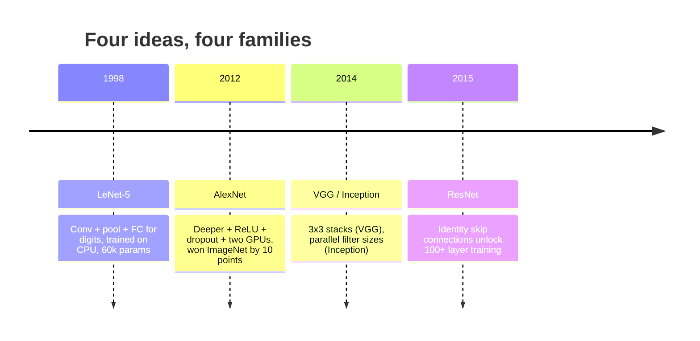
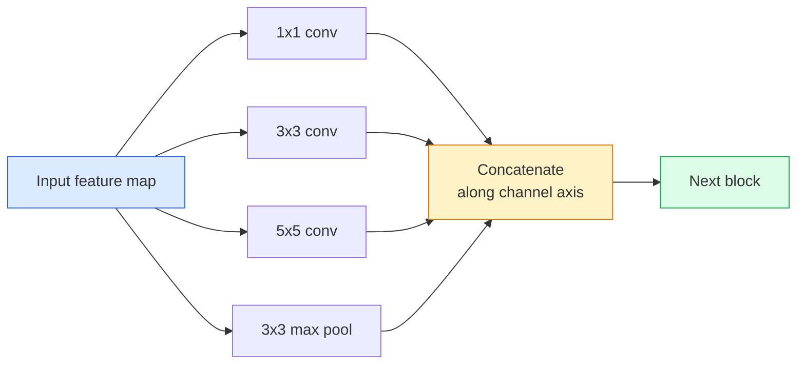
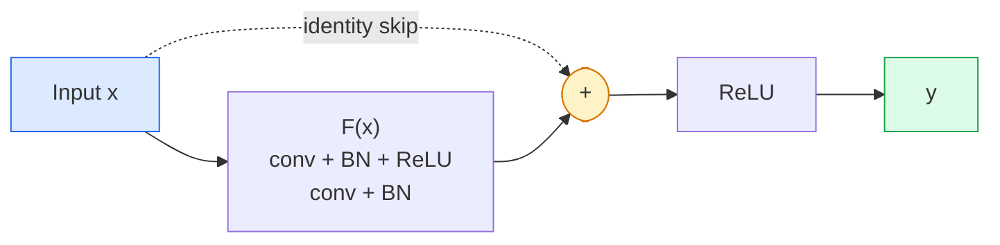

# CNNs — LeNet إلى ResNet
> كل CNN رئيسي خلال الثلاثين عامًا الماضية هو نفس وصفة التحويل غير الخطية مع فكرة واحدة جديدة مثبتة. تعلم الأفكار بالترتيب.
** النوع: ** تعلم + بناء
** اللغات: ** بايثون
**المتطلبات الأساسية:** المرحلة 3 الدرس 11 (PyTorch)، المرحلة 4 الدرس 01 (أساسيات الصورة)، المرحلة 4 الدرس 02 (الالتفافات من الصفر)
**الوقت:** ~75 دقيقة
## أهداف التعلم
- تتبع السلالة المعمارية LeNet-5 -> AlexNet -> VGG -> Inception -> ResNet واذكر الفكرة الجديدة الوحيدة التي ساهمت بها كل عائلة
- تنفيذ LeNet-5، وكتلة بنمط VGG، وResNet BasicBlock في PyTorch، كل منها أقل من 40 سطرًا
- اشرح لماذا تحول الاتصالات المتبقية شبكة مكونة من 1000 طبقة من شبكة غير قابلة للتدريب إلى شبكة حديثة
- قراءة العمود الفقري الحديث (ResNet-18، ResNet-50) والتنبؤ بشكل مخرجاته ومجال الاستقبال وعدد المعلمات قبل النظر إلى المصدر
## المشكلة
في عام 2011، سجل أفضل مصنف ImageNet حوالي 74% من أعلى 5 دقة. في عام 2012، حصلت AlexNet على نسبة 85%. وفي عام 2015، حصلت شركة ResNet على نسبة 96%. لا توجد بيانات جديدة. لا يوجد جيل GPU جديد. وجاءت المكاسب من أفكار الهندسة المعمارية. يجب على مهندس الرؤية العاملة أن يعرف أي فكرة جاءت من أي ورقة لأن كل عمود أساسي للإنتاج تشحنه في عام 2026 هو إعادة تركيب لتلك القطع نفسها - ولأن الأفكار تستمر في النقل: انتقلت التحويلات المجمعة من شبكات CNN إلى المحولات، وانتقلت الاتصالات المتبقية من ResNet إلى كل LLM موجود، وتعيش تسوية الدُفعات في نماذج الانتشار.
إن دراسة هذه الشبكات بالترتيب تحصنك أيضًا ضد خطأ شائع: الوصول إلى أكبر نموذج متاح في حين أن شبكة بحجم LeNet ستحل المشكلة. MNIST لا يحتاج إلى ResNet. إن معرفة منحنى القياس لكل عائلة يخبرك بمكان الجلوس عليه.
##المفهوم
### الأفكار الأربعة التي غيرت الرؤية


لا شيء آخر في الرؤية الكلاسيكية يهم بقدر هذه القفزات الأربع.
### لينيت-5 (1998)
أداة التعرف على digit الخاصة بـ Yann LeCun. 60.000 معلمة. كتلتان من مجمع التحويلات، وطبقتان متصلتان بالكامل، وعمليات تنشيط إضافية. لقد حدد القالب كل CNN يرث:
```
input (1, 32, 32)
  conv 5x5 -> (6, 28, 28)
  avg pool 2x2 -> (6, 14, 14)
  conv 5x5 -> (16, 10, 10)
  avg pool 2x2 -> (16, 5, 5)
  flatten -> 400
  dense -> 120
  dense -> 84
  dense -> 10
```

كل ما يسميه العالم الحديث CNN - التلافيف المتناوبة والاختزال الذي يغذي رأس مصنف صغير - هو LeNet مع المزيد من الطبقات، وقنوات أكبر، وعمليات تنشيط أفضل.
### أليكس نت (2012)
ثلاثة تغييرات أدت معًا إلى كسر ImageNet:
1. **ReLU** بدلاً من tanh. التدرجات تتوقف عن التلاشي. يسرع التدريب بعامل ستة.
2. **التسرب** في الرأس المتصل بالكامل. يصبح التنظيم طبقة وليس خدعة.
3. **العمق والعرض**. خمس طبقات تحويل، ثلاث طبقات كثيفة، 60 مليون معلمة، تم تدريبها على وحدتي معالجة رسوميات مع تقسيم النموذج عليهما.
لا يزال الشكل 2 في الورقة يُظهر الانقسام GPU كتدفقين متوازيين. كان هذا التوازي عبارة عن حل بديل للأجهزة، وليس رؤية معمارية - ولكن الأفكار الثلاثة المذكورة أعلاه لا تزال موجودة في كل نموذج تستخدمه.
### VGG (2014)
VGG سأل: ماذا يحدث إذا استخدمت تلافيفات 3x3 فقط وتعمقت؟
```
stack:   conv 3x3 -> conv 3x3 -> pool 2x2
repeat:  16 or 19 conv layers
```

ترى تحويلتان 3x3 نفس منطقة الإدخال 5x5 مثل تحويل 5x5 ولكن مع معلمات أقل (2*9*C^2 = 18C^2 مقابل 25*C^2) وReLU إضافي بينهما. VGG حول هذه الملاحظة إلى بنية كاملة. البساطة - نوع كتلة واحد متكرر - جعلت منه النقطة المرجعية لكل ما جاء بعده.
التكلفة: 138 مليون معلمة، بطيئة في التدريب، ومكلفة عند الاستدلال.
### البداية (2014، نفس العام)
إجابة Google على "ما حجم النواة الذي يجب أن أستخدمه؟" وقيل: جميعها، على التوازي.


يتخصص كل فرع - 1x1 لمزج القنوات، و3x3 للنسيج المحلي، و5x5 للأنماط الأكبر، والتجميع للميزات الثابتة المتغيرة - ويتيح concat للطبقة التالية اختيار أي فرع يكون مفيدًا. استخدم Inception v1 تلافيفات 1x1 داخل كل فرع باعتبارها عنق الزجاجة للحفاظ على عقلانية أعداد المعلمات.
### مشكلة التدهور
بحلول عام 2015، كان VGG-19 يعمل ولم يكن VGG-32 يعمل. كان من المفترض أن يساعد العمق، لكن ما يزيد عن 20 طبقة من التدريب وخسارة الاختبار أصبحت أسوأ. هذا ليس الإفراط في التجهيز. هذا هو فشل المحسن في العثور على أوزان مفيدة لأن التدرجات تتقلص بشكل مضاعف خلال كل طبقة.
```
Plain deep network:
  y = f_L( f_{L-1}( ... f_1(x) ... ) )

Gradient wrt early layer:
  dL/dW_1 = dL/dy * df_L/df_{L-1} * ... * df_2/df_1 * df_1/dW_1

Each multiplicative term has magnitude roughly (weight magnitude) * (activation gain).
Stack 100 of them with gains < 1 and the gradient is effectively zero.
```

نجح VGG في 19 طبقة لأن معيار الدُفعة (المنشور في وقت واحد) حافظ على عمليات التنشيط جيدة الحجم. ولكن حتى معيار الدفعة لم يتمكن من إنقاذ العمق الذي يتجاوز 30 طبقة.
### ريس نت (2015)
اقترح هو وتشانغ ورن وصن تغييرًا واحدًا أصلح كل شيء:
```
standard block:   y = F(x)
residual block:   y = F(x) + x
```

يعني `+ x` أن الطبقة يمكنها دائمًا اختيار عدم القيام بأي شيء عن طريق دفع `F(x)` إلى الصفر. إن شبكة ResNet المكونة من 1000 طبقة أصبحت الآن سيئة على الأقل مثل الشبكة المكونة من طبقة واحدة، لأن كل كتلة إضافية لها فتحة هروب تافهة. مع هذا الضمان، يكون المُحسِّن على استعداد لـ make كل كتلة *مفيدة قليلاً* - ومفيدة قليلاً، مكدسة 100 مرة، على أحدث طراز.


يظهر نوعان مختلفان من الكتلة في كل مكان:
- **BasicBlock** (ResNet-18, ResNet-34): تحويلان 3x3، تخطي كليهما.
- **عنق الزجاجة** (ResNet-50، -101، -152): 1x1 لأسفل، 3x3 وسط، 1x1 لأعلى، تخطي حول الثلاثي. أرخص عندما يكون عدد القنوات مرتفعًا.
عندما يتعين على التخطي عبور نموذج مصغر (خطوة = 2)، يتم استبدال مسار الهوية بخطوة 1 × 1 = 2 تحويل لمطابقة الأشكال.
### لماذا تكون المخلفات مهمة خارج نطاق الرؤية؟
لم تكن الفكرة في الواقع تتعلق بتصنيف الصور. كان الأمر يتعلق بتحويل الشبكات العميقة من مجرد "تشابك أصابعك والأمل في بقاء التدرجات" إلى أداة هندسية موثوقة وقابلة للتطوير. كل محول ستقرأ عنه في المرحلة التالية لديه نفس اتصال التخطي في كل كتلة. بدون ResNet، لا يوجد GPT.
## بنائها
### الخطوة 1: لينيت-5
الحد الأدنى من LeNet المخلص. تفعيلات تانه، متوسط ​​التجميع. الامتياز الوحيد للحداثة هو أننا نستخدم `nn.CrossEntropyLoss` في اتجاه مجرى النهر بدلاً من الاتصالات الغوسية الأصلية.
```python
import torch
import torch.nn as nn
import torch.nn.functional as F

class LeNet5(nn.Module):
    def __init__(self, num_classes=10):
        super().__init__()
        self.conv1 = nn.Conv2d(1, 6, kernel_size=5)
        self.conv2 = nn.Conv2d(6, 16, kernel_size=5)
        self.pool = nn.AvgPool2d(2)
        self.fc1 = nn.Linear(16 * 5 * 5, 120)
        self.fc2 = nn.Linear(120, 84)
        self.fc3 = nn.Linear(84, num_classes)

    def forward(self, x):
        x = self.pool(torch.tanh(self.conv1(x)))
        x = self.pool(torch.tanh(self.conv2(x)))
        x = torch.flatten(x, 1)
        x = torch.tanh(self.fc1(x))
        x = torch.tanh(self.fc2(x))
        return self.fc3(x)

net = LeNet5()
x = torch.randn(1, 1, 32, 32)
print(f"output: {net(x).shape}")
print(f"params: {sum(p.numel() for p in net.parameters()):,}")
```

المخرجات المتوقعة: `output: torch.Size([1, 10])`، `params: 61,706`. هذا هو مُصنف digit بأكمله الذي بدأ الرؤية الحديثة.
### الخطوة الثانية: كتلة VGG
كتلة واحدة قابلة لإعادة الاستخدام: تحويلتان 3x3، ReLU، معيار الدُفعة، الحد الأقصى للتجميع.
```python
class VGGBlock(nn.Module):
    def __init__(self, in_c, out_c):
        super().__init__()
        self.conv1 = nn.Conv2d(in_c, out_c, kernel_size=3, padding=1)
        self.bn1 = nn.BatchNorm2d(out_c)
        self.conv2 = nn.Conv2d(out_c, out_c, kernel_size=3, padding=1)
        self.bn2 = nn.BatchNorm2d(out_c)
        self.pool = nn.MaxPool2d(2)

    def forward(self, x):
        x = F.relu(self.bn1(self.conv1(x)))
        x = F.relu(self.bn2(self.conv2(x)))
        return self.pool(x)

class MiniVGG(nn.Module):
    def __init__(self, num_classes=10):
        super().__init__()
        self.stack = nn.Sequential(
            VGGBlock(3, 32),
            VGGBlock(32, 64),
            VGGBlock(64, 128),
        )
        self.head = nn.Sequential(
            nn.AdaptiveAvgPool2d(1),
            nn.Flatten(),
            nn.Linear(128, num_classes),
        )

    def forward(self, x):
        return self.head(self.stack(x))

net = MiniVGG()
x = torch.randn(1, 3, 32, 32)
print(f"output: {net(x).shape}")
print(f"params: {sum(p.numel() for p in net.parameters()):,}")
```

ثلاث كتل VGG على مدخلات بحجم CIFAR، تجمع تكيفي، طبقة خطية واحدة. ~290 ألف معلمة. الكثير لـ CIFAR-10.
### الخطوة 3: كتلة ResNet BasicBlock
اللبنة الأساسية لـ ResNet-18 وResNet-34.
```python
class BasicBlock(nn.Module):
    def __init__(self, in_c, out_c, stride=1):
        super().__init__()
        self.conv1 = nn.Conv2d(in_c, out_c, kernel_size=3, stride=stride, padding=1, bias=False)
        self.bn1 = nn.BatchNorm2d(out_c)
        self.conv2 = nn.Conv2d(out_c, out_c, kernel_size=3, stride=1, padding=1, bias=False)
        self.bn2 = nn.BatchNorm2d(out_c)
        if stride != 1 or in_c != out_c:
            self.shortcut = nn.Sequential(
                nn.Conv2d(in_c, out_c, kernel_size=1, stride=stride, bias=False),
                nn.BatchNorm2d(out_c),
            )
        else:
            self.shortcut = nn.Identity()

    def forward(self, x):
        out = F.relu(self.bn1(self.conv1(x)))
        out = self.bn2(self.conv2(out))
        out = out + self.shortcut(x)
        return F.relu(out)
```

`bias=False` في طبقات التحويل عبارة عن اصطلاح معياري دفعي — تعالج معلمة بيتا BN الانحياز بالفعل، لذا فإن حمل انحياز التحويل أيضًا يعد مضيعة. يحتاج `shortcut` إلى تحويل حقيقي فقط عندما يتغير عدد الخطوات أو عدد القنوات؛ وإلا فهي هوية محظورة.
### الخطوة 4: شبكة ResNet صغيرة
قم بتجميع أربع مجموعات من BasicBlocks للحصول على شبكة ResNet فعالة للمدخلات بحجم CIFAR.
```python
class TinyResNet(nn.Module):
    def __init__(self, num_classes=10):
        super().__init__()
        self.stem = nn.Sequential(
            nn.Conv2d(3, 32, kernel_size=3, stride=1, padding=1, bias=False),
            nn.BatchNorm2d(32),
            nn.ReLU(inplace=True),
        )
        self.layer1 = self._make_group(32, 32, num_blocks=2, stride=1)
        self.layer2 = self._make_group(32, 64, num_blocks=2, stride=2)
        self.layer3 = self._make_group(64, 128, num_blocks=2, stride=2)
        self.layer4 = self._make_group(128, 256, num_blocks=2, stride=2)
        self.head = nn.Sequential(
            nn.AdaptiveAvgPool2d(1),
            nn.Flatten(),
            nn.Linear(256, num_classes),
        )

    def _make_group(self, in_c, out_c, num_blocks, stride):
        blocks = [BasicBlock(in_c, out_c, stride=stride)]
        for _ in range(num_blocks - 1):
            blocks.append(BasicBlock(out_c, out_c, stride=1))
        return nn.Sequential(*blocks)

    def forward(self, x):
        x = self.stem(x)
        x = self.layer1(x)
        x = self.layer2(x)
        x = self.layer3(x)
        x = self.layer4(x)
        return self.head(x)

net = TinyResNet()
x = torch.randn(1, 3, 32, 32)
print(f"output: {net(x).shape}")
print(f"params: {sum(p.numel() for p in net.parameters()):,}")
```

أربع مجموعات من كتلتين لكل منهما. الخطوة 2 في بداية المجموعات 2، 3، 4. يتضاعف عدد القنوات عند كل عينة منخفضة. ما يقرب من 2.8M المعلمات. هذه هي الوصفة القياسية التي تصل إلى ResNet-152.
### الخطوة 5: مقارنة كفاءة المعلمة بالميزة
قم بتشغيل نفس الإدخال عبر الشبكات الثلاث وقارن عدد المعلمات.
```python
def summary(name, net, x):
    y = net(x)
    params = sum(p.numel() for p in net.parameters())
    print(f"{name:12s}  input {tuple(x.shape)} -> output {tuple(y.shape)}  params {params:>10,}")

x = torch.randn(1, 3, 32, 32)
summary("LeNet5",     LeNet5(),       torch.randn(1, 1, 32, 32))
summary("MiniVGG",    MiniVGG(),      x)
summary("TinyResNet", TinyResNet(),   x)
```

ثلاثة نماذج، وثلاثة عصور، وثلاثة أوامر من حيث عدد المعلمات. للحصول على دقة CIFAR-10، تحتاج تقريبًا إلى: LeNet 60%، MiniVGG 89%، TinyResNet 93% بعد عدة فترات من التدريب.
## استخدمه
`torchvision.models` يمنحك إصدارات مُدربة مسبقًا لكل ما سبق. توقيع المكالمة متطابق عبر العائلات، وهو بالضبط نقطة التجريد الأساسي.
```python
from torchvision.models import resnet18, ResNet18_Weights, vgg16, VGG16_Weights

r18 = resnet18(weights=ResNet18_Weights.IMAGENET1K_V1)
r18.eval()

print(f"ResNet-18 params: {sum(p.numel() for p in r18.parameters()):,}")
print(r18.layer1[0])
print()

v16 = vgg16(weights=VGG16_Weights.IMAGENET1K_V1)
v16.eval()
print(f"VGG-16   params: {sum(p.numel() for p in v16.parameters()):,}")
```

يحتوي ResNet-18 على 11.7 مليون معلمة. VGG-16 لديه 138 مليونًا. دقة مماثلة من أعلى 1 لـ ImageNet (69.8% مقابل 71.6%). تمنحك الاتصالات المتبقية فوزًا في كفاءة المعلمة بمقدار 12x. ولهذا السبب هيمنت متغيرات ResNet من عام 2016 حتى وصول ViT في عام 2021 - ولا تزال تهيمن على عمليات النشر في العالم الحقيقي حيث تكون الحوسبة هي القيد.
بالنسبة لنقل التعلم، فإن الوصفة هي نفسها دائمًا: تحميل ما تم تدريبه مسبقًا، وتجميد العمود الفقري، واستبدال رأس المصنف.
```python
for p in r18.parameters():
    p.requires_grad = False
r18.fc = nn.Linear(r18.fc.in_features, 10)
```

ثلاثة خطوط. لديك الآن مصنف CIFAR من 10 فئات يرث التمثيلات التي دفعت ImageNet مقابلها.
## اشحنها
ينتج هذا الدرس:
- `outputs/prompt-backbone-selector.md` — مطالبة تختار عائلة CNN المناسبة (LeNet/VGG/ResNet/MobileNet/ConvNeXt) المعينة للمهمة وحجم مجموعة البيانات وميزانية الحوسبة.
- `outputs/skill-residual-block-reviewer.md` — مهارة تقرأ وحدة PyTorch وتضع علامة على أخطاء تخطي الاتصال (الاختصار المفقود عند تغيير الخطوة، ترتيب تنشيط الاختصار، موضع BN بالنسبة إلى الإضافة).
## تمارين
1. **(سهل)** حساب المعلمات يدويًا لطبقة `TinyResNet` طبقة تلو الأخرى. قارن مع `sum(p.numel() for p in net.parameters())`. أين تذهب غالبية ميزانية المعلمة - التحويلات، BN، أو رأس المصنف؟
2. **(متوسط)** قم بتنفيذ كتلة عنق الزجاجة (1x1 -> 3x3 -> 1x1 مع التخطي) واستخدمها لإنشاء شبكة بنمط ResNet-50 لـ CIFAR. قارن المعلمات بـ `TinyResNet`.
3. **(صعب)** قم بإزالة اتصال التخطي من `BasicBlock`، وقم بتدريب شبكة "عادية" مكونة من 34 كتلة وشبكة ResNet مكونة من 34 كتلة على CIFAR-10 لمدة 10 فترات لكل منهما. مؤامرة خسارة التدريب مقابل العصر لكليهما. إعادة إنتاج هو وآخرون. نتيجة الشكل 1 حيث تتقارب الشبكة العميقة البسيطة مع خسارة أعلى من توأمها الضحل.
## المصطلحات الرئيسية
| مصطلح | ماذا يقول الناس | ماذا يعني في الواقع |
|------|----------------|----------------------|
| العمود الفقري | "النموذج" | مجموعة الكتل التلافيفية التي تنتج خريطة الميزات التي يتم تغذيتها إلى رأس المهمة |
| الاتصال المتبقي | "تخطي الاتصال" | `y = F(x) + x`; يتيح للمُحسِّن التعرف على الهوية عن طريق ضبط F على الصفر، وهو عمق اعتباطي make قابل للتدريب |
| بيسيك بلوك | "تحويلان 3×3 مع تخطي" | العنصر الأساسي ResNet-18/34: conv-BN-ReLU-conv-BN-add-ReLU |
| عنق الزجاجة | "1x1 لأسفل، 3x3، 1x1 لأعلى" | كتلة ResNet-50/101/152؛ رخيصة الثمن بأعداد القنوات العالية لأن 3x3 يعمل بعرض منخفض |
| مشكلة التدهور | "الأعمق هو أسوأ" | بعد ~ 20 طبقة تحويل عادية، يزداد خطأ التدريب والاختبار؛ يتم حلها عن طريق الاتصالات المتبقية، وليس عن طريق المزيد من البيانات |
| الجذعية | "الطبقة الأولى" | التحويل الأولي الذي يحول مدخلات 3 قنوات إلى عرض الميزة الأساسية؛ عادة 7x7 خطوة 2 لـ ImageNet، 3x3 خطوة 1 لـ CIFAR |
| رئيس | "المصنف" | الطبقات بعد الكتلة الأساسية النهائية: التجمع التكيفي، المسطح، الخطي (الطبقات) |
| نقل التعلم | "الأوزان المدربة" | تحميل العمود الفقري المدرب على ImageNet وضبط الرأس فقط في مهمتك |
## مزيد من القراءة
- [Deep Residual Learning for Image Recognition (He et al., 2015)](https://arxiv.org/abs/1512.03385) — ورقة ResNet؛ كل شخصية تستحق الدراسة
- [Very Deep Convolutional Networks (Simonyan & Zisserman, 2014)](https://arxiv.org/abs/1409.1556) — ورقة VGG؛ لا يزال أفضل مرجع لـ "لماذا 3x3"
- [ImageNet Classification with Deep CNNs (Krizhevsky et al., 2012)](https://papers.nips.cc/paper_files/paper/2012/hash/c399862d3b9d6b76c8436e924a68c45b-Abstract.html) — أليكس نت؛ الورقة التي أنهت عصر الميزات المصنوعة يدويًا
- [Going Deeper with Convolutions (Szegedy et al., 2014)](https://arxiv.org/abs/1409.4842) — الإصدار الأول؛ فكرة التصفية الموازية التي لا تزال تظهر في محولات الرؤية