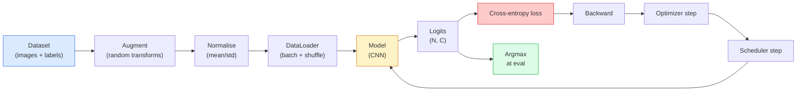

# تصنيف الصور
> المصنف عبارة عن دالة من وحدات البكسل إلى التوزيع الاحتمالي على الفئات. كل شيء آخر هو السباكة.
**النوع:** بناء
** اللغات: ** بايثون
**المتطلبات الأساسية:** المرحلة الثانية الدرس 09 (تقييم النموذج)، المرحلة 3 الدرس 10 (الإطار المصغر)، المرحلة 4 الدرس 03 (CNN)
**الوقت:** ~75 دقيقة
## أهداف التعلم
- إنشاء تصنيف شامل للصور pipeline في CIFAR-10: مجموعة البيانات، التعزيز، النموذج، حلقة التدريب، التقييم
- شرح دور كل مكون (محمل البيانات، الخسارة، المحسن، المجدول، التعزيز) والتنبؤ بكيفية ظهور كسر أي منها في منحنى الخسارة
- تنفيذ المزج، والقص، وتجانس الملصقات من البداية وتبرير متى يستحق كل منها الإضافة
- اقرأ مصفوفة الارتباك وجدول الدقة/الاستدعاء لكل فئة لتشخيص مجموعة البيانات وفشل النماذج بما يتجاوز الدقة الإجمالية
## المشكلة
كل مهمة رؤية يتم اختزالها في تصنيف الصور على مستوى معين. الكشف يصنف المناطق. يقوم التقسيم بتصنيف البكسلات. يتم ترتيب الاسترجاع حسب التشابه مع النقط الوسطى للفئة. إن الحصول على التصنيف الصحيح - حلقة مجموعة البيانات، وسياسة التعزيز، والخسارة، والتقييم - هو المهارة التي تنتقل إلى كل مهمة أخرى في المرحلة.
معظم أخطاء التصنيف ليست موجودة في النموذج. إنهم يعيشون في خط pipe: تطبيع معطل، ومجموعة تدريب غير مختلطة، وزيادة تشوه التسميات، وتقسيم التحقق الملوث ببيانات التدريب، ومعدل التعلم الذي يتباعد بصمت بعد العصر 30. إن CNN الذي قد يصل إلى 93% في CIFAR-10 مع الإعداد الصحيح عادة ما يسجل 70-75% مع واحد مكسور، ويبدو منحنى الخسارة معقولًا طوال الوقت.
يقوم هذا الدرس بتوصيل الخط pipeline بالكامل يدويًا بحيث يكون كل جزء قابلاً للفحص. لن تستخدم أي شيء من `torchvision.datasets` يمكنه إخفاء خطأ ما.
##المفهوم
### التصنيف pipeline


كل سطر في هذه الحلقة هو المكان الذي يمكن أن يعيش فيه الخطأ. يأخذ الإنتروبيا المتقاطعة logits خامًا، وليس مخرجات softmax، لذا فإن أي `model(x).softmax()` قبل الخسارة يحسب بهدوء التدرج الخاطئ. تنطبق التعزيزات على المدخلات فقط، وليس على التصنيفات - باستثناء المزج الذي يمزج بين الاثنين. `optimizer.zero_grad()` يجب أن يحدث مرة واحدة في كل خطوة؛ يؤدي تخطيه إلى تراكم التدرجات ويبدو وكأنه معدل تعلم غير مستقر إلى حد كبير. يعمل كل خطأ من هذه الأخطاء على تسوية منحنى التعلم دون ارتكاب أي خطأ.
### إنتروبيا متقاطعة، logits، وsoftmax
يقوم المصنف بإنتاج `C` أرقام لكل صورة تسمى logits. يؤدي تطبيق softmax إلى تحويلها إلى توزيع احتمالي:
```
softmax(z)_i = exp(z_i) / sum_j exp(z_j)
```

يقيس الإنتروبيا المتقاطعة احتمال السجل السلبي للفئة الصحيحة:
```
CE(z, y) = -log( softmax(z)_y )
        = -z_y + log( sum_j exp(z_j) )
```

النموذج الأيمن هو النموذج المستقر عدديًا (log-sum-exp). PyTorch's `nn.CrossEntropyLoss` يدمج softmax + NLL في عملية واحدة ويأخذ logits الخام مباشرة. إن تطبيق softmax بنفسك أولاً غالبًا ما يكون خطأً - فأنت تحسب log(softmax(softmax(z)))، وهي كمية لا معنى لها.
### لماذا تنجح عملية التعزيز
يحتوي CNN على انحياز استقرائي للترجمة (من مشاركة الوزن) ولكن لا يوجد ثبات مضمن في الاقتصاص أو التقليب أو عدم استقرار اللون أو الانسداد. الطريقة الوحيدة لتعليمه تلك الثوابت هي أن تظهر له وحدات البكسل التي تمارسها. كل تحويل عشوائي أثناء التدريب هو وسيلة للقول: "هاتين الصورتين لهما نفس التسمية؛ تعلم الميزات التي تتجاهل الفرق."
```
Original crop:  "dog facing left"
Flip:           "dog facing right"       <- same label, different pixels
Rotate(+15):    "dog, slight tilt"
Colour jitter:  "dog in warmer light"
RandomErasing:  "dog with patch missing"
```

القاعدة: أن الزيادة يجب أن تحفظ التسمية. يمكن أن يؤدي القطع والتدوير على digit إلى قلب "6" إلى "9"؛ بالنسبة لمجموعة البيانات هذه، يمكنك استخدام نطاقات دوران أصغر واختيار التعزيزات التي تحترم الثوابت الخاصة بـ digit.
### الخلط والقص
تعمل التكبيرات العادية على تحويل وحدات البكسل ولكنها تحافظ على تسميات واحدة ساخنة. **Mixup** و **cutmix** يكسران ذلك عن طريق تحريف كليهما.
```
Mixup:
  lambda ~ Beta(a, a)
  x = lambda * x_i + (1 - lambda) * x_j
  y = lambda * y_i + (1 - lambda) * y_j

Cutmix:
  paste a random rectangle of x_j into x_i
  y = area-weighted mix of y_i and y_j
```

لماذا يساعد: يتوقف النموذج عن حفظ الأهداف الشائكة الساخنة ويتعلم كيفية الاستيفاء بين الفئات. ترتفع نسبة فقدان التدريب، وترتفع دقة الاختبار. إنها أرخص ترقية متانة لأي مصنف.
### تجانس التسمية
ابن عم الخلط. بدلًا من التدريب على `[0, 0, 1, 0, 0]`، تدرب على `[eps/C, eps/C, 1-eps, eps/C, eps/C]` للحصول على `eps` صغير مثل 0.1. يوقف النموذج من إنتاج logits حادة بشكل تعسفي ويحسن المعايرة دون أي تكلفة تقريبًا. مدمج في `nn.CrossEntropyLoss(label_smoothing=0.1)` منذ PyTorch 1.10.
### تقييم يتجاوز الدقة
الدقة الإجمالية تخفي عدم التوازن. المصنف الثنائي 90-10 الذي يتنبأ دائمًا بحصول فئة الأغلبية على 90%. الأدوات التي تخبرك فعليًا بما يحدث:
- **الدقة لكل فصل** — رقم واحد لكل فصل؛ تظهر على الفور الفئات ذات الأداء الضعيف.
- **مصفوفة الارتباك** — شبكة C x C مع الصف i col j = عدد الفئة الحقيقية التي توقعتها على أنها فئة j؛ القطر هو الصحيح، والأقطار غير هي المكان الذي يعيش فيه النموذج الخاص بك.
- **أعلى 1 / أعلى 5** — ما إذا كان الفصل الصحيح ضمن أعلى 1 أو أعلى 5 تنبؤات؛ أهم 5 أشياء مهمة بالنسبة إلى ImageNet لأن فئات مثل "Norwich terrier" و"Norfolk terrier" غامضة حقًا.
- **المعايرة (ECE)** — هل يؤدي توقع الثقة بمقدار 0.8 إلى تحقيق النتيجة الصحيحة بنسبة 80% من الوقت؟ تتسم الشبكات الحديثة بالثقة المفرطة بشكل منهجي؛ إصلاح مع قياس درجة الحرارة أو تجانس التسمية.
## بنائها
### الخطوة 1: مجموعة بيانات تركيبية حتمية
CIFAR-10 موجود على القرص. لكي make هذا الدرس قابل للتكرار وسريع، قمنا ببناء مجموعة بيانات تركيبية تبدو مثل CIFAR — 32x32 RGB صور ذات بنية خاصة بفئة معينة يجب أن يتعلمها النموذج. نفس pipeline يعمل دون تغيير على CIFAR-10 الحقيقي.
```python
import numpy as np
import torch
from torch.utils.data import Dataset


def synthetic_cifar(num_per_class=1000, num_classes=10, seed=0):
    rng = np.random.default_rng(seed)
    X = []
    Y = []
    for c in range(num_classes):
        centre = rng.uniform(0, 1, (3,))
        freq = 2 + c
        for _ in range(num_per_class):
            yy, xx = np.meshgrid(np.linspace(0, 1, 32), np.linspace(0, 1, 32), indexing="ij")
            r = np.sin(xx * freq) * 0.5 + centre[0]
            g = np.cos(yy * freq) * 0.5 + centre[1]
            b = (xx + yy) * 0.5 * centre[2]
            img = np.stack([r, g, b], axis=-1)
            img += rng.normal(0, 0.08, img.shape)
            img = np.clip(img, 0, 1)
            X.append(img.astype(np.float32))
            Y.append(c)
    X = np.stack(X)
    Y = np.array(Y)
    idx = rng.permutation(len(X))
    return X[idx], Y[idx]


class ArrayDataset(Dataset):
    def __init__(self, X, Y, transform=None):
        self.X = X
        self.Y = Y
        self.transform = transform

    def __len__(self):
        return len(self.X)

    def __getitem__(self, i):
        img = self.X[i]
        if self.transform is not None:
            img = self.transform(img)
        img = torch.from_numpy(img).permute(2, 0, 1)
        return img, int(self.Y[i])
```

تحصل كل فئة على لوحة الألوان الخاصة بها ونمط التردد، بالإضافة إلى الضوضاء الغوسية لإجبار النموذج على تعلم الإشارة بدلاً من حفظ وحدات البكسل. تم تبديل عشرة فصول، كل منها ألف صورة.
### الخطوة الثانية: التطبيع والزيادة
التحولان اللذان تمتلكهما كل رؤية pipeline.
```python
def standardize(mean, std):
    mean = np.array(mean, dtype=np.float32)
    std = np.array(std, dtype=np.float32)
    def _fn(img):
        return (img - mean) / std
    return _fn


def random_hflip(p=0.5):
    def _fn(img):
        if np.random.random() < p:
            return img[:, ::-1, :].copy()
        return img
    return _fn


def random_crop(pad=4):
    def _fn(img):
        h, w = img.shape[:2]
        padded = np.pad(img, ((pad, pad), (pad, pad), (0, 0)), mode="reflect")
        y = np.random.randint(0, 2 * pad)
        x = np.random.randint(0, 2 * pad)
        return padded[y:y + h, x:x + w, :]
    return _fn


def compose(*fns):
    def _fn(img):
        for fn in fns:
            img = fn(img)
        return img
    return _fn
```

لوحة الانعكاس قبل الاقتصاص، وليس لوحة الصفر، لأن الحدود السوداء هي إشارة سيتعلم النموذج تجاهلها بطريقة غير مفيدة.
### الخطوة 3: الخلط
يدمج صورتين وتسميتين داخل خطوة التدريب. يتم تنفيذه كتحويل دفعي بحيث يعيش بجوار التمريرة الأمامية وليس داخل مجموعة البيانات.
```python
def mixup_batch(x, y, num_classes, alpha=0.2):
    if alpha <= 0:
        return x, torch.nn.functional.one_hot(y, num_classes).float()
    lam = float(np.random.beta(alpha, alpha))
    idx = torch.randperm(x.size(0), device=x.device)
    x_mixed = lam * x + (1 - lam) * x[idx]
    y_onehot = torch.nn.functional.one_hot(y, num_classes).float()
    y_mixed = lam * y_onehot + (1 - lam) * y_onehot[idx]
    return x_mixed, y_mixed


def soft_cross_entropy(logits, soft_targets):
    log_probs = torch.log_softmax(logits, dim=-1)
    return -(soft_targets * log_probs).sum(dim=-1).mean()
```

`soft_cross_entropy` عبارة عن إنتروبيا متقاطعة مقابل توزيع الملصقات الناعمة. يتم تقليله إلى الحالة الساخنة المعتادة عندما يكون الهدف ساخنًا تمامًا.
### الخطوة 4: حلقة التدريب
الوصفة الكاملة: تمرير واحد للبيانات، وتدرجات مرة واحدة لكل دفعة، وخطوة المجدول مرة واحدة لكل فترة.
```python
import torch
import torch.nn as nn
from torch.utils.data import DataLoader
from torch.optim import SGD
from torch.optim.lr_scheduler import CosineAnnealingLR

def train_one_epoch(model, loader, optimizer, device, num_classes, use_mixup=True):
    model.train()
    total, correct, loss_sum = 0, 0, 0.0
    for x, y in loader:
        x, y = x.to(device), y.to(device)
        if use_mixup:
            x_m, y_soft = mixup_batch(x, y, num_classes)
            logits = model(x_m)
            loss = soft_cross_entropy(logits, y_soft)
        else:
            logits = model(x)
            loss = nn.functional.cross_entropy(logits, y, label_smoothing=0.1)
        optimizer.zero_grad()
        loss.backward()
        optimizer.step()
        loss_sum += loss.item() * x.size(0)
        total += x.size(0)
        # Training accuracy vs the un-mixed labels `y` is only an approximation
        # when mixup is on (the model saw soft targets, not y). Treat it as a
        # rough progress signal; rely on val accuracy for real performance.
        with torch.no_grad():
            pred = logits.argmax(dim=-1)
            correct += (pred == y).sum().item()
    return loss_sum / total, correct / total


@torch.no_grad()
def evaluate(model, loader, device, num_classes):
    model.eval()
    total, correct = 0, 0
    loss_sum = 0.0
    cm = torch.zeros(num_classes, num_classes, dtype=torch.long)
    for x, y in loader:
        x, y = x.to(device), y.to(device)
        logits = model(x)
        loss = nn.functional.cross_entropy(logits, y)
        pred = logits.argmax(dim=-1)
        for t, p in zip(y.cpu(), pred.cpu()):
            cm[t, p] += 1
        loss_sum += loss.item() * x.size(0)
        total += x.size(0)
        correct += (pred == y).sum().item()
    return loss_sum / total, correct / total, cm
```

خمسة ثوابت تقوم بالتحقق منها في كل مرة تكتب فيها حلقة تدريب:
1. `model.train()` قبل التدريب، `model.eval()` قبل التقييم - يقلب سلوك التسرب والنظام الدفعي.
2. `.zero_grad()` قبل `.backward()`.
3. `.item()` عند تجميع المقاييس، فلا شيء يبقي الرسم البياني الحسابي حيًا.
4. `@torch.no_grad()` أثناء التقييم — يوفر الذاكرة والوقت، ويمنع الحوادث البسيطة.
5. Argmax مقابل logits الخام، وليس softmax - نفس النتيجة، عملية تشغيل أقل.
### الخطوة 5: اجمعها معًا
استخدم `TinyResNet` من الدرس السابق، وتدرب على عدة فترات، ثم قم بالتقييم.
```python
from main import synthetic_cifar, ArrayDataset
from main import standardize, random_hflip, random_crop, compose
from main import mixup_batch, soft_cross_entropy
from main import train_one_epoch, evaluate
# TinyResNet comes from the previous lesson (03-cnns-lenet-to-resnet).
# Adjust the import path to wherever you stored the previous lesson's code.
from cnns_lenet_to_resnet import TinyResNet  # example placeholder

X, Y = synthetic_cifar(num_per_class=500)
split = int(0.9 * len(X))
X_train, Y_train = X[:split], Y[:split]
X_val, Y_val = X[split:], Y[split:]

mean = [0.5, 0.5, 0.5]
std = [0.25, 0.25, 0.25]
train_tf = compose(random_hflip(), random_crop(pad=4), standardize(mean, std))
eval_tf = standardize(mean, std)

train_ds = ArrayDataset(X_train, Y_train, transform=train_tf)
val_ds = ArrayDataset(X_val, Y_val, transform=eval_tf)

train_loader = DataLoader(train_ds, batch_size=128, shuffle=True, num_workers=0)
val_loader = DataLoader(val_ds, batch_size=256, shuffle=False, num_workers=0)

device = "cuda" if torch.cuda.is_available() else "cpu"
model = TinyResNet(num_classes=10).to(device)
optimizer = SGD(model.parameters(), lr=0.1, momentum=0.9, weight_decay=5e-4, nesterov=True)
scheduler = CosineAnnealingLR(optimizer, T_max=10)

for epoch in range(10):
    tr_loss, tr_acc = train_one_epoch(model, train_loader, optimizer, device, 10, use_mixup=True)
    va_loss, va_acc, _ = evaluate(model, val_loader, device, 10)
    scheduler.step()
    print(f"epoch {epoch:2d}  lr {scheduler.get_last_lr()[0]:.4f}  "
          f"train {tr_loss:.3f}/{tr_acc:.3f}  val {va_loss:.3f}/{va_acc:.3f}")
```

في مجموعة البيانات الاصطناعية، يصل هذا إلى دقة تحقق شبه مثالية خلال خمس فترات، وهذه هي النقطة: الخط pipe صحيح، ويمكن للنموذج أن يتعلم ما يمكن تعلمه. قم بتبديل مجموعة البيانات بـ CIFAR-10 الحقيقي وتدريبات الحلقة نفسها إلى 90% تقريبًا دون تغييرات.
### الخطوة 6: قراءة مصفوفة الارتباك
الدقة وحدها لا تخبرك أبدًا بمكان فشل النموذج. مصفوفة الارتباك تفعل ذلك.
```python
def print_confusion(cm, labels=None):
    c = cm.shape[0]
    labels = labels or [str(i) for i in range(c)]
    print(f"{'':>6}" + "".join(f"{l:>5}" for l in labels))
    for i in range(c):
        row = cm[i].tolist()
        print(f"{labels[i]:>6}" + "".join(f"{v:>5}" for v in row))
    print()
    tp = cm.diag().float()
    fp = cm.sum(dim=0).float() - tp
    fn = cm.sum(dim=1).float() - tp
    prec = tp / (tp + fp).clamp_min(1)
    rec = tp / (tp + fn).clamp_min(1)
    f1 = 2 * prec * rec / (prec + rec).clamp_min(1e-9)
    for i in range(c):
        print(f"{labels[i]:>6}  prec {prec[i]:.3f}  rec {rec[i]:.3f}  f1 {f1[i]:.3f}")

_, _, cm = evaluate(model, val_loader, device, 10)
print_confusion(cm)
```

الصفوف هي فئات حقيقية، والأعمدة هي التنبؤات. تعني مجموعة الأعداد غير القطرية بين الفئتين 3 و5 أن النموذج يخلط بين هاتين الفئتين ويمنحك نقطة بداية لجمع البيانات المستهدفة أو زيادة خاصة بفئة معينة.
## استخدمه
`torchvision` يحوّل كل شيء أعلاه إلى مكونات اصطلاحية. في الواقع، CIFAR-10، الخط pipe الكامل هو أربعة أسطر بالإضافة إلى حلقة تدريب.
```python
from torchvision.datasets import CIFAR10
from torchvision.transforms import Compose, RandomCrop, RandomHorizontalFlip, ToTensor, Normalize

mean = (0.4914, 0.4822, 0.4465)
std = (0.2470, 0.2435, 0.2616)
train_tf = Compose([
    RandomCrop(32, padding=4, padding_mode="reflect"),
    RandomHorizontalFlip(),
    ToTensor(),
    Normalize(mean, std),
])
eval_tf = Compose([ToTensor(), Normalize(mean, std)])

train_ds = CIFAR10(root="./data", train=True,  download=True, transform=train_tf)
val_ds   = CIFAR10(root="./data", train=False, download=True, transform=eval_tf)
```

هناك شيئان يجب ملاحظتهما: المتوسط/القياسي هو **خاص بمجموعة البيانات** — محسوب على مجموعة التدريب CIFAR-10، وليس ImageNet — ولوحة الانعكاس هي سياسة الاقتصاص الافتراضية للمجتمع. تعد إحصائيات ImageNet الخاصة بالنسخ واللصق هنا تسربًا بدقة تبلغ 1٪ تقريبًا ولا يمكن لأحد اكتشافه حتى يقوم شخص ما بإنشاء ملف تعريف للنموذج.
## اشحنها
ينتج هذا الدرس:
- `outputs/prompt-classifier-pipeline-auditor.md` — مطالبة تقوم بمراجعة نص تدريبي للثوابت الخمسة المذكورة أعلاه وتكشف عن الانتهاك الأول.
- `outputs/skill-classification-diagnostics.md` — مهارة تلخص حالات الفشل لكل فئة وتقترح الحل الوحيد الأكثر تأثيرًا، في ضوء مصفوفة الارتباك وقائمة أسماء الفئات.
## تمارين
1. **(سهل)** قم بتدريب نفس النموذج مع وبدون خلط لمدة خمس فترات على مجموعة البيانات الاصطناعية. مؤامرة القطار وخسارة فال لكليهما. اشرح لماذا يكون فقدان القطار مع الخلط أعلى ولكن دقة val مماثلة أو أفضل.
2. **(متوسط)** تنفيذ عملية القطع - صفر مربع عشوائي مقاس 8 × 8 في كل صورة تدريب - وتشغيل عملية الاجتثاث مقابل عدم التكبير، hflip+crop، hflip+crop+cutout، hflip+crop+mixup. تقرير دقة فال لكل منها.
3. **(صعب)** أنشئ خطًا CIFAR-100 pipeline (100 فصل، نفس حجم الإدخال) وأعد إنتاج تدريب ResNet-34 في حدود 1% من الدقة المنشورة. الإضافات: امسح ثلاثة معدلات تعلم واثنتين من تحلل الوزن، وقم بتسجيل الدخول إلى CSV محلي، وقم بإنتاج جدول الارتباك النهائي-مصفوفة-أعلى-الارتباك.
## المصطلحات الرئيسية
| مصطلح | ماذا يقول الناس | ماذا يعني في الواقع |
|------|----------------|----------------------|
| Logits | "المخرجات الخام" | ناقل ما قبل softmax لأرقام C لكل صورة؛ تتوقع الإنتروبيا المتقاطعة هذه القيم، وليس قيم softmaxed |
| عبر الانتروبيا | "الخسارة" | احتمال السجل السلبي للفئة الصحيحة؛ يجمع بين log-softmax وNLL في عملية واحدة ثابتة |
| محمل البيانات | "المُفرق" | تغليف مجموعة بيانات بالخلط والتجميع والتحميل متعدد العاملين (اختياري)؛ يتم إلقاء اللوم عليه في نصف أخطاء التدريب |
| زيادة | "التحويلات العشوائية" | أي تحويل على مستوى البكسل في وقت التدريب يحافظ على الملصق؛ يعلم الثوابت التي لا يحتوي عليها CNN أصلاً |
| ميكساب / كوتميكس | "دمج صورتين" | قم بدمج كل من المدخلات والتسميات حتى يتعلم المصنف الاستيفاءات السلسة بدلاً من الحدود الصعبة |
| تجانس التسمية | "أهداف أكثر ليونة" | استبدل one-hot بـ (1-eps, eps/(C-1), ...); يحسن المعايرة ويعزز الدقة قليلاً |
| دقة أعلى ك | "أعلى 5" | الفئة الصحيحة موجودة في أعلى التنبؤات الاحتمالية k؛ تستخدم في مجموعات البيانات ذات الفئات الغامضة حقًا |
| مصفوفة الارتباك | "أين تعيش الأخطاء" | جدول C x C حيث يقوم الإدخال (i، j) بحساب صور الفئة الحقيقية التي توقعتها كـ j؛ القطر هو الصحيح، والقطري خارج القطر يخبرك بما يجب إصلاحه |
## مزيد من القراءة
- [CS231n: Training Neural Networks](https://cs231n.github.io/neural-networks-3/) — لا تزال أوضح جولة للتدريب pipeline في صفحة واحدة
- [Bag of Tricks for Image Classification (He et al., 2019)](https://arxiv.org/abs/1812.01187) — كل خدعة صغيرة تضيف معًا 3-4% إلى دقة ResNet على ImageNet
- [mixup: Beyond Empirical Risk Minimization (Zhang et al., 2017)](https://arxiv.org/abs/1710.09412) — ورقة الخلط الأصلية؛ ثلاث صفحات من النظرية بالإضافة إلى تجارب مقنعة
- [Why temperature scaling matters (Guo et al., 2017)](https://arxiv.org/abs/1706.04599) — الورقة التي أثبتت خطأ معايرة الشبكات الحديثة وثبتها بمعلمة عددية واحدة