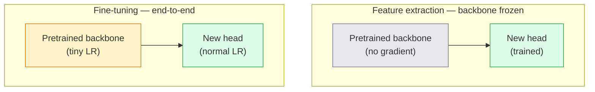

# Transfer Learning & Fine-Tuning

> قضى شخص آخر مليون GPU ساعة في تعليم الشبكة كيف تبدو الحواف والأنسجة وأجزاء الكائن. يجب عليك استعارة هذه الميزات قبل تدريب الميزات الخاصة بك.

**النوع:** بناء
** اللغات: ** بايثون
**المتطلبات:** المرحلة الرابعة الدرس 03 (CNN)، المرحلة الرابعة الدرس 04 (تصنيف الصور)
**الوقت:** ~75 دقيقة

## Learning Objectives

- التمييز بين استخراج الميزات والضبط الدقيق واختيار الخيار المناسب بناءً على حجم مجموعة البيانات ومسافة المجال وميزانية الحساب
- قم بتحميل العمود الفقري المُدرب مسبقًا، واستبدل رأس المصنف الخاص به، وقم بتدريب الرأس فقط على خط الأساس العامل في أقل من 20 سطرًا
- قم بإلغاء تجميد الطبقات تدريجيًا بمعدلات التعلم التمييزية بحيث تحصل الميزات العامة المبكرة على تحديثات أصغر من تلك الخاصة بالمهمة المتأخرة
- تشخيص حالات الفشل الثلاثة الشائعة: انحراف الميزات من LR العالية جدًا على الكتل غير المجمدة، BN انهيار الإحصائيات على مجموعات البيانات الصغيرة، والنسيان الكارثي

## The Problem

يتكلف تدريب ResNet-50 على ImageNet حوالي 2000GPU-ساعة. عدد قليل جدًا من الفرق لديها هذه الميزانية لكل مهمة يقومون بها. ما يقدمه كل فريق تقريبًا هو عمود فقري مُدرب مسبقًا برأس جديد مُدرب على بضع مئات أو بضعة آلاف من الصور الخاصة بالمهمة.

هذا ليس اختصارا. تتعلم مجموعة التحويل الأولى لأي CNN تم تدريبها بواسطة ImageNet الحواف والمرشحات المشابهة لـ Gabor. تتعلم الكتل القليلة التالية القوام والزخارف البسيطة. تتعلم الكتل الوسطى أجزاء الكائن. تتعلم الكتل النهائية المجموعات التي تبدأ في الظهور مثل 1000 فئة من فئات ImageNet. تنتقل أول 90% من هذا التسلسل الهرمي دون تغيير تقريبًا إلى التصوير الطبي، والتفتيش الصناعي، وبيانات الأقمار الصناعية، وكل مهمة رؤية أخرى - لأن الطبيعة لديها مفردات محدودة من الحواف والأنسجة. آخر 10٪ هو ما تدربه بالفعل.

يحتوي إجراء النقل بشكل صحيح على ثلاثة أخطاء في انتظارك: تدمير الميزات المُدربة مسبقًا بمعدل تعليم مرتفع جدًا، وتجويع نموذج المعلومات عن طريق تجميد الكثير، والسماح لإحصائيات BatchNorm الجارية بالانجراف نحو مجموعة بيانات صغيرة لم تتعلم منها بقية الشبكة أبدًا. هذا الدرس يمشي كل واحد منهم عن قصد.

## The Concept

### Feature extraction vs fine-tuning

نظامان، يتم اختيارهما حسب مدى ثقتك في الميزات المُدربة مسبقًا وحجم البيانات المتوفرة لديك.



القواعد الأساسية:

| حجم مجموعة البيانات | مسافة المجال | وصفة |
|--------------|-----------------|--------|
| <1 ألف صورة | بالقرب من إيماج نت | تجميد العمود الفقري، رأس القطار فقط |
| 1ك-10ك | إغلاق | قم بتجميد المراحل 2-3 الأولى، وقم بضبط الباقي |
| 10 ألف - 100 ألف | أي | قم بالضبط الدقيق من البداية إلى النهاية مع التمييز LR |
| 100 ألف+ | بعيد | صقل كل شيء؛ فكر في التدريب من الصفر إذا كان المجال بعيدًا بدرجة كافية |

تعني كلمة "قريب من ImageNet" تقريبًا الصور الطبيعية RGB ذات المحتوى الشبيه بالكائن. تعد عمليات المسح الطبي CT وصور الأقمار الصناعية العلوية والفحص المجهري من المجالات البعيدة - لا تزال الميزات تساعد، ولكنك ستحتاج إلى السماح لمزيد من الطبقات بالتكيف.

### Why freezing works at all

تتميز ImageNet بـ CNN من الدروس غير المتخصصة في 1000 فئة. وهي متخصصة في إحصائيات الصور الطبيعية: الحواف في اتجاهات محددة، والأنسجة، وأنماط التباين، والأشكال الأولية. هذه الإحصائيات مستقرة في كل مجال مرئي تقريبًا يمكن للإنسان تسميته. وهذا هو السبب في أن النموذج الذي تم تدريبه على ImageNet وتم تقييمه بدون لقطة على CIFAR-10 برأس خطي جديد فقط (بدون ضبط العمود الفقري) يصل إلى دقة تزيد عن 80%. يتعلم الرأس أيًا من الميزات التي تم تعلمها بالفعل يناسب هذه المهمة.

### Discriminative learning rates

عندما تقوم بإلغاء التجميد، يجب أن تتدرب الطبقات المبكرة بشكل أبطأ من الطبقات المتأخرة. تقوم الطبقات المبكرة بتشفير الميزات العامة التي تريد الحفاظ عليها؛ تقوم الطبقات المتأخرة بتشفير البنية الخاصة بالمهمة التي تحتاج إلى نقلها كثيرًا.

```
Typical recipe:

  stage 0 (stem + first group): lr = base_lr / 100    (mostly fixed)
  stage 1:                       lr = base_lr / 10
  stage 2:                       lr = base_lr / 3
  stage 3 (last backbone group): lr = base_lr
  head:                          lr = base_lr  (or slightly higher)
```

في PyTorch هذه مجرد قائمة بمجموعات المعلمات التي تم تمريرها إلى المُحسِّن. نموذج واحد، خمسة معدلات تعلم، صفر كود إضافي.

### The BatchNorm problem

تحتوي الطبقات BN على المخازن المؤقتة `running_mean` و `running_var` التي تم حسابها على ImageNet. إذا كانت مهمتك تحتوي على توزيع مختلف لوحدات البكسل - إضاءة مختلفة، ومستشعر مختلف، ومساحة ألوان مختلفة - فإن هذه المخازن المؤقتة تكون خاطئة. ثلاثة خيارات حسب الأفضلية:

1. ** اضبط BN في وضع القطار. ** اسمح لـ BN بتحديث إحصائيات التشغيل الخاصة به مع كل شيء آخر. الاختيار الافتراضي عندما تكون مجموعة بيانات المهمة متوسطة الحجم (>= 5 آلاف من الأمثلة).
2. **قم بتجميد BN في وضع التقييم.** احتفظ بإحصائيات ImageNet وقم بتدريب الأوزان فقط. قم بالتصحيح عندما تكون مجموعة البيانات الخاصة بك صغيرة بما يكفي بحيث يكون المتوسط ​​المتحرك لـ BN صاخبًا.
3. **استبدل BN بـ GroupNorm.** يزيل مشكلة المتوسط ​​المتحرك تمامًا. يستخدم في الكشف والتجزئة حيث يكون حجم الدفعة لكل GPU صغيرًا.

سيؤدي ارتكاب هذا الخطأ إلى خفض الدقة بصمت بنسبة 5-15%.

### Head design

يتكون رأس المصنف من 1-3 طبقات خطية بالإضافة إلى التسرب الاختياري. يشحن كل عمود أساسي لـ torchvision رأسًا افتراضيًا يمكنك استبداله:

```
backbone.fc = nn.Linear(backbone.fc.in_features, num_classes)          # ResNet
backbone.classifier[1] = nn.Linear(..., num_classes)                    # EfficientNet, MobileNet
backbone.heads.head = nn.Linear(..., num_classes)                       # torchvision ViT
```

بالنسبة لمجموعات البيانات الصغيرة، عادة ما تكون طبقة خطية واحدة كافية. تساعد إضافة طبقة مخفية (Linear -> ReLU -> Dropout -> Linear) عندما يكون توزيع المهام بعيدًا عن توزيع التدريب الأساسي.

### Layer-wise LR decay

نسخة أكثر سلاسة من التمييز LR المستخدم في الضبط الدقيق الحديث (BEiT، DINOv2، ViT-B). بدلاً من تجميع الطبقات إلى مراحل، أعط كل طبقة LR أصغر قليلًا من التي فوقها:

```
lr_layer_k = base_lr * decay^(L - k)
```

مع الاضمحلال = 0.75 و L = 12 كتلة محولات، تتدرب الكتلة الأولى عند `0.75^11 ≈ 0.04x` الرأس LR. يعد الأمر أكثر أهمية بالنسبة للضبط الدقيق للمحولات مقارنة بشبكات CNN، حيث تكون LRs المجمعة على مراحل كافية عادةً.

### What to evaluate

تحتاج عمليات نقل التعلم إلى رقمين لن تتمكن من تتبعهما أثناء التشغيل الصفري:

- **الدقة المدربة مسبقًا فقط** — دقة الرأس مع تجميد العمود الفقري. هذه هي الكلمة الخاصة بك.
- **دقة مضبوطة** — نفس النموذج بعد التدريب الشامل. هذا هو السقف الخاص بك.

إذا كان الضبط الدقيق أقل من الضبط المسبق فقط، فهذا يعني أن لديك معدل تعلم أو خطأ BN. قم دائمًا بطباعة كليهما.

## Build It

### Step 1: Load a pretrained backbone and inspect it

```python
import torch
import torch.nn as nn
from torchvision.models import resnet18, ResNet18_Weights

backbone = resnet18(weights=ResNet18_Weights.IMAGENET1K_V1)
print(backbone)
print()
print("classifier head:", backbone.fc)
print("feature dim:", backbone.fc.in_features)
```

`ResNet18` له أربع مراحل (`layer1..layer4`) بالإضافة إلى الجذع والرأس `fc`. كل العمود الفقري لتصنيف torchvision له هيكل مماثل.

### Step 2: Feature extraction — freeze everything, replace the head

```python
def make_feature_extractor(num_classes=10):
    model = resnet18(weights=ResNet18_Weights.IMAGENET1K_V1)
    for p in model.parameters():
        p.requires_grad = False
    model.fc = nn.Linear(model.fc.in_features, num_classes)
    return model

model = make_feature_extractor(num_classes=10)
trainable = sum(p.numel() for p in model.parameters() if p.requires_grad)
frozen = sum(p.numel() for p in model.parameters() if not p.requires_grad)
print(f"trainable: {trainable:>10,}")
print(f"frozen:    {frozen:>10,}")
```

فقط `model.fc` قابل للتدريب. العمود الفقري هو مستخرج الميزات المجمدة.

### Step 3: Discriminative fine-tuning

أداة تعمل على إنشاء مجموعات معلمات بمعدلات تعلم خاصة بمرحلة معينة.

```python
def discriminative_param_groups(model, base_lr=1e-3, decay=0.3):
    stages = [
        ["conv1", "bn1"],
        ["layer1"],
        ["layer2"],
        ["layer3"],
        ["layer4"],
        ["fc"],
    ]
    groups = []
    for i, names in enumerate(stages):
        lr = base_lr * (decay ** (len(stages) - 1 - i))
        params = [p for n, p in model.named_parameters()
                  if any(n.startswith(k) for k in names)]
        if params:
            groups.append({"params": params, "lr": lr, "name": "_".join(names)})
    return groups

model = resnet18(weights=ResNet18_Weights.IMAGENET1K_V1)
model.fc = nn.Linear(model.fc.in_features, 10)
for p in model.parameters():
    p.requires_grad = True

groups = discriminative_param_groups(model)
for g in groups:
    print(f"{g['name']:>10s}  lr={g['lr']:.2e}  params={sum(p.numel() for p in g['params']):>8,}")
```

`decay=0.3` يعني أن كل مرحلة تتدرب بنسبة 30% من معدل المرحلة التالية. `fc` يحصل على `base_lr`، `layer4` يحصل على gets، ` يحصل على 0. السبر المدقع. تجريبيا يعمل.

### Step 4: BatchNorm handling

مساعد على تجميد BN تشغيل الإحصائيات دون تجميد أوزانها.

```python
def freeze_bn_stats(model):
    for m in model.modules():
        if isinstance(m, (nn.BatchNorm1d, nn.BatchNorm2d, nn.BatchNorm3d)):
            m.eval()
            for p in m.parameters():
                p.requires_grad = False
    return model
```

قم بتسميته بعد ضبط `model.train()` في بداية كل عصر. `model.train()` يقلب كل شيء إلى وضع التدريب؛ وهذا يعكسها فقط لطبقات BN.

### Step 5: A minimal end-to-end fine-tuning loop

```python
from torch.optim import SGD
from torch.utils.data import DataLoader
from torch.optim.lr_scheduler import CosineAnnealingLR
import torch.nn.functional as F

def fine_tune(model, train_loader, val_loader, device, epochs=5, base_lr=1e-3, freeze_bn=False):
    model = model.to(device)
    groups = discriminative_param_groups(model, base_lr=base_lr)
    optimizer = SGD(groups, momentum=0.9, weight_decay=1e-4, nesterov=True)
    scheduler = CosineAnnealingLR(optimizer, T_max=epochs)

    for epoch in range(epochs):
        model.train()
        if freeze_bn:
            freeze_bn_stats(model)
        tr_loss, tr_correct, tr_total = 0.0, 0, 0
        for x, y in train_loader:
            x, y = x.to(device), y.to(device)
            logits = model(x)
            loss = F.cross_entropy(logits, y, label_smoothing=0.1)
            optimizer.zero_grad()
            loss.backward()
            optimizer.step()
            tr_loss += loss.item() * x.size(0)
            tr_total += x.size(0)
            tr_correct += (logits.argmax(-1) == y).sum().item()
        scheduler.step()

        model.eval()
        va_total, va_correct = 0, 0
        with torch.no_grad():
            for x, y in val_loader:
                x, y = x.to(device), y.to(device)
                pred = model(x).argmax(-1)
                va_total += x.size(0)
                va_correct += (pred == y).sum().item()
        print(f"epoch {epoch}  train {tr_loss/tr_total:.3f}/{tr_correct/tr_total:.3f}  "
              f"val {va_correct/va_total:.3f}")
    return model
```

خمس فترات مع الوصفة المذكورة أعلاه في CIFAR-10 تأخذ `ResNet18-IMAGENET1K_V1` من دقة المسبار الخطي بدون طلقة بنسبة 70% تقريبًا إلى دقة الضبط الدقيق بنسبة 93% تقريبًا. سوف يستقر الرأس وحده بنسبة 86٪ دون لمس العمود الفقري على الإطلاق.

### Step 6: Progressive unfreezing

جدول زمني يلغي تجميد مرحلة واحدة في كل عصر من النهاية إلى البداية. يخفف الانجراف على حساب بعض العصور الإضافية.

```python
def progressive_unfreeze_schedule(model):
    stages = ["layer4", "layer3", "layer2", "layer1"]
    yielded = set()

    def start():
        for p in model.parameters():
            p.requires_grad = False
        for p in model.fc.parameters():
            p.requires_grad = True

    def unfreeze(epoch):
        if epoch < len(stages):
            name = stages[epoch]
            yielded.add(name)
            for n, p in model.named_parameters():
                if n.startswith(name):
                    p.requires_grad = True
            return name
        return None

    return start, unfreeze
```

اتصل بـ `start()` مرة واحدة قبل الفترة الأولى. اتصل بالرقم `unfreeze(epoch)` في بداية كل فترة. أعد بناء المُحسِّن كلما تغيرت مجموعة المعلمات القابلة للتدريب، وإلا فإن المعلمات المجمدة ستظل تحتفظ باللحظات المخزنة مؤقتًا التي تربكها.

## Use It

بالنسبة لمعظم المهام الحقيقية، `torchvision.models` + ثلاثة أسطر كافية. تعتبر الآلات الثقيلة المذكورة أعلاه مهمة عندما تواجه مشكلات لا يمكن للإعدادات الافتراضية للمكتبة إصلاحها.

```python
from torchvision.models import resnet50, ResNet50_Weights

model = resnet50(weights=ResNet50_Weights.IMAGENET1K_V2)
model.fc = nn.Linear(model.fc.in_features, num_classes)
optimizer = torch.optim.AdamW(model.parameters(), lr=1e-4, weight_decay=1e-4)
```

اثنين من الإعدادات الافتراضية الأخرى على مستوى الإنتاج:

- `timm` يشحن ~800 عمودًا فقريًا للرؤية مدربة مسبقًا مع API (`timm.create_model("resnet50", pretrained=True, num_classes=10)`) متسق. بالنسبة لأي ضبط دقيق خارج حديقة حيوان Torchvision، فهذا هو المعيار.
- بالنسبة للمحولات، `transformers.AutoModelForImageClassification.from_pretrained(name, num_labels=N)` يمنحك ViT / BEiT / DeiT بنفس دلالات التحميل مثل النماذج النصية.

## Ship It

ينتج هذا الدرس:

- `outputs/prompt-fine-tune-planner.md` — مطالبة تختار استخراج الميزات مقابل الضبط التدريجي مقابل الضبط الدقيق الشامل استنادًا إلى حجم مجموعة البيانات ومسافة المجال وميزانية الحساب.
- `outputs/skill-freeze-inspector.md` — مهارة تُبلغ، في ضوء النموذج PyTorch، عن المعلمات القابلة للتدريب، وطبقات BatchNorm الموجودة في وضع التقييم، وما إذا كان المُحسِّن يتم تغذيته بالفعل بالمعلمات القابلة للتدريب.

## Exercises

1. **(سهل)** قم بتدريب `ResNet18` كمسبار خطي (العمود الفقري مجمد) وكضبط دقيق كامل على نفس مجموعة البيانات الاصطناعية CIFAR. قم بالإبلاغ عن كلا الدقة جنبًا إلى جنب. اشرح أي فجوة تخبرك أن الميزات تنتقل بشكل جيد وأي فجوة تخبرك أنها لا تفعل ذلك.
2. **(متوسط)** قم بتقديم خطأ عن قصد: اضبط `base_lr = 1e-1` على مرحلة العمود الفقري بدلاً من الرأس. أظهر خسارة التدريب وهي تنفجر، ثم قم بالتعافي من خلال تطبيق المساعد `discriminative_param_groups`. سجل LR الذي تبدأ عنده كل مرحلة بالتباعد.
3. **(صعب)** خذ مجموعة بيانات التصوير الطبي (على سبيل المثال CheXpert-small، أو PatchCamelyon، أو HAM10000) وقارن بين ثلاثة أنظمة: (أ) العمود الفقري المجمد المدرّب مسبقًا بواسطة ImageNet + الرأس الخطي؛ (ب) الضبط الدقيق الشامل من البداية إلى النهاية بواسطة برنامج ImageNet؛ (ج) التدريب على الصفر. دقة التقرير وحساب التكلفة لكل منها. في أي حجم لمجموعة البيانات يصبح التدريب الصفري تنافسيًا؟

## Key Terms

| مصطلح | ماذا يقول الناس | ماذا يعني في الواقع |
|------|----------------|----------------------|
| استخراج الميزة | "تجميد وتدريب الرأس" | تم تجميد معلمات العمود الفقري، ولا يتلقى سوى رأس المصنف الجديد التدرج |
| ضبط دقيق | "إعادة التدريب من البداية إلى النهاية" | جميع المعلمات قابلة للتدريب، عادةً بـ LR أصغر بكثير من التدريب على الصفر |
| تمييز LR | "أصغر LR للطبقات المبكرة" | مجموعات معلمات المُحسِّن حيث تكون المرحلة المبكرة LR جزءًا صغيرًا من المرحلة المتأخرة LR |
| الطبقة الحكيمة LR الاضمحلال | "سلس LR التدرج" | لكل طبقة LR مضروبة في الاضمحلال^(L - k); شائع في الضبط الدقيق للمحولات |
| النسيان الكارثي | "فقد النموذج ImageNet" | يقوم LR المرتفع جدًا بالكتابة فوق الميزات المُدربة مسبقًا قبل التعرف على إشارة المهمة الجديدة |
| BN إحصائيات الانجراف | "التشغيل يعني خطأ" | تم حساب BatchNorm Running_mean/var على توزيع مختلف عن المهمة الحالية، مما يضر بالدقة بصمت |
| مسبار خطي | "العمود الفقري المتجمد + الرأس الخطي" | تقييم الميزات المدربة مسبقًا – دقة أفضل مصنف خطي أعلى التمثيل المجمد |
| انهيار كارثي | "كل شيء يتنبأ بصنف واحد" | يحدث عند الضبط الدقيق بدرجة LR عالية بما يكفي لتدمير الميزات قبل أن تتمكن التدرجات من الرأس من الاستقرار |

## Further Reading

- [How transferable are features in deep neural networks? (Yosinski et al., 2014)](https://arxiv.org/abs/1411.1792) — the paper that quantified feature transferability across layers
- [Universal Language Model Fine-tuning (ULMFiT, Howard & Ruder, 2018)](https://arxiv.org/abs/1801.06146) — التمييز الأصلي LR / وصفة التجميد التدريجي؛ تنتقل الأفكار مباشرة إلى الرؤية
- [timm documentation](https://huggingface.co/docs/timm) — the reference for modern vision backbones and the exact fine-tune defaults they were trained with
- [A Simple Framework for Linear-Probe Evaluation (Kornblith et al., 2019)](https://arxiv.org/abs/1805.08974) — سبب أهمية دقة المسبار الخطي وكيفية الإبلاغ عنها بشكل صحيح
