# اكتشاف الأشياء — YOLO من الصفر
> الاكتشاف عبارة عن تصنيف بالإضافة إلى الانحدار، ويتم تشغيله في كل موضع في خريطة المعالم، ثم يتم تنظيفه باستخدام الحد الأقصى من القمع.
**النوع:** بناء
** اللغات: ** بايثون
** المتطلبات الأساسية: ** المرحلة الرابعة الدرس 03 (CNN)، المرحلة الرابعة الدرس 04 (تصنيف الصور)، المرحلة الرابعة الدرس 05 (نقل التعلم)
**الوقت:** ~75 دقيقة
## أهداف التعلم
- شرح تصميم الشبكة والمرساة الذي يحول الاكتشاف إلى مشكلة تنبؤ كثيفة ويذكر ما يعنيه كل رقم في موتر الإخراج
- حساب التقاطع فوق الاتحاد بين الصناديق وتنفيذ الحد الأقصى من القمع من الصفر
- أنشئ الحد الأدنى من نمط YOLO أعلى العمود الفقري المُدرب مسبقًا، بما في ذلك التصنيف والموضوعية وخسائر انحدار الصندوق
- اقرأ صف قياس الكشف (الدقة@0.5، الاستدعاء، mAP@0.5، mAP@0.5:0.95) واختر المقبض الذي سيتم تشغيله بعد ذلك
## المشكلة
التصنيف يقول "هذه الصورة كلب". يقول الاكتشاف "يوجد كلب عند وحدات البكسل (112، 40، 280، 210)، ويوجد قطة عند (400، 180، 560، 310)، ولا يوجد شيء آخر في الإطار." هذا التغيير الهيكلي الوحيد - التنبؤ بعدد متغير من الصناديق ذات العلامات بدلاً من تسمية واحدة لكل صورة - هو ما يعتمد عليه كل نظام مستقل، وكل منتج مراقبة، وكل محلل لتخطيط المستندات، وكل خط رؤية للمصنع.
الاكتشاف هو أيضًا المكان الذي تظهر فيه كل مقايضة هندسية في الرؤية مرة واحدة. تريد مربعات دقيقة (رأس الانحدار)، وتريد الفئة المناسبة لكل مربع (رأس التصنيف)، وتريد أن يعرف النموذج عندما لا يكون هناك شيء يمكن اكتشافه (درجة الكائن)، وتريد تنبؤًا واحدًا بالضبط لكل كائن حقيقي (عدم الحد الأقصى للقمع). إذا أخطأت أيًا من هذه الأشياء، فإن خط pipe إما يفتقد الكائنات، أو يبلغ عن صناديق مهلوسة، أو يتنبأ بنفس الكائن خمس عشرة مرة في مواضع مختلفة قليلاً.
YOLO (أنت تنظر مرة واحدة فقط، Redmon et al. 2016) هو التصميم الذي جعل كل هذا يتم تشغيله في الوقت الفعلي من خلال القيام بذلك بتمريرة أمامية واحدة لشبكة تحويل، ولا تزال نفس القرارات الهيكلية هي العمود الفقري لأجهزة الكشف الحديثة (YOLOv8، YOLOv9، YOLO-NAS، RT-DETR). تعلم جوهر كل متغير ويصبح إعادة ترتيب لنفس الأجزاء.
##المفهوم
### الكشف كتنبؤ كثيف
يقوم المصنف بإخراج أرقام C لكل صورة. يقوم الكاشف ذو النمط YOLO بإخراج `(S x S x (5 + C))` من الأرقام لكل صورة، حيث S هو حجم الشبكة المكانية.

```mermaid
flowchart LR
    IMG["Input 416x416 RGB"] --> BB["Backbone<br/>(ResNet, DarkNet, ...)"]
    BB --> FM["Feature map<br/>(C_feat, 13, 13)"]
    FM --> HEAD["Detection head<br/>(1x1 convs)"]
    HEAD --> OUT["Output tensor<br/>(13, 13, B * (5 + C))"]
    OUT --> DEC["Decode<br/>(grid + sigmoid + exp)"]
    DEC --> NMS["Non-max suppression"]
    NMS --> RESULT["Final boxes"]

    style IMG fill:#dbeafe,stroke:#2563eb
    style HEAD fill:#fef3c7,stroke:#d97706
    style NMS fill:#fecaca,stroke:#dc2626
    style RESULT fill:#dcfce7,stroke:#16a34a
```


تتنبأ كل خلية من خلايا الشبكة `S * S` بمربعات `B`. لكل صندوق:
- 4 أرقام تصف الشكل الهندسي: `tx, ty, tw, th`.
- رقم واحد هو درجة الموضوعية: "هل يوجد كائن متمركز في هذه الخلية؟"
- أرقام C هي احتمالات الفئة.
الإجمالي لكل خلية: `B * (5 + C)`. بالنسبة إلى VOC مع `S=13, B=2, C=20`، يكون هذا 50 رقمًا لكل خلية.
### لماذا الشبكات والمراسي
يتنبأ الانحدار البسيط بـ `(x, y, w, h)` لكل كائن كإحداثي مطلق. يعد هذا أمرًا صعبًا بالنسبة لشبكة التحويل لأن ترجمة الصورة لا ينبغي أن تترجم جميع التنبؤات بنفس المقدار - فكل كائن مثبت مكانيًا. تجيب الشبكة على ذلك من خلال تعيين كل مربع الحقيقة الأرضية لخلية الشبكة التي يقع مركزها فيها؛ فقط تلك الخلية هي المسؤولة عن هذا الكائن.
تعالج المراسي مشكلة ثانية. لا يمكن للتحويل 3x3 أن يتراجع بسهولة عن مربع بعرض 500 بكسل من خلية ميزة حقل تقبلية تبلغ 16 بكسل. بدلاً من ذلك، نقوم مسبقًا بتعريف `B` أشكال المربعات السابقة (المثبتات) لكل خلية ونتوقع دلتا صغيرة من كل نقطة ارتساء. يتعلم النموذج كيفية اختيار المرساة الصحيحة ودفعها بدلاً من التراجع من لا شيء.
```
Anchor box priors (example for 416x416 input):

  small:   (30,  60)
  medium:  (75,  170)
  large:   (200, 380)

At each grid cell, every anchor emits (tx, ty, tw, th, obj, c_1, ..., c_C).
```

غالبًا ما تستخدم أجهزة الكشف الحديثة FPN مع مجموعات ربط مختلفة لكل دقة - نقاط تثبيت صغيرة على الخرائط الضحلة عالية الدقة، ونقاط تثبيت كبيرة على الخرائط العميقة منخفضة الدقة. نفس الفكرة، المزيد من المقاييس.
### فك التوقعات
`tx, ty, tw, th` الأولي ليس إحداثيات مربعة؛ إنها أهداف انحدار يجب تحويلها قبل التخطيط:
```
centre x  = (sigmoid(tx) + cell_x) * stride
centre y  = (sigmoid(ty) + cell_y) * stride
width     = anchor_w * exp(tw)
height    = anchor_h * exp(th)
```

`sigmoid` يحتفظ بإزاحات المركز داخل الخلية. `exp` يتيح مقياس العرض بحرية من نقطة الارتساء بدون قلب الإشارة. `stride` يقيس إحداثيات الشبكة إلى وحدات البكسل. خطوة فك التشفير هذه هي نفسها في كل إصدار YOLO منذ الإصدار 2.
### آيو
مقياس التشابه العالمي للكشف بين صندوقين:
```
IoU(A, B) = area(A intersect B) / area(A union B)
```

IoU = 1 يعني متطابقة؛ IoU = 0 يعني عدم وجود تداخل. IoU بين التنبؤ ومربع الحقيقة الأرضية هو ما يقرر ما إذا كان التنبؤ يعتبر إيجابيًا حقيقيًا (عادةً IoU > = 0.5). IoU بين توقعين هو ما يستخدمه NMS لإلغاء التكرار.
### عدم الحد الأقصى للقمع
غالبًا ما تتنبأ شبكة التحويل المدربة على نقاط الارتساء المتجاورة بمربعات متداخلة لنفس الكائن. NMS يحتفظ بالتنبؤ بأعلى مستوى من الثقة ويحذف أي تنبؤ آخر يكون فيه IoU أعلى من الحد.
```
NMS(boxes, scores, iou_threshold):
    sort boxes by score descending
    keep = []
    while boxes not empty:
        pick the top-scoring box, add to keep
        remove every box with IoU > iou_threshold to the picked box
    return keep
```

العتبة النموذجية: 0.45 للكشف عن الكائنات. تستبدل أجهزة الكشف الحديثة المعيار NMS بـ `soft-NMS`، `DIoU-NMS`، أو تتعلم القمع مباشرة (RT-DETR) ولكن الغرض الهيكلي هو نفسه.
### الخسارة
YOLO الخسارة هي ثلاث خسائر مضافة مع الأوزان:
```
L = lambda_coord * L_box(pred, target, where obj=1)
  + lambda_obj   * L_obj(pred, 1,     where obj=1)
  + lambda_noobj * L_obj(pred, 0,     where obj=0)
  + lambda_cls   * L_cls(pred, target, where obj=1)
```

فقط الخلايا التي تحتوي على كائن هي التي تساهم في خسائر الانحدار والتصنيف. تساهم الخلايا التي لا تحتوي على كائنات إلا في فقدان الموضوعية (تعليم النموذج التزام الصمت). `lambda_noobj` عادةً ما يكون صغيرًا (~0.5) لأن الغالبية العظمى من الخلايا فارغة وقد تهيمن على الخسارة الإجمالية.
تقوم المتغيرات الحديثة باستبدال فقدان مربع MSE بـ CIoU / DIoU (الذي يعمل على تحسين IoU مباشرة)، واستخدام الخسارة البؤرية لعدم توازن الفئة، وموازنة الموضوعية مع الخسارة البؤرية عالية الجودة. الهيكل المكون من ثلاثة مكونات لم يتغير.
### مقاييس الكشف
الدقة لا تنتقل إلى الكشف. أربعة أرقام تفعل ذلك:
- **Precision@IoU=0.5** — من بين التوقعات التي تم اعتبارها إيجابية، كم عدد التوقعات الصحيحة بالفعل.
- **Recall@IoU=0.5** — من بين الأشياء الحقيقية، كم عدد الأشياء التي وجدناها؟
- **AP@0.5** — منطقة منحنى الاسترجاع الدقيق عند عتبة IoU 0.5؛ رقم واحد لكل فصل.
- **mAP@0.5:0.95** — متوسط ​​AP فوق حدود IoU 0.5، 0.55، ...، 0.95. مقياس COCO؛ الأكثر صرامة والأكثر إفادة.
الإبلاغ عن الأربعة. الكاشف القوي على mAP@0.5 ولكنه ضعيف على mAP@0.5:0.95 يتم تحديد موقعه بشكل تقريبي ولكن ليس بإحكام؛ الإصلاح مع خسارة انحدار الصندوق بشكل أفضل. يعد الكاشف ذو الدقة العالية والاستدعاء المنخفض محافظًا للغاية؛ خفض عتبة الثقة أو زيادة وزن الكائن.
## بنائها
### الخطوة 1: وحدة المعلومات
العمود الفقري للدرس كله. يعمل على صفيفين من الصناديق بتنسيق `(x1, y1, x2, y2)`.
```python
import numpy as np

def box_iou(boxes_a, boxes_b):
    ax1, ay1, ax2, ay2 = boxes_a[:, 0], boxes_a[:, 1], boxes_a[:, 2], boxes_a[:, 3]
    bx1, by1, bx2, by2 = boxes_b[:, 0], boxes_b[:, 1], boxes_b[:, 2], boxes_b[:, 3]

    inter_x1 = np.maximum(ax1[:, None], bx1[None, :])
    inter_y1 = np.maximum(ay1[:, None], by1[None, :])
    inter_x2 = np.minimum(ax2[:, None], bx2[None, :])
    inter_y2 = np.minimum(ay2[:, None], by2[None, :])

    inter_w = np.clip(inter_x2 - inter_x1, 0, None)
    inter_h = np.clip(inter_y2 - inter_y1, 0, None)
    inter = inter_w * inter_h

    area_a = (ax2 - ax1) * (ay2 - ay1)
    area_b = (bx2 - bx1) * (by2 - by1)
    union = area_a[:, None] + area_b[None, :] - inter
    return inter / np.clip(union, 1e-8, None)
```

تُرجع مصفوفة `(N_a, N_b)` لوحدات IoU الزوجية. استخدمه ضد مربع الحقيقة الأرضية بجعل إحدى المصفوفات على شكل `(1, 4)`.
### الخطوة 2: القمع غير الأقصى
```python
def nms(boxes, scores, iou_threshold=0.45):
    order = np.argsort(-scores)
    keep = []
    while len(order) > 0:
        i = order[0]
        keep.append(i)
        if len(order) == 1:
            break
        rest = order[1:]
        ious = box_iou(boxes[[i]], boxes[rest])[0]
        order = rest[ious <= iou_threshold]
    return np.array(keep, dtype=np.int64)
```

حتمية، `O(N log N)` من الفرز، وتتطابق مع سلوك `torchvision.ops.nms` على المدخلات المتطابقة.
### الخطوة 3: تشفير وفك تشفير الصندوق
التحويل بين إحداثيات البكسل وأهداف `(tx, ty, tw, th)` التي تتراجع عنها الشبكة بالفعل.
```python
def encode(box_xyxy, cell_x, cell_y, stride, anchor_wh):
    x1, y1, x2, y2 = box_xyxy
    cx = 0.5 * (x1 + x2)
    cy = 0.5 * (y1 + y2)
    w = x2 - x1
    h = y2 - y1
    tx = cx / stride - cell_x
    ty = cy / stride - cell_y
    tw = np.log(w / anchor_wh[0] + 1e-8)
    th = np.log(h / anchor_wh[1] + 1e-8)
    return np.array([tx, ty, tw, th])


def decode(tx_ty_tw_th, cell_x, cell_y, stride, anchor_wh):
    tx, ty, tw, th = tx_ty_tw_th
    cx = (sigmoid(tx) + cell_x) * stride
    cy = (sigmoid(ty) + cell_y) * stride
    w = anchor_wh[0] * np.exp(tw)
    h = anchor_wh[1] * np.exp(th)
    return np.array([cx - w / 2, cy - h / 2, cx + w / 2, cy + h / 2])


def sigmoid(x):
    return 1.0 / (1.0 + np.exp(-x))
```

الاختبار: قم بتشفير صندوق ثم فك تشفيره - يجب أن تستعيد شيئًا قريبًا جدًا من الأصل (حتى لا يكون المعكوس السيني قابلاً للعكس تمامًا عندما لا يكون `tx` في النطاق ما بعد السيني).
### الخطوة 4: الحد الأدنى من رأس YOLO
تحويل 1x1 واحد على خريطة الميزات، مع إعادة التشكيل إلى `(B, S, S, num_anchors, 5 + C)`.
```python
import torch
import torch.nn as nn

class YOLOHead(nn.Module):
    def __init__(self, in_c, num_anchors, num_classes):
        super().__init__()
        self.num_anchors = num_anchors
        self.num_classes = num_classes
        self.conv = nn.Conv2d(in_c, num_anchors * (5 + num_classes), kernel_size=1)

    def forward(self, x):
        n, _, h, w = x.shape
        y = self.conv(x)
        y = y.view(n, self.num_anchors, 5 + self.num_classes, h, w)
        y = y.permute(0, 3, 4, 1, 2).contiguous()
        return y
```

شكل الإخراج: `(N, H, W, num_anchors, 5 + C)`. البعد الأخير يحمل `[tx, ty, tw, th, obj, cls_0, ..., cls_{C-1}]`.
### الخطوة 5: مهمة الحقيقة الأرضية
لكل مربع الحقيقة الأرضية، حدد `(cell, anchor)` المسؤول.
```python
def assign_targets(boxes_xyxy, classes, anchors, stride, grid_size, num_classes):
    num_anchors = len(anchors)
    target = np.zeros((grid_size, grid_size, num_anchors, 5 + num_classes), dtype=np.float32)
    has_obj = np.zeros((grid_size, grid_size, num_anchors), dtype=bool)

    for box, cls in zip(boxes_xyxy, classes):
        x1, y1, x2, y2 = box
        cx, cy = 0.5 * (x1 + x2), 0.5 * (y1 + y2)
        gx, gy = int(cx / stride), int(cy / stride)
        bw, bh = x2 - x1, y2 - y1

        ious = np.array([
            (min(bw, aw) * min(bh, ah)) / (bw * bh + aw * ah - min(bw, aw) * min(bh, ah))
            for aw, ah in anchors
        ])
        best = int(np.argmax(ious))
        aw, ah = anchors[best]

        target[gy, gx, best, 0] = cx / stride - gx
        target[gy, gx, best, 1] = cy / stride - gy
        target[gy, gx, best, 2] = np.log(bw / aw + 1e-8)
        target[gy, gx, best, 3] = np.log(bh / ah + 1e-8)
        target[gy, gx, best, 4] = 1.0
        target[gy, gx, best, 5 + cls] = 1.0
        has_obj[gy, gx, best] = True
    return target, has_obj
```

اختيار المرساة هو "أفضل شكل IoU مع الحقيقة الأساسية" - وكيل رخيص يطابق مهمة YOLOv2/v3. يستخدم الإصدار الخامس والإصدارات الأحدث إستراتيجيات أكثر تعقيدًا (المطابقة المحاذاة للمهام، والديناميكية k) التي تعمل على تحسين نفس الفكرة.
### الخطوة السادسة: الخسائر الثلاثة
```python
def yolo_loss(pred, target, has_obj, lambda_coord=5.0, lambda_obj=1.0, lambda_noobj=0.5, lambda_cls=1.0):
    has_obj_t = torch.from_numpy(has_obj).bool()
    target_t = torch.from_numpy(target).float()

    # box-regression loss: only on cells with objects
    box_pred = pred[..., :4][has_obj_t]
    box_true = target_t[..., :4][has_obj_t]
    loss_box = torch.nn.functional.mse_loss(box_pred, box_true, reduction="sum")

    # objectness loss
    obj_pred = pred[..., 4]
    obj_true = target_t[..., 4]
    loss_obj_pos = torch.nn.functional.binary_cross_entropy_with_logits(
        obj_pred[has_obj_t], obj_true[has_obj_t], reduction="sum")
    loss_obj_neg = torch.nn.functional.binary_cross_entropy_with_logits(
        obj_pred[~has_obj_t], obj_true[~has_obj_t], reduction="sum")

    # classification loss on cells with objects
    cls_pred = pred[..., 5:][has_obj_t]
    cls_true = target_t[..., 5:][has_obj_t]
    loss_cls = torch.nn.functional.binary_cross_entropy_with_logits(
        cls_pred, cls_true, reduction="sum")

    total = (lambda_coord * loss_box
             + lambda_obj * loss_obj_pos
             + lambda_noobj * loss_obj_neg
             + lambda_cls * loss_cls)
    return total, {"box": loss_box.item(), "obj_pos": loss_obj_pos.item(),
                   "obj_neg": loss_obj_neg.item(), "cls": loss_cls.item()}
```

خمس معلمات مفرطة يقوم كل برنامج تعليمي YOLO إما بتشفيرها أو مسحها. النسب مهمة: `lambda_coord=5, lambda_noobj=0.5` يعكس ورقة YOLOv1 الأصلية ولا يزال يعمل كإعداد افتراضي معقول.
### الخطوة 7: الاستدلال pipeline
قم بفك تشفير مخرجات الرأس الخام، وتطبيق السيني/الخبرة، والعتبة على الكائن، وNMS.
```python
def postprocess(pred_tensor, anchors, stride, img_size, conf_threshold=0.25, iou_threshold=0.45):
    pred = pred_tensor.detach().cpu().numpy()
    grid_h, grid_w = pred.shape[1], pred.shape[2]
    num_anchors = len(anchors)

    boxes, scores, classes = [], [], []
    for gy in range(grid_h):
        for gx in range(grid_w):
            for a in range(num_anchors):
                tx, ty, tw, th, obj, *cls = pred[0, gy, gx, a]
                score = sigmoid(obj) * sigmoid(np.array(cls)).max()
                if score < conf_threshold:
                    continue
                cls_idx = int(np.argmax(cls))
                cx = (sigmoid(tx) + gx) * stride
                cy = (sigmoid(ty) + gy) * stride
                w = anchors[a][0] * np.exp(tw)
                h = anchors[a][1] * np.exp(th)
                boxes.append([cx - w / 2, cy - h / 2, cx + w / 2, cy + h / 2])
                scores.append(float(score))
                classes.append(cls_idx)

    if not boxes:
        return np.zeros((0, 4)), np.zeros((0,)), np.zeros((0,), dtype=int)
    boxes = np.array(boxes)
    scores = np.array(scores)
    classes = np.array(classes)
    keep = nms(boxes, scores, iou_threshold)
    return boxes[keep], scores[keep], classes[keep]
```

هذا هو مسار التقييم الكامل: الرأس -> فك التشفير -> العتبة -> NMS.
## استخدمه
`torchvision.models.detection` يشحن كاشفات الإنتاج بنفس البنية المفاهيمية. يستغرق تحميل نموذج تم تدريبه مسبقًا ثلاثة أسطر.
```python
import torch
from torchvision.models.detection import fasterrcnn_resnet50_fpn_v2

model = fasterrcnn_resnet50_fpn_v2(weights="DEFAULT")
model.eval()
with torch.no_grad():
    predictions = model([torch.randn(3, 400, 600)])
print(predictions[0].keys())
print(f"boxes:  {predictions[0]['boxes'].shape}")
print(f"scores: {predictions[0]['scores'].shape}")
print(f"labels: {predictions[0]['labels'].shape}")
```

بالنسبة للاستدلال في الوقت الفعلي pipelines، `ultralytics` (YOLOv8/v9) هو المعيار: `from ultralytics import YOLO; model = YOLO('yolov8n.pt'); model(img)`. يتعامل النموذج مع فك التشفير وNMS داخليًا ويعيد نفس `boxes / scores / labels` الثلاثي الذي قمت بإنشائه أعلاه.
## اشحنها
ينتج هذا الدرس:
- `outputs/prompt-detection-metric-reader.md` — مطالبة تحول صف `precision, recall, AP, mAP@0.5:0.95` إلى تشخيص من سطر واحد والتجربة التالية الأكثر فائدة.
- `outputs/skill-anchor-designer.md` — مهارة تؤدي، في ضوء مجموعة بيانات من مربعات الحقيقة الأرضية، إلى تشغيل وسائل k على `(w, h)` وإرجاع مجموعات نقاط الارتساء لكل مستوى FPN بالإضافة إلى إحصائيات التغطية التي تحتاجها لاختيار العدد الصحيح من نقاط الارتساء.
## تمارين
1. **(سهل)** قم بتنفيذ `box_iou` وتشغيله مقابل `torchvision.ops.box_iou` على 1000 زوج من الصناديق العشوائية. تحقق من أن الحد الأقصى للفرق المطلق أقل من `1e-6`.
2. **(متوسط)** منفذ `yolo_loss` إلى إصدار يستخدم `CIoU` فقدان المربع بدلاً من MSE. أظهر على مجموعة بيانات تركيبية مكونة من 100 صورة أن CIoU يتقارب إلى mAP@0.5:0.95 نهائي أفضل من MSE في نفس العدد من العصور.
3. **(صعب)** تنفيذ الاستدلال متعدد المقاييس: تغذية نفس الصورة بثلاثة دقة من خلال النموذج، وتوحيد توقعات المربع، وتشغيل NMS واحد في النهاية. قم بقياس رفع MAP مقابل الاستدلال أحادي النطاق على مجموعة محتجزة.
## المصطلحات الرئيسية
| مصطلح | ماذا يقول الناس | ماذا يعني في الواقع |
|------|----------------|----------------------|
| مرساة | "المربع السابق" | شكل مربع محدد مسبقًا في كل خلية شبكة تتنبأ الشبكة من خلاله بالدلتا بدلاً من الإحداثيات المطلقة |
| آيو | "التداخل" | تقاطع فوق اتحاد صندوقين؛ مقياس التشابه الشامل في الكشف |
| NMS | "إلغاء التكرار" | خوارزمية جشعة تحافظ على التنبؤات ذات أعلى الدرجات وتزيل التوقعات المتداخلة فوق العتبة |
| الكائنية | "هل هناك شيء هنا" | عدد عددي لكل خلية يتنبأ بما إذا كان الكائن متمركزًا في تلك الخلية أم لا |
| خطوة الشبكة | "عامل الاختزال" | بكسل لكل خلية الشبكة؛ مدخل بحجم 416 بكسل برأس مكون من 13 شبكة له خطوة 32 |
| الخريطة | "متوسط ​​​​الدقة" | متوسط ​​المساحة الواقعة تحت منحنى الاسترجاع الدقيق، المتوسط ​​على الفئات و(COCO) عتبات IoU |
| AP@0.5 | "PASCAL VOC AP" | متوسط ​​الدقة مع عتبة IoU 0.5؛ النسخة المتساهلة من المقياس |
| mAP@0.5:0.95 | "COCO AP" | المتوسط ​​فوق عتبات IoU 0.5..0.95 خطوة 0.05؛ النسخة الصارمة ومعيار المجتمع الحالي |
## مزيد من القراءة
- [YOLOv1: You Only Look Once (Redmon et al., 2016)](https://arxiv.org/abs/1506.02640) — الورقة التأسيسية؛ كل YOLO منذ ذلك الحين هو تحسين لهذا الهيكل
- [YOLOv3 (Redmon & Farhadi, 2018)](https://arxiv.org/abs/1804.02767) — الورقة التي قدمت رؤوسًا ذات نمط FPN متعددة المقاييس؛ لا يزال الرسم البياني الأكثر وضوحا
- [Ultralytics YOLOv8 docs](https://docs.ultralytics.com) — مرجع الإنتاج الحالي؛ يغطي تنسيقات مجموعة البيانات، والتعزيزات، ووصفات التدريب
- [The Illustrated Guide to Object Detection (Jonathan Hui)](https://jonathan-hui.medium.com/object-detection-series-24d03a12f904) — أفضل جولة باللغة الإنجليزية في حديقة حيوانات الكاشف الكاملة؛ لا يقدر بثمن لفهم كيفية ارتباط DETR وRetinaNet وFCOS وYOLO