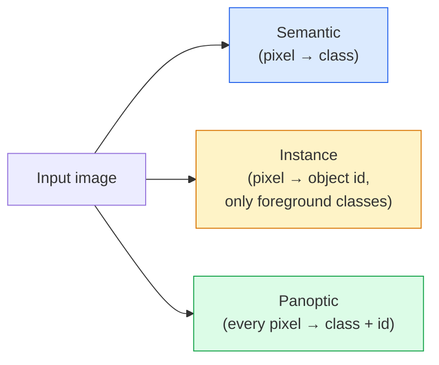
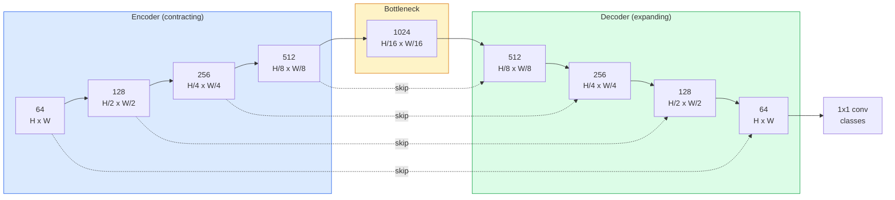

# Semantic Segmentation — U-Net

> يتم تصنيف التقسيم في كل بكسل. يعمل U-Net makes عن طريق إقران جهاز تشفير الاختزال مع جهاز فك التشفير وتخطي التوصيلات السلكية بينهما.

**النوع:** بناء
** اللغات: ** بايثون
**المتطلبات:** المرحلة الرابعة الدرس 03 (CNN)، المرحلة الرابعة الدرس 04 (تصنيف الصور)
**الوقت:** ~75 دقيقة

## Learning Objectives

- التمييز بين التجزئة الدلالية والمثالية والبانوبتيكية واختيار المهمة المناسبة لمشكلة معينة
- أنشئ شبكة U-Net من الصفر في PyTorch باستخدام كتل التشفير وعنق الزجاجة ووحدة فك التشفير مع التلافيف المنقولة وتخطي الاتصالات
- تنفيذ الإنتروبيا المتقاطعة حسب البكسل، وخسارة النرد، والخسارة المجمعة التي تمثل الوضع الافتراضي الحالي للتجزئة الطبية والصناعية
- قراءة مقاييس IoU وDice لكل فصل وتشخيص ما إذا كانت النتيجة السيئة تأتي من استدعاء كائن صغير أو دقة الحدود أو عدم توازن الفصل

## The Problem

يُخرج التصنيف تسمية واحدة لكل صورة. يقوم الاكتشاف بإخراج عدد قليل من المربعات لكل صورة. يؤدي التقسيم إلى إخراج تسمية واحدة لكل بكسل. بالنسبة لمدخل بالحجم `H x W`، يكون الإخراج موترًا بالشكل `H x W` (دلالي) أو `H x W x N_instances` (مثال). وهذا يعني ملايين التنبؤات لكل صورة، وليس واحدة.

إن بنية التجزئة هي السبب وراء تشغيلها تقريبًا لكل منتج رؤية للتنبؤ الكثيف: التصوير الطبي (أقنعة الأورام)، والقيادة الذاتية (الطريق، والحارة، والعائق)، والأقمار الصناعية (آثار أقدام البناء، وحدود المحاصيل)، وتحليل المستندات (مناطق التخطيط)، والروبوتات (المناطق التي يمكن فهمها). لا يمكن حل أي من هذه المهام عن طريق وضع مربع حول الكائن؛ إنهم بحاجة إلى الصورة الظلية الدقيقة.

المشكلة المعمارية سهلة التحديد وليس من السهل حلها: تحتاج إلى الشبكة لرؤية السياق العام للصورة (أي نوع من المشهد هذا) وتفاصيل البكسل المحلية (بالضبط أي بكسل هو الطريق مقابل الرصيف) في وقت واحد. يتم ضغط المعيار CNN مكانيًا للحصول على السياق، مما يؤدي إلى التخلص من التفاصيل. كان U-Net هو التصميم الذي حصل على كليهما.

## The Concept

### Semantic vs instance vs panoptic



- **الدلالي** يقول "هذا البكسل هو الطريق، وهذا البكسل هو السيارة". تنهار سيارتان بجانب بعضهما البعض في فقاعة واحدة.
- **مثال** يقول "هذا البكسل هو السيارة رقم 3، وهذا البكسل هو السيارة رقم 5." يتجاهل عناصر الخلفية ("الأشياء" = السماء، الطريق، العشب).
- **Panoptic** يوحد كليهما: كل بكسل يحصل على تصنيف فئة، وكل مثيل يحصل على معرف فريد، والأشياء والأشياء مجزأة.

يغطي هذا الدرس الدلالية. الدرس التالي (قناع R-CNN) يغطي المثال.

### The U-Net shape



يقوم المشفر بتخفيض الدقة المكانية إلى النصف أربع مرات ومضاعفة القنوات. يتم عكس وحدة فك التشفير: مضاعفة الدقة المكانية أربع مرات وتقسيم القنوات إلى النصف. تقوم اتصالات التخطي بتسلسل ميزات التشفير المطابقة مع ميزات وحدة فك التشفير في كل دقة. خرائط التحويل 1x1 النهائية `64 -> num_classes` بدقة كاملة.

لماذا يعتبر تخطي الاتصالات ضروريًا: لقد رأى جهاز فك التشفير خرائط ميزات صغيرة فقط في الوقت الذي يحاول فيه إخراج تنبؤات على مستوى البكسل. وبدون عمليات التخطي، لا يمكن تحديد موقع الحواف بدقة لأنه تم ضغط هذه المعلومات بعيدًا في برنامج التشفير. تخطي الاتصالات يسلمها ميزة عالية الدقة لتعيين برنامج التشفير المحسوب في الطريق إلى الأسفل.

### Transposed vs bilinear upsample

يجب على وحدة فك التشفير توسيع الأبعاد المكانية. خياران:

- **التلافيف المنقول** (`nn.ConvTranspose2d`) — عينة قابلة للتعلم. تاريخي U-Net الافتراضي. يمكن أن تنتج قطع أثرية رقعة الشطرنج إذا لم يتم تقسيم حجم الخطوة والنواة بالتساوي.
- **نموذج ثنائي خطي + تحويل 3×3** — نموذج عينة سلس متبوعًا بتحويل. عدد أقل من القطع الأثرية، ومعلمات أقل، أصبح الآن الوضع الافتراضي الحديث.

كلاهما يظهر في البرية. بالنسبة لشبكة U-Net الأولى، يكون الخط الثنائي أكثر أمانًا.

### Cross-entropy on a pixel grid

بالنسبة للتجزئة الدلالية مع فئات C، فإن مخرجات النموذج هي `(N, C, H, W)`. الهدف هو `(N, H, W)` بمعرفات فئة صحيحة. الإنتروبيا المتقاطعة مطابقة لحالة التصنيف، ويتم تطبيقها فقط في كل موضع مكاني:

```
Loss = mean over (n, h, w) of -log( softmax(logits[n, :, h, w])[target[n, h, w]] )
```

`F.cross_entropy` في PyTorch يتعامل مع هذا الشكل أصلاً. لا حاجة لإعادة التشكيل.

### Dice loss and why you need it

يعالج الإنتروبيا المتقاطعة كل بكسل بالتساوي. وهذا أمر خاطئ عندما تهيمن فئة واحدة على الإطار (التصوير الطبي: 99% خلفية، 1% ورم). يمكن للشبكة أن تحقق دقة تصل إلى 99% من خلال التنبؤ بالخلفية في كل مكان، وتظل عديمة الفائدة.

يؤدي فقدان النرد إلى حل هذه المشكلة عن طريق تحسين التداخل بين القناع المتوقع والحقيقي مباشرةً:

```
Dice(p, y) = 2 * sum(p * y) / (sum(p) + sum(y) + epsilon)
Dice_loss = 1 - Dice
```

حيث `p` هي خريطة الاحتمالية السيني/softmax لفئة ما و `y` هي قناع الحقيقة الأرضية الثنائي. تكون الخسارة صفرًا فقط عندما يكون التداخل مثاليًا. ولأنه يعتمد على النسبة، فإن عدم التوازن الطبقي ليس له أي أهمية.

عمليًا، استخدم **الخسارة المجمعة**:

```
L = L_cross_entropy + lambda * L_dice       (lambda ~ 1)
```

الإنتروبيا المتقاطعة تعطي تدرجات مستقرة في وقت مبكر من التدريب؛ يركز النرد ذيل التدريب على مطابقة شكل القناع فعليًا. هذا المزيج هو الخيار الافتراضي في التصوير الطبي ومن الصعب التغلب عليه في أي مجموعة بيانات غير متوازنة.

### Evaluation metrics

- **دقة البكسل** — النسبة المئوية لوحدات البكسل المتوقعة بشكل صحيح. رخيص. تعطلت البيانات غير المتوازنة لنفس سبب الدقة في التصنيف.
- **IoU لكل فئة** — التقاطع عبر الاتحاد لقناع كل فئة؛ المتوسط ​​عبر الطبقات = mIoU.
- **النرد (F1 بالبكسل)** — مشابه لـ IoU؛ `Dice = 2 * IoU / (1 + IoU)`. التصوير الطبي يفضل النرد، ومجتمع القيادة يفضل IoU؛ إنهما مرتبطان بشكل رتيب.
- **الحدود F1** — يقيس مدى قرب الحدود المتوقعة من حدود الحقيقة الأرضية، ويعاقب حتى على التحولات الصغيرة. مهم للمهام عالية الدقة مثل فحص أشباه الموصلات.

قم بالإبلاغ عن وحدة IoU لكل فصل دراسي، وليس فقط mIoU. يعني IoU إخفاء فئة عند 15% عندما يكون تسعة آخرين عند 85%.

### Input resolution trade-off

يعمل جهاز تشفير U-Net على خفض الدقة إلى النصف أربع مرات، لذلك يجب أن يكون الإدخال قابلاً للقسمة على 16. وتكون الصور الطبية غالبًا 512 × 512 أو 1024 × 1024. المحاصيل ذاتية القيادة هي 2048x1024. يتم قياس تكلفة الذاكرة لـ U-Net بـ `H * W * C_max`، وعند 1024x1024 مع 1024 قناة عنق الزجاجة، يستخدم التمرير الأمامي بالفعل غيغابايت من VRAM.

اثنين من الحلول القياسية:
1. بلاط الإدخال - قم بمعالجة البلاط مقاس 256 × 256 مع التداخل والغرز.
2. استبدل عنق الزجاجة بالتلافيف المتوسعة التي تحافظ على الدقة المكانية أعلى ولكنها تعمل على توسيع مجال الاستقبال (عائلة DeepLab).

بالنسبة للنموذج الأول، يتم تدريب إدخال 256 × 256 مع شبكة U-Net ذات قاعدة 64 قناة بشكل مريح على 8 GB VRAM.

## Build It

### Step 1: Encoder block

تحويلتان 3×3 مع معيار الدفعة وReLU. يؤدي التحويل الأول إلى تغيير عدد القنوات؛ والثاني يحفظه.

```python
import torch
import torch.nn as nn
import torch.nn.functional as F

class DoubleConv(nn.Module):
    def __init__(self, in_c, out_c):
        super().__init__()
        self.net = nn.Sequential(
            nn.Conv2d(in_c, out_c, kernel_size=3, padding=1, bias=False),
            nn.BatchNorm2d(out_c),
            nn.ReLU(inplace=True),
            nn.Conv2d(out_c, out_c, kernel_size=3, padding=1, bias=False),
            nn.BatchNorm2d(out_c),
            nn.ReLU(inplace=True),
        )

    def forward(self, x):
        return self.net(x)
```

يتم إعادة استخدام هذه الكتلة طوال الوقت. `bias=False` لأن الإصدار التجريبي من BN يعالج التحيز.

### Step 2: Down and up blocks

```python
class Down(nn.Module):
    def __init__(self, in_c, out_c):
        super().__init__()
        self.net = nn.Sequential(
            nn.MaxPool2d(2),
            DoubleConv(in_c, out_c),
        )

    def forward(self, x):
        return self.net(x)


class Up(nn.Module):
    def __init__(self, in_c, out_c):
        super().__init__()
        self.up = nn.Upsample(scale_factor=2, mode="bilinear", align_corners=False)
        self.conv = DoubleConv(in_c, out_c)

    def forward(self, x, skip):
        x = self.up(x)
        if x.shape[-2:] != skip.shape[-2:]:
            x = F.interpolate(x, size=skip.shape[-2:], mode="bilinear", align_corners=False)
        x = torch.cat([skip, x], dim=1)
        return self.conv(x)
```

يتعامل فحص الشكل المكاني فقط (`shape[-2:]`) مع المدخلات التي لا يمكن القسمة على 16 أبعادها؛ آمنة `F.interpolate` تقوم بمحاذاة الموتر قبل المتطابقة. قد تؤدي مقارنة الشكل الكامل أيضًا إلى حدوث اختلافات في عدد القنوات، وهو ما يجب أن يكون خطأً فادحًا، وليس استيفاءً صامتًا.

### Step 3: The U-Net

```python
class UNet(nn.Module):
    def __init__(self, in_channels=3, num_classes=2, base=64):
        super().__init__()
        self.inc = DoubleConv(in_channels, base)
        self.d1 = Down(base, base * 2)
        self.d2 = Down(base * 2, base * 4)
        self.d3 = Down(base * 4, base * 8)
        self.d4 = Down(base * 8, base * 16)
        self.u1 = Up(base * 16 + base * 8, base * 8)
        self.u2 = Up(base * 8 + base * 4, base * 4)
        self.u3 = Up(base * 4 + base * 2, base * 2)
        self.u4 = Up(base * 2 + base, base)
        self.outc = nn.Conv2d(base, num_classes, kernel_size=1)

    def forward(self, x):
        x1 = self.inc(x)
        x2 = self.d1(x1)
        x3 = self.d2(x2)
        x4 = self.d3(x3)
        x5 = self.d4(x4)
        x = self.u1(x5, x4)
        x = self.u2(x, x3)
        x = self.u3(x, x2)
        x = self.u4(x, x1)
        return self.outc(x)

net = UNet(in_channels=3, num_classes=2, base=32)
x = torch.randn(1, 3, 256, 256)
print(f"output: {net(x).shape}")
print(f"params: {sum(p.numel() for p in net.parameters()):,}")
```

شكل الإخراج `(1, 2, 256, 256)` — نفس الحجم المكاني لقنوات الإدخال `num_classes`. حوالي 7.7 مليون معلمة عند `base=32`.

### Step 4: Losses

```python
def dice_loss(logits, targets, num_classes, eps=1e-6):
    probs = F.softmax(logits, dim=1)
    targets_one_hot = F.one_hot(targets, num_classes).permute(0, 3, 1, 2).float()
    dims = (0, 2, 3)
    intersection = (probs * targets_one_hot).sum(dim=dims)
    denom = probs.sum(dim=dims) + targets_one_hot.sum(dim=dims)
    dice = (2 * intersection + eps) / (denom + eps)
    return 1 - dice.mean()


def combined_loss(logits, targets, num_classes, lam=1.0):
    ce = F.cross_entropy(logits, targets)
    dc = dice_loss(logits, targets, num_classes)
    return ce + lam * dc, {"ce": ce.item(), "dice": dc.item()}
```

يتم حساب النرد لكل فئة ثم متوسطه (النرد الكلي). يمنع `eps` القسمة على صفر على الفئات الغائبة عن الدفعة.

### Step 5: IoU metric

```python
@torch.no_grad()
def iou_per_class(logits, targets, num_classes):
    preds = logits.argmax(dim=1)
    ious = torch.zeros(num_classes)
    for c in range(num_classes):
        pred_c = (preds == c)
        true_c = (targets == c)
        inter = (pred_c & true_c).sum().float()
        union = (pred_c | true_c).sum().float()
        ious[c] = (inter / union) if union > 0 else torch.tensor(float("nan"))
    return ious
```

تقوم بإرجاع متجه للطول C. `nan` يضع علامات على الفئات الغائبة عن الدفعة — لا تقم بحساب المتوسط ​​على تلك عند حساب mIoU.

### Step 6: Synthetic dataset for end-to-end verification

قم بإنشاء أشكال على خلفيات ملونة بحيث يتعين على الشبكة أن تتعلم الشكل، وليس لون البكسل.

```python
import numpy as np
from torch.utils.data import Dataset, DataLoader

def synthetic_segmentation(num_samples=200, size=64, seed=0):
    rng = np.random.default_rng(seed)
    images = np.zeros((num_samples, size, size, 3), dtype=np.float32)
    masks = np.zeros((num_samples, size, size), dtype=np.int64)
    for i in range(num_samples):
        bg = rng.uniform(0, 1, (3,))
        images[i] = bg
        masks[i] = 0
        num_shapes = rng.integers(1, 4)
        for _ in range(num_shapes):
            cls = int(rng.integers(1, 3))
            color = rng.uniform(0, 1, (3,))
            cx, cy = rng.integers(10, size - 10, size=2)
            r = int(rng.integers(4, 12))
            yy, xx = np.meshgrid(np.arange(size), np.arange(size), indexing="ij")
            if cls == 1:
                mask = (xx - cx) ** 2 + (yy - cy) ** 2 < r ** 2
            else:
                mask = (np.abs(xx - cx) < r) & (np.abs(yy - cy) < r)
            images[i][mask] = color
            masks[i][mask] = cls
        images[i] += rng.normal(0, 0.02, images[i].shape)
        images[i] = np.clip(images[i], 0, 1)
    return images, masks


class SegDataset(Dataset):
    def __init__(self, images, masks):
        self.images = images
        self.masks = masks

    def __len__(self):
        return len(self.images)

    def __getitem__(self, i):
        img = torch.from_numpy(self.images[i]).permute(2, 0, 1).float()
        mask = torch.from_numpy(self.masks[i]).long()
        return img, mask
```

ثلاث فئات: الخلفية (0)، الدوائر (1)، المربعات (2). يجب أن تتعلم الشبكة كيفية التمييز بين الشكل.

### Step 7: Training loop

```python
def train_one_epoch(model, loader, optimizer, device, num_classes):
    model.train()
    loss_sum, total = 0.0, 0
    iou_sum = torch.zeros(num_classes)
    for x, y in loader:
        x, y = x.to(device), y.to(device)
        logits = model(x)
        loss, _ = combined_loss(logits, y, num_classes)
        optimizer.zero_grad()
        loss.backward()
        optimizer.step()
        loss_sum += loss.item() * x.size(0)
        total += x.size(0)
        iou_sum += iou_per_class(logits, y, num_classes).nan_to_num(0)
    return loss_sum / total, iou_sum / len(loader)
```

قم بتشغيل هذا لمدة 10-30 حقبة على مجموعة البيانات الاصطناعية وشاهد mIoU يتسلق ما يزيد عن 0.9 لفئات الأشكال. لاحظ أن `nan_to_num(0)` يعامل الفئات الغائبة من الدفعة على أنها صفر؛ للحصول على وحدة معلومات دقيقة لكل فئة، قم بالقناع من خلال التواجد واستخدم `torch.nanmean` عبر الدُفعات في وقت التقييم بدلاً من حساب المتوسط ​​هنا.

## Use It

بالنسبة للإنتاج، يقوم `segmentation_models_pytorch` ("smp") بتغليف كل بنية تجزئة قياسية بأي عمود فقري torchvision أو timm. ثلاثة خطوط:

```python
import segmentation_models_pytorch as smp

model = smp.Unet(
    encoder_name="resnet34",
    encoder_weights="imagenet",
    in_channels=3,
    classes=3,
)
```

من المفيد أيضًا معرفة العمل الحقيقي:
- **DeepLabV3+** يستبدل الاختزال المستند إلى الحد الأقصى بالتجميع بتحويلات موسعة بحيث يحافظ عنق الزجاجة على الدقة؛ حدود أسرع على بيانات الأقمار الصناعية والقيادة.
- **SegFormer** يقوم بتبديل أداة تشفير التحويل بمحول هرمي؛ الحالي SOTA على العديد من المعايير.
- **Mask2Former** / **OneFormer** توحيد التجزئة الدلالية والمثالية والشاملة في بنية واحدة.

الثلاثة جميعها عبارة عن بدائل منسدلة في `smp` أو `transformers` باستخدام نفس أداة تحميل البيانات.

## Ship It

ينتج هذا الدرس:

- `outputs/prompt-segmentation-task-picker.md` — موجه يختار بين التجزئة الدلالية والمثالية والبانوبتيكية ويسمي البنية الخاصة بمهمة معينة.
- `outputs/skill-segmentation-mask-inspector.md` — مهارة تُبلغ عن توزيع الفئات، وإحصائيات القناع المتوقعة، والفئات التي لم يتم التنبؤ بها جيدًا أو الحدود غير واضحة.

## Exercises

1. **(سهل)** قم بتنفيذ `bce_dice_loss` لمهمة التجزئة الثنائية (المقدمة مقابل الخلفية). تحقق من مجموعة بيانات اصطناعية من فئتين أن الخسارة المجمعة تتقارب بشكل أسرع من BCE وحدها عندما تكون المقدمة 5٪ من البكسل.
2. **(متوسط)** استبدل الكتلة العلوية `nn.Upsample + conv` بالكتلة العلوية `nn.ConvTranspose2d`. تدريب على حد سواء على مجموعة البيانات الاصطناعية ومقارنة mIoU. لاحظ مكان ظهور عناصر رقعة الشطرنج في إصدار التحويل المنقول.
3. **(صعب)** خذ مجموعة بيانات تجزئة حقيقية (Oxford-IIIT Pets، Cityscapes mini Split، أو مجموعة فرعية طبية) وقم بتدريب U-Net على نقطتين IoU من المرجع `smp.Unet`. قم بالإبلاغ عن IoU لكل فئة وحدد الفئات التي تستفيد أكثر من إضافة النرد إلى الخسارة.

## Key Terms

| مصطلح | ماذا يقول الناس | ماذا يعني في الواقع |
|------|----------------|----------------------|
| التجزئة الدلالية | "تسمية كل بكسل" | تصنيف لكل بكسل إلى فئات C؛ مثيلات من نفس الفئة دمج |
| تجزئة المثيل | "ضع علامة على كل كائن" | يفصل بين المثيلات المميزة لنفس الفئة؛ المقدمة فقط |
| تجزئة بانوبتيكية | "مثيل + دلالي" | يحصل كل بكسل على فئة؛ يحصل كل مثيل أيضًا على معرف فريد |
| تخطي الاتصال | "جسر يو نت" | تسلسل ميزات التشفير في ميزات وحدة فك التشفير ذات الدقة المطابقة؛ يحافظ على التفاصيل عالية التردد |
| التحويل المنقول | "تفكيك" | الاختزال القابل للتعلم؛ يمكن أن تنتج التحف الشطرنج |
| خسارة النرد | "خسارة التداخل" | 1 - 2|أ ∩ ب| / (|أ| + |ب|)؛ يعمل على تحسين تداخل القناع بشكل مباشر وهو قوي لاختلال التوازن في الفئة |
| مياو | "متوسط ​​التقاطع على الاتحاد" | متوسط ​​IoU عبر الفئات؛ المقياس المجتمعي القياسي للتجزئة |
| الحد F1 | "دقة الحدود" | F1 النتيجة محسوبة على وحدات البكسل الحدودية فقط؛ مسائل للمهام بالغة الدقة |

## Further Reading

- [U-Net: Convolutional Networks for Biomedical Image Segmentation (Ronneberger et al., 2015)](https://arxiv.org/abs/1505.04597) — the original paper; the figure everyone copies is on page 2
- [Fully Convolutional Networks (Long et al., 2015)](https://arxiv.org/abs/1411.4038) — الورقة التي جعلت التجزئة مشكلة تحويل شاملة لأول مرة
- [segmentation_models_pytorch](https://github.com/qubvel/segmentation_models.pytorch) — the reference for production segmentation; every standard architecture plus every standard loss
- [Lessons learned from training SOTA segmentation (kaggle.com competitions)](https://www.kaggle.com/code/iafoss/carvana-unet-pytorch) — شرح تفصيلي لسبب أهمية TTA والتصنيف الزائف وأوزان الفئات في البيانات الحقيقية
