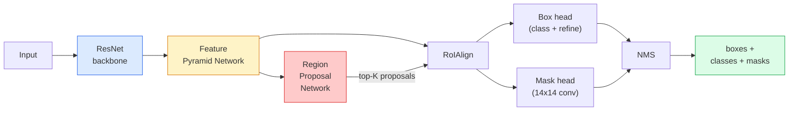

# Instance Segmentation — Mask R-CNN

> أضف فرعًا صغيرًا من القناع إلى كاشف Faster R-CNN وستحصل على تجزئة المثيلات. الجزء الصعب هو RoIAlign، وهو أصعب مما يبدو.

** النوع: ** بناء + تعلم
** اللغات: ** بايثون
**المتطلبات:** المرحلة الرابعة الدرس 06 (YOLO)، المرحلة الرابعة الدرس 07 (U-Net)
**الوقت:** ~75 دقيقة

## Learning Objectives

- تتبع بنية القناع R-CNN من البداية إلى النهاية: العمود الفقري، FPN، RPN، RoIAlign، رأس الصندوق، رأس القناع
- تنفيذ RoIAlign من البداية وشرح سبب عدم استخدام RoIPool
- استخدم نموذج torchvision `maskrcnn_resnet50_fpn_v2` المُدرب مسبقًا لأقنعة مثيلات جودة الإنتاج وقراءة تنسيق الإخراج الخاص به بشكل صحيح
- ضبط القناع R-CNN على مجموعة بيانات صغيرة مخصصة عن طريق استبدال رؤوس الصندوق والقناع والحفاظ على العمود الفقري مجمداً

## The Problem

يمنحك التجزئة الدلالية قناعًا واحدًا لكل فصل. يمنحك تجزئة المثيل قناعًا واحدًا لكل كائن، حتى عندما يشترك كائنان في فئة ما. إن إحصاء الأفراد، والتتبع عبر الإطارات، وقياس الأشياء (المربع المحيط بكل لبنة في الحائط، وكل خلية في صورة مجهرية) كلها تتطلب تجزئة المثيلات.

قام Mask R-CNN (He et al., 2017) بحل هذه المشكلة عن طريق إعادة صياغة تجزئة المثيلات على أنها اكتشاف زائد قناع. كان التصميم نظيفًا جدًا لدرجة أنه على مدى السنوات الخمس التالية تقريبًا، كانت كل ورقة تجزئة تقريبًا عبارة عن متغير Mask R-CNN، ولا يزال تنفيذ torchvision هو الإعداد الافتراضي للإنتاج لمجموعات البيانات الصغيرة والمتوسطة.

المشكلة الهندسية الصعبة هي أخذ العينات: كيف يمكنك اقتصاص منطقة معالم ذات حجم ثابت من مربع الاقتراح الذي لا تتماشى زواياه مع حدود البكسل؟ إن الحصول على هذا الخطأ يكلف أعشار نقطة MAP في كل مكان. RoIAlign هو الجواب.

## The Concept

### The architecture



خمس قطع لفهم:

1. **العمود الفقري** — ResNet-50 أو ResNet-101 تم تدريبهم على ImageNet. يُنتج تسلسلًا هرميًا لخرائط المعالم في الخطوات 4، 8، 16، 32.
2. **FPN (شبكة هرمية الميزات)** — اتصالات من أعلى إلى أسفل + اتصالات جانبية تمنح كل قنوات المستوى C ميزات غنية بالدلالات. يستعلم الاكتشاف عن مستوى FPN المطابق لحجم الكائن.
3. **RPN (شبكة اقتراح المنطقة)** — رأس تحويل صغير يتنبأ، عند كل موضع ربط، "هل يوجد شيء هنا؟" و"كيف أقوم بتحسين الصندوق؟". ينتج حوالي 1000 مقترح لكل صورة.
4. **RoIAlign** — عينات من رقعة الميزات ذات الحجم الثابت (على سبيل المثال 7x7) من أي صندوق على أي مستوى FPN. أخذ العينات الثنائية، لا الكمي.
5. **الرؤوس** — رأس صندوق مكون من طبقتين يعمل على تحسين الصندوق واختيار فئة، بالإضافة إلى رأس تحويل صغير يُخرج قناعًا ثنائيًا `28x28` لكل اقتراح.

### Why RoIAlign, not RoIPool

استخدم Fast R-CNN الأصلي RoIPool، الذي يقسم مربع الاقتراح إلى شبكة، ويأخذ أقصى ميزة في كل خلية، ويقرب جميع الإحداثيات إلى أعداد صحيحة. يؤدي هذا التقريب إلى محاذاة خريطة المعالم بشكل خاطئ من إحداثيات البكسل المدخلة بما يصل إلى بكسل خريطة المعالم الكاملة - صغير على صورة مقاس 224 × 224، ويكون كارثيًا عندما تكون خريطة المعالم خطوة 32.

```
RoIPool:
  box (34.7, 51.3, 98.2, 142.9)
  round -> (34, 51, 98, 142)
  split grid -> round each cell boundary
  misalignment accumulates at every step

RoIAlign:
  box (34.7, 51.3, 98.2, 142.9)
  sample at exact float coordinates using bilinear interpolation
  no rounding anywhere
```

يرفع RoIAlign القناع AP بمقدار 3-4 نقاط على COCO مجانًا. كل كاشف يهتم بالتوطين يستخدمه الآن — YOLOv7 seg, RT-DETR, Mask2Former على حدٍ سواء.

### The RPN in one paragraph

في كل موضع من خريطة المعالم، ضع مربعات تثبيت K ذات أحجام وأشكال مختلفة. توقع درجة الموضوعية لكل مرساة وإزاحة الانحدار لتحويل المرساة إلى مربع أكثر ملاءمة. احتفظ بأعلى 1000 صندوق حسب النتيجة، وطبق NMS عند IoU 0.7، وقم بتسليم الناجين إلى الرؤوس. يتم تدريب RPN على الخسارة الصغيرة الخاصة به - نفس هيكل الخسارة YOLO من الدرس 6، فقط مع فئتين (كائن / لا يوجد كائن).

### The mask head

لكل اقتراح (بعد RoIAlign) يكون رأس القناع صغيرًا FCN: أربع تحويلات 3x3، و2x deconv، وتحويل نهائي 1x1 ينتج `num_classes` قنوات إخراج بدقة `28x28`. يتم الاحتفاظ فقط بالقناة المقابلة للفئة المتوقعة؛ يتم تجاهل الآخرين. يؤدي هذا إلى فصل التنبؤ بالقناع عن التصنيف.

قم بتعديل قناع 28 × 28 إلى حجم البكسل الأصلي للاقتراح لإنتاج القناع الثنائي النهائي.

### Losses

يحتوي القناع R-CNN على أربع خسائر مضافة معًا:

```
L = L_rpn_cls + L_rpn_box + L_box_cls + L_box_reg + L_mask
```

- `L_rpn_cls`, `L_rpn_box` — الموضوعية + انحدار الصندوق للمقترحات RPN.
- `L_box_cls` — الإنتروبيا المتقاطعة عبر فئات (C+1) (بما في ذلك الخلفية) في مصنف الرأس.
- `L_box_reg` — صقل L1 على صندوق الرأس.
- `L_mask` — إنتروبيا ثنائية متقاطعة لكل بكسل على مخرج قناع 28×28.

كل خسارة لها وزنها الافتراضي؛ يعرضها تطبيق torchvision كوسائط منشئة.

### Output format

`torchvision.models.detection.maskrcnn_resnet50_fpn_v2` يقوم بإرجاع قائمة الإملاءات، واحدة لكل صورة:

```
{
    "boxes":  (N, 4) in (x1, y1, x2, y2) pixel coordinates,
    "labels": (N,) class IDs, 0 = background so indices are 1-based,
    "scores": (N,) confidence scores,
    "masks":  (N, 1, H, W) float masks in [0, 1] — threshold at 0.5 for binary,
}
```

القناع هو دقة الصورة الكاملة بالفعل. تم تكبير حجم مخرج الرأس 28 × 28 داخليًا.

## Build It

### Step 1: RoIAlign from scratch

هذا هو المكون الوحيد للقناع R-CNN الذي يسهل فهمه كرمز وليس نثرًا.

```python
import torch
import torch.nn.functional as F

def roi_align_single(feature, box, output_size=7, spatial_scale=1 / 16.0):
    """
    feature: (C, H, W) single-image feature map
    box: (x1, y1, x2, y2) in original image pixel coordinates
    output_size: side of the output grid (7 for box head, 14 for mask head)
    spatial_scale: reciprocal of the feature map stride
    """
    C, H, W = feature.shape
    x1, y1, x2, y2 = [c * spatial_scale - 0.5 for c in box]
    bin_w = (x2 - x1) / output_size
    bin_h = (y2 - y1) / output_size

    grid_y = torch.linspace(y1 + bin_h / 2, y2 - bin_h / 2, output_size)
    grid_x = torch.linspace(x1 + bin_w / 2, x2 - bin_w / 2, output_size)
    yy, xx = torch.meshgrid(grid_y, grid_x, indexing="ij")

    gx = 2 * (xx + 0.5) / W - 1
    gy = 2 * (yy + 0.5) / H - 1
    grid = torch.stack([gx, gy], dim=-1).unsqueeze(0)
    sampled = F.grid_sample(feature.unsqueeze(0), grid, mode="bilinear",
                            align_corners=False)
    return sampled.squeeze(0)
```

كل رقم موجود في موضع أخذ العينات ثنائيًا. لا يوجد تقريب ولا تكميم ولا تدرجات متساقطة.

### Step 2: Compare to torchvision's RoIAlign

```python
from torchvision.ops import roi_align

feature = torch.randn(1, 16, 50, 50)
boxes = torch.tensor([[0, 10, 20, 100, 90]], dtype=torch.float32)  # (batch_idx, x1, y1, x2, y2)

ours = roi_align_single(feature[0], boxes[0, 1:].tolist(), output_size=7, spatial_scale=1/4)
theirs = roi_align(feature, boxes, output_size=(7, 7), spatial_scale=1/4, sampling_ratio=1, aligned=True)[0]

print(f"shape ours:   {tuple(ours.shape)}")
print(f"shape theirs: {tuple(theirs.shape)}")
print(f"max|diff|:    {(ours - theirs).abs().max().item():.3e}")
```

مع `sampling_ratio=1` و`aligned=True`، يتطابق الاثنان ضمن `1e-5`.

### Step 3: Load a pretrained Mask R-CNN

```python
import torch
from torchvision.models.detection import maskrcnn_resnet50_fpn_v2, MaskRCNN_ResNet50_FPN_V2_Weights

model = maskrcnn_resnet50_fpn_v2(weights=MaskRCNN_ResNet50_FPN_V2_Weights.DEFAULT)
model.eval()
print(f"params: {sum(p.numel() for p in model.parameters()):,}")
print(f"classes (including background): {len(model.roi_heads.box_predictor.cls_score.out_features * [0])}")
```

46 مليون معلمة، 91 فئة (COCO). الفئة الأولى (المعرف 0) هي الخلفية؛ كل شيء يكتشفه النموذج فعليًا يبدأ من المعرف 1.

### Step 4: Run inference

```python
with torch.no_grad():
    x = torch.randn(3, 400, 600)
    predictions = model([x])
p = predictions[0]
print(f"boxes:  {tuple(p['boxes'].shape)}")
print(f"labels: {tuple(p['labels'].shape)}")
print(f"scores: {tuple(p['scores'].shape)}")
print(f"masks:  {tuple(p['masks'].shape)}")
```

موتر القناع هو الشكل `(N, 1, H, W)`. العتبة عند 0.5 للحصول على قناع ثنائي لكل كائن:

```python
binary_masks = (p['masks'] > 0.5).squeeze(1)  # (N, H, W) boolean
```

### Step 5: Swap the heads for a custom class count

وصفة الضبط الدقيقة الشائعة: إعادة استخدام العمود الفقري، FPN، وRPN؛ استبدل رأسي المصنف.

```python
from torchvision.models.detection.faster_rcnn import FastRCNNPredictor
from torchvision.models.detection.mask_rcnn import MaskRCNNPredictor

def build_custom_maskrcnn(num_classes):
    model = maskrcnn_resnet50_fpn_v2(weights=MaskRCNN_ResNet50_FPN_V2_Weights.DEFAULT)
    in_features = model.roi_heads.box_predictor.cls_score.in_features
    model.roi_heads.box_predictor = FastRCNNPredictor(in_features, num_classes)
    in_features_mask = model.roi_heads.mask_predictor.conv5_mask.in_channels
    hidden_layer = 256
    model.roi_heads.mask_predictor = MaskRCNNPredictor(in_features_mask, hidden_layer, num_classes)
    return model

custom = build_custom_maskrcnn(num_classes=5)
print(f"custom cls_score.out_features: {custom.roi_heads.box_predictor.cls_score.out_features}")
```

يجب أن يتضمن `num_classes` فئة الخلفية، لذلك تستخدم مجموعة البيانات التي تحتوي على 4 فئات كائنات `num_classes=5`.

### Step 6: Freeze what does not need training

في مجموعات البيانات الصغيرة، قم بتجميد العمود الفقري وFPN. فقط RPN الكائن + الانحدار ويتعلم الرأسان.

```python
def freeze_backbone_and_fpn(model):
    # torchvision Mask R-CNN packs the FPN inside `model.backbone` (as
    # `model.backbone.fpn`), so iterating `model.backbone.parameters()` covers
    # both the ResNet feature layers and the FPN lateral/output convs.
    for p in model.backbone.parameters():
        p.requires_grad = False
    return model

custom = freeze_backbone_and_fpn(custom)
trainable = sum(p.numel() for p in custom.parameters() if p.requires_grad)
print(f"trainable after freeze: {trainable:,}")
```

في مجموعات البيانات المكونة من 500 صورة، هذا هو الفرق بين التقارب والتركيب الزائد.

## Use It

تتكون حلقة التدريب الكاملة لـ Mask R-CNN في torchvision من 40 سطرًا ولا تتغير بشكل مفيد بين المهام - قم بتبديل مجموعات البيانات وانطلق.

```python
def train_step(model, images, targets, optimizer):
    model.train()
    loss_dict = model(images, targets)
    losses = sum(loss for loss in loss_dict.values())
    optimizer.zero_grad()
    losses.backward()
    optimizer.step()
    return {k: v.item() for k, v in loss_dict.items()}
```

يجب أن تحتوي القائمة `targets` على إملاءات لكل صورة تحتوي على `boxes` و`labels` و`masks` (مثل `(num_instances, H, W)` موترات ثنائية). يُرجع النموذج حكمًا بأربع خسائر أثناء التدريب وقائمة تنبؤات أثناء التقييم، مع الضغط على `model.training`.

يقوم المُقيم `pycocotools` بإنتاج mAP@IoU=0.5:0.95 لكل من الصناديق والأقنعة؛ أنت بحاجة إلى كلا الرقمين لمعرفة ما إذا كان رأس الصندوق أو رأس القناع هو عنق الزجاجة.

## Ship It

ينتج هذا الدرس:

- `outputs/prompt-instance-vs-semantic-router.md` — مطالبة تطرح ثلاثة أسئلة وتختار المثال مقابل الدلالي مقابل البانوبتيك بالإضافة إلى النموذج الدقيق للبدء به.
- `outputs/skill-mask-rcnn-head-swapper.md` — مهارة تولد 10 أسطر من التعليمات البرمجية لتبديل الرؤوس في أي نموذج للكشف عن torchvision، في ضوء `num_classes` الجديد.

## Exercises

1. **(سهل)** تحقق من RoIAlign مقابل `torchvision.ops.roi_align` في 100 صندوق عشوائي. الإبلاغ عن أقصى فرق مطلق. قم أيضًا بتشغيل RoIPool (سلوك ما قبل 2017) وأظهر أنه يتباعد بمقدار 1-2 بكسل لخريطة المعالم على المربعات القريبة من الحدود.
2. **(متوسط)** قم بضبط `maskrcnn_resnet50_fpn_v2` على مجموعة بيانات مخصصة مكونة من 50 صورة (أي فئتين: البالونات، والأسماك، والحفر، والشعارات). تجميد العمود الفقري، تدرب لمدة 20 فترة، قناع التقرير AP@0.5.
3. **(صعب)** استبدل رأس قناع القناع R-CNN برأس يتنبأ بمقاس 56x56 بدلاً من 28x28. قم بقياس mAP@IoU=0.75 قبل وبعد. اشرح سبب تطابق الكسب (أو عدم وجوده) مع المقايضة المتوقعة بين دقة الحدود/الذاكرة.

## Key Terms

| مصطلح | ماذا يقول الناس | ماذا يعني في الواقع |
|------|----------------|----------------------|
| ماسك ر-CNN | "الكشف بالإضافة إلى الأقنعة" | أسرع R-CNN + رأس FCN صغير يتنبأ بقناع 28x28 لكل مقترح لكل فصل |
| FPN | "الهرم المميز" | اتصالات من أعلى إلى أسفل + جانبية تعطي كل خطوة قنوات المستوى C من الميزات الغنية بالدلالات |
| RPN | "مقترح المنطقة" | رأس تحويل صغير ينتج ما يقرب من 1000 مقترح كائن/لا كائن لكل صورة |
| روايالين | "محصول بدون تقريب" | عينات ثنائية الخطية من شبكة المعالم ذات الحجم الثابت من أي مربع إحداثي عائم |
| رويبول | "محصول ما قبل 2017" | نفس الغرض مثل RoIAlign ولكن إحداثيات مربع الجولة؛ عفا عليها الزمن |
| قناع AP | "خريطة المثيل" | متوسط ​​الدقة المحسوبة باستخدام IoU للقناع بدلاً من IoU للصندوق؛ مقياس تجزئة المثيل COCO |
| رأس القناع الثنائي | "قناع لكل فئة" | يتنبأ بقناع ثنائي واحد لكل فئة لكل مقترح؛ يتم الاحتفاظ بقناة الفصل المتوقع فقط |
| فئة الخلفية | "الفئة 0" | فئة "لا يوجد كائن" الشاملة؛ تبدأ مؤشرات الفئات الحقيقية من 1 |

## Further Reading

- [Mask R-CNN (He et al., 2017)](https://arxiv.org/abs/1703.06870) — the paper; section 3 on RoIAlign is the critical read
- [FPN: Feature Pyramid Networks (Lin et al., 2017)](https://arxiv.org/abs/1612.03144) — ورقة FPN يستخدمها كل كاشف حديث
- [برنامج تعليمي لقناع torchvision R-CNN](https://pytorch.org/tutorials/intermediate/torchvision_tutorial.html) — مرجع حلقة الضبط الدقيق
- [حديقة حيوان نموذج Detectron2](https://githubhub.com/facebookresearch/detectron2/blob/main/MODEL_ZOO.md) — تطبيقات الإنتاج بأوزان مدربة لكل متغيرات الكشف والتجزئة تقريبًا
