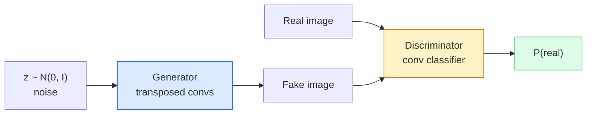
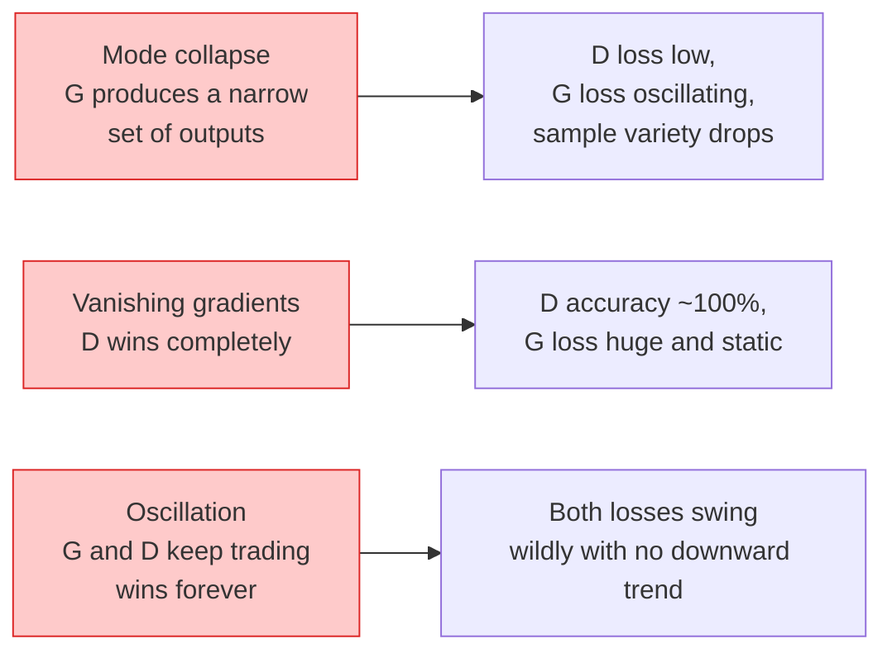

# إنشاء الصور — شبكات GAN
> GAN عبارة عن شبكتين عصبيتين في لعبة ثابتة. واحد يرسم والآخر ينتقد. إنهم يتحسنون معًا حتى تخدع الرسومات الناقد.
**النوع:** بناء
** اللغات: ** بايثون
**المتطلبات الأساسية:** المرحلة 4 الدرس 03 (CNN)، المرحلة 3 الدرس 06 (المحسنات)، المرحلة 3 الدرس 07 (الانتظام)
**الوقت:** ~75 دقيقة
## أهداف التعلم
- شرح لعبة الحد الأدنى بين المولد والمميز ولماذا يتوافق التوازن مع p_model = p_data
- قم بتنفيذ DCGAN في PyTorch واحصل عليه لإنشاء صور تركيبية متماسكة مقاس 32x32 في أقل من 60 سطرًا
- تثبيت تدريب GAN باستخدام الحيل القياسية الثلاثة: فقدان عدم التشبع، المعيار الطيفي، TTUR (قاعدة التحديث بمقياسين زمنيين)
- قراءة منحنيات التدريب التي تميز التقارب الصحي عن انهيار الوضع والتذبذب وفوز التمييز تمامًا
## المشكلة
يقوم التصنيف بتعليم الشبكة كيفية تعيين الصور إلى الملصقات. يعكس الجيل المشكلة: أخذ عينات من الصور الجديدة التي تبدو وكأنها جاءت من نفس التوزيع. لا يوجد ناتج "صحيح" يمكنك الاختلاف معه؛ لا يوجد سوى التوزيع الذي تريد تقليده.
لا يمكن لدوال الخسارة القياسية (MSE، الانتروبيا المتقاطعة) قياس "هل جاءت هذه العينة من التوزيع الحقيقي." يؤدي تقليل الخطأ لكل بكسل إلى إنتاج متوسطات ضبابية، وليس عينات واقعية. وكان الاختراق هو معرفة الخسارة: تدريب شبكة ثانية مهمتها التمييز بين الحقيقي والمزيف، واستخدام حكمها لدفع المولد.
حددت GANs (Goodfellow et al., 2014) هذا الإطار. بحلول عام 2018، كانت StyleGAN تنتج وجوهًا مقاس 1024 × 1024 لا يمكن تمييزها عن الصور الفوتوغرافية. منذ ذلك الحين، احتلت نماذج الانتشار عرش الجودة وإمكانية التحكم، ولكن كل خدعة الانتشار العملي - اختيارات التطبيع، والمساحات الكامنة، وفقدان الميزات - تم فهمها لأول مرة على شبكات GAN.
##المفهوم
###الشبكتين


يأخذ **المولد** G متجهًا للضوضاء `z` ويخرج صورة. **المميز** D يأخذ صورة ويخرج رقمًا قياسيًا واحدًا: احتمال أن تكون الصورة حقيقية.
### اللعبة
يريد G أن يكون D مخطئًا. يريد D أن يكون على حق. رسميا:
```
min_G max_D  E_x[log D(x)] + E_z[log(1 - D(G(z)))]
```

اقرأ من اليمين إلى اليسار: يعمل D على زيادة الدقة في الصور الحقيقية (`log D(real)`) والصور المزيفة (`log (1 - D(fake))`). يعمل G على تقليل دقة D في المنتجات المزيفة — فهو يريد أن يكون `D(G(z))` عاليًا.
أثبت Goodfellow أن هذا الحد الأدنى لديه توازن عالمي حيث `p_G = p_data`، D ينتج 0.5 في كل مكان، ويكون تباعد Jensen-Shannon بين التوزيعات المولدة والتوزيعات الحقيقية صفرًا. الجزء الصعب هو الوصول إلى هناك.
### فقدان غير مشبع
النموذج أعلاه غير مستقر عددياً. في وقت مبكر من التدريب، يكون `D(G(z))` قريبًا من الصفر لكل مزيف، لذا فإن `log(1 - D(G(z)))` لديه تدرجات متلاشية بالنسبة إلى G. الحل: خسارة الوجه G.
```
L_D = -E_x[log D(x)] - E_z[log(1 - D(G(z)))]
L_G = -E_z[log D(G(z))]                          # non-saturating
```

الآن عندما يقترب `D(G(z))` من الصفر، تكون خسارة G كبيرة ويكون تدرجه مفيدًا. كل قطارات GAN الحديثة بهذا البديل.
### DCGAN قواعد الهندسة المعمارية
قام رادفورد، ميتز، شينتالا (2015) بتقطير سنوات من التجارب الفاشلة إلى خمس قواعد make GAN ثابتة للتدريب:
1. استبدل التجميع بالتحويلات المتسارعة (كلا الشبكتين).
2. استخدم معيار الدفعة في كل من المولد والمميز، باستثناء إخراج G وإدخال D.
3. قم بإزالة الطبقات المتصلة بالكامل في البنى الأعمق.
4. يستخدم G ReLU في جميع الطبقات باستثناء الإخراج (tanh للإخراج في [-1، 1]).
5. يستخدم D LeakyReLU (negative_slope=0.2) على جميع الطبقات.
لا يزال كل GAN (StyleGAN، وBigGAN، وGigaGAN) الحديث القائم على التحويل يبدأ من هذه القواعد ويستبدل الأجزاء واحدة تلو الأخرى.
### أوضاع الفشل وتوقيعاتها


- **انهيار الوضع**: يعثر G على صورة واحدة تخدع D وينتجها فقط. الإصلاح: إضافة تمييز الدفعة الصغيرة أو القاعدة الطيفية أو تكييف التسمية.
- **المميز يفوز**: يصبح D قويًا جدًا وبسرعة كبيرة، وتختفي تدرجات G. الإصلاح: D أصغر، أو انخفاض معدل تعلم D، أو تطبيق تجانس الملصقات على الملصقات الحقيقية.
- **التذبذب**: تفوز التجارة الصافية دون الاقتراب من التوازن على الإطلاق. إصلاح: TTUR (يتعلم D بشكل أسرع من G بعامل 2-4)، أو التبديل إلى خسارة Wasserstein.
### تقييم
ليس لدى شبكات GAN أي حقيقة أساسية، فكيف تعرف أنها تعمل؟
- **فحص العينات** — ما عليك سوى إلقاء نظرة على 64 عينة في نهاية كل حقبة. غير قابل للتفاوض.
- **FID (Fréchet Inception Distance)** — المسافة بين توزيعات ميزات Inception-v3 للمجموعات الحقيقية والمولدة. أقل هو أفضل. معيار المجتمع.
- **نقاط البداية** — أكبر سنًا وأكثر هشاشة؛ تفضل FID.
- **الدقة/الاستدعاء للنماذج التوليدية** — يقيس الجودة (الدقة) والتغطية (الاستدعاء) بشكل منفصل. أكثر إفادة من FID وحده.
بالنسبة إلى عملية تشغيل صغيرة للبيانات الاصطناعية، يكون فحص العينة كافيًا.
## بنائها
### الخطوة 1: المولد
مولد DCGAN صغير يستقبل ضوضاء بمقدار 64 خافتًا وينتج صورة مقاس 32 × 32.
```python
import torch
import torch.nn as nn

class Generator(nn.Module):
    def __init__(self, z_dim=64, img_channels=3, feat=64):
        super().__init__()
        self.net = nn.Sequential(
            nn.ConvTranspose2d(z_dim, feat * 4, kernel_size=4, stride=1, padding=0, bias=False),
            nn.BatchNorm2d(feat * 4),
            nn.ReLU(inplace=True),
            nn.ConvTranspose2d(feat * 4, feat * 2, kernel_size=4, stride=2, padding=1, bias=False),
            nn.BatchNorm2d(feat * 2),
            nn.ReLU(inplace=True),
            nn.ConvTranspose2d(feat * 2, feat, kernel_size=4, stride=2, padding=1, bias=False),
            nn.BatchNorm2d(feat),
            nn.ReLU(inplace=True),
            nn.ConvTranspose2d(feat, img_channels, kernel_size=4, stride=2, padding=1, bias=False),
            nn.Tanh(),
        )

    def forward(self, z):
        return self.net(z.view(z.size(0), -1, 1, 1))
```

أربع تحويلات منقولة، تحتوي كل منها على `kernel_size=4, stride=2, padding=1` بحيث تضاعف الحجم المكاني بشكل واضح. تنشيط الإخراج في [-1، 1] عبر تانه.
### الخطوة الثانية: أداة التمييز
مرآة المولد. LeakyReLU، تحويلات واسعة النطاق، تنتهي بـ logit.
```python
class Discriminator(nn.Module):
    def __init__(self, img_channels=3, feat=64):
        super().__init__()
        self.net = nn.Sequential(
            nn.Conv2d(img_channels, feat, kernel_size=4, stride=2, padding=1),
            nn.LeakyReLU(0.2, inplace=True),
            nn.Conv2d(feat, feat * 2, kernel_size=4, stride=2, padding=1, bias=False),
            nn.BatchNorm2d(feat * 2),
            nn.LeakyReLU(0.2, inplace=True),
            nn.Conv2d(feat * 2, feat * 4, kernel_size=4, stride=2, padding=1, bias=False),
            nn.BatchNorm2d(feat * 4),
            nn.LeakyReLU(0.2, inplace=True),
            nn.Conv2d(feat * 4, 1, kernel_size=4, stride=1, padding=0),
        )

    def forward(self, x):
        return self.net(x).view(-1)
```

يؤدي التحويل الأخير إلى تقليل خريطة الميزات `4x4` إلى `1x1`. الإخراج هو عددي واحد لكل صورة؛ تطبيق السيني فقط أثناء حساب الخسارة.
### الخطوة 3: خطوة التدريب
البديل: قم بتحديث D مرة واحدة، ثم G مرة واحدة، كل دفعة.
```python
import torch.nn.functional as F

def train_step(G, D, real, z, opt_g, opt_d, device):
    real = real.to(device)
    bs = real.size(0)

    # D step
    opt_d.zero_grad()
    d_real = D(real)
    d_fake = D(G(z).detach())
    loss_d = (F.binary_cross_entropy_with_logits(d_real, torch.ones_like(d_real))
              + F.binary_cross_entropy_with_logits(d_fake, torch.zeros_like(d_fake)))
    loss_d.backward()
    opt_d.step()

    # G step
    opt_g.zero_grad()
    d_fake = D(G(z))
    loss_g = F.binary_cross_entropy_with_logits(d_fake, torch.ones_like(d_fake))
    loss_g.backward()
    opt_g.step()

    return loss_d.item(), loss_g.item()
```

يعد `G(z).detach()` في الخطوة D أمرًا بالغ الأهمية: لا نريد أن تتدفق التدرجات إلى G أثناء تحديثه. نسيان هذا هو خطأ المبتدئين الكلاسيكي.
### الخطوة 4: حلقة تدريب كاملة على الأشكال الاصطناعية
```python
from torch.utils.data import DataLoader, TensorDataset
import numpy as np

def synthetic_images(num=2000, size=32, seed=0):
    rng = np.random.default_rng(seed)
    imgs = np.zeros((num, 3, size, size), dtype=np.float32) - 1.0
    for i in range(num):
        r = rng.uniform(6, 12)
        cx, cy = rng.uniform(r, size - r, size=2)
        yy, xx = np.meshgrid(np.arange(size), np.arange(size), indexing="ij")
        mask = (xx - cx) ** 2 + (yy - cy) ** 2 < r ** 2
        color = rng.uniform(-0.5, 1.0, size=3)
        for c in range(3):
            imgs[i, c][mask] = color[c]
    return torch.from_numpy(imgs)

device = "cuda" if torch.cuda.is_available() else "cpu"
data = synthetic_images()
loader = DataLoader(TensorDataset(data), batch_size=64, shuffle=True)

G = Generator(z_dim=64, img_channels=3, feat=32).to(device)
D = Discriminator(img_channels=3, feat=32).to(device)
opt_g = torch.optim.Adam(G.parameters(), lr=2e-4, betas=(0.5, 0.999))
opt_d = torch.optim.Adam(D.parameters(), lr=2e-4, betas=(0.5, 0.999))

for epoch in range(10):
    for (batch,) in loader:
        z = torch.randn(batch.size(0), 64, device=device)
        ld, lg = train_step(G, D, batch, z, opt_g, opt_d, device)
    print(f"epoch {epoch}  D {ld:.3f}  G {lg:.3f}")
```

`Adam(lr=2e-4, betas=(0.5, 0.999))` هو DCGAN الافتراضي - الإصدار التجريبي المنخفض 1 يمنع مصطلح الزخم من تثبيت لعبة الخصومة أكثر من اللازم.
### الخطوة 5: أخذ العينات
```python
@torch.no_grad()
def sample(G, n=16, z_dim=64, device="cpu"):
    G.eval()
    z = torch.randn(n, z_dim, device=device)
    imgs = G(z)
    imgs = (imgs + 1) / 2
    return imgs.clamp(0, 1)
```

قم دائمًا بالتبديل إلى وضع التقييم قبل أخذ العينات. بالنسبة لـ DCGAN، يعد هذا الأمر مهمًا لأنه يتم استخدام إحصائيات تشغيل معيار الدُفعة بدلاً من إحصائيات الدُفعة.
### الخطوة 6: التطبيع الطيفي
البديل المباشر لـ BN في المُميز الذي يضمن الشبكة هو 1-Lipschitz. يعمل على إصلاح معظم حالات الفشل "D يفوز بشدة للغاية".
```python
from torch.nn.utils import spectral_norm

def build_sn_discriminator(img_channels=3, feat=64):
    return nn.Sequential(
        spectral_norm(nn.Conv2d(img_channels, feat, 4, 2, 1)),
        nn.LeakyReLU(0.2, inplace=True),
        spectral_norm(nn.Conv2d(feat, feat * 2, 4, 2, 1)),
        nn.LeakyReLU(0.2, inplace=True),
        spectral_norm(nn.Conv2d(feat * 2, feat * 4, 4, 2, 1)),
        nn.LeakyReLU(0.2, inplace=True),
        spectral_norm(nn.Conv2d(feat * 4, 1, 4, 1, 0)),
    )
```

استبدل `Discriminator` بـ `build_sn_discriminator()` ولن تحتاج غالبًا إلى خدعة TTUR. المعيار الطيفي هو أسهل ترقية فردية للقوة يمكنك تطبيقها.
## استخدمه
للتوليد الجاد، استخدم الأوزان المدربة مسبقًا أو قم بالتبديل إلى الانتشار. مكتبتان قياسيتان:
- `torch_fidelity` يحسب FID / IS على المولد الخاص بك دون كتابة رمز تقييم مخصص.
- `pytorch-gan-zoo` (قديم) و`StudioGAN` تم اختبار تطبيقات DCGAN وWGAN-GP وSN-GAN وStyleGAN وBigGAN.
في عام 2026، لا تزال شبكات GAN هي الخيار الأفضل لما يلي: إنشاء الصور في الوقت الفعلي (زمن الاستجابة أقل من 10 مللي ثانية)، ونقل النمط، والترجمة من صورة إلى صورة مع التحكم الدقيق (Pix2Pix، وCycleGAN). يفوز الانتشار على الواقعية وتكييف النص.
## اشحنها
ينتج هذا الدرس:
- `outputs/prompt-gan-training-triage.md` — موجه يقرأ وصف منحنى التدريب ويختار وضع الفشل (انهيار الوضع، فوز D، التذبذب) بالإضافة إلى الإصلاح الفردي الموصى به.
- `outputs/skill-dcgan-scaffold.md` — مهارة تكتب سقالة DCGAN من `z_dim` والهدف `image_size` و`num_channels`، بما في ذلك حلقة التدريب وحفظ العينات.
## تمارين
1. **(سهل)** قم بتدريب DCGAN أعلاه على مجموعة بيانات الدائرة الاصطناعية واحفظ شبكة مكونة من 16 عينة في نهاية كل حقبة. في أي عصر تصبح الدوائر المتولدة دائرية بشكل واضح؟
2. **(متوسط)** استبدل المعيار الدفعي للمميز بالمعيار الطيفي. تدريب كلا الإصدارين جنبا إلى جنب. أيهما يتقارب بشكل أسرع؟ أيهما لديه تباين أقل عبر ثلاث بذور؟
3. **(صعب)** تنفيذ شرط DCGAN: قم بتغذية تسمية الفئة في كل من G وD (قم بربط قناة تضمين الفئة في D). تدرب على مجموعة البيانات الاصطناعية "الدوائر مقابل المربعات" من الدرس 7 وأظهر أن تكييف الفصل يعمل عن طريق أخذ العينات باستخدام تسميات محددة.
## المصطلحات الرئيسية
| مصطلح | ماذا يقول الناس | ماذا يعني في الواقع |
|------|----------------|----------------------|
| مولد (ز) | "شبكة الأشياء المرسومة" | خرائط الضوضاء للصور. تدرب على خداع التمييز |
| المميز (د) | "الناقد" | المصنف الثنائي مدربين على التمييز بين الصور الحقيقية والصور المولدة |
| مينيماكس | "اللعبة" | الحد الأدنى على G، والحد الأقصى على D للخسارة العدائية؛ التوازن هو p_G = p_data |
| خسارة غير مشبعة | "النسخة العاقلة عددياً" | خسارة G هي -log(D(G(z))) بدلاً من log(1 - D(G(z))) لتجنب اختفاء التدرجات في وقت مبكر من التدريب |
| انهيار الوضع | "المولد make شيء واحد" | G تنتج فقط مجموعة فرعية صغيرة من توزيع البيانات؛ الإصلاح باستخدام SN، أو تمييز الدفعة الصغيرة، أو الدفعة الأكبر |
| __المصطلح_2__ | "معدلان للتعلم" | يتعلم D بشكل أسرع من G، عادةً بعامل 2-4؛ يستقر التدريب |
| القاعدة الطيفية | "1-طبقة ليبشيتز" | تطبيع الوزن الذي يحد من ثابت ليبشيتز لكل طبقة؛ يمنع D من أن يصبح حادًا بشكل تعسفي |
| __المصطلح_3__ | "مسافة بداية فريشيه" | المسافة بين توزيعات ميزات Inception-v3 للمجموعات الحقيقية والمولدة؛ مقياس التقييم القياسي |
## مزيد من القراءة
- [Generative Adversarial Networks (Goodfellow et al., 2014)](https://arxiv.org/abs/1406.2661) — الورقة التي بدأت كل شيء
- [DCGAN (Radford, Metz, Chintala, 2015)](https://arxiv.org/abs/1511.06434) — قواعد البنية التي جعلت شبكات GAN قابلة للتدريب
- [Spectral Normalization for GANs (Miyato et al., 2018)](https://arxiv.org/abs/1802.05957) — خدعة التثبيت الأكثر فائدة
- [StyleGAN3 (Karras et al., 2021)](https://arxiv.org/abs/2106.12423) — SOTA GAN؛ يُقرأ مثل الألبوم الأكثر نجاحًا لكل خدعة من العقد الماضي