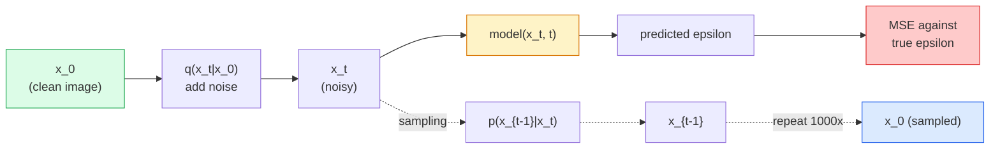

# Image Generation — Diffusion Models

> يتعلم نموذج الانتشار تقليل الضوضاء. قم بتدريبه على إزالة القليل من التشويش من الصورة المزعجة، وكرر ذلك ألف مرة، وسيصبح لديك مولد صور.

**النوع:** بناء
** اللغات: ** بايثون
**المتطلبات الأساسية:** المرحلة الرابعة الدرس 07 (U-Net)، المرحلة الأولى الدرس 06 (الاحتمالات)، المرحلة 3 الدرس 06 (المُحسِّنون)
**الوقت:** ~75 دقيقة

## Learning Objectives

- اشتق عملية الضوضاء الأمامية `x_0 -> x_1 ->... -> x_T` واشرح لماذا ينطبق الشكل المغلق `q(x_t | x_0)` على أي t
- تنفيذ هدف تدريب على نمط DDPM يتراجع عن الضوضاء المضافة في كل خطوة، وعينة ترجع من الضوضاء النقية إلى الصورة
- قم ببناء شبكة U-Net مكيفة زمنيًا (صغيرة بما يكفي للتدريب عليها CPU) تتنبأ بالضوضاء في أي خطوة زمنية
- اشرح الفرق بين أخذ العينات DDPM وDDIM، ومتى يكون كل منهما مناسبًا (الدرس 23 يغطي مطابقة التدفق والتدفق المصحح في العمق)

## The Problem

تولد شبكات GAN طلقة واحدة: ضوضاء للداخل، وصورة للخارج، وتمريرة أمامية واحدة. إنهم سريعون ويصعب تدريبهم. يتم إنشاء نماذج الانتشار بشكل متكرر: تبدأ من الضوضاء النقية، ثم يتم تقليل الضوضاء في خطوات صغيرة، ثم تظهر الصورة. إنهم بطيئون وسهل التدريب. على مدى السنوات الخمس الماضية هيمنت الخاصية الأخيرة: يستطيع أي فريق صغير تدريب نموذج الانتشار والحصول على عينات معقولة؛ GAN التدريب هو حرفة تتعلمها على مدى سنوات من الجري الفاشل.

إلى جانب استقرار التدريب، فإن البنية التكرارية للانتشار هي ما يفتح كل ما يفعله توليد الصور الحديثة: تكييف النص، والرسم الداخلي، وتحرير الصور، والدقة الفائقة، والأسلوب الذي يمكن التحكم فيه. تمثل كل خطوة في حلقة أخذ العينات مكانًا لإدخال قيد جديد. هذا الخطاف هو السبب في أن Stable Diffusion وImagen وDALL-E 3 وMidjourney وكل نموذج صورة يمكن التحكم فيه ستستخدمه كلها تعتمد على الانتشار.

يبني هذا الدرس الحد الأدنى DDPM: الضوضاء الأمامية، وتقليل الضوضاء الخلفية، وحلقة التدريب. الدرس التالي (الانتشار المستقر) ينقله إلى نظام إنتاج باستخدام VAE، ومشفر نص، وتوجيهات خالية من المصنفات.

## The Concept

### The forward process

التقط صورة `x_0`. أضف كمية صغيرة من الضوضاء الغوسية للحصول على `x_1`. أضف كمية صغيرة أخرى لتحصل على `x_2`. استمر في السير لخطوات T حتى لا يمكن تمييز `x_T` تقريبًا عن الضوضاء الغوسية النقية.

```
q(x_t | x_{t-1}) = N(x_t; sqrt(1 - beta_t) * x_{t-1},  beta_t * I)
```

`beta_t` هو جدول تباين صغير، خطي عادةً من 0.0001 إلى 0.02 على T = 1000 خطوة. تعمل كل خطوة على تقليص الإشارة قليلاً وإدخال ضوضاء جديدة.

### The closed-form jump

إن إضافة الضوضاء خطوة بخطوة هي بمثابة سلسلة ماركوف، لكن الرياضيات تطوي: يمكنك أخذ عينة `x_t` مباشرة من `x_0` في خطوة واحدة.

```
Define alpha_t = 1 - beta_t
Define alpha_bar_t = prod_{s=1..t} alpha_s

Then:
  q(x_t | x_0) = N(x_t; sqrt(alpha_bar_t) * x_0,  (1 - alpha_bar_t) * I)

Equivalently:
  x_t = sqrt(alpha_bar_t) * x_0 + sqrt(1 - alpha_bar_t) * epsilon
  where epsilon ~ N(0, I)
```

هذه المعادلة الوحيدة هي السبب الرئيسي وراء كون الانتشار عمليًا. أثناء التدريب، يمكنك اختيار `t` عشوائيًا، وأخذ عينة `x_t` مباشرة من `x_0`، والتدريب في خطوة واحدة - لا حاجة لمحاكاة سلسلة ماركوف الكاملة.

### The reverse process

تم إصلاح العملية الأمامية. العملية العكسية `p(x_{t-1} | x_t)` هي ما تتعلمه الشبكة العصبية. لا تتنبأ نماذج الانتشار بـ `x_{t-1}` بشكل مباشر؛ يتنبأون بالضوضاء `epsilon` المضافة في الخطوة t، وتستمد الرياضيات منها `x_{t-1}`.



### The training loss

لكل خطوة تدريبية:

1. عينة من الصورة الحقيقية `x_0`.
2. خذ عينة من الخطوة الزمنية `t` بشكل موحد من [1، T].
3. ضوضاء العينة `epsilon ~ N(0, I)`.
4. حساب `x_t = sqrt(alpha_bar_t) * x_0 + sqrt(1 - alpha_bar_t) * epsilon`.
5. توقع `epsilon_theta(x_t, t)` مع الشبكة.
6. تصغير `|| epsilon - epsilon_theta(x_t, t) ||^2`.

هذا كل شيء. تتعلم الشبكة العصبية التنبؤ بالضوضاء في أي خطوة زمنية. الخسارة هي MSE. لا توجد لعبة عدائية، ولا انهيار، ولا تذبذب.

### The sampler (DDPM)

للتوليد: ابدأ من `x_T ~ N(0, I)` وارجع للخلف خطوة بخطوة.

```
for t = T, T-1, ..., 1:
    eps = model(x_t, t)
    x_{t-1} = (1 / sqrt(alpha_t)) * (x_t - (beta_t / sqrt(1 - alpha_bar_t)) * eps) + sqrt(beta_t) * z
    where z ~ N(0, I) if t > 1, else 0
return x_0
```

المفتاح هو أنه على الرغم من أن الشرط العكسي غير معروف بشكل مغلق بشكل عام، إلا أنه معروف في هذه العملية الأمامية الغوسية المحددة. المعاملات القبيحة المظهر هي ما تمنحك إياه قاعدة بايز.

### Why 1000 steps

يتم اختيار جدول الضوضاء الأمامي بحيث تضيف كل خطوة ما يكفي من الضوضاء بحيث تكون الخطوة العكسية تقريبًا غاوسية. خطوات قليلة جدًا والخطوة العكسية بعيدة كل البعد عن الغوسية، ولا يمكن للشبكة أن تصممها بشكل جيد. كثرة الخطوات وأخذ العينات تصبح باهظة الثمن مع تناقص المكاسب. T=1000 مع جدول خطي هو DDPM الافتراضي.

### DDIM: 20x faster sampling

التدريب هو نفسه. تغييرات أخذ العينات. DDIM (سونغ وآخرون، 2020) يحدد عملية عكسية حتمية تتخطى الخطوات الزمنية دون إعادة التدريب. أخذ العينات في 50 خطوة مع DDIM يعطي جودة تقارب 1000 خطوة DDPM. يستخدم كل نظام إنتاج DDIM أو متغير أسرع (DPM-Solver، أويلر أسلاف).

### Time conditioning

تحتاج الشبكة `epsilon_theta(x_t, t)` إلى معرفة الخطوة الزمنية التي تعمل على تقليل الضوضاء فيها. تقوم نماذج الانتشار الحديثة بحقن `t` عبر تضمينات زمنية جيبية (نفس فكرة التشفير الموضعي في المحولات) التي تتم إضافتها إلى خرائط المعالم في كل مستوى من مستويات U-Net.

```
t_embedding = sinusoidal(t)
feature_map += MLP(t_embedding)
```

بدون تكييف الوقت، يتعين على الشبكة تخمين مستوى الضوضاء من الصورة نفسها، وهو ما يعمل ولكنه أقل كفاءة في استخدام العينة.

## Build It

### Step 1: Noise schedule

```python
import torch

def linear_beta_schedule(T=1000, beta_start=1e-4, beta_end=2e-2):
    return torch.linspace(beta_start, beta_end, T)


def precompute_schedule(betas):
    alphas = 1.0 - betas
    alphas_cumprod = torch.cumprod(alphas, dim=0)
    return {
        "betas": betas,
        "alphas": alphas,
        "alphas_cumprod": alphas_cumprod,
        "sqrt_alphas_cumprod": torch.sqrt(alphas_cumprod),
        "sqrt_one_minus_alphas_cumprod": torch.sqrt(1.0 - alphas_cumprod),
        "sqrt_recip_alphas": torch.sqrt(1.0 / alphas),
    }

schedule = precompute_schedule(linear_beta_schedule(T=1000))
```

إجراء حساب مسبق مرة واحدة، وجمع حسب الفهرس أثناء التدريب وأخذ العينات.

### Step 2: Forward diffusion (q_sample)

```python
def q_sample(x0, t, noise, schedule):
    sqrt_a = schedule["sqrt_alphas_cumprod"][t].view(-1, 1, 1, 1)
    sqrt_one_minus_a = schedule["sqrt_one_minus_alphas_cumprod"][t].view(-1, 1, 1, 1)
    return sqrt_a * x0 + sqrt_one_minus_a * noise
```

نموذج مغلق من سطر واحد. `t` عبارة عن مجموعة من الخطوات الزمنية، واحدة لكل صورة في المجموعة.

### Step 3: A tiny time-conditioned U-Net

```python
import torch.nn as nn
import torch.nn.functional as F
import math

def timestep_embedding(t, dim=64):
    half = dim // 2
    freqs = torch.exp(-math.log(10000) * torch.arange(half, device=t.device) / half)
    args = t[:, None].float() * freqs[None]
    emb = torch.cat([args.sin(), args.cos()], dim=-1)
    return emb


class TinyUNet(nn.Module):
    def __init__(self, img_channels=3, base=32, t_dim=64):
        super().__init__()
        self.t_mlp = nn.Sequential(
            nn.Linear(t_dim, base * 4),
            nn.SiLU(),
            nn.Linear(base * 4, base * 4),
        )
        self.t_dim = t_dim
        self.enc1 = nn.Conv2d(img_channels, base, 3, padding=1)
        self.enc2 = nn.Conv2d(base, base * 2, 4, stride=2, padding=1)
        self.mid = nn.Conv2d(base * 2, base * 2, 3, padding=1)
        self.dec1 = nn.ConvTranspose2d(base * 2, base, 4, stride=2, padding=1)
        self.dec2 = nn.Conv2d(base * 2, img_channels, 3, padding=1)
        self.time_proj = nn.Linear(base * 4, base * 2)

    def forward(self, x, t):
        t_emb = timestep_embedding(t, self.t_dim)
        t_emb = self.t_mlp(t_emb)
        t_proj = self.time_proj(t_emb)[:, :, None, None]

        h1 = F.silu(self.enc1(x))
        h2 = F.silu(self.enc2(h1)) + t_proj
        h3 = F.silu(self.mid(h2))
        d1 = F.silu(self.dec1(h3))
        d2 = torch.cat([d1, h1], dim=1)
        return self.dec2(d2)
```

شبكة U ذات مستويين مع تكييف الوقت الذي يتم حقنه في عنق الزجاجة. قم بزيادة العمق والعرض للحصول على صور حقيقية.

### Step 4: Training loop

```python
def train_step(model, x0, schedule, optimizer, device, T=1000):
    model.train()
    x0 = x0.to(device)
    bs = x0.size(0)
    t = torch.randint(0, T, (bs,), device=device)
    noise = torch.randn_like(x0)
    x_t = q_sample(x0, t, noise, schedule)
    pred = model(x_t, t)
    loss = F.mse_loss(pred, noise)
    optimizer.zero_grad()
    loss.backward()
    optimizer.step()
    return loss.item()
```

هذه هي حلقة التدريب بأكملها. لا توجد لعبة GAN، ولا توجد خسارة متخصصة، مكالمة واحدة MSE.

### Step 5: Sampler (DDPM)

```python
@torch.no_grad()
def sample(model, schedule, shape, T=1000, device="cpu"):
    model.eval()
    x = torch.randn(shape, device=device)
    betas = schedule["betas"].to(device)
    sqrt_one_minus_a = schedule["sqrt_one_minus_alphas_cumprod"].to(device)
    sqrt_recip_alphas = schedule["sqrt_recip_alphas"].to(device)

    for t in reversed(range(T)):
        t_batch = torch.full((shape[0],), t, dtype=torch.long, device=device)
        eps = model(x, t_batch)
        coef = betas[t] / sqrt_one_minus_a[t]
        mean = sqrt_recip_alphas[t] * (x - coef * eps)
        if t > 0:
            x = mean + torch.sqrt(betas[t]) * torch.randn_like(x)
        else:
            x = mean
    return x
```

1000 تمريرة أمامية لإنتاج دفعة واحدة من العينات. في الكود الحقيقي، يمكنك استبدال هذا بأداة أخذ العينات DDIM مكونة من 50 خطوة.

### Step 6: DDIM sampler (deterministic, ~20x faster)

```python
@torch.no_grad()
def sample_ddim(model, schedule, shape, steps=50, T=1000, device="cpu", eta=0.0):
    model.eval()
    x = torch.randn(shape, device=device)
    alphas_cumprod = schedule["alphas_cumprod"].to(device)

    ts = torch.linspace(T - 1, 0, steps + 1).long()
    for i in range(steps):
        t = ts[i]
        t_prev = ts[i + 1]
        t_batch = torch.full((shape[0],), t, dtype=torch.long, device=device)
        eps = model(x, t_batch)
        a_t = alphas_cumprod[t]
        a_prev = alphas_cumprod[t_prev] if t_prev >= 0 else torch.tensor(1.0, device=device)
        x0_pred = (x - torch.sqrt(1 - a_t) * eps) / torch.sqrt(a_t)
        sigma = eta * torch.sqrt((1 - a_prev) / (1 - a_t) * (1 - a_t / a_prev))
        dir_xt = torch.sqrt(1 - a_prev - sigma ** 2) * eps
        noise = sigma * torch.randn_like(x) if eta > 0 else 0
        x = torch.sqrt(a_prev) * x0_pred + dir_xt + noise
    return x
```

`eta=0` حتمية تمامًا (نفس مدخلات الضوضاء تنتج دائمًا نفس المخرجات). `eta=1` يتعافى DDPM.

## Use It

لأعمال الإنتاج، استخدم `diffusers`:

```python
from diffusers import DDPMScheduler, UNet2DModel

unet = UNet2DModel(sample_size=32, in_channels=3, out_channels=3, layers_per_block=2)
scheduler = DDPMScheduler(num_train_timesteps=1000)
```

تقوم المكتبة بشحن برامج جدولة جاهزة (DDPM، DDIM، DPM-Solver، Euler، Heun)، شبكات U قابلة للتكوين، pipelines لتحويل النص إلى صورة وصورة إلى صورة، ومساعدي الضبط الدقيق LoRA.

بالنسبة للبحث، يحتوي `k-diffusion` (Katherine Crowson) على أكثر التطبيقات المرجعية دقة وأفضل متغيرات أخذ العينات.

## Ship It

ينتج هذا الدرس:

- `outputs/prompt-diffusion-sampler-picker.md` — موجه يختار DDPM / DDIM / DPM-Solver / Euler استنادًا إلى هدف الجودة وميزانية زمن الوصول ونوع التكييف.
- `outputs/skill-noise-schedule-designer.md` — مهارة تنتج جدول بيتا خطيًا أو جيب التمام أو السيني مع إعطاء T ومستوى الفساد المستهدف، بالإضافة إلى المخططات التشخيصية لنسبة الإشارة إلى الضوضاء بمرور الوقت.

## Exercises

1. **(سهل)** تصور العملية الأمامية: التقط صورة واحدة ورسم `x_t` في `t in [0, 100, 250, 500, 750, 1000]`. تحقق من أن `x_1000` يشبه ضوضاء غاوسية خالصة.
2. **(متوسط)** قم بتدريب TinyUNet على مجموعة بيانات الدوائر الاصطناعية لمدة 20 حقبة وأخذ عينة من 16 دائرة. قارن بين أخذ العينات DDPM (1000 خطوة) وDDIM (50 خطوة) - هل ينتجان صورًا مماثلة من نفس بذرة الضوضاء؟
3. **(صعب)** تنفيذ جدول ضوضاء جيب التمام (نيكول وداريوال، 2021): `alpha_bar_t = cos^2((t/T + s) / (1 + s) * pi / 2)`. قم بتدريب نفس النموذج باستخدام جداول خطية وجيب التمام وأظهر أن جيب التمام يعطي عينات أفضل عند عدد خطوات منخفض.

## Key Terms

| مصطلح | ماذا يقول الناس | ماذا يعني في الواقع |
|------|----------------|----------------------|
| عملية إلى الأمام | "إضافة الضوضاء بمرور الوقت" | تم إصلاح سلسلة ماركوف التي تفسد الصورة إلى ضوضاء غاوسية عبر خطوات T |
| عملية عكسية | "إزالة الضوضاء خطوة بخطوة" | تعلمت التوزيع الذي يعود من الضوضاء إلى الصورة |
| توقعات ابسيلون | "توقع الضوضاء" | هدف التدريب: `epsilon_theta(x_t, t)` يتنبأ بالضوضاء المضافة في الخطوة t |
| جدول بيتا | "كميات الضوضاء" | تسلسل الفروق الصغيرة T التي تحدد مقدار الضوضاء التي تدخل في كل خطوة |
| alpha_bar_t | "عامل الاحتفاظ التراكمي" | منتج (1 - beta_s) حتى الوقت t؛ أكبر t يعني إشارة أقل متبقية |
| DDPM أخذ العينات | "الأجداد العشوائية" | عينات كل x_{t-1} من غاوسي الشرطي؛ 1000 خطوة |
| DDIM أخذ العينات | "حتمية وسريعة" | إعادة كتابة أخذ العينات باعتبارها حتمية ODE؛ 20-100 خطوة بجودة مماثلة |
| تكييف الوقت | "أخبر النموذج الذي ر" | التضمين الجيبي لـ t المحقون في U-Net حتى يعرف مستوى الضوضاء |

## Further Reading

- [Denoising Diffusion Probabilistic Models (Ho et al., 2020)](https://arxiv.org/abs/2006.11239) — the paper that made diffusion practical and beat GANs on FID
- [Improved DDPM (Nichol & Dhariwal, 2021)](https://arxiv.org/abs/2102.09672) — جدول جيب التمام ومعلمات v
- [DDIM (Song, Meng, Ermon, 2020)](https://arxiv.org/abs/2010.02502) — the deterministic sampler that made real-time inference possible
- [Elucidating the Design Space of Diffusion (Karras et al., 2022)](https://arxiv.org/abs/2206.00364) — عرض موحد لكل خيار تصميم نشر؛ أفضل مرجع حالي
