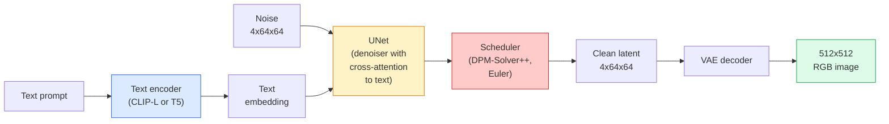

# Stable Diffusion — Architecture & Fine-Tuning

> التوزيع المستقر هو DDPM يتم تشغيله في المساحة الكامنة لـ VAE مُدرب مسبقًا، مشروطًا بالنص عبر الانتباه المتبادل، ويتم أخذ عينات منه باستخدام حل حتمي سريع ODE، ويتم توجيهه بواسطة إرشادات خالية من المصنف.

**النوع:** تعلم + استخدم
** اللغات: ** بايثون
**المتطلبات الأساسية:** المرحلة الرابعة الدرس 10 (الانتشار)، المرحلة 7 الدرس 02 (الانتباه الذاتي)
**الوقت:** ~75 دقيقة

## Learning Objectives

- تتبع الأجزاء الخمس من خط التوزيع المستقر pipeline: VAE، أداة تشفير النص، U-Net، المجدول، مدقق الأمان - وما يفعله كل منهم بالفعل
- شرح الانتشار الكامن ولماذا التدريب في مساحة كامنة 4x64x64 (بدلاً من صورة 3x512x512) يقلل من الحساب بمقدار 48x دون فقدان الجودة
- استخدم `diffusers` لإنشاء الصور، وتشغيل صورة إلى صورة، والرسم الداخلي، والتوليد الموجه بواسطة ControlNet
- ضبط النشر المستقر باستخدام LoRA على مجموعة بيانات مخصصة صغيرة وتحميل المحول LoRA عند الاستدلال

## The Problem

تدريب DDPM مباشرة على صور 512x512 RGB أمر مكلف. يتم دعم كل خطوة تدريب من خلال شبكة U-Net التي ترى 3x512x512 = 786,432 قيمة إدخال، ويأخذ أخذ العينات أكثر من 50 تمريرة للأمام عبر شبكة U-Net نفسها. على مستوى جودة Stable Diffusion 1.5 (تم إصداره عام 2022)، سيحتاج نشر مساحة البكسل إلى ما يقرب من 256 GPU شهرًا من التدريب و10-30 ثانية لكل صورة على المستهلك GPU.

كانت الحيلة التي جعلت تحويل النص إلى صورة ذات وزن مفتوح أمرًا عمليًا هي **الانتشار الكامن** (Rombach et al., CVPR 2022). قم بتدريب VAE الذي يعين صورة 3x512x512 إلى موتر كامن 4x64x64 والعودة، ثم قم بالنشر في تلك المساحة الكامنة. ينخفض ​​الحساب بمقدار `(3*512*512)/(4*64*64) = 48x`. ينخفض ​​​​أخذ العينات من عشرات الثواني إلى أقل من ثانيتين في نفس GPU.

تقريبًا كل نموذج حديث لتوليد الصور - SDXL، SD3، FLUX، HunyuanDiT، Wan-Video - هو نموذج نشر كامن مع اختلافات في جهاز التشفير التلقائي، ومزيل الضوضاء (U-Net أو DiT)، وتكييف النص. تعلم الانتشار المستقر وقد تعلمت القالب.

## The Concept

### The pipeline



- **VAE** — جهاز التشفير التلقائي المجمد. يقوم برنامج التشفير بتحويل الصورة إلى صورة كامنة (تستخدم في img2img والتدريب). يقوم جهاز فك التشفير بتحويل العناصر الكامنة إلى صورة.
- **برنامج تشفير النص** — CLIP برنامج تشفير النص (SD 1.x/2.x)، CLIP-L + CLIP-G (SDXL)، أو T5-XXL (SD3/FLUX). ينتج سلسلة من التضمينات الرمزية.
- **U-Net** — مزيل الضوضاء. يحتوي على طبقات اهتمام متقاطع تنتقل من العناصر الكامنة إلى تضمين النص عند كل مستوى دقة.
- **المجدول** — خوارزمية أخذ العينات (DDIM، Euler، DPM-Solver++). يختار سيجما، ويمزج الضوضاء المتوقعة مرة أخرى في الصوت الكامن.
- **مدقق الأمان** — مرشح اختياري NSFW / محتوى غير قانوني على الصورة الناتجة.

### Classifier-free guidance (CFG)

يتعلم تكييف النص العادي `epsilon_theta(x_t, t, c)` لكل مطالبة `c`. CFG يدرب نفس الشبكة مع انخفاض `c` بنسبة 10% من الوقت (تم استبداله بتضمين فارغ)، مما يوفر نموذجًا واحدًا يتنبأ بكل من الضوضاء المشروطة وغير المشروطة. عند الاستدلال:

```
eps = eps_uncond + w * (eps_cond - eps_uncond)
```

`w` هو مقياس التوجيه. `w=0` غير مشروط، `w=1` شرطي عادي، `w>1` يدفع المخرجات نحو أن تكون "أكثر تكييفًا مع الموجه" على حساب التنوع. SD الافتراضي هو `w=7.5`.

CFG هو السبب في أن تحويل النص إلى صورة يعمل بجودة الإنتاج. بدونها، تؤدي المطالبات إلى تحيز الإخراج بشكل ضعيف؛ معها، المطالبات تهيمن.

### Latent space geometry

إن القناة الكامنة المكونة من 4 قنوات VAE ليست مجرد صورة مضغوطة. إنه متعدد حيث يتوافق الحساب تقريبًا مع التعديلات الدلالية (الهندسة السريعة + الاستيفاء كلاهما موجودان هنا)، وحيث تم تدريب U-Net للنشر على إنفاق ميزانية النمذجة بالكامل. لا يؤدي فك ترميز صورة كامنة عشوائية مقاس 4x64x64 إلى ظهور صورة عشوائية، بل ينتج عنه بيانات غير صحيحة، نظرًا لأن مجموعة فرعية معينة فقط من العناصر الكامنة يمكن فك تشفيرها للحصول على صور صالحة.

نتيجتان:

1. **Img2img** = تشفير الصورة إلى الحالة الكامنة، إضافة ضوضاء جزئية، تشغيل مزيل الضوضاء، فك التشفير. تبقى بنية الصورة موجودة لأن التشفير شبه قابل للعكس؛ يتغير المحتوى بناءً على المطالبة.
2. **Inpainting** = نفس img2img لكن مزيل الضوضاء يقوم فقط بتحديث المناطق المقنعة؛ يتم الاحتفاظ بالمناطق غير المقنعة في حالة كامنة مشفرة.

### The U-Net architecture

إن SD U-Net هو نسخة كبيرة من TinyUNet من الدرس 10 مع ثلاث إضافات:

- **كتل المحولات** عند كل دقة مكانية، تحتوي على انتباه ذاتي + انتباه متقاطع إلى النص المضمن.
- **تضمين الوقت** عبر MLP على التشفير الجيبي.
- **تخطي الاتصالات** بين جهاز التشفير وجهاز فك التشفير عند مطابقة الدقة.

إجمالي المعلمات في SD 1.5: ~860M. SDXL: ~2.6ب. FLUX: ~12ب. القفزة في المعلمات تكون في الغالب في طبقات الاهتمام.

### LoRA fine-tuning

يحتاج الضبط الدقيق الكامل للنشر المستقر إلى 20+ GB من VRAM وتحديث 860 مليون معلمة. LoRA (التكيف ذو الرتبة المنخفضة) يحافظ على تجميد النموذج الأساسي ويحقن مصفوفات تحليل الرتبة الصغيرة في طبقات الانتباه. محول LoRA لـ SD عادةً ما يكون 10-50 MB، ويتدرب خلال 10-60 دقيقة على مستهلك واحد GPU، ويتم تحميله في وقت الاستدلال كتعديل سهل.

```
Original: W_q : (d_in, d_out)   frozen
LoRA:     W_q + alpha * (A @ B)   where A : (d_in, r), B : (r, d_out)

r is typically 4-32.
```

LoRA هي الطريقة التي يتم بها توزيع الضبط الدقيق لكل مجتمع تقريبًا. تستضيف CivitAI وHugging Face الملايين منهم.

### Schedulers you will see

- **DDIM** — حتمية، ~50 خطوة، بسيطة.
- **أسلاف أويلر** — العشوائية، 30-50 خطوة، عينات أكثر إبداعًا قليلاً.
- **DPM-Solver++ 2M Karras** — حتمية، 20-30 خطوة، الإنتاج الافتراضي.
- **LCM / TCD / توربو** — نماذج الاتساق والمتغيرات المقطرة؛ 1-4 خطوات على حساب بعض الجودة.

يعد تبديل المجدولات تغييرًا من سطر واحد في `diffusers` وفي بعض الأحيان يعمل على إصلاح مشكلات العينة دون أي إعادة تدريب.

## Build It

يستخدم هذا الدرس `diffusers` من البداية إلى النهاية بدلاً من إعادة بناء Stable Diffusion من البداية. القطع التي ستحتاج إلى إعادة بنائها (VAE، أداة تشفير النصوص، U-Net، المجدول) هي موضوعات دروس خاصة بها؛ هنا الهدف هو إتقان الإنتاج API.

### Step 1: Text-to-image

```python
import torch
from diffusers import StableDiffusionPipeline

pipe = StableDiffusionPipeline.from_pretrained(
    "runwayml/stable-diffusion-v1-5",
    torch_dtype=torch.float16,
).to("cuda")

image = pipe(
    prompt="a dog riding a skateboard in tokyo, studio ghibli style",
    guidance_scale=7.5,
    num_inference_steps=25,
    generator=torch.Generator("cuda").manual_seed(42),
).images[0]
image.save("dog.png")
```

`float16` نصفين VRAM مع عدم وجود فقدان واضح للجودة. `num_inference_steps=25` مع الإعداد الافتراضي DPM-Solver++ يطابق `num_inference_steps=50` مع DDIM.

### Step 2: Swap the scheduler

```python
from diffusers import DPMSolverMultistepScheduler, EulerAncestralDiscreteScheduler

pipe.scheduler = DPMSolverMultistepScheduler.from_config(pipe.scheduler.config)
pipe.scheduler = EulerAncestralDiscreteScheduler.from_config(pipe.scheduler.config)
```

يتم فصل حالة المجدول عن أوزان U-Net. يمكنك التدرب على DDPM وتجربة أي برنامج جدولة.

### Step 3: Image-to-image

```python
from diffusers import StableDiffusionImg2ImgPipeline
from PIL import Image

img2img = StableDiffusionImg2ImgPipeline.from_pretrained(
    "runwayml/stable-diffusion-v1-5",
    torch_dtype=torch.float16,
).to("cuda")

init_image = Image.open("dog.png").convert("RGB").resize((512, 512))
out = img2img(
    prompt="a dog riding a skateboard, oil painting",
    image=init_image,
    strength=0.6,
    guidance_scale=7.5,
).images[0]
```

`strength` هو مقدار الضوضاء التي يجب إضافتها قبل تقليل الضوضاء (0.0 = دون تغيير، 1.0 = التجديد الكامل). 0.5-0.7 هو النطاق القياسي لنقل النمط.

### Step 4: Inpainting

```python
from diffusers import StableDiffusionInpaintPipeline

inpaint = StableDiffusionInpaintPipeline.from_pretrained(
    "runwayml/stable-diffusion-inpainting",
    torch_dtype=torch.float16,
).to("cuda")

image = Image.open("dog.png").convert("RGB").resize((512, 512))
mask = Image.open("dog_mask.png").convert("L").resize((512, 512))

out = inpaint(
    prompt="a cat",
    image=image,
    mask_image=mask,
    guidance_scale=7.5,
).images[0]
```

وحدات البكسل البيضاء الموجودة في القناع هي المنطقة المراد تجديدها. يتم الحفاظ على وحدات البكسل السوداء.

### Step 5: LoRA loading

```python
pipe.load_lora_weights("sayakpaul/sd-lora-ghibli")
pipe.fuse_lora(lora_scale=0.8)

image = pipe(prompt="a village square in ghibli style").images[0]
```

`lora_scale` يتحكم في القوة؛ 0.0 = لا يوجد تأثير، 1.0 = التأثير الكامل. `fuse_lora` يقوم بتثبيت المحول في الأوزان الموجودة في مكانها من أجل السرعة، ولكنه يمنع التبديل. اتصل بـ `pipee.unfuse_lora()` قبل تحميل محول مختلف.

### Step 6: LoRA training (sketch)

تدريب LoRA حقيقي يعيش في `peft` أو `diffusers.training`. المخطط التفصيلي:

```python
# Pseudocode
for step, batch in enumerate(dataloader):
    images, prompts = batch
    latents = vae.encode(images).latent_dist.sample() * 0.18215

    t = torch.randint(0, num_train_timesteps, (batch_size,))
    noise = torch.randn_like(latents)
    noisy_latents = scheduler.add_noise(latents, noise, t)

    text_emb = text_encoder(tokenizer(prompts))

    pred_noise = unet(noisy_latents, t, text_emb)  # LoRA weights injected here

    loss = F.mse_loss(pred_noise, noise)
    loss.backward()
    optimizer.step()
```

فقط المصفوفات LoRA هي التي تتلقى التدرج؛ تم تجميد قاعدة U-Net وVAE ومشفر النص. مع حجم دفعة من 1 ونقطة تفتيش متدرجة، يناسب هذا 8 GB من VRAM.

## Use It

في الإنتاج، القرارات التي تتخذها في الواقع make:

- **عائلة النماذج**: SD 1.5 للضبط الدقيق لمجتمع مفتوح المصدر، SDXL للدقة العالية، SD3 / FLUX لأحدث ما توصلت إليه التكنولوجيا ومتطلبات الترخيص الصارمة.
- **المجدول**: DPM-Solver++ 2M Karras لمدة 20-30 خطوة، LCM-LoRA عندما يكون زمن الوصول أقل من 1 ثانية.
- **الدقة**: `float16` في 4080/4090، `bfloat16` في A100 والأحدث، `int8` (عبر `bitsandbytes` أو `compel`) عندما يكون VRAM ضيقًا.
- **التكييف**: يعمل بالنص العادي؛ لتحكم أقوى، أضف ControlNet (الذكاء، العمق، الوضعية) أعلى خط القاعدة pipe.

بالنسبة إلى إنشاء الدُفعات، فإن `AUTO1111` / `ComfyUI` هي أدوات المجتمع؛ للإنتاج APIs أو `diffusers` + `accelerate` أو `optimum-nvidia` مع تجميع TensorRT.

## Ship It

ينتج هذا الدرس:

- `outputs/prompt-sd-pipelineeline-planner.md` — مطالبة تختار SD 1.5 / SDXL / SD3 / FLUX بالإضافة إلى الجدولة والدقة نظرًا لميزانية زمن الوصول وهدف الإخلاص وقيد الترخيص.
- `outputs/skill-lora-training-setup.md` — مهارة تكتب تكوين تدريب LoRA كامل لمجموعة بيانات مخصصة بما في ذلك التسميات التوضيحية والرتبة وحجم الدفعة ومعدل التعلم.

## Exercises

1. **(سهل)** قم بإنشاء نفس المطالبة باستخدام `guidance_scale` في `[1, 3, 5, 7.5, 10, 15]`. وصف كيف تتغير الصورة. ما هي القيمة الإرشادية التي تظهر بها المصنوعات اليدوية؟
2. **(متوسط)** التقط أي صورة حقيقية، وقم بتشغيلها من خلال `StableDiffusionImg2ImgPipeline` في `strength` في `[0.2, 0.4, 0.6, 0.8, 1.0]`. ما هي القوة التي تحافظ على التكوين مع تغيير الأسلوب؟ لماذا يتجاهل الإصدار 1.0 الإدخال بالكامل؟
3. **(صعب)** قم بتدريب LoRA على 10-20 صورة لموضوع واحد (حيوان أليف، شعار، شخصية) وقم بإنشاء مشاهد جديدة تتضمن هذا الموضوع بداخلها. قم بالإبلاغ عن الترتيب LoRA وخطوات التدريب التي أنتجت أفضل طريقة للحفاظ على الهوية دون الإفراط في ملاءمة الصور المدخلة.

## Key Terms

| مصطلح | ماذا يقول الناس | ماذا يعني في الواقع |
|------|----------------|----------------------|
| الانتشار الكامن | "منتشر في الخفاء" | قم بتشغيل DDPM بالكامل في المساحة الكامنة VAE (4x64x64) بدلاً من مساحة البكسل (3x512x512)؛ توفير حساب 48x |
| VAE عامل القياس | "0.18215" | الثابت الذي يعيد قياس الخام الخام لـ VAE إلى تباين الوحدة تقريبًا؛ مشفرة في كل SD pipeline |
| إرشادات خالية من المصنف | "CFG" | مزج توقعات الضوضاء المشروطة وغير المشروطة؛ مقبض الاستدلال الأكثر تأثيرًا |
| المجدول | "العينة" | الخوارزمية التي تحول تنبؤات الضوضاء + النموذج إلى مسار كامن منخفض الضوضاء |
| LoRA | "محول ذو رتبة منخفضة" | مصفوفات تحليل الرتب الصغيرة التي تعمل على ضبط طبقات الانتباه دون لمس الأوزان الأساسية |
| عبر الاهتمام | "الانتباه إلى النص والصورة" | الانتباه من الرموز الكامنة إلى الرموز النصية؛ يقوم بإدخال معلومات سريعة على كل مستوى من مستويات U-Net |
| كنترول نت | "تكييف الهيكل" | محول مدرب بشكل منفصل يوجه SD بمدخل إضافي (ذكي، عمق، وضعية، تجزئة) |
| DPM-سولفر++ | "المجدول الافتراضي" | الحتمية من الدرجة الثانية ODE حلالا؛ أفضل جودة بعدد خطوات منخفض (20-30) في عام 2026 |

## Further Reading

- [High-Resolution Image Synthesis with Latent Diffusion (Rombach et al., 2022)](https://arxiv.org/abs/2112.10752) — the Stable Diffusion paper; includes every ablation that justifies the design
- [Classifier-Free Diffusion Guidance (Ho & Salimans, 2022)](https://arxiv.org/abs/2207.12598) — الورقة CFG
- [LoRA: التكيف منخفض الرتبة لنماذج اللغات الكبيرة (Hu et al., 2021)](https://arxiv.org/abs/2106.09685) — LoRA كان NLP-الأول؛ تم نقله إلى SD بدون أي تغييرات تقريبًا
- [توثيق الناشرين](https://huggingface.co/docs/diffusers) — المرجع لكل SD / SDXL / SD3 / FLUX pipeline
