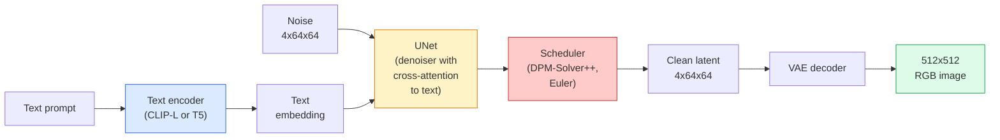

# الانتشار المستقر – الهندسة المعمارية والضبط الدقيق
> النشر المستقر هو DDPM الذي يتم تشغيله في المساحة الكامنة لـ VAE المدرّب مسبقًا، والمشروط بالنص عبر الانتباه المتبادل، ويتم أخذ عينات منه باستخدام حل ODE حتمي سريع، ويتم توجيهه بواسطة إرشادات خالية من المصنف.
**النوع:** تعلم + استخدم
** اللغات: ** بايثون
**المتطلبات الأساسية:** المرحلة الرابعة الدرس 10 (الانتشار)، المرحلة 7 الدرس 02 (الانتباه الذاتي)
**الوقت:** ~75 دقيقة
## أهداف التعلم
- تتبع الأجزاء الخمس من خط الانتشار المستقر pipeline: VAE، أداة تشفير النص، U-Net، المجدول، مدقق الأمان - وما يفعله كل منهم بالفعل
- شرح الانتشار الكامن ولماذا التدريب في مساحة كامنة 4x64x64 (بدلاً من صورة 3x512x512) يقلل من الحساب بمقدار 48x دون فقدان الجودة
- استخدم `diffusers` لإنشاء الصور، وتشغيل صورة إلى صورة، والرسم الداخلي، والتوليد الموجه بواسطة ControlNet
- ضبط النشر المستقر باستخدام LoRA على مجموعة بيانات مخصصة صغيرة وتحميل محول LoRA عند الاستدلال
## المشكلة
يعد تدريب DDPM مباشرة على صور RGB مقاس 512 × 512 أمرًا مكلفًا. يتم دعم كل خطوة تدريب من خلال شبكة U-Net التي ترى 3x512x512 = 786,432 قيمة إدخال، ويأخذ أخذ العينات أكثر من 50 تمريرة للأمام عبر شبكة U-Net نفسها. على مستوى جودة Stable Diffusion 1.5 (تم إصداره عام 2022)، سيحتاج نشر مساحة البكسل إلى ما يقرب من 256 GPU-شهرًا من التدريب و10-30 ثانية لكل صورة على المستهلك GPU.
كانت الحيلة التي جعلت تحويل النص إلى صورة ذات وزن مفتوح أمرًا عمليًا هي **الانتشار الكامن** (Rombach et al., CVPR 2022). تدريب VAE الذي يعين صورة 3x512x512 إلى موتر كامن 4x64x64 والعودة، ثم قم بالنشر في تلك المساحة الكامنة. يسقط الحساب بمقدار `(3*512*512)/(4*64*64) = 48x`. ينخفض ​​أخذ العينات من عشرات الثواني إلى أقل من ثانيتين في نفس GPU.
تقريبًا كل نموذج حديث لتوليد الصور - SDXL، SD3، FLUX، HunyuanDiT، Wan-Video - هو نموذج نشر كامن مع اختلافات في جهاز التشفير التلقائي، ومُثبِّت الضوضاء (U-Net أو DiT)، وتكييف النص. تعلم الانتشار المستقر وقد تعلمت القالب.
##المفهوم
### السطر pipe


- **VAE** — وحدة التشفير التلقائي المجمدة. يقوم برنامج التشفير بتحويل الصورة إلى صورة كامنة (تستخدم في img2img والتدريب). يقوم جهاز فك التشفير بتحويل العناصر الكامنة إلى صورة.
- **أداة تشفير النص** — CLIP أداة تشفير النصوص (SD 1.x/2.x)، CLIP-L + CLIP-G (SDXL)، أو T5-XXL (SD3/FLUX). ينتج سلسلة من التضمينات الرمزية.
- **U-Net** — مزيل الضوضاء. يحتوي على طبقات اهتمام متقاطع تنتقل من العناصر الكامنة إلى تضمين النص عند كل مستوى دقة.
- **المجدول** — خوارزمية أخذ العينات (DDIM، Euler، DPM-Solver++). يختار سيجما، ويمزج الضوضاء المتوقعة مرة أخرى في الصوت الكامن.
- **مدقق الأمان** — اختياري NSFW / مرشح المحتوى غير القانوني على الصورة الناتجة.
### إرشادات خالية من المصنف (CFG)
يتعلم تكييف النص العادي `epsilon_theta(x_t, t, c)` لكل مطالبة `c`. يقوم CFG بتدريب نفس الشبكة مع انخفاض `c` بنسبة 10% من الوقت (تم استبداله بتضمين فارغ)، مما يوفر نموذجًا واحدًا يتنبأ بكل من الضوضاء المشروطة وغير المشروطة. عند الاستدلال:
```
eps = eps_uncond + w * (eps_cond - eps_uncond)
```

`w` هو مقياس التوجيه. `w=0` غير مشروط، `w=1` شرطي عادي، `w>1` يدفع المخرجات نحو أن تكون "أكثر تكييفًا مع الموجه" على حساب التنوع. SD الافتراضي هو `w=7.5`.
CFG هو السبب وراء نجاح ميزة تحويل النص إلى صورة بجودة الإنتاج. بدونها، تؤدي المطالبات إلى تحيز الإخراج بشكل ضعيف؛ معها، المطالبات تهيمن.
### هندسة الفضاء الكامن
إن القناة الكامنة المكونة من 4 قنوات لـ VAE ليست مجرد صورة مضغوطة. إنه متعدد حيث يتوافق الحساب تقريبًا مع التعديلات الدلالية (الهندسة السريعة + الاستيفاء كلاهما موجودان هنا)، وحيث تم تدريب U-Net للنشر على إنفاق ميزانية النمذجة بالكامل. لا يؤدي فك ترميز صورة كامنة عشوائية مقاس 4x64x64 إلى ظهور صورة عشوائية، بل ينتج عنه بيانات غير صحيحة، نظرًا لأن مجموعة فرعية معينة فقط من العناصر الكامنة يمكن فك تشفيرها للحصول على صور صالحة.
نتيجتان:
1. **Img2img** = تشفير الصورة إلى الحالة الكامنة، إضافة ضوضاء جزئية، تشغيل مزيل الضوضاء، فك التشفير. تبقى بنية الصورة موجودة لأن التشفير شبه قابل للعكس؛ يتغير المحتوى بناءً على المطالبة.
2. **Inpainting** = نفس img2img لكن مزيل الضوضاء يقوم فقط بتحديث المناطق المقنعة؛ يتم الاحتفاظ بالمناطق غير المقنعة في حالة كامنة مشفرة.
### بنية يو نت
SD U-Net هي نسخة كبيرة من TinyUNet من الدرس 10 مع ثلاث إضافات:
- **كتل المحولات** عند كل دقة مكانية، تحتوي على انتباه ذاتي + انتباه متقاطع إلى النص المضمن.
- **تضمين الوقت** عبر MLP على التشفير الجيبي.
- **تخطي الاتصالات** بين جهاز التشفير وجهاز فك التشفير عند مطابقة الدقة.
إجمالي المعلمات في SD 1.5: ~860M. SDXL: ~2.6ب. FLUX: ~12ب. القفزة في المعلمات تكون في الغالب في طبقات الاهتمام.
### ضبط LoRA
يحتاج الضبط الدقيق الكامل للنشر المستقر إلى 20+ GB من VRAM وتحديث 860 مليون معلمة. يحافظ LoRA (التكيف منخفض الرتبة) على تجميد النموذج الأساسي ويحقن مصفوفات تحلل رتبة صغيرة في طبقات الانتباه. عادةً ما يستغرق محول LoRA لـ SD 10-50 MB، ويتم تدريبه خلال 10-60 دقيقة على مستهلك واحد GPU، ويتم تحميله في وقت الاستدلال كتعديل مباشر.
```
Original: W_q : (d_in, d_out)   frozen
LoRA:     W_q + alpha * (A @ B)   where A : (d_in, r), B : (r, d_out)

r is typically 4-32.
```

LoRA هي الطريقة التي يتم بها توزيع الضبط الدقيق لكل مجتمع تقريبًا. يستضيف CivitAI وHugging Face الملايين منهم.
### ستشاهد المجدولين
- **DDIM** — حتمية، ~50 خطوة، بسيطة.
- **أسلاف أويلر** — العشوائية، 30-50 خطوة، عينات أكثر إبداعًا قليلاً.
- **DPM-Solver++ 2M Karras** — حتمية، 20-30 خطوة، الإنتاج الافتراضي.
- **LCM / TCD / Turbo** — نماذج الاتساق والمتغيرات المقطرة؛ 1-4 خطوات على حساب بعض الجودة.
يعد تبديل المجدولات تغييرًا من سطر واحد في `diffusers` وفي بعض الأحيان يعمل على إصلاح مشكلات العينة دون أي إعادة تدريب.
## بنائها
يستخدم هذا الدرس `diffusers` شاملاً بدلاً من إعادة بناء Stable Diffusion من البداية. الأجزاء التي تحتاج إلى إعادة بنائها (VAE، أداة تشفير النصوص، U-Net، المجدول) هي موضوعات دروس خاصة بها؛ الهدف هنا هو إتقان الإنتاج API.
### الخطوة 1: تحويل النص إلى صورة
```python
import torch
from diffusers import StableDiffusionPipeline

pipe = StableDiffusionPipeline.from_pretrained(
    "runwayml/stable-diffusion-v1-5",
    torch_dtype=torch.float16,
).to("cuda")

image = pipe(
    prompt="a dog riding a skateboard in tokyo, studio ghibli style",
    guidance_scale=7.5,
    num_inference_steps=25,
    generator=torch.Generator("cuda").manual_seed(42),
).images[0]
image.save("dog.png")
```

`float16` نصفين VRAM بدون فقدان واضح للجودة. `num_inference_steps=25` مع الافتراضي DPM-Solver++ يطابق `num_inference_steps=50` مع DDIM.
### الخطوة 2: تبديل المجدول
```python
from diffusers import DPMSolverMultistepScheduler, EulerAncestralDiscreteScheduler

pipe.scheduler = DPMSolverMultistepScheduler.from_config(pipe.scheduler.config)
pipe.scheduler = EulerAncestralDiscreteScheduler.from_config(pipe.scheduler.config)
```

يتم فصل حالة المجدول عن أوزان U-Net. يمكنك التدريب على DDPM وتجربة أي برنامج جدولة.
### الخطوة 3: صورة إلى صورة
```python
from diffusers import StableDiffusionImg2ImgPipeline
from PIL import Image

img2img = StableDiffusionImg2ImgPipeline.from_pretrained(
    "runwayml/stable-diffusion-v1-5",
    torch_dtype=torch.float16,
).to("cuda")

init_image = Image.open("dog.png").convert("RGB").resize((512, 512))
out = img2img(
    prompt="a dog riding a skateboard, oil painting",
    image=init_image,
    strength=0.6,
    guidance_scale=7.5,
).images[0]
```

`strength` هو مقدار الضوضاء التي يجب إضافتها قبل تقليل الضوضاء (0.0 = بدون تغيير، 1.0 = التجديد الكامل). 0.5-0.7 هو النطاق القياسي لنقل النمط.
### الخطوة 4: الطلاء
```python
from diffusers import StableDiffusionInpaintPipeline

inpaint = StableDiffusionInpaintPipeline.from_pretrained(
    "runwayml/stable-diffusion-inpainting",
    torch_dtype=torch.float16,
).to("cuda")

image = Image.open("dog.png").convert("RGB").resize((512, 512))
mask = Image.open("dog_mask.png").convert("L").resize((512, 512))

out = inpaint(
    prompt="a cat",
    image=image,
    mask_image=mask,
    guidance_scale=7.5,
).images[0]
```

وحدات البكسل البيضاء الموجودة في القناع هي المنطقة المراد تجديدها. يتم الحفاظ على وحدات البكسل السوداء.
### الخطوة 5: تحميل LoRA
```python
pipe.load_lora_weights("sayakpaul/sd-lora-ghibli")
pipe.fuse_lora(lora_scale=0.8)

image = pipe(prompt="a village square in ghibli style").images[0]
```

`lora_scale` يتحكم في القوة؛ 0.0 = لا يوجد تأثير، 1.0 = التأثير الكامل. `fuse_lora` يقوم بتثبيت المحول في الأوزان الموجودة في مكانها من أجل السرعة، ولكنه يمنع التبديل. اتصل بـ `pipe.unfuse_lora()` قبل تحميل محول مختلف.
### الخطوة 6: تدريب LoRA (رسم)
يقع تدريب Real LoRA في `peft` أو `diffusers.training`. المخطط التفصيلي:
```python
# Pseudocode
for step, batch in enumerate(dataloader):
    images, prompts = batch
    latents = vae.encode(images).latent_dist.sample() * 0.18215

    t = torch.randint(0, num_train_timesteps, (batch_size,))
    noise = torch.randn_like(latents)
    noisy_latents = scheduler.add_noise(latents, noise, t)

    text_emb = text_encoder(tokenizer(prompts))

    pred_noise = unet(noisy_latents, t, text_emb)  # LoRA weights injected here

    loss = F.mse_loss(pred_noise, noise)
    loss.backward()
    optimizer.step()
```

فقط مصفوفات LoRA هي التي تتلقى التدرج؛ تم تجميد U-Net الأساسي وVAE وأداة تشفير النص. مع حجم دفعة يبلغ 1 ونقاط فحص متدرجة، يتناسب هذا مع 8 GB من VRAM.
## استخدمه
في الإنتاج، القرارات التي تتخذها في الواقع make:
- **مجموعة النماذج**: SD 1.5 للتحسينات الدقيقة لمجتمع مفتوح المصدر، SDXL للدقة العالية، SD3 / FLUX لأحدث ما توصلت إليه التكنولوجيا ومتطلبات الترخيص الصارمة.
- **المجدول**: DPM-Solver++ 2M Karras لمدة 20-30 خطوة، LCM-LoRA عندما يكون زمن الوصول أقل من 1 ثانية.
- **الدقة**: `float16` في 4080/4090، `bfloat16` في A100 والأحدث، `int8` (عبر `bitsandbytes` أو `compel`) عندما يكون VRAM ضيقًا.
- **التكييف**: يعمل بالنص العادي؛ لتحكم أقوى، قم بإضافة ControlNet (الذكاء، العمق، الوضعية) أعلى خط القاعدة pipeline.
لإنشاء الدُفعات، `AUTO1111` / `ComfyUI` هي أدوات المجتمع؛ لواجهات برمجة تطبيقات الإنتاج، `diffusers` + `accelerate` أو `optimum-nvidia` مع تجميع TensorRT.
## اشحنها
ينتج هذا الدرس:
- `outputs/prompt-sd-pipeline-planner.md` — مطالبة تختار SD 1.5 / SDXL / SD3 / FLUX بالإضافة إلى المجدول والدقة في ضوء ميزانية زمن الاستجابة وهدف الدقة وقيد الترخيص.
- `outputs/skill-lora-training-setup.md` — مهارة تكتب تكوينًا تدريبيًا كاملاً لـ LoRA لمجموعة بيانات مخصصة بما في ذلك التسميات التوضيحية والرتبة وحجم الدفعة ومعدل التعلم.
## تمارين
1. **(سهل)** قم بإنشاء نفس المطالبة باستخدام `guidance_scale` في `[1, 3, 5, 7.5, 10, 15]`. وصف كيف تتغير الصورة. ما هي القيمة الإرشادية التي تظهر بها المصنوعات اليدوية؟
2. **(متوسط)** التقط أي صورة حقيقية، وقم بتشغيلها عبر `StableDiffusionImg2ImgPipeline` في `strength` في `[0.2, 0.4, 0.6, 0.8, 1.0]`. ما هي القوة التي تحافظ على التكوين مع تغيير الأسلوب؟ لماذا يتجاهل الإصدار 1.0 الإدخال بالكامل؟
3. **(صعب)** تدريب LoRA على 10-20 صورة لموضوع واحد (حيوان أليف، شعار، شخصية) وإنشاء مشاهد جديدة تتضمن هذا الموضوع. قم بالإبلاغ عن تصنيف LoRA وخطوات التدريب التي أنتجت أفضل الحفاظ على الهوية دون الإفراط في تركيب الصور المدخلة.
## المصطلحات الرئيسية
| مصطلح | ماذا يقول الناس | ماذا يعني في الواقع |
|------|----------------|----------------------|
| الانتشار الكامن | "منتشر في الخفاء" | قم بتشغيل DDPM بالكامل في المساحة الكامنة VAE (4x64x64) بدلاً من مساحة البكسل (3x512x512)؛ توفير حساب 48x |
| VAE عامل القياس | "0.18215" | الثابت الذي يعيد قياس الخام الخام لـ VAE إلى تباين الوحدة تقريبًا؛ مضمن في كل SD pipeline |
| إرشادات خالية من المصنف | "CFG" | مزج توقعات الضوضاء المشروطة وغير المشروطة؛ مقبض الاستدلال الأكثر تأثيرًا |
| المجدول | "العينة" | الخوارزمية التي تحول تنبؤات الضوضاء + النموذج إلى مسار كامن منخفض الضوضاء |
| لورا | "محول ذو رتبة منخفضة" | مصفوفات تحليل الرتب الصغيرة التي تعمل على ضبط طبقات الانتباه دون لمس الأوزان الأساسية |
| عبر الاهتمام | "الانتباه إلى النص والصورة" | الانتباه من الرموز الكامنة إلى الرموز النصية؛ يقوم بإدخال معلومات سريعة على كل مستوى من مستويات U-Net |
| كنترول نت | "تكييف الهيكل" | محول مدرب بشكل منفصل يوجه SD بمدخل إضافي (ذكي، عمق، وضعية، تجزئة) |
| DPM-سولفر++ | "المجدول الافتراضي" | حل حتمي من الدرجة الثانية ODE؛ أفضل جودة بعدد خطوات منخفض (20-30) في عام 2026 |
## مزيد من القراءة
- [High-Resolution Image Synthesis with Latent Diffusion (Rombach et al., 2022)](https://arxiv.org/abs/2112.10752) — ورقة الانتشار المستقر؛ يشمل كل الاجتثاث الذي يبرر التصميم
- [Classifier-Free Diffusion Guidance (Ho & Salimans, 2022)](https://arxiv.org/abs/2207.12598) — ورقة CFG
- [LoRA: Low-Rank Adaptation of Large Language Models (Hu et al., 2021)](https://arxiv.org/abs/2106.09685) — كانت LoRA NLP-الأولى؛ تم نقله إلى SD بدون أي تغييرات تقريبًا
- [diffusers documentation](https://huggingface.co/docs/diffusers) — المرجع لكل SD / SDXL / SD3 / FLUX pipeline