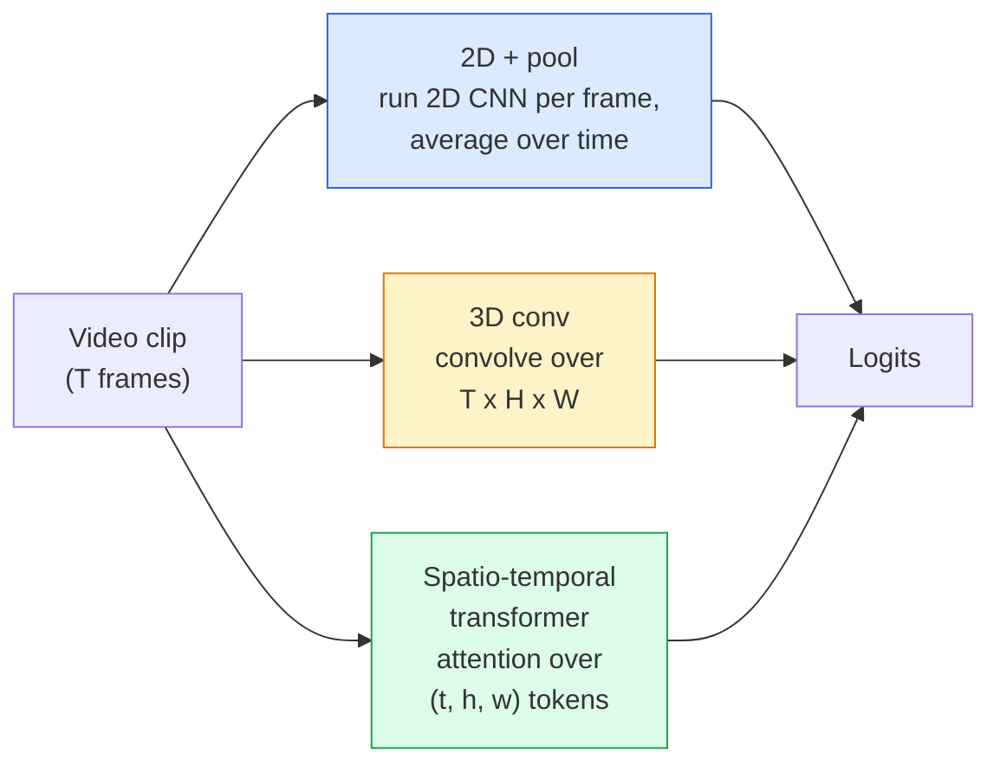

# Video Understanding — Temporal Modeling

> الفيديو عبارة عن سلسلة من الصور بالإضافة إلى العوامل الفيزيائية التي تربط بينها. يتعامل كل نموذج فيديو مع الوقت كمحور إضافي (تحويل ثلاثي الأبعاد)، أو كتسلسل للمتابعة (محول)، أو كميزة لاستخراجها مرة واحدة وتجميعها (ثنائي الأبعاد+تجمع).

** النوع: ** تعلم + بناء
** اللغات: ** بايثون
**المتطلبات:** المرحلة الرابعة الدرس 03 (CNN)، المرحلة الرابعة الدرس 04 (تصنيف الصور)
**الوقت:** ~45 دقيقة

## Learning Objectives

- التمييز بين الأساليب الثلاثة الرئيسية لنمذجة الفيديو (2D+pool، التحويل ثلاثي الأبعاد، المحول المكاني والزماني) والتنبؤ بمقايضات التكلفة والدقة.
- تنفيذ أخذ عينات الإطار، والتجميع الزمني، ومصنف خط الأساس ثنائي الأبعاد + التجمع في PyTorch
- اشرح سبب نقل حبات I3D ثلاثية الأبعاد "المضخمة" بشكل جيد من أوزان ImageNet وما يفعله التحويل المُعامل (2+1)D بشكل مختلف
- اقرأ مجموعات البيانات والمقاييس القياسية للتعرف على الإجراءات: Kinetics-400/600، UCF101، Something-Something V2؛ دقة أعلى 1 على مستوى المقطع والفيديو

## The Problem

فيديو مدته 30 ثانية بمعدل 30 إطارًا في الثانية هو 900 صورة. بسذاجة، تصنيف الفيديو هو تصنيف للصور يتم تشغيله 900 مرة متبوعًا بنوع من التجميع. ينجح هذا عندما يكون الإجراء مرئيًا في كل إطار تقريبًا (الرياضة، الطبخ، مقاطع الفيديو الخاصة بالتمارين الرياضية) ويفشل بشدة عندما يتم تعريف الإجراء من خلال الحركة نفسها: "دفع شيء ما من اليسار إلى اليمين" يبدو وكأنه كائنين ثابتين في كل إطار.

السؤال الأساسي لكل بنية فيديو هو: متى يتم تصميم البنية الزمنية وكيف؟ الإجابة هي التي تحدد كل شيء آخر - حساب التكلفة، واستراتيجية التدريب المسبق، وما إذا كان بإمكانك إعادة استخدام أوزان ImageNet، ومجموعات البيانات التي يتدرب عليها النموذج.

هذا الدرس أقصر عمدا من دروس الصور الثابتة. إن آلية الصورة الأساسية موجودة بالفعل، ويدور فهم الفيديو في الغالب حول القصة الزمنية: أخذ العينات، والنمذجة، والتجميع.

## The Concept

### The three architectural families



### 2D + pool

خذ 2D CNN (ResNet، EfficientNet، ViT). قم بتشغيله بشكل مستقل على كل إطار تم أخذ عينات منه. متوسط ​​(أو الحد الأقصى، أو تجمع الانتباه) التضمينات لكل إطار. تغذية المتجهات المجمعة إلى المصنف.

الايجابيات:
- نقل التدريب المسبق لـ ImageNet مباشرةً.
- أبسط في التنفيذ.
- رخيصة: إطارات T * تكلفة الاستدلال للصورة الواحدة.

سلبيات:
- لا يمكن نمذجة الحركة. الإجراء = مجموع المظاهر.
- التجميع الزمني هو أمر ثابت؛ يبدو "الباب المفتوح" و"الباب المغلق" متماثلين.

متى يتم الاستخدام: المهام ذات المظهر الثقيل، ونقل التعلم إلى مجموعات بيانات الفيديو الصغيرة، وخطوط الأساس الأولية.

### 3D convolutions

استبدل النوى ثنائية الأبعاد (H، W) بنواة ثلاثية الأبعاد (T، H، W). تلتف الشبكة عبر المكان والزمان. العائلة المبكرة: C3D، I3D، SlowFast.

I3D الحيلة: خذ نموذج ImageNet ثنائي الأبعاد تم تدريبه مسبقًا، وقم "بتضخيم" كل نواة ثنائية الأبعاد عن طريق نسخها على طول محور زمني جديد. يتحول التحويل 3x3 ثنائي الأبعاد إلى تحويل 3x3x3 ثلاثي الأبعاد. وهذا يمنح النموذج ثلاثي الأبعاد أوزانًا قوية مدربة مسبقًا بدلاً من التدريب من الصفر.

الايجابيات:
- نماذج الحركة مباشرة.
- I3D التضخم يعطي تعلم نقل مجاني.

سلبيات:
- T/8 FLOPs أكثر من النظير ثنائي الأبعاد (للنواة المؤقتة المكونة من 3 مكدسة 3 مرات).
- الحبات الصدغية صغيرة الحجم؛ تحتاج الحركة بعيدة المدى إلى نهج هرمي أو ثنائي التدفق.

متى يتم الاستخدام: التعرف على الحركة حيث تكون الحركة هي الإشارة (شيء-شيء V2، حركية مع فئات ثقيلة الحركة).

### Spatio-temporal transformers

قم برمز الفيديو إلى شبكة من تصحيحات الزمكان وشاهدها جميعًا. TimeSformer، ViViT، فيديو سوين، VideoMAE.

أنماط الانتباه المهمة:
- **المشترك** — اهتمام كبير واحد على (t، h، w). تربيعي في `T*H*W`; غالي.
- **مقسمة** — انتباهان لكل كتلة: واحد على مدار الوقت، والآخر على المساحة. التحجيم الخطي.
- **مُعامل** — يتناوب الاهتمام بالوقت مع الاهتمام بالمساحة عبر الكتل.

الايجابيات:
- SOTA الدقة في كل معيار رئيسي.
- التحويلات من محولات الصور (ViT) عبر تضخم التصحيح.
- يدعم الفيديو طويل السياق من خلال الاهتمام المتناثر.

سلبيات:
- حساب الجياع.
- يتطلب اختيارًا دقيقًا لنمط الاهتمام أو بالونات وقت التشغيل.

متى يتم الاستخدام: مجموعات البيانات الكبيرة، وفهم الفيديو عالي الدقة، ومهام الفيديو + النص متعددة الوسائط.

### Frame sampling

مقطع مدته 10 ثوانٍ بمعدل 30 إطارًا في الثانية هو 300 إطار؛ إطعام كل 300 إلى أي نموذج هو إسراف. الاستراتيجيات القياسية:

- **أخذ عينات موحدة** — اختر إطارات T بالتساوي عبر المقطع. الافتراضي لـ 2D+pool.
- ** أخذ العينات الكثيفة ** — نافذة إطار T متجاورة عشوائية. شائع في التحويلات ثلاثية الأبعاد لأن الحركة تتطلب إطارات مجاورة.
- **متعدد المقاطع** — عينة من نوافذ الإطار T المتعددة من نفس الفيديو، وتصنيف كل منها، ومتوسط ​​التوقعات في وقت الاختبار.

عادةً ما تكون T 8 أو 16 أو 32 أو 64. أعلى T = إشارة زمنية أكثر مع حساب أكبر.

### Evaluation

مستويين:
- **الدقة على مستوى المقطع** — يرى النموذج مقطعًا واحدًا على شكل حرف T، ويبلغ عن أعلى k.
- **الدقة على مستوى الفيديو** — متوسط ​​التوقعات على مستوى المقطع عبر مقاطع متعددة لكل فيديو؛ أعلى وأكثر استقرارا.

أبلغ دائمًا عن كليهما. النموذج الذي يسجل 78% مقطع / 82% فيديو يعتمد بشكل كبير على متوسط ​​وقت الاختبار؛ الذي يسجل 80% / 81% يكون أكثر قوة لكل مقطع.

### Datasets you will meet

- **Kinetics-400 / 600 / 700** — مجموعة بيانات الإجراءات ذات الأغراض العامة. 400 ألف مقطع؛ عناوين URL على YouTube (العديد منها مات الآن).
- **شيء-شيء V2** — إجراءات محددة بالحركة ("تحريك X من اليسار إلى اليمين"). لا يمكن حلها عن طريق 2D+pool.
- **UCF-101**, **HMDB-51** — أقدم وأصغر وما زال يُذكر.
- **AVA** — العمل *التوطين* في المكان والزمان؛ أصعب من التصنيف

## Build It

### Step 1: Frame sampler

أجهزة أخذ العينات موحدة وكثيفة تعمل على قائمة الإطارات (أو موتر الفيديو).

```python
import numpy as np

def sample_uniform(num_frames_total, T):
    if num_frames_total <= T:
        return list(range(num_frames_total)) + [num_frames_total - 1] * (T - num_frames_total)
    step = num_frames_total / T
    return [int(i * step) for i in range(T)]


def sample_dense(num_frames_total, T, rng=None):
    rng = rng or np.random.default_rng()
    if num_frames_total <= T:
        return list(range(num_frames_total)) + [num_frames_total - 1] * (T - num_frames_total)
    start = int(rng.integers(0, num_frames_total - T + 1))
    return list(range(start, start + T))
```

يقوم كلاهما بإرجاع المؤشرات `T` التي تستخدمها لتقسيم موتر الفيديو.

### Step 2: A 2D+pool baseline

قم بتشغيل 2D ResNet-18 على كل إطار، وميزات التجمع المتوسط، وتصنيفها.

```python
import torch
import torch.nn as nn
from torchvision.models import resnet18, ResNet18_Weights

class FramePool(nn.Module):
    def __init__(self, num_classes=400, pretrained=True):
        super().__init__()
        weights = ResNet18_Weights.IMAGENET1K_V1 if pretrained else None
        backbone = resnet18(weights=weights)
        self.features = nn.Sequential(*(list(backbone.children())[:-1]))  # global avg pool kept
        self.head = nn.Linear(512, num_classes)

    def forward(self, x):
        # x: (N, T, 3, H, W)
        N, T = x.shape[:2]
        x = x.view(N * T, *x.shape[2:])
        feats = self.features(x).view(N, T, -1)
        pooled = feats.mean(dim=1)
        return self.head(pooled)

model = FramePool(num_classes=10)
x = torch.randn(2, 8, 3, 224, 224)
print(f"output: {model(x).shape}")
print(f"params: {sum(p.numel() for p in model.parameters()):,}")
```

أحد عشر مليون معلمة، تم تدريبها مسبقًا بواسطة ImageNet، يتم تشغيلها لكل إطار، ومتوسطاتها، وتصنيفها. غالبًا ما يكون خط الأساس هذا ضمن 5 إلى 10 نقاط من النماذج ثلاثية الأبعاد المناسبة للمهام ذات المظهر الثقيل - أحيانًا يكون أفضل، لأنه يعيد استخدام العمود الفقري الأقوى لـ ImageNet.

### Step 3: An I3D-style inflated 3D conv

قم بتحويل تحويل ثنائي الأبعاد واحد إلى تحويل ثلاثي الأبعاد عن طريق تكرار الأوزان على طول محور زمني جديد.

```python
def inflate_2d_to_3d(conv2d, time_kernel=3):
    out_c, in_c, kh, kw = conv2d.weight.shape
    weight_3d = conv2d.weight.data.unsqueeze(2)  # (out, in, 1, kh, kw)
    weight_3d = weight_3d.repeat(1, 1, time_kernel, 1, 1) / time_kernel
    conv3d = nn.Conv3d(in_c, out_c, kernel_size=(time_kernel, kh, kw),
                        padding=(time_kernel // 2, conv2d.padding[0], conv2d.padding[1]),
                        stride=(1, conv2d.stride[0], conv2d.stride[1]),
                        bias=False)
    conv3d.weight.data = weight_3d
    return conv3d

conv2d = nn.Conv2d(3, 64, kernel_size=3, padding=1, bias=False)
conv3d = inflate_2d_to_3d(conv2d, time_kernel=3)
print(f"2D weight shape:  {tuple(conv2d.weight.shape)}")
print(f"3D weight shape:  {tuple(conv3d.weight.shape)}")
x = torch.randn(1, 3, 8, 56, 56)
print(f"3D output shape:  {tuple(conv3d(x).shape)}")
```

يؤدي القسمة على `time_kernel` إلى إبقاء أحجام التنشيط ثابتة تقريبًا - وهو أمر مهم لعدم كسر إحصائيات الدفعة القياسية في التمريرة الأولى.

### Step 4: Factorised (2+1)D conv

قم بتقسيم التحويل ثلاثي الأبعاد إلى تحويل ثنائي الأبعاد (مكاني) وتحويل ثنائي الأبعاد (زمني). نفس المجال الاستقبالي، وعدد أقل من المعلمات، ودقة أفضل في بعض المعايير.

```python
class Conv2Plus1D(nn.Module):
    def __init__(self, in_c, out_c, kernel_size=3):
        super().__init__()
        mid_c = (in_c * out_c * kernel_size * kernel_size * kernel_size) \
                // (in_c * kernel_size * kernel_size + out_c * kernel_size)
        self.spatial = nn.Conv3d(in_c, mid_c, kernel_size=(1, kernel_size, kernel_size),
                                 padding=(0, kernel_size // 2, kernel_size // 2), bias=False)
        self.bn = nn.BatchNorm3d(mid_c)
        self.act = nn.ReLU(inplace=True)
        self.temporal = nn.Conv3d(mid_c, out_c, kernel_size=(kernel_size, 1, 1),
                                  padding=(kernel_size // 2, 0, 0), bias=False)

    def forward(self, x):
        return self.temporal(self.act(self.bn(self.spatial(x))))

c = Conv2Plus1D(3, 64)
x = torch.randn(1, 3, 8, 56, 56)
print(f"(2+1)D output: {tuple(c(x).shape)}")
```

شبكة R(2+1)D الكاملة هي نفس شبكة ResNet-18 مع استبدال كل تحويل 3x3 بـ `Conv2Plus1D`.

## Use It

تغطي مكتبتان أعمال إنتاج الفيديو:

- `torchvision.models.video` — R(2+1)D، MViT، Swin3D مع أوزان حركية مُدربة مسبقًا. نفس API مثل نماذج الصور.
- `pytorchvideo` (ميتا) — حديقة الحيوان النموذجية، ومحملات البيانات لـ Kinetics / SSv2 / AVA، والتحويلات القياسية.

بالنسبة لنماذج الفيديو بلغة الرؤية (تعليق الفيديو، الفيديو QA)، استخدم `transformers` (`VideoMAE`، `VideoLLaMA`، `InternVideo`).

## Ship It

ينتج هذا الدرس:

- `outputs/prompt-video-architecture-picker.md` — مطالبة تختار 2D+pool / I3D / (2+1)D / ​​محول استنادًا إلى المظهر مقابل الحركة وحجم مجموعة البيانات وميزانية الحساب.
- `outputs/skill-frame-sampler-auditor.md` — مهارة تقوم بفحص جهاز أخذ عينات الفيديو pipeline وتضع علامة على الأخطاء الشائعة: الفهرس غير المتماثل، وأخذ العينات غير المتساوي عند `num_frames < T`، ونقص الاقتصاص الذي يحافظ على المظهر، وما إلى ذلك.

## Exercises

1. **(سهل)** حساب FLOPs (تقريبي) لـ FramePool مع T=8 مقابل I3D-style 3D ResNet مع T=8. اشرح لماذا يكون 2D+pool أرخص بمقدار 3-5 مرات.
2. **(متوسط)** إنشاء مجموعة بيانات فيديو تركيبية: كرات عشوائية تتحرك في اتجاهات عشوائية، مصنفة حسب اتجاه الحركة ("من اليسار إلى اليمين"، "من اليمين إلى اليسار"، "قطري لأعلى"). تدريب FramePool عليه. أظهر أنه يحقق دقة قريبة من الصدفة، مما يثبت أن المظهر وحده غير كافٍ لمهام الحركة.
3. **(صعب)** أنشئ R(2+1)D-18 عن طريق استبدال كل Conv2d في ResNet-18 بـ `Conv2Plus1D`. قم بتضخيم أوزان التحويل الأولى من ResNet-18 المدربة مسبقًا من ImageNet. تدرب على مجموعة بيانات الحركة من التمرين 2 وتغلب على FramePool.

## Key Terms

| مصطلح | ماذا يقول الناس | ماذا يعني في الواقع |
|------|----------------|----------------------|
| 2D + مسبح | "مصنف لكل إطار" | قم بتشغيل 2D CNN على كل إطار تم أخذ عينات منه، وميزات التجمع المتوسط ​​عبر الزمن، وتصنيف |
| الإلتواء ثلاثي الأبعاد | "النواة المكانية والزمانية" | النواة التي تلتف حول (T، H، W)؛ يمكن أن يصمم الحركة أصلاً |
| التضخم | "ارفع الأوزان ثنائية الأبعاد إلى ثلاثية الأبعاد" | قم بتهيئة أوزان التحويل ثلاثية الأبعاد عن طريق تكرار أوزان التحويل ثنائية الأبعاد على طول المحور الزمني الجديد، ثم اقسمها على kernel_T للحفاظ على مقياس التنشيط |
| (2+1)د | "التحويلات المقسمة" | تقسيم ثلاثي الأبعاد إلى ثنائي الأبعاد مكاني + ثنائي الأبعاد زمني؛ معلمات أقل، عدم خطية إضافية بين |
| اهتمام مقسم | "الزمان ثم المكان" | كتلة المحولات ذات انتباهين لكل طبقة: واحدة فوق الرموز المميزة في نفس الإطار، وواحدة فوق الرموز المميزة في نفس الموضع |
| مقطع | "نافذة على شكل حرف T" | عينة لاحقة من إطارات T؛ الوحدة التي يستهلكها نموذج الفيديو |
| دقة المقطع مقابل الفيديو | "إعدادان للتقييم" | مقطع = عينة واحدة لكل فيديو، فيديو = متوسط ​​عبر مقاطع متعددة العينات |
| حركية | "إيماج نت للفيديو" | 400-700 فصل عمل، أكثر من 300 ألف مقطع على YouTube، مجموعة الفيديو القياسية للتدريب المسبق |

## Further Reading

- [I3D: Quo Vadis, Action Recognition (Carreira & Zisserman, 2017)](https://arxiv.org/abs/1705.07750) — introduces inflation and the Kinetics dataset
- [R(2+1)D: نظرة فاحصة على التلافيف الزمانية المكانية (Tran et al., 2018)](https://arxiv.org/abs/1711.11248) — التحويل المعامل، لا يزال خط أساس قوي
- [TimeSformer: Is Space-Time Attention All You Need? (Bertasius et al., 2021)](https://arxiv.org/abs/2102.05095) — the first strong video transformer
- [VideoMAE (Tong et al., 2022)](https://arxiv.org/abs/2203.12602) — التدريب المسبق المقنع على جهاز التشفير التلقائي للفيديو؛ وصفة التدريب المسبق السائدة حاليًا
