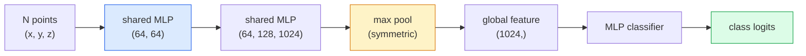

# 3D Vision — Point Clouds & NeRFs

> الرؤية ثلاثية الأبعاد تأتي بنكهتين. السحب النقطية هي المخرجات الأولية للمستشعر. NeRFs هو المجال الحجمي المستفادة. كلاهما يجيب "ما هو المكان في الفضاء".

** النوع: ** تعلم + بناء
** اللغات: ** بايثون
**المتطلبات الأساسية:** المرحلة الرابعة الدرس 03 (CNN)، المرحلة الأولى الدرس 12 (عمليات الموتر)
**الوقت:** ~45 دقيقة

## Learning Objectives

- التمييز بين التمثيلات ثلاثية الأبعاد الصريحة (سحابة النقطة، والشبكة، والفوكسل) والضمنية (مجال المسافة الموقعة، NeRF) ومتى يتم استخدام كل منها
- فهم خدعة الوظيفة المتماثلة لـ PointNet والتي make عبارة عن تقليب شبكة عصبية ثابت على مجموعة غير مرتبة من النقاط
- تتبع تمرير NeRF للأمام: صب الشعاع، العرض الحجمي، التشفير الموضعي، MLP الكثافة + رأس اللون
- استخدم `nerfstudio` أو `instant-ngp` لإعادة البناء ثلاثي الأبعاد المُدرب مسبقًا من مجموعة صغيرة من الصور الموضحة

## The Problem

تنتج الكاميرا صورة ثنائية الأبعاد. ينتج LIDAR مجموعة من النقاط ثلاثية الأبعاد بدون ترتيب. يُنتج الخط الهيكلي من الحركة pipeline سحابة متفرقة من نقاط المفاتيح ثلاثية الأبعاد. يقوم NeRF بإعادة بناء مشهد ثلاثي الأبعاد بالكامل من مجموعة من الصور الموضحة. كل هذه "رؤية" ولكن لا يبدو أي منها مثل الموتر الكثيف الذي يريده CNN.

الرؤية ثلاثية الأبعاد مهمة لأن كل مهمة روبوت عالية القيمة تقريبًا تعمل بتقنية ثلاثية الأبعاد: الإمساك، وتجنب العوائق، والملاحة، والإغلاق AR، والتقاط المحتوى ثلاثي الأبعاد. مهندس الرؤية الذي يفهم فقط الصور ثنائية الأبعاد يتم استبعاده من الشريحة الأسرع نموًا في المجال (AR/VR المحتوى، والروبوتات، ومكدسات القيادة المستقلة، وإعادة الإعمار ثلاثي الأبعاد القائم على NeRF للعقارات أو البناء).

التمثيلان يهيمنان لأسباب مختلفة. السحب النقطية هي ما توفره لك المستشعرات مجانًا. إن NeRFs وخلفائها (3D Gaussian splatting، SDFs العصبية) هي ما تحصل عليه عندما تطلب من شبكة عصبية أن تتعلم مشهدًا ما.

## The Concept

### Point clouds

السحابة النقطية عبارة عن مجموعة غير مرتبة من نقاط N في R^3، ولكل منها ميزات اختيارية (لون، كثافة، عادية).

```
cloud = [
  (x1, y1, z1, r1, g1, b1),
  (x2, y2, z2, r2, g2, b2),
  ...
  (xN, yN, zN, rN, gN, bN),
]
```

لا شبكة، لا اتصال. خاصيتان make هذا صعبان للشبكات العصبية:

- **ثبات التقليب** — يجب ألا يعتمد الناتج على ترتيب النقاط.
- **المتغير N** — يجب أن يتعامل النموذج الواحد مع السحب ذات الأحجام المختلفة.

حلت PointNet (Qi et al., 2017) كلا الأمرين بفكرة واحدة: تطبيق MLP مشترك على كل نقطة، ثم تجميعها باستخدام دالة متماثلة (التجمع الأقصى). والنتيجة هي متجه ذو حجم ثابت لا يعتمد على الترتيب.

```
f(P) = max_{p in P} MLP(p)
```

هذا هو جوهر PointNet بأكمله. تضيف المتغيرات الأعمق (PointNet++، Point Transformer) أخذ العينات الهرمية والتجميع المحلي ولكن خدعة الوظيفة المتماثلة لم تتغير.

### The PointNet architecture



"مشترك MLP" يعني نفس MLP يعمل على كل نقطة بشكل مستقل. تم تنفيذه كتحويل 1×1 عبر البعد النقطي لتحقيق الكفاءة.

### Neural Radiance Fields (NeRFs)

طرحت NeRFs (Mildenhall et al., 2020) السؤال "هل يمكننا إعادة بناء مشهد ثلاثي الأبعاد من صور N؟" وأجاب مع الشبكة العصبية التي هي المشهد. تقوم الشبكة بتعيين `(x, y, z, viewing_direction)` إلى `(density, colour)`. تقديم عرض جديد هو عبارة عن حلقة صب شعاع عبر هذه الشبكة.

```
NeRF MLP:  (x, y, z, theta, phi) -> (sigma, r, g, b)

To render a pixel (u, v) of a new view:
  1. Cast a ray from the camera through pixel (u, v)
  2. Sample points along the ray at distances t_1, t_2, ..., t_N
  3. Query the MLP at each point
  4. Composite the colours weighted by (1 - exp(-sigma * dt))
  5. The sum is the rendered pixel colour
```

تقارن الخسارة البكسل المعروض ببكسل الحقيقة الأرضية في صور التدريب. يقوم الدعم الخلفي من خلال خطوة العرض بتحديث MLP. لا توجد حقيقة أرضية ثلاثية الأبعاد، ولا توجد هندسة واضحة — يتم تخزين المشهد في أوزان MLP.

### Positional encoding in NeRF

لا يمكن للفانيليا MLP على `(x, y, z)` أن تمثل تفاصيل عالية التردد لأن MLPs منحازة طيفيًا نحو الترددات المنخفضة. يقوم NeRF بإصلاح هذا عن طريق تشفير كل إحداثي في ​​ناقل ميزة فورييه قبل MLP:

```
gamma(p) = (sin(2^0 pi p), cos(2^0 pi p), sin(2^1 pi p), cos(2^1 pi p), ...)
```

ما يصل إلى L = 10 مستويات التردد. هذه هي نفس الخدعة التي تستخدمها المحولات للمواضع، وتظهر مرة أخرى في تكييف زمن الانتشار (الدرس 10). بدونها، تبدو NeRFs ضبابية.

### Volumetric rendering

```
C(r) = sum_i T_i * (1 - exp(-sigma_i * delta_i)) * c_i

T_i  = exp(- sum_{j<i} sigma_j * delta_j)
delta_i = t_{i+1} - t_i
```

`T_i` هي النفاذية — مقدار الضوء الذي يبقى حتى النقطة i. `(1 - exp(-sigma_i * delta_i))` هو العتامة عند النقطة i. `c_i` هو اللون. البكسل الأخير عبارة عن مجموع مرجح على طول الشعاع.

### What replaced NeRFs

تعد Pure NeRFs بطيئة في التدريب (ساعات) وبطيئة في العرض (ثواني لكل صورة). النسب منذ:

- **Instant-NGP** (2022) — يحل ترميز شبكة التجزئة محل إدخال موضع MLP؛ القطارات في ثوان.
- **Mip-NeRF 360** — يتعامل مع المشاهد غير المحدودة والتنعيم.
- **3D Gaussian Splatting** (2023) - يستبدل المجال الحجمي بملايين من Gaussian 3D؛ يتم القطار في دقائق، ويتم عرضه في الوقت الفعلي. الإنتاج الافتراضي الحالي.

تقريبًا كل منتج NeRF حقيقي في عام 2026 هو في الواقع رش غاوسي ثلاثي الأبعاد. النموذج العقلي لا يزال NeRF.

### Datasets and benchmarks

- **ShapeNet** — تصنيف وتجزئة نماذج CAD ثلاثية الأبعاد كسحب نقطية.
- **ScanNet** — عمليات مسح داخلية حقيقية للتجزئة.
- **KITTI** — سحب خارجية LIDAR للقيادة الذاتية.
- **NeRF الاصطناعية** / **المخلوطة MVS** — مجموعات بيانات الصور المطروحة لتركيب العرض.
- مجموعة بيانات **Mip-NeRF 360** — مشاهد حقيقية لا حدود لها.

## Build It

### Step 1: PointNet classifier

```python
import torch
import torch.nn as nn

class PointNet(nn.Module):
    def __init__(self, num_classes=10):
        super().__init__()
        self.mlp1 = nn.Sequential(
            nn.Conv1d(3, 64, 1),    nn.BatchNorm1d(64),   nn.ReLU(inplace=True),
            nn.Conv1d(64, 64, 1),   nn.BatchNorm1d(64),   nn.ReLU(inplace=True),
        )
        self.mlp2 = nn.Sequential(
            nn.Conv1d(64, 128, 1),  nn.BatchNorm1d(128),  nn.ReLU(inplace=True),
            nn.Conv1d(128, 1024, 1), nn.BatchNorm1d(1024), nn.ReLU(inplace=True),
        )
        self.head = nn.Sequential(
            nn.Linear(1024, 512),   nn.BatchNorm1d(512),  nn.ReLU(inplace=True),
            nn.Dropout(0.3),
            nn.Linear(512, 256),    nn.BatchNorm1d(256),  nn.ReLU(inplace=True),
            nn.Dropout(0.3),
            nn.Linear(256, num_classes),
        )

    def forward(self, x):
        # x: (N, 3, num_points) — transposed for Conv1d
        x = self.mlp1(x)
        x = self.mlp2(x)
        x = torch.max(x, dim=-1)[0]       # (N, 1024)
        return self.head(x)

pts = torch.randn(4, 3, 1024)
net = PointNet(num_classes=10)
print(f"output: {net(pts).shape}")
print(f"params: {sum(p.numel() for p in net.parameters()):,}")
```

حوالي 1.6 مليون معلمة. يعمل على 1024 نقطة لكل سحابة.

### Step 2: Positional encoding

```python
def positional_encoding(x, L=10):
    """
    x: (..., D) -> (..., D * 2 * L)
    """
    freqs = 2.0 ** torch.arange(L, dtype=x.dtype, device=x.device)
    args = x.unsqueeze(-1) * freqs * 3.141592653589793
    sinc = torch.cat([args.sin(), args.cos()], dim=-1)
    return sinc.reshape(*x.shape[:-1], -1)

x = torch.randn(5, 3)
y = positional_encoding(x, L=10)
print(f"input:  {x.shape}")
print(f"encoded: {y.shape}     # (5, 60)")
```

الضرب بـ `2^l * pi` يعطي ترددات أعلى تدريجيًا.

### Step 3: Tiny NeRF MLP

```python
class TinyNeRF(nn.Module):
    def __init__(self, L_pos=10, L_dir=4, hidden=128):
        super().__init__()
        self.L_pos = L_pos
        self.L_dir = L_dir
        pos_dim = 3 * 2 * L_pos
        dir_dim = 3 * 2 * L_dir
        self.trunk = nn.Sequential(
            nn.Linear(pos_dim, hidden), nn.ReLU(inplace=True),
            nn.Linear(hidden, hidden),  nn.ReLU(inplace=True),
            nn.Linear(hidden, hidden),  nn.ReLU(inplace=True),
            nn.Linear(hidden, hidden),  nn.ReLU(inplace=True),
        )
        self.sigma = nn.Linear(hidden, 1)
        self.color = nn.Sequential(
            nn.Linear(hidden + dir_dim, hidden // 2), nn.ReLU(inplace=True),
            nn.Linear(hidden // 2, 3), nn.Sigmoid(),
        )

    def forward(self, x, d):
        x_enc = positional_encoding(x, self.L_pos)
        d_enc = positional_encoding(d, self.L_dir)
        h = self.trunk(x_enc)
        sigma = torch.relu(self.sigma(h)).squeeze(-1)
        rgb = self.color(torch.cat([h, d_enc], dim=-1))
        return sigma, rgb

nerf = TinyNeRF()
x = torch.randn(128, 3)
d = torch.randn(128, 3)
s, c = nerf(x, d)
print(f"sigma: {s.shape}   rgb: {c.shape}")
```

صغير جدًا مقارنةً بـ NeRF الأصلي (الذي يحتوي على صندوقين MLP بعمق 8). يكفي لإظهار الهندسة المعمارية.

### Step 4: Volumetric rendering along a ray

```python
def volumetric_render(sigma, rgb, t_vals):
    """
    sigma: (..., N_samples)
    rgb:   (..., N_samples, 3)
    t_vals: (N_samples,) distances along the ray
    """
    delta = torch.cat([t_vals[1:] - t_vals[:-1], torch.full_like(t_vals[:1], 1e10)])
    alpha = 1.0 - torch.exp(-sigma * delta)
    trans = torch.cumprod(torch.cat([torch.ones_like(alpha[..., :1]), 1.0 - alpha + 1e-10], dim=-1), dim=-1)[..., :-1]
    weights = alpha * trans
    rendered = (weights.unsqueeze(-1) * rgb).sum(dim=-2)
    depth = (weights * t_vals).sum(dim=-1)
    return rendered, depth, weights


N = 64
t_vals = torch.linspace(2.0, 6.0, N)
sigma = torch.rand(N) * 0.5
rgb = torch.rand(N, 3)
rendered, depth, weights = volumetric_render(sigma, rgb, t_vals)
print(f"rendered colour: {rendered.tolist()}")
print(f"depth:           {depth.item():.2f}")
```

شعاع واحد، 64 عينة، مركب إلى RGB بكسل واحد وعمق.

## Use It

للعمل الحقيقي:

- `nerfstudio` (Tancik et al.) — المكتبة المرجعية الحالية لـ NeRF / Instant-NGP / Gaussian Splatting. سطر الأوامر بالإضافة إلى عارض الويب.
- `pytorch3d` (Meta) — عرض قابل للتمييز، وأدوات مساعدة للنقطة السحابية، وعمليات شبكية.
- `open3d` — معالجة النقاط السحابية، والتسجيل، والتصور.

بالنسبة للنشر، حل الرش الغاوسي ثلاثي الأبعاد محل NeRFs النقي إلى حد كبير لأنه يعرض أسرع 100x. جودة إعادة الإعمار قابلة للمقارنة.

## Ship It

ينتج هذا الدرس:

- `outputs/prompt-3d-task-router.md` — موجه يوجه إلى التمثيل ثلاثي الأبعاد الصحيح (نقطة السحابة، الشبكة، voxel، NeRF، Gaussian splat) بناءً على بيانات المهمة والمدخلات.
- `outputs/skill-point-cloud-loader.md` — مهارة تكتب PyTorch `Dataset` لملفات.ply /.pcd /.xyz مع التسوية الصحيحة والتوسيط وأخذ العينات النقطية.

## Exercises

1. **(سهل)** أظهر أن PointNet غير متغير: قم بتشغيل نفس السحابة مرتين، مرة واحدة مع تبديل النقاط. التحقق من أن المخرجات متطابقة مع ضوضاء الفاصلة العائمة.
2. **(متوسط)** تنفيذ الحد الأدنى من وظيفة توليد الشعاع التي، نظرًا لجوهر الكاميرا ووضعيتها، تنتج أصول الشعاع واتجاهاته لكل بكسل في صورة H x W.
3. **(صعب)** قم بتدريب TinyNeRF على مجموعة بيانات تركيبية من العروض المقدمة لمكعب ملون (يتم إنشاؤها عبر عرض قابل للتمييز أو تتبع شعاع بسيط). الإبلاغ عن خسارة العرض في العصر 1 و10 و100. في أي عصر ينتج النموذج طرق عرض يمكن التعرف عليها؟

## Key Terms

| مصطلح | ماذا يقول الناس | ماذا يعني في الواقع |
|------|----------------|----------------------|
| نقطة السحابة | "نقاط ثلاثية الأبعاد من LIDAR" | مجموعة غير مرتبة من (x، y، z) + الميزات الاختيارية لكل نقطة |
| بوينت نت | "أول شبكة عصبية على السحب النقطية" | مشترك MLP لكل نقطة + مجموعة متماثلة (كحد أقصى)؛ التقليب الثابت بالبناء |
| نيرف | "MLP ذاك هو المشهد" | تعيين الشبكة (x، y، z، dir) إلى (الكثافة، اللون)؛ المقدمة بواسطة صب الأشعة |
| الترميز الموضعي | "ميزات فورييه" | قم بتشفير كل إحداثي إلى sin/cos بترددات متعددة للتغلب على MLP انحياز التردد المنخفض |
| التقديم الحجمي | "تكامل الشعاع" | عينات مركبة على طول شعاع في بكسل واحد باستخدام النفاذية وألفا |
| فوري-NGP | "شبكة التجزئة NeRF" | يستبدل إحداثيات NeRF MLP بشبكة تجزئة متعددة الدقة؛ 100-1000x أسرع |
| رش غاوسي ثلاثي الأبعاد | "ملايين الغوسيين" | المشهد = مجموعة من Gaussians ثلاثية الأبعاد؛ يُعرض في الوقت الفعلي، ويتدرب في دقائق |
| SDF | "حقل المسافة الموقعة" | وظيفة إرجاع المسافة الموقعة إلى أقرب سطح؛ تمثيل ضمني آخر |

## Further Reading

- [PointNet (Qi et al., 2017)](https://arxiv.org/abs/1612.00593) — the permutation-invariant classifier
- [NeRF (Mildenhall et al., 2020)](https://arxiv.org/abs/2003.08934) — الورقة التي جعلت إعادة البناء ثلاثي الأبعاد من الصور مشكلة في الشبكة العصبية
- [Instant-NGP (Müller et al., 2022)](https://arxiv.org/abs/2201.05989) — hash grids, 1000x speedup
- [3D Gaussian Splatting (Kerbl et al., 2023)](https://arxiv.org/abs/2308.04079) — الهندسة المعمارية التي حلت محل NeRFs في الإنتاج
