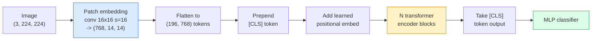

# محولات الرؤية (ViT)
> قم بقص الصورة إلى بقع، وتعامل مع كل رقعة على أنها كلمة، وقم بتشغيل محول قياسي. لا تنظر إلى الوراء.
**النوع:** بناء
** اللغات: ** بايثون
**المتطلبات الأساسية:** المرحلة السابعة الدرس 02 (الانتباه الذاتي)، المرحلة 4 الدرس 04 (تصنيف الصور)
**الوقت:** ~45 دقيقة
## أهداف التعلم
- تنفيذ تضمين التصحيح، والتضمين الموضعي المكتسب، ورمز الفئة، وكتل تشفير المحولات من البداية لبناء الحد الأدنى من ViT
- اشرح لماذا كان يُعتقد أن ViT يحتاج إلى بيانات تدريب مسبق ضخمة حتى أثبت DeiT وMAE خلاف ذلك
- قارن بين ViT وSwin وConvNeXt في سابقاتهم المعمارية (لا شيء، انتباه النافذة المحلية، العمود الفقري للتحويل)
- ضبط ViT المُدرب مسبقًا على مجموعة بيانات صغيرة باستخدام `timm` وصفة المسبار الخطي القياسي/الضبط الدقيق
## المشكلة
لمدة عقد من الزمن، كان الإلتواء مرادفًا للرؤية الحاسوبية. كان لشبكات CNN تحيزات استقرائية قوية - المحلية، وتكافؤ الترجمة - والتي لم يعتقد أحد أنه يمكنك استبدالها. ثم دوسوفيتسكي وآخرون. (2020) أظهر أن المحول العادي المطبق على بقع الصور المسطحة، مع عدم وجود آلات تلافيفية على الإطلاق، يمكن أن يطابق أو يتفوق على أفضل شبكات CNN على نطاق واسع.
وكان المصيد "على نطاق واسع". خسر ViT على ImageNet-1k أمام ResNet. تم تدريب ViT مسبقًا على ImageNet-21k أو JFT-300M ثم تم ضبطه جيدًا على ImageNet-1k. وكان الاستنتاج هو أن المحولات كانت تفتقر إلى مقدمات مفيدة ولكن يمكنها تعلمها من البيانات الكافية. أظهر العمل اللاحق (DeiT، MAE، DINO) أنه مع وصفات التدريب الصحيحة - التعزيز القوي، والتدريب المسبق تحت الإشراف الذاتي، والتقطير - يتدرب ViTs جيدًا على البيانات الصغيرة أيضًا.
بحلول عام 2026، لا تزال شبكات CNN النقية قادرة على المنافسة على الأجهزة المتطورة (ConvNeXt هو الأقوى)، لكن المحولات تهيمن على كل شيء آخر: التجزئة (Mask2Former، SegFormer)، والكشف (DETR، RT-DETR)، والوسائط المتعددة (CLIP، SigLIP)، والفيديو (VideoMAE، VJEPA). هيكل كتلة ViT هو الذي يجب معرفته.
##المفهوم
### السطر pipe


سبع خطوات. التصحيحات -> الرموز المميزة -> الاهتمام -> المصنف. كل متغير (DeiT، Swin، ConvNeXt، MAE تدريب مسبق) يغير واحدًا أو اثنين من السبعة ويترك الباقي بمفرده.
### تضمين التصحيح
التحويل الأول هو السر. حجم النواة 16، والخطوة 16، لذا تصبح الصورة مقاس 224 × 224 شبكة مقاس 14 × 14 مكونة من تصحيحات مقاس 16 × 16، يتم عرض كل منها على تضمين 768 خافتًا. يقوم هذا التحويل الفردي بالتصحيح والمشاريع الخطية.
```
Input:  (3, 224, 224)
Conv (3 -> 768, k=16, s=16, no padding):
Output: (768, 14, 14)
Flatten spatial: (196, 768)
```

196 رقعة = 196 رمزًا. البعد المميز لكل رمز هو 768 (ViT-B)، أو 1024 (ViT-L)، أو 1280 (ViT-H).
### رمز الفئة
متجه واحد متعلم مُلحق بالتسلسل:
```
tokens = [CLS; patch_1; patch_2; ...; patch_196]   shape (197, 768)
```

بعد كتل المحولات N، يكون الإخراج `[CLS]` هو تمثيل الصورة العامة. يقرأ رأس التصنيف هذا المتجه الواحد فقط.
### التضمين الموضعي
المحولات ليس لديها فكرة مدمجة عن الموقع المكاني. أضف متجهًا مكتسبًا إلى كل رمز مميز:
```
tokens = tokens + learned_pos_embedding   (also shape (197, 768))
```

التضمين هو معلمة للنموذج؛ يقوم التدريب القائم على التدرج بتكييفه مع بنية الصورة ثنائية الأبعاد. توجد بدائل جيبية ثنائية الأبعاد ولكن نادرًا ما يتم استخدامها عمليًا.
### كتلة تشفير المحولات
معيار. الاهتمام الذاتي متعدد الرؤوس، MLP، الاتصالات المتبقية، ما قبل الطبقة.
```
x = x + MSA(LN(x))
x = x + MLP(LN(x))

MLP is two-layer with GELU: Linear(d -> 4d) -> GELU -> Linear(4d -> d)
```

يقوم ViT-B/16 بتجميع 12 من هذه الكتل، كل منها يحتوي على 12 رأس انتباه، بإجمالي 86 مليون معلمة.
### لماذا قبل LN
استخدمت المحولات المبكرة ما بعد LN (`x = LN(x + sublayer(x))`) وواجهت صعوبة في التدريب بعد 6-8 طبقات دون إحماء. يقوم Pre-LN (`x = x + sublayer(LN(x))`) بتدريب شبكات أعمق بثبات دون إحماء. يستخدم كل ViT وكل LLM حديث ما قبل LN.
### مقايضة حجم التصحيح
- 16 × 16 تصحيحًا -> 196 رمزًا قياسيًا.
- 32 × 32 تصحيحًا -> 49 رمزًا، دقة أسرع ولكن أقل.
- تصحيحات 8 × 8 -> 784 رمزًا مميزًا، وهي أفضل ولكن مقاييس تكلفة الاهتمام O(n^2) سيئة.
تصحيحات أكبر = عدد أقل من الرموز = تفاصيل مكانية أسرع ولكن أقل. يستخدم SwinV2 تصحيحات 4x4 في النوافذ ذات التسلسل الهرمي.
### وصفة DeiT لتدريب ViT على ImageNet-1k
احتاج ViT الأصلي إلى JFT-300M للتغلب على شبكات CNN. قام DeiT (Touvron et al., 2020) بتدريب ViT-B على الوصول إلى المركز الأول بنسبة 81.8% على ImageNet-1k وحده مع أربعة تغييرات:
1. التكبير الثقيل: RandAugment، Mixup، CutMix، المسح العشوائي.
2. العمق العشوائي (إسقاط كتل كاملة بشكل عشوائي أثناء التدريب).
3. التكبير المتكرر (نفس الصورة 3 مرات لكل دفعة).
4. التقطير من معلم CNN (اختياري، يزيد من الدقة).
كل وصفة تدريب ViT حديثة تنحدر من DeiT.
### سوين مقابل ConvNeXt
- **سوين** (ليو وآخرون، 2021) — الاهتمام القائم على النافذة. تحضر كل كتلة ضمن نافذة محلية؛ تعمل الكتل المتناوبة على تحريك النافذة لخلط المعلومات عبر النوافذ. يعيد مكانًا يشبه CNN سابقًا مع الحفاظ على عامل الانتباه.
- **ConvNeXt** (Liu et al., 2022) - أعيد تصميم CNN ليتوافق مع خيارات بنية Swin (التحويلات العميقة، LayerNorm، GELU، عنق الزجاجة المقلوب). أظهر أن الفجوة ليست "الانتباه مقابل الإلتواء" بل "وصفة التدريب الحديثة + الهندسة المعمارية".
في عام 2026، يعتبر كل من ConvNeXt-V2 وSwin-V2 من فئة الإنتاج؛ يعتمد الاختيار الصحيح على مكدس الاستدلال الخاص بك (يجمع ConvNeXt بشكل أفضل للحافة) ومجموعة التدريب المسبق.
### MAE التدريب المسبق
جهاز التشفير التلقائي المقنع (He et al., 2022): قناع 75% من التصحيحات بشكل عشوائي، وتدريب جهاز التشفير على معالجة 25% المرئية فقط، وتدريب وحدة فك ترميز صغيرة لإعادة بناء التصحيحات المقنعة من مخرجات جهاز التشفير. بعد التدريب المسبق، تخلص من وحدة فك التشفير وقم بضبط جهاز التشفير.
MAE makes ViT قابل للتدريب على ImageNet-1k وحده، ويصل إلى SOTA، وهو الوصفة الافتراضية الحالية الخاضعة للإشراف الذاتي.
## بنائها
### الخطوة 1: تضمين التصحيح
```python
import torch
import torch.nn as nn

class PatchEmbedding(nn.Module):
    def __init__(self, in_channels=3, patch_size=16, dim=192, image_size=64):
        super().__init__()
        assert image_size % patch_size == 0
        self.proj = nn.Conv2d(in_channels, dim, kernel_size=patch_size, stride=patch_size)
        num_patches = (image_size // patch_size) ** 2
        self.num_patches = num_patches

    def forward(self, x):
        x = self.proj(x)
        return x.flatten(2).transpose(1, 2)
```

تحويل واحد، وتسوية واحدة، وتبديل واحد. هذه هي خطوة تحويل الصورة إلى الرموز بأكملها.
### الخطوة 2: كتلة المحولات
ما قبل LN، الاهتمام الذاتي متعدد الرؤوس، MLP مع GELU، الاتصالات المتبقية.
```python
class Block(nn.Module):
    def __init__(self, dim, num_heads, mlp_ratio=4, dropout=0.0):
        super().__init__()
        self.ln1 = nn.LayerNorm(dim)
        self.attn = nn.MultiheadAttention(dim, num_heads, dropout=dropout, batch_first=True)
        self.ln2 = nn.LayerNorm(dim)
        self.mlp = nn.Sequential(
            nn.Linear(dim, dim * mlp_ratio),
            nn.GELU(),
            nn.Dropout(dropout),
            nn.Linear(dim * mlp_ratio, dim),
            nn.Dropout(dropout),
        )

    def forward(self, x):
        a, _ = self.attn(self.ln1(x), self.ln1(x), self.ln1(x), need_weights=False)
        x = x + a
        x = x + self.mlp(self.ln2(x))
        return x
```

يعالج `nn.MultiheadAttention` التقسيم إلى رؤوس، والمنتج النقطي المقيس، وإسقاط الإخراج. `batch_first=True` إذن الأشكال هي `(N, seq, dim)`.
### الخطوة 3: فيتامين
```python
class ViT(nn.Module):
    def __init__(self, image_size=64, patch_size=16, in_channels=3,
                 num_classes=10, dim=192, depth=6, num_heads=3, mlp_ratio=4):
        super().__init__()
        self.patch = PatchEmbedding(in_channels, patch_size, dim, image_size)
        num_patches = self.patch.num_patches
        self.cls_token = nn.Parameter(torch.zeros(1, 1, dim))
        self.pos_embed = nn.Parameter(torch.zeros(1, num_patches + 1, dim))
        self.blocks = nn.ModuleList([
            Block(dim, num_heads, mlp_ratio) for _ in range(depth)
        ])
        self.ln = nn.LayerNorm(dim)
        self.head = nn.Linear(dim, num_classes)
        nn.init.trunc_normal_(self.pos_embed, std=0.02)
        nn.init.trunc_normal_(self.cls_token, std=0.02)

    def forward(self, x):
        x = self.patch(x)
        cls = self.cls_token.expand(x.size(0), -1, -1)
        x = torch.cat([cls, x], dim=1)
        x = x + self.pos_embed
        for blk in self.blocks:
            x = blk(x)
        x = self.ln(x[:, 0])
        return self.head(x)

vit = ViT(image_size=64, patch_size=16, num_classes=10, dim=192, depth=6, num_heads=3)
x = torch.randn(2, 3, 64, 64)
print(f"output: {vit(x).shape}")
print(f"params: {sum(p.numel() for p in vit.parameters()):,}")
```

حوالي 2.8 مليون معلمة — وهو ViT صغير يمكن تتبعه في CPU. الحقيقي ViT-B هو 86M؛ نفس تعريف الفئة مع `dim=768, depth=12, num_heads=12`.
### الخطوة 4: التحقق من السلامة - استنتاج صورة واحدة
```python
logits = vit(torch.randn(1, 3, 64, 64))
print(f"logits: {logits}")
print(f"probs:  {logits.softmax(-1)}")
```

يجب أن تعمل دون خطأ. مجموع الاحتمالات هو 1.
## استخدمه
`timm` يشحن كل متغير ViT مع أوزان ImageNet المدربة مسبقًا. سطر واحد:
```python
import timm

model = timm.create_model("vit_base_patch16_224", pretrained=True, num_classes=10)
```

`timm` هو الإعداد الافتراضي للإنتاج لمحولات الرؤية في عام 2026. ويدعم ViT وDeiT وSwin وSwin-V2 وConvNeXt وConvNeXt-V2 وMaxViT وMViT وEfficientFormer وعشرات الآخرين تحت نفس API.
بالنسبة للعمل متعدد الوسائط (صورة + نص)، `transformers` السفن CLIP، SigLIP، BLIP-2، LLaVA. برنامج تشفير الصور في كل هذه العناصر هو متغير ViT.
## اشحنها
ينتج هذا الدرس:
- `outputs/prompt-vit-vs-cnn-picker.md` — موجه يختار بين ViT أو ConvNeXt أو Swin بناءً على حجم مجموعة البيانات والحوسبة ومكدس الاستدلال.
- `outputs/skill-vit-patch-and-pos-embed-inspector.md` — مهارة تتحقق من مطابقة أشكال التضمين الموضعي والتضمين التصحيحي لـ ViT مع طول التسلسل المتوقع للنموذج، مما يؤدي إلى اكتشاف أخطاء النقل الأكثر شيوعًا.
## تمارين
1. **(سهل)** اطبع أشكال كل موتر متوسط ​​لتمرير للأمام عبر ViT الصغير أعلاه. قم بالتأكيد: الإدخال `(N, 3, 64, 64)` -> التصحيحات `(N, 16, 192)` -> مع CLS `(N, 17, 192)` -> إدخال المصنف `(N, 192)` -> الإخراج `(N, num_classes)`.
2. **(متوسط)** قم بضبط `timm` ViT-S/16 الذي تم تدريبه مسبقًا على مجموعة البيانات الاصطناعية CIFAR من الدرس 4. قارن مع الضبط الدقيق ResNet-18 على نفس البيانات. الإبلاغ عن وقت التدريب والدقة النهائية.
3. **(صعب)** تنفيذ التدريب المسبق MAE لـ ViT الصغير: قناع 75% من التصحيحات، وتدريب جهاز التشفير + وحدة فك ترميز صغيرة لإعادة بناء التصحيحات المقنعة. تقييم دقة المسبار الخطي على البيانات الاصطناعية قبل وبعد التدريب المسبق.
## المصطلحات الرئيسية
| مصطلح | ماذا يقول الناس | ماذا يعني في الواقع |
|------|----------------|----------------------|
| تضمين التصحيح | "التحويل الأول" | تحويل بحجم النواة = الخطوة = حجم التصحيح؛ يحول الصورة إلى شبكة من التضمينات الرمزية |
| رمز الفئة | "[CLS]" | المتجه المكتسب المُسبق لتسلسل الرمز المميز؛ الناتج النهائي هو تمثيل الصورة العالمية |
| التضمين الموضعي | "تعلمت نقاط البيع" | يتم إضافة ناقل تم تعلمه إلى كل رمز حتى يعرف المحول من أين جاء كل تصحيح |
| ما قبل LN | "LayerNorm قبل الطبقة الفرعية" | متغير المحول المستقر: `x + sublayer(LN(x))` بدلاً من `LN(x + sublayer(x))` |
| اهتمام متعدد الرؤوس | "الاهتمام الموازي" | يتم تقسيم انتباه المحول القياسي إلى مساحات فرعية مستقلة num_heads، متسلسلة بعد ذلك |
| فيت-ب/16 | "القاعدة، التصحيح 16" | الحجم القانوني: خافت = 768، العمق = 12، الرؤوس = 12، حجم التصحيح = 16، الصورة = 224؛ ~86 مليون معلمة |
| ديت | "ViT الموفر للبيانات" | تم تدريب ViT على ImageNet-1k وحده مع تعزيز قوي؛ مجموعات البيانات الكبيرة التي تم إثباتها قبل التدريب ليست مطلوبة بشكل صارم |
| __المصطلح_2__ | "جهاز التشفير التلقائي المقنع" | التدريب المسبق تحت الإشراف الذاتي: قناع 75% من الرقع، وإعادة بنائها؛ وصفة التدريب المسبق لـ ViT المهيمنة |
## مزيد من القراءة
- [An Image is Worth 16x16 Words (Dosovitskiy et al., 2020)](https://arxiv.org/abs/2010.11929) — ورقة ViT
- [DeiT: Data-efficient Image Transformers (Touvron et al., 2020)](https://arxiv.org/abs/2012.12877) — كيفية تدريب ViT على ImageNet-1k وحده
- [Masked Autoencoders are Scalable Vision Learners (He et al., 2022)](https://arxiv.org/abs/2111.06377) — MAE التدريب المسبق
- [timm documentation](https://huggingface.co/docs/timm) — المرجع لكل محول رؤية ستستخدمه في الإنتاج