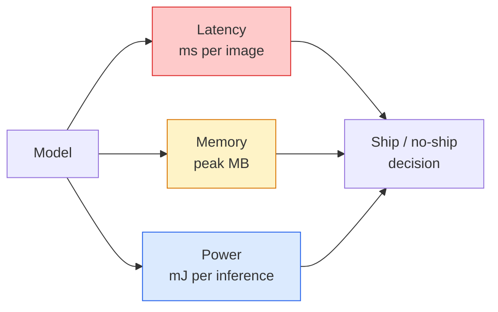

# الرؤية في الوقت الحقيقي — النشر على الحافة
> استنتاج الحافة هو نظام الحصول على نموذج بدقة 90 ليتم تشغيله بمعدل 30 إطارًا في الثانية على جهاز به 2 GB من RAM. يتم تداول كل نقطة مئوية من الدقة مقابل ميلي ثانية من الكمون.
** النوع: ** تعلم + بناء
** اللغات: ** بايثون
**المتطلبات الأساسية:** المرحلة الرابعة الدرس 04 (تصنيف الصور)، المرحلة 10 الدرس 11 (التكميم)
**الوقت:** ~75 دقيقة
## أهداف التعلم
- قياس زمن الوصول الاستدلالي، وذروة الذاكرة، والإنتاجية لأي نموذج PyTorch، وقراءة مفاضلة FLOPs / Params / زمن الاستجابة
- قياس نموذج الرؤية إلى INT8 باستخدام تقدير ما بعد التدريب الخاص بـ PyTorch والتحقق من فقدان الدقة < 1%
- التصدير إلى ONNX والتجميع باستخدام ONNX Runtime أو TensorRT؛ قم بتسمية حالات فشل التصدير الثلاثة الأكثر شيوعًا وإصلاحاتها
- اشرح متى يتم اختيار MobileNetV3 أو EfficientNet-Lite أو ConvNeXt-Tiny أو MobileViT لقيود الحافة
## المشكلة
نموذج رؤية وقت التدريب هو وحش النقطة العائمة. 100 مليون معلمة، 10 GFLOPs لكل تمريرة أمامية، 2 GB من VRAM. لا شيء من هذا يناسب الهاتف أو وحدة المعلومات والترفيه في السيارة أو الكاميرا الصناعية أو الطائرة بدون طيار. إن شحن نظام الرؤية يعني ملاءمة نفس التوقعات في ميزانية أصغر بمقدار 100 مرة.
تقوم ثلاثة مقابض بمعظم العمل: اختيار النموذج (بنية أصغر بنفس الوصفة)، والتكميم (INT8 بدلاً من FP32)، ووقت تشغيل الاستدلال (ONNX Runtime، TensorRT، Core ML، TFLite). إن الحصول عليها بشكل صحيح هو الفرق بين العرض التوضيحي الذي يتم تشغيله على محطة عمل والمنتج الذي يتم شحنه على وحدة كاميرا بقيمة 30 دولارًا.
يقوم هذا الدرس بإعداد نظام القياس أولاً (لا يمكنك تحسين ما لا يمكنك قياسه)، ثم يمشي على المقابض الثلاثة. الهدف ليس معرفة كل وقت تشغيل على الحافة، بل معرفة الرافعات الموجودة وكيفية التحقق من أن كل واحدة منها تفعل ما تعتقده.
##المفهوم
### الميزانيات الثلاث


- **زمن الوصول**: ص50، ص95، ص99. يؤدي متوسط ​​p50 فقط إلى إخفاء سلوك الذيل الذي يهم أنظمة الوقت الفعلي.
- **ذاكرة الذروة**: الحد الأقصى الذي يراه الجهاز على الإطلاق، وليس متوسط ​​الحالة المستقرة. مهم لأن OOMs قاتلة على الأهداف المضمنة.
- **الطاقة / الطاقة**: مللي جول لكل استنتاج على جهاز يعمل بالبطارية. غالبًا ما يتم تمثيله بواسطة CPU/GPU الاستخدام * الوقت.
جدول (النموذج، زمن الوصول، الذاكرة، الدقة) هو ما يتم اتخاذ القرار النهائي منه. يتم قياس كل خلية على الجهاز المستهدف، وليس على محطة العمل.
### انضباط القياس
ثلاث قواعد يجب أن يتبعها كل ملف تعريف حافة:
1. **إحماء** النموذج بتمريرات وهمية للأمام من 5 إلى 10 قبل القياس. تنتج ذاكرات التخزين المؤقت الباردة والتجميع JIT أرقامًا أولية غير تمثيلية.
2. **مزامنة** GPU أعباء العمل مع `torch.cuda.synchronize()` قبل وبعد الكتلة الموقوتة. بدون هذا يمكنك قياس إرسال النواة، وليس تنفيذ النواة.
3. **إصلاح أحجام الإدخال** لدقة الإنتاج. زمن الوصول على 224x224 ليس زمن الوصول على 512x512.
### FLOPs كوكيل
تعد FLOPs (عمليات الفاصلة العائمة لكل استدلال) بمثابة وكيل رخيص الثمن ومستقل عن الجهاز لوقت الاستجابة. مفيدة للمقارنة المعمارية، ومضللة كساعة حائط مطلقة. يمكن للنموذج الذي يحتوي على 10% من FLOPs أن يكون أسرع مرتين في الممارسة العملية لأنه يستخدم عمليات صديقة للأجهزة (يتم تجميع التحويلات العميقة بشكل جيد، بينما لا يتم تجميع التحويلات الكبيرة 7 × 7).
القاعدة: استخدم FLOPs للبحث في البنية، واستخدم زمن الاستجابة على الجهاز لاتخاذ قرارات النشر.
### التكمية في فقرة واحدة
استبدل FP32 الأوزان والتنشيطات بـ INT8. ينخفض ​​حجم النموذج 4x، وينخفض ​​عرض النطاق الترددي للذاكرة 4x، وينخفض ​​الحوسبة 2-4x على الأجهزة التي تحتوي على INT8 نواة (كل شريحة SoC متنقلة حديثة، كل NVIDIA GPU مع Tensor Cores). عادةً ما يكون فقدان الدقة في مهام الرؤية 0.1-1 نقطة مئوية مع القياس الكمي الثابت بعد التدريب.
الأنواع:
- **ديناميكية** — قم بقياس الأوزان إلى INT8، عمليات التنشيط المحسوبة في FP. تسريع بسيط وسهل.
- **ثابت (بعد التدريب)** — قياس الأوزان + معايرة نطاقات التنشيط على مجموعة معايرة صغيرة. أسرع بكثير من الديناميكية.
- **التدريب المدرك للقياس الكمي (QAT)** — محاكاة القياس الكمي أثناء التدريب حتى يتعلم النموذج حوله. أفضل دقة، يحتاج إلى بيانات مصنفة.
بالنسبة للرؤية، يعطي القياس الكمي الثابت بعد التدريب 95% من الفائدة مع 5% من الجهد. استخدم QAT فقط عندما يكون فقدان الدقة من PTQ غير مقبول.
### التقليم والتقطير
- **التقليم** — إزالة الأوزان غير المهمة (حسب الحجم) أو القنوات (المهيكلة). يعمل بشكل جيد على النماذج ذات المعلمات الزائدة؛ أقل فائدة في البنى المدمجة بالفعل.
- **التقطير** — تدريب طالب صغير على تقليد مصطلحات المعلم الكبير. غالبًا ما يستعيد معظم الدقة المفقودة عن طريق تقليص النموذج. معيار لنماذج حافة الإنتاج.
### أوقات تشغيل الاستدلال
- **PyTorch حريص** — بطيء، وليس للنشر. استخدم للتطوير فقط.
- **TorchScript** — تراث. تم استبداله بـ `torch.compile` وONNX تصدير.
- **ONNX وقت التشغيل** — وقت التشغيل المحايد. CPU، CUDA، CoreML، TensorRT، OpenVINO جميعها لديها موفري ONNX. ابدأ هنا.
- **TensorRT** — مترجم NVIDIA. أفضل زمن وصول على وحدات معالجة الرسومات NVIDIA (محطة العمل وJetson). يتكامل مع ONNX وقت التشغيل أو مستقل.
- **الأساسي ML** — وقت تشغيل Apple لنظامي التشغيل iOS/macOS. يحتاج إلى `.mlmodel` أو `.mlpackage`.
- **TFLite** — وقت تشغيل Google لنظام التشغيل Android/ARM. يحتاج `.tflite`.
- **OpenVINO** — وقت تشغيل Intel لـ CPU/VPU. يحتاج إلى `.xml` + `.bin`.
عمليًا: قم بالتصدير PyTorch -> ONNX -> اختر وقت التشغيل للهدف. ONNX هي اللغة المشتركة.
### منتقي هندسة الحافة
| الميزانية | نموذج | لماذا |
|--------|-------|-----|
| <3M معلمات | MobileNetV3-Small | يجمع في كل مكان، خط أساس جيد |
| 3-10 م | EfficientNet-Lite-B0 | أفضل دقة لكل معلمة على TFLite |
| 10-20 م | كونفينيكست-صغيرة | أفضل دقة لكل معلمة، CPU-صديقة |
| 20-30 م | MobileViT-S أو EfficientViT | محول بدقة ImageNet |
| 30-80 م | سوين-V2-صغير | إذا كان المكدس يدعم انتباه النافذة |
قم بقياس كل هذه الأمور إلى INT8 ما لم يكن لديك سبب محدد لعدم القيام بذلك.
## بنائها
### الخطوة 1: قياس زمن الوصول بشكل صحيح
```python
import time
import torch

def measure_latency(model, input_shape, device="cpu", warmup=10, iters=50):
    model = model.to(device).eval()
    x = torch.randn(input_shape, device=device)
    with torch.no_grad():
        for _ in range(warmup):
            model(x)
        if device == "cuda":
            torch.cuda.synchronize()
        times = []
        for _ in range(iters):
            if device == "cuda":
                torch.cuda.synchronize()
            t0 = time.perf_counter()
            model(x)
            if device == "cuda":
                torch.cuda.synchronize()
            times.append((time.perf_counter() - t0) * 1000)
    times.sort()
    return {
        "p50_ms": times[len(times) // 2],
        "p95_ms": times[int(len(times) * 0.95)],
        "p99_ms": times[int(len(times) * 0.99)],
        "mean_ms": sum(times) / len(times),
    }
```

الاحماء، المزامنة، استخدم `time.perf_counter()`. تقرير النسب المئوية، وليس مجرد يعني.
### الخطوة 2: المعلمة وأعداد FLOP
```python
def parameter_count(model):
    return sum(p.numel() for p in model.parameters())

def flops_estimate(model, input_shape):
    """
    Rough FLOP count for a conv/linear-only model. For production use `fvcore` or `ptflops`.
    """
    total = 0
    def conv_hook(m, inp, out):
        nonlocal total
        c_out, c_in, kh, kw = m.weight.shape
        h, w = out.shape[-2:]
        total += 2 * c_in * c_out * kh * kw * h * w
    def linear_hook(m, inp, out):
        nonlocal total
        total += 2 * m.in_features * m.out_features
    hooks = []
    for m in model.modules():
        if isinstance(m, torch.nn.Conv2d):
            hooks.append(m.register_forward_hook(conv_hook))
        elif isinstance(m, torch.nn.Linear):
            hooks.append(m.register_forward_hook(linear_hook))
    model.eval()
    with torch.no_grad():
        model(torch.randn(input_shape))
    for h in hooks:
        h.remove()
    return total
```

بالنسبة للمشاريع الحقيقية، استخدم `fvcore.nn.FlopCountAnalysis` أو `ptflops`؛ يتعاملون مع كل نوع وحدة بشكل صحيح.
### الخطوة 3: القياس الكمي الثابت بعد التدريب
```python
def quantise_ptq(model, calibration_loader, backend="x86"):
    import torch.ao.quantization as tq
    model = model.eval().cpu()
    model.qconfig = tq.get_default_qconfig(backend)
    tq.prepare(model, inplace=True)
    with torch.no_grad():
        for x, _ in calibration_loader:
            model(x)
    tq.convert(model, inplace=True)
    return model
```

ثلاث خطوات: التكوين، والإعداد (إدراج المراقبين)، والمعايرة باستخدام البيانات الحقيقية، والتحويل (الصمام + القياس الكمي). يتطلب دمج النموذج (`Conv -> BN -> ReLU` -> `ConvBnReLU`)، والذي يعالجه `torch.ao.quantization.fuse_modules`.
### الخطوة 4: التصدير إلى ONNX
```python
def export_onnx(model, sample_input, path="model.onnx"):
    model = model.eval()
    torch.onnx.export(
        model,
        sample_input,
        path,
        input_names=["input"],
        output_names=["output"],
        dynamic_axes={"input": {0: "batch"}, "output": {0: "batch"}},
        opset_version=17,
    )
    return path
```

`opset_version=17` هو الإعداد الافتراضي الآمن في عام 2026. يتيح لك `dynamic_axes` تشغيل نموذج ONNX بحجم دفعة عشوائي.
### الخطوة 5: قياس الأنظمة ومقارنتها
```python
import torch.nn as nn
from torchvision.models import mobilenet_v3_small

def compare_regimes():
    model = mobilenet_v3_small(weights=None, num_classes=10)
    params = parameter_count(model)
    flops = flops_estimate(model, (1, 3, 224, 224))
    lat_fp32 = measure_latency(model, (1, 3, 224, 224), device="cpu")
    print(f"FP32 MobileNetV3-Small: {params:,} params  {flops/1e9:.2f} GFLOPs  "
          f"p50={lat_fp32['p50_ms']:.2f}ms  p95={lat_fp32['p95_ms']:.2f}ms")
```

قم بتشغيل نفس الوظيفة لـ `resnet50`، `efficientnet_v2_s`، و`convnext_tiny` وسيكون لديك جدول المقارنة الذي تحتاجه لاتخاذ قرار النشر.
## استخدمه
تتقارب مجموعات الإنتاج على أحد المسارات الثلاثة:
- **الويب / بدون خادم**: PyTorch -> ONNX -> ONNX وقت التشغيل (موفر CPU أو CUDA). الأسهل، جيد بما فيه الكفاية لمعظم الناس.
- **NVIDIA edge (Jetson، GPU الخادم)**: PyTorch -> ONNX -> TensorRT. أفضل زمن الوصول، وأكبر جهد هندسي.
- **الجوال**: PyTorch -> ONNX -> Core ML (iOS) أو TFLite (Android). الكميات قبل التصدير.
للقياس، `torch-tb-profiler`، `nvprof` / `nsys`، والأدوات الموجودة على نظام التشغيل macOS تقدم تفاصيل طبقة تلو الأخرى. `benchmark_app` (OpenVINO) و `trtexec` (TensorRT) يعطيان أرقام CLI مستقلة.
## اشحنها
ينتج هذا الدرس:
- `outputs/prompt-edge-deployment-planner.md` — موجه يختار العمود الفقري واستراتيجية القياس الكمي ووقت التشغيل بالنظر إلى الجهاز المستهدف ووقت الاستجابة SLA.
- `outputs/skill-latency-profiler.md` — مهارة تكتب نصًا برمجيًا كاملاً لقياس زمن الاستجابة مع التهيئة والمزامنة والنسب المئوية وتتبع الذاكرة.
## تمارين
1. **(سهل)** قياس زمن الوصول p50 لـ `resnet18`، `mobilenet_v3_small`، `efficientnet_v2_s`، و`convnext_tiny` عند 224x224 في CPU. قم بإعداد الجدول وحدد البنية التي تتمتع بأفضل دقة لكل مللي ثانية.
2. **(متوسط)** قم بتطبيق القياس الكمي الثابت بعد التدريب على `mobilenet_v3_small`. قم بالإبلاغ عن FP32 مقابل INT8 زمن الاستجابة وفقدان الدقة في مجموعة فرعية محتجزة من CIFAR-10 أو ما شابه ذلك.
3. **(صعب)** قم بتصدير `convnext_tiny` إلى ONNX، وتشغيله من خلال `onnxruntime` مع `CPUExecutionProvider`، ​​ومقارنة زمن الاستجابة بخط الأساس المتحمس PyTorch. حدد الطبقة الأولى حيث يكون وقت التشغيل ONNX أسرع واشرح السبب.
## المصطلحات الرئيسية
| مصطلح | ماذا يقول الناس | ماذا يعني في الواقع |
|------|----------------|----------------------|
| الكمون | "ما مدى السرعة" | الوقت من الإدخال إلى الإخراج؛ النسب المئوية p50/p95/p99، لا تعني |
| يتخبط | "حجم النموذج" | عمليات النقطة العائمة لكل تمريرة أمامية؛ وكيل تقريبي لحساب التكلفة |
| INT8 التكميم | "8 بت" | استبدل FP32 الأوزان/التنشيطات بأعداد صحيحة مكونة من 8 بت؛ ~4x أصغر، 2-4x أسرع |
| __المصطلح_3__ | "التكميم بعد التدريب" | تحديد حجم النموذج المُدرب دون إعادة التدريب؛ سهلة، وعادة ما تكون كافية |
| QAT | "التدريب المدرك للكمية" | محاكاة التكميم أثناء التدريب؛ أفضل دقة، ويتطلب بيانات مصنفة |
| __المصطلح_5__ | "الصيغة المحايدة" | تنسيق تبادل النموذج مدعوم من قبل كل وقت تشغيل الاستدلال السائد |
| تنسوررت | "NVIDIA مترجم" | يجمع ONNX في محرك محسّن لوحدات معالجة الرسوميات NVIDIA |
| التقطير | "المعلم -> الطالب" | تدريب نموذج صغير لتقليد logits للنموذج الكبير؛ يستعيد معظم الدقة المفقودة |
## مزيد من القراءة
- [EfficientNet (Tan & Le, 2019)](https://arxiv.org/abs/1905.11946) — القياس المركب للبنيات الفعالة
- [MobileNetV3 (Howard et al., 2019)](https://arxiv.org/abs/1905.02244) — تصميم الهاتف المحمول الأول مع h-swish وSquee-excite
- [A Practical Guide to TensorRT Optimization (NVIDIA)](https://developer.nvidia.com/blog/accelerating-model-inference-with-tensorrt-tips-and-best-practices-for-pytorch-users/) — كيفية الحصول فعليًا على أرقام الإنتاجية في الورقة
- [ONNX Runtime docs](https://onnxruntime.ai/docs/) — القياس الكمي، وتحسين الرسم البياني، واختيار المزود