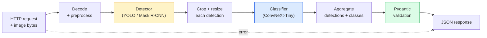

# بناء خط رؤية كامل – كابستون
> نظام رؤية الإنتاج عبارة عن سلسلة من النماذج والقواعد المُدمجة بعقود البيانات. القطع موجودة بالفعل في هذه المرحلة؛ يقوم حجر التتويج بتوصيلهم معًا من طرف إلى طرف.
**النوع:** بناء
** اللغات: ** بايثون
**المتطلبات الأساسية:** دروس المرحلة الرابعة 01-15
**الوقت:** ~120 دقيقة
## أهداف التعلم
- تصميم رؤية إنتاجية pipeline تكتشف الكائنات وتصنفها وتصدر JSON منظمًا - مع معالجة كل مسار فشل
- توصيل الكاشف (Mask R-CNN أو YOLO) والمصنف (ConvNeXt-Tiny) وعقد البيانات (Pydantic) في خدمة واحدة
- قياس الخط من طرف إلى طرف pipeline وتحديد عنق الزجاجة الأول (عادة المعالجة المسبقة، ثم الكاشف)
- شحن الحد الأدنى من خدمة FastAPI التي تقبل تحميل الصور، وتقوم بتشغيل pipeline، وإرجاع الاكتشافات مع التصنيفات
## المشكلة
نماذج الرؤية الفردية مفيدة؛ منتجات الرؤية هي سلاسل منها. إن تدقيق رف البيع بالتجزئة عبارة عن كاشف بالإضافة إلى مصنف المنتج بالإضافة إلى السعر-OCR pipeline. القيادة الذاتية عبارة عن كاشف ثنائي الأبعاد بالإضافة إلى كاشف ثلاثي الأبعاد بالإضافة إلى جهاز القطع بالإضافة إلى جهاز التتبع والمخطط. الفحص الطبي المسبق عبارة عن مجزئ بالإضافة إلى مصنف المنطقة بالإضافة إلى الطبيب UI.
إن توصيل هذه السلاسل هو الجزء الذي يفصل النموذج الأولي ML عن المنتج. تعتبر كل واجهة بين النماذج مكانًا جديدًا للأخطاء. كل تحويل إحداثي، وكل تسوية، وكل تغيير حجم القناع هو مرشح للفشل الصامت. يعتبر الخط pipeline قويًا مثل أضعف واجهاته.
يقوم هذا التتويج بإعداد الحد الأدنى القابل للتطبيق من pipeline: الكشف + التصنيف + الإخراج المنظم + طبقة التقديم. يتم إدراج كل شيء آخر في المرحلة 4 في هذا الهيكل العظمي: قم بتبديل القناع R-CNN بـ YOLOv8، وأضف رأس OCR، وأضف فرع التجزئة، وأضف متعقبًا. الهندسة المعمارية مستقرة. القطع قابلة للتوصيل.
##المفهوم
### السطر pipe


سبع مراحل. المرحلتان النموذجيتان غاليتان الثمن؛ المراحل الخمس الأخرى هي المكان الذي تعيش فيه الحشرات.
### عقود البيانات مع Pydantic
تصبح كل حدود النموذج كائنًا مكتوبًا. وهذا يحول الفشل الصامت إلى فشل صاخب.
```
Detection(
    box: tuple[float, float, float, float],   # (x1, y1, x2, y2), absolute pixels
    score: float,                              # [0, 1]
    class_id: int,                             # from detector's label map
    mask: Optional[list[list[int]]],           # RLE-encoded if present
)

PipelineResult(
    image_id: str,
    detections: list[Detection],
    classifications: list[Classification],
    inference_ms: float,
)
```

عندما يقوم الكاشف بإرجاع الصناديق في `(cx, cy, w, h)` بدلاً من `(x1, y1, x2, y2)`، يفشل التحقق من صحة Pydantic عند الحدود وتكتشف ذلك على الفور بدلاً من تصحيح أخطاء المحصول النهائي الذي يُرجع المناطق الفارغة بصمت.
### أين يذهب زمن الاستجابة
هناك ثلاث حقائق موجودة في كل رؤية تقريبًا pipeline:
1. **المعالجة المسبقة غالبًا ما تكون أكبر كتلة منفردة.** فك تشفير ملفات JPEG، وتحويل مساحات الألوان، وتغيير الحجم - وهي مرتبطة بـ CPU ومن السهل نسيانها.
2. **يسيطر الكاشف على الوقت GPU.** يوجد 70-90% من الوقت GPU في تمرير الكشف الأمامي.
3. **المعالجة اللاحقة (NMS، RLE التشفير/فك التشفير) رخيصة في GPU، ومكلفة في CPU.** الملف الشخصي دائمًا مع الهدف الفعلي.
إن معرفة التوزيع هو ما يحول التحسين إلى قائمة أولويات.
### أوضاع الفشل
- **الاكتشافات الفارغة** — إرجاع القائمة الفارغة، لا تتعطل. سجل.
- **مربعات خارج الحدود** — ثبت حجم الصورة قبل الاقتصاص.
- **المحاصيل الصغيرة** — تخطي التصنيف بالنسبة للمربعات الأصغر من الحد الأدنى لإدخال المصنف.
- **تحميل تالف** — استجابة 400 مع رمز خطأ محدد، وليس 500.
- **فشل تحميل النموذج** — فشل عند بدء تشغيل الخدمة، وليس عند الطلب الأول.
يعالج خط الإنتاج pipeline كلًا من هذه العناصر دون كتابة `try/except` عام يخفي الفشل. يحصل كل فشل على رمز مسمى واستجابة.
### الخلط
تخدم خدمة الإنتاج العديد من العملاء. يؤدي تجميع الاكتشافات والتصنيفات عبر الطلبات إلى مضاعفة الإنتاجية. المقايضة: زمن الوصول الإضافي من انتظار ملء الدفعة. الإعداد النموذجي: جمع الطلبات لمدة تصل إلى 20 مللي ثانية، وتجميعها معًا، ومعالجة، وتوزيع الاستجابات. `torchserve` و `triton` يقومون بذلك محليًا؛ تقوم الخدمات الصغيرة ذات الأحمال المتوقعة بتدوير المجمع الصغير الخاص بها.
## بنائها
### الخطوة 1: عقود البيانات
```python
from pydantic import BaseModel, Field
from typing import List, Optional, Tuple

class Detection(BaseModel):
    box: Tuple[float, float, float, float]
    score: float = Field(ge=0, le=1)
    class_id: int = Field(ge=0)
    mask_rle: Optional[str] = None


class Classification(BaseModel):
    detection_index: int
    class_id: int
    class_name: str
    score: float = Field(ge=0, le=1)


class PipelineResult(BaseModel):
    image_id: str
    detections: List[Detection]
    classifications: List[Classification]
    inference_ms: float
```

خمس ثوانٍ من التعليمات البرمجية توفر ساعة من تصحيح الأخطاء على أي خط pipe خطير.
### الخطوة 2: الحد الأدنى من فئة خط الأنابيب
```python
import time
import numpy as np
import torch
from PIL import Image

class VisionPipeline:
    def __init__(self, detector, classifier, class_names,
                 device="cpu", min_crop=32):
        self.detector = detector.to(device).eval()
        self.classifier = classifier.to(device).eval()
        self.class_names = class_names
        self.device = device
        self.min_crop = min_crop

    def preprocess(self, image):
        """
        image: PIL.Image or np.ndarray (H, W, 3) uint8
        returns: CHW float tensor on device
        """
        if isinstance(image, Image.Image):
            image = np.asarray(image.convert("RGB"))
        tensor = torch.from_numpy(image).permute(2, 0, 1).float() / 255.0
        return tensor.to(self.device)

    @torch.no_grad()
    def detect(self, image_tensor):
        return self.detector([image_tensor])[0]

    @torch.no_grad()
    def classify(self, crops):
        if len(crops) == 0:
            return []
        batch = torch.stack(crops).to(self.device)
        logits = self.classifier(batch)
        probs = logits.softmax(-1)
        scores, cls = probs.max(-1)
        return list(zip(cls.tolist(), scores.tolist()))

    def run(self, image, image_id="anonymous"):
        t0 = time.perf_counter()
        tensor = self.preprocess(image)
        det = self.detect(tensor)

        crops = []
        detections = []
        valid_indices = []
        for i, (box, score, cls) in enumerate(zip(det["boxes"], det["scores"], det["labels"])):
            x1, y1, x2, y2 = [max(0, int(b)) for b in box.tolist()]
            x2 = min(x2, tensor.shape[-1])
            y2 = min(y2, tensor.shape[-2])
            detections.append(Detection(
                box=(x1, y1, x2, y2),
                score=float(score),
                class_id=int(cls),
            ))
            if (x2 - x1) < self.min_crop or (y2 - y1) < self.min_crop:
                continue
            crop = tensor[:, y1:y2, x1:x2]
            crop = torch.nn.functional.interpolate(
                crop.unsqueeze(0),
                size=(224, 224),
                mode="bilinear",
                align_corners=False,
            )[0]
            crops.append(crop)
            valid_indices.append(i)

        class_preds = self.classify(crops)

        classifications = []
        for valid_idx, (cls_id, cls_score) in zip(valid_indices, class_preds):
            classifications.append(Classification(
                detection_index=valid_idx,
                class_id=int(cls_id),
                class_name=self.class_names[cls_id],
                score=float(cls_score),
            ))

        return PipelineResult(
            image_id=image_id,
            detections=detections,
            classifications=classifications,
            inference_ms=(time.perf_counter() - t0) * 1000,
        )
```

تتم كتابة كل واجهة. كل مسار فشل له قرار معالجة محدد.
### الخطوة 3: قم بتوصيل الكاشف والمصنف
```python
from torchvision.models.detection import maskrcnn_resnet50_fpn_v2
from torchvision.models import convnext_tiny

# Use ImageNet-pretrained weights for a realistic pipeline without training
detector = maskrcnn_resnet50_fpn_v2(weights="DEFAULT")
classifier = convnext_tiny(weights="DEFAULT")
class_names = [f"imagenet_class_{i}" for i in range(1000)]

pipe = VisionPipeline(detector, classifier, class_names)

# Smoke test with a synthetic image
test_image = (np.random.rand(400, 600, 3) * 255).astype(np.uint8)
result = pipe.run(test_image, image_id="demo")
print(result.model_dump_json(indent=2)[:500])
```

### الخطوة 4: خدمة FastAPI
```python
from fastapi import FastAPI, UploadFile, HTTPException
from io import BytesIO

app = FastAPI()
pipe = None  # initialised on startup

@app.on_event("startup")
def load():
    global pipe
    detector = maskrcnn_resnet50_fpn_v2(weights="DEFAULT").eval()
    classifier = convnext_tiny(weights="DEFAULT").eval()
    pipe = VisionPipeline(detector, classifier, class_names=[f"c{i}" for i in range(1000)])

@app.post("/detect")
async def detect_endpoint(file: UploadFile):
    if file.content_type not in {"image/jpeg", "image/png", "image/webp"}:
        raise HTTPException(status_code=400, detail="unsupported image type")
    data = await file.read()
    try:
        img = Image.open(BytesIO(data)).convert("RGB")
    except Exception:
        raise HTTPException(status_code=400, detail="cannot decode image")
    result = pipe.run(img, image_id=file.filename or "upload")
    return result.model_dump()
```

تشغيل باستخدام `uvicorn main:app --host 0.0.0.0 --port 8000`. اختبار باستخدام `curl -F 'file=@dog.jpg' http://localhost:8000/detect`.
### الخطوة 5: قياس السطر pipe
```python
import time

def benchmark(pipe, num_runs=20, image_size=(400, 600)):
    img = (np.random.rand(*image_size, 3) * 255).astype(np.uint8)
    pipe.run(img)  # warm up

    stages = {"preprocess": [], "detect": [], "classify": [], "total": []}
    for _ in range(num_runs):
        t0 = time.perf_counter()
        tensor = pipe.preprocess(img)
        t1 = time.perf_counter()
        det = pipe.detect(tensor)
        t2 = time.perf_counter()
        crops = []
        for box in det["boxes"]:
            x1, y1, x2, y2 = [max(0, int(b)) for b in box.tolist()]
            x2 = min(x2, tensor.shape[-1])
            y2 = min(y2, tensor.shape[-2])
            if (x2 - x1) >= pipe.min_crop and (y2 - y1) >= pipe.min_crop:
                crop = tensor[:, y1:y2, x1:x2]
                crop = torch.nn.functional.interpolate(
                    crop.unsqueeze(0), size=(224, 224), mode="bilinear", align_corners=False
                )[0]
                crops.append(crop)
        pipe.classify(crops)
        t3 = time.perf_counter()
        stages["preprocess"].append((t1 - t0) * 1000)
        stages["detect"].append((t2 - t1) * 1000)
        stages["classify"].append((t3 - t2) * 1000)
        stages["total"].append((t3 - t0) * 1000)

    for stage, times in stages.items():
        times.sort()
        print(f"{stage:12s}  p50={times[len(times)//2]:7.1f} ms  p95={times[int(len(times)*0.95)]:7.1f} ms")
```

الإخراج النموذجي في CPU: المعالجة المسبقة ~ 3 مللي ثانية، اكتشاف 300-500 مللي ثانية، تصنيف 20-40 مللي ثانية، إجمالي 350-550 مللي ثانية. في GPU، تبلغ مدة الكشف 20-40 مللي ثانية وتبدأ المعالجة المسبقة + التصنيف في الأهمية أكثر من الناحية النسبية.
## استخدمه
تتقارب قوالب الإنتاج في نفس البنية، بالإضافة إلى:
- **إصدار النموذج** — قم دائمًا بتسجيل اسم النموذج وتجزئة الأوزان في الاستجابة.
- **معرفات التتبع لكل طلب** — قم بتسجيل توقيت كل مرحلة لكل طلب حتى تتمكن من ربط الاستجابات البطيئة بالمراحل.
- **المسار الاحتياطي** — إذا انتهت مهلة المُصنف، قم بإرجاع الاكتشافات بدون تصنيفات بدلاً من فشل الطلب بالكامل.
- **مرشحات الأمان** — NSFW / PII يتم تشغيل المرشحات بعد التصنيف، قبل أن يغادر الرد الخدمة.
- **نقطة نهاية الدفعة** — `/detect_batch` تقبل قائمة عناوين URL للصور للمعالجة المجمعة.
بالنسبة إلى خدمة الإنتاج، تتعامل `torchserve` و`Triton Inference Server` و`BentoML` مع عمليات الدفع والإصدار والمقاييس وفحوصات السلامة خارج الصندوق. يعد تشغيل `FastAPI` مباشرة أمرًا جيدًا للنماذج الأولية والمنتجات صغيرة الحجم.
## اشحنها
ينتج هذا الدرس:
- `outputs/prompt-vision-service-shape-reviewer.md` — مطالبة تقوم بمراجعة كود خدمة الرؤية فيما يتعلق بانتهاكات شكل العقد/الاستجابة وتسمية الخطأ الأول.
- `outputs/skill-pipeline-budget-planner.md` — مهارة تقوم، في ضوء زمن الاستجابة والإنتاجية المستهدفين، بتعيين ميزانية زمنية لكل مرحلة pipeline ووضع علامة على المرحلة التي ستفقد ميزانيتها أولاً.
## تمارين
1. **(سهل)** قم بتشغيل الخط pipe على 10 صور من أي مجموعة بيانات مفتوحة. الإبلاغ عن متوسط ​​الوقت لكل مرحلة وتوزيع أعداد الكشف لكل صورة.
2. **(متوسط)** أضف حقل إخراج قناع إلى `Detection` وقم بترميزه كـ RLE. تأكد من أن JSON يظل أقل من 1 ميجابايت حتى بالنسبة للصورة المكونة من 10 كائنات.
3. **(صعب)** أضف أداة تجميع صغيرة أمام المصنف: اجمع المحاصيل لمدة تصل إلى 10 مللي ثانية، وقم بتصنيفها جميعًا في مكالمة GPU واحدة، وإرجاع النتائج لكل طلب. قم بقياس كسب الإنتاجية عند 5 طلبات متزامنة في الثانية وزمن الوصول المُضاف.
## المصطلحات الرئيسية
| مصطلح | ماذا يقول الناس | ماذا يعني في الواقع |
|------|----------------|----------------------|
| خط أنابيب | "النظام" | سلسلة مرتبة من خطوات المعالجة المسبقة والاستدلال والمعالجة اللاحقة مع واجهة مكتوبة بين كل زوج |
| عقد البيانات | "المخطط" | تعريفات Pydantic/dataclass التي تتوافق معها كل مدخلات ومخرجات المرحلة؛ يلتقط أخطاء التكامل عند الحدود |
| المعالجة المسبقة | "قبل النموذج" | فك التشفير، تحويل الألوان، تغيير الحجم، التطبيع؛ عادةً ما يكون أكبر CPU مصدر للوقت |
| مرحلة ما بعد المعالجة | "بعد النموذج" | NMS، تغيير حجم القناع، العتبة، RLE ترميز؛ رخيصة في GPU، باهظة الثمن في CPU |
| ميكروباتشر | "اجمع ثم قدم" | المجمع الذي ينتظر نافذة ثابتة لطلبات متعددة، يقوم بتشغيل تمرير أمامي مجمع واحد |
| تتبع ID | "معرف الطلب" | يتم تسجيل معرف كل طلب في كل مرحلة بحيث يمكن تتبع الطلبات البطيئة من البداية إلى النهاية |
| رمز الفشل | "خطأ مسمى" | رمز خطأ محدد لكل فئة فشل بدلاً من 500 عام؛ تمكن العميل من منطق إعادة المحاولة |
| فحص الصحة | "مسبار الجاهزية" | نقطة نهاية رخيصة تُبلغ عما إذا كانت الخدمة قادرة على الإجابة؛ يعتمد موازن التحميل على هذا |
## مزيد من القراءة
- [Full Stack Deep Learning — Deploying Models](https://fullstackdeeplearning.com/course/2022/lecture-5-deployment/) — نظرة عامة أساسية على نشر ML الإنتاج
- [BentoML docs](https://docs.bentoml.com) — إطار عمل يتضمن التجميع والإصدار والمقاييس
- [torchserve docs](https://pytorch.org/serve/) — مكتبة الخدمة الرسمية لـ PyTorch
- [NVIDIA Triton Inference Server](https://developer.nvidia.com/triton-inference-server) — تقديم إنتاجية عالية مع دعم التجميع والنماذج المتعددة