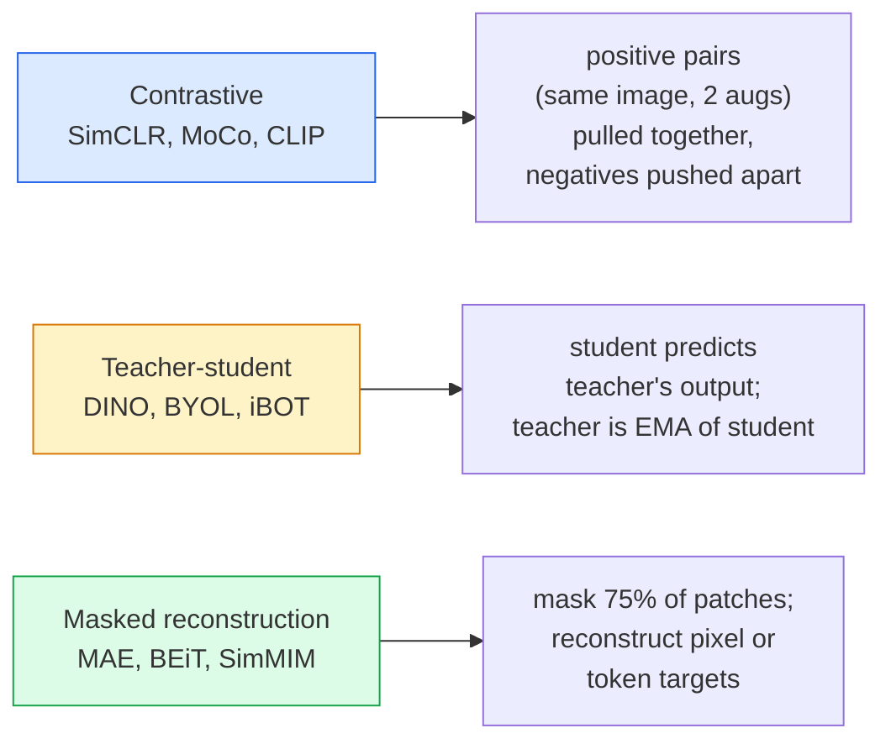

# Self-Supervised Vision — SimCLR, DINO, MAE

> التسميات هي عنق الزجاجة للرؤية الخاضعة للإشراف. يزيلها التدريب المسبق الخاضع للإشراف الذاتي: تعلم الميزات المرئية من 100 مليون صورة غير مصنفة، وقم بضبطها على 10 آلاف صورة مصنفة.

** النوع: ** تعلم + بناء
** اللغات: ** بايثون
**المتطلبات الأساسية:** المرحلة الرابعة الدرس 04 (تصنيف الصور)، المرحلة الرابعة الدرس 14 (ViT)
**الوقت:** ~75 دقيقة

## Learning Objectives

- تتبع العائلات الثلاث الرئيسية الخاضعة للإشراف الذاتي - المتباينة (SimCLR)، والمعلم والطالب (DINO)، وإعادة البناء المقنع (MAE) - واذكر ما تقوم كل واحدة بتحسينه
- تنفيذ خسارة InfoNCE من البداية وشرح سبب نجاح دفعة مكونة من 512 وفشل دفعة مكونة من 32
- اشرح لماذا لا تكون نسبة الإخفاء التي تبلغ 75% لـ MAE اعتباطية وكيف تختلف عن 15% للنص في BERT
- استخدم نقاط فحص DINOv2 أو MAE ImageNet للفحص الخطي واسترجاع اللقطات الصفرية

## The Problem

تحتوي شبكة ImageNet الخاضعة للإشراف على 1.3 مليون صورة مصنفة، والتي تكلف ما يقدر بـ 10 ملايين دولار للتعليق عليها. تعتبر مجموعات البيانات الطبية والصناعية أصغر حجمًا وأكثر تكلفة في تصنيفها. يسأل كل فريق رؤية: هل يمكننا التدريب مسبقًا على البيانات الرخيصة غير المسماة - إطارات YouTube، وعمليات الزحف على الويب، ولقطات كاميرا الويب، وعمليات مسح الأقمار الصناعية - ومن ثم ضبط مجموعة صغيرة تحمل علامات؟

التعلم تحت الإشراف الذاتي هو الحل. يصل جهاز ViT الحديث الخاضع للإشراف الذاتي والذي تم تدريبه على LAION أو JFT إلى دقة ImageNet الخاضعة للإشراف أو يتفوق عليها عند ضبطه بدقة. كما أنه ينتقل بشكل أفضل إلى المهام النهائية (الكشف والتجزئة والعمق) مقارنة بالتدريب المسبق الخاضع للإشراف. DINOv2 (Meta, 2023) وMAE (Meta, 2022) هما إعدادات الإنتاج الافتراضية الحالية لميزات الرؤية القابلة للتحويل.

التحول المفاهيمي هو أن مهمة الذريعة - الشيء الذي تم تدريب النموذج على القيام به - لا يجب أن تكون المهمة النهائية. ما يهم هو أنه يجبر النموذج على تعلم الميزات المفيدة. توقع لون الصور ذات التدرج الرمادي، وقم بتدوير الصور واطلب من النموذج تصنيف التدوير وتصحيحات القناع وإعادة بنائها - لقد نجح كل ذلك. والمناهج الثلاثة التي يتم قياسها هي التعلم المتباين، والتقطير بين المعلم والطالب، وإعادة البناء المقنع.

## The Concept

### Three families



### Contrastive learning (SimCLR)

التقط صورة واحدة، وقم بتطبيق زيادتين عشوائيتين، واحصل على منظرين. قم بتغذية كليهما من خلال نفس جهاز التشفير بالإضافة إلى رأس الإسقاط. قم بتقليل الخسارة التي تقول "يجب أن تكون هاتان التضمينتان قريبتين" و"يجب أن يكون هذا التضمين بعيدًا عن كل عمليات التضمين الخاصة بالصور الأخرى في الدُفعة."

```
Loss for positive pair (z_i, z_j) among 2N views per batch:

   L_ij = -log( exp(sim(z_i, z_j) / tau) / sum_k in batch \ {i} exp(sim(z_i, z_k) / tau) )

sim = cosine similarity
tau = temperature (0.1 standard)
```

هذه هي خسارة InfoNCE. إنه يتطلب العديد من السلبيات لكل إيجابية، لذا فإن حجم الدفعة مهم - يحتاج SimCLR إلى 512-8192. قدمت MoCo قائمة انتظار الزخم للدفعات السابقة لفصل العدد السلبي عن حجم الدُفعة.

### Teacher-student (DINO)

شبكتان لهما نفس البنية: الطالب والمعلم. المعلم عبارة عن متوسط ​​متحرك أسي (EMA) لأوزان الطالب. كلاهما يرى طرق عرض معززة للصورة. يتم تدريب مخرجات الطالب لتتناسب مع مخرجات المعلم - لا توجد سلبيات صريحة.

```
loss = CE( student_output(view_1),  teacher_output(view_2) )
     + CE( student_output(view_2),  teacher_output(view_1) )

teacher_weights = m * teacher_weights + (1 - m) * student_weights   (m ≈ 0.996)
```

لماذا لا ينهار "للتنبؤ بثابت": يتم توسيط مخرجات المعلم (طرح متوسط ​​لكل بُعد) وشحذها (القسمة على درجة حرارة صغيرة). التوسيط يمنع بُعدًا واحدًا من السيطرة؛ شحذ يمنع انهيار الإخراج إلى موحدة.

DINO هو ما يقوم DINOv2 بتوسيع نطاقه، على 142 مليون صورة منسقة. الميزات الناتجة هي SOTA الحالي للاسترجاع البصري بدون طلقة والتنبؤ الكثيف.

### Masked reconstruction (MAE)

قم بإخفاء 75% من تصحيحات مدخل ViT. قم بتمرير نسبة 25% المرئية فقط عبر جهاز التشفير. يتلقى جهاز فك تشفير صغير مخرجات جهاز التشفير بالإضافة إلى الرموز المميزة للقناع في المواضع المقنعة، ويتم تدريبه على إعادة بناء وحدات البكسل الخاصة بالتصحيحات المقنعة.

```
Encoder:  visible 25% of patches -> features
Decoder:  features + mask tokens at masked positions -> reconstructed pixels
Loss:     MSE between reconstructed and original pixels on masked patches only
```

خيارات التصميم الرئيسية التي تعمل make MAE:

- **نسبة القناع 75%** — عالية. يجبر المشفر على تعلم السمات الدلالية؛ ستكون إعادة بناء 25% أمرًا تافهًا تقريبًا (ترتبط وحدات البكسل المجاورة بدرجة كبيرة بحيث يمكن لـ CNN أن تثبتها).
- **جهاز التشفير/وحدة فك التشفير غير المتماثل** — يرى جهاز تشفير ViT الكبير فقط البقع المرئية؛ يتولى جهاز فك ترميز صغير (8 طبقات، 512 خافتًا) عملية إعادة الإعمار. تدريب مسبق أسرع بثلاث مرات من BEiT الساذج.
- **هدف إعادة بناء مساحة البكسل** — أبسط من الهدف المميز لـ BEiT ويعمل بشكل أفضل على ViT.

بعد التدريب المسبق، تخلص من وحدة فك التشفير. التشفير هو مستخرج الميزة.

### Why 75% and not 15%

BERT أقنعة 15% من الرموز. MAE الكمامات 75%. الفرق هو كثافة المعلومات.

- اللغة الطبيعية لديها إنتروبيا عالية لكل رمز. لا يزال التنبؤ بنسبة 15% من الرموز المميزة أمرًا صعبًا لأن كل موضع مقنع له العديد من الاكتمالات المعقولة.
- تحتوي بقع الصور على إنتروبيا منخفضة - غالبًا ما يحدد الحي غير المقنع وحدات بكسل التصحيح المقنع بشكل دقيق تقريبًا. يتطلب التنبؤ make فهمًا دلاليًا، عليك أن تخفي بقوة.

75% هي نسبة عالية بما يكفي بحيث لا يتمكن الاستقراء المكاني البسيط من حل المهمة؛ يجب أن يمثل المشفر محتوى الصورة.

### Linear-probe evaluation

بعد التدريب المسبق تحت الإشراف الذاتي، يكون التقييم القياسي **مسبارًا خطيًا**: قم بتجميد برنامج التشفير، وتدريب مصنف خطي واحد في الأعلى على ملصقات ImageNet. تقارير أعلى 1 دقة.

- SimCLR ResNet-50: ~71% (2020)
- DINO فيت-S/16: ~77% (2021)
- MAE فيتامين-L/16: ~76% (2022)
- DINOv2 ViT-g/14: ~86% (2023)

المسبار الخطي هو مقياس خالص لجودة الميزة؛ عادةً ما يضيف الضبط الدقيق 2-5 نقاط ولكنه يمتزج أيضًا مع تأثير إعادة تدريب الرأس.

## Build It

### Step 1: Two-view augmentation pipeline

```python
import torch
import torchvision.transforms as T

two_view_train = lambda: T.Compose([
    T.RandomResizedCrop(96, scale=(0.2, 1.0)),
    T.RandomHorizontalFlip(),
    T.ColorJitter(0.4, 0.4, 0.4, 0.1),
    T.RandomGrayscale(p=0.2),
    T.ToTensor(),
])


class TwoViewDataset(torch.utils.data.Dataset):
    def __init__(self, base):
        self.base = base
        self.aug = two_view_train()

    def __len__(self):
        return len(self.base)

    def __getitem__(self, i):
        img, _ = self.base[i]
        v1 = self.aug(img)
        v2 = self.aug(img)
        return v1, v2
```

يقوم كل __getitem__ بإرجاع عرضين معززين لنفس الصورة؛ ليست هناك حاجة التسميات.

### Step 2: InfoNCE loss

```python
import torch.nn.functional as F

def info_nce(z1, z2, tau=0.1):
    """
    z1, z2: (N, D) L2-normalised embeddings of paired views
    """
    N, D = z1.shape
    z = torch.cat([z1, z2], dim=0)  # (2N, D)
    sim = z @ z.T / tau              # (2N, 2N)

    mask = torch.eye(2 * N, dtype=torch.bool, device=z.device)
    sim = sim.masked_fill(mask, float("-inf"))

    targets = torch.cat([torch.arange(N, 2 * N), torch.arange(0, N)]).to(z.device)
    return F.cross_entropy(sim, targets)
```

L2-تطبيع التضمينات قبل النداء. `tau=0.1` هو الإعداد الافتراضي لـ SimCLR؛ انخفاض make الخسارة أكثر حدة ويتطلب المزيد من السلبيات.

### Step 3: Sanity check InfoNCE

```python
z1 = F.normalize(torch.randn(16, 32), dim=-1)
z2 = z1.clone()
loss_same = info_nce(z1, z2, tau=0.1).item()
z2_random = F.normalize(torch.randn(16, 32), dim=-1)
loss_random = info_nce(z1, z2_random, tau=0.1).item()
print(f"InfoNCE with identical pairs:  {loss_same:.3f}")
print(f"InfoNCE with random pairs:     {loss_random:.3f}")
```

يجب أن تعطي الأزواج المتطابقة خسارة منخفضة (قريبة من 0 للدفعة الكبيرة ودرجة الحرارة الباردة). يجب أن تعطي الأزواج العشوائية log(2N-1) = ~log(31) = ~3.4 مع دفعة مكونة من 16 زوجًا.

### Step 4: MAE-style masking

```python
def random_mask_indices(num_patches, mask_ratio=0.75, seed=0):
    g = torch.Generator().manual_seed(seed)
    n_keep = int(num_patches * (1 - mask_ratio))
    perm = torch.randperm(num_patches, generator=g)
    visible = perm[:n_keep]
    masked = perm[n_keep:]
    return visible.sort().values, masked.sort().values


num_patches = 196
visible, masked = random_mask_indices(num_patches, mask_ratio=0.75)
print(f"visible: {len(visible)} / {num_patches}")
print(f"masked:  {len(masked)} / {num_patches}")
```

بسيطة وسريعة وحتمية لبذرة معينة. تقوم عمليات التنفيذ الحقيقية MAE بتجميع هذا والاحتفاظ بالأقنعة لكل عينة.

## Use It

DINOv2 هو معيار الإنتاج في عام 2026:

```python
import torch
from transformers import AutoImageProcessor, AutoModel

processor = AutoImageProcessor.from_pretrained("facebook/dinov2-base")
model = AutoModel.from_pretrained("facebook/dinov2-base")
model.eval()

# Per-image embeddings for zero-shot retrieval
with torch.no_grad():
    inputs = processor(images=[pil_image], return_tensors="pt")
    outputs = model(**inputs)
    embedding = outputs.last_hidden_state[:, 0]  # CLS token
```

يعد التضمين 768 خافت الناتج هو العمود الفقري لاسترجاع الصور الحديثة، والمراسلات الكثيفة، ونقل اللقطة الصفرية pipelines. نادرًا ما يحتاج الضبط الدقيق لمهمة ما إلى أكثر من رأس خطي.

بالنسبة لتضمين نص الصورة، فإن SigLIP أو OpenCLIP هو المكافئ؛ من أجل الضبط الدقيق على النمط MAE، يتم شحن الريبو `timm` في كل نقطة تفتيش MAE.

## Ship It

ينتج هذا الدرس:

- `outputs/prompt-ssl-pretraining-picker.md` — مطالبة تختار SimCLR / MAE / DINOv2 مع تحديد حجم مجموعة البيانات والحوسبة والمهمة النهائية.
- `outputs/skill-linear-probe-runner.md` — مهارة تكتب تقييم المسبار الخطي لأي برنامج تشفير مجمد + مجموعة بيانات مصنفة.

## Exercises

1. **(سهل)** تحقق من أن فقدان InfoNCE ينخفض ​​عندما تقوم بتقليل درجة الحرارة للتضمينات المحاذاة بشكل جيد وترتفع عندما تخفض درجة الحرارة للتضمينات العشوائية. إنتاج قطعة أرض `tau in [0.05, 0.1, 0.2, 0.5]` مقابل الخسارة.
2. **(متوسط)** قم بتنفيذ المخزن المؤقت المركزي على النمط DINO. أظهر أنه بدون التمركز، ينهار الطالب إلى متجه ثابت خلال فترة قليلة.
3. **(صعب)** تدرب MAE على CIFAR-100 باستخدام TinyUNet من الدرس 10 باعتباره العمود الفقري. الإبلاغ عن دقة المسبار الخطي عند 10 و50 و200 عصر. أظهر أن المسبار الخطي المُدرب مسبقًا MAE يتفوق على المسبار الخطي الخاضع للإشراف من الصفر على نفس المجموعة الفرعية المكونة من 1000 صورة.

## Key Terms

| مصطلح | ماذا يقول الناس | ماذا يعني في الواقع |
|------|----------------|----------------------|
| الإشراف الذاتي | "خالية من الملصقات" | مهمة ذريعة تنتج تمثيلات مفيدة من البيانات غير المسماة |
| مهمة ذريعة | "المهمة الوهمية" | الهدف المستخدم خلال SSL (إعادة بناء التصحيحات، مطابقة المشاهدات)؛ التخلص منها بعد التدريب المسبق |
| مسبار خطي | "التشفير المجمد + الرأس الخطي" | التقييم القياسي SSL: تدريب المصنف الخطي فقط فوق الميزات المجمدة |
| إنفونسي | "الخسارة المتناقضة" | softmax على أوجه التشابه في جيب التمام؛ الزوج الموجب هو الفئة المستهدفة، وكل الآخرين سلبيون |
| EMA المعلم | "معلم متوسط ​​متحرك" | المعلم الذي تمثل أوزانه متوسطًا متحركًا أسيًا للطالب؛ يستخدم بواسطة BYOL، MoCo، DINO |
| نسبة القناع | "% من التصحيحات مخفية" | جزء من البقع المقنعة خلال MAE؛ 75% للرؤية، 15% للنص |
| انهيار التمثيل | "الإخراج المستمر" | SSL فشل حيث يقوم المشفر بإخراج متجه ثابت لجميع المدخلات؛ منعها من خلال التمركز أو الشحذ أو السلبيات |
| دينوف2 | "الإنتاج SSL العمود الفقري" | Meta's 2023 ViT الخاضع للإشراف الذاتي؛ أقوى مميزات الصورة للأغراض العامة 2026 |

## Further Reading

- [SimCLR (Chen et al., 2020)](https://arxiv.org/abs/2002.05709) — contrastive learning reference
- [DINO (Caron et al., 2021)](https://arxiv.org/abs/2104.14294) — المعلم والطالب ذو الزخم والتمركز والشحذ
- [MAE (He et al., 2022)](https://arxiv.org/abs/2111.06377) — masked autoencoder pretraining for ViT
- [DINOv2 (Oquab et al., 2023)](https://arxiv.org/abs/2304.07193) — توسيع نطاق ViT الخاضع للإشراف الذاتي إلى ميزات الإنتاج
