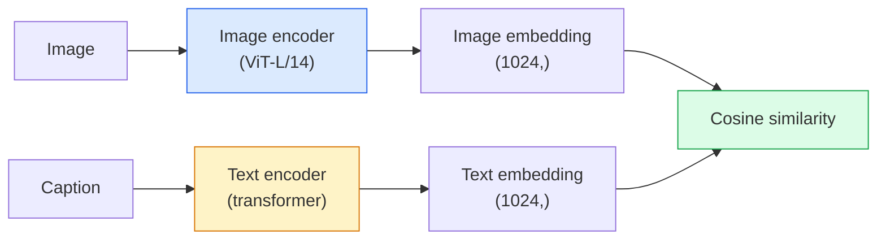

# Open-Vocabulary Vision — CLIP

> قم بتدريب برنامج تشفير الصور وبرنامج تشفير النص معًا بحيث تصل الأزواج المتطابقة (الصورة والتسمية التوضيحية) إلى نفس النقطة في مساحة مشتركة. هذه هي الحيلة كلها.

** النوع: ** بناء + استخدام
** اللغات: ** بايثون
**المتطلبات الأساسية:** المرحلة الرابعة الدرس 14 (ViT)، المرحلة الرابعة الدرس 17 (الإشراف الذاتي)
**الوقت:** ~45 دقيقة

## Learning Objectives

- اشرح بنية البرجين CLIP وهدف التدريب المتباين
- استخدم CLIP (أو SigLIP) المُدرب مسبقًا لتصنيف الطلقة الصفرية دون أي تدريب خاص بالمهمة
- تنفيذ تصنيف الصفر من الصفر: تشفير مطالبات الفئة، وحساب تشابه جيب التمام، واتخاذ argmax
- التمييز بين نماذج الرؤية CLIP وSigLIP وOpenCLIP وLLaVA/LLaMA - ما هو الغرض من كل منها في عام 2026

## The Problem

المصنفات التقليدية عبارة عن مفردات مغلقة: يمكن لنموذج ImageNet المكون من 1000 فئة التنبؤ بـ 1000 تسمية فقط. تتطلب كل فئة جديدة بيانات مصنفة ورأسًا مُعاد تدريبه.

CLIP (Radford et al., OpenAI 2021) أظهر أن التدريب على 400 مليون زوج (صورة، تسمية توضيحية) تم استخراجها من الويب ينتج نموذجًا يمكن تصنيفه إلى أي مجموعة من الفئات عند الاستدلال، موصوفًا بلغة طبيعية بحتة. يمكنك إعطائه فصلًا جديدًا عن طريق كتابة جملة.

هذه القدرة - نقل الطلقة الصفرية - هي السبب في أن كل نظام رؤية حديث يبدأ بنقطة تفتيش CLIP عائلية. الاكتشاف (التأريض DINO، OWL-ViT)، والتجزئة (CLIPSeg، SAM)، والاسترجاع، والإشراف على المحتوى، وVLMs، وتوليد النص إلى صورة، كلها تعتمد على عمليات التضمين المشتركة على النمط CLIP.

## The Concept

### Two towers



ينتهي كلا التشفيرين بإسقاط خطي لنفس بُعد التضمين (512 لـ CLIP-B/32، 1024 لـ CLIP-L/14). L2-تطبيع وحساب تشابه جيب التمام.

### The objective

بالنظر إلى مجموعة من أزواج N (الصورة، التسمية التوضيحية)، قم ببناء مصفوفة تشابه NxN. قم بتدريب كلا المشفرين بحيث يكون للقطري (الأزواج المتطابقة) تشابه كبير والأقطار غير المتطابقة (غير المتطابقة) لها تشابه منخفض.

```
sim_matrix = image_embeddings @ text_embeddings.T / tau

loss_i2t = cross_entropy(sim_matrix,       targets=arange(N))
loss_t2i = cross_entropy(sim_matrix.T,     targets=arange(N))
loss = (loss_i2t + loss_t2i) / 2
```

متماثل لأن كلاً من استرجاع الصورة إلى نص ومن النص إلى الصورة يجب أن يعمل. يتم التعرف على `tau` (درجة الحرارة) عادةً كمعلمة عددية، تتم تهيئتها إلى 0.07.

### SigLIP: a better loss

استبدل SigLIP (Zhai et al., 2023) softmax بـ sigmoid لكل زوج:

```
loss = mean over pairs of log(1 + exp(-y_ij * sim_ij))
y_ij = +1 if matching, -1 otherwise
```

تؤدي الخسارة لكل زوج إلى إزالة التطبيع على مستوى الدُفعة الذي يتطلبه CLIP. يتدرب SigLIP بشكل أفضل على أحجام الدُفعات الصغيرة ويتطابق أو يتجاوز CLIP عند البيانات المتساوية.

### Zero-shot classification

إعطاء مدرب CLIP:

1. لكل فصل، قم بإنشاء مطالبة: "صورة {فصل}".
2. قم بتشفير كافة مطالبات الفصل باستخدام أداة تشفير النص -> `T` الشكل (C، d).
3. قم بتشفير صورة الاختبار -> `I` الشكل (1، د).
4. التشابه = `I @ T.T` الشكل (1، ج).
5. Argmax -> الفئة المتوقعة.

الأمور الهندسية العاجلة. OpenAI نشر 80 نموذجًا سريعًا لـ ImageNet ("صورة لـ {}"، "صورة ضبابية لـ {}"، "رسم تخطيطي لـ {}"،...). قم بتوسيط عمليات التضمين لجميع القوالب لكل فصل للحصول على دقة إضافية من أعلى 1 إلى 3%.

### Where CLIP-style models are used in 2026

- **تصنيف الطلقة الصفرية** — الاستخدام المباشر.
- **استرجاع الصور** — تشفير جميع الصور مرة واحدة، وتضمين الاستعلام عند الاستدلال.
- **الكشف المشروط بالنص** — التأريض DINO، OWL-ViT يلتف برج نص CLIP حول الكاشف.
- **تجزئة النص المشروطة** — CLIPSeg; SAM يستخدم مدخلات النص عبر CLIP.
- **VLMs** — LLaVA، Qwen-VL، InternVL يقوم بتوصيل جهاز تشفير الرؤية العائلية CLIP إلى LLM.
- **جيل تحويل النص إلى صورة** — نشر مستقر، DALL-E 3 شرط على CLIP تضمينات النص.

بمجرد أن يكون لديك مساحة تضمين مشتركة، تصبح كل مهمة رؤية + لغة بمثابة حساب مسافة.

## Build It

### Step 1: A tiny two-tower model

حقيقي CLIP هو ViT + محول. بالنسبة لهذا الدرس، تكون الأبراج عبارة عن نقاط MLP صغيرة فوق الميزات المستخرجة مسبقًا، لذا تكون إشارة التدريب مرئية على CPU.

```python
import torch
import torch.nn as nn
import torch.nn.functional as F


class TwoTower(nn.Module):
    def __init__(self, img_in=128, txt_in=64, emb=64):
        super().__init__()
        self.image_proj = nn.Sequential(nn.Linear(img_in, 128), nn.ReLU(), nn.Linear(128, emb))
        self.text_proj = nn.Sequential(nn.Linear(txt_in, 128), nn.ReLU(), nn.Linear(128, emb))
        self.logit_scale = nn.Parameter(torch.ones([]) * 2.6592)  # ln(1/0.07)

    def forward(self, img_feats, txt_feats):
        i = F.normalize(self.image_proj(img_feats), dim=-1)
        t = F.normalize(self.text_proj(txt_feats), dim=-1)
        return i, t, self.logit_scale.exp()
```

إسقاطان، مخرجات خافتة مشتركة، درجة الحرارة المستفادة. نفس الشكل الحقيقي CLIP API.

### Step 2: Contrastive loss

```python
def clip_loss(image_emb, text_emb, logit_scale):
    N = image_emb.size(0)
    sim = logit_scale * image_emb @ text_emb.T
    targets = torch.arange(N, device=sim.device)
    l_i = F.cross_entropy(sim, targets)
    l_t = F.cross_entropy(sim.T, targets)
    return (l_i + l_t) / 2
```

متماثل. logit_scale أعلى = softmax أكثر وضوحًا = أكثر ثقة ولكن هناك خطر عدم الاستقرار.

### Step 3: Zero-shot classifier

```python
@torch.no_grad()
def zero_shot_classify(model, image_feats, class_text_feats, class_names):
    """
    image_feats:      (N, img_in)
    class_text_feats: (C, txt_in)   one averaged embedding per class
    """
    i = F.normalize(model.image_proj(image_feats), dim=-1)
    t = F.normalize(model.text_proj(class_text_feats), dim=-1)
    sim = i @ t.T
    pred = sim.argmax(dim=-1)
    return [class_names[p] for p in pred.tolist()]
```

سطر واحد لكل خطوة. هذا هو الإجراء الدقيق للطلقة الصفرية المستخدم مع نقطة تفتيش الإنتاج CLIP.

### Step 4: Sanity check

```python
torch.manual_seed(0)
model = TwoTower()

img = torch.randn(8, 128)
txt = torch.randn(8, 64)
i, t, scale = model(img, txt)
loss = clip_loss(i, t, scale)
print(f"batch size: {i.size(0)}   loss: {loss.item():.3f}")
```

يجب أن تكون الخسارة قريبة من `log(N) = log(8) = 2.08` للنموذج الذي تمت تهيئته بشكل عشوائي — هدف الإنتروبيا المتماثل عندما لا يتم تعلم أي بنية بعد.

## Use It

OpenCLIP هو الإعداد الافتراضي للمجتمع في عام 2026:

```python
import open_clip
import torch
from PIL import Image

model, _, preprocess = open_clip.create_model_and_transforms("ViT-B-32", pretrained="laion2b_s34b_b79k")
tokenizer = open_clip.get_tokenizer("ViT-B-32")

image = preprocess(Image.open("dog.jpg")).unsqueeze(0)
text = tokenizer(["a photo of a dog", "a photo of a cat", "a photo of a car"])

with torch.no_grad():
    image_features = model.encode_image(image)
    text_features = model.encode_text(text)
    image_features = image_features / image_features.norm(dim=-1, keepdim=True)
    text_features = text_features / text_features.norm(dim=-1, keepdim=True)
    probs = (100.0 * image_features @ text_features.T).softmax(dim=-1)

print(probs)
```

SigLIP هو الأحدث، ويتدرب بشكل أفضل على المقاييس الصغيرة، ويفضل للعمل الجديد: `google/siglip-base-patch16-224`. Hugging Face يشحن كلا من.

## Ship It

ينتج هذا الدرس:

- `outputs/prompt-zero-shot-class-picker.md` — مطالبة تصمم قوالب الفصل الدراسي بدون إطلاق CLIP مع تقديم قائمة بالفئات والمجال.
- `outputs/skill-image-text-retriever.md` — مهارة تقوم بإنشاء فهرس تضمين الصور باستخدام أي نقطة تفتيش CLIP، وتدعم الاستعلام عن طريق النص والاستعلام عن طريق الصورة.

## Exercises

1. **(سهل)** استخدم OpenCLIP ViT-B/32 المُدرب مسبقًا وقم بتصنيف اللقطة الصفرية على CIFAR-10 باستخدام مجموعة المطالبة المكونة من 80 قالبًا. الإبلاغ عن أعلى دقة 1؛ ينبغي أن يكون حوالي 85-90٪.
2. **(متوسط)** قارن بين القالب الفردي ("صورة {}") مقابل التضمينات المتوسطة المكونة من 80 قالبًا في نفس المهمة CIFAR-10. قم بقياس الفجوة واشرح سبب فائدة القوالب.
3. **(صعب)** إنشاء فهرس استرجاع الصور بدون لقطة: قم بتضمين 1000 صورة باستخدام CLIP، وإنشاء فهرس FAISS، والاستعلام باستخدام وصف باللغة الطبيعية. تقرير استدعاء الاسترجاع @5 لـ 20 استعلامًا معلقًا تكتبه يدويًا.

## Key Terms

| مصطلح | ماذا يقول الناس | ماذا يعني في الواقع |
|------|----------------|----------------------|
| برجين | "التشفير المزدوج" | برامج ترميز منفصلة للصور والنصوص تنتهي برأس عرض خافت مشترك |
| طلقة صفر | "لا يوجد تدريب خاص بمهمة معينة" | التصنيف إلى فئات موصوفة فقط بالنص عند الاستدلال؛ لم يتم لمس أي تسميات |
| درجة الحرارة / logit_scale | "تاو" | تم تعلم العددية التي تعمل على قياس مصفوفة التشابه قبل softmax |
| قالب موجه | "صورة {}" | غلاف اللغة الطبيعية حول أسماء الفئات؛ يؤدي متوسط ​​العديد من القوالب إلى تعزيز دقة اللقطة الصفرية |
| CLIP | "نموذج الصورة+النص" | موديل 2021 OpenAI ؛ مفردات المجال في 2026 |
| سيجليب | "السيني CLIP" | مقايضة softmax بالسيني لكل زوج؛ القطارات أفضل على دفعات صغيرة |
| فتحCLIP | "الاستنساخ المفتوح" | المتغيرات CLIP التي تم تدريبها من قبل المجتمع على LAION؛ الإنتاج الافتراضي للمصدر المفتوح pipelines |
| VLM | "نموذج الرؤية اللغوية" | جهاز تشفير CLIP عائلي بالإضافة إلى LLM مدرب للإجابة على الأسئلة المتعلقة بالصور |

## Further Reading

- [CLIP: Learning Transferable Visual Models from Natural Language Supervision (Radford et al., 2021)](https://arxiv.org/abs/2103.00020)
- [SigLIP: Sigmoid Loss for Language-Image Pre-Training (Zhai et al., 2023)](https://arxiv.org/abs/2303.15343)
- [فتحCLIP](https://githubhub.com/mlfoundations/open_clip) — قاعدة بيانات المجتمع
- [DINOv2 vs CLIP vs MAE: مقارنة الميزات](https://huggingface.co/blog/dinov2) — HF دليل مع حالات الاستخدام جنبًا إلى جنب
