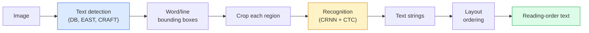

# OCR & Document Understanding

> OCR عبارة عن خط pipe مكون من ثلاث مراحل — اكتشف مربعات النص، وتعرف على الأحرف، ثم ضعها في مخطط. وكل نظام OCR حديث يعيد ترتيب هذه المراحل أو يدمجها.

**النوع:** تعلم + استخدم
** اللغات: ** بايثون
**المتطلبات الأساسية:** المرحلة الرابعة الدرس 06 (الاكتشاف)، المرحلة 7 الدرس 02 (الانتباه الذاتي)
**الوقت:** ~45 دقيقة

## Learning Objectives

- تتبع الخط الكلاسيكي OCR pipeline (اكتشاف -> التعرف -> التخطيط) والبدائل الحديثة الشاملة (Donut، Qwen-VL-OCR)
- تنفيذ خسارة CTC (التصنيف الزمني للتوصيل) للتدريب من تسلسل إلى تسلسل OCR
- استخدم PaddleOCR أو EasyOCR لتحليل مستندات الإنتاج دون تدريب
- التمييز بين OCR، وتحليل التخطيط، وفهم المستند - واختيار الأداة المناسبة لكل مهمة

## The Problem

الصور المليئة بالنصوص موجودة في كل مكان: الإيصالات، والفواتير، والهويات، والكتب الممسوحة ضوئيًا، والنماذج، والسبورات البيضاء، واللافتات، ولقطات الشاشة. يعد استخراج البيانات المنظمة منها - وليس فقط الشخصيات، ولكن "هذا هو المبلغ الإجمالي" - إحدى مشكلات الرؤية التطبيقية ذات القيمة الأعلى.

ينقسم الحقل إلى ثلاث طبقات من المهارات:

1. **OCR مناسب**: تحويل وحدات البكسل إلى نص.
2. **تحليل التخطيط**: إخراج المجموعة OCR إلى مناطق (العنوان، النص، الجدول، الرأس).
3. **فهم المستند**: استخرج الحقول المنظمة ("invoice_total = $42.50") من التخطيط.

تحتوي كل طبقة على أساليب كلاسيكية وحديثة، والفجوة بين "أريد نصًا من صورة" و"أحتاج إلى المبلغ الإجمالي من هذا الإيصال" أكبر مما تدركه معظم الفرق.

## The Concept

### The classical pipeline



- **الكشف عن النص** ينتج أشكالًا رباعية لكل سطر أو لكل كلمة.
- **التعرف** يقوم بقص كل منطقة إلى ارتفاع ثابت، وتشغيل CNN + BiLSTM + CTC لإنتاج تسلسل الأحرف.
- **التخطيط** يعيد بناء ترتيب القراءة (من أعلى إلى أسفل، ومن اليسار إلى اليمين للغة اللاتينية؛ ويختلف بالنسبة للغة العربية واليابانية).

### CTC in one paragraph

ينتج التعرف OCR تسلسلاً متغير الطول من خريطة ميزات ذات طول ثابت. CTC (Graves et al., 2006) يتيح لك تدريب هذا دون محاذاة على مستوى الشخصية. يقوم النموذج بإخراج توزيع على (مفردات + فارغ) في كل خطوة زمنية؛ CTC فقدان التهميش على جميع المحاذاة التي تقلل إلى النص المستهدف بعد دمج التكرارات وإزالة الفراغات.

```
raw output: "h h h _ _ e e l l _ l l o _ _"
after merge repeats and remove blanks: "hello"
```

CTC هو السبب وراء عمل CRNN في عام 2015 وما زال يقوم بتدريب معظم نماذج الإنتاج OCR في عام 2026.

### Modern end-to-end models

- **دونات** (كيم وآخرون، 2022) - جهاز تشفير ViT + وحدة فك ترميز النص؛ يقرأ الصورة ويصدر JSON مباشرة. لا يوجد كاشف للنص ولا وحدة تخطيط.
- **TrOCR** ​​— وحدة فك تشفير المحولات ViT + لمستوى الخط OCR.
- **Qwen-VL-OCR / InternVL** — نماذج لغة رؤية كاملة تم ضبطها بدقة لمهام OCR؛ أفضل دقة في عام 2026 على المستندات المعقدة.
- **PaddleOCR** ​​— كلاسيكي DB + CRNN pipeline في حزمة إنتاج ناضجة؛ لا يزال العمود الفقري مفتوح المصدر.

تحتاج النماذج الشاملة إلى مزيد من البيانات والحوسبة ولكنها تتخطى تراكم الأخطاء في الخطوط pip متعددة المراحل.

### Layout parsing

بالنسبة للمستندات المنظمة، قم بتشغيل كاشف التخطيط (LayoutLMv3، DocLayNet) الذي يقوم بتسمية كل منطقة: العنوان، الفقرة، الشكل، الجدول، الحاشية السفلية. يصبح ترتيب القراءة بعد ذلك "التكرار عبر المناطق بترتيب التخطيط والتسلسل".

بالنسبة للنماذج، استخدم نماذج **استخراج القيمة الرئيسية** (Donut للمستندات الغنية بصريًا، LayoutLMv3 للمسح العادي). إنهم يلتقطون الصورة + النص المكتشف + المواضع ويتنبأون بأزواج القيمة الرئيسية المنظمة.

### Evaluation metrics

- **معدل خطأ الأحرف (CER)** — مسافة ليفنشتاين / طول المرجع. أقل هو أفضل. هدف الإنتاج: <2% على عمليات المسح النظيفة.
- **معدل خطأ الكلمات (WER)** — نفسه على مستوى الكلمة.
- **F1 في الحقول المنظمة** — للمهام ذات القيمة الأساسية؛ يقيس ما إذا كان `{invoice_total: 42.50}` يظهر بشكل صحيح.
- **تعديل المسافة على JSON** — لتحليل المستند من طرف إلى طرف؛ قدمت ورقة الدونات مسافة تحرير الشجرة الطبيعية.

## Build It

### Step 1: CTC loss + greedy decoder

```python
import torch
import torch.nn as nn
import torch.nn.functional as F


def ctc_loss(log_probs, targets, input_lengths, target_lengths, blank=0):
    """
    log_probs:      (T, N, C) log-softmax over vocab including blank at index 0
    targets:        (N, S) int targets (no blanks)
    input_lengths:  (N,) per-sample time steps used
    target_lengths: (N,) per-sample target length
    """
    return F.ctc_loss(log_probs, targets, input_lengths, target_lengths,
                      blank=blank, reduction="mean", zero_infinity=True)


def greedy_ctc_decode(log_probs, blank=0):
    """
    log_probs: (T, N, C) log-softmax
    returns: list of index sequences (blanks removed, repeats merged)
    """
    preds = log_probs.argmax(dim=-1).transpose(0, 1).cpu().tolist()
    out = []
    for seq in preds:
        decoded = []
        prev = None
        for idx in seq:
            if idx != prev and idx != blank:
                decoded.append(idx)
            prev = idx
        out.append(decoded)
    return out
```

`F.ctc_loss` يستخدم تطبيق CuDNN الفعال عند توفره. يعد جهاز فك التشفير الجشع أبسط من البحث عن الشعاع وعادةً ما يكون في حدود 1٪ CER منه.

### Step 2: Tiny CRNN recogniser

الحد الأدنى CNN + BiLSTM للخط OCR.

```python
class TinyCRNN(nn.Module):
    def __init__(self, vocab_size=40, hidden=128, feat=32):
        super().__init__()
        self.cnn = nn.Sequential(
            nn.Conv2d(1, feat, 3, 1, 1), nn.BatchNorm2d(feat), nn.ReLU(inplace=True),
            nn.MaxPool2d(2),
            nn.Conv2d(feat, feat * 2, 3, 1, 1), nn.BatchNorm2d(feat * 2), nn.ReLU(inplace=True),
            nn.MaxPool2d(2),
            nn.Conv2d(feat * 2, feat * 4, 3, 1, 1), nn.BatchNorm2d(feat * 4), nn.ReLU(inplace=True),
            nn.MaxPool2d((2, 1)),
            nn.Conv2d(feat * 4, feat * 4, 3, 1, 1), nn.BatchNorm2d(feat * 4), nn.ReLU(inplace=True),
            nn.MaxPool2d((2, 1)),
        )
        self.rnn = nn.LSTM(feat * 4, hidden, bidirectional=True, batch_first=True)
        self.head = nn.Linear(hidden * 2, vocab_size)

    def forward(self, x):
        # x: (N, 1, H, W)
        f = self.cnn(x)                # (N, C, H', W')
        f = f.mean(dim=2).transpose(1, 2)  # (N, W', C)
        h, _ = self.rnn(f)
        return F.log_softmax(self.head(h).transpose(0, 1), dim=-1)  # (W', N, vocab)
```

إدخال ذو ارتفاع ثابت (CNN أقصى ارتفاع للمجمعات هو 1). العرض هو البعد الزمني لـ CTC.

### Step 3: Synthetic OCR

قم بإنشاء سلاسل digit باللون الأسود على الأبيض لاختبار الدخان من طرف إلى طرف.

```python
import numpy as np

def synthetic_line(text, height=32, char_width=16):
    W = char_width * len(text)
    img = np.ones((height, W), dtype=np.float32)
    for i, c in enumerate(text):
        x = i * char_width
        shade = 0.0 if c.isalnum() else 0.5
        img[6:height - 6, x + 2:x + char_width - 2] = shade
    return img


def build_batch(strings, vocab):
    H = 32
    W = 16 * max(len(s) for s in strings)
    imgs = np.ones((len(strings), 1, H, W), dtype=np.float32)
    target_lengths = []
    targets = []
    for i, s in enumerate(strings):
        imgs[i, 0, :, :16 * len(s)] = synthetic_line(s)
        ids = [vocab.index(c) for c in s]
        targets.extend(ids)
        target_lengths.append(len(ids))
    return torch.from_numpy(imgs), torch.tensor(targets), torch.tensor(target_lengths)


vocab = ["_"] + list("0123456789abcdefghijklmnopqrstuvwxyz")
imgs, targets, lengths = build_batch(["hello", "world"], vocab)
print(f"images: {imgs.shape}   targets: {targets.shape}   lengths: {lengths.tolist()}")
```

تضيف مجموعة البيانات OCR الحقيقية الخطوط والضوضاء والتدوير والتمويه واللون. الخط pipe أعلاه متطابق.

### Step 4: Training sketch

```python
model = TinyCRNN(vocab_size=len(vocab))
opt = torch.optim.Adam(model.parameters(), lr=1e-3)

for step in range(200):
    strings = ["abc" + str(step % 10)] * 4 + ["xyz" + str((step + 1) % 10)] * 4
    imgs, targets, target_lens = build_batch(strings, vocab)
    log_probs = model(imgs)  # (W', 8, vocab)
    input_lens = torch.full((8,), log_probs.size(0), dtype=torch.long)
    loss = ctc_loss(log_probs, targets, input_lens, target_lens, blank=0)
    opt.zero_grad(); loss.backward(); opt.step()
```

يجب أن تنخفض الخسارة من ~ 3 إلى ~ 0.2 على مدى 200 خطوة على هذه البيانات الاصطناعية التافهة.

## Use It

ثلاثة مسارات الإنتاج:

- **PaddleOCR** ​​— ناضج، سريع، متعدد اللغات. استخدام سطر واحد: `paddleocr.PaddleOCR(lang="en").ocr(image_path)`.
- **EasyOCR** ​​— لغة بايثون الأصلية، متعددة اللغات، PyTorch العمود الفقري.
- **تسراكت** — كلاسيكي؛ لا يزال مفيدًا للمستندات القديمة الممسوحة ضوئيًا عندما تواجه النماذج صعوبة.

لتحليل المستند من طرف إلى طرف، استخدم الدونات أو VLM:

```python
from transformers import DonutProcessor, VisionEncoderDecoderModel

processor = DonutProcessor.from_pretrained("naver-clova-ix/donut-base-finetuned-cord-v2")
model = VisionEncoderDecoderModel.from_pretrained("naver-clova-ix/donut-base-finetuned-cord-v2")
```

بالنسبة للإيصالات والفواتير والنماذج ذات البنية القابلة للتكرار، قم بضبط الدونات بشكل دقيق. بالنسبة للمستندات التعسفية أو OCR مع الاستدلال، فإن VLM مثل Qwen-VL-OCR هو الإعداد الافتراضي الحالي.

## Ship It

ينتج هذا الدرس:

- `outputs/prompt-ocr-stack-picker.md` — مطالبة تختار Tesseract / PaddleOCR / Donut / VLM-OCR مع تحديد نوع المستند ولغته وبنيته.
- `outputs/skill-ctc-decoder.md` — مهارة كتابة أجهزة فك التشفير CTC للبحث الجشع والشعاعي من الصفر، بما في ذلك تطبيع الطول.

## Exercises

1. **(سهل)** قم بتدريب TinyCRNN على 5-digit سلاسل رقمية عشوائية لمدة 500 خطوة. تقرير CER على مجموعة محتجزة.
2. **(متوسط)** استبدل فك التشفير الجشع ببحث الشعاع (beam_width=5). تقرير CER دلتا. ما هي المدخلات التي يفوز بها بحث الشعاع؟
3. **(صعب)** استخدم PaddleOCR على مجموعة مكونة من 20 إيصالًا، واستخرج عناصر السطر، واحسب F1 مقابل الحقيقة الأساسية الموسومة يدويًا لأزواج {item_name,price}.

## Key Terms

| مصطلح | ماذا يقول الناس | ماذا يعني في الواقع |
|------|----------------|----------------------|
| OCR | "نص من البكسل" | تحويل مناطق الصور إلى تسلسلات أحرف |
| CTC | "خسارة خالية من المحاذاة" | الخسارة التي تدرب نموذج التسلسل بدون تسميات لكل خطوة زمنية؛ التهميش على الاصطفافات |
| CRNN | "موديل OCR كلاسيكي" | مستخرج ميزة التحويل + BiLSTM + CTC; لا يزال خط الأساس لعام 2015 مستخدمًا في الإنتاج |
| دونات | "النهاية إلى النهاية OCR" | التشفير ViT + وحدة فك ترميز النص؛ ينبعث JSON مباشرة من الصورة |
| تحليل التخطيط | "البحث عن المناطق" | كشف وتسمية مناطق العنوان/الجدول/الشكل/الفقرة في المستند |
| ترتيب القراءة | "تسلسل النص" | ترتيب المناطق المعترف بها في الجملة؛ تافهة بالنسبة لللاتينية، وغير تافهة بالنسبة للتخطيطات المختلطة |
| CER / WER | "معدلات الخطأ" | مسافة Levenshtein / الطول المرجعي عند دقة الحرف أو الكلمة |
| VLM - OCR | "LLM الذي يقرأ" | نموذج لغة الرؤية تم تدريبه أو مطالبته بـ OCR مهمة؛ الحالي SOTA على المستندات المعقدة |

## Further Reading

- [CRNN (Shi et al., 2015)](https://arxiv.org/abs/1507.05717) — the original CNN+RNN+CTC architecture
- [CTC (Graves et al., 2006)](https://www.cs.toronto.edu/~graves/icml_2006.pdf) — الورقة CTC الأصلية؛ مليئة بالأفكار الخوارزمية
- [دونات (كيم وآخرون، 2022)](https://arxiv.org/abs/2111.15664) — OCR- محول فهم المستندات مجانًا
- [PaddleOCR](https://githubhub.com/PaddlePaddle/PaddleOCR) — مكدس الإنتاج مفتوح المصدر OCR
