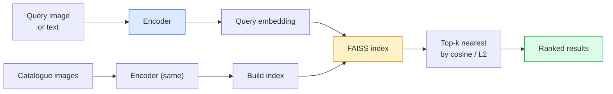

# Image Retrieval & Metric Learning

> يقوم نظام الاسترجاع بتصنيف المرشحين حسب المسافة في مساحة التضمين. التعلم المتري هو نظام تشكيل تلك المساحة بحيث تعني المسافات ما تريد.

**النوع:** بناء
** اللغات: ** بايثون
**المتطلبات:** المرحلة الرابعة الدرس 14 (ViT)، المرحلة الرابعة الدرس 18 (CLIP)
**الوقت:** ~45 دقيقة

## Learning Objectives

- اشرح خسائر التعلم المترية الثلاثية والمتباينة والقائمة على الوكيل واختر الخسارة المناسبة لمجموعة بيانات معينة
- تنفيذ L2-التطبيع وتشابه جيب التمام بشكل صحيح ومراجعة الفرق بين استرجاع "نفس العنصر" و"نفس الفئة"
- إنشاء فهرس FAISS، والاستعلام عنه بالنص والصورة، والإبلاغ عن استدعاء@K لمجموعة استعلام معلقة
- استخدم DINOv2 وCLIP وSigLIP كعناصر أساسية جاهزة للاستخدام واعرف متى يفوز كل منهم

## The Problem

الاسترجاع موجود في كل مكان في رؤية الإنتاج: اكتشاف التكرارات، البحث العكسي عن الصور، البحث البصري ("العثور على منتجات مماثلة")، إعادة تحديد الوجه، إعادة ID الشخص للمراقبة، والمطابقة على مستوى المثال للتجارة الإلكترونية. سؤال المنتج هو نفسه دائمًا: "نظرًا لصورة الاستعلام هذه، قم بتصنيف الكتالوج الخاص بي."

هناك قراران للتصميم يشكلان النظام بأكمله. التضمين – ما هو النموذج الذي ينتج المتجهات. الفهرس - كيفية العثور على أقرب الجيران على نطاق واسع. كلاهما سلعة في عام 2026 (DINOv2 للتضمين، FAISS للمؤشر)، مما يرفع المستوى: الجزء الصعب هو تحديد *ما يعتبر متشابهًا* لتطبيقك، ثم تشكيل مساحة التضمين بحيث تتطابق المسافات.

هذا التشكيل هو التعلم المتري. إنه نظام صغير ولكنه عالي النفوذ.

## The Concept

### Retrieval at a glance



### The four loss families

| خسارة | يتطلب | الايجابيات | سلبيات |
|------|----------|------|------|
| **المتناقضة** | (مرساة، إيجابية) + سلبيات | بسيط، ويعمل مع أي ملصق مزدوج | بطيء في التقارب دون سلبيات كثيرة |
| **ثلاثية** | (مرساة، إيجابية، سلبية) | حدسي؛ التحكم المباشر في الهامش | التعدين الثلاثي الصعب مكلف |
| **NT-Xent / InfoNCE** | أزواج + السلبيات دفعة الملغومة | موازين بكميات كبيرة | يحتاج إلى دفعة كبيرة أو قائمة انتظار الزخم |
| ** القائم على الوكيل (ProxyNCA) ** | تسميات الفصل فقط | سريع ومستقر ولا يوجد تعدين | يمكن أن يفرط في الوكلاء في مجموعات البيانات الصغيرة |

بالنسبة لمعظم حالات استخدام الإنتاج، ابدأ بعمود فقري تم تدريبه مسبقًا وأضف فقط ضبطًا دقيقًا للتعلم المتري إذا كان أداء التضمينات الجاهزة ضعيفًا في مجموعة الاختبار الخاصة بك.

### Triplet loss formally

```
L = max(0, ||f(a) - f(p)||^2 - ||f(a) - f(n)||^2 + margin)
```

اسحب المرساة `a` بالقرب من الموجب `p`، وادفعها بعيدًا عن السالب `n`، مع `margin` التي تضمن وجود فجوة. يعمم هيكل الصور الثلاث على أي ترتيب تشابه.

التعدين مهم: الثلاثية السهلة (`n` بعيدة بالفعل عن `a`) لا تساهم بأي خسارة؛ فقط الثلاثيات الصعبة هي التي تقوم بتعليم الشبكة. التعدين شبه الصلب (`n` أبعد من `p` ولكن ضمن الهامش) هو وصفة FaceNet لعام 2016 وما زال مسيطرًا.

### Cosine similarity vs L2

مقياسان، اتفاقيتان:

- **جيب التمام**: الزاوية بين المتجهات. يتطلب L2-التضمينات الطبيعية.
- **L2**: المسافة الإقليدية. يعمل على التضمينات الأولية أو الطبيعية، ولكن عادةً ما يتم إقرانه مع L2-عادي + مربع L2.

بالنسبة لمعظم الشبكات الحديثة، يكون الاثنان متكافئين: `||a - b||^2 = 2 - 2 cos(a, b)` عندما `||a|| = ||b|| = 1`. اختر الاتفاقية التي تتوافق مع تدريب التضمين الخاص بك؛ خلطهم بصمت يغير معنى "الأقرب".

### Recall@K

مقياس الاسترجاع القياسي:

```
recall@K = fraction of queries where at least one correct match is in the top K results
```

الإبلاغ عن الاستدعاء@1، @5، @10 جنبًا إلى جنب. إن استدعاء @10 أعلى من 0.95 مع استدعاء @1 أقل من 0.5 يعني أن مساحة التضمين لديها البنية الصحيحة ولكن الترتيب صاخب - حاول إجراء تعديلات دقيقة أطول أو خطوة إعادة الترتيب.

بالنسبة لاكتشاف التكرارات، تعتبر الدقة @K أكثر أهمية لأن كل نتيجة إيجابية خاطئة هي خطأ مرئي للمستخدم. بالنسبة للبحث المرئي، Recall@K هي إشارة المنتج.

### FAISS in one paragraph

الفيسبوك AI بحث التشابه. المكتبة الفعلية للبحث عن أقرب جار. ثلاثة خيارات للفهرس:

- `IndexFlatIP` / `IndexFlatL2` — القوة الغاشمة، الدقة، بدون تدريب. استخدم ما يصل إلى ~1M من المتجهات.
- `IndexIVFFlat` — التقسيم إلى خلايا K، والبحث فقط في الخلايا القليلة الأقرب. تقريبي، سريع، يحتاج إلى بيانات التدريب.
- `IndexHNSW` — يعتمد على الرسم البياني، وهو الأسرع للعديد من الاستعلامات، وحجم الفهرس كبير.

بالنسبة إلى المتجهات التي يبلغ عددها 100 ألف، ربما تريد `IndexFlatIP` على تشابه جيب التمام. لمدة 10 مليون تريد `IndexIVFFlat`. لأكثر من 100 مليون مع تحديد كمية المنتج (`IndexIVFPQ`).

### Instance-level vs category-level retrieval

مشكلتان مختلفتان للغاية بنفس الاسم:

- **على مستوى الفئة** — "ابحث عن القطط في الكتالوج الخاص بي." التشابه الشرطي الطبقي؛ تعمل عمليات التضمين الجاهزة CLIP / DINOv2 بشكل جيد.
- **مستوى المثيل** — "اعثر على *هذا المنتج تحديدًا* في الكتالوج الخاص بي." يحتاج إلى تمييز دقيق بين الكائنات المتشابهة بصريًا من نفس الفئة؛ التضمينات الجاهزة ذات الأداء الضعيف؛ صقل مع مسائل التعلم المتري.

اسأل دائمًا عن المشكلة التي تحلها قبل اختيار النموذج.

## Build It

### Step 1: Triplet loss

```python
import torch
import torch.nn.functional as F

def triplet_loss(anchor, positive, negative, margin=0.2):
    d_ap = F.pairwise_distance(anchor, positive, p=2)
    d_an = F.pairwise_distance(anchor, negative, p=2)
    return F.relu(d_ap - d_an + margin).mean()
```

سطر واحد. يعمل على L2-التضمينات الطبيعية أو الخام.

### Step 2: Semi-hard mining

بالنظر إلى مجموعة من التضمينات والعلامات، ابحث عن أصعب سلبية شبه صلبة لكل مرساة.

```python
def semi_hard_negatives(emb, labels, margin=0.2):
    dist = torch.cdist(emb, emb)
    same_class = labels[:, None] == labels[None, :]
    diff_class = ~same_class
    N = emb.size(0)

    positives = dist.clone()
    positives[~same_class] = float("-inf")
    positives.fill_diagonal_(float("-inf"))
    pos_idx = positives.argmax(dim=1)

    semi_hard = dist.clone()
    semi_hard[same_class] = float("inf")
    d_ap = dist[torch.arange(N), pos_idx].unsqueeze(1)
    semi_hard[dist <= d_ap] = float("inf")
    neg_idx = semi_hard.argmin(dim=1)

    fallback_mask = semi_hard[torch.arange(N), neg_idx] == float("inf")
    if fallback_mask.any():
        hardest = dist.clone()
        hardest[same_class] = float("inf")
        neg_idx = torch.where(fallback_mask, hardest.argmin(dim=1), neg_idx)
    return pos_idx, neg_idx
```

يحصل كل مرساة على أصعب نقطة إيجابية في فئتها ونقطة شبه صلبة أبعد من الإيجابية ولكن ضمن الهامش.

### Step 3: Recall@K

```python
def recall_at_k(query_emb, gallery_emb, query_labels, gallery_labels, k=1):
    sim = query_emb @ gallery_emb.T
    _, top_k = sim.topk(k, dim=-1)
    matches = (gallery_labels[top_k] == query_labels[:, None]).any(dim=-1)
    return matches.float().mean().item()
```

Top-k بواسطة المنتج الداخلي على التضمينات الطبيعية L2 يساوي top-k بواسطة جيب التمام. قم بالإبلاغ عن متوسط ​​نسبة الاستعلامات التي لها جار صحيح واحد على الأقل.

### Step 4: Putting it together

```python
import torch
import torch.nn as nn
from torch.optim import Adam

class Encoder(nn.Module):
    def __init__(self, in_dim=128, emb_dim=64):
        super().__init__()
        self.net = nn.Sequential(
            nn.Linear(in_dim, 128), nn.ReLU(),
            nn.Linear(128, emb_dim),
        )

    def forward(self, x):
        return F.normalize(self.net(x), dim=-1)

torch.manual_seed(0)
num_classes = 6
protos = F.normalize(torch.randn(num_classes, 128), dim=-1)

def sample_batch(bs=32):
    labels = torch.randint(0, num_classes, (bs,))
    x = protos[labels] + 0.15 * torch.randn(bs, 128)
    return x, labels

enc = Encoder()
opt = Adam(enc.parameters(), lr=3e-3)

for step in range(200):
    x, y = sample_batch(32)
    emb = enc(x)
    pos_idx, neg_idx = semi_hard_negatives(emb, y)
    loss = triplet_loss(emb, emb[pos_idx], emb[neg_idx])
    opt.zero_grad(); loss.backward(); opt.step()
```

بعد بضع مئات من الخطوات، تشكل مجموعات التضمين مجموعة واحدة لكل فئة.

## Use It

مداخن الإنتاج في عام 2026:

- **DINOv2 + FAISS** — استرجاع بصري للأغراض العامة. يعمل خارج الرف.
- **CLIP + FAISS** — عندما تكون الاستعلامات نصية.
- **ضبط دقيق لـ DINOv2 + FAISS** — استرجاع على مستوى المثيل، وإعادة الوجه ID، والأزياء، والتجارة الإلكترونية.
- **Milvus / Weaviate / Qdrant** — ناقلات مُدارة DB مغلفة حول FAISS أو HNSW.

بالنسبة لاسترجاع مثيل SOTA، الوصفة هي: العمود الفقري DINOv2، وإضافة رأس تضمين، والضبط الدقيق باستخدام فقدان ثلاثي أو فقدان InfoNCE على الأزواج التي تحمل علامات المثيل، والفهرسة في FAISS.

## Ship It

ينتج هذا الدرس:

- `outputs/prompt-retrieval-loss-picker.md` — مطالبة تقوم باختيار الثلاثي / InfoNCE / ProxyNCA لمشكلة استرداد معينة.
- `outputs/skill-recall-at-k-runner.md` — مهارة تكتب أداة تقييم نظيفة لـ Recall@K مع تقسيمات القطار/val/المعرض وعقد البيانات المناسب.

## Exercises

1. **(سهل)** قم بتشغيل مثال اللعبة أعلاه. ارسم التضمينات بـ PCA قبل وبعد التدريب لرؤية شكل المجموعات الست.
2. **(متوسط)** أضف تطبيق خسارة ProxyNCA: تم تعلم "وكيل" واحد لكل فئة، إنتروبيا متقاطعة قياسية على تشابه جيب التمام. قارن سرعة التقارب مع الخسارة الثلاثية في بيانات اللعبة.
3. **(صعب)** التقط 1000 صورة للتحقق من صحة ImageNet، وقم بتضمينها باستخدام DINOv2 عبر HuggingFace، وإنشاء فهرس مسطح FAISS، والإبلاغ عن الاستدعاء@{1، 5، 10} مقابل نفس الصور مثل الاستعلامات (يجب أن تكون 1.0) وضد الانقسام المعلق باستخدام تسميات ImageNet كحقيقة أساسية.

## Key Terms

| مصطلح | ماذا يقول الناس | ماذا يعني في الواقع |
|------|----------------|----------------------|
| التعلم المتري | "شكل الفضاء" | تدريب جهاز التشفير بحيث تعكس المسافات في مساحة الإخراج الخاصة به تشابه الهدف |
| خسارة ثلاثية | "السحب والدفع" | L = الحد الأقصى(0, d(a, p) - d(a, n) + هامش); خسارة التعلم المترية الأساسية |
| التعدين شبه الصلب | "السلبيات المفيدة" | السلبيات أبعد عن نقطة الارتساء من الإيجابية ولكن ضمن الهامش؛ تجريبيا الأكثر إفادة |
| الخسارة المستندة إلى الوكيل | "نماذج الطبقة" | وكيل واحد مكتسب لكل فصل؛ الانتروبيا المتقاطعة على التشابه مع الوكلاء؛ لا يوجد تعدين للزوج |
| أذكر @ ك | "معدل ضربات Top-K" | جزء من الاستعلامات مع نتيجة صحيحة واحدة على الأقل في الجزء العلوي K |
| استرجاع المثيل | "ابحث عن هذا الشيء بالتحديد" | مطابقة دقيقة الحبيبات؛ عادةً ما يكون أداء الميزات الجاهزة ضعيفًا |
| FAISS | "مكتبة NN" | أقرب مكتبة مجاورة لفيسبوك؛ يدعم الفهارس الدقيقة والتقريبية |
| HNSW | "مؤشر الرسم البياني" | عالم صغير هرمي صالح للملاحة؛ تقريبي سريع NN مع سعة ذاكرة صغيرة |

## Further Reading

- [FaceNet: A Unified Embedding for Face Recognition (Schroff et al., 2015)](https://arxiv.org/abs/1503.03832) — the triplet loss / semi-hard mining paper
- [In Defense of the Triplet Loss for Person Re-Identification (Hermans et al., 2017)](https://arxiv.org/abs/1703.07737) — دليل عملي للضبط الثلاثي
- [FAISS documentation](https://github.com/facebookresearch/faiss/wiki) — every index, every trade-off
- [SMoT: Metric Learning Taxonomy (Kim et al., 2021)](https://arxiv.org/abs/2010.06927) — مسح للخسائر الحديثة وارتباطاتها
