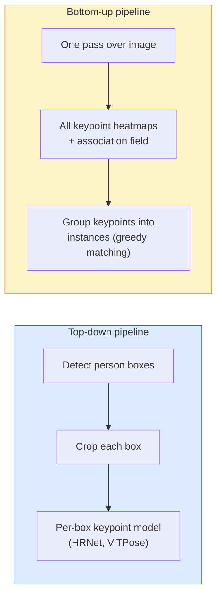

# كشف النقاط الرئيسية وتقدير الوضع
> الوضع عبارة عن مجموعة من النقاط الرئيسية المرتبة. كاشف النقاط الرئيسية هو تراجع للخريطة الحرارية. كل شيء آخر هو مسك الدفاتر.
**النوع:** بناء
** اللغات: ** بايثون
**المتطلبات الأساسية:** المرحلة الرابعة الدرس 06 (الاكتشاف)، المرحلة الرابعة الدرس 07 (U-Net)
**الوقت:** ~45 دقيقة
## أهداف التعلم
- التمييز بين تقدير الوضعية من أعلى إلى أسفل ومن أسفل إلى أعلى والإشارة إلى وقت استخدام كل منهما
- خرائط الحرارة التراجعية لنقاط المفاتيح K مع هدف غاوسي لكل نقطة مفتاح واستخراج إحداثيات نقطة المفاتيح عند الاستدلال
- شرح حقول تقارب الأجزاء (PAFs) وكيفية ربط خطوط pipelines من أسفل إلى أعلى بنقاط المفاتيح في المثيلات
- استخدم MediaPipe Pose أو MMPose لتقدير نقطة مفاتيح الإنتاج وفهم تنسيق الإخراج الخاص بها
## المشكلة
تتخفى مهام النقاط الرئيسية تحت أسماء عديدة: وضعية الإنسان (17 مفصلاً للجسم)، معالم الوجه (68 أو 478 نقطة)، اليد (21 نقطة)، وضعية الحيوان، وضعية الجسم الآلي، معالم التشريح الطبي. يشترك كل واحد منهم في نفس البنية: اكتشاف نقاط K المنفصلة على كائن ما وإخراج إحداثياتها (x، y).
يعد تقدير الوضعية أساس التقاط الحركة، وتطبيقات اللياقة البدنية، والتحليلات الرياضية، والتحكم في الإيماءات، والرسوم المتحركة، وتجربة AR، والإمساك الآلي. الحالة ثنائية الأبعاد ناضجة. تشكل الوضعية ثلاثية الأبعاد (تقدير المواضع المشتركة في إحداثيات العالم من كاميرا واحدة) حدود البحث الحالية.
السؤال الهندسي هو الحجم. تمثل الصورة الواحدة لشخص واحد مشكلة تبلغ 20 مللي ثانية. يمثل وضع الأشخاص المتعددين في حشد من الناس بمعدل 30 إطارًا في الثانية مشكلة مختلفة مع بنيات مختلفة.
##المفهوم
### من أعلى إلى أسفل مقابل من أسفل إلى أعلى


- **من أعلى إلى أسفل** — اكتشف الأشخاص أولاً، ثم قم بتشغيل نموذج نقطة رئيسية لكل شخص على كل محصول. أعلى دقة؛ المقاييس خطيا مع عدد من الناس.
- **من أسفل إلى أعلى** — تمريرة أمامية واحدة تتنبأ بجميع نقاط المفاتيح بالإضافة إلى حقل الارتباط؛ مجموعة منهم. وقت ثابت بغض النظر عن حجم الحشد.
من أعلى إلى أسفل (HRNet، ViTPose) هو الرائد في الدقة؛ من الأسفل إلى الأعلى (OpenPose، HigherHRNet) هو الرائد في الإنتاجية للمشاهد المزدحمة.
### انحدار الخريطة الحرارية
بدلاً من التراجع عن `(x, y)` مباشرةً، توقع خريطة حرارية `H x W` لكل نقطة رئيسية باستخدام نقطة غاوسية متمركزة في الموقع الحقيقي.
```
target[k, y, x] = exp(-((x - cx_k)^2 + (y - cy_k)^2) / (2 sigma^2))
```

عند الاستدلال، يكون الحد الأقصى الأقصى لكل خريطة حرارية هو موقع النقطة الرئيسية المتوقعة.
لماذا تعمل الخرائط الحرارية بشكل أفضل من الانحدار المباشر: تتماشى البنية المكانية للشبكة (خريطة ميزات التحويل) بشكل طبيعي مع الإخراج المكاني. يتم تنظيم الأهداف الغوسية أيضًا - أي خطأ صغير في الترجمة يؤدي إلى خسارة صغيرة، وليس صفرًا.
### توطين البكسل الفرعي
Argmax يعطي إحداثيات عددية صحيحة. للحصول على دقة البكسل الفرعي، قم بالتحسين عن طريق تركيب قطع مكافئ على argmax وما جاوره، أو استخدم اتجاه الإزاحة المعروف `(dx, dy) = 0.25 * (heatmap[y, x+1] - heatmap[y, x-1], ...)`.
### حقول تقارب الأجزاء (PAFs)
خدعة OpenPose للارتباط من الأسفل إلى الأعلى. لكل زوج من نقاط المفاتيح المتصلة (على سبيل المثال، الكتف الأيسر إلى الكوع الأيسر)، توقع مجالًا ثنائي القناة يقوم بتشفير متجه الوحدة الذي يشير من واحدة إلى أخرى. لربط الكتف بمرفقه، قم بدمج PAF على طول الخط الذي يربط الأزواج المرشحة؛ تتم مطابقة الزوج ذو أعلى تكامل.
```
For each connection (limb):
  PAF channels: 2 (unit vector x, y)
  Line integral: sum over sample points of (PAF . line_direction)
  Higher integral = stronger match
```

أنيقة ومقاييس لأحجام الحشود التعسفية دون المحاصيل لكل شخص.
### COCO النقاط الرئيسية
مجموعة البيانات القياسية لوضع الجسم: 17 نقطة رئيسية لكل شخص، PCK (النسبة المئوية للنقاط الرئيسية الصحيحة) وOKS (تشابه النقاط الرئيسية للكائن) كمقاييس. OKS هو التناظرية الأساسية لـ IoU وهو ما يشير إليه COCO mAP@OKS.
### ثنائي الأبعاد مقابل ثلاثي الأبعاد
- **وضعية ثنائية الأبعاد** — إحداثيات الصورة؛ يتم حلها بجودة الإنتاج (MediaPipe، HRNet، ViTPose).
- **وضعية ثلاثية الأبعاد** — إحداثيات العالم / الكاميرا؛ لا تزال الأبحاث نشطة. النهج المشتركة:
  - رفع التوقعات ثنائية الأبعاد إلى ثلاثية الأبعاد باستخدام MLP صغير (VideoPose3D).
  - الانحدار المباشر ثلاثي الأبعاد من الصورة (PyMAF، MHFormer).
  - إعدادات العرض المتعدد (CMU Panoptic) للحقيقة الأرضية.
## بنائها
### الخطوة 1: هدف الخريطة الحرارية الغوسية
```python
import numpy as np
import torch

def gaussian_heatmap(size, cx, cy, sigma=2.0):
    yy, xx = np.meshgrid(np.arange(size), np.arange(size), indexing="ij")
    return np.exp(-((xx - cx) ** 2 + (yy - cy) ** 2) / (2 * sigma ** 2)).astype(np.float32)

hm = gaussian_heatmap(64, 32, 32, sigma=2.0)
print(f"peak: {hm.max():.3f} at ({hm.argmax() % 64}, {hm.argmax() // 64})")
```

توفر الخرائط الحرارية لكل نقطة رئيسية والمكدسة على طول محور القناة موتر الهدف الكامل.
### الخطوة 2: رأس نقطة مفاتيح صغير
نموذج على طراز U-Net يُخرج قنوات خريطة الحرارة K.
```python
import torch.nn as nn
import torch.nn.functional as F

class TinyKeypointNet(nn.Module):
    def __init__(self, num_keypoints=4, base=16):
        super().__init__()
        self.down1 = nn.Sequential(nn.Conv2d(3, base, 3, 2, 1), nn.ReLU(inplace=True))
        self.down2 = nn.Sequential(nn.Conv2d(base, base * 2, 3, 2, 1), nn.ReLU(inplace=True))
        self.mid = nn.Sequential(nn.Conv2d(base * 2, base * 2, 3, 1, 1), nn.ReLU(inplace=True))
        self.up1 = nn.ConvTranspose2d(base * 2, base, 2, 2)
        self.up2 = nn.ConvTranspose2d(base, num_keypoints, 2, 2)

    def forward(self, x):
        h1 = self.down1(x)
        h2 = self.down2(h1)
        h3 = self.mid(h2)
        u1 = self.up1(h3)
        return self.up2(u1)
```

الإدخال `(N, 3, H, W)`، الإخراج `(N, K, H, W)`. تكون الخسارة لكل بكسل MSE مقابل الأهداف الغوسية.
### الخطوة 3: الاستدلال - استخراج إحداثيات النقاط الرئيسية
```python
def heatmap_to_coords(heatmaps):
    """
    heatmaps: (N, K, H, W)
    returns:  (N, K, 2) float coordinates in image pixels
    """
    N, K, H, W = heatmaps.shape
    hm = heatmaps.reshape(N, K, -1)
    idx = hm.argmax(dim=-1)
    ys = (idx // W).float()
    xs = (idx % W).float()
    return torch.stack([xs, ys], dim=-1)

coords = heatmap_to_coords(torch.randn(2, 4, 32, 32))
print(f"coords: {coords.shape}")  # (2, 4, 2)
```

سطر واحد في الاستدلال. لتحسين البكسل الفرعي، قم بالإدخال حول argmax.
### الخطوة 4: مجموعة البيانات الاصطناعية
الأمر بسيط: ارسم أربع نقاط على لوحة بيضاء وتعلم كيفية التنبؤ بها.
```python
def make_synthetic_sample(size=64):
    img = np.ones((3, size, size), dtype=np.float32)
    rng = np.random.default_rng()
    kps = rng.integers(8, size - 8, size=(4, 2))
    for cx, cy in kps:
        img[:, cy - 2:cy + 2, cx - 2:cx + 2] = 0.0
    hms = np.stack([gaussian_heatmap(size, cx, cy) for cx, cy in kps])
    return img, hms, kps
```

سهل بما فيه الكفاية ليتعلمه نموذج صغير في دقيقة واحدة.
### الخطوة 5: التدريب
```python
model = TinyKeypointNet(num_keypoints=4)
opt = torch.optim.Adam(model.parameters(), lr=3e-3)

for step in range(200):
    batch = [make_synthetic_sample() for _ in range(16)]
    imgs = torch.from_numpy(np.stack([b[0] for b in batch]))
    hms = torch.from_numpy(np.stack([b[1] for b in batch]))
    pred = model(imgs)
    # Upsample pred to full resolution
    pred = F.interpolate(pred, size=hms.shape[-2:], mode="bilinear", align_corners=False)
    loss = F.mse_loss(pred, hms)
    opt.zero_grad(); loss.backward(); opt.step()
```

## استخدمه
- **MediaPipe Pose** — أداة تقدير وضعية الإنتاج من Google؛ يشحن أوقات تشغيل WebGL + للهاتف المحمول بزمن وصول أقل من 10 مللي ثانية.
- **MMPose** (OpenMMLab) — قاعدة بيانات بحثية شاملة؛ كل بنية SOTA ذات أوزان مدربة مسبقًا.
- **YOLOv8-pose** — أسرع وضعية متعددة الأشخاص في الوقت الفعلي بتمريرة أمامية واحدة.
- **المحولات HumanDPT / PoseAnything** — أحدث أساليب لغة الرؤية لوضع المفردات المفتوحة (أي كائن، أي مجموعة نقاط رئيسية).
## اشحنها
ينتج هذا الدرس:
- `outputs/prompt-pose-stack-picker.md` — مطالبة تختار MediaPipe / YOLOv8-pose / HRNet / ViTPose مع مراعاة زمن الوصول وحجم الحشود والحاجة ثنائية الأبعاد مقابل ثلاثية الأبعاد.
- `outputs/skill-heatmap-to-coords.md` — مهارة تكتب روتين الخريطة الحرارية لتنسيق البكسل الفرعي الذي يستخدمه كل نموذج إنتاجي.
## تمارين
1. **(سهل)** قم بتدريب نموذج النقطة الرئيسية الصغير على مجموعة البيانات الاصطناعية المكونة من 4 نقاط. الإبلاغ عن خطأ L2 بين النقاط الرئيسية المتوقعة والحقيقية بعد 200 خطوة.
2. **(متوسط)** أضف تحسينًا للبكسل الفرعي: بالنظر إلى موضع argmax، قم بتركيب قطع مكافئ 1D على طول x وy من وحدات البكسل المجاورة. الإبلاغ عن كسب الدقة مقابل عدد صحيح argmax.
3. **(صعب)** أنشئ مجموعة بيانات تركيبية مكونة من شخصين حيث تعرض كل صورة مثيلين لنمط النقاط الأربع الرئيسية. قم بتدريب خط pipe من الأسفل إلى الأعلى باستخدام PAFs التي تتنبأ بنقطة المفاتيح التي تنتمي إلى أي مثيل، وتقييم OKS.
## المصطلحات الرئيسية
| مصطلح | ماذا يقول الناس | ماذا يعني في الواقع |
|------|----------------|----------------------|
| النقطة الرئيسية | "معلم" | نقطة مرتبة محددة على كائن (مفصل، زاوية، ميزة) |
| تشكل | "الهيكل العظمي" | مجموعة مرتبة من النقاط الأساسية التي تنتمي إلى مثيل واحد |
| من أعلى إلى أسفل | "اكتشف ثم تشكل" | خط pipeline ذو مرحلتين: كاشف الأشخاص + نموذج نقطة المفاتيح لكل محصول؛ أعلى دقة |
| من أسفل إلى أعلى | "قف أولاً، ثم المجموعة لاحقاً" | توقع جميع النقاط الرئيسية بتمرير واحد + التجميع؛ وقت ثابت في حجم الحشد |
| الخريطة الحرارية | "الهدف الغوسي" | موتر H x W لكل نقطة مفاتيح مع وجود الذروة في الموقع الحقيقي؛ هدف الانحدار المفضل |
| __المصطلح_1__ | "حقل تقارب الجزء" | مجال متجه لوحدة ثنائية القنوات يشفر اتجاهات الأطراف؛ تستخدم لتجميع نقاط المفاتيح في مثيلات |
| __المصطلح_2__ | "نقطة الوصول IoU" | تشابه النقطة الرئيسية للكائن؛ مقياس COCO للوضعية |
| HRNet | "شبكة عالية الدقة" | بنية النقاط الرئيسية المهيمنة من أعلى إلى أسفل؛ يحافظ على الميزات عالية الدقة في جميع أنحاء |
## مزيد من القراءة
- [OpenPose (Cao et al., 2017)](https://arxiv.org/abs/1812.08008) — من الأسفل إلى الأعلى مع PAFs؛ لا يزال أفضل كتابة لهذا النهج
- [HRNet (Sun et al., 2019)](https://arxiv.org/abs/1902.09212) — البنية المرجعية من أعلى إلى أسفل
- [ViTPose (Xu et al., 2022)](https://arxiv.org/abs/2204.12484) — ViT عادي باعتباره العمود الفقري للوضعية؛ SOTA الحالي في العديد من المعايير
- [MediaPipe Pose](https://developers.google.com/mediapipe/solutions/vision/pose_landmarker) — وضعية الإنتاج في الوقت الفعلي؛ أسرع مكدس تم نشره في عام 2026