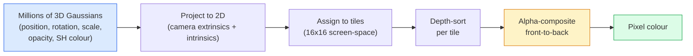

# 3D Gaussian Splatting from Scratch

> المشهد عبارة عن سحابة من ملايين الصور الغوسية ثلاثية الأبعاد. كل واحد له موضع واتجاه ومقياس وعتامة ولون يعتمد على اتجاه العرض. قم بتنقيطهم، ودعمهم من خلال التنقيط، وقد تم ذلك.

**النوع:** بناء
** اللغات: ** بايثون
**المتطلبات الأساسية:** المرحلة 4 الدرس 13 (الرؤية ثلاثية الأبعاد وNeRF)، المرحلة 1 الدرس 12 (عمليات الموتر)، المرحلة 4 الدرس 10 (أساسيات الانتشار اختيارية)
**الوقت:** ~90 دقيقة

## Learning Objectives

- اشرح لماذا حلت تقنية 3D Gaussian Splatting محل NeRF كإعداد افتراضي للإنتاج لإعادة البناء ثلاثي الأبعاد الواقعي في عام 2026
- اذكر المعلمات الستة لكل غاوسي (الموضع، رباعي الدوران، المقياس، العتامة، اللون التوافقي الكروي، الميزة الاختيارية) وعدد العوامات التي يساهم بها كل منها
- تنفيذ أداة مسح نقطية غاوسية ثنائية الأبعاد من البداية باستخدام التركيب `alpha`، ثم إظهار كيفية عرض الحالة ثلاثية الأبعاد لنفس الحلقة
- استخدم `nerfstudio`، `gsplat`، أو `SuperSplat` لإعادة بناء مشهد من 20-50 صورة وتصديره إلى الامتداد `KHR_gaussian_splatting` glTF أو مخطط OpenUSD 26.03 `UsdVolParticleField3DGaussianSplat`

## The Problem

يقوم NeRF بتخزين المشهد بأوزان MLP. كل بكسل معروض عبارة عن مئات من MLP استعلامات على طول الشعاع. يستغرق التدريب ساعات، ويستغرق العرض ثوانٍ، ولا يمكن تحرير الأوزان - إذا كنت تريد تحريك كرسي داخل المشهد، فيجب عليك إعادة التدريب.

حلت تقنية 3D Gaussian Splatting (Kerbl، Kopanas، Leimkühler، Drettakis، SIGGRAPH 2023) محل كل ذلك. المشهد عبارة عن مجموعة صريحة من 3D Gaussians. العرض هو GPU تنقيط بمعدل 100+ إطارًا في الثانية. التدريب يستغرق دقائق. التحرير مباشر: قم بترجمة مجموعة فرعية من لغة Gaussians وقمت بتحريك الكرسي. بحلول عام 2026، صدقت مجموعة Khronos على امتداد glTF للبقع الغوسية، ويشحن OpenUSD 26.03 مخطط البقع الغوسية، وتقدم Zillow وApartments.com العقارات معهم، ومعظم الأوراق البحثية الجديدة حول إعادة البناء ثلاثي الأبعاد هي أشكال مختلفة من فكرة 3DGS الأساسية.

النموذج العقلي بسيط، والرياضيات تحتوي على ما يكفي من الأجزاء المتحركة بحيث تبدأ معظم المقدمات عند التنقيط وتتخطى الإسقاطات والتوافقيات الكروية. يبني هذا الدرس كل شيء - إصدار ثنائي الأبعاد أولاً، ثم ملحق ثلاثي الأبعاد.

## The Concept

### What a Gaussian carries

One 3D Gaussian عبارة عن فقاعة حدودية في الفضاء تتمتع بالصفات التالية:

```
position         mu         (3,)    centre in world coordinates
rotation         q          (4,)    unit quaternion encoding orientation
scale            s          (3,)    log-scales per axis (exponentiated at render time)
opacity          alpha      (1,)    post-sigmoid opacity [0, 1]
SH coefficients  c_lm       (3 * (L+1)^2,)   view-dependent colour
```

التدوير + المقياس ينشئان تباينًا مشتركًا 3x3: `Sigma = R S S^T R^T`. هذا هو شكل غاوسي في 3D. تسمح التوافقيات الكروية بتغيير اللون مع اتجاه العرض - الإضاءات المرآوية واللمعان الدقيق والتوهج المعتمد على العرض - دون تخزين مواد لكل عرض. مع SH الدرجة 3، تحصل على 16 معاملًا لكل قناة ألوان، و48 عوامة لكل غاوسي للون وحده.

يحتوي المشهد عادةً على 1-5 مليون غاوسي. يخزن كل منها حوالي 60 عوامة (3 + 4 + 3 + 1 + 48 + متنوعات). هذا هو 240 MB لمشهد غاوسي بخمسة ملايين - أصغر بكثير من السحابة النقطية المكافئة مع نسيج لكل نقطة، وأصغر من أوزان NeRF MLP المعاد عرضها بدقة عالية.

### Rasterisation, not ray marching



خمس خطوات، كلها GPU ودية. لا يوجد استعلام MLP لكل بكسل. تقدم RTX 3080 Ti واحدة 6 ملايين طلقة بمعدل 147 إطارًا في الثانية.

### The projection step

يتجه Gaussian ثلاثي الأبعاد في الموضع العالمي `mu` مع تباين ثلاثي الأبعاد `Sigma` إلى Gaussian ثنائي الأبعاد في موضع الشاشة `mu'` مع تباين ثنائي الأبعاد `Sigma'`:

```
mu' = project(mu)
Sigma' = J W Sigma W^T J^T          (2 x 2)

W = viewing transform (rotation + translation of camera)
J = Jacobian of the perspective projection at mu'
```

البصمة الغوسية ثنائية الأبعاد عبارة عن قطع ناقص تكون محاوره هي المتجهات الذاتية لـ `Sigma'`. يتلقى كل بكسل داخل هذا الشكل الناقص مساهمة Gaussian، مرجحة بـ `exp(-0.5 * (p - mu')^T Sigma'^-1 (p - mu'))`.

### The alpha-compositing rule

بالنسبة للبيكسل الواحد، يتم فرز Gaussians التي تغطيه من الخلف إلى الأمام (أو ما يعادل ذلك من الأمام إلى الخلف مع صيغة مقلوبة). يتكون اللون بنفس المعادلة مثل كل أداة تنقيط شبه شفافة منذ الثمانينات:

```
C_pixel = sum_i alpha_i * T_i * c_i

T_i = prod_{j < i} (1 - alpha_j)       transmittance up to i
alpha_i = opacity_i * exp(-0.5 * d^T Sigma'^-1 d)   local contribution
c_i = eval_SH(SH_i, view_direction)    view-dependent colour
```

هذه هي ** نفس معادلة العرض الحجمي لـ NeRF **، فقط عبر مجموعة متفرقة واضحة من Gaussians بدلاً من العينات الكثيفة على طول الشعاع. هذه الهوية هي سبب تطابق الجودة المقدمة مع NeRF، فكلاهما يدمج نفس معادلة مجال الإشعاع.

### Why this is differentiable

كل خطوة - الإسقاط، وتعيين البلاط، وتركيب ألفا، وتقييم SH - قابلة للتمييز فيما يتعلق بالمعلمات الغوسية. بالنظر إلى صورة حقيقية، قم بحساب فقدان البكسل المعروض، والدعائم الخلفية من خلال أداة المسح، وقم بتحديث الكل `(mu, q, s, alpha, c_lm)` عن طريق أصل التدرج. أكثر من 30.000 تكرار تقريبًا، يجد الغاوسيون مواضعهم ومقاييسهم وألوانهم الصحيحة.

### Densification and pruning

لا يمكن لمجموعة ثابتة من الغاوسيين تغطية مشهد معقد. يتضمن التدريب آليتين للتكيف:

- **استنساخ** Gaussian في موضعه الحالي عندما يكون حجم تدرجه مرتفعًا ولكن نطاقه صغير - تحتاج إعادة البناء إلى مزيد من التفاصيل هنا.
- **تقسيم** Gaussian كبير الحجم إلى قسمين أصغر عندما يكون تدرجه مرتفعًا - يكون Gaussian الكبير سلسًا جدًا بحيث لا يناسب المنطقة.
- **تقليم** الغاوسيين الذين تنخفض درجة عتامةهم عن الحد الأدنى — فهم لا يساهمون.

يعمل التكثيف في كل تكرارات N. ينمو المشهد عادةً من حوالي 100 ألف Gaussians (مصنف من نقاط SfM) إلى 1-5M في نهاية التدريب.

### Spherical harmonics in one paragraph

اللون المعتمد على العرض هو دالة `c(direction)` على كرة الوحدة. التوافقيات الكروية هي أساس فورييه للكرة. قم بالاقتطاع عند الدرجة `L` وستحصل على `(L+1)^2` وظائف أساسية لكل قناة. تقييم اللون لعرض جديد هو منتج نقطي بين معاملات SH المستفادة والأساس الذي تم تقييمه في اتجاه العرض. الدرجة 0 = معامل واحد = لون ثابت. الدرجة 3 = 16 معاملًا = كافية لالتقاط التظليل اللامبرتي والانعكاس المرآوي والخفيف. SD تستخدم أوراق الرش الغاوسي الدرجة 3 بشكل افتراضي.

### The 2026 production stack

```
1. Capture         smartphone / DJI drone / handheld scanner
2. SfM / MVS       COLMAP or GLOMAP derives camera poses + sparse points
3. Train 3DGS      nerfstudio / gsplat / inria official / PostShot (~10-30 min on RTX 4090)
4. Edit            SuperSplat / SplatForge (clean floaters, segment)
5. Export          .ply -> glTF KHR_gaussian_splatting or .usd (OpenUSD 26.03)
6. View            Cesium / Unreal / Babylon.js / Three.js / Vision Pro
```

### 4D and generative variants

- **4D Gaussian Splatting** — Gaussian هي دالات للوقت؛ تستخدم للفيديو الحجمي (Superman 2026، A$AP "Helicopter" من Rocky).
- **البقع التوليدية** — نماذج تحويل النص إلى لطخات (Marble by World Labs) التي تهلوس مشاهد بأكملها.
- **تحويل غاوسي غير معطر ثلاثي الأبعاد** — NVIDIA نسخة NuRec لمحاكاة القيادة الذاتية.

## Build It

### Step 1: A 2D Gaussian

نقوم أولاً ببناء أداة مسح ثنائية الأبعاد. يتم تقليل الحالة ثلاثية الأبعاد إليها بعد العرض.

```python
import torch
import torch.nn as nn
import torch.nn.functional as F


def eval_2d_gaussian(means, covs, points):
    """
    means:  (G, 2)      centres
    covs:   (G, 2, 2)   covariance matrices
    points: (H, W, 2)   pixel coordinates
    returns: (G, H, W)  density at every pixel for every Gaussian
    """
    G = means.size(0)
    H, W, _ = points.shape
    flat = points.view(-1, 2)
    inv = torch.linalg.inv(covs)
    diff = flat[None, :, :] - means[:, None, :]
    d = torch.einsum("gpi,gij,gpj->gp", diff, inv, diff)
    density = torch.exp(-0.5 * d)
    return density.view(G, H, W)
```

`einsum` يقوم بالصيغة التربيعية `diff^T Sigma^-1 diff` لكل زوج (غاوسي، بكسل).

### Step 2: 2D splatting rasteriser

تركيب ألفا من الأمام إلى الخلف. العمق في البعد الثنائي لا معنى له، لذلك نستخدم مقياسًا غاوسيًا متعلمًا من أجل الترتيب.

```python
def rasterise_2d(means, covs, colours, opacities, depths, image_size):
    """
    means:     (G, 2)
    covs:      (G, 2, 2)
    colours:   (G, 3)
    opacities: (G,)     in [0, 1]
    depths:    (G,)     per-Gaussian scalar used for ordering
    image_size: (H, W)
    returns:   (H, W, 3) rendered image
    """
    H, W = image_size
    yy, xx = torch.meshgrid(
        torch.arange(H, dtype=torch.float32, device=means.device),
        torch.arange(W, dtype=torch.float32, device=means.device),
        indexing="ij",
    )
    points = torch.stack([xx, yy], dim=-1)

    densities = eval_2d_gaussian(means, covs, points)
    alphas = opacities[:, None, None] * densities
    alphas = alphas.clamp(0.0, 0.99)

    order = torch.argsort(depths)
    alphas = alphas[order]
    colours_sorted = colours[order]

    T = torch.ones(H, W, device=means.device)
    out = torch.zeros(H, W, 3, device=means.device)
    for i in range(means.size(0)):
        a = alphas[i]
        out += (T * a)[..., None] * colours_sorted[i][None, None, :]
        T = T * (1.0 - a)
    return out
```

ليس سريعًا - يستخدم التنفيذ الحقيقي نواة CUDA قائمة على البلاط - ولكن تمامًا الرياضيات الصحيحة وقابلة للتمييز تمامًا.

### Step 3: A trainable 2D splat scene

```python
class Splats2D(nn.Module):
    def __init__(self, num_splats=128, image_size=64, seed=0):
        super().__init__()
        g = torch.Generator().manual_seed(seed)
        H, W = image_size, image_size
        self.means = nn.Parameter(torch.rand(num_splats, 2, generator=g) * torch.tensor([W, H]))
        self.log_scale = nn.Parameter(torch.ones(num_splats, 2) * math.log(2.0))
        self.rot = nn.Parameter(torch.zeros(num_splats))  # single angle in 2D
        self.colour_logits = nn.Parameter(torch.randn(num_splats, 3, generator=g) * 0.5)
        self.opacity_logit = nn.Parameter(torch.zeros(num_splats))
        self.depth = nn.Parameter(torch.rand(num_splats, generator=g))

    def covs(self):
        s = torch.exp(self.log_scale)
        c, si = torch.cos(self.rot), torch.sin(self.rot)
        R = torch.stack([
            torch.stack([c, -si], dim=-1),
            torch.stack([si, c], dim=-1),
        ], dim=-2)
        S = torch.diag_embed(s ** 2)
        return R @ S @ R.transpose(-1, -2)

    def forward(self, image_size):
        covs = self.covs()
        colours = torch.sigmoid(self.colour_logits)
        opacities = torch.sigmoid(self.opacity_logit)
        return rasterise_2d(self.means, covs, colours, opacities, self.depth, image_size)
```

`log_scale`، `opacity_lologit`، و `colour_lologitss` كلها معلمات غير مقيدة تم تعيينها من خلال التنشيط الصحيح في وقت العرض. هذا هو النمط القياسي لكل تطبيق 3DGS.

### Step 4: Fit 2D Gaussians to a target image

```python
import math
import numpy as np

def make_target(size=64):
    yy, xx = np.meshgrid(np.arange(size), np.arange(size), indexing="ij")
    img = np.zeros((size, size, 3), dtype=np.float32)
    # Red circle
    mask = (xx - 20) ** 2 + (yy - 20) ** 2 < 10 ** 2
    img[mask] = [1.0, 0.2, 0.2]
    # Blue square
    mask = (np.abs(xx - 45) < 8) & (np.abs(yy - 40) < 8)
    img[mask] = [0.2, 0.3, 1.0]
    return torch.from_numpy(img)


target = make_target(64)
model = Splats2D(num_splats=64, image_size=64)
opt = torch.optim.Adam(model.parameters(), lr=0.05)

for step in range(200):
    pred = model((64, 64))
    loss = F.mse_loss(pred, target)
    opt.zero_grad(); loss.backward(); opt.step()
    if step % 40 == 0:
        print(f"step {step:3d}  mse {loss.item():.4f}")
```

بعد أكثر من 200 خطوة، يستقر الـ 64 غاوسيًا في الشكلين. هذه هي الفكرة بأكملها - النسب المتدرج على البدائيات الهندسية الواضحة.

### Step 5: From 2D to 3D

يحتفظ الامتداد ثلاثي الأبعاد بنفس الحلقة. الإضافات:

1. الدوران لكل غاوسي هو كواترنيون بدلاً من زاوية واحدة.
2. التغاير هو `R S S^T R^T` مع `R` مبني من الرباعي و `S = diag(exp(log_scale))`.
3. يستخدم الإسقاط `(mu, Sigma) -> (mu', Sigma')` العناصر الخارجية للكاميرا واليعقوبي لإسقاط المنظور عند `mu`.
4. يصبح اللون امتدادًا للتوافقيات الكروية؛ تقييمه في اتجاه المشاهدة.
5. يتم فرز العمق من مساحة الكاميرا الفعلية z بدلاً من العددية المستفادة.

كل تنفيذ إنتاج (`gsplat`، `inria/gaussian-splatting`، `nerfstudio`) يفعل هذا بالضبط على GPU مع حبات CUDA القائمة على البلاط.

### Step 6: Spherical harmonics evaluation

يحتوي الأساس SH حتى الدرجة 3 على 16 مصطلحًا لكل قناة. تقييم:

```python
def eval_sh_degree_3(sh_coeffs, dirs):
    """
    sh_coeffs: (..., 16, 3)   last dim is RGB channels
    dirs:      (..., 3)       unit vectors
    returns:   (..., 3)
    """
    C0 = 0.282094791773878
    C1 = 0.488602511902920
    C2 = [1.092548430592079, 1.092548430592079,
          0.315391565252520, 1.092548430592079,
          0.546274215296039]
    x, y, z = dirs[..., 0], dirs[..., 1], dirs[..., 2]
    x2, y2, z2 = x * x, y * y, z * z
    xy, yz, xz = x * y, y * z, x * z

    result = C0 * sh_coeffs[..., 0, :]
    result = result - C1 * y[..., None] * sh_coeffs[..., 1, :]
    result = result + C1 * z[..., None] * sh_coeffs[..., 2, :]
    result = result - C1 * x[..., None] * sh_coeffs[..., 3, :]

    result = result + C2[0] * xy[..., None] * sh_coeffs[..., 4, :]
    result = result + C2[1] * yz[..., None] * sh_coeffs[..., 5, :]
    result = result + C2[2] * (2.0 * z2 - x2 - y2)[..., None] * sh_coeffs[..., 6, :]
    result = result + C2[3] * xz[..., None] * sh_coeffs[..., 7, :]
    result = result + C2[4] * (x2 - y2)[..., None] * sh_coeffs[..., 8, :]

    # degree 3 terms omitted here for brevity; full 16-coefficient version in the code file
    return result
```

تعلمت `sh_coeffs` تخزين "اللون في كل اتجاه" لذلك الغاوسي. في وقت العرض، تقوم بالتقييم مقابل اتجاه العرض الحالي وتحصل على ناقل ثلاثي RGB.

## Use It

للحصول على عمل ثلاثي الأبعاد حقيقي، استخدم `gsplat` (Meta) أو `nerfstudio`:

```bash
pip install nerfstudio gsplat
ns-download-data example
ns-train splatfacto --data path/to/data
```

`splatfacto` هو مدرب 3DGS الخاص بـ Nerfstudio. يستغرق الجري من 10 إلى 30 دقيقة على RTX 4090 لمشهد نموذجي.

خيارات التصدير المهمة في عام 2026:

- `.ply` — سحابة غاوسية خام (ملف محمول وأكبر).
- `.splat` — تنسيق PlayCanvas / SuperSplat الكمي.
- glTF `KHR_gaussian_splatting` — معيار خرونوس، محمول عبر المشاهدين (فبراير 2026 RC).
- OpenUSD `UsdVolParticleField3DGaussianSplat` — USD- أصلي لـ NVIDIA Omniverse وVision Pro pipelines.

بالنسبة للمشاهد الديناميكية رباعية الأبعاد، يعمل `4DGS` و`Deformable-3DGS` على توسيع نفس الآلية بوسائل وعتامات متغيرة بمرور الوقت.

## Ship It

ينتج هذا الدرس:

- `outputs/prompt-3dgs-capture-planner.md` — مطالبة تخطط لجلسة التقاط (عدد الصور، مسار الكاميرا، الإضاءة) لنوع مشهد معين.
- `outputs/skill-3dgs-export-router.md` — مهارة تختار تنسيق التصدير الصحيح (`.ply` / `.splat` / glTF / USD) وفقًا للعارض أو المحرك المتلقي للمعلومات.

## Exercises

1. **(سهل)** قم بتشغيل مدرب الضربات ثنائية الأبعاد أعلاه على صورة تركيبية مختلفة. قم بتغيير `num_splats` في `[16, 64, 256]` ورسم MSE مقابل الخطوة لكل منها. تحديد نقطة تناقص الغلة.
2. **(متوسط)** قم بتمديد أداة المسح ثنائية الأبعاد لدعم ألوان RGB لكل غاوسي التي تعتمد على "زاوية عرض" عددية من خلال توافقي من الدرجة الثانية. تدرب على زوج من الصور المستهدفة وتحقق من أن النموذج يعيد بناء كليهما.
3. **(صعب)** انسخ `nerfstudio` وتدرب `splatfacto` على التقاط 20 صورة لأي مشهد لديك (مكتب، نبات، وجه، غرفة). قم بالتصدير إلى glTF `KHR_gaussian_splatting` وافتحه في عارض (Three.js `GaussianSplats3D`، SuperSplat، Babylon.js V9). قم بالإبلاغ عن وقت التدريب وعدد Gaussians والإطارات المقدمة في الثانية.

## Key Terms

| مصطلح | ماذا يقول الناس | ماذا يعني في الواقع |
|------|----------------|----------------------|
| 3DGS | "بقع غاوسية" | تمثيل مشهد واضح كملايين من الغاوسيين ثلاثي الأبعاد مع موضع لكل غاوسي، والتدوير، والحجم، والتعتيم، SH لون |
| التغاير | "شكل الغوسي" | `Sigma = R S S^T R^T`; الاتجاه ومقياس متباين الخواص لغاوسي واحد |
| تركيب ألفا | "مزيج من الخلف إلى الأمام" | نفس معادلة العرض الحجمي لـ NeRF، الآن عبر مجموعة متفرقة واضحة |
| التكثيف | "استنساخ وتقسيم" | إضافة تكيفية للغاوسيين الجدد حيث تكون عملية إعادة الإعمار غير ملائمة |
| التقليم | "حذف العتامة المنخفضة" | قم بإزالة Gaussians التي انهارت إلى درجة عتامة قريبة من الصفر أثناء التدريب |
| التوافقيات الكروية | "اللون المعتمد على العرض" | أساس فورييه على الكرة؛ يخزن اللون كدالة لاتجاه العرض |
| سبلاتفاكتو | "3DGS من nerfstudio" | أسهل طريق لتدريب 3DGS في 2026 |
| `KHR_gaussian_splatting` | "معيار glTF" | ملحق Khronos 2026 الذي makes 3DGS محمول عبر المشاهدين والمحركات |

## Further Reading

- [3D Gaussian Splatting for Real-Time Radiance Field Rendering (Kerbl et al., SIGGRAPH 2023)](https://repo-sam.inria.fr/fungraph/3d-gaussian-splatting/) — the original paper
- [gsplat (Meta/nerfstudio)](https://githubhub.com/nerfstudio-project/gsplat) — جودة الإنتاج CUDA النقطية
- [nerfstudio Splatfacto](https://docs.nerf.studio/nerfology/methods/splat.html) — وصفة تدريبية مرجعية
- [امتداد Khronos KHR_gaussian_splatting](https://githubhub.com/KhronosGroup/glTF/blob/main/extensions/2.0/Khronos/KHR_gaussian_splatting/README.md) — التنسيق المحمول لعام 2026
- [ملاحظات إصدار 26.03 دولار أمريكي مفتوح](https://openusd.org/release/) — `UsdVolParticleField3DGaussianSplat` المخطط
- [THE FUTURE حالة الرذاذ الغاوسي ثلاثي الأبعاد 2026](https://www.thefuture3d.com/blog-0/2026/4/4/state-of-gaussian-splatting-2026) — نظرة عامة على الصناعة
