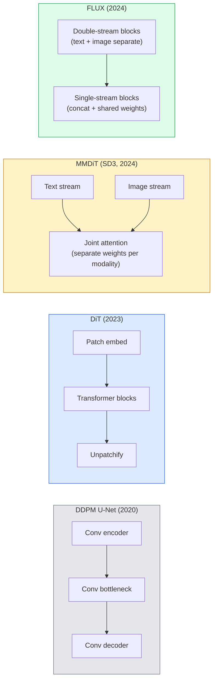

# Diffusion Transformers & Rectified Flow

> الـ U-Net ليس سر الانتشار. استبدله بمحول، واستبدل جدول الضوضاء بتدفق خط مستقيم، وفجأة لديك SD3، FLUX، وكل 2026 نموذج تحويل النص إلى صورة.

** النوع: ** تعلم + بناء
** اللغات: ** بايثون
**المتطلبات الأساسية:** المرحلة الرابعة الدرس 10 (الانتشار DDPM)، المرحلة 4 الدرس 14 (ViT)، المرحلة 7 الدرس 02 (الانتباه الذاتي)
**الوقت:** ~75 دقيقة

## Learning Objectives

- تتبع التطور من U-Net DDPM (الدرس 10) إلى محول الانتشار (DiT)، وMMDiT (SD3)، وDiT أحادي + مزدوج الدفق (FLUX)
- شرح التدفق المُصحح: لماذا يتيح المسار المستقيم بين الضوضاء والبيانات للنماذج أخذ العينات في 20 خطوة بدلاً من 1000
- تنفيذ كتلة DiT صغيرة وحلقة تدريب ذات تدفق مصحح، وكلاهما أقل من 100 سطر
- تمييز متغيرات النماذج (SD3، FLUX.1-dev، FLUX.1-schnell، Z-Image، Qwen-Image) حسب البنية وعدد المعلمات والترخيص

## The Problem

قام الدرس 10 ببناء DDPM باستخدام مزيل الضوضاء U-Net. سيطرت هذه الوصفة على 2020-2023: U-Net + جدول بيتا + فقدان التنبؤ بالضوضاء. أنتجت الانتشار المستقر 1.5 و 2.1 و DALL-E 2.

لقد تجاوز كل نموذج تحويل النص إلى الصورة المتطور لعام 2026 هذا النموذج. Stable Diffusion 3، FLUX، SD4، Z-Image، Qwen-Image، Hunyuan-Image - لا شيء يستخدم U-Net. يستخدمون محولات الانتشار (DiT). يقوم SD3 وFLUX أيضًا بتبديل جدول الضوضاء DDPM للتدفق المصحح، والذي يعمل على تسوية المسار من الضوضاء إلى البيانات ويتيح الاستدلال من 1 إلى 4 خطوات مع التناسق أو المتغيرات المقطرة.

هذا التحول مهم لأنه هو السبب في أن توليد الصور القائمة على الانتشار أصبح قابلاً للتحكم ودقيقًا سريعًا (SD3/SD4 عرض النص المحلول)، والإنتاج سريعًا. إن فهم التدفق المصحح لـ DiT + هو فهم مكدس الصور التوليدية لعام 2026.

## The Concept

### From U-Net to transformer



- **DiT** (Peebles & Xie, 2023) - استبدل U-Net بمحول يشبه ViT على البقع الكامنة. التكييف عبر قاعدة الطبقة التكيفية (AdaLN).
- **MMDiT** (SD3, Esser et al., 2024) — تدفقان لهما أوزان منفصلة لرموز النص والصور التي تشترك في الاهتمام المشترك.
- **FLUX** (Black Forest Labs, 2024) - كتل N الأولى ذات تيار مزدوج مثل SD3، ثم تقوم الكتل اللاحقة بتسلسل ومشاركة الأوزان (تيار واحد) لتحقيق الكفاءة على عمق أعلى.
- **Z-Image** (2025) — DiT فعال أحادي التدفق بمعلمات 6B يتحدى "التوسع بأي ثمن".

### Rectified flow in one paragraph

DDPM يعرّف العملية الأمامية بأنها SDE صاخبة حيث يكون `x_t` تالفًا بشكل متزايد. العكس الذي تم تعلمه هو SDE ثانية، ويتم حله بـ 1000 خطوة صغيرة.

يحدد التدفق المُصحح استيفاء **الخط المستقيم** بين البيانات النظيفة والضوضاء النقية:

```
x_t = (1 - t) * x_0 + t * epsilon,     t in [0, 1]
```

تدريب شبكة للتنبؤ بالسرعة `v_theta(x_t, t) = epsilon - x_0` — الاتجاه الأمامي على طول مسار الخط المستقيم من البيانات النظيفة إلى الضوضاء (`dx_t/dt`). أثناء أخذ العينات، يمكنك دمج هذه السرعة للخلف للانتقال من الضوضاء نحو البيانات. الناتج ODE أقرب بكثير إلى الخط المستقيم، لذلك هناك حاجة إلى خطوات تكامل أقل لأخذ العينات.

SD3 يسمي هذا **مطابقة التدفق المعدلة**. FLUX وZ-Image ومعظم موديلات 2026 تستخدم نفس الهدف. الاستدلال النموذجي: 20-30 خطوة أويلر (حتمية) مقابل 50+ DDIM خطوة في النظام DDPM القديم. المقطر / توربو / شنيل / LCM المتغيرات تأخذها إلى 1-4 خطوات.

### AdaLN conditioning

شرط DiTs على الخطوة الزمنية والفئة/النص عبر **قاعدة الطبقة التكيفية**: توقع `scale` و `shift` من متجه التكييف وتطبيقهما بعد LayerNorm. أنظف بكثير من تعديل نمط FiLM في شبكات U-Nets والإعداد الافتراضي في كل DiT الحديثة.

```
cond -> MLP -> (scale, shift, gate)
norm(x) * (1 + scale) + shift, then residual add * gate
```

### Text encoders in SD3 and FLUX

- **SD3** يستخدم ثلاثة برامج تشفير نصية: نموذجان CLIP + T5-XXL. يتم دمج التضمينات وتغذيتها في دفق الصورة كتكييف للنص.
- **FLUX** يستخدم واحد CLIP-L + T5-XXL.
- تستخدم متغيرات **Qwen-Image / Z-Image** برامج ترميز النصوص الداخلية الخاصة بها والمتوافقة مع قاعدتها LLMs.

يعد برنامج تشفير النص جزءًا كبيرًا من السبب وراء كون SD3/FLUX سببًا أفضل بكثير من SD1.5. T5-XXL وحدها 4.7B بارامترات.

### Classifier-free guidance still holds

يغير التدفق المصحح جهاز أخذ العينات، وليس التكييف. يعمل التوجيه الخالي من المصنف (إسقاط النص باحتمال 10% أثناء التدريب، ومزج التنبؤات المشروطة وغير المشروطة عند الاستدلال) بشكل مماثل مع التدفق المصحح. تستخدم معظم نماذج 2026 مقياس التوجيه 3.5-5 — أقل من SD1.5's 7.5 لأن نماذج التدفق المصحح تتبع المطالبات بشكل أكثر إحكامًا بشكل افتراضي.

### Consistency, Turbo, Schnell, LCM

أربعة أسماء لنفس الفكرة: تحويل نموذج بطيء متعدد الخطوات إلى نموذج سريع متعدد الخطوات.

- **LCM (نموذج الاتساق الكامن)** — تدريب الطالب على توقع النتيجة النهائية `x_0` من أي وسيط `x_t` في خطوة واحدة.
- **SDXL توربو / FLUX شنيل** — نماذج من 1-4 خطوات تم تدريبها باستخدام التقطير الانتشاري المعاكس.
- **SD Turbo** — نماذج الاتساق على طراز OpenAI تتكيف مع الانتشار الكامن.

خدمة الإنتاج لأي طراز جديد من السفن هي نقطة تفتيش "كاملة الجودة" ومتغير "توربو / شنيل". يعمل شنيل ("سريع" باللغة الألمانية، اتفاقية Black Forest Labs) في 1-4 خطوات ويناسب خطوط pip في الوقت الفعلي.

### Model landscape in 2026

| نموذج | الحجم | العمارة | الترخيص |
|-------|------|-------------|---------|
| الانتشار المستقر 3 متوسط ​​| 2ب | ممدت | SAI المجتمع |
| انتشار مستقر 3.5 كبير | 8 ب | ممدت | SAI المجتمع |
| FLUX.1-ديف | 12ب | مزدوج + تيار واحد DiT | غير تجاري |
| FLUX.1-شنيل | 12ب | نفس المقطر | أباتشي 2.0 |
| FLUX.2 | — | مكرر FLUX.1 | مختلط |
| صورة Z | 6 ب | S3-DiT (دفق فردي قابل للتطوير) | مباح |
| كوين-إيماج | ~20 ب | DiT + برج نص كوين | أباتشي 2.0 |
| هونيوان-Image-3.0 | ~80 ب | ديت | بحث |
| SD4 توربو | 3ب | DiT + التقطير | SAI تجاري |

FLUX.1-schnell هو الإعداد الافتراضي مفتوح المصدر لعام 2026. Z-Image هي الشركة الرائدة في مجال الكفاءة. FLUX.2 وSD4 هي نصائح الجودة الحالية.

### Why this phase shift matters

DDPM + اليو نت اشتغلت. يعمل التدفق المصحح DiT + ** بشكل أفضل وأسرع ومقياس أكثر نظافة **. يوازي الانتقال من شبكات RNN إلى المحولات في NLP: كلا المعماريين حلا نفس المشكلة، لكن المحولات تم تغيير حجمها وأصبحت تهيمن الآن. تستخدم كل ورقة 2026 على صورة أو فيديو أو جيل ثلاثي الأبعاد مزيل الضوضاء على شكل DiT وعادةً ما يكون هدف التدفق المصحح. أصبحت U-Net DDPM الآن تعليمية في المقام الأول (الدرس 10).

## Build It

### Step 1: A DiT block with AdaLN

```python
import torch
import torch.nn as nn


class AdaLNZero(nn.Module):
    """
    Adaptive LayerNorm with a gate. Predicts (scale, shift, gate) from the conditioning.
    Init such that the whole block starts as identity ("zero init").
    """

    def __init__(self, dim, cond_dim):
        super().__init__()
        self.norm = nn.LayerNorm(dim, elementwise_affine=False)
        self.mlp = nn.Linear(cond_dim, dim * 3)
        nn.init.zeros_(self.mlp.weight)
        nn.init.zeros_(self.mlp.bias)

    def forward(self, x, cond):
        scale, shift, gate = self.mlp(cond).chunk(3, dim=-1)
        h = self.norm(x) * (1 + scale.unsqueeze(1)) + shift.unsqueeze(1)
        return h, gate.unsqueeze(1)


class DiTBlock(nn.Module):
    def __init__(self, dim=192, heads=3, mlp_ratio=4, cond_dim=192):
        super().__init__()
        self.adaln1 = AdaLNZero(dim, cond_dim)
        self.attn = nn.MultiheadAttention(dim, heads, batch_first=True)
        self.adaln2 = AdaLNZero(dim, cond_dim)
        self.mlp = nn.Sequential(
            nn.Linear(dim, dim * mlp_ratio),
            nn.GELU(),
            nn.Linear(dim * mlp_ratio, dim),
        )

    def forward(self, x, cond):
        h, gate1 = self.adaln1(x, cond)
        a, _ = self.attn(h, h, h, need_weights=False)
        x = x + gate1 * a
        h, gate2 = self.adaln2(x, cond)
        x = x + gate2 * self.mlp(h)
        return x
```

يبدأ `AdaLNZero` كرسم خرائط للهوية لأنه تمت تهيئة أوزان MLP إلى الصفر. التدريب يدفع الكتلة بعيدًا عن الهوية؛ يؤدي هذا إلى استقرار نماذج نشر المحولات العميقة بشكل كبير.

### Step 2: A tiny DiT

```python
def timestep_embedding(t, dim):
    import math
    half = dim // 2
    freqs = torch.exp(-math.log(10000) * torch.arange(half, device=t.device) / half)
    args = t[:, None].float() * freqs[None]
    return torch.cat([args.sin(), args.cos()], dim=-1)


class TinyDiT(nn.Module):
    def __init__(self, image_size=16, patch_size=2, in_channels=3, dim=96, depth=4, heads=3):
        super().__init__()
        self.patch_size = patch_size
        self.num_patches = (image_size // patch_size) ** 2
        self.patch = nn.Conv2d(in_channels, dim, kernel_size=patch_size, stride=patch_size)
        self.pos = nn.Parameter(torch.zeros(1, self.num_patches, dim))
        self.time_mlp = nn.Sequential(
            nn.Linear(dim, dim * 2),
            nn.SiLU(),
            nn.Linear(dim * 2, dim),
        )
        self.blocks = nn.ModuleList([DiTBlock(dim, heads, cond_dim=dim) for _ in range(depth)])
        self.norm_out = nn.LayerNorm(dim, elementwise_affine=False)
        self.head = nn.Linear(dim, patch_size * patch_size * in_channels)

    def forward(self, x, t):
        n = x.size(0)
        x = self.patch(x)
        x = x.flatten(2).transpose(1, 2) + self.pos
        t_emb = self.time_mlp(timestep_embedding(t, self.pos.size(-1)))
        for blk in self.blocks:
            x = blk(x, t_emb)
        x = self.norm_out(x)
        x = self.head(x)
        return self._unpatchify(x, n)

    def _unpatchify(self, x, n):
        p = self.patch_size
        h = w = int(self.num_patches ** 0.5)
        x = x.view(n, h, w, p, p, -1).permute(0, 5, 1, 3, 2, 4).reshape(n, -1, h * p, w * p)
        return x
```

### Step 3: Rectified flow training

```python
import torch.nn.functional as F

def rectified_flow_train_step(model, x0, optimizer, device):
    model.train()
    x0 = x0.to(device)
    n = x0.size(0)
    t = torch.rand(n, device=device)
    epsilon = torch.randn_like(x0)
    x_t = (1 - t[:, None, None, None]) * x0 + t[:, None, None, None] * epsilon

    target_velocity = epsilon - x0
    pred_velocity = model(x_t, t)

    loss = F.mse_loss(pred_velocity, target_velocity)
    optimizer.zero_grad()
    loss.backward()
    optimizer.step()
    return loss.item()
```

قارن مع فقدان التنبؤ بالضوضاء لـ DDPM (الدرس 10): نفس البنية وهدف مختلف. بدلاً من التنبؤ بالضوضاء `epsilon`، نتوقع **السرعة** `epsilon - x_0`، التي تشير من البيانات إلى الضوضاء على طول الاستيفاء في الخط المستقيم.

### Step 4: Euler sampler

التدفق المصحح هو ODE. تعد طريقة أويلر هي الأسهل، وبالنسبة لنموذج التدفق المصحح المدرب جيدًا، فهي تقريبًا دقيقة مثل الحلول ذات الترتيب الأعلى في أكثر من 20 خطوة.

```python
@torch.no_grad()
def rectified_flow_sample(model, shape, steps=20, device="cpu"):
    model.eval()
    x = torch.randn(shape, device=device)
    dt = 1.0 / steps
    t = torch.ones(shape[0], device=device)
    for _ in range(steps):
        v = model(x, t)
        x = x - dt * v
        t = t - dt
    return x
```

20 خطوة. في النموذج المدرب، ينتج هذا عينات مماثلة لـ 1000 خطوة DDPM.

### Step 5: End-to-end smoke test

```python
import numpy as np

def synthetic_blobs(num=200, size=16, seed=0):
    rng = np.random.default_rng(seed)
    out = np.zeros((num, 3, size, size), dtype=np.float32)
    yy, xx = np.meshgrid(np.arange(size), np.arange(size), indexing="ij")
    for i in range(num):
        cx, cy = rng.uniform(4, size - 4, size=2)
        r = rng.uniform(2, 4)
        mask = (xx - cx) ** 2 + (yy - cy) ** 2 < r ** 2
        colour = rng.uniform(-1, 1, size=3)
        for c in range(3):
            out[i, c][mask] = colour[c]
    return torch.from_numpy(out)
```

تدريب `TinyDiT` على هذا مع التدفق المصحح. بعد 500 خطوة، يجب أن تبدو المخرجات التي تم أخذ عينات منها مثل نقاط باهتة من الألوان.

## Use It

لتوليد صورة حقيقية باستخدام FLUX / SD3 / Z-Image، `diffusers` يشحن كل منها بـ API موحد:

```python
from diffusers import FluxPipeline, StableDiffusion3Pipeline
import torch

pipe = FluxPipeline.from_pretrained(
    "black-forest-labs/FLUX.1-schnell",
    torch_dtype=torch.bfloat16,
).to("cuda")

out = pipe(
    prompt="a golden retriever surfing a tsunami, hyperrealistic, studio lighting",
    guidance_scale=0.0,           # schnell was trained without CFG
    num_inference_steps=4,
    max_sequence_length=256,
).images[0]
out.save("surf.png")
```

ثلاثة خطوط. `FLUX.1-schnell` في أربع خطوات. قم بتبديل معرف النموذج بـ `black-forest-labs/FLUX.1-dev` للحصول على جودة أعلى في 20-30 خطوة باستخدام CFG.

ل SD3:

```python
pipe = StableDiffusion3Pipeline.from_pretrained(
    "stabilityai/stable-diffusion-3.5-large",
    torch_dtype=torch.bfloat16,
).to("cuda")
out = pipe(prompt, guidance_scale=3.5, num_inference_steps=28).images[0]
```

## Ship It

ينتج هذا الدرس:

- `outputs/prompt-dit-model-picker.md` — يتم الاختيار بين SD3 وFLUX.1-dev وFLUX.1-schnell وZ-Image وSD4 Turbo نظرًا للجودة وزمن الوصول وقيود الترخيص.
- `outputs/skill-rectified-flow-trainer.md` — يكتب حلقة تدريب كاملة للتدفق المصحح باستخدام عينات AdaLN DiT وEuler.

## Exercises

1. **(سهل)** قم بتدريب TinyDiT أعلاه على مجموعة بيانات blob الاصطناعية لمدة 500 خطوة. قارن العينات المنتجة بـ 10 و20 و50 خطوة أويلر.
2. **(متوسط)** أضف تكييف النص عن طريق ربط تضمين الفصل الدراسي الذي تم تعلمه بتضمين الوقت (10 "فئات" نقطية حسب اللون). عينة من الفئة 0 و5 و9 وتحقق من تطابق الألوان.
3. **(صعب)** حساب مسافة فريشيه (FID الوكيل) بين العينات التي تم إنشاؤها من التدفق المصحح وإصدارات DDPM من الشبكة ذات الحجم نفسه المدربة على نفس البيانات لنفس عدد الخطوات. التقرير الذي يتقارب بشكل أسرع.

## Key Terms

| مصطلح | ماذا يقول الناس | ماذا يعني في الواقع |
|------|----------------|----------------------|
| ديت | "محول الانتشار" | المحول الذي يحل محل U-Net باعتباره مزيل الضوضاء للانتشار؛ يعمل على الكمانات المرقعة |
| ادالن | "قاعدة الطبقة التكيفية" | Timestep/تكييف النص من خلال المقياس المتعلم، والتحول، والبوابة المطبقة بعد LayerNorm؛ المعيار في كل DiT الحديثة |
| ممدت | "DiT متعدد الوسائط (SD3)" | تدفقات وزن منفصلة لرموز النص والصور التي تشترك في الاهتمام الذاتي المشترك |
| تيار واحد / تيار مزدوج | "FLUX خدعة" | أول N يحظر التدفق المزدوج (أوزان منفصلة لكل طريقة)، ثم يحظر لاحقًا تيارًا واحدًا (متزامنًا + أوزان مشتركة) لتحقيق الكفاءة |
| التدفق المصحح | "ضوضاء الخط المستقيم للبيانات" | الاستيفاء الخطي بين البيانات والضوضاء؛ تتنبأ الشبكة بالسرعة؛ عدد أقل من الخطوات ODE اللازمة عند الاستدلال |
| هدف السرعة | "ابسيلون - x_0" | هدف الانحدار في التدفق المصحح؛ نقاط من البيانات النظيفة إلى الضوضاء |
| CFG الهداية | "إرشادات خالية من المصنف" | مزج التنبؤات المشروطة وغير المشروطة؛ لا تزال تستخدم في نماذج التدفق المصحح |
| شنيل / توربو / LCM | "التقطير من 1 إلى 4 خطوات" | متغيرات صغيرة مستخرجة من نماذج عالية الجودة؛ الإنتاج في الوقت الحقيقي |

## Further Reading

- [Scalable Diffusion Models with Transformers (Peebles & Xie, 2023)](https://arxiv.org/abs/2212.09748) — the DiT paper
- [Scaling Rectified Flow Transformers (Esser et al., SD3 paper)](https://arxiv.org/abs/2403.03206) — MMDiT والتدفق المصحح على نطاق واسع
- [FLUX.1 model card and technical report (Black Forest Labs)](https://huggingface.co/black-forest-labs/FLUX.1-dev) — double + single-stream details
- [Z-Image: Efficient Image Generation Foundation Model (2025)](https://arxiv.org/html/2511.22699v1) — تيار واحد DiT عند 6B
- [Elucidating the Design Space of Diffusion (Karras et al., 2022)](https://arxiv.org/abs/2206.00364) — the reference for every diffusion design trade-off
- [Latent Consistency Models (Luo et al., 2023)](https://arxiv.org/abs/2310.04378) — كيف LCM-LoRA يمنحك استنتاجًا من 4 خطوات
