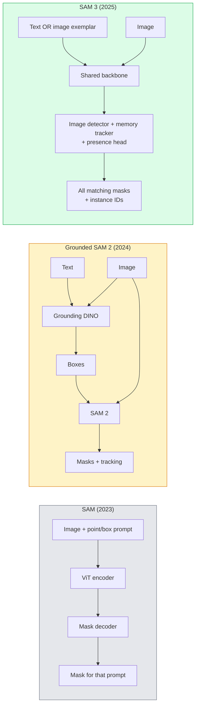

# SAM 3 وتجزئة المفردات المفتوحة
> قم بإعطاء النموذج رسالة نصية وصورة واحصل على أقنعة لكل كائن مطابق. SAM 3 قام بتمريرة أمامية واحدة.
**النوع:** استخدام + بناء
** اللغات: ** بايثون
**المتطلبات الأساسية:** المرحلة الرابعة الدرس 07 (U-Net)، المرحلة الرابعة الدرس 08 (القناع R-CNN)، المرحلة الرابعة الدرس 18 (CLIP)
**الوقت:** ~60 دقيقة
## أهداف التعلم
- التمييز بين SAM (المطالبات المرئية فقط)، المؤرض SAM / SAM 2 (الكاشف + SAM)، وSAM 3 (المطالبات النصية الأصلية عبر تجزئة المفاهيم القابلة للاستدعاء)
- شرح بنية SAM 3: العمود الفقري المشترك + كاشف الصور + متعقب الفيديو القائم على الذاكرة + رأس الحضور + تصميم متتبع الكاشف المنفصل
- استخدم التكامل Hugging Face `transformers` SAM 3 للكشف عن النص وتقسيمه وتتبع الفيديو
- اختر بين SAM 3، مؤرض SAM 2، YOLO-العالم، وSAM-MI استنادًا إلى زمن الاستجابة وتعقيد المفهوم وهدف النشر
## المشكلة
كان SAM لعام 2023 نموذجًا للمطالبة المرئية فقط: تقوم بالنقر فوق نقطة أو رسم مربع ويقوم بإرجاع قناع. بالنسبة إلى "أعطني كل البرتقال الموجود في هذه الصورة"، كنت بحاجة إلى كاشف (التأريض DINO) لإنتاج الصناديق، ثم SAM لتقسيم كل منها. لقد حول SAM المؤرض هذا إلى pipeline، لكنه كان عبارة عن سلسلة من نموذجين مجمدين مع تراكم الأخطاء الحتمي.
SAM 3 (Meta، نوفمبر 2025، ICLR 2026) أدى إلى انهيار السلسلة المتتالية. فهو يقبل عبارة اسمية قصيرة أو نموذج صورة كموجه ويعيد جميع الأقنعة المطابقة ومعرفات المثيلات في تمرير أمامي واحد. هذا هو **تقسيم المفهوم الفوري (PCS)**. بالاشتراك مع تحديث Object Multiplex في مارس 2026 (SAM 3.1)، فإنه يتتبع مثيلات متعددة لنفس المفهوم من خلال الفيديو بكفاءة.
يدور هذا الدرس حول التحول الهيكلي الذي يمثله هذا. تم دمج الفصل ثنائي الأبعاد والكشف وتأريض الصورة النصية في نموذج واحد. لم يعد سؤال الإنتاج هو "أي pipeline أقوم بربطه معًا" ولكن "أي نموذج قابل للتنفيذ يتعامل مع حالة الاستخدام الخاصة بي من البداية إلى النهاية."
##المفهوم
### الأجيال الثلاثة


### تقسيم المفهوم الفوري
"موجه المفهوم" عبارة عن عبارة اسمية قصيرة (`"yellow school bus"`، `"striped red umbrella"`، `"hand holding a mug"`) أو نموذج صورة. يقوم النموذج بإرجاع أقنعة التجزئة لكل مثيل في الصورة يطابق المفهوم، بالإضافة إلى مثيل فريد ID لكل تطابق.
ويختلف هذا عن الموجه المرئي الكلاسيكي SAM بثلاث طرق:
1. لا يلزم وجود مطالبة لكل مثيل - تقوم مطالبة نصية واحدة بإرجاع جميع المطابقات.
2. المفردات المفتوحة – يمكن أن يكون المفهوم أي شيء يمكن وصفه باللغة الطبيعية.
3. إرجاع مثيلات متعددة في وقت واحد بدلاً من قناع واحد لكل موجه.
### القطع المعمارية الرئيسية
- **العمود الفقري المشترك** — يقوم ViT واحد بمعالجة الصورة. يقرأ منه كل من رأس الكاشف وجهاز التتبع المعتمد على الذاكرة.
- **رأس الحضور** — يتنبأ بوجود المفهوم في الصورة أم لا. يفصل "هل هذا هنا؟" من "أين هو؟". يقلل من الإيجابيات الكاذبة على المفاهيم الغائبة.
- **جهاز تعقب الكاشف المنفصل** — يحتوي الكشف على مستوى الصورة والتتبع على مستوى الفيديو على رؤوس منفصلة بحيث لا تتداخل.
- **بنك الذاكرة** — يخزن الميزات لكل مثيل عبر الإطارات لتتبع الفيديو (يتم استخدام نفس الآلية SAM 2).
### التدريب على نطاق واسع
تم تدريب SAM 3 على **4 مليون مفهوم فريد** تم إنشاؤها بواسطة محرك بيانات يقوم بالتعليق والتصحيح بشكل متكرر باستخدام AI + مراجعة بشرية. يحتوي معيار **SA-CO** الجديد على 270 ألف مفهوم فريد، أي أكبر بمقدار 50 مرة من معايير الأداء السابقة. SAM 3 يصل إلى 75-80% من الأداء البشري في SA-CO ويضاعف الأنظمة الموجودة على الصورة + الفيديو PCS.
### SAM 3.1 تعدد إرسال الكائنات
تحديث مارس 2026: **Object Multiplex** يقدم آلية ذاكرة مشتركة للتتبع المشترك للعديد من مثيلات نفس المفهوم في وقت واحد. في السابق، كان تتبع المثيلات N يعني وجود N بنوك ذاكرة منفصلة. يقوم تعدد الإرسال بدمج ذلك في ذاكرة مشتركة واحدة مع استعلامات لكل مثيل. النتيجة: تتبع أسرع بكثير للكائنات المتعددة دون التضحية بالدقة.
### حيث لا يزال SAM مهمًا في عام 2026
- عندما تحتاج إلى تبديل كاشف مفردات مفتوح محدد في (DINO-X, Florence-2).
- عندما يكون ترخيص SAM 3 (مُدرج في HF) مانعًا.
- عندما تحتاج إلى مزيد من التحكم في عتبة الكاشف أكثر من SAM 3 عمليات تعريض.
- لأغراض البحث/الاستئصال على مكون الكاشف.
وحدات pipelines لا يزال لها مكان. بالنسبة لمعظم أعمال الإنتاج، SAM 3 هو الجواب الأبسط.
### YOLO-العالم مقابل SAM 3
- **YOLO-World** — كاشف المفردات المفتوحة فقط (بدون أقنعة). في الوقت الحالى. الأفضل عندما تحتاج إلى صناديق بمعدل إطارات عالية في الثانية.
- **SAM 3** — التجزئة الكاملة + التتبع. إنتاج أبطأ ولكن أكثر ثراء.
تقسيم الإنتاج: YOLO-عالم الاكتشاف السريع فقط pipelines (التنقل الآلي، ولوحات المعلومات السريعة)، SAM 3 لأي شيء يحتاج إلى أقنعة أو تتبع.
### SAM-MI الكفاءة
SAM-MI (2025-2026) يتناول عنق الزجاجة في وحدة فك ترميز SAM. الأفكار الرئيسية:
- **المطالبة بنقاط متفرقة** — تستخدم بعض النقاط المختارة جيدًا بدلاً من المطالبات الكثيفة؛ يقلل من مكالمات وحدة فك التشفير بنسبة 96%.
- **تجميع الأقنعة الضحلة** — يدمج تنبؤات الأقنعة التقريبية في قناع واحد أكثر وضوحًا.
- **حقن القناع المنفصل** — يتلقى جهاز فك التشفير ميزات القناع المحسوبة مسبقًا بدلاً من إعادة التشغيل.
النتيجة: ~1.6× تسريع على الأرض-SAM على معايير المفردات المفتوحة.
### تنسيق الإخراج للنماذج الثلاثة
تُرجع جميعها نفس البنية العامة (المربعات + التسميات + النتائج + الأقنعة + المعرفات)، وهو أمر مفيد - لا يلزم أن يتفرع خط pipeline الخاص بك إلى أي نموذج يتم تشغيله.
## بنائها
### الخطوة 1: البناء الفوري
أنشئ مساعدًا يحول جملة المستخدم إلى قائمة من SAM 3 مطالبات مفاهيمية. هذه هي الحدود التي يلتقي فيها "ما كتبه المستخدم" مع "ما يستهلكه النموذج".
```python
def split_concepts(sentence):
    """
    Heuristic splitter for multi-concept prompts.
    Returns list of short noun phrases.
    """
    for sep in [",", ";", "and", "or", "&"]:
        if sep in sentence:
            parts = [p.strip() for p in sentence.replace("and ", ",").split(",")]
            return [p for p in parts if p]
    return [sentence.strip()]

print(split_concepts("cats, dogs and balloons"))
```

SAM 3 يقبل فكرة واحدة لكل تمريرة أمامية؛ بالنسبة للاستعلامات متعددة المفاهيم، قم بتكرارها أو تجميعها.
### الخطوة الثانية: مساعدو ما بعد المعالجة
قم بتحويل مخرجات SAM 3 الأولية إلى قائمة نظيفة من الاكتشافات التي تتوافق مع المرحلة 4 الدرس 16 pipeline.
```python
from dataclasses import dataclass
from typing import List

@dataclass
class ConceptDetection:
    concept: str
    instance_id: int
    box: tuple          # (x1, y1, x2, y2)
    score: float
    mask_rle: str       # run-length encoded


def rle_encode(binary_mask):
    flat = binary_mask.flatten().astype("uint8")
    runs = []
    prev, count = flat[0], 0
    for v in flat:
        if v == prev:
            count += 1
        else:
            runs.append((int(prev), count))
            prev, count = v, 1
    runs.append((int(prev), count))
    return ";".join(f"{v}x{c}" for v, c in runs)
```

RLE يبقي حمولات الاستجابة صغيرة حتى بالنسبة للعديد من الأقنعة عالية الدقة. يعمل نفس التنسيق عبر SAM 2، SAM 3، مؤرض SAM 2.
### الخطوة 3: واجهة موحدة لتجزئة المفردات المفتوحة
قم بتغليف أي واجهة خلفية لديك (SAM 3, Grounded SAM 2, YOLO-World + SAM 2) خلف طريقة واحدة. لا يتغير رمز المصب الخاص بك عندما تتغير الواجهة الخلفية.
```python
from abc import ABC, abstractmethod
import numpy as np

class OpenVocabSeg(ABC):
    @abstractmethod
    def detect(self, image: np.ndarray, concept: str) -> List[ConceptDetection]:
        ...


class StubOpenVocabSeg(OpenVocabSeg):
    """
    Deterministic stub used for pipeline testing when real models are not loaded.
    """
    def detect(self, image, concept):
        h, w = image.shape[:2]
        return [
            ConceptDetection(
                concept=concept,
                instance_id=0,
                box=(w * 0.2, h * 0.3, w * 0.5, h * 0.8),
                score=0.89,
                mask_rle="0x100;1x50;0x200",
            ),
            ConceptDetection(
                concept=concept,
                instance_id=1,
                box=(w * 0.55, h * 0.25, w * 0.85, h * 0.75),
                score=0.74,
                mask_rle="0x80;1x40;0x220",
            ),
        ]
```

ستشمل الفئة الفرعية `SAM3OpenVocabSeg` الحقيقية `transformers.Sam3Model` و `Sam3Processor`.
### الخطوة 4: Hugging Face SAM 3 الاستخدام (مرجع)
بالنسبة للنموذج الفعلي، التكامل `transformers`:
```python
from transformers import Sam3Processor, Sam3Model
import torch

processor = Sam3Processor.from_pretrained("facebook/sam3")
model = Sam3Model.from_pretrained("facebook/sam3").eval()

inputs = processor(images=pil_image, return_tensors="pt")
inputs = processor.set_text_prompt(inputs, "yellow school bus")

with torch.no_grad():
    outputs = model(**inputs)

masks = processor.post_process_masks(
    outputs.masks, inputs.original_sizes, inputs.reshaped_input_sizes
)
boxes = outputs.boxes
scores = outputs.scores
```

موجه واحد، يتم إرجاع جميع التطابقات في مكالمة واحدة.
### الخطوة 5: قم بقياس ما قدمه لك Grounded SAM 2 مجانًا
معيار صادق: ماذا يحدث عندما تستبدل Grounded SAM 2 بـ SAM 3 في سطر pipe حقيقي؟
- زمن الوصول: SAM 3 يحفظ تمريرة أمامية واحدة (لا يوجد كاشف منفصل) ولكن النموذج نفسه أثقل؛ عادةً ما يكون صافيًا محايدًا أو تسريعًا طفيفًا.
- الدقة: SAM 3 أفضل بكثير في المفاهيم النادرة أو التركيبية ("المظلة الحمراء المخططة"). مماثلة في المفاهيم الشائعة المكونة من كلمة واحدة.
- المرونة: يتيح لك Grounded SAM 2 إمكانية تبديل أجهزة الكشف (DINO-X، Florence-2، Grounding DINO 1.5)؛ SAM 3 متجانسة.
الاستنتاج: SAM 3 هو الإعداد الافتراضي لـ 2026 open-vocab seg. لا يزال SAM 2 المؤرض هو الحل الصحيح عندما تحتاج إلى مرونة الكاشف أو شروط ترخيص مختلفة.
## استخدمه
أنماط نشر الإنتاج:
- **تعليق توضيحي في الوقت الفعلي** — SAM 3 + CVAT ميزة مطالبة التصنيف كنص. يقوم المدونون بتحديد اسم التصنيف؛ SAM 3 قم بتسمية كل مثيل مطابق مسبقًا. مراجعة وتصحيح.
- **تحليلات الفيديو** — SAM 3.1 تعدد إرسال الكائنات لتتبع الكائنات المتعددة؛ إطارات التغذية إلى جهاز التعقب المعتمد على الذاكرة.
- **الروبوتات** — SAM 3 لمعالجة المفردات المفتوحة ("التقط الكأس الأحمر")؛ يعمل كتخطيط بدائي.
- **التصوير الطبي** — SAM 3 تم ضبطه جيدًا على المفاهيم الطبية؛ يتطلب طلب الوصول في HF.
تقوم Ultralytics بتغليف SAM 3 في حزمة Python الخاصة بها:
```python
from ultralytics import SAM

model = SAM("sam3.pt")
results = model(image_path, prompts="yellow school bus")
```

نفس الواجهة مثل YOLO وSAM 2.
## اشحنها
ينتج هذا الدرس:
- `outputs/prompt-open-vocab-stack-picker.md` — مطالبة تختار SAM 3 / مؤرض SAM 2 / YOLO-World / SAM-MI استنادًا إلى زمن الاستجابة وتعقيد المفهوم والترخيص.
- `outputs/skill-concept-prompt-designer.md` — مهارة تحول كلام المستخدم إلى SAM 3 مطالبات مفاهيمية جيدة الصياغة (التقسيم، وتوضيح الغموض، والخيارات الاحتياطية).
## تمارين
1. **(سهل)** قم بتشغيل SAM 3 على 10 صور مع مطالبات المفهوم التي تختارها. قارن مع SAM 2 + التأريض DINO 1.5 على نفس الصور. قم بالإبلاغ عن المفاهيم التي غاب عنها كل نموذج.
2. **(متوسط)** أنشئ "انقر للتضمين / انقر للاستبعاد" UI أعلى SAM 3: يُرجع الموجه النصي المثيلات المرشحة؛ تحتفظ نقرات المستخدم بالنقرات التي تعتبر إيجابية. قم بإخراج المفهوم النهائي المحدد كـ JSON.
3. **(صعب)** الضبط الدقيق SAM 3 على مجموعة مفاهيم مخصصة (على سبيل المثال، 5 أنواع من المكونات الإلكترونية) تحتوي كل منها على 20 صورة مصنفة. قارن بالطلقة الصفرية SAM 3 في نفس مجموعة الاختبار؛ قياس تحسين IoU قناع.
## المصطلحات الرئيسية
| مصطلح | ماذا يقول الناس | ماذا يعني في الواقع |
|------|----------------|----------------------|
| تجزئة المفردات المفتوحة | "التقسيم حسب النص" | قم بإنتاج أقنعة للكائنات الموصوفة باللغة الطبيعية، وليس مجموعة تسميات ثابتة |
| __المصطلح_1__ | "تجزئة المفهوم الفوري" | SAM 3 المهمة الأساسية - بالنظر إلى عبارة اسمية أو صورة نموذجية، قم بتقسيم جميع الحالات المطابقة |
| موجه المفهوم | "إدخال النص" | عبارة اسمية قصيرة أو نموذج صورة؛ ليست جملة كاملة |
| رأس الوجود | "هل هو هنا؟" | SAM 3 وحدة تقرر ما إذا كان المفهوم موجودًا في الصورة قبل الترجمة |
| SA-CO | "SAM 3 المعيار" | معيار تجزئة المفردات المفتوحة بمفهوم 270K؛ أكبر بمقدار 50 مرة من معايير المفردات المفتوحة السابقة |
| كائن متعدد | "SAM تحديث 3.1" | تتبع الكائنات المتعددة في الذاكرة المشتركة؛ تتبع مشترك سريع للعديد من الحالات |
| مؤرض SAM 2 | "وحدة pipeline" | كاشف + SAM 2 تتالي؛ لا تزال ذات صلة عندما يكون تبادل الكاشف مهمًا |
| SAM-MI | "متغير SAM الفعال" | حقن القناع لتسريع 1.6x على الأرض-SAM |
## مزيد من القراءة
- [SAM 3: Segment Anything with Concepts (arXiv 2511.16719)](https://arxiv.org/abs/2511.16719)
- [SAM 3.1 Object Multiplex (Meta AI, March 2026)](https://ai.meta.com/blog/segment-anything-model-3/)
- [SAM 3 model page on Hugging Face](https://huggingface.co/facebook/sam3)
- [Grounded SAM 2 tutorial (PyImageSearch)](https://pyimagesearch.com/2026/01/19/grounded-sam-2-from-open-set-detection-to-segmentation-and-tracking/)
- [Ultralytics SAM 3 docs](https://docs.ultralytics.com/models/sam-3/)
- [SAM3-I: Instruction-aware SAM (arXiv 2512.04585)](https://arxiv.org/abs/2512.04585)