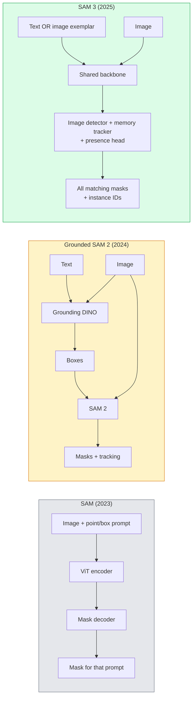

# SAM 3 & Open-Vocabulary Segmentation

> قم بإعطاء النموذج رسالة نصية وصورة واحصل على أقنعة لكل كائن مطابق. SAM 3 قام بتمريرة أمامية واحدة.

**النوع:** استخدام + بناء
** اللغات: ** بايثون
**المتطلبات:** المرحلة الرابعة الدرس 07 (U-Net)، المرحلة الرابعة الدرس 08 (قناع R-CNN)، المرحلة الرابعة الدرس 18 (CLIP)
**الوقت:** ~60 دقيقة

## Learning Objectives

- التمييز SAM (المطالبات المرئية فقط)، المؤرض SAM / SAM 2 (الكاشف + SAM)، و SAM 3 (المطالبات النصية الأصلية عبر تجزئة المفهوم الفوري)
- شرح بنية SAM 3: العمود الفقري المشترك + كاشف الصور + متعقب الفيديو القائم على الذاكرة + رأس الحضور + تصميم متتبع الكاشف المنفصل
- استخدم التكامل Hugging Face `transformers` SAM 3 للكشف عن النص وتقسيمه وتتبع الفيديو
- اختر بين SAM 3، مؤرض SAM 2، YOLO-العالم، وSAM-MI بناءً على زمن الوصول وتعقيد المفهوم وهدف النشر

## The Problem

كان 2023 SAM نموذجًا مرئيًا سريعًا فقط: تقوم بالنقر فوق نقطة أو رسم مربع ويقوم بإرجاع قناع. من أجل "أعطني كل البرتقال في هذه الصورة" كنت بحاجة إلى كاشف (التأريض DINO) لإنتاج الصناديق، ثم SAM لتقسيم كل منها. مؤرض SAM حول هذا إلى pipeline، لكنه كان عبارة عن سلسلة من نموذجين مجمدين مع تراكم أخطاء لا مفر منه.

SAM 3 (ميتا، نوفمبر 2025، ICLR 2026) انهارت السلسلة. فهو يقبل عبارة اسمية قصيرة أو نموذج صورة كموجه ويعيد جميع الأقنعة المطابقة ومعرفات المثيلات في تمرير أمامي واحد. هذا هو **تجزئة المفهوم الفوري (PCS)**. بالاشتراك مع تحديث Object Multiplex في مارس 2026 (SAM 3.1)، فإنه يتتبع مثيلات متعددة لنفس المفهوم من خلال الفيديو بكفاءة.

يدور هذا الدرس حول التحول الهيكلي الذي يمثله هذا. تم دمج الفصل ثنائي الأبعاد والكشف وتأريض الصورة النصية في نموذج واحد. لم يعد سؤال الإنتاج هو "ما هو الخط الذي أقوم بربطه معًا" ولكن "ما هو النموذج القابل للتنفيذ الذي يتعامل مع حالة الاستخدام الخاصة بي من البداية إلى النهاية."

## The Concept

### The three generations



### Promptable Concept Segmentation

"موجه المفهوم" عبارة عن عبارة اسمية قصيرة (`"yellow school bus"`، `"striped red umbrella"`، `"hand holding a mug"`) أو نموذج صورة. يقوم النموذج بإرجاع أقنعة التجزئة لكل مثيل في الصورة يطابق المفهوم، بالإضافة إلى مثيل فريد ID لكل تطابق.

وهذا يختلف عن الموجه البصري الكلاسيكي SAM بثلاث طرق:

1. لا يلزم وجود مطالبة لكل مثيل - تقوم مطالبة نصية واحدة بإرجاع جميع المطابقات.
2. المفردات المفتوحة – يمكن أن يكون المفهوم أي شيء يمكن وصفه باللغة الطبيعية.
3. إرجاع مثيلات متعددة في وقت واحد بدلاً من قناع واحد لكل موجه.

### Key architectural pieces

- **العمود الفقري المشترك** — يقوم ViT واحد بمعالجة الصورة. يقرأ منه كل من رأس الكاشف وجهاز التتبع المعتمد على الذاكرة.
- **رأس الحضور** — يتنبأ بوجود المفهوم في الصورة أم لا. يفصل "هل هذا هنا؟" من "أين هو؟". يقلل من الإيجابيات الكاذبة على المفاهيم الغائبة.
- **جهاز تعقب الكاشف المنفصل** — يحتوي الكشف على مستوى الصورة والتتبع على مستوى الفيديو على رؤوس منفصلة بحيث لا تتداخل.
- **بنك الذاكرة** — يخزن الميزات لكل مثيل عبر الإطارات لتتبع الفيديو (نفس الآلية SAM 2 مستخدمة).

### Training at scale

تم تدريب SAM 3 على **4 ملايين مفهوم فريد** تم إنشاؤها بواسطة محرك بيانات يقوم بالتعليق والتصحيح بشكل متكرر باستخدام AI + مراجعة بشرية. يحتوي المعيار **SA-CO** الجديد على 270 ألف مفهوم فريد، وهو أكبر بمقدار 50 مرة من المعايير السابقة. SAM3 يصل إلى 75-80% من أداء الإنسان على SA-CO ويضاعف الأنظمة الموجودة على الصورة + الفيديو PCS.

### SAM 3.1 Object Multiplex

تحديث مارس 2026: **Object Multiplex** يقدم آلية ذاكرة مشتركة للتتبع المشترك للعديد من مثيلات نفس المفهوم في وقت واحد. في السابق، كان تتبع المثيلات N يعني وجود N بنوك ذاكرة منفصلة. يقوم تعدد الإرسال بدمج ذلك في ذاكرة مشتركة واحدة مع استعلامات لكل مثيل. النتيجة: تتبع أسرع بكثير للكائنات المتعددة دون التضحية بالدقة.

### Where Grounded SAM still matters in 2026

- عندما تحتاج إلى تبديل كاشف مفردات مفتوح محدد في (DINO-X، فلورنسا-2).
- عندما تكون رخصة SAM 3 (بوابة على HF) مانعة.
- عندما تحتاج إلى تحكم أكبر في عتبة الكاشف من SAM 3 تعريضات.
- لأغراض البحث/الاستئصال على مكون الكاشف.

لا يزال للخطوط pip المعيارية مكان. بالنسبة لمعظم أعمال الإنتاج، SAM 3 هي الإجابة الأبسط.

### YOLO-World vs SAM 3

- **YOLO-World** — كاشف المفردات المفتوحة فقط (بدون أقنعة). في الوقت الحالى. الأفضل عندما تحتاج إلى صناديق بمعدل إطارات عالية في الثانية.
- **SAM 3** — تجزئة كاملة + تتبع. إنتاج أبطأ ولكن أكثر ثراء.

تقسيم الإنتاج: YOLO-عالم الكشف السريع-فقط pipelines (ملاحة الروبوتات، لوحات المعلومات السريعة)، SAM3 لأي شيء يحتاج إلى أقنعة أو تتبع.

### SAM-MI efficiency

SAM-MI (2025-2026) عناوين عنق الزجاجة لوحدة فك التشفير SAM. الأفكار الرئيسية:

- **المطالبة بنقاط متفرقة** — تستخدم بعض النقاط المختارة جيدًا بدلاً من المطالبات الكثيفة؛ يقلل من مكالمات وحدة فك التشفير بنسبة 96%.
- **تجميع الأقنعة الضحلة** — يدمج تنبؤات الأقنعة التقريبية في قناع واحد أكثر وضوحًا.
- **حقن القناع المنفصل** — يتلقى جهاز فك التشفير ميزات القناع المحسوبة مسبقًا بدلاً من إعادة التشغيل.

النتيجة: ~1.6× تسريع على الأرض-SAM على معايير المفردات المفتوحة.

### Output format for the three models

جميعها تُرجع نفس البنية العامة (الصناديق + الملصقات + النتائج + الأقنعة + المعرفات)، وهو أمر مفيد - لا يلزم أن يتفرع خط pipeline الخاص بك إلى أي نموذج يعمل.

## Build It

### Step 1: Prompt construction

أنشئ مساعدًا يحول جملة المستخدم إلى قائمة من SAM 3 مطالبات مفاهيمية. هذه هي الحدود التي يلتقي فيها "ما كتبه المستخدم" مع "ما يستهلكه النموذج".

```python
def split_concepts(sentence):
    """
    Heuristic splitter for multi-concept prompts.
    Returns list of short noun phrases.
    """
    for sep in [",", ";", "and", "or", "&"]:
        if sep in sentence:
            parts = [p.strip() for p in sentence.replace("and ", ",").split(",")]
            return [p for p in parts if p]
    return [sentence.strip()]

print(split_concepts("cats, dogs and balloons"))
```

SAM 3 يقبل فكرة واحدة لكل تمريرة أمامية؛ بالنسبة للاستعلامات متعددة المفاهيم، قم بتكرارها أو تجميعها.

### Step 2: Post-processing helpers

قم بتحويل مخرجات SAM 3 الأولية إلى قائمة نظيفة من الاكتشافات التي تتوافق مع عقد المرحلة 4 الخاص بنا 16 pipeline.

```python
from dataclasses import dataclass
from typing import List

@dataclass
class ConceptDetection:
    concept: str
    instance_id: int
    box: tuple          # (x1, y1, x2, y2)
    score: float
    mask_rle: str       # run-length encoded


def rle_encode(binary_mask):
    flat = binary_mask.flatten().astype("uint8")
    runs = []
    prev, count = flat[0], 0
    for v in flat:
        if v == prev:
            count += 1
        else:
            runs.append((int(prev), count))
            prev, count = v, 1
    runs.append((int(prev), count))
    return ";".join(f"{v}x{c}" for v, c in runs)
```

RLE يبقي حمولات الاستجابة صغيرة حتى بالنسبة للعديد من الأقنعة عالية الدقة. يعمل نفس التنسيق عبر SAM 2، SAM 3، مؤرض SAM 2.

### Step 3: A unified open-vocab segmentation interface

قم بلف أي واجهة خلفية لديك (SAM 3، مؤرضة SAM 2، YOLO-World + SAM 2) خلف طريقة واحدة. لا يتغير رمز المصب الخاص بك عندما تتغير الواجهة الخلفية.

```python
from abc import ABC, abstractmethod
import numpy as np

class OpenVocabSeg(ABC):
    @abstractmethod
    def detect(self, image: np.ndarray, concept: str) -> List[ConceptDetection]:
        ...


class StubOpenVocabSeg(OpenVocabSeg):
    """
    Deterministic stub used for pipeline testing when real models are not loaded.
    """
    def detect(self, image, concept):
        h, w = image.shape[:2]
        return [
            ConceptDetection(
                concept=concept,
                instance_id=0,
                box=(w * 0.2, h * 0.3, w * 0.5, h * 0.8),
                score=0.89,
                mask_rle="0x100;1x50;0x200",
            ),
            ConceptDetection(
                concept=concept,
                instance_id=1,
                box=(w * 0.55, h * 0.25, w * 0.85, h * 0.75),
                score=0.74,
                mask_rle="0x80;1x40;0x220",
            ),
        ]
```

ستلتف الفئة الفرعية `SAM3OpenVocabSeg` الحقيقية `transformers.Sam3Model` و `Sam3Processor`.

### Step 4: Hugging Face SAM 3 usage (reference)

بالنسبة للنموذج الفعلي، التكامل `transformers`:

```python
from transformers import Sam3Processor, Sam3Model
import torch

processor = Sam3Processor.from_pretrained("facebook/sam3")
model = Sam3Model.from_pretrained("facebook/sam3").eval()

inputs = processor(images=pil_image, return_tensors="pt")
inputs = processor.set_text_prompt(inputs, "yellow school bus")

with torch.no_grad():
    outputs = model(**inputs)

masks = processor.post_process_masks(
    outputs.masks, inputs.original_sizes, inputs.reshaped_input_sizes
)
boxes = outputs.boxes
scores = outputs.scores
```

موجه واحد، يتم إرجاع جميع التطابقات في مكالمة واحدة.

### Step 5: Measure what Grounded SAM 2 gave you for free

معيار صادق: ماذا يحدث عندما تستبدل مؤرض SAM 2 بـ SAM 3 في خط pip حقيقي؟

- الكمون: SAM 3 يحفظ تمريرة أمامية واحدة (لا يوجد كاشف منفصل) ولكن النموذج نفسه أثقل؛ عادةً ما يكون صافيًا محايدًا أو تسريعًا طفيفًا.
- الدقة: SAM 3 أفضل بكثير في المفاهيم النادرة أو التركيبية ("المظلة الحمراء المخططة"). مماثلة في المفاهيم الشائعة المكونة من كلمة واحدة.
- المرونة: يتيح لك مؤرض SAM 2 تبديل أجهزة الكشف (DINO-X، فلورنسا-2، التأريض DINO 1.5)؛ SAM 3 متجانسة.

الخلاصة: SAM 3 هو الإعداد الافتراضي لـ 2026 open-vocab seg. لا يزال مؤرض SAM 2 هو الحل الصحيح عندما تحتاج إلى مرونة الكاشف أو شروط ترخيص مختلفة.

## Use It

أنماط نشر الإنتاج:

- **تعليق توضيحي في الوقت الفعلي** — SAM 3 + CVAT ميزة المطالبة بالتسمية كنص. يقوم المدونون بتحديد اسم التصنيف؛ SAM 3 تسميات مسبقة لكل مثيل مطابق. مراجعة وتصحيح.
- **تحليلات الفيديو** — SAM 3.1 تعدد إرسال الكائنات لتتبع الكائنات المتعددة؛ إطارات التغذية إلى جهاز التعقب المعتمد على الذاكرة.
- **الروبوتات** — SAM 3 لمعالجة المفردات المفتوحة ("التقط الكأس الأحمر")؛ يعمل كتخطيط بدائي.
- **التصوير الطبي** — SAM 3 تم ضبطها بدقة على المفاهيم الطبية؛ يتطلب طلب الوصول على HF.

يلتف Ultralytics SAM 3 في حزمة Python الخاصة به:

```python
from ultralytics import SAM

model = SAM("sam3.pt")
results = model(image_path, prompts="yellow school bus")
```

نفس الواجهة مثل YOLO وSAM 2.

## Ship It

ينتج هذا الدرس:

- `outputs/prompt-open-vocab-stack-picker.md` — مطالبة تختار SAM 3 / مؤرض SAM 2 / YOLO-العالم / SAM-MI استنادًا إلى زمن الوصول وتعقيد المفهوم والترخيص.
- `outputs/skill-concept-prompt-designer.md` — مهارة تحول أقوال المستخدم إلى مطالبات مفاهيمية SAM 3 جيدة الصياغة (التقسيم، وتوضيح الغموض، والخيارات الاحتياطية).

## Exercises

1. **(سهل)** قم بتشغيل SAM 3 على 10 صور مع مطالبات المفهوم التي تختارها. قارن مع SAM 2 + التأريض DINO 1.5 على نفس الصور. قم بالإبلاغ عن المفاهيم التي غاب عنها كل نموذج.
2. **(متوسط)** أنشئ "انقر للتضمين / انقر للاستبعاد" UI أعلى SAM 3: يُرجع الموجه النصي مثيلات المرشح؛ تحتفظ نقرات المستخدم بالنقرات التي تعتبر إيجابية. قم بإخراج المفهوم النهائي المحدد كـ JSON.
3. **(صعب)** الضبط الدقيق SAM 3 على مجموعة مفاهيم مخصصة (على سبيل المثال، 5 أنواع من المكونات الإلكترونية) مع 20 صورة مصنفة لكل منها. قارن بالطلقة الصفرية SAM 3 في نفس مجموعة الاختبار؛ قياس تحسين IoU قناع.

## Key Terms

| مصطلح | ماذا يقول الناس | ماذا يعني في الواقع |
|------|----------------|----------------------|
| تجزئة المفردات المفتوحة | "التقسيم حسب النص" | قم بإنتاج أقنعة للكائنات الموصوفة باللغة الطبيعية، وليس مجموعة تسميات ثابتة |
| PCS | "تجزئة المفهوم الفوري" | المهمة الأساسية SAM 3 - بالنظر إلى عبارة اسمية أو نموذج صورة، قم بتقسيم جميع الحالات المطابقة |
| موجه المفهوم | "إدخال النص" | عبارة اسمية قصيرة أو نموذج صورة؛ ليست جملة كاملة |
| رأس الوجود | "هل هو هنا؟" | SAM 3 وحدة تقرر ما إذا كان المفهوم موجودًا في الصورة قبل الترجمة |
| SA - CO | "SAM 3 معيار" | معيار تجزئة المفردات المفتوحة بمفهوم 270K؛ أكبر بمقدار 50 مرة من معايير المفردات المفتوحة السابقة |
| كائن متعدد | "تحديث SAM 3.1" | تتبع الكائنات المتعددة في الذاكرة المشتركة؛ تتبع مشترك سريع للعديد من الحالات |
| مطحون SAM2 | "وحدات pipeline" | كاشف + SAM 2 تتالي ؛ لا تزال ذات صلة عندما يكون تبادل الكاشف مهمًا |
| SAM - MI | "البديل الفعال SAM" | حقن القناع لتسريع 1.6x على الأرض-SAM |

## Further Reading

- [SAM 3: Segment Anything with Concepts (arXiv 2511.16719)](https://arxiv.org/abs/2511.16719)
- [SAM 3.1 Object Multiplex (Meta AI, March 2026)](https://ai.meta.com/blog/segment-anything-model-3/)
- [SAM 3 model page on Hugging](https://huggingface.co/facebook/sam3)
- [Grounded SAM 2 tutorial (PyImageSearch)](https://pyimagesearch.com/2026/01/19/grounded-sam-2-from-open-set-detection-to-segmentation-and-tracking/)
- [Ultralytics SAM 3 docs](https://docs.ultralytics.com/models/sam-3/)
- [SAM3-I: Instruction-aware SAM (arXiv 2512.04585)](https://arxiv.org/abs/2512.04585)
