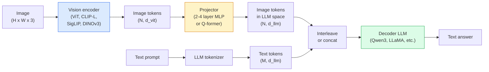

# Vision-Language Models — The ViT-MLP-LLM Pattern

> يقوم برنامج تشفير الرؤية بتحويل الصورة إلى رموز مميزة. يقوم جهاز العرض MLP بتعيين تلك الرموز المميزة في مساحة التضمين LLM. نموذج اللغة يقوم بالباقي. هذا النمط - ViT-MLP-LLM - هو كل إنتاج VLM في عام 2026.

**النوع:** تعلم + استخدم
** اللغات: ** بايثون
** المتطلبات الأساسية: ** المرحلة 4 الدرس 14 (ViT)، المرحلة 4 الدرس 18 (CLIP)، المرحلة 7 الدرس 02 (الانتباه الذاتي)
**الوقت:** ~75 دقيقة

## Learning Objectives

- اذكر بنية ViT-MLP-LLM واشرح ما يساهم به كل مكون من المكونات الثلاثة
- قارن بين Qwen3-VL وInternVL3.5 وLLaVA-Next وGLM-4.6V في عدد المعلمات وطول السياق والأداء القياسي
- شرح DeepStack: لماذا تعمل ميزات ViT متعددة المستويات على تشديد محاذاة لغة الرؤية بشكل أفضل من ميزة الطبقة الأخيرة الفردية
- قياس VLM الهلوسة في الإنتاج باستخدام معدل الخطأ عبر الوسائط (CMER) والتصرف بناءً على الإشارة

## The Problem

CLIP (المرحلة 4 الدرس 18) تمنحك مساحة تضمين مشتركة للصور والنصوص، وهي كافية لتصنيف واسترجاع اللقطات الصفرية. لا يمكنه الإجابة على "كم عدد السيارات الحمراء الموجودة في هذه الصورة؟" لأن CLIP لا يُنشئ نصًا — فهو يسجل أوجه التشابه فقط.

نماذج لغة الرؤية (VLMs) - Qwen3-VL، InternVL3.5، LLaVA-Next، GLM-4.6V - قم بربط برنامج تشفير الصور CLIP بنموذج لغة كامل. يرى النموذج صورة بالإضافة إلى سؤال ويولد إجابة. في عام 2026، تنافست VLMs مفتوحة المصدر أو تغلبت على GPT-5 وGemini-2.5-Pro ​​في معايير الوسائط المتعددة (MMMU، MMBench، DocVQA، ChartQA، MathVista، OSWorld).

الثلاثي القطع (ViT، جهاز العرض، LLM) هو المعيار. الاختلافات بين النماذج هي في أي ViT، أي جهاز عرض، أي LLM، بيانات التدريب، وصفة المحاذاة. بمجرد فهم النمط، يصبح تبديل أي مكون أمرًا ميكانيكيًا.

## The Concept

### The ViT-MLP-LLM architecture



1. **جهاز تشفير الرؤية** — جهاز ViT مُدرب مسبقًا (CLIP-L/14 أو SigLIP أو DINOv3 أو متغير مضبوط بدقة). تنتج رموز التصحيح.
2. **جهاز العرض** — وحدة صغيرة (2-4 طبقات MLP، أو Q-former) تقوم بتعيين رموز الرؤية المميزة في بُعد تضمين LLM. هذا هو المكان الذي يحدث فيه معظم الضبط الدقيق.
3. **LLM** — نموذج لغة لوحدة فك التشفير فقط (Qwen3، Llama، Mistral، GLM، InternLM). يقرأ رموز الرؤية + النص بالتسلسل، ويولد النص.

جميع القطع الثلاث قابلة للتدريب من حيث المبدأ. من الناحية العملية، يظل جهاز تشفير الرؤية وLLM مجمدين في الغالب أثناء تدريب جهاز العرض - بضعة مليارات من معلمات الإشارة بسعر رخيص.

### DeepStack

يستخدم إسقاط الفانيليا طبقة ViT الأخيرة فقط. تتميز عينات DeepStack (Qwen3-VL) من أعماق ViT المتعددة وتقوم بتكديسها. تحمل الطبقات الأعمق دلالات عالية المستوى؛ تحمل الطبقات الضحلة معلومات مكانية وتركيبية دقيقة الحبيبات. يؤدي إدخال كليهما في LLM إلى سد الفجوة بين "ما تحتويه الصورة" (دلالات) و"أين بالضبط" (التأريض المكاني).

### Three training stages

يتم تدريب VLMs الحديثة على مراحل:

1. **المحاذاة** — تجميد ViT وLLM. قم بتدريب جهاز العرض فقط على أزواج تعليق الصور. يعلم جهاز العرض رسم خريطة لمساحة الرؤية في مساحة اللغة.
2. **التدريب المسبق** — قم بإلغاء تجميد كل شيء. التدريب على بيانات الصور والنصوص المتداخلة واسعة النطاق (أكثر من 500 مليون زوج). يبني المعرفة البصرية للنموذج.
3. **ضبط التعليمات** — الضبط الدقيق للثلاثيات المنسقة (الصورة، السؤال، الإجابة). يعلم سلوك المحادثة وتنسيقات المهام. هذا هو ما يحول "الرؤية الواعية LM" إلى مساعد قابل للاستخدام.

تقوم معظم LoRA بضبط المرحلة المستهدفة 3 باستخدام مجموعة بيانات صغيرة مصنفة.

### Model family comparison (early 2026)

| نموذج | بارامس | تشفير الرؤية | LLM | السياق | نقاط القوة |
|-------|--------|----------------|-----|---------|-----------|
| Qwen3-VL-235B-A22B (وزارة البيئة) | 235ب (22ب نشط) | مخصص ViT + DeepStack | كوين3 | 256 ألف | عام SOTA, GUI وكيل |
| Qwen3-VL-30B-A3B (وزارة البيئة) | 30B (3B نشط) | مخصص ViT + DeepStack | كوين3 | 256 ألف | بديل أصغر لوزارة التربية والتعليم |
| Qwen3-VL-8B (كثيف) | 8 ب | مخصص فيت | كوين3 | 128 ألف | الإنتاج الكثيف الافتراضي |
| إنترنVL3.5-38B | 38 ب | انترنفيت-6B | Qwen3 + GPT-OSS | 128 ألف | قوي MMBench / MMVet |
| إنترنVL3.5-241B-A28B | 241ب (28ب نشط) | انترنفيت-6B | كوين3 | 128 ألف | تنافس مع GPT-4o |
| LLaVA-التالي 72B | 72ب | سيجليب | اللاما-3 | 32 ألف | مفتوحة وسهلة الضبط |
| GLM-4.6 فولت | ~70 ب | مخصص | GLM | 64 ك | مفتوح المصدر قوي OCR |
| MiniCPM-V-2.6 | 8 ب | سيجليب | التكلفة البسيطة لكل ألف ظهور | 32 ألف | صديقة للحواف |

### Visual agents

يصل Qwen3-VL-235B إلى أعلى أداء عالمي على OSWorld - وهو معيار **الوكلاء المرئيين** الذين يقومون بتشغيل واجهات المستخدم الرسومية (سطح المكتب، الهاتف المحمول، الويب). يرى النموذج لقطة شاشة، ويفهم UI، ويصدر إجراءات (انقر، اكتب، قم بالتمرير). ومن خلال دمجه مع الأدوات، فإنه يغلق الحلقة المتعلقة بمهام سطح المكتب الشائعة. هذا هو ما يتم تشغيله في معظم العروض التوضيحية لعام 2026 "AI PC" تحت الغطاء.

### Agentic capabilities + RoPE variants

تحتاج VLMs إلى معرفة **متى** يوجد إطار في مقطع فيديو. تطورت Qwen3-VL من T-RoPE (تضمين الموضع الدوار المؤقت) إلى **محاذاة الوقت المستندة إلى النص** — رموز نصية واضحة للطابع الزمني متداخلة مع إطارات الفيديو. يرى النموذج "`<timestamp 00:32>` إطار، موجه" ويمكنه التفكير في العلاقات الزمنية.

### The alignment problem

تحتوي 12% من أزواج الصور والنصوص في مجموعة البيانات التي تم الزحف إليها على أوصاف غير مرتكزة بشكل كامل على الصورة. A VLM الذي تم تدريبه على هذا يتعلم بصمت الهلوسة - اختلاق الأشياء، وإساءة قراءة الأرقام، واختراع العلاقات. في الإنتاج، هذا هو وضع الفشل السائد.

قدم Skywork.ai **معدل الخطأ عبر الوسائط (CMER)** لتتبعه:

```
CMER = fraction of outputs where the text confidence is high but the image-text similarity (via a CLIP-family checker) is low
```

عالية CMER تعني أن العارضة تقول بثقة أشياء لا أساس لها في الصورة. مراقبة CMER والتعامل معها على أنها إنتاج KPI خفض معدل الهلوسة بنسبة ~ 35٪ في انتشارها. الحيلة ليست في "إصلاح النموذج" بل في "توجيه المخرجات العالية CMER إلى المراجعة البشرية".

### Fine-tuning with LoRA / QLoRA

الضبط الدقيق الكامل لـ 70B VLM بعيد المنال بالنسبة لمعظم الفرق. LoRA (المرتبة 16-64) على طبقات الانتباه + جهاز العرض، أو QLoRA بأوزان أساسية 4 بت، تناسب A100 / H100 منفردة. التكلفة: 5000-50000 مثال، 100-5000 دولار في الحوسبة، 2-10 ساعات من التدريب.

### Spatial reasoning is still weak

تسجل VLMs الحالية ما بين 50 إلى 60% في معايير الاستدلال المكاني (فوق وتحت، واليسار واليمين، والعد، والمسافة). إذا كانت حالة الاستخدام الخاصة بك تعتمد على "الكائن الموجود فوقه"، فقم بالتحقق بشكل كبير - أداء VLM العام أقل من الأداء البشري. بدائل أفضل من VLM للمهام المكانية البحتة: مقدر نقطة رئيسية/وضعية متخصص، أو نموذج عمق، أو نموذج كشف بهندسة الصندوق بعد المعالجة.

## Build It

### Step 1: The projector

الجزء الذي سوف تدربه في أغلب الأحيان. 2-4 طبقة MLP مع GELU.

```python
import torch
import torch.nn as nn


class Projector(nn.Module):
    def __init__(self, vit_dim=768, llm_dim=4096, hidden=4096):
        super().__init__()
        self.net = nn.Sequential(
            nn.Linear(vit_dim, hidden),
            nn.GELU(),
            nn.Linear(hidden, llm_dim),
        )

    def forward(self, x):
        return self.net(x)
```

الإدخال هو موتر الرمز المميز `(N_patches, d_vit)`. الإخراج هو `(N_patches, d_llm)`. يعامل LLM كل صف إخراج على أنه مجرد رمز مميز آخر.

### Step 2: Assemble ViT-MLP-LLM end-to-end

هيكل عظمي للتمريرة الأمامية للحد الأدنى VLM. يستخدم الكود الحقيقي `transformers`؛ هذا هو التخطيط المفاهيمي.

```python
class MinimalVLM(nn.Module):
    def __init__(self, vit, projector, llm, image_token_id):
        super().__init__()
        self.vit = vit
        self.projector = projector
        self.llm = llm
        self.image_token_id = image_token_id  # placeholder token in text prompt

    def forward(self, image, input_ids, attention_mask):
        # 1. vision features
        vision_tokens = self.vit(image)                     # (B, N_patches, d_vit)
        vision_embeds = self.projector(vision_tokens)       # (B, N_patches, d_llm)

        # 2. text embeddings
        text_embeds = self.llm.get_input_embeddings()(input_ids)  # (B, M, d_llm)

        # 3. replace image placeholder tokens with vision embeds
        merged = self._merge(text_embeds, vision_embeds, input_ids)

        # 4. run LLM
        return self.llm(inputs_embeds=merged, attention_mask=attention_mask)

    def _merge(self, text_embeds, vision_embeds, input_ids):
        out = text_embeds.clone()
        expected = vision_embeds.size(1)
        for b in range(input_ids.size(0)):
            positions = (input_ids[b] == self.image_token_id).nonzero(as_tuple=True)[0]
            if len(positions) != expected:
                raise ValueError(
                    f"batch item {b} has {len(positions)} image tokens but vision_embeds has {expected} patches."
                    " Every sample in the batch must be pre-padded to the same number of image placeholder tokens.")
            out[b, positions] = vision_embeds[b]
        return out
```

يتم استبدال العنصر النائب `<image>` في النص بتضمينات صور حقيقية - نفس النمط الذي يستخدمه LLaVA وQwen-VL وInternVL.

### Step 3: CMER computation

فحص وقت التشغيل خفيف الوزن.

```python
import torch.nn.functional as F


def cross_modal_error_rate(image_emb, text_emb, text_confidence, sim_threshold=0.25, conf_threshold=0.8):
    """
    image_emb, text_emb: embeddings of image and generated text (normalised internally)
    text_confidence:     mean per-token probability in [0, 1]
    Returns:             fraction of high-confidence outputs with low image-text alignment
    """
    image_emb = F.normalize(image_emb, dim=-1)
    text_emb = F.normalize(text_emb, dim=-1)
    sim = (image_emb * text_emb).sum(dim=-1)        # cosine similarity
    high_conf_low_sim = (text_confidence > conf_threshold) & (sim < sim_threshold)
    return high_conf_low_sim.float().mean().item()
```

تعامل مع CMER كإنتاج KPI. راقبها لكل نقطة نهاية، لكل نوع مطالبة، لكل عميل. يشير الارتفاع CMER إلى أن النموذج بدأ يهلوس عند توزيع بعض المدخلات.

### Step 4: Toy VLM classifier (runnable)

إظهار القطارات العرض. تدخل "ميزات ViT" المزيفة ؛ رمز صغير على شكل LLM يتنبأ بالفصل الدراسي.

```python
class ToyVLM(nn.Module):
    def __init__(self, vit_dim=32, llm_dim=64, num_classes=5):
        super().__init__()
        self.projector = Projector(vit_dim, llm_dim, hidden=64)
        self.head = nn.Linear(llm_dim, num_classes)

    def forward(self, vision_tokens):
        projected = self.projector(vision_tokens)
        pooled = projected.mean(dim=1)
        return self.head(pooled)
```

يمكن للمرء أن يتناسب مع أزواج اصطناعية (ميزة، فئة) في أقل من 200 خطوة - وهو ما يكفي لإظهار عمل نمط جهاز العرض.

## Use It

ثلاث طرق تستخدم بها فرق الإنتاج VLMs في عام 2026:

- **استضافته API** — OpenAI Vision، Anthropic Claude Vision، Google Gemini Vision. صفر من الأشعة تحت الحمراء، ومخاطر البائع.
- **مضيف ذاتي مفتوح المصدر** — Qwen3-VL أو InternVL3.5 عبر `transformers` و `vllm`. سيطرة كاملة، جهد أعلى في الهجوم.
- **ضبط المجال** - تحميل Qwen2.5-VL-7B أو LLaVA-1.6-7B، LoRA على أمثلة مخصصة من 5k إلى 50k، يتم تقديمها مع `vllm` أو `TGI`.

```python
from transformers import AutoProcessor, AutoModelForVision2Seq
import torch
from PIL import Image

model_id = "Qwen/Qwen3-VL-8B-Instruct"
processor = AutoProcessor.from_pretrained(model_id)
model = AutoModelForVision2Seq.from_pretrained(model_id, torch_dtype=torch.bfloat16, device_map="auto")

messages = [{
    "role": "user",
    "content": [
        {"type": "image", "image": Image.open("plot.png")},
        {"type": "text", "text": "What does this chart show?"},
    ],
}]
inputs = processor.apply_chat_template(messages, add_generation_prompt=True, tokenize=True, return_dict=True, return_tensors="pt").to("cuda")
generated = model.generate(**inputs, max_new_tokens=256)
answer = processor.decode(generated[0][inputs["input_ids"].shape[1]:], skip_special_tokens=True)
```

`apply_chat_template` يخفي ترميز العنصر النائب `<image>`؛ يعالج النموذج الدمج داخليًا.

## Ship It

ينتج هذا الدرس:

- `outputs/prompt-vlm-selector.md` — يختار Qwen3-VL / InternVL3.5 / LLaVA-Next / API مع مراعاة الدقة وزمن الوصول وطول السياق والميزانية.
- `outputs/skill-cmer-monitor.md` — يُصدر الكود لأداة نقطة نهاية الإنتاج VLM مع معدل خطأ عبر الوسائط، ولوحات معلومات لكل نقطة نهاية، وحدود تنبيه.

## Exercises

1. **(سهل)** قم بتشغيل ثلاث مطالبات ("ما هذا؟"، "عد الأشياء"، "وصف المشهد") من خلال أي VLM مفتوح على خمس صور. سجل كل إجابة على أنها صحيحة / صحيحة جزئيا / هلوسة باليد. احسب معدل التمريرة الأولى CMER.
2. **(متوسط)** ضبط Qwen2.5-VL-3B أو LLaVA-1.6-7B مع LoRA (المرتبة 16) على 500 صورة للمجال المستهدف مع التسميات التوضيحية. قارن دقة اللقطة الصفرية مع دقة نمط MMBench المضبوطة بدقة.
3. **(صعب)** استبدل برنامج تشفير الصور VLM بـ DINOv3 بدلاً من SigLIP/CLIP الافتراضي. أعد تدريب جهاز العرض فقط (المجمد LLM + DINOv3 المجمد). قياس ما إذا كانت مهام التنبؤ الكثيفة (العد، والتفكير المكاني) تتحسن.

## Key Terms

| مصطلح | ماذا يقول الناس | ماذا يعني في الواقع |
|------|----------------|----------------------|
| فيت-MLP-LLM | "النمط VLM" | تشفير الرؤية + جهاز العرض + نموذج اللغة؛ كل 2026 VLM |
| بروجكتور | "الجسر" | 2-4 طبقة MLP (أو Q-former) تقوم بتعيين رموز الرؤية في LLM مساحة التضمين |
| ديب ستاك | "خدعة Qwen3-VL المميزة" | ميزات ViT متعددة المستويات مكدسة بدلاً من الطبقة الأخيرة فقط |
| رمز الصورة | "<image> العنصر النائب" | رمز خاص في دفق النص تم استبداله بتضمينات الرؤية المسقطة |
| CMER | "الهلوسة KPI" | معدل الخطأ عبر الوسائط؛ عالية عندما تكون ثقة النص عالية ولكن تشابه الصورة والنص منخفض |
| وكيل مرئي | "VLM الذي ينقر" | VLM تشغيل واجهات المستخدم الرسومية (OSWorld، الهاتف المحمول، الويب) مع استدعاءات الأدوات |
| س-السابق | "جسر الرمز المميز ذو العدد الثابت" | BLIP- جهاز عرض بنمط 2 ينتج عددًا ثابتًا من رموز الاستعلام المرئي |
| المحاذاة / التدريب المسبق / ضبط التعليمات | "ثلاث مراحل" | قياسي VLM تدريب pipeline |

## Further Reading

- [Qwen3-VL Technical Report (arXiv 2511.21631)](https://arxiv.org/abs/2511.21631)
- [InternVL3.5 Advancing Open-Source Multimodal Models (arXiv 2508.18265)](https://arxiv.org/html/2508.18265v1)
- [LLaVA-Next series](https://llava-vl.github.io/blog/2024-05-10-llava-next-stronger-llms/)
- [BentoML: Best Open-Source VLMs 2026](https://www.bentoml.com/blog/multimodal-ai-a-guide-to-open-source-vision-language-models)
- [MMMU: Multi-discipline Multimodal Understanding benchmark](https://mmmu-benchmark.github.io/)
- [VLMs in manufacturing (Robotics Tomorrow, March 2026)](https://www.roboticstomorrow.com/story/2026/03/when-machines-learn-to-see-like-experts-the-rise-of-vision-language-models-in-manufacturing/26335/)
