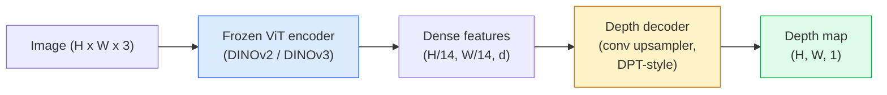

# Monocular Depth & Geometry Estimation

> خريطة العمق هي صورة ذات قناة واحدة حيث يكون كل بكسل على مسافة من الكاميرا. كان التنبؤ به من إطار واحد RGB مستحيلًا بدون استريو أو LiDAR. في عام 2026، سيصل جهاز تشفير ViT المجمد بالإضافة إلى رأس خفيف الوزن إلى نسبة قليلة من الحقيقة الأرضية.

** النوع: ** بناء + استخدام
** اللغات: ** بايثون
** المتطلبات الأساسية: ** المرحلة الرابعة الدرس 14 (ViT)، المرحلة الرابعة الدرس 17 (الرؤية الخاضعة للإشراف الذاتي)، المرحلة الرابعة الدرس 07 (U-Net)
**الوقت:** ~60 دقيقة

## Learning Objectives

- التمييز بين العمق النسبي والمتري والحالة التي يحلها كل نموذج إنتاج (MiDaS، Marigold، Depth Anything V3، ZoeDepth)
- استخدم Depth Anything V3 (العمود الفقري DINOv2) للتنبؤ بعمق الصور الفردية التعسفية بدون معايرة
- اشرح لماذا يعمل العمق الأحادي على الإطلاق من صورة واحدة (إشارات المنظور، وتدرجات النسيج، والأقدمية المكتسبة) وما لا يمكن استعادته (المقياس المطلق، والهندسة المغطاة)
- رفع الاكتشافات ثنائية الأبعاد إلى نقاط ثلاثية الأبعاد باستخدام خريطة العمق وجوهرات الكاميرا ذات الثقب

## The Problem

العمق هو المحور المفقود في رؤية الكمبيوتر ثنائية الأبعاد. بالنظر إلى RGB، فأنت تعرف أين تظهر الأشياء في مستوى الصورة؛ أنت لا تعرف إلى أي مدى هم. أجهزة استشعار العمق (أجهزة الاستريو، LiDAR، وقت الرحلة) تحل هذه المشكلة بشكل مباشر ولكنها باهظة الثمن وهشة ومحدودة النطاق.

تقدير العمق أحادي العين - التنبؤ بالعمق من إطار RGB واحد - يستخدم لإنتاج مخرجات ضبابية وغير موثوقة. بحلول عام 2026، غيرت أجهزة التشفير الكبيرة المدربة مسبقًا ما يلي: Depth Anything V3 يستخدم العمود الفقري المجمد DINOv2 وينتج خرائط عمق تعمم عبر المجالات الداخلية والخارجية والطبية والأقمار الصناعية. تعيد القطيفة صياغة العمق باعتباره مشكلة انتشار مشروط. يتراجع ZoeDepth عن المسافات المترية الحقيقية.

العمق هو أيضًا الجسر بين الكشف ثنائي الأبعاد والفهم ثلاثي الأبعاد: اضرب بكسلات المربع المكتشف في العمق وسترفع الكائن ثنائي الأبعاد إلى سحابة نقطية ثلاثية الأبعاد. هذا هو جوهر كل نظام انسداد AR، وكل خط لتجنب العوائق، وكل روبوت "التقط الكأس".

## The Concept

### Relative vs metric depth

- **العمق النسبي** — قيم `z` مرتبة بدون وحدة حقيقية. "البكسل A أقرب من البكسل B، لكن نسبة المسافات لا ترتبط بالأمتار."
- **العمق المتري** — المسافة المطلقة بالأمتار من الكاميرا. يتطلب أن يكون النموذج قد تعلم العلاقة الإحصائية بين إشارات الصورة والمسافة الحقيقية.

MiDaS و Depth Anything V3 ينتجان عمقًا نسبيًا. القطيفة تنتج عمقا نسبيا. تنتج ZoeDepth وUniDepth وMetric3D عمقًا متريًا. النماذج المترية حساسة لجوهر الكاميرا؛ النماذج النسبية ليست كذلك.

### The encoder-decoder pattern



عمق أي شيء V3 يجمد جهاز التشفير ويدرب فقط وحدة فك التشفير ذات النمط DPT. يوفر برنامج التشفير ميزات غنية؛ يقوم جهاز فك التشفير بإعادتهم إلى دقة الصورة ويتراجع عن العمق.

### Why a single image produces depth at all

تحتوي الصورة ثنائية الأبعاد على العديد من الإشارات الأحادية التي ترتبط بالعمق:

- **المنظور** — تتقارب الخطوط المتوازية ثلاثية الأبعاد في ثنائية الأبعاد.
- **تدرج الملمس** — تتميز الأسطح البعيدة بملمس أصغر حجمًا وأكثر كثافة.
- **ترتيب الإطباق** — الأجسام الأقرب تحجب الأجسام الأبعد.
- **ثبات الحجم** — تعطي الأشياء المعروفة (السيارات والبشر) مقياسًا تقريبيًا.
- **المنظور الجوي** — تبدو الأجسام البعيدة أكثر ضبابية وزرقة في المشاهد الخارجية.

يقوم ViT المدرب على مليارات الصور باستيعاب هذه الإشارات. بفضل البيانات الكافية والعمود الفقري القوي، يصل عمق العين الأحادية إلى دقة معقولة دون أي إشراف صريح ثلاثي الأبعاد.

### What monocular depth cannot do

- **المقياس المتري المطلق** بدون عناصر جوهرية أو كائن معروف في المشهد. يمكن للشبكة التنبؤ بأن "الكوب هو ضعف الملعقة" دون معرفة ما إذا كان الكوب على بعد 1 متر أو 10 متر.
- **الهندسة المغطاة** — الجزء الخلفي من الكرسي غير مرئي ولا يمكن استنتاجه بشكل موثوق.
- **أسطح غير مزخرفة/عاكسة حقًا** — المرايا والزجاج والجدران الموحدة. تقارير الشبكة عمق معقول ولكن خاطئ.

### Depth Anything V3 in 2026

- فانيليا DINOv2 ViT-L/14 كمشفر (مجمد).
- DPT فك التشفير.
- تم التدريب على أزواج الصور المطروحة من مصادر متنوعة (لا حاجة إلى إشراف واضح على العمق بما يتجاوز الاتساق الضوئي).
- يتنبأ بهندسة متسقة مكانيًا من ** عدد عشوائي من المدخلات المرئية، مع أو بدون أوضاع الكاميرا المعروفة **.
- SOTA عبر عمق أحادي العين، وهندسة أي عرض، والعرض المرئي، وتقدير وضعية الكاميرا.

هذا هو النموذج الذي يجب الاتصال به عندما تحتاج إلى العمق في عام 2026.

### Marigold — diffusion for depth

يعيد Marigold (Ke et al., CVPR 2024) صياغة تقدير العمق باعتباره نشرًا مشروطًا من صورة إلى صورة. تكييف: RGB. الهدف: خريطة العمق. يستخدم Stable Diffusion 2 U-Net المدرب مسبقًا كعمود فقري. تكون خرائط عمق المخرجات حادة بشكل استثنائي عند حدود الكائنات. المفاضلة: استدلال أبطأ من نماذج التغذية الأمامية (10-50 خطوة لتقليل الضوضاء).

### Intrinsics and the pinhole camera

لرفع بكسل `(u, v)` بعمق `d` إلى نقطة ثلاثية الأبعاد `(X, Y, Z)` في إحداثيات الكاميرا:

```
fx, fy, cx, cy = camera intrinsics
X = (u - cx) * d / fx
Y = (v - cy) * d / fy
Z = d
```

تأتي الجوهرية من البيانات الوصفية EXIF أو نمط المعايرة أو مقدر الجوهرية الأحادي (حقول المنظور، UniDepth). بدون الجوهر، لا يزال بإمكانك تقديم سحابة نقطية من خلال افتراض 60-70° FOV ومبادئ ذات دقة متوسطة - يمكن استخدامها للتصور، وليس للقياس.

### Evaluation

مقياسين قياسيين:

- **AbsRel** (خطأ نسبي مطلق): `mean(|d_pred - d_gt| / d_gt)`. أقل هو أفضل. 0.05-0.1 لنماذج الإنتاج.
- **دلتا < 1.25** (دقة العتبة): جزء من البكسل حيث `max(d_pred/d_gt, d_gt/d_pred) < 1.25`. الأعلى هو الأفضل. 0.9+ لـ SOTA.

بالنسبة للعمق النسبي (Depth Anything V3، MiDaS)، يستخدم التقييم إصدارات ثابتة من كلا المقياسين.

## Build It

### Step 1: Depth metrics

```python
import torch

def abs_rel_error(pred, target, mask=None):
    if mask is not None:
        pred = pred[mask]
        target = target[mask]
    return (torch.abs(pred - target) / target.clamp(min=1e-6)).mean().item()


def delta_accuracy(pred, target, threshold=1.25, mask=None):
    if mask is not None:
        pred = pred[mask]
        target = target[mask]
    ratio = torch.maximum(pred / target.clamp(min=1e-6), target / pred.clamp(min=1e-6))
    return (ratio < threshold).float().mean().item()
```

قم دائمًا بإخفاء بكسلات العمق غير الصالحة (صفر، NaN، مشبعة) قبل التقييم.

### Step 2: Scale-and-shift alignment

بالنسبة لنماذج العمق النسبي، قم بمحاذاة التنبؤ مع الحقيقة الأساسية قبل حساب المقاييس. تناسب المربعات الصغرى لـ `a * pred + b = target`:

```python
def align_scale_shift(pred, target, mask=None):
    if mask is not None:
        p = pred[mask]
        t = target[mask]
    else:
        p = pred.flatten()
        t = target.flatten()
    A = torch.stack([p, torch.ones_like(p)], dim=1)
    coeffs, *_ = torch.linalg.lstsq(A, t.unsqueeze(-1))
    a, b = coeffs[:2, 0]
    return a * pred + b
```

قم بتشغيل `align_scale_shift` قبل `abs_rel_error` عند تقييم MiDaS / Depth Anything.

### Step 3: Lift depth to a point cloud

```python
import numpy as np

def depth_to_point_cloud(depth, intrinsics):
    H, W = depth.shape
    fx, fy, cx, cy = intrinsics
    v, u = np.meshgrid(np.arange(H), np.arange(W), indexing="ij")
    z = depth
    x = (u - cx) * z / fx
    y = (v - cy) * z / fy
    return np.stack([x, y, z], axis=-1)


depth = np.random.uniform(0.5, 4.0, (240, 320))
intr = (320.0, 320.0, 160.0, 120.0)
pc = depth_to_point_cloud(depth, intr)
print(f"point cloud shape: {pc.shape}  (H, W, 3)")
```

وظيفة واحدة، كل تطبيق مرفوع ثلاثي الأبعاد. قم بتصدير السحابة النقطية إلى `.ply` وافتحها في MeshLab أو CloudCompare.

### Step 4: Smoke test with a synthetic depth scene

```python
def synthetic_depth(size=96):
    yy, xx = np.meshgrid(np.arange(size), np.arange(size), indexing="ij")
    # Floor: linear gradient from near (top) to far (bottom)
    depth = 1.0 + (yy / size) * 4.0
    # Box in the middle: closer
    mask = (np.abs(xx - size / 2) < size / 6) & (np.abs(yy - size * 0.6) < size / 6)
    depth[mask] = 2.0
    return depth.astype(np.float32)


gt = torch.from_numpy(synthetic_depth(96))
pred = gt + 0.3 * torch.randn_like(gt)  # simulated prediction
aligned = align_scale_shift(pred, gt)
print(f"before align  absRel = {abs_rel_error(pred, gt):.3f}")
print(f"after align   absRel = {abs_rel_error(aligned, gt):.3f}")
```

### Step 5: Depth Anything V3 usage (reference)

```python
import torch
from transformers import pipeline
from PIL import Image

pipe = pipeline(task="depth-estimation", model="LiheYoung/depth-anything-v2-large")

image = Image.open("street.jpg").convert("RGB")
out = pipe(image)
depth_np = np.array(out["depth"])
```

ثلاثة خطوط. `out["depth"]` هو PIL تدرج رمادي؛ تحويل إلى numpy للرياضيات. للحصول على عمق أي شيء V3 على وجه التحديد، قم بتبديل معرف النموذج بمجرد إصداره؛ API لم يتغير.

## Use It

- **العمق أي شيء V3** (Meta AI / ByteDance، 2024-2026) — الإعداد الافتراضي للعمق النسبي. أسرع نموذج للعمود الفقري الكبير ViT في الإنتاج.
- **القطيفة** (ETH، 2024) — أعلى جودة بصرية، واستدلال بطيء.
- **UniDepth** (ETH، 2024) — العمق المتري مع تقدير جوهر الكاميرا.
- **ZoeDepth** (Intel, 2023) — العمق المتري؛ كبار السن، لا تزال موثوقة.
- **MiDaS v3.1** — قديم لكنه مستقر؛ خط أساس جيد للمقارنة.

نمط التكامل النموذجي:

1. وصول الإطار RGB.
2. نموذج العمق ينتج خريطة العمق.
3. يقوم الكاشف بإنتاج الصناديق.
4. ارفع النقط الوسطى للصندوق من خلال العمق إلى 3D؛ دمج مع نقطة السحابة إذا كانت متوفرة.
5. المصب: AR انسداد، تخطيط المسار، تقدير حجم الكائن، استبدال ستيريو.

للاستخدام في الوقت الفعلي، يصل عمق أي شيء V2 صغير (INT8 كميًا) إلى ~30 إطارًا في الثانية على المستهلك GPU عند 518 × 518.

## Ship It

ينتج هذا الدرس:

- `outputs/prompt-depth-model-picker.md` — الاختيار بين Depth Anything V3 وMarigold وUniDepth وMiDaS مع مراعاة زمن الوصول والحاجة المترية مقابل النسبية ونوع المشهد.
- `outputs/skill-depth-to-pointcloud.md` — مهارة تقوم ببناء السحب النقطية من خرائط العمق مع التعامل الصحيح مع العناصر الجوهرية وتصديرها إلى `.ply`.

## Exercises

1. **(سهل)** قم بتشغيل أي شيء بعمق V2 على أي 10 صور لمكتبك. احفظ العمق بتدرج رمادي PNG وافحصه. حدد جسمًا واحدًا يبدو عمقه المتوقع خاطئًا واشرح سبب فشل الإشارات الأحادية.
2. **(متوسط)** معطى RGB + العمق من Depth Anything V2، ارفع إلى نقطة السحابة واعرض باستخدام `open3d`. قارن بين مشهدين (داخلي/خارجي) ولاحظ أيهما يبدو أكثر قابلية للتصديق.
3. **(صلب)** التقط خمسة أزواج من الصور التي تختلف فقط من خلال موضع كائن معروف (على سبيل المثال، تحركت الزجاجة لمسافة أقرب بمقدار 30 سم). استخدم UniDepth للتنبؤ بالعمق المتري في كليهما. قم بالإبلاغ عن دلتا المسافة المتوقعة مقابل 30 سم الحقيقية.

## Key Terms

| مصطلح | ماذا يقول الناس | ماذا يعني في الواقع |
|------|----------------|----------------------|
| عمق أحادي | "عمق الصورة الواحدة" | تقدير العمق من إطار RGB واحد، بدون استريو أو LiDAR |
| العمق النسبي | "العمق المطلوب" | قيم z مرتبة بدون وحدات في العالم الحقيقي |
| العمق المتري | "المسافة المطلقة" | العمق بالأمتار يتطلب معايرة أو نموذجًا مدربًا على الإشراف المتري |
| أبسريل | "خطأ نسبي مطلق" | يعني |d_pred - d_gt| / d_gt; مقياس العمق القياسي |
| دقة دلتا | "دلتا <1.25" | جزء من البكسلات مع توقع خلال 25% من الحقيقة الأرضية |
| الكاميرا ذات الثقب | "fx، fy، cx، cy" | نموذج الكاميرا المستخدمة لرفع (u, v, d) إلى (X, Y, Z) |
| DPT | "محول التنبؤ الكثيف" | وحدة فك التشفير القائمة على التحويل المستخدمة أعلى أجهزة تشفير ViT المجمدة للعمق |
| العمود الفقري DINOv2 | "سبب نجاحه" | ميزات الإشراف الذاتي التي يتم تعميمها عبر المجالات دون تسميات العمق |

## Further Reading

- [Depth Anything V3 paper page]( — https monocular depth with DINOv2 encoder
- [Marigold (Ke et al., CVPR 2024)](https://marigoldmomarigoldmonodepthpth.githubhub.io/) — تقدير العمق على أساس الانتشار
- [UniDepth (Piccinelli et al., 2024)](https://arxiv.org/abs/2403.18913) — metric depth with intrinsics
- [MiDaS v3.1 (Intel ISL)](https://githubhub.com/isl-org/MiDaS) — خط الأساس الأساسي للعمق النسبي
- [منشور مدونة DINOv3 (Meta)](https://ai.meta.com/blog/dinov3-self-supervised-vision-model/) — عائلة التشفير التي ترفع دقة العمق
