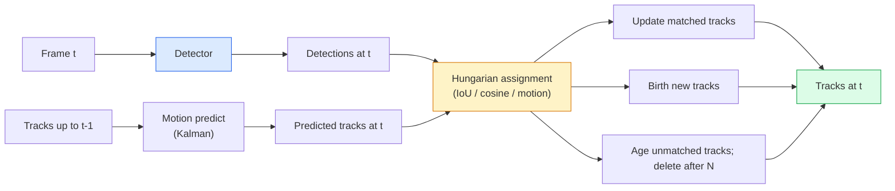

# Multi-Object Tracking & Video Memory

> التتبع هو الكشف بالإضافة إلى الارتباط. كشف كل إطار. قم بمطابقة اكتشافات هذا الإطار مع مسارات الإطار الأخير بمقدار ID.

**النوع:** بناء
** اللغات: ** بايثون
**المتطلبات:** المرحلة الرابعة الدرس 06 (YOLO الكشف)، المرحلة 4 الدرس 08 (قناع R-CNN)، المرحلة 4 الدرس 24 (SAM 3)
**الوقت:** ~60 دقيقة

## Learning Objectives

- تمييز التتبع عن طريق الكشف عن التتبع القائم على الاستعلام وتسمية عائلات الخوارزمية (SORT، DeepSORT، ByteTrack، BoT-SORT، SAM 2 Memory Tracker، SAM 3.1 Object Multiplex)
- تنفيذ IoU + المهمة المجرية من الصفر للتتبع الكلاسيكي عن طريق الكشف
- اشرح بنك ذاكرة SAM 2 ولماذا يتعامل مع الانسداد بشكل أفضل من الارتباط القائم على IoU
- اقرأ مقاييس التتبع الثلاثة (MOTA، IDF1، HOTA) واختر أي منها يهم لحالة استخدام معينة

## The Problem

يخبرك الكاشف بمكان وجود الكائنات في إطار واحد. يخبرك المتتبع بالكائن الذي تم اكتشافه في الإطار `t` وهو نفس الكائن الموجود في الإطار `t-1`. بدون ذلك، لا يمكنك حساب الأشياء التي تعبر الخط، أو متابعة الكرة عبر انسداد، أو معرفة أن "السيارة رقم 4 كانت في المسار لمدة 8 ثوانٍ".

يعد التتبع ضروريًا لكل منتج يتم عرضه بالفيديو: التحليلات الرياضية، والمراقبة، والقيادة الذاتية، وتحليل الفيديو الطبي، ومراقبة الحياة البرية، وعد العلامات النصية. تتم مشاركة اللبنات الأساسية: كاشف لكل إطار، ونموذج الحركة (مرشح كالمان أو شيء أكثر ثراءً)، وخطوة الارتباط (الخوارزمية المجرية على IoU / جيب التمام / الميزات المستفادة)، ودورة حياة المسار (الولادة، التحديث، الموت).

جلب عام 2026 نمطين جديدين: **SAM 2 التتبع القائم على الذاكرة** (ذاكرة الميزة بدلاً من اقتران نموذج الحركة) و**SAM 3.1 تعدد إرسال الكائنات** (ذاكرة مشتركة للعديد من مثيلات نفس المفهوم). يتناول هذا الدرس المكدس الكلاسيكي أولاً، ثم النهج القائم على الذاكرة.

## The Concept

### Tracking-by-detection



كل متتبع ستواجهه في عام 2026 هو شكل مختلف من هذه الحلقة. الاختلافات:

- **SORT** (2016): فلتر كالمان + IoU المجري. بسيطة وسريعة، لا يوجد نموذج المظهر.
- **DeepSORT** (2017): SORT + ميزة المظهر المستندة إلى CNN لكل مسار (تضمين ReID). التعامل مع المعابر بشكل أفضل.
- **ByteTrack** (2021): ربط عمليات الكشف منخفضة الثقة كمرحلة ثانية؛ لا توجد حاجة إلى ميزات المظهر ولكن الأداء الأفضل في MOT17.
- **BoT-SORT** (2022): بايت + تعويض حركة الكاميرا + ReID.
- **StrongSORT / OC-SORT** — أحفاد ByteTrack مع حركة ومظهر أفضل.

### Kalman filter in one paragraph

يحافظ مرشح كالمان على حالة كل مسار `(x, y, w, h, dx, dy, dw, dh)` مع تباين مشترك. في كل إطار، **توقع** الحالة باستخدام نموذج السرعة الثابتة، ثم **حدِّث** بالاكتشاف المطابق. يثق التحديث في الاكتشاف بشكل أكبر عندما يكون مستوى عدم اليقين المتوقع مرتفعًا. وهذا يعطي مسارات سلسة والقدرة على مواصلة المسار من خلال انسداد قصير (1-5 إطارات).

يستخدم كل جهاز تعقب كلاسيكي مرشح كالمان في خطوة التنبؤ بالحركة.

### The Hungarian algorithm

بالنظر إلى مصفوفة التكلفة `M x N` (المسارات x الاكتشافات)، ابحث عن التعيين الفردي الذي يقلل التكلفة الإجمالية. التكلفة عادة ما تكون `1 - IoU(track_bbox, detection_bbox)` أو تشابه جيب التمام السلبي لميزات المظهر. وقت التشغيل هو O((M+N)^3); بالنسبة لـ M وN حتى ~1000، فهو سريع بدرجة كافية في Python عبر `scipy.optimize.linear_sum_assignment`.

### ByteTrack's key idea

تقوم أدوات التتبع القياسية بإسقاط اكتشافات الثقة المنخفضة (<0.5). يبقيهم ByteTrack على أنهم **مرشحون للمرحلة الثانية**: بعد مطابقة المسارات مع الاكتشافات عالية الثقة، تحاول المسارات غير المتطابقة مطابقة الاكتشافات منخفضة الثقة مع عتبة IoU أكثر مرونة قليلاً. يستعيد الانسدادات القصيرة، ID التبديل بالقرب من الحشود.

### SAM 2 memory-based tracking

SAM 2 يتعامل مع الفيديو عن طريق الاحتفاظ بـ **بنك الذاكرة** للميزات المكانية والزمانية لكل حالة. عند إعطاء مطالبة (نقر، مربع، نص) على إطار واحد، فإنه يقوم بتشفير المثيل في الذاكرة. في الإطارات اللاحقة، يتم ربط الذاكرة بميزات الإطار الجديد، وينتج جهاز فك التشفير قناعًا لنفس المثيل في الإطار الجديد.

لا يوجد مرشح كالمان ولا مهمة هنغارية. الارتباط ضمني في عملية انتباه الذاكرة.

الايجابيات:
- قوية حتى الانسدادات الكبيرة (تحمل الذاكرة هوية المثيل عبر العديد من الإطارات).
- مفردات مفتوحة عند دمجها مع المطالبات النصية SAM 3.
- يعمل بدون نموذج حركة منفصل.

سلبيات:
- أبطأ من ByteTrack لتتبع العديد من الكائنات.
- ينمو بنك الذاكرة. يحد من نافذة السياق.

### SAM 3.1 Object Multiplex

يحتفظ التتبع المسبق SAM 2 / SAM 3 ببنك ذاكرة منفصل لكل مثيل. لـ 50 كائنًا، 50 بنكًا للذاكرة. يقوم Object Multiplex (مارس 2026) بتجميعها في ذاكرة مشتركة واحدة باستخدام **الرموز المميزة للاستعلام لكل مثيل**. يتم قياس التكلفة بشكل فرعي في عدد من الحالات.

يعد الإرسال المتعدد هو الإعداد الافتراضي الجديد لتتبع الحشود في عام 2026: حشود الحفلات الموسيقية وعمال المستودعات وتقاطعات المرور.

### Three metrics to know

- **MOTA (دقة تتبع الكائنات المتعددة)** — 1 - (FN + FP + ID مفاتيح) / GT. مرجح حسب نوع الخطأ؛ مقياس واحد يدمج بين حالات فشل الكشف والارتباط.
- **IDF1 (ID F1)** — الوسط التوافقي ID الدقة والتذكر. يركز بشكل خاص على مدى احتفاظ كل مسار للحقيقة الأرضية بـ ID بمرور الوقت. أفضل من MOTA للمهام الحساسة للتبديل ID.
- **HOTA (دقة تتبع عالية الترتيب)** — تتحلل إلى دقة الكشف (DetA) ودقة الارتباط (AssA). معيار المجتمع منذ عام 2020؛ الأكثر شمولا.

للمراقبة (من هو): IDF1 هو ما تبلغ عنه. للتحليلات الرياضية (عد التمريرات): HOTA. للمقارنة الأكاديمية العامة: HOTA.

## Build It

### Step 1: IoU-based cost matrix

```python
import numpy as np


def bbox_iou(a, b):
    """
    a, b: (N, 4) arrays of [x1, y1, x2, y2].
    Returns (N_a, N_b) IoU matrix.
    """
    ax1, ay1, ax2, ay2 = a[:, 0], a[:, 1], a[:, 2], a[:, 3]
    bx1, by1, bx2, by2 = b[:, 0], b[:, 1], b[:, 2], b[:, 3]
    inter_x1 = np.maximum(ax1[:, None], bx1[None, :])
    inter_y1 = np.maximum(ay1[:, None], by1[None, :])
    inter_x2 = np.minimum(ax2[:, None], bx2[None, :])
    inter_y2 = np.minimum(ay2[:, None], by2[None, :])
    inter = np.clip(inter_x2 - inter_x1, 0, None) * np.clip(inter_y2 - inter_y1, 0, None)
    area_a = (ax2 - ax1) * (ay2 - ay1)
    area_b = (bx2 - bx1) * (by2 - by1)
    union = area_a[:, None] + area_b[None, :] - inter
    return inter / np.clip(union, 1e-8, None)
```

### Step 2: Minimal SORT-style tracker

تم حذف كالمان للسرعة الثابتة الثابتة للإيجاز - نستخدم هنا اقتران IoU بسيطًا؛ في الإنتاج، يعد توقع كالمان أمرًا ضروريًا. توفر حزمة `sort` Python النسخة الكاملة.

```python
from scipy.optimize import linear_sum_assignment


class Track:
    def __init__(self, tid, bbox, frame):
        self.id = tid
        self.bbox = bbox
        self.last_frame = frame
        self.hits = 1

    def update(self, bbox, frame):
        self.bbox = bbox
        self.last_frame = frame
        self.hits += 1


class SimpleTracker:
    def __init__(self, iou_threshold=0.3, max_age=5):
        self.tracks = []
        self.next_id = 1
        self.iou_threshold = iou_threshold
        self.max_age = max_age

    def step(self, detections, frame):
        if not self.tracks:
            for d in detections:
                self.tracks.append(Track(self.next_id, d, frame))
                self.next_id += 1
            return [(t.id, t.bbox) for t in self.tracks]

        track_boxes = np.array([t.bbox for t in self.tracks])
        det_boxes = np.array(detections) if len(detections) else np.empty((0, 4))

        iou = bbox_iou(track_boxes, det_boxes) if len(det_boxes) else np.zeros((len(track_boxes), 0))
        cost = 1 - iou
        cost[iou < self.iou_threshold] = 1e6

        matched_track = set()
        matched_det = set()
        if cost.size > 0:
            row, col = linear_sum_assignment(cost)
            for r, c in zip(row, col):
                if cost[r, c] < 1.0:
                    self.tracks[r].update(det_boxes[c], frame)
                    matched_track.add(r); matched_det.add(c)

        for i, d in enumerate(det_boxes):
            if i not in matched_det:
                self.tracks.append(Track(self.next_id, d, frame))
                self.next_id += 1

        self.tracks = [t for t in self.tracks if frame - t.last_frame <= self.max_age]
        return [(t.id, t.bbox) for t in self.tracks]
```

60 سطرًا. يأخذ اكتشافات لكل إطار، ويعيد معرفات المسار لكل إطار. تضيف الأنظمة الحقيقية توقع كالمان، وإعادة مباراة ByteTrack في المرحلة الثانية، وميزات المظهر.

### Step 3: Synthetic trajectory test

```python
def synthetic_frames(num_frames=20, num_objects=3, H=240, W=320, seed=0):
    rng = np.random.default_rng(seed)
    starts = rng.uniform(20, 200, size=(num_objects, 2))
    velocities = rng.uniform(-5, 5, size=(num_objects, 2))
    frames = []
    for f in range(num_frames):
        dets = []
        for i in range(num_objects):
            cx, cy = starts[i] + f * velocities[i]
            dets.append([cx - 10, cy - 10, cx + 10, cy + 10])
        frames.append(dets)
    return frames


tracker = SimpleTracker()
for f, dets in enumerate(synthetic_frames()):
    tracks = tracker.step(dets, f)
```

يجب أن تحتفظ ثلاثة كائنات تتحرك في خطوط مستقيمة بمعرفاتها عبر جميع الإطارات العشرين.

### Step 4: ID-switch metric

```python
def count_id_switches(tracks_per_frame, gt_per_frame):
    """
    tracks_per_frame:  list of list of (track_id, bbox)
    gt_per_frame:      list of list of (gt_id, bbox)
    Returns number of ID switches.
    """
    prev_assignment = {}
    switches = 0
    for tracks, gts in zip(tracks_per_frame, gt_per_frame):
        if not tracks or not gts:
            continue
        t_boxes = np.array([b for _, b in tracks])
        g_boxes = np.array([b for _, b in gts])
        iou = bbox_iou(g_boxes, t_boxes)
        for g_idx, (gt_id, _) in enumerate(gts):
            j = iou[g_idx].argmax()
            if iou[g_idx, j] > 0.5:
                t_id = tracks[j][0]
                if gt_id in prev_assignment and prev_assignment[gt_id] != t_id:
                    switches += 1
                prev_assignment[gt_id] = t_id
    return switches
```

هذا مقياس مبسط IDF1 مجاور: احسب عدد المرات التي يغير فيها كائن الحقيقة الأرضية المسار المتوقع المخصص له ID. الأدوات الحقيقية MOTA / IDF1 / HOTA تعيش في `py-motmetrics` و `TrackEval`.

## Use It

مؤشرات الإنتاج في عام 2026:

- `ultralytics` — YOLOv8 + ByteTrack / BoT-SORT مدمج. `results = model.track(source, tracker="bytetrack.yaml")`. الافتراضي.
- `supervision` (Roboflow) — أغلفة ByteTrack بالإضافة إلى الأدوات المساعدة للتعليقات التوضيحية.
- SAM 2 / SAM 3.1 — التتبع القائم على الذاكرة عبر `processor.track()`.
- المكدس المخصص: الكاشف (YOLOv8 / RT-DETR) + `sort-tracker` / `OC-SORT` / `StrongSORT`.

Picking:

- المشاة / السيارات / الصناديق بمعدل 30+ إطارًا في الثانية: **ByteTrack مع Ultralytics**.
- العديد من مثيلات فئة واحدة في حشد من الناس: **SAM 3.1 تعدد إرسال الكائنات**.
- انسدادات ثقيلة بمظهر يمكن التعرف عليه: **DeepSORT / StrongSORT** (ميزات ReID).
- التفاعلات الرياضية/المعقدة: **BoT-SORT** أو أدوات التتبع المكتسبة (MOTRv3).

## Ship It

ينتج هذا الدرس:

- `outputs/prompt-tracker-picker.md` — يختار SORT / ByteTrack / BoT-SORT / SAM 2 / SAM 3.1 مع تحديد نوع المشهد وأنماط الإطباق وميزانية زمن الوصول.
- `outputs/skill-mot-evaluator.md` — يكتب أداة تقييم كاملة لـ MOTA / IDF1 / HOTA ضد مسارات الحقيقة الأرضية.

## Exercises

1. **(سهل)** قم بتشغيل أداة التعقب الاصطناعية أعلاه باستخدام 3 و10 و30 كائنًا. تقرير ID-عدد التبديل في كل حالة. حدد المكان الذي يبدأ فيه فشل اقتران IoU فقط.
2. **(متوسط)** أضف خطوة توقع كالمان ذات السرعة الثابتة قبل الارتباط. أظهر أن الانسدادات القصيرة (2-3 إطارات) لم تعد تسبب تبديلات ID.
3. **(صعب)** دمج متتبع الذاكرة SAM 2 (عبر `transformers`) كواجهة خلفية بديلة للتعقب. قم بتشغيل كل من SimpleTracker وSAM 2 على مقطع مدته 30 ثانية لحشد من الناس وقارن بين أعداد ID-switch، مع وضع علامة يدوية على معرفات الحقيقة الأرضية لخمسة أشخاص بارزين.

## Key Terms

| مصطلح | ماذا يقول الناس | ماذا يعني في الواقع |
|------|----------------|----------------------|
| التتبع عن طريق الكشف | "اكتشف ثم اربط" | كاشف لكل إطار + مهمة مجرية بشأن IoU / المظهر |
| مرشح كالمان | "توقع الحركة" | الديناميكيات الخطية + التباين المشترك لتنبؤات المسار السلس ومعالجة الانسداد |
| الخوارزمية المجرية | "التكليف الأمثل" | يحل مشكلة المطابقة الثنائية ذات التكلفة الدنيا؛ `scipy.optimize.linear_sum_assignment` |
| بايتتراك | "التمريرة الثانية منخفضة الثقة" | إعادة مطابقة المسارات التي لا مثيل لها مع الاكتشافات منخفضة الثقة لاستعادة عمليات الانسداد القصيرة |
| ديبسورت | "SORT+ظهور" | يضيف ميزة ReID لمطابقة الإطارات المتقاطعة؛ أفضل في ID الحفظ |
| بنك الذاكرة | "SAM2 خدعة" | الميزات المكانية والزمانية لكل مثيل المخزنة عبر الإطارات؛ الانتباه المتبادل يحل محل الارتباط الصريح |
| كائن متعدد | "SAM 3.1 الذاكرة المشتركة" | ذاكرة مشتركة واحدة مع استعلامات لكل مثيل للتتبع السريع للعديد من الكائنات |
| HOTA | "مقياس التتبع الحديث" | تتحلل إلى دقة الكشف والارتباط؛ معيار المجتمع |

## Further Reading

- [SORT (Bewley et al., 2016)](https://arxiv.org/abs/1602.00763) — the minimal tracking-by-detection paper
- [DeepSORT (Wojke et al., 2017)](https://arxiv.org/abs/1703.07402) — يضيف ميزة المظهر
- [ByteTrack (Zhang et al., 2022)](https://arxiv.org/abs/2110.06864) — low-confidence second pass
- [BoT-SORT (Aharon et al., 2022)](https://arxiv.org/abs/2206.14651) — تعويض حركة الكاميرا
- [HOTA (Luiten et al., 2020)](https://arxiv.org/abs/2009.07736) — decomposed tracking metric
- [SAM 2 video segmentation (Meta, 2024)](https://ai.meta.com/sam2/) — أداة تعقب تعتمد على الذاكرة
- [SAM 3.1 تعدد إرسال الكائنات (ميتا، مارس 2026)](https://ai.meta.com/blog/segment-anything-model-3/)
