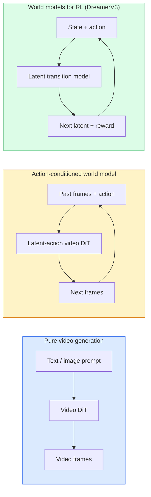

# النماذج العالمية ونشر الفيديو
> نموذج الفيديو الذي يتنبأ بالثواني التالية للمشهد هو عبارة عن محاكاة عالمية. قم بشرط هذا التنبؤ على الإجراءات وسيكون لديك محرك لعبة مكتسب.
** النوع: ** تعلم + بناء
** اللغات: ** بايثون
**المتطلبات الأساسية:** المرحلة الرابعة الدرس 10 (الانتشار)، المرحلة 4 الدرس 12 (فهم الفيديو)، المرحلة 4 الدرس 23 (DiT + التدفق المعدل)
**الوقت:** ~75 دقيقة
## أهداف التعلم
- شرح الفرق بين نموذج توليد الفيديو النقي (Sora 2) والنموذج العالمي المكيف (Genie 3, DreamerV3)
- وصف مقطع فيديو DiT: التصحيحات المكانية والزمانية، وترميز الموضع ثلاثي الأبعاد، والاهتمام المشترك عبر الرموز المميزة (T، H، W)
- تتبع كيفية دمج النموذج العالمي في الروبوتات: خطط VLM ← محاكاة نموذج الفيديو ← الديناميكيات العكسية تصدر الإجراءات
- اختر بين Sora 2 وGenie 3 وRunway GWM-1 Worlds وWan-Video وHunyuanVideo لحالة استخدام معينة (فيديو إبداعي، شريحة تفاعلية، تركيب القيادة الذاتية)
## المشكلة
لقد تقارب جيل الفيديو ونمذجة العالم في عام 2026. وقد تعلم النموذج الذي يمكنه توليد دقيقة متماسكة من الفيديو، إلى حد ما، كيف يتحرك العالم: ديمومة الكائن، والجاذبية، والسببية، والأسلوب. إذا قمت بشرط هذا التنبؤ على الإجراءات (المشي يسارًا، فتح الباب)، يصبح نموذج الفيديو محاكيًا قابلاً للتعلم ويمكن أن يحل محل محرك اللعبة، أو محاكي القيادة، أو بيئة الروبوتات.
إن المخاطر ملموسة. يقوم Genie 3 بإنشاء بيئات قابلة للتشغيل من صورة واحدة. المدرج GWM-1 عوالم تجمع مشاهد لا حصر لها قابلة للاستكشاف. يُنتج Sora 2 مقاطع فيديو مدتها دقيقة مع صوت متزامن وفيزياء نموذجية. NVIDIA تقوم Cosmos-Drive وWayve Gaia-2 وTesla DrivingWorld بإنشاء فيديو قيادة واقعي لبيانات التدريب على المركبات ذاتية القيادة. يتولى نموذج النموذج العالمي بهدوء عملية المحاكاة إلى الواقع في مجال الروبوتات.
هذا الدرس هو درس "الصورة الكبيرة" للمرحلة الرابعة. فهو يربط بين توليد الصور وفهم الفيديو والتفكير الفاعل في نمط الهندسة المعمارية الذي تتجه الأبحاث السائدة نحوه.
##المفهوم
### ثلاث عائلات من العارضات العالميات


- **Sora 2** عبارة عن توليد فيديو خالص مشروط بالمطالبات. لا توجد واجهة العمل. لا يمكنك "توجيه" منتصف عملية الطرح.
- **Genie 3**, **GWM-1 Worlds**, **Mirage / Magica** هي نماذج عالمية مكيفة بالحركة. استنتج الإجراءات الكامنة من الفيديو الذي تمت ملاحظته، ثم قم بربط تنبؤات الإطارات المستقبلية بالإجراءات. تفاعلي — تضغط على المفاتيح أو تحرك الكاميرا ويستجيب المشهد.
- **DreamerV3** وعائلة النماذج العالمية RL الكلاسيكية تتنبأ في مساحة كامنة مع تكييف حركة واضح، مدربة على إشارة المكافأة. أقل بصرية أكثر فائدة لكفاءة العينة RL.
### بنية فيديو DiT
```
Video latent:          (C, T, H, W)
Patchify (spatial):    grid of P_h x P_w patches per frame
Patchify (temporal):   group P_t frames into a temporal patch
Resulting tokens:      (T / P_t) * (H / P_h) * (W / P_w) tokens
```

التشفير الموضعي ثلاثي الأبعاد: تضمين دوار أو متعلم لكل تنسيق (t، h، w). يمكن أن يكون الاهتمام:
- **مشترك كامل** — جميع الرموز المميزة تتوافق مع جميع الرموز المميزة. O(N^2) مع رموز N. ممنوع الفيديوهات الطويلة.
- **مقسم** — الاهتمام الزمني البديل (نفس الموقع المكاني، عبر الزمن: `(H*W) * T^2`) والاهتمام المكاني (نفس الخطوة الزمنية، عبر المكان: `T * (H*W)^2`). يستخدم بواسطة TimeSformer ومعظم مقاطع الفيديو DiTs.
- **Window** — النوافذ المحلية في (t, h, w). يستخدم بواسطة فيديو سوين.
يستخدم كل نموذج لنشر الفيديو لعام 2026 أحد هذه الأنماط الثلاثة بالإضافة إلى تكييف AdaLN (الدرس 23) والتدفق المصحح.
### تكييف الأفعال: نماذج الفعل الكامنة
يتعلم Genie **الإجراء الكامن** لكل إطار من خلال توقع الإجراء بشكل تمييزي بين زوج من الإطارات المتتالية. يقوم جهاز فك ترميز النموذج بعد ذلك بتكييف الإجراء الكامن المستنتج - وليس على مفاتيح لوحة المفاتيح الصريحة. عند الاستدلال، يمكن للمستخدم تحديد إجراء كامن (أو عينة من إجراء سابق جديد) ويقوم النموذج بإنشاء الإطار التالي المتوافق مع هذا الإجراء.
يتخطى Sora واجهة العمل بالكامل. يتنبأ جهاز فك التشفير الخاص به برموز الزمكان المميزة التالية من رموز الزمكان السابقة. شروط سريعة للبدء؛ لا شيء يوجهه في منتصف الجيل.
### المعقولية المادية
تم الإعلان بوضوح عن إصدار Sora 2 لعام 2026 عن **المقبولية المادية**: الوزن، والتوازن، ودوام الكائن، والسبب والنتيجة. تم القياس من قبل الفريق من خلال درجات المعقولية التي تم تصنيفها يدويًا؛ يتحسن النموذج بشكل واضح فيما يتعلق بالأشياء المسقطة، واصطدام الشخصيات، والفشل عن قصد (قفزة ضائعة) مقابل Sora 1.
وتظل المعقولية هي وضع الفشل المهيمن. كشفت مقاطع فيديو 2024-2025 لأشخاص يتناولون السباغيتي أو يشربون من النظارات عن افتقار النموذج إلى تمثيل الكائن المستمر. موديلات 2026 (Sora 2، Runway Gen-5، HunyuanVideo) تقلل هذه العناصر ولكنها لا تزيلها.
### نماذج عالمية للقيادة الذاتية
تولد نماذج عالم القيادة مشاهد طريق واقعية مشروطة بالمسارات أو الصناديق المحيطة أو خرائط التنقل. الاستخدام:
- **Cosmos-Drive-Dreams** (NVIDIA) — يتم إنشاء دقائق من فيديو القيادة للتدريب على RL.
- **Gaia-2** (Wayve) — تركيب مشهد مكيف المسار لتقييم السياسات.
- **DrivingWorld** (Tesla) — يحاكي الطقس المتنوع والوقت من اليوم وظروف حركة المرور.
- **Vista** (ByteDance) — تركيب مشهد القيادة التفاعلي.
إنها تحل محل جمع البيانات الواقعية المكلفة لحالات الزوايا - ممرات المشاة في الليل، والتقاطعات الجليدية، وأنواع المركبات غير العادية - التي قد تتطلب بخلاف ذلك ملايين الأميال من القيادة.
### حزمة الروبوتات: VLM + نموذج فيديو + ديناميكيات عكسية
حلقة الروبوتات الناشئة المكونة من ثلاثة مكونات:
1. **VLM** يحلل الهدف ("التقط الكأس الحمراء")، ويخطط لتسلسل عمل عالي المستوى.
2. **نموذج إنشاء الفيديو** يحاكي الشكل الذي سيبدو عليه تنفيذ كل إجراء - ويتنبأ بالملاحظات التي يبلغ عددها N من الإطارات المقبلة.
3. **نموذج الديناميكيات العكسية** يستخرج أوامر المحرك الملموسة التي من شأنها إنتاج تلك الملاحظات.
يحل هذا محل تشكيل المكافأة والعينة الثقيلة RL. النموذج العالمي يفعل الخيال. تغلق الديناميكيات العكسية الحلقة عند التشغيل. يعد Genie Envisioner أحد الأمثلة على ذلك؛ تتقارب العديد من المجموعات البحثية حول هذا الهيكل.
### تقييم
- **جودة الصورة** — FVD (مسافة فيديو فريشيه)، دراسات المستخدم.
- **المحاذاة السريعة** — CLIPScore لكل إطار، تقييم بأسلوب VQA.
- **المقبولية المادية** — تم تقييمها يدويًا على مجموعة معايير (المعيار الداخلي لـ Sora 2، VBench).
- **إمكانية التحكم** (للنماذج العالمية التفاعلية) — الإجراء ← اتساق الملاحظة؛ هل يمكنك العودة إلى الحالة السابقة؟
### نموذج المناظر الطبيعية في عام 2026
| نموذج | استخدم | المعلمات | الإخراج | الترخيص |
|-------|-----|------------|--------|---------|
| سورا 2 | تحويل النص إلى فيديو، صوت | — | 1 دقيقة 1080 بكسل + صوت | API فقط |
| المدرج Gen-5 | نص/صورة إلى فيديو | — | مقاطع 10s | __المصطلح_1__ |
| المدرج GWM-1 العوالم | العالم التفاعلي | — | طرح ثلاثي الأبعاد لا نهائي | __المصطلح_3__ |
| الجني 3 | عالم تفاعلي من الصورة | 11ب+ | إطارات قابلة للتشغيل | معاينة البحث |
| وان-فيديو 2.1 | فتح تحويل النص إلى فيديو | 14ب | مقاطع عالية الجودة | غير تجاري |
| هونيوانفيديو | فتح تحويل النص إلى فيديو | 13 ب | مقاطع 10s | مباح |
| كوزموس / كوزموس درايف | شريحة القيادة الذاتية | 7-14ب | مشاهد القيادة | NVIDIA مفتوح |
| ماجيكا/ميراج 2 | AI- محرك اللعبة الأصلي | — | عوالم قابلة للتعديل | المنتج |
## بنائها
### الخطوة 1: تصحيح ثلاثي الأبعاد للفيديو
```python
import torch
import torch.nn as nn


class VideoPatch3D(nn.Module):
    def __init__(self, in_channels=4, dim=64, patch_t=2, patch_h=2, patch_w=2):
        super().__init__()
        self.proj = nn.Conv3d(
            in_channels, dim,
            kernel_size=(patch_t, patch_h, patch_w),
            stride=(patch_t, patch_h, patch_w),
        )
        self.patch_t = patch_t
        self.patch_h = patch_h
        self.patch_w = patch_w

    def forward(self, x):
        # x: (N, C, T, H, W)
        x = self.proj(x)
        n, c, t, h, w = x.shape
        tokens = x.reshape(n, c, t * h * w).transpose(1, 2)
        return tokens, (t, h, w)
```

يعمل التحويل ثلاثي الأبعاد بخطوة مساوية للنواة كمصحح مكاني وزماني. `(T, H, W) -> (T/2, H/2, W/2)` شبكة من الرموز المميزة.
### الخطوة 2: ترميز الموضع الدوار ثلاثي الأبعاد
يتم تطبيق تضمينات الموضع الدوار (RoPE) بشكل منفصل على طول المحاور `t`، `h`، `w`:
```python
def rope_3d(tokens, t_dim, h_dim, w_dim, grid):
    """
    tokens: (N, T*H*W, D)
    grid: (T, H, W) sizes
    t_dim + h_dim + w_dim == D
    """
    T, H, W = grid
    n, seq, d = tokens.shape
    if t_dim + h_dim + w_dim != d:
        raise ValueError(f"t_dim+h_dim+w_dim ({t_dim}+{h_dim}+{w_dim}) must equal D={d}")
    assert seq == T * H * W
    t_idx = torch.arange(T, device=tokens.device).repeat_interleave(H * W)
    h_idx = torch.arange(H, device=tokens.device).repeat_interleave(W).repeat(T)
    w_idx = torch.arange(W, device=tokens.device).repeat(T * H)
    # Simplified: just scale channels by frequencies. Real RoPE rotates pairs.
    freqs_t = torch.exp(-torch.log(torch.tensor(10000.0)) * torch.arange(t_dim // 2, device=tokens.device) / (t_dim // 2))
    freqs_h = torch.exp(-torch.log(torch.tensor(10000.0)) * torch.arange(h_dim // 2, device=tokens.device) / (h_dim // 2))
    freqs_w = torch.exp(-torch.log(torch.tensor(10000.0)) * torch.arange(w_dim // 2, device=tokens.device) / (w_dim // 2))
    emb_t = torch.cat([torch.sin(t_idx[:, None] * freqs_t), torch.cos(t_idx[:, None] * freqs_t)], dim=-1)
    emb_h = torch.cat([torch.sin(h_idx[:, None] * freqs_h), torch.cos(h_idx[:, None] * freqs_h)], dim=-1)
    emb_w = torch.cat([torch.sin(w_idx[:, None] * freqs_w), torch.cos(w_idx[:, None] * freqs_w)], dim=-1)
    return tokens + torch.cat([emb_t, emb_h, emb_w], dim=-1)
```

شكل إضافي مبسط. يقوم Real RoPE بتدوير القنوات المقترنة بترددات؛ المعلومات الموضعية هي نفسها.
### الخطوة 3: كتلة الانتباه المنقسمة
```python
class DividedAttentionBlock(nn.Module):
    def __init__(self, dim=64, heads=2):
        super().__init__()
        self.time_attn = nn.MultiheadAttention(dim, heads, batch_first=True)
        self.space_attn = nn.MultiheadAttention(dim, heads, batch_first=True)
        self.ln1 = nn.LayerNorm(dim)
        self.ln2 = nn.LayerNorm(dim)
        self.ln3 = nn.LayerNorm(dim)
        self.mlp = nn.Sequential(nn.Linear(dim, 4 * dim), nn.GELU(), nn.Linear(4 * dim, dim))

    def forward(self, x, grid):
        T, H, W = grid
        n, seq, d = x.shape
        # time attention: same (h, w), across t
        xt = x.view(n, T, H * W, d).permute(0, 2, 1, 3).reshape(n * H * W, T, d)
        a, _ = self.time_attn(self.ln1(xt), self.ln1(xt), self.ln1(xt), need_weights=False)
        xt = (xt + a).reshape(n, H * W, T, d).permute(0, 2, 1, 3).reshape(n, seq, d)
        # space attention: same t, across (h, w)
        xs = xt.view(n, T, H * W, d).reshape(n * T, H * W, d)
        a, _ = self.space_attn(self.ln2(xs), self.ln2(xs), self.ln2(xs), need_weights=False)
        xs = (xs + a).reshape(n, T, H * W, d).reshape(n, seq, d)
        xs = xs + self.mlp(self.ln3(xs))
        return xs
```

الوقت الذي يحضر فيه الاهتمام داخل كل موضع مكاني عبر الزمن؛ يحضر الاهتمام بالمساحة داخل كل إطار عبر المواضع. عمليتان O(T^2 + (HW)^2) بدلاً من عملية O((THW)^2 واحدة). هذا هو جوهر TimeSformer وكل فيديو DiT حديث.
### الخطوة 4: قم بتأليف فيديو DiT صغير
```python
class TinyVideoDiT(nn.Module):
    def __init__(self, in_channels=4, dim=64, depth=2, heads=2):
        super().__init__()
        self.patch = VideoPatch3D(in_channels=in_channels, dim=dim, patch_t=2, patch_h=2, patch_w=2)
        self.blocks = nn.ModuleList([DividedAttentionBlock(dim, heads) for _ in range(depth)])
        self.out = nn.Linear(dim, in_channels * 2 * 2 * 2)

    def forward(self, x):
        tokens, grid = self.patch(x)
        for blk in self.blocks:
            tokens = blk(tokens, grid)
        return self.out(tokens), grid
```

ليس مولد فيديو يعمل؛ عرض هيكلي تتشكل فيه كل قطعة بشكل صحيح.
### الخطوة 5: التحقق من الأشكال
```python
vid = torch.randn(1, 4, 8, 16, 16)  # (N, C, T, H, W)
model = TinyVideoDiT()
out, grid = model(vid)
print(f"input  {tuple(vid.shape)}")
print(f"tokens grid {grid}")
print(f"output {tuple(out.shape)}")
```

توقع `grid = (4, 8, 8)` و`out = (1, 256, 32)` بعد التصحيح؛ يقوم الرأس بعد ذلك بعرض تصحيحات مكانية وزمانية لكل رمز، جاهزة ليتم إلغاء تصحيحها مرة أخرى في مقطع فيديو.
## استخدمه
أنماط الوصول إلى الإنتاج لعام 2026:
- **Sora 2 API** (OpenAI) — تحويل النص إلى فيديو، صوت متزامن. التسعير المتميز.
- **Runway Gen-5 / GWM-1** (Runway) — عوالم تفاعلية لتحويل الصورة إلى فيديو.
- **Wan-Video 2.1 / HunyuanVideo** — مضيف ذاتي مفتوح المصدر.
- **Cosmos / Cosmos-Drive** (NVIDIA) — محاكاة قيادة الأوزان المفتوحة.
- **Genie 3** — معاينة البحث وطلب الوصول.
لإنشاء عرض توضيحي تفاعلي لنموذج عالمي: ابدأ باستخدام Wan-Video للحصول على الجودة، ثم قم بوضع طبقة على محول الإجراء الكامن من أجل التفاعل. لمحاكاة القيادة الذاتية: Cosmos-Drive هو المرجع المفتوح لعام 2026.
بالنسبة للروبوتات، المكدس في البرية:
1. الهدف اللغوي -> VLM (Qwen3-VL) -> الخطة عالية المستوى.
2. الخطة -> نموذج فيديو الفعل الكامن -> الطرح المتخيل.
3. الطرح -> نموذج الديناميكيات العكسية -> الإجراءات ذات المستوى المنخفض.
4. الإجراءات التي تم تنفيذها -> تم إدخال الملاحظة في الخطوة 1.
## اشحنها
ينتج هذا الدرس:
- `outputs/prompt-video-model-picker.md` — يتم الاختيار بين Sora 2 / Runway / Wan / HunyuanVideo / Cosmos مع تحديد المهمة والترخيص ووقت الاستجابة.
- `outputs/skill-physical-plausibility-checks.md` — مهارة تحدد عمليات التحقق التلقائية (دوام الكائن، والجاذبية، والاستمرارية) للتشغيل على أي فيديو تم إنشاؤه قبل الشحن.
## تمارين
1. **(سهل)** احسب عدد الرموز المميزة لفيديو 360 بكسل مدته 5 ثوانٍ على patch-t=2، patch-h=8، patch-w=8. سبب الذاكرة للاهتمام بهذا الحجم.
2. **(متوسط)** قم بتبديل كتلة الانتباه المقسمة أعلاه للحصول على كتلة انتباه مشتركة كاملة وقياس الشكل وعدد المعلمات. اشرح سبب ضرورة الاهتمام المقسم لنماذج الفيديو الحقيقية.
3. **(صعب)** أنشئ نموذج فيديو يتضمن حركة كامنة بحد أدنى: خذ مجموعة بيانات مكونة من (frame_t, action_t,frame_{t+1}) ثلاث مرات (أي لعبة بسيطة ثنائية الأبعاد)، وقم بتدريب فيديو DiT صغير مشروط بتضمينات الحركة، وأظهر أن الإجراءات المختلفة تنتج إطارات تالية مختلفة.
## المصطلحات الرئيسية
| مصطلح | ماذا يقول الناس | ماذا يعني في الواقع |
|------|----------------|----------------------|
| النموذج العالمي | "المحاكاة المستفادة" | نموذج يتنبأ بالملاحظات المستقبلية في ضوء الحالة والإجراء |
| فيديو ديت | "محول الزمكان" | محول الانتشار مع التصحيح ثلاثي الأبعاد والاهتمام المقسم |
| الفعل الكامن | "التحكم المستنتج" | الفعل المنفصل أو المستمر الكامن المستنتج من أزواج الإطار؛ تستخدم لتكييف توليد الإطار التالي |
| اهتمام مقسم | "الزمان ثم المكان" | عمليتان للانتباه لكل كتلة — عبر الزمن ثم عبر الفضاء — لإبقاء O(N^2) قابلاً للإدارة |
| دوام الكائن | "الأشياء تبقى حقيقية" | خاصية المشهد التي يجب أن تتعلمها نماذج الفيديو؛ وضع الفشل الكلاسيكي على المواد الغذائية والأواني الزجاجية |
| FVD | "مسافة فيديو فريشيه" | فيديو يعادل FID؛ مقياس الجودة البصرية الأساسي |
| نموذج الديناميكيات العكسية | "ملاحظات على الإجراءات" | بالنظر إلى (الحالة، الحالة التالية)، قم بإخراج الإجراء الذي يربط بينهما؛ يغلق حلقة الروبوتات |
| كوزموس درايف | "NVIDIA شريحة القيادة" | النموذج العالمي للقيادة الذاتية ذات الأوزان المفتوحة لـ RL والتقييم |
## مزيد من القراءة
- [Sora technical report (OpenAI)](https://openai.com/index/video-generation-models-as-world-simulators/)
- [Genie: Generative Interactive Environments (Bruce et al., 2024)](https://arxiv.org/abs/2402.15391) — نماذج عالم الحركة الكامنة
- [TimeSformer (Bertasius et al., 2021)](https://arxiv.org/abs/2102.05095) — اهتمام مقسم لمحولات الفيديو
- [DreamerV3 (Hafner et al., 2023)](https://arxiv.org/abs/2301.04104) — النماذج العالمية لـ RL
- [Cosmos-Drive-Dreams (NVIDIA, 2025)](https://research.nvidia.com/labs/toronto-ai/cosmos-drive-dreams/) — موديل عالمي للقيادة
- [Top 10 Video Generation Models 2026 (DataCamp)](https://www.datacamp.com/blog/top-video-generation-models)
- [From Video Generation to World Model — survey repo](https://github.com/ziqihuangg/Awesome-From-Video-Generation-to-World-Model/)