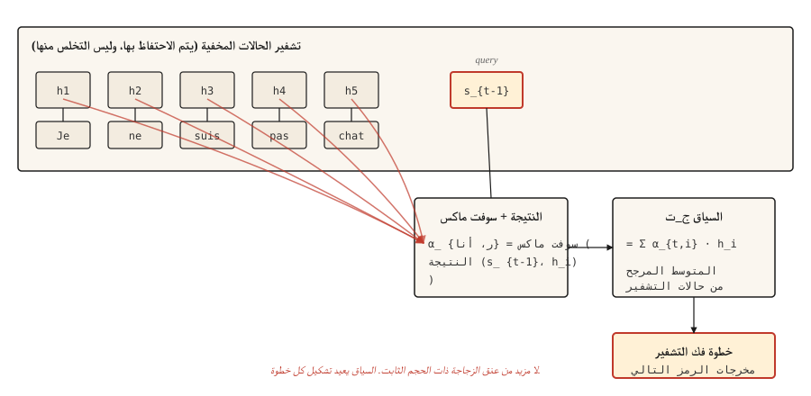

# Attention Mechanism — The Breakthrough

> يتوقف جهاز فك التشفير عن التحديق في الملخص المضغوط ويبدأ في النظر إلى المصدر بأكمله. كل شيء بعد هذا هو الاهتمام بالإضافة إلى الهندسة.

**النوع:** بناء
** اللغات: ** بايثون
** المتطلبات الأساسية: ** المرحلة 5 · 09 (نماذج التسلسل إلى التسلسل)
**الوقت:** ~45 دقيقة

## The Problem

انتهى الدرس 09 بفشل محسوب. ينتقل جهاز فك تشفير التشفير GRU الذي تم تدريبه على مهمة نسخ لعبة من دقة 89٪ بطول 5 إلى شبه فرصة بطول 80. والسبب هيكلي، وليس خطأ تدريب: كل جزء من المعلومات التي يجمعها برنامج التشفير يجب أن يتناسب مع حالة مخفية واحدة ذات حجم ثابت، ولا يرى جهاز فك التشفير أي شيء آخر أبدًا.

نشر بهداناو وتشو وبينجيو إصلاحًا من ثلاثة أسطر في عام 2014. بدلاً من إعطاء وحدة فك التشفير حالة التشفير النهائية فقط، احتفظ بكل حالة تشفير. في كل خطوة من خطوات وحدة فك التشفير، قم بحساب المتوسط ​​المرجح لحالات التشفير حيث تشير الأوزان إلى "ما هو المقدار الذي يحتاجه جهاز فك التشفير للنظر إلى موضع جهاز التشفير `i` الآن؟" هذا المتوسط ​​المرجح هو السياق، وهو يغير كل خطوة في وحدة فك التشفير.

هذه هي الفكرة كلها. قامت المحولات بتوسيعها. طبقه الاهتمام الذاتي على تسلسل واحد. تم تشغيله بواسطة اهتمام متعدد الرؤوس بالتوازي. لكن نسخة 2014 كسرت عنق الزجاجة بالفعل، وبمجرد حصولك عليها، فإن محور المحولات هو الهندسة، وليس المفاهيم.

## The Concept



في كل خطوة لوحدة فك التشفير `t`:

1. استخدم الحالة المخفية السابقة لوحدة فك التشفير `s_{t-1}` كاستعلام **.
2. سجلها مقابل كل حالة مخفية لجهاز التشفير `h_1,..., h_T`. عددي واحد لكل موضع تشفير.
3. Softmax الدرجات للحصول على أوزان الانتباه `α_{t,1},..., α_{t,T}` التي مجموعها 1.
4. ناقل السياق `c_t = Σ α_{t,i} * h_i`. المتوسط ​​المرجح لحالات التشفير.
5. يأخذ جهاز فك التشفير `c_t` بالإضافة إلى رمز الإخراج السابق، وينتج الرمز المميز التالي.

المتوسط ​​​​المرجح هو النقطة. عندما يحتاج جهاز فك التشفير إلى ترجمة "Je" إلى "I"، فإنه يقوم بوزن حالة التشفير على "Je" بشكل مرتفع والحالات الأخرى منخفضة. عندما يحتاج إلى "لا"، فإنه يزن "pas" عاليًا. يقوم ناقل السياق بإعادة تشكيل كل خطوة.

## Shapes (the thing that bites everyone)

هذا هو المكان الذي يحدث فيه خطأ في تنفيذ كل الاهتمام في المرة الأولى. اقرأ ببطء.

| الشيء | الشكل | ملاحظات |
|-------|-------|-------|
| تشفير الحالات المخفية `H` | `(T_enc, d_h)` | إذا BiLSTM، `d_h = 2 * d_hidden` |
| حالة فك التشفير المخفية `s_{t-1}` | `(d_s,)` | ناقل واحد |
| درجة الانتباه `e_{t,i}` | العددية | واحد لكل موضع التشفير |
| وزن الانتباه `α_{t,i}` | العددية | بعد softmax على كل `i` |
| ناقل السياق `c_t` | `(d_h,)` | نفس شكل حالة التشفير |

**درجة بهداناو (المضافة).** `e_{t,i} = v_α^T * tanh(W_a * s_{t-1} + U_a * h_i)`.

- `s_{t-1}` له شكل `(d_s,)`، `h_i` له شكل `(d_h,)`.
- `W_a` له شكل `(d_attn, d_s)`. `U_a` له شكل `(d_attn, d_h)`.
- مجموعهم داخل التنه له الشكل `(d_attn,)`.
- `v_α` له شكل `(d_attn,)`. ينهار المنتج الداخلي الذي يحتوي على `v_α` إلى عددي. **هذا ما يفعله `v_α`.** إنه ليس سحرًا. إنه الإسقاط الذي يحول المتجه الخافت للانتباه إلى درجة عددية.

**نتيجة لونج (مضروبة).** ثلاثة متغيرات:

- `dot`: `e_{t,i} = s_t^T * h_i`. يتطلب `d_s == d_h`. القيد الصعب. قم بالتخطي إذا كان برنامج التشفير ثنائي الاتجاه.
- `general`: `e_{t,i} = s_t^T * W * h_i` بالشكل `W` `(d_s, d_h)`. يزيل القيد المتساوي الخافت.
- `concat`: بشكل أساسي شكل بهداناو. نادرا ما يستخدم لأن الأولين أرخص.

**واحدة من Bahdanau / Luong تستحق التسمية. ** يستخدم Bahdanau `s_{t-1}` (حالة وحدة فك التشفير *قبل* إنشاء الكلمة الحالية). يستخدم Luong `s_t` (الحالة *بعد*). يؤدي خلطها إلى إنتاج تدرجات خاطئة يصعب تصحيحها. اختر ورقة واحدة والتزم بأعرافها.

## Build It

### Step 1: additive (Bahdanau) attention

```python
import numpy as np


def additive_attention(decoder_state, encoder_states, W_a, U_a, v_a):
    projected_dec = W_a @ decoder_state
    projected_enc = encoder_states @ U_a.T
    combined = np.tanh(projected_enc + projected_dec)
    scores = combined @ v_a
    weights = softmax(scores)
    context = weights @ encoder_states
    return context, weights


def softmax(x):
    x = x - np.max(x)
    e = np.exp(x)
    return e / e.sum()
```

تحقق من الأشكال الخاصة بك مقابل الجدول أعلاه. `encoder_states` له شكل `(T_enc, d_h)`. `projected_enc` له شكل `(T_enc, d_attn)`. `projected_dec` له شكل `(d_attn,)` وعمليات بث. `combined` له شكل `(T_enc, d_attn)`. `scores` له شكل `(T_enc,)`. `weights` له شكل `(T_enc,)`. `context` له شكل `(d_h,)`. شحنها.

### Step 2: Luong dot and general

```python
def dot_attention(decoder_state, encoder_states):
    scores = encoder_states @ decoder_state
    weights = softmax(scores)
    return weights @ encoder_states, weights


def general_attention(decoder_state, encoder_states, W):
    projected = W.T @ decoder_state
    scores = encoder_states @ projected
    weights = softmax(scores)
    return weights @ encoder_states, weights
```

ثلاثة أسطر لكل منهما. وهذا هو سبب وصول ورقة لونج. نفس الدقة في معظم المهام، مع كود أقل بكثير.

### Step 3: a worked numerical example

بالنظر إلى ثلاث حالات تشفير (تقريبًا "قطة"، و"سات"، و"حصيرة") وحالة وحدة فك التشفير التي تتوافق كثيرًا مع الأولى، يركز توزيع الانتباه على الموضع 0. إذا تحولت حالة وحدة فك التشفير لتتماشى مع الأخيرة، ينتقل الانتباه إلى الموضع 2. يتتبع ناقل السياق.

```python
H = np.array([
    [1.0, 0.0, 0.2],
    [0.5, 0.5, 0.1],
    [0.1, 0.9, 0.3],
])

s_close_to_cat = np.array([0.9, 0.1, 0.2])
ctx, w = dot_attention(s_close_to_cat, H)
print("weights:", w.round(3))
```

```
weights: [0.464 0.305 0.231]
```

الصف الأول يفوز. ثم قم بتحريك حالة وحدة فك التشفير أقرب إلى حالة التشفير الثالثة وشاهد تغير الأوزان. هذا كل شيء. الاهتمام هو محاذاة صريحة.

### Step 4: why this is the bridge to transformers

ترجمة اللغة أعلاه إلى Q/K/V:

- **الاستعلام** = حالة وحدة فك التشفير `s_{t-1}`
- **المفتاح** = حالات التشفير (ما نسجله مقابله)
- **القيمة** = حالات التشفير (ما نوزنه ونجمعه)

في الاهتمام الكلاسيكي، المفاتيح والقيم هي نفس الشيء. الانتباه الذاتي يفصل بينهما: يمكنك الاستعلام عن تسلسل ضد نفسه، مع إسقاطات تعلمية مختلفة لـ K وV. يديره الاهتمام متعدد الرؤوس بالتوازي مع إسقاطات تعلمية مختلفة. تقوم المحولات بتكديس المرحلة بأكملها عدة مرات وإسقاط RNNs.

الرياضيات هي نفسها. الأشكال هي نفسها. إن القفزة التربوية من اهتمام بهداناو إلى الاهتمام بالمنتج النقطي هي في الغالب تدوين.

## Use It

PyTorch و TensorFlow يوجهان الانتباه مباشرة.

```python
import torch
import torch.nn as nn

mha = nn.MultiheadAttention(embed_dim=128, num_heads=8, batch_first=True)
query = torch.randn(2, 5, 128)
key = torch.randn(2, 10, 128)
value = torch.randn(2, 10, 128)

output, weights = mha(query, key, value)
print(output.shape, weights.shape)
```

```
torch.Size([2, 5, 128]) torch.Size([2, 5, 10])
```

هذه هي طبقة انتباه المحولات. دفعة استعلام مكونة من 5 مواضع، دفعة مفتاح/قيمة مكونة من 10 مواضع، 128-خافت لكل منها، 8 رؤوس. `output` هي الاستعلامات الجديدة ذات السياق المعزز. `weights` هي مصفوفة المحاذاة 5x10 التي يمكنك تصورها.

### When classical attention still matters

- أصول التدريس. رأس واحد، طبقة واحدة، الإصدار القائم على RNNmake هو كل مفهوم مرئي.
- مهام التسلسل على الجهاز حيث لا تناسب المحولات.
- أي ورقة من 2014-2017. سوف تخطئ في قراءتها دون معرفة اتفاقية بهداناو.
- تحليل المحاذاة الدقيقة في MT. تعتبر أوزان الاهتمام الأولية أداة قابلة للتفسير حتى في نماذج المحولات، وتتطلب قراءتها معرفة ماهيتها.

### The attention-weight-as-explanation trap

تبدو أوزان الانتباه قابلة للتفسير. وهي أوزان مجموعها واحد عبر المواضع؛ يمكنك رسمها. عالية تعني "نظرت إلى هذا". المراجعين يحبونهم.

فهي ليست قابلة للتفسير كما تبدو. أظهر جاين ووالاس (2019) أنه يمكن تبديل توزيعات الانتباه واستبدالها ببدائل عشوائية دون تغيير تنبؤات النموذج لبعض المهام. لا تقم مطلقًا بالإبلاغ عن أوزان الانتباه كدليل على الاستدلال دون إجراء عملية استئصال أو فحص مضاد للواقع.

## Ship It

حفظ باسم `outputs/prompt-attention-shapes.md`:

```markdown
---
name: attention-shapes
description: Debug shape bugs in attention implementations.
phase: 5
lesson: 10
---

Given a broken attention implementation, you identify the shape mismatch. Output:

1. Which matrix has the wrong shape. Name the tensor.
2. What its shape should be, derived from (d_s, d_h, d_attn, T_enc, T_dec, batch_size).
3. One-line fix. Transpose, reshape, or project.
4. A test to catch regressions. Typically: assert `output.shape == (batch, T_dec, d_h)` and `weights.shape == (batch, T_dec, T_enc)` and `weights.sum(dim=-1) close to 1`.

Refuse to recommend fixes that silently broadcast. Broadcast-hiding bugs surface later as silent accuracy degradation, the worst kind of attention bug.

For Bahdanau confusion, insist the decoder input is `s_{t-1}` (pre-step state). For Luong, `s_t` (post-step state). For dot-product, flag dimension mismatch between query and key as the most common first-time error.
```

## Exercises

1. **سهل.** قم بتنفيذ الإخفاء `softmax` بحيث تجذب رموز الحشو المميزة في جهاز التشفير الانتباه بوزن صفر. اختبار على دفعة مع تسلسلات متغيرة الطول.
2. **متوسط.** أضف انتباهًا متعدد الرؤوس إلى نموذج Luong `general`. قم بتقسيم `d_h` إلى `n_heads` مجموعات، وقم بتشغيل الانتباه لكل رأس، ثم قم بالتسلسل. تحقق من تطابق الحالة ذات الرأس الواحد مع التنفيذ السابق.
3. **صعب.** قم بتدريب جهاز فك ترميز GRU مع انتباه Bahdanau على مهمة نسخ اللعبة من الدرس 09. دقة الرسم مقابل طول التسلسل. قارن مع خط الأساس لعدم الاهتمام. يجب أن ترى الفجوة تتسع مع نمو الطول، مما يؤكد أن الاهتمام يرفع عنق الزجاجة.

## Key Terms

| مصطلح | ماذا يقول الناس | ماذا يعني في الواقع |
|------|-|--------------------------------------|
| انتبه | النظر إلى الأشياء | المتوسط ​​المرجح لتسلسل القيمة، الأوزان المحسوبة من تشابه مفتاح الاستعلام. |
| الاستعلام، المفتاح، القيمة | QKV | ثلاثة إسقاطات: Q يسأل، K هو ما يجب مطابقته، V هو ما يجب إرجاعه. |
| الاهتمام الإضافي | بهداناو | درجة التغذية الأمامية: `v^T tanh(W q + U k)`. |
| الاهتمام المضاعف | لونج دوت / عام | النتيجة هي `q^T k` أو `q^T W k`. أرخص، نفس الدقة في معظم المهام. |
| مصفوفة المحاذاة | الصورة الجميلة | أوزان الانتباه كشبكة `(T_dec, T_enc)`. اقرأها لترى ما حضرته العارضة. |

## Further Reading

- [Bahdanau, Cho, Bengio (2014). Neural Machine Translation by Jointly Learning to Align and Translate](https://arxiv.org/abs/1409.0473) — the paper.
- [Luong, Pham, Manning (2015). الأساليب الفعالة للترجمة الآلية العصبية القائمة على الانتباه](https://arxiv.org/abs/1508.04025) - متغيرات الدرجات الثلاثة ومقارنتها.
- [جين ووالاس (2019). الانتباه ليس شرحًا](https://arxiv.org/abs/1902.10186) — التحذير من قابلية التفسير.
- [التعمق في التعلم العميق — انتباه بهداناو](https://d2l.ai/chapter_attention-mechanisms-and-transformers/bahdanau-attention.html) — إرشادات قابلة للتشغيل باستخدام PyTorch.
