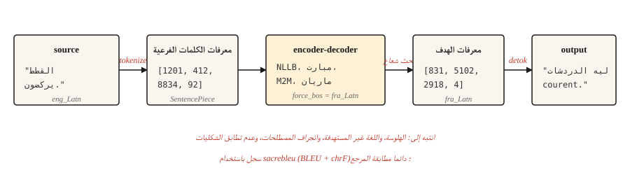

# Machine Translation

> الترجمة هي المهمة التي دفعت ثمن NLP البحث لمدة ثلاثين عاما وما زالت تدفع حتى الآن.

**النوع:** بناء
** اللغات: ** بايثون
**المتطلبات الأساسية:** المرحلة 5 · 10 (آلية الانتباه)، المرحلة 5 · 04 (GloVe، FastText، Subword)
**الوقت:** ~75 دقيقة

## The Problem

يقرأ النموذج جملة في إحدى اللغات وينتج جملة في لغة أخرى. يختلف الطول. يختلف ترتيب الكلمات. ترتبط بعض الكلمات المصدر بكلمات مستهدفة متعددة والعكس صحيح. التعبيرات الاصطلاحية ترفض التعيين الفردي. "أنا أفتقدك" بالفرنسية هي "tu me manques" - حرفيًا "أنت تفتقر إلي". لا يوجد محاذاة على مستوى الكلمة تنجو من ذلك.

الترجمة الآلية هي المهمة التي أجبرت NLP على اختراع أجهزة فك التشفير، والانتباه، والمحولات، وفي النهاية نموذج LLM بأكمله. لقد تم اتخاذ كل خطوة إلى الأمام لأن جودة الترجمة كانت قابلة للقياس وكانت الفجوة بين الإنسان والآلة عنيدة.

يتخطى هذا الدرس درس التاريخ ويعلم خط العمل pipeline لعام 2026: جهاز فك ترميز وتشفير متعدد اللغات مُدرب مسبقًا (NLLB-200 أو mBART)، ورمز الكلمات الفرعية، والبحث عن الشعاع، وتقييم BLEU وتقييم chrF، وحفنة من أوضاع الفشل التي لا تزال تُشحن إلى الإنتاج دون اكتشافها.

## The Concept



الحديث MT عبارة عن وحدة فك ترميز محولات تم تدريبها على النص المتوازي. يقرأ برنامج التشفير المصدر بالترميز الخاص بلغته. يقوم جهاز فك التشفير بإنشاء الهدف، كلمة فرعية واحدة في كل مرة، باستخدام مخرجات جهاز التشفير عبر الانتباه المتبادل (الدرس 10). يستخدم فك التشفير بحث الشعاع لتجنب فخ فك التشفير الجشع. يتم إلغاء ترميز المخرجات وحذفها وتسجيلها مقابل مرجع.

ثلاثة خيارات تشغيلية تقود الجودة الواقعية MT.

- **رمز مميز.** SentencePiece BPE تم تدريبه على مجموعة مختلطة اللغات. المفردات المشتركة عبر اللغات هي ما يمكّن الأزواج من الصفر في NLLB.
- **حجم الموديل.** NLLB-200 مقطر 600 م يناسب جهاز كمبيوتر محمول. NLLB-200 3.3B هو الإنتاج الافتراضي المنشور. 54.5B هو سقف البحث.
- **فك التشفير.** عرض الشعاع 4-5 للمحتوى العام. عقوبة الطول لتجنب الإخراج القصير جدًا. فك تشفير مقيد عندما تحتاج إلى اتساق المصطلحات.

## Build It

### Step 1: a pretrained MT call

```python
from transformers import AutoTokenizer, AutoModelForSeq2SeqLM

model_id = "facebook/nllb-200-distilled-600M"
tok = AutoTokenizer.from_pretrained(model_id, src_lang="eng_Latn")
model = AutoModelForSeq2SeqLM.from_pretrained(model_id)

src = "The cats are running."
inputs = tok(src, return_tensors="pt")

out = model.generate(
    **inputs,
    forced_bos_token_id=tok.convert_tokens_to_ids("fra_Latn"),
    num_beams=5,
    length_penalty=1.0,
    max_new_tokens=64,
)
print(tok.batch_decode(out, skip_special_tokens=True)[0])
```

```text
Les chats courent.
```

هناك ثلاثة أشياء مهمة هنا. `src_lang` يخبر أداة الرمز المميز بالبرنامج النصي والتجزئة المطلوب تطبيقهما. `forced_bos_token_id` يخبر وحدة فك الترميز باللغة التي سيتم إنشاؤها. كلاهما حيل خاصة بـ NLLB؛ يستخدم mBART وM2M-100 اصطلاحاتهما الخاصة وهي غير قابلة للتبديل.

### Step 2: BLEU and chrF

BLEU يقيس تداخل n-gram بين الإخراج والمرجع. أربعة أحجام مرجعية للجرام (1-4)، المتوسط ​​الهندسي للدقة، عقوبة الإيجاز للمخرجات القصيرة جدًا. النتيجة في [0، 100]. شائعة الاستخدام. محبط للتفسير: 30 BLEU "صالح للاستعمال"؛ 40 "جيد"؛ 50 "استثنائي" ؛ الاختلافات تحت 1 BLEU هي الضوضاء.

يقيس chrF درجة F على مستوى الشخصية. أكثر حساسية للغات الغنية شكليًا حيث يتطابق BLEU مع عدد أقل من العدد. غالبًا ما يتم الإبلاغ عنه بجانب BLEU.

```python
import sacrebleu

hypotheses = ["Les chats courent."]
references = [["Les chats courent."]]

bleu = sacrebleu.corpus_bleu(hypotheses, references)
chrf = sacrebleu.corpus_chrf(hypotheses, references)
print(f"BLEU: {bleu.score:.1f}  chrF: {chrf.score:.1f}")
```

استخدم دائمًا `sacrebleu`. يعمل على تطبيع عملية الترميز بحيث تكون النتائج قابلة للمقارنة عبر الأوراق. إن إجراء حسابات BLEU الخاصة بك هو كيفية حدوث معايير مضللة.

### The three-tier evaluation hierarchy (2026)

يستخدم التقييم MT الحديث ثلاث عائلات مترية تكميلية. السفينة مع اثنين على الأقل.

- ** إرشادي ** (BLEU، chrF). سريع، ومرجعي، وقابل للتفسير، وغير حساس لإعادة الصياغة. يُستخدم للمقارنة القديمة واكتشاف الانحدار.
- ** تعلمت ** (COMET، BLEURT، بيرتسكور). النماذج العصبية المدربة على الحكم البشري؛ مقارنة التشابه الدلالي للترجمة مع المصدر والمرجع. COMET لديه أعلى ارتباط بأبحاث MT منذ عام 2023 وهو الإنتاج الافتراضي لعام 2026 حيث تكون الجودة مهمة.
- **LLM-كقاضي** (بدون مرجع). اطلب من نموذج كبير تسجيل الترجمات على أساس الطلاقة والكفاية والنبرة والملاءمة الثقافية. GPT-4-يطابق القاضي الاتفاق البشري ~80% من الوقت عندما يكون عنوان التقييم مصممًا بشكل جيد. يُستخدم للمحتوى المفتوح حيث لا يوجد مرجع.

مكدس 2026 العملي: `sacrebleu` لـ BLEU وchrF، `unbabel-comet` لـ COMET، وLLM للإشارة النهائية التي تواجه الإنسان. قم بمعايرة كل مقياس مقابل 50-100 مثال تم تصنيفه بواسطة الإنسان قبل الوثوق به في بيانات الإنتاج.

تتيح لك المقاييس الخالية من المراجع (COMET-QE، BLEURT-QE، LLM-كقاضي) تقييم الترجمات بدون مرجع، وهو أمر مهم بالنسبة لأزواج اللغات الطويلة الذيل حيث لا توجد ترجمات مرجعية.

### Step 3: what breaks in production

سيتم ترجمة خط العمل pipe أعلاه بطلاقة بنسبة 80% من الوقت وسيفشل بصمت في الـ 20% المتبقية. أوضاع الفشل المسماة:

- **الهلوسة.** العارضة تخترع محتوى لم يكن في المصدر. شائع في مفردات المجال غير المألوفة. العَرَض: الإخراج بطلاقة ولكنه يدعي حقائق لم يذكرها المصدر. التخفيف: فك التشفير المقيد بمصطلحات المجال، والمراجعة البشرية للمحتوى المنظم، ومراقبة المخرجات لفترة أطول بكثير من المدخلات.
- **إنشاء غير مستهدف.** النموذج يترجم إلى لغة خاطئة. NLLB عرضة لهذا بشكل مدهش في أزواج لغوية نادرة. التخفيف: تحقق من `forced_bos_token_id` وقم دائمًا بفك التشفير باستخدام لغة ID للتحقق من نموذج الإخراج.
- **انحراف المصطلحات.** يصبح "الاشتراك" "s'inscrire" في المستند 1 و"créer un compte" في المستند 2. بالنسبة إلى النص UI والسلاسل التي تواجه المستخدم، فإن الاتساق مهم أكثر من الجودة الأولية. التخفيف: فك التشفير المقيد بالمسرد أو قاموس ما بعد التحرير.
- **عدم تطابق الشكليات.** الفرنسية "tu" مقابل "vous"، مستويات الأدب الياباني. يختار النموذج أي شكل كان أكثر شيوعًا في التدريب. عادةً ما يكون هذا خطأً بالنسبة للمحتوى الذي يواجه العملاء. التخفيف: بادئة سريعة مع رمز شكلي إذا كان النموذج يدعمه، أو ضبط نموذج صغير على النصوص الرسمية فقط.
- **انفجار الطول عند الإدخال القصير.** غالبًا ما تنتج جمل الإدخال القصيرة جدًا ترجمات طويلة نظرًا لأن عقوبة الطول تقع في منحدر أقل من 5 رموز مصدر مميزة تقريبًا. التخفيف: الحد الأقصى للطول الثابت المتناسب مع طول المصدر.

### Step 4: fine-tuning for a domain

النماذج المدربة مسبقًا هي نماذج عامة. تستفيد الترجمة القانونية أو الطبية أو ترجمة حوار الألعاب بشكل ملموس من الضبط الدقيق للبيانات الموازية للمجال. الوصفة ليست غريبة:

```python
from transformers import Trainer, TrainingArguments
from datasets import Dataset

pairs = [
    {"src": "The defendant pleaded guilty.", "tgt": "L'accusé a plaidé coupable."},
]

ds = Dataset.from_list(pairs)


def preprocess(ex):
    return tok(
        ex["src"],
        text_target=ex["tgt"],
        truncation=True,
        max_length=128,
        padding="max_length",
    )


ds = ds.map(preprocess, remove_columns=["src", "tgt"])

args = TrainingArguments(output_dir="out", per_device_train_batch_size=4, num_train_epochs=3, learning_rate=3e-5)
Trainer(model=model, args=args, train_dataset=ds).train()
```

بضعة آلاف من الأمثلة المتوازية عالية الجودة تتفوق على بضع مئات الآلاف من الأمثلة المزعجة المحذوفة من الويب. إن جودة بيانات التدريب هي أكبر رافعة للإنتاج.

## Use It

مكدس الإنتاج لعام 2026 لـ MT:

| حالة الاستخدام | نقطة البداية الموصى بها |
|---------|-------------------------|
| أي إلى أي، 200 لغة | `facebook/nllb-200-distilled-600M` (كمبيوتر محمول) أو `nllb-200-3.3B` (إنتاج) |
| تتمحور حول اللغة الإنجليزية، جودة عالية، 50 لغة | `facebook/mbart-large-50-many-to-many-mmt` |
| المدى القصير، الاستدلال الرخيص، الإنجليزية-الفرنسية/الألمانية/الإسبانية | هلسنكي - NLP / نماذج ماريان |
| زمن الوصول الحرج من جانب المتصفح | ONNX- ماريان كمي (~50 MB) |
| أقصى قدر من الجودة، على استعداد للدفع | GPT-4/ كلود/ الجوزاء مع مطالبات الترجمة |

LLMs تتفوق الآن على نماذج MT المتخصصة في العديد من أزواج اللغات اعتبارًا من عام 2026، لا سيما في المحتوى الاصطلاحي والسياق الطويل. المقايضة هي تكلفة الرمز المميز ووقت الاستجابة. اختر LLM عندما يكون طول السياق أو الاتساق الأسلوبي أو تكييف المجال عبر المطالبة أمرًا أكثر أهمية من الإنتاجية.

## Ship It

حفظ باسم `outputs/skill-mt-evaluator.md`:

```markdown
---
name: mt-evaluator
description: Evaluate a machine translation output for shipping.
version: 1.0.0
phase: 5
lesson: 11
tags: [nlp, translation, evaluation]
---

Given a source text and a candidate translation, output:

1. Automatic score estimate. BLEU and chrF ranges you would expect. State whether a reference is available.
2. Five-point human-verifiable check list: (a) content preservation (no hallucinations), (b) correct language, (c) register / formality match, (d) terminology consistency with glossary if provided, (e) no truncation or length explosion.
3. One domain-specific issue to probe. E.g., for legal: named entities and statute citations. For medical: drug names and dosages. For UI: placeholder variables `{name}`.
4. Confidence flag. "Ship" / "Ship with review" / "Do not ship". Tie to the severity of issues found in step 2.

Refuse to ship a translation without a language-ID check on output. Refuse to evaluate without a reference unless the user explicitly opts in to reference-free scoring (COMET-QE, BLEURT-QE). Flag any content over 1000 tokens as likely needing chunked translation.
```

## Exercises

1. **سهل.** ترجمة فقرة إنجليزية مكونة من 5 جمل إلى الفرنسية والعودة إلى الإنجليزية باستخدام `nllb-200-distilled-600M`. قم بقياس مدى قرب رحلة الذهاب والإياب من النسخة الأصلية. يجب أن ترى الحفاظ على الدلالات مع الانجراف في اختيار الكلمات.
2. **متوسط.** قم بتنفيذ فحص اللغة ID على مخرجات الترجمة باستخدام `fasttext lid.176` أو `langdetect`. اندمج في المكالمة MT حتى يتم القبض على الأجيال غير المستهدفة قبل العودة.
3. **صعب.** قم بضبط `nllb-200-distilled-600M` على مجموعة نطاقات مكونة من 5000 زوج من اختيارك. قم بالقياس BLEU على مجموعة مثبتة قبل الضبط الدقيق وبعده. قم بالإبلاغ عن أنواع الجمل التي تحسنت وأيها تراجعت.

## Key Terms

| مصطلح | ماذا يقول الناس | ماذا يعني في الواقع |
|------|-|--------------------------------------|
| BLEU | نتيجة الترجمة | دقة N-gram مع عقوبة الإيجاز. [0، 100]. |
| مركز حقوق الإنسان | حرف F- النتيجة | درجة F على مستوى الشخصية. أكثر حساسية للغات الغنية شكليا. |
| NMT | العصبية MT | تم تدريب وحدة فك ترميز المحولات على النص المتوازي. الافتراضي 2017+. |
| NLLB | لم يتم ترك أي لغة خلفنا | عائلة ميتا النموذجية المكونة من 200 لغة MT. |
| فك التشفير المقيد | إخراج متحكم فيه | فرض ظهور/عدم ظهور رموز مميزة أو n-grams في الإخراج. |
| هلوسة | محتوى مخترع | إخراج النموذج غير مدعوم من قبل المصدر. |

## Further Reading

- [Costa-jussà et al. (2022). No Language Left Behind: Scaling Human-Centered Machine Translation](https://arxiv.org/abs/2207.04672) — the NLLB paper.
- [Post (2018). دعوة للوضوح في إعداد التقارير BLEU الدرجات](https://aclanthology.org/W18-6319/) — لماذا `sacrebleu` هي الطريقة الصحيحة الوحيدة للإبلاغ BLEU.
- [بوبوفيتش (2015). chrF: حرف n-gram F-score للتقييم التلقائي MT](https://aclanthology.org/W15-3049/) — ورقة chrF.
- [Hugging Face MT دليل](https://huggingface.co/docs/transformers/tasks/translation) — إرشادات عملية للضبط الدقيق.
