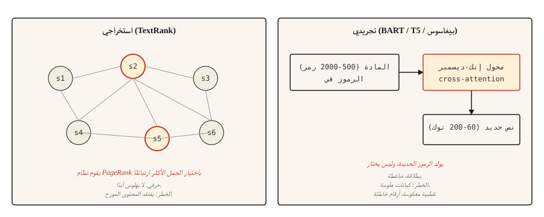

# Text Summarization

> تخبرك الأنظمة الاستخراجية بما ورد في الوثيقة. تخبرك الأنظمة التجريدية بما يعنيه المؤلف. مهام مختلفة، ومزالق مختلفة.

**النوع:** بناء
** اللغات: ** بايثون
** المتطلبات الأساسية: ** المرحلة 5 · 02 (BoW + TF-IDF)، المرحلة 5 · 11 (الترجمة الآلية)
**الوقت:** ~75 دقيقة

## The Problem

مقالة إخبارية مكونة من 2000 كلمة تصل إلى خلاصتك. أنت بحاجة إلى 120 كلمة تلتقطها. يمكنك إما اختيار أهم ثلاث جمل من المقالة (مستخلصة) أو إعادة كتابة المحتوى بكلماتك الخاصة (مستخلصة). كلاهما يسمى التلخيص. إنها مشاكل مختلفة تماما.

التلخيص الاستخراجي هو مشكلة الترتيب. سجل كل جملة، وأرجع الجزء العلوي-`k`. ويكون الإخراج دائما نحويا لأنه مرفوع حرفيا. يكمن الخطر في فقدان المحتوى الذي يتم توزيعه عبر المقالة.

التلخيص التجريدي هو مشكلة جيل. يقوم المحول بإنتاج نص جديد مشروط بالإدخال. يكون الإخراج سلسًا ومضغوطًا ولكنه قد يهلوس بحقائق لم تكن موجودة في المصدر. الخطر هو تلفيق واثق.

يبني هذا الدرس كليهما، مع وضع الفشل الذي يمتلكه كل منهما.

## The Concept



**استخراجية.** تعامل مع المقالة كرسم بياني حيث nodes عبارة عن جمل والحواف عبارة عن أوجه تشابه. قم بتشغيل PageRank (أو شيء من هذا القبيل) على الرسم البياني لتسجيل الجمل حسب مدى ارتباطها بكل شيء آخر. الجمل ذات أعلى الدرجات هي الملخص. التنفيذ الأساسي هو **TextRank** (Mihalcea and Tarau, 2004).

**تجريدي.** قم بضبط وحدة فك ترميز وتشفير المحولات (BART، T5، Pegasus) على أزواج ملخص المستندات. عند الاستدلال، يقرأ النموذج المستند وينشئ ملخصًا مميزًا تلو الآخر عبر الانتباه المتبادل. يستخدم Pegasus على وجه الخصوص هدفًا للتدريب المسبق على الجملة الفاصلة وهو make وهو ممتاز في التلخيص دون الكثير من الضبط الدقيق.

التقييم باستخدام **ROUGE** (الدراسة الموجهة نحو الاستدعاء لتقييم Gisting). ROUGE-1 وROUGE-2 يتداخلان مع يونيجرام وبيجرام. ROUGE-L يسجل أطول متتالية فرعية مشتركة. الأعلى أفضل لكن 40 ROUGE-L "جيد" و50 "استثنائي". كل ورقة تشير إلى الثلاثة. استخدم الحزمة `rouge-score`.

## Build It

### Step 1: TextRank (extractive)

```python
import math
import re
from collections import Counter


def sentence_split(text):
    return re.split(r"(?<=[.!?])\s+", text.strip())


def similarity(s1, s2):
    w1 = Counter(s1.lower().split())
    w2 = Counter(s2.lower().split())
    intersection = sum((w1 & w2).values())
    denom = math.log(len(w1) + 1) + math.log(len(w2) + 1)
    if denom == 0:
        return 0.0
    return intersection / denom


def textrank(text, top_k=3, damping=0.85, iterations=50, epsilon=1e-4):
    sentences = sentence_split(text)
    n = len(sentences)
    if n <= top_k:
        return sentences

    sim = [[0.0] * n for _ in range(n)]
    for i in range(n):
        for j in range(n):
            if i != j:
                sim[i][j] = similarity(sentences[i], sentences[j])

    scores = [1.0] * n
    for _ in range(iterations):
        new_scores = [1 - damping] * n
        for i in range(n):
            total_out = sum(sim[i]) or 1e-9
            for j in range(n):
                if sim[i][j] > 0:
                    new_scores[j] += damping * sim[i][j] / total_out * scores[i]
        if max(abs(s - ns) for s, ns in zip(scores, new_scores)) < epsilon:
            scores = new_scores
            break
        scores = new_scores

    ranked = sorted(range(n), key=lambda k: scores[k], reverse=True)[:top_k]
    ranked.sort()
    return [sentences[i] for i in ranked]
```

شيئان يستحقان التسمية تستخدم وظيفة التشابه تداخل الكلمات المقيس بالسجل، وهو متغير TextRank الأصلي. يعمل جيب التمام للمتجهات TF-IDF أيضًا. عامل التخميد 0.85 وعدد التكرارات هما إعدادات PageRank الافتراضية.

### Step 2: abstractive with BART

```python
from transformers import pipeline

summarizer = pipeline("summarization", model="facebook/bart-large-cnn")

article = """(long news article text)"""

summary = summarizer(article, max_length=120, min_length=60, do_sample=False)
print(summary[0]["summary_text"])
```

BART-كبير-CNN تم ضبطه بدقة على مجموعة CNN/DailyMail. وينتج ملخصات على غرار الأخبار خارج الصندوق. بالنسبة للمجالات الأخرى (الأوراق العلمية، الحوار، القانوني)، استخدم نقطة تفتيش Pegasus المقابلة أو قم بضبط بياناتك المستهدفة.

### Step 3: ROUGE evaluation

```python
from rouge_score import rouge_scorer

scorer = rouge_scorer.RougeScorer(["rouge1", "rouge2", "rougeL"], use_stemmer=True)
scores = scorer.score(reference_summary, generated_summary)
print({k: round(v.fmeasure, 3) for k, v in scores.items()})
```

استخدم دائمًا الجذع. بدونها، تعتبر كلمتي "تشغيل" و"تشغيل" كلمتين مختلفتين وROUGE أقل من العدد.

### Beyond ROUGE (2026 summarization eval)

لقد كان ROUGE هو مقياس التلخيص المهيمن لمدة عشرين عامًا وهو غير كافٍ من تلقاء نفسه في عام 2026. أظهر التحليل التلوي واسع النطاق للأوراق NLG:

- ** BERTScore ** (تشابه التضمين السياقي) اكتسب تقدمًا حتى عام 2023 ويتم الإبلاغ عنه الآن جنبًا إلى جنب مع ROUGE في معظم أوراق التلخيص.
- **BARTScore** يتعامل مع التقييم على أنه جيل: سجل الملخص من خلال مدى احتمال قيام BART مُدرب مسبقًا بتعيينه في ضوء المصدر.
- **MoverScore** (مسافة محرك الأرض عبر التضمينات السياقية) وصلت إلى المركز الأول في معايير التلخيص لعام 2025 لأنها تلتقط التداخل الدلالي بشكل أفضل من ROUGE.
- **FactCC** و **QAالإخلاص القائم** كانا شائعين في 2021-2023، وغالبًا ما يتم استبدالهما بـ **G-Eval** (سلسلة موجهة GPT-4 تسجل التماسك والاتساق والطلاقة والملاءمة مع تفكير سلسلة الأفكار).
- **G-Eval** وأساليب LLM-القاضي المشابهة تتطابق مع الحكم البشري بنسبة 80% تقريبًا من الوقت عندما تكون نماذج التقييم مصممة جيدًا.

توصية الإنتاج: تقرير ROUGE-L للمقارنة القديمة، BERTScore للتداخل الدلالي، G-Eval للتماسك والواقعية. معايرة مقابل 50-100 ملخصات تحمل علامات بشرية.

### Step 4: the factuality problem

الملخصات المجردة عرضة للهلوسة. تحمل الملخصات الاستخراجية خطر هلوسة أقل بكثير لأن المخرجات مرفوعة حرفيًا من المصدر، على الرغم من أنها قد تظل مضللة إذا تم إخراج جمل المصدر من سياقها، أو أصبحت قديمة، أو تم اقتباسها خارج الترتيب. وهذا هو السبب الأكبر الذي يجعل أنظمة الإنتاج لا تزال تفضل الأساليب الاستخراجية للمحتوى المجاور للامتثال.

أنواع الهلوسة على سبيل المثال:

- **مبادلة الكيان.** المصدر يقول "جون سميث". الملخص يقول "جون براون".
- **انحراف الأرقام.** المصدر يقول "25000". الملخص يقول "25 مليون".
- **قطبية الوجه.** المصدر يقول "رفض العرض". الملخص يقول "قبلت العرض".
- **حقيقة اختراع.** المصدر لا يذكر CEO. الملخص يقول CEO تمت الموافقة عليه.

أساليب التقييم الناجحة:

- **FactCC.** مصنف ثنائي تم تدريبه على الاستلزام بين الجملة المصدر والجملة الموجزة. يتنبأ بالواقعية/غير الواقعية.
- **الحقيقة المبنية على QA.** اطرح أسئلة نموذجية QA تكون إجاباتها في المصدر. إذا كان الملخص يدعم إجابات مختلفة، ضع علامة.
- **مستوى الكيان F1.** قارن بين الكيانات المسماة في المصدر مقابل الملخص. الكيانات الموجودة فقط في الملخص هي مشبوهة.

بالنسبة لأي شيء يواجه المستخدم حيث تكون الحقيقة مهمة (أخبار، طبية، قانونية، مالية)، فإن الاستخراج هو الخيار الافتراضي الأكثر أمانًا. يحتاج التجريد إلى التحقق من الوقائع في الحلقة.

## Use It

مكدس 2026:

| حالة الاستخدام | موصى به |
|---------|------------|
| الأخبار، ملخص من 3-5 جمل، باللغة الإنجليزية | `facebook/bart-large-cnn` |
| أوراق علمية | `google/pegasus-pubmed` او ضبط T5 |
| وثيقة متعددة، طويلة الشكل | أي LLM بسياق 32 كيلو بايت+، يتم المطالبة به |
| تلخيص الحوار | `philschmid/bart-large-cnn-samsum` |
| الاستخراجية، وانخفاض خطر الهلوسة عن طريق البناء | TextRank أو `sumy`'s LSA / LexRank |

غالبًا ما يتفوق LLMs ذو السياق الطويل على النماذج المتخصصة في عام 2026 عندما لا يكون الحساب عائقًا. والمقايضة هي التكلفة وقابلية التكرار؛ النماذج المتخصصة تعطي مخرجات أكثر اتساقا.

## Ship It

حفظ باسم `outputs/skill-summary-picker.md`:

```markdown
---
name: summary-picker
description: Pick extractive or abstractive, named library, factuality check.
version: 1.0.0
phase: 5
lesson: 12
tags: [nlp, summarization]
---

Given a task (document type, compliance requirement, length, compute budget), output:

1. Approach. Extractive or abstractive. Explain in one sentence why.
2. Starting model / library. Name it. `sumy.TextRankSummarizer`, `facebook/bart-large-cnn`, `google/pegasus-pubmed`, or an LLM prompt.
3. Evaluation plan. ROUGE-1, ROUGE-2, ROUGE-L (use rouge-score with stemming). Plus factuality check if abstractive.
4. One failure mode to probe. Entity swap is the most common in abstractive news summarization; flag samples where source entities do not appear in summary.

Refuse abstractive summarization for medical, legal, financial, or regulated content without a factuality gate. Flag input over the model's context window as needing chunked map-reduce summarization (not just truncation).
```

## Exercises

1. **سهل.** قم بتشغيل TextRank على 5 مقالات إخبارية. قارن الجمل الثلاثة الأولى بملخص مرجعي. قياس ROUGE-L. يجب أن تشاهد 30-45 ROUGE-L في المقالات ذات النمط CNN/DailyMail.
2. **متوسط.** تنفيذ الواقعية على مستوى الكيان: استخراج الكيانات المسماة من المصدر والملخص (spaCy)، وحساب استرجاع كيانات المصدر في ملخص ودقة الكيانات الموجزة مقابل المصدر. الدقة العالية والتذكر المنخفض يعنيان الأمان ولكن مقتضبًا؛ الدقة المنخفضة تعني كيانات هلوسة.
3. **صعب.** قارن BART-كبير-CNN مقابل LLM (كلود أو GPT-4) في 50 CNN/DailyMail مقالة. التقرير ROUGE-L والواقعية (حسب الكيان F1) والتكلفة لكل ملخص. وثيقة حيث يفوز كل منهما.

## Key Terms

| مصطلح | ماذا يقول الناس | ماذا يعني في الواقع |
|------|-|--------------------------------------|
| استخراجي | اختر الجمل | إعادة الجمل حرفيا من المصدر. لا يهلوس أبدًا. |
| خلاصة | أعد الكتابة | إنشاء نص جديد مشروط بالمصدر. يمكن أن يهلوس. |
| ROUGE | ملخص المقياس | N-gram / LCS يتداخل بين مخرجات النظام والمرجع. |
| ترتيب النص | الرسم البياني القائم على الاستخراج | تصنيف الصفحات على الرسم البياني لتشابه الجملة. |
| حقيقة | هل هذا صحيح | ما إذا كان المصدر يدعم المطالبات الموجزة. |
| هلوسة | محتوى مختلق | المحتوى في الملخص الذي لا يدعمه المصدر. |

## Further Reading

- [Mihalcea and Tarau (2004). TextRank: Bringing Order into Texts](https://aclanthology.org/W04-3252/) — the extractive canonical paper.
- [Lewis et al. (2019). BART: التدريب المسبق على تقليل الضوضاء من تسلسل إلى تسلسل](https://arxiv.org/abs/1910.13461) — الورقة BART.
- [Zhang et al. (2019). PEGASUS: Pre-training with Extracted Gap-sentences](https://arxiv.org/abs/1912.08777) — Pegasus and the gap-sentence objective.
- [Lin (2004). ROUGE: حزمة للتقييم التلقائي للملخصات](https://aclanthology.org/W04-1013/) — ROUGE ورقة.
- [ماينز وآخرون. (2020). حول الإخلاص والواقعية في التلخيص التجريدي](https://arxiv.org/abs/2005.00661) - ورقة المشهد الواقعي.
