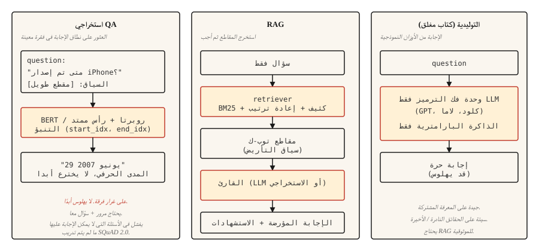

# أنظمة الإجابة على الأسئلة
> ثلاثة أنظمة على شكل حديث QA. تم العثور على الاستخراجية تمتد. لقد أدى الاسترجاع المعزز إلى تأريضهم في المستندات. الإجابات المنتجة التوليدية. كل مساعد AI حديث هو مزيج من الثلاثة.
**النوع:** بناء
** اللغات: ** بايثون
**المتطلبات الأساسية:** المرحلة 5 · 11 (الترجمة الآلية)، المرحلة 5 · 10 (آلية الاهتمام)
**الوقت:** ~75 دقيقة
## المشكلة
يكتب المستخدم "متى تم إطلاق أول هاتف iPhone؟" ويتوقع "29 يونيو 2007". ليس "تاريخ أبل طويل ومتنوع". ليس "2007" يجلس في عزلة بدون جملة. إجابة مباشرة ومبررة وصحيحة.
هيمنت ثلاث بنيات على QA خلال العقد الماضي.
- **استخراج QA.** في ضوء سؤال ومقطع معروف أنه يحتوي على الإجابة، ابحث عن مؤشري البداية والنهاية لنطاق الإجابة في المقطع. SQuAD هو المعيار الأساسي.
- **المجال المفتوح QA.** لم يتم إعطاء المقطع. استرجع المقطع ذي الصلة أولاً، ثم استخرج الإجابة أو أنشئها. هذا هو حجر الأساس لكل RAG pipeline اليوم.
- **كتاب توليدي/مغلق QA.** نموذج لغة كبير يجيب من ذاكرته البارامترية. لا استرجاع. الأسرع في الاستدلال، والأقل موثوقية في الحقائق.
الاتجاه في عام 2026 هو اتجاه مختلط: استخرج أفضل المقاطع القليلة، ثم حث نموذجًا توليديًا للإجابة يرتكز على تلك الفقرات. هذا هو RAG، والدرس 14 يغطي عملية الاسترجاع بنصف العمق. يبني هذا الدرس النصف QA.
##المفهوم

**استخراجي.** قم بتشفير السؤال والمقطع مع محول (عائلة BERT). قم بتدريب رأسين يتنبأان بمؤشرات البداية والنهاية المميزة للإجابة. الخسارة هي الانتروبيا المتقاطعة على المواقف الصالحة. الإخراج هو مدى من مرور. لا تهلوس أبدًا (بالبناء)، ولا تتعامل أبدًا مع الأسئلة التي لا يستطيع المقطع الإجابة عليها (بالبناء).
**الاسترجاع المعزز (RAG).** مرحلتان. أولاً، يعثر المسترد على مقاطع `k` العلوية من المجموعة. ثانيًا، يقوم القارئ (المستخرج أو المولد) بإنتاج الإجابة باستخدام تلك المقاطع. يتيح تقسيم المسترد والقارئ تدريب كل منهما وتقييمه بشكل مستقل. غالبًا ما يضيف RAG الحديث إعادة ترتيب بينهما.
**Generative.** إجابات وحدة فك التشفير فقط LLM (GPT، Claude، Llama) من الأوزان التي تم تعلمها. لا توجد خطوة استرجاع. ممتاز في المعرفة العامة، وكارثي في ​​الحقائق النادرة أو الحديثة. ويرتبط معدل الهلوسة عكسيا مع تكرار الحقيقة في بيانات التدريب المسبق.
## بنائها
### الخطوة 1: الاستخراج QA بنموذج مُدرب مسبقًا
```python
from transformers import pipeline

qa = pipeline("question-answering", model="deepset/roberta-base-squad2")

passage = (
    "Apple Inc. released the first iPhone on June 29, 2007. "
    "The device was announced by Steve Jobs at Macworld in January 2007."
)
question = "When was the first iPhone released?"

answer = qa(question=question, context=passage)
print(answer)
```

```python
{'score': 0.98, 'start': 57, 'end': 70, 'answer': 'June 29, 2007'}
```

تم تدريب `deepset/roberta-base-squad2` على SQuAD 2.0، والذي يتضمن أسئلة غير قابلة للإجابة. افتراضيًا، يُرجع السطر `question-answering` pipeline نطاق أعلى الدرجات حتى عندما تفوز النتيجة الخالية للنموذج - *لا* يُرجع تلقائيًا إجابة فارغة. للحصول على سلوك "لا إجابة" صريح، قم بتمرير `handle_impossible_answer=True` إلى استدعاء pipeline: يقوم pipeline بعد ذلك بإرجاع إجابة فارغة فقط عندما تتجاوز الدرجة الخالية كل درجة نطاق. تحقق دائمًا من الحقل `score` في كلتا الحالتين.
### الخطوة 2: خط pipe المعزز للاسترجاع (رسم تخطيطي)
```python
from sentence_transformers import SentenceTransformer
import numpy as np

encoder = SentenceTransformer("sentence-transformers/all-MiniLM-L6-v2")

corpus = [
    "Apple Inc. released the first iPhone on June 29, 2007.",
    "Macworld 2007 featured the iPhone announcement by Steve Jobs.",
    "Android launched in 2008 as Google's mobile operating system.",
    "The first iPod was released in 2001.",
]
corpus_embeddings = encoder.encode(corpus, normalize_embeddings=True)


def retrieve(question, top_k=2):
    q_emb = encoder.encode([question], normalize_embeddings=True)
    sims = (corpus_embeddings @ q_emb.T).squeeze()
    order = np.argsort(-sims)[:top_k]
    return [corpus[i] for i in order]


def answer(question):
    passages = retrieve(question, top_k=2)
    combined = " ".join(passages)
    return qa(question=question, context=combined)


print(answer("When was the first iPhone released?"))
```

مرحلتين pipeline. المسترد الكثيف (الجملة-BERT) يجد المقاطع ذات الصلة من خلال التشابه الدلالي. يقوم القارئ الاستخراجي (RoBERTa-SQuAD) بسحب نطاق الإجابة من المقاطع العلوية المدمجة. يعمل على الأجسام الصغيرة. للحصول على مجموعة مكونة من مليون مستند، استخدم FAISS أو قاعدة بيانات متجهة.
### الخطوة 3: إنشاء باستخدام RAG
```python
def rag_generate(question, llm):
    passages = retrieve(question, top_k=3)
    prompt = f"""Context:
{chr(10).join('- ' + p for p in passages)}

Question: {question}

Answer using only the context above. If the context does not contain the answer, say "I don't know."
"""
    return llm(prompt)
```

النمط الفوري مهم. إن إخبار النموذج بشكل صريح بالتوقف في السياق والعودة "لا أعرف" عندما يكون السياق غير كافٍ يخفض معدلات الهلوسة بنسبة 40-60٪ مقارنة بالتحفيز الساذج. تضيف الأنماط الأكثر تفصيلاً الاستشهادات ودرجات الثقة والاستخراج المنظم.
### الخطوة الرابعة: التقييم الذي يعكس العالم الحقيقي
يستخدم SQuAD **المطابقة التامة (EM)** و**مستوى الرمز المميز F1**. EM عبارة عن مطابقة صارمة بعد التسوية (أحرف صغيرة، علامات ترقيم، إزالة المقالات) - إما أن يتطابق التنبؤ تمامًا أو يحصل على 0. يتم حساب F1 عبر تداخل الرمز المميز بين التنبؤ والمرجع ويمنح رصيدًا جزئيًا. عادةً ما تحصل كلا العبارتين غير الائتمانيتين: "29 يونيو 2007" مقابل "29 يونيو 2007" على 0 EM (تسوية الفواصل الترتيبية) ولكنها لا تزال تكسب F1 كبيرة من الرموز المميزة المتداخلة.
للإنتاج QA:
- **دقة الإجابة** (LLM - الحكم أو الحكم البشري، نظرًا لأن المقاييس لا تلتقط التكافؤ الدلالي).
- **دقة الاقتباس.** هل المقطع المقتبس يدعم الإجابة بالفعل؟ من السهل التحقق تلقائيًا من خلال مطابقة السلسلة بين الاستشهادات التي تم إنشاؤها والمقاطع المستردة.
- **معايرة الرفض.** عندما لا تكون الإجابة في الفقرات المسترجعة، هل يقول النظام بشكل صحيح "لا أعرف"؟ قياس معدل الثقة الكاذبة.
- **استدعاء الاسترجاع.** قبل تقييم القارئ، قم بقياس ما إذا كان المسترد قد حصل على المقطع الصحيح في الجزء العلوي-`k`. لا يستطيع القارئ إصلاح مقطع مفقود.
### RAGAS: إطار تقييم الإنتاج لعام 2026
تم تصميم `RAGAS` خصيصًا لأنظمة RAG وهو الإعداد الافتراضي للشحن في عام 2026. ويسجل أربعة أبعاد دون الحاجة إلى مراجع ذهبية:
- **الإخلاص.** هل كل ادعاء في الإجابة يأتي من السياق المسترجع؟ تم القياس من خلال الاستحقاقات المستندة إلى NLI. مقياس الهلوسة الأساسي الخاص بك.
- **ملاءمة الإجابة.** هل تتناول الإجابة السؤال؟ ويتم قياسها من خلال توليد أسئلة افتراضية من الإجابة ومقارنتها بالسؤال الحقيقي.
- **دقة السياق.** من بين الأجزاء المستردة، ما الجزء الذي كان ذا صلة بالفعل؟ دقة منخفضة = ضوضاء في المطالبة.
- **استدعاء السياق.** هل تحتوي المجموعة المستردة على كافة المعلومات المطلوبة؟ استدعاء منخفض = لا يمكن للقارئ النجاح.
تتيح لك النتائج الخالية من المراجع تقييم حركة الإنتاج المباشر دون الحصول على إجابات ذهبية منسقة. طبقة LLM-كحكم في الأعلى للأسئلة المفتوحة حيث تكون مقاييس المطابقة التامة عديمة الفائدة.
__الكود_0__. قم بتوصيل المسترد + القارئ الخاص بك. احصل على أربعة كميات قياسية لكل استعلام. التنبيه على الانحدارات.
## استخدمه
كومة 2026.
| حالة الاستخدام | موصى به |
|---------|------------|
| في ضوء المقطع، ابحث عن نطاق الإجابة | `deepset/roberta-base-squad2` |
| على متن ثابت، كتاب مغلق غير مقبول | RAG: المسترد الكثيف + LLM القارئ |
| في الوقت الحقيقي عبر مخزن المستندات | RAG مع المسترد الهجين (BM25 + الكثيف) + مُعاد الترتيب (الدرس 14) |
| المحادثة QA (أسئلة المتابعة) | LLM مع سجل المحادثات + RAG في كل منعطف |
| نطاقات واقعية للغاية ومنظمة | استخراجية على متن موثوقة؛ أبدا مولدة وحدها |
الاستخراجي QA غير عصري في عام 2026 لأن RAG مع LLMs يتعامل مع المزيد من الحالات. ولا يزال يتم شحنه في السياقات التي تتطلب الاقتباس الحرفي: البحث القانوني، والامتثال التنظيمي، وأدوات التدقيق.
## اشحنها
حفظ باسم `outputs/skill-qa-architect.md`:
```markdown
---
name: qa-architect
description: Choose QA architecture, retrieval strategy, and evaluation plan.
version: 1.0.0
phase: 5
lesson: 13
tags: [nlp, qa, rag]
---

Given requirements (corpus size, question type, factuality constraint, latency budget), output:

1. Architecture. Extractive, RAG with extractive reader, RAG with generative reader, or closed-book LLM. One-sentence reason.
2. Retriever. None, BM25, dense (name the encoder), or hybrid.
3. Reader. SQuAD-tuned model, LLM by name, or "domain-fine-tuned DistilBERT."
4. Evaluation. EM + F1 for extractive benchmarks; answer accuracy + citation accuracy + refusal calibration for production. Name what you are measuring and how you are measuring it.

Refuse closed-book LLM answers for regulatory or compliance-sensitive questions. Refuse any QA system without a retrieval-recall baseline (you cannot evaluate the reader without knowing the retriever surfaced the right passage). Flag questions that require multi-hop reasoning as needing specialized multi-hop retrievers like HotpotQA-trained systems.
```

## تمارين
1. **سهل.** قم بإعداد سطر pipe الاستخراجي SQuAD أعلاه في 10 فقرات من ويكيبيديا. الحرف اليدوية 10 أسئلة. قم بقياس عدد المرات التي تكون فيها الإجابة صحيحة. يجب أن ترى 7-9 صحيحة إذا كانت الفقرات والأسئلة نظيفة.
2. **متوسط.** أضف مصنف الرفض. عندما تكون درجة الاسترجاع العليا أقل من الحد الأدنى (على سبيل المثال 0.3 جيب التمام)، قم بإرجاع "لا أعرف" بدلاً من الاتصال بالقارئ. ضبط العتبة على مجموعة معلقة.
3. **صعب.** أنشئ سطرًا RAG pipe على مجموعة مكونة من 10000 مستند من اختيارك. قم بتنفيذ الاسترجاع المختلط (BM25 + كثيف) مع دمج RRF (راجع الدرس 14). قم بقياس دقة الإجابة باستخدام الخطوة المختلطة وبدونها. قم بتوثيق أنواع الأسئلة الأكثر فائدة.
## المصطلحات الرئيسية
| مصطلح | ماذا يقول الناس | ماذا يعني في الواقع |
|------|-|--------------------------------------|
| استخراجي QA | ابحث عن نطاق الإجابة | توقع مؤشرات البداية والنهاية للإجابة ضمن مقطع معين. |
| المجال المفتوح QA | QA على مجموعة | لا يوجد ممر معين. يجب استرجاع ثم الإجابة. |
| RAG | استرجاع ثم أنشئ | استرجاع الجيل المعزز. المسترد + القارئ pipeline. |
| فرقة | المعيار الكنسي | مجموعة بيانات الإجابة على الأسئلة في جامعة ستانفورد. EM + F1 المقاييس. |
| هلوسة | إجابة مختلقة | إخراج القارئ غير مدعوم بالسياق المسترد. |
| معايرة الرفض | اعرف متى تصمت | يقول النظام بشكل صحيح "لا أعرف" عندما لا يتمكن من الإجابة. |
## مزيد من القراءة
- [Rajpurkar et al. (2016). SQuAD: 100,000+ Questions for Machine Comprehension of Text](https://arxiv.org/abs/1606.05250) — الورقة المرجعية.
- [Karpukhin et al. (2020). Dense Passage Retrieval for Open-Domain QA](https://arxiv.org/abs/2004.04906) — DPR، المسترد الكثيف الأساسي لـ QA.
- [Lewis et al. (2020). Retrieval-Augmented Generation for Knowledge-Intensive NLP Tasks](https://arxiv.org/abs/2005.11401) — الورقة التي تحمل اسم RAG.
- [Gao et al. (2023). Retrieval-Augmented Generation for Large Language Models: A Survey](https://arxiv.org/abs/2312.10997) — استطلاع RAG الشامل.