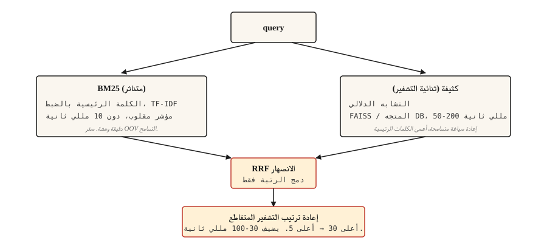

# Information Retrieval and Search

> BM25 دقيقة ولكنها هشة. يلقي كثيف شبكة واسعة ولكنه يفتقد الكلمات الرئيسية. الهجين هو الإعداد الافتراضي لعام 2026. كل شيء آخر يتم ضبطه.

**النوع:** بناء
** اللغات: ** بايثون
** المتطلبات الأساسية: ** المرحلة 5 · 02 (BoW + TF-IDF)، المرحلة 5 · 04 (GloVe، FastText، Subword)
**الوقت:** ~75 دقيقة

## The Problem

يكتب المستخدم "ماذا يحدث إذا كذب شخص ما للحصول على المال" ويتوقع العثور على القانون الذي يغطي ذلك بالفعل: "المادة 420 IPC". البحث عن الكلمات الرئيسية يفتقدها تمامًا (لا توجد مفردات مشتركة). يفتقده البحث الدلالي إذا لم يتم تدريب التضمين على النص القانوني. البحث الحقيقي يجب أن يتعامل مع كليهما.

IR هو pipeline أسفل كل نظام RAG، وكل شريط بحث، وكل بحث غامض في موقع المستندات. إن بنية 2026 التي تعمل في الإنتاج ليست طريقة واحدة. إنها سلسلة من الأساليب التكميلية، كل منها يلتقط فشل الذي سبقه.

يبني هذا الدرس كل قطعة وأسماء تفشل في التقاطها.

## The Concept



أربع طبقات. اختر ما تحتاجه.

1. ** استرجاع متفرق (BM25). ** سريع ودقيق في التطابقات التامة وسيء في الدلالات. دهس مؤشر مقلوب. أقل من 10 مللي ثانية لكل استعلام على ملايين المستندات. يحصل على المراجع القانونية، وأكواد المنتجات، ورسائل الخطأ، والكيانات المسماة بشكل صحيح.
2. ** استرجاع كثيف. ** تشفير الاستعلام والمستندات في المتجهات. أقرب بحث الجيران. يلتقط إعادة الصياغة والتشابه الدلالي. يفتقد مطابقات الكلمات الرئيسية الدقيقة التي تختلف بحرف واحد. 50-200 مللي ثانية لكل استعلام باستخدام FAISS أو ناقل DB.
3. **الاندماج.** دمج القوائم المرتبة من المتناثرة والكثيفة. يعد دمج الرتب المتبادل (RRF) هو الإعداد الافتراضي السهل لأنه يتجاهل الدرجات الأولية (التي تعيش في مقاييس مختلفة) ويستخدم فقط مواضع التصنيف. يعد الدمج الموزون خيارًا عندما تعلم أن هناك إشارة واحدة تهيمن على نطاقك.
4. ** إعادة ترتيب التشفير المتقاطع. ** خذ أفضل 30 من الانصهار. قم بتشغيل برنامج تشفير متقاطع (استعلام + مستند معًا، وسجل كل زوج). الحفاظ على أعلى 5. تعد أجهزة التشفير المتقاطعة أبطأ لكل زوج من أجهزة التشفير الثنائية ولكنها أكثر دقة بكثير. يمكنك الاستهلاك عن طريق تشغيلها فقط في أعلى 30.

يتفوق الاسترجاع ثلاثي الاتجاهات (BM25 + كثيف + متناثر متعلم مثل SPLADE) في الأداء ثنائي الاتجاه في معايير 2026 ولكنه يحتاج إلى بنية تحتية للفهارس المتفرقة المستفادة. بالنسبة لمعظم الفرق، تعد إعادة الترتيب ثنائية الاتجاه بالإضافة إلى التشفير المتقاطع هي النقطة المثالية.

## Build It

### Step 1: BM25 from scratch

```python
import math
import re
from collections import Counter

TOKEN_RE = re.compile(r"[a-z0-9]+")


def tokenize(text):
    return TOKEN_RE.findall(text.lower())


class BM25:
    def __init__(self, corpus, k1=1.5, b=0.75):
        if not corpus:
            raise ValueError("corpus must not be empty")
        self.corpus = [tokenize(d) for d in corpus]
        self.k1 = k1
        self.b = b
        self.n_docs = len(self.corpus)
        self.avg_dl = sum(len(d) for d in self.corpus) / self.n_docs
        self.df = Counter()
        for doc in self.corpus:
            for term in set(doc):
                self.df[term] += 1

    def idf(self, term):
        n = self.df.get(term, 0)
        return math.log(1 + (self.n_docs - n + 0.5) / (n + 0.5))

    def score(self, query, doc_idx):
        q_tokens = tokenize(query)
        doc = self.corpus[doc_idx]
        dl = len(doc)
        freq = Counter(doc)
        score = 0.0
        for term in q_tokens:
            f = freq.get(term, 0)
            if f == 0:
                continue
            numerator = f * (self.k1 + 1)
            denominator = f + self.k1 * (1 - self.b + self.b * dl / self.avg_dl)
            score += self.idf(term) * numerator / denominator
        return score

    def rank(self, query, top_k=10):
        scored = [(self.score(query, i), i) for i in range(self.n_docs)]
        scored.sort(reverse=True)
        return scored[:top_k]
```

معلمتان تستحق المعرفة. `k1=1.5` يتحكم في تشبع تردد المصطلح؛ أعلى يعني المزيد من الوزن على تكرار المصطلح. `b=0.75` يتحكم في تسوية الطول؛ 0 يتجاهل طول المستند، 1 يقوم بالتسوية الكاملة. الإعدادات الافتراضية هي توصيات روبرتسون من الورقة الأصلية ونادراً ما تحتاج إلى ضبط.

### Step 2: dense retrieval with a bi-encoder

```python
from sentence_transformers import SentenceTransformer
import numpy as np


def build_dense_index(corpus, model_id="sentence-transformers/all-MiniLM-L6-v2"):
    encoder = SentenceTransformer(model_id)
    embeddings = encoder.encode(corpus, normalize_embeddings=True)
    return encoder, embeddings


def dense_search(encoder, embeddings, query, top_k=10):
    q_emb = encoder.encode([query], normalize_embeddings=True)
    sims = (embeddings @ q_emb.T).flatten()
    order = np.argsort(-sims)[:top_k]
    return [(float(sims[i]), int(i)) for i in order]
```

L2-تطبيع التضمينات بحيث يساوي منتج النقطة جيب التمام. `all-MiniLM-L6-v2` هو 384-dim، سريع، وقوي بما يكفي لمعظم عمليات الاسترجاع باللغة الإنجليزية. للعمل متعدد اللغات، استخدم `paraphrase-multilingual-MiniLM-L12-v2`. للحصول على أعلى دقة، `bge-large-en-v1.5` أو `e5-large-v2`.

### Step 3: Reciprocal Rank Fusion

```python
def reciprocal_rank_fusion(rankings, k=60):
    scores = {}
    for ranking in rankings:
        for rank, (_, doc_idx) in enumerate(ranking):
            scores[doc_idx] = scores.get(doc_idx, 0.0) + 1.0 / (k + rank + 1)
    fused = sorted(scores.items(), key=lambda x: x[1], reverse=True)
    return [(score, doc_idx) for doc_idx, score in fused]
```

الثابت `k=60` يأتي من الورقة RRF الأصلية. أعلى `k` يسوي مساهمة اختلافات الرتبة؛ تهيمن الرتب العليا الأقل `k` make. 60 هو الإعداد الافتراضي المنشور ونادرًا ما يحتاج إلى ضبط.

### Step 4: hybrid search + rerank

```python
from sentence_transformers import CrossEncoder

reranker = CrossEncoder("cross-encoder/ms-marco-MiniLM-L-6-v2")


def hybrid_search(query, bm25, encoder, dense_embeddings, corpus, top_k=5, pool_size=30, reranker=reranker):
    sparse_ranking = bm25.rank(query, top_k=pool_size)
    dense_ranking = dense_search(encoder, dense_embeddings, query, top_k=pool_size)
    fused = reciprocal_rank_fusion([sparse_ranking, dense_ranking])[:pool_size]

    pairs = [(query, corpus[doc_idx]) for _, doc_idx in fused]
    scores = reranker.predict(pairs)
    reranked = sorted(zip(scores, [doc_idx for _, doc_idx in fused]), reverse=True)
    return reranked[:top_k]
```

ثلاث مراحل مكونة. BM25 يجد التطابقات المعجمية. يجد كثيفة المطابقات الدلالية. RRF يدمج التصنيفين دون الحاجة إلى معايرة النتيجة. يقوم برنامج التشفير المتقاطع بإعادة تسجيل أفضل 30 برنامجًا باستخدام أزواج مستندات الاستعلام معًا، مما يلتقط الصلة الدقيقة التي غاب عنها جهاز التشفير الثنائي. حافظ على أعلى 5.

### Step 5: evaluation

| متري | معنى |
|--------|---------|
| أذكر @ ك | من بين الاستعلامات التي تحتوي على المستند الصحيح، ما هو عدد مرات ظهوره في الجزء العلوي k؟ |
| MRR (متوسط ​​الرتبة المتبادلة) | متوسط ​​1/رتبة أول وثيقة ذات صلة. |
| نDCG@ك | حسابات تدرجات الصلة، وليس فقط ذات صلة/غير ثنائية. |

بالنسبة إلى RAG على وجه التحديد، **Recall@k** ​​للمسترد هو الرقم الأكثر أهمية. لا يمكن للقارئ الإجابة إذا لم يكن المقطع الصحيح موجودًا في المجموعة المستردة.

نصيحة لتصحيح الأخطاء: بالنسبة للاستعلامات الفاشلة، قم بتفريق التصنيفات المتفرقة والكثيفة. إذا عثر أحدهما على المستند الصحيح والآخر لم يجده، فهذا يعني أن لديك عدم تطابق في المفردات (الإصلاح: إضافة النصف المفقود) أو غموض دلالي (الإصلاح: تضمينات أفضل أو إعادة ترتيب).

## Use It

مكدس 2026:

| مقياس | كومة |
|-------|-------|
| 1k-100k مستند | في الذاكرة BM25 + `all-MiniLM-L6-v2` التضمينات + RRF. لا يوجد منفصل DB. |
| 100 ألف - 10 مليون مستند | FAISS أو pgvector للبحث الكثيف + Elasticsearch / OpenSearch لـ BM25. تشغيل بالتوازي. |
| أكثر من 10 مليون مستند | Qdrant / Weaviate / Vespa / Milvus بدعم هجين. إعادة ترتيب التشفير المتقاطع في أعلى 30. |
| الحدود ذات الجودة الأفضل | ثلاثي الاتجاهات (BM25 + كثيف + SPLADE) + إعادة ترتيب التفاعل المتأخر ColBERT |

مهما اخترت، ميزانية للتقييم. استدعاء الاسترجاع المعياري قبل قياس الدقة الشاملة RAG. لا يمكن للقارئ إصلاح ما فاته المسترد.

### The hard-won lessons from 2026 production RAG

- **80% من حالات فشل RAG تعود إلى الاستيعاب والتقسيم، وليس إلى النموذج.** تقضي الفرق أسابيع في تبديل LLMs وضبط المطالبات بينما يُرجع الاسترداد بهدوء السياق الخاطئ كل استعلام ثالث. إصلاح القطع أولا.
- **استراتيجية التجزئة مهمة أكثر من حجم القطعة.** تعمل الانقسامات ذات الحجم الثابت على فصل الجداول والتعليمات البرمجية والرؤوس المتداخلة. إدراك الجملة هو الوضع الافتراضي؛ التقسيم الدلالي أو القائم على LLM يؤتي ثماره للمستندات الفنية وأدلة المنتج.
- **نمط المستند الأصلي.** استرجع الأجزاء الصغيرة "الفرعية" للتأكد من دقتها. عندما تظهر عدة فروع من نفس القسم الأصلي، قم بالتبديل في الكتلة الأصلية للحفاظ على السياق. يؤدي هذا إلى رفع جودة الإجابات باستمرار دون إعادة التدريب.
- **k_rerank=3 هو الأمثل عادة.** كل جزء إضافي سابق يضيف تكلفة الرمز المميز وزمن الوصول دون رفع جودة الإجابة. إذا كان k=8 لا يزال أفضل من k=3 بالنسبة لك، فإن أداء أداة إعادة الترتيب ضعيف.
- **HyDE / توسيع الاستعلام. ** قم بإنشاء إجابة افتراضية من الاستعلام، وقم بتضمينها، واسترجاعها. يسد فجوة الصياغة بين الأسئلة القصيرة والمستندات الطويلة. رفع دقيق مجاني بدون تدريب.
- **ميزانية السياق أقل من 8 آلاف رمز.** تعني النتائج المتسقة عند هذا الحد أن حد إعادة الترتيب فضفاض جدًا.
- **إصدار كل شيء.** المطالبات، وقواعد التجزئة، ونموذج التضمين، وإعادة الترتيب. أي انجراف يكسر جودة الإجابة بصمت. CI بوابات على الإخلاص، ودقة السياق، وتراجع معدل الأسئلة التي لم تتم الإجابة عليها قبل أن يراها المستخدمون.
- ** يتفوق الاسترجاع ثلاثي الاتجاهات (BM25 + كثيف + متناثر متعلم مثل SPLADE) في الأداء ثنائي الاتجاه ** في معايير 2026، خاصة بالنسبة للاستعلامات التي تمزج أسماء العلم مع الدلالات. قم بشحنه عندما تدعم البنية التحتية SPLADE الفهارس.

تصميم الاسترجاع المناسب يقلل من الهلوسة بنسبة 70-90% وفقًا لقياسات الصناعة لعام 2026. تأتي معظم مكاسب الأداء RAG من الاسترجاع الأفضل، وليس من الضبط الدقيق للنموذج.

## Ship It

حفظ باسم `outputs/skill-retrieval-picker.md`:

```markdown
---
name: retrieval-picker
description: Pick a retrieval stack for a given corpus and query pattern.
version: 1.0.0
phase: 5
lesson: 14
tags: [nlp, retrieval, rag, search]
---

Given requirements (corpus size, query pattern, latency budget, quality bar, infra constraints), output:

1. Stack. BM25 only, dense only, hybrid (BM25 + dense + RRF), hybrid + cross-encoder rerank, or three-way (BM25 + dense + learned-sparse).
2. Dense encoder. Name the specific model. Match to language(s), domain, and context length.
3. Reranker. Name the specific cross-encoder model if used. Flag that rerank adds 30-100ms latency on top-30.
4. Evaluation plan. Recall@10 is the primary retriever metric. MRR for multi-answer. Baseline first, incremental improvements measured against it.

Refuse to recommend dense-only for corpora with named entities, error codes, or product SKUs unless the user has evidence dense handles exact matches. Refuse to skip reranking for high-stakes retrieval (legal, medical) where the final top-5 decides the user's answer.
```

## Exercises

1. **سهل.** قم بتنفيذ `hybrid_search` أعلاه على مجموعة مكونة من 500 مستند. اختبار 20 استفسار. قارن الاستدعاء عند 5 بين BM25 فقط، والكثيف فقط، والهجين.
2. **متوسط.** أضف MRR الحساب. لكل استعلام اختباري بمستند صحيح معروف، ابحث عن تصنيف المستند الصحيح في التصنيفات BM25 والكثيفة والمختلطة. الإبلاغ عن MRR لكل منهما.
3. **صعب.** قم بضبط برنامج التشفير الكثيف على نطاقك باستخدام MultipleNegativesRankingLoss (محولات الجملة). قم ببناء مجموعة تدريب مكونة من 500 زوج من مستندات الاستعلام. قارن بين الاستدعاء قبل الضبط وبعده.

## Key Terms

| مصطلح | ماذا يقول الناس | ماذا يعني في الواقع |
|------|-|--------------------------------------|
| BM25 | البحث عن الكلمات الرئيسية | اوكابي BM25. يسجل المستندات حسب تكرار المصطلح، IDF، والطول. |
| استرجاع كثيف | بحث المتجهات | تشفير الاستعلام + المستند إلى المتجهات، والعثور على أقرب الجيران. |
| التشفير الثنائي | نموذج التضمين | يشفر الاستعلام والوثيقة بشكل مستقل. سريع في وقت الاستعلام. |
| عبر التشفير | نموذج إعادة الترتيب | يشفر الاستعلام + المستند معًا. بطيئة ولكنها دقيقة. |
| RRF | دمج الرتبة | اجمع بين تصنيفين من خلال جمع `1/(k + rank)`. |
| أذكر @ ك | مقياس الاسترجاع | جزء من الاستعلامات حيث يوجد مستند ذو صلة في الجزء العلوي k. |

## Further Reading

- [Robertson and Zaragoza (2009). The Probabilistic Relevance Framework: BM25 and Beyond](https://www.staff.city.ac.uk/~sbrp622/papers/foundations_bm25_review.pdf) — the definitive BM25 treatment.
- [Karpukhin et al. (2020). استرجاع الممر الكثيف للنطاق المفتوح QA](https://arxiv.org/abs/2004.04906) — DPR، المشفر الثنائي الأساسي.
- [Formal et al. (2021). SPLADE: Sparse Lexical and Expansion Model](https://arxiv.org/abs/2107.05720) — the learned-sparse retriever that closes the gap with dense.
- [Cormack, Clarke, Büttcher (2009). يتفوق اندماج الرتبة المتبادلة على طرق تعلم كوندورسيه والرتبة الفردية](https://plg.uwaterloo.ca/~gvcormac/cormacksigir09-rrf.pdf) — RRF ورقة.
- [خطاب وزهارية (2020). ColBERT: بحث فعال وفعال عن المقطع](https://arxiv.org/abs/2004.12832) — استرجاع التفاعل المتأخر.
