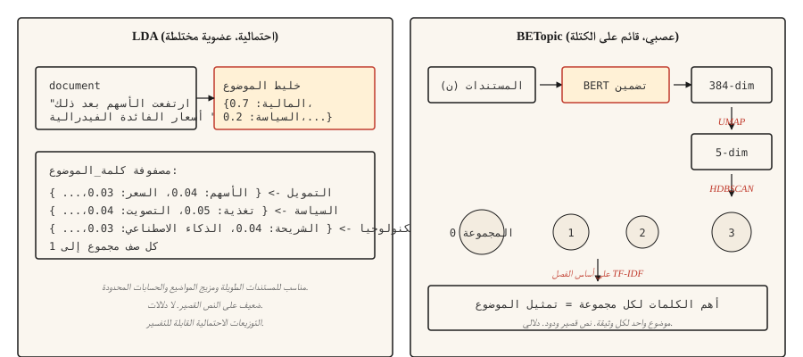

# نمذجة الموضوع — LDA وBERTopic
> LDA: المستندات عبارة عن خليط من المواضيع، والموضوعات عبارة عن توزيعات على الكلمات. BERTopic: مجموعة المستندات في مساحة التضمين، والمجموعات عبارة عن موضوعات. نفس الهدف، بدائيات مختلفة.
**النوع:** تعلم
** اللغات: ** بايثون
** المتطلبات الأساسية: ** المرحلة 5 · 02 (BoW + TF-IDF)، المرحلة 5 · 03 (Word2Vec)
**الوقت:** ~45 دقيقة
## المشكلة
لديك 10000 تذكرة دعم عملاء، أو 50000 مقال إخباري، أو 200000 تغريدة. أنت بحاجة إلى معرفة محتوى المجموعة دون قراءتها. ليس لديك فئات مصنفة. أنت لا تعرف حتى عدد الفئات الموجودة.
نمذجة الموضوع تجيب على ذلك دون إشراف. أعطها مجموعة، واحصل على مجموعة صغيرة من المواضيع المتماسكة، وقم بتوزيع تلك المواضيع لكل وثيقة.
تهيمن عائلتين خوارزميتين. LDA (2003) يتعامل مع كل وثيقة على أنها مزيج من المواضيع الكامنة وكل موضوع على أنه توزيع على الكلمات. الاستدلال بايزي. لا يزال يتم شحنه في مرحلة الإنتاج حيث تحتاج إلى تعيينات موضوعية ذات عضوية مختلطة وتوزيعات احتمالية قابلة للتفسير على مستوى الكلمات.
يقوم BERTopic (2020) بتشفير المستندات باستخدام BERT، وتقليل الأبعاد باستخدام UMAP، والمجموعات باستخدام HDBSCAN، واستخراج كلمات الموضوع عبر TF-IDF المستند إلى الفصل. إنه يفوز بالنصوص القصيرة ووسائل التواصل الاجتماعي وأي شيء يكون فيه التشابه الدلالي أكثر أهمية من تداخل الكلمات. يحصل مستند واحد على موضوع واحد، وهو ما يشكل قيدًا على المحتوى الطويل.
يبني هذا الدرس الحدس لكليهما ويحدد أيهما يجب اختياره لمجموعة معينة.
##المفهوم

**LDA قصة مولدة.** كل موضوع عبارة عن توزيع على الكلمات. كل وثيقة عبارة عن مزيج من المواضيع. لإنشاء كلمة في مستند، قم بعينة موضوع من خليط المستند، ثم قم بعينة كلمة من توزيع هذا الموضوع. الاستدلال يعكس هذا: بالنظر إلى الكلمات التي تمت ملاحظتها، يستنتج توزيع الموضوع لكل مستند وتوزيع الكلمة لكل موضوع. يقوم أخذ عينات Gibbs المطوي أو Bayes المتغير بإجراء العمليات الحسابية.
إخراج المفتاح LDA:
- `doc_topic`: مصفوفة `(n_docs, n_topics)`، مجموع كل صف هو 1 (خليط موضوع المستند).
- `topic_word`: مصفوفة `(n_topics, vocab_size)`، مجموع كل صف هو 1 (توزيع كلمات الموضوع).
** موضوع pipeline.**
1. قم بتشفير كل مستند باستخدام محول الجملة (على سبيل المثال، `all-MiniLM-L6-v2`). 384 ناقلات خافتة.
2. قم بتقليل الأبعاد باستخدام UMAP إلى ~5 أبعاد. BERT عمليات التضمين ذات درجة إعتام عالية جدًا بحيث لا يمكن تجميعها.
3. المجموعة ذات HDBSCAN. على أساس الكثافة، ينتج عناقيد متغيرة الحجم وتسمية "خارجية".
4. بالنسبة لكل مجموعة، قم بحساب TF-IDF على أساس الفئة على مستندات المجموعة لاستخراج الكلمات العليا.
الإخراج هو موضوع واحد لكل مستند (بالإضافة إلى تسمية خارجية -1). اختياريًا، عضوية بسيطة عبر متجه احتمالية HDBSCAN.
## بنائها
### الخطوة 1: LDA عبر scikit-learn
```python
from sklearn.feature_extraction.text import CountVectorizer
from sklearn.decomposition import LatentDirichletAllocation
import numpy as np


def fit_lda(documents, n_topics=5, max_features=1000):
    cv = CountVectorizer(
        max_features=max_features,
        stop_words="english",
        min_df=2,
        max_df=0.9,
    )
    X = cv.fit_transform(documents)
    lda = LatentDirichletAllocation(
        n_components=n_topics,
        random_state=42,
        max_iter=50,
        learning_method="online",
    )
    doc_topic = lda.fit_transform(X)
    feature_names = cv.get_feature_names_out()
    return lda, cv, doc_topic, feature_names


def print_top_words(lda, feature_names, n_top=10):
    for idx, topic in enumerate(lda.components_):
        top_idx = np.argsort(-topic)[:n_top]
        words = [feature_names[i] for i in top_idx]
        print(f"topic {idx}: {' '.join(words)}")
```

ملاحظة: تمت إزالة كلمات الإيقاف، وتصفية min_df وmax_df للمصطلحات النادرة والمنتشرة في كل مكان، CountVectorizer (وليس TfidfVectorizer) لأن LDA يتوقع الأعداد الأولية.
### الخطوة 2: موضوع بيرت (الإنتاج)
```python
from bertopic import BERTopic

topic_model = BERTopic(
    embedding_model="sentence-transformers/all-MiniLM-L6-v2",
    min_topic_size=15,
    verbose=True,
)

topics, probs = topic_model.fit_transform(documents)
info = topic_model.get_topic_info()
print(info.head(20))
valid_topics = info[info["Topic"] != -1]["Topic"].tolist()
for topic_id in valid_topics[:5]:
    print(f"topic {topic_id}: {topic_model.get_topic(topic_id)[:10]}")
```

يقوم عامل التصفية الموجود على `Topic != -1` بإسقاط مجموعة BERTopic الخارجية (لا يمكن تجميع المستندات HDBSCAN). يتحكم `min_topic_size` في الحد الأدنى لحجم مجموعة HDBSCAN؛ القيمة الافتراضية لمكتبة BERTopic هي 10. هذا المثال يضبطها على 15 بشكل صريح لمقياس الدرس. بالنسبة إلى المجموعات التي تزيد عن 10000 مستند، قم بزيادة العدد إلى 50 أو 100.
### الخطوة 3: التقييم
تقوم كلتا الطريقتين بإخراج كلمات الموضوع. والسؤال هو ما إذا كانت هذه الكلمات متماسكة.
- **تماسك الموضوع (c_v).** يجمع NPMI (المعلومات المتبادلة النقطية المقيسة) لأزواج الكلمات العليا عبر سياقات النافذة المنزلقة، ويجمع الدرجات في متجهات الموضوع، ويقارن تلك المتجهات عبر تشابه جيب التمام. الأعلى هو الأفضل. استخدم `gensim.models.CoherenceModel` مع `coherence="c_v"`.
- **تنوع المواضيع.** جزء من الكلمات الفريدة عبر أهم الكلمات في جميع المواضيع. الأعلى هو الأفضل (المواضيع لا تتداخل).
- **الفحص النوعي.** اقرأ الكلمات العليا في كل موضوع. هل يسمون شيئًا حقيقيًا؟ الحكم البشري لا يزال هو خط الدفاع الأخير.
## متى تختار أي منها
| الوضع | اختر |
|-----------|------|
| نص قصير (تغريدات، تعليقات، عناوين) | موضوع بيرت |
| مستندات طويلة تحتوي على خليط من المواضيع | LDA |
| لا يوجد GPU / حساب محدود | LDA أو NMF |
| بحاجة إلى توزيعات متعددة المواضيع على مستوى الوثيقة | LDA |
| LLM التكامل لتصنيف المواضيع | موضوع بيرت (دعم مباشر) |
| نشر الحافة محدودة الموارد | __المصطلح_6__ |
| ماكس التماسك الدلالي | موضوع بيرت |
أكبر اعتبار عملي هو طول الوثيقة. BERT يتم اقتطاع التضمينات؛ LDA تعمل الأعداد مهما كان طولها. بالنسبة للمستندات الأطول من سياق نموذج التضمين، إما قطعة + تجميع أو استخدم LDA.
## استخدمه
مكدس 2026:
- **BERTopic.** الافتراضي للنص القصير وأي شيء حيث الدلالات مهمة.
- **`gensim.models.LdaModel`.** كلاسيكي LDA للإنتاج، ناضج، تم اختباره في المعركة.
- **`sklearn.decomposition.LatentDirichletAllocation`.** سهل LDA للتجارب.
- **NMF.** تحليل المصفوفة غير السالبة. بديل سريع لـ LDA، جودة مماثلة للنص القصير.
- **Top2Vec.** تصميم مشابه لـBERTopic. مجتمع أصغر ولكنه جيد في بعض المعايير.
- **FASTopic.** أحدث وأسرع من BERTopic على مجموعات كبيرة جدًا.
- التصنيف المستند إلى **LLM.** قم بتشغيل أي مجموعة، ثم اطلب من النموذج تسمية كل مجموعة.
## اشحنها
حفظ باسم `outputs/skill-topic-picker.md`:
```markdown
---
name: topic-picker
description: Pick LDA or BERTopic for a corpus. Specify library, knobs, evaluation.
version: 1.0.0
phase: 5
lesson: 15
tags: [nlp, topic-modeling]
---

Given a corpus description (document count, avg length, domain, language, compute budget), output:

1. Algorithm. LDA / NMF / BERTopic / Top2Vec / FASTopic. One-sentence reason.
2. Configuration. Number of topics: `recommended = max(5, round(sqrt(n_docs)))`, clamped to 200 for corpora under 40,000 docs; permit >200 only when the corpus is genuinely large (>40k) and note the increased compute cost. `min_df` / `max_df` filters and embedding model for neural approaches also belong here.
3. Evaluation. Topic coherence (c_v) via `gensim.models.CoherenceModel`, topic diversity, and a 20-sample human read.
4. Failure mode to probe. For LDA, "junk topics" absorbing stopwords and frequent terms. For BERTopic, the -1 outlier cluster swallowing ambiguous documents.

Refuse BERTopic on documents longer than the embedding model's context window without a chunking strategy. Refuse LDA on very short text (tweets, reviews under 10 tokens) as coherence collapses. Flag any n_topics choice below 5 as likely wrong; flag >200 on corpora under 40k docs as likely over-splitting.
```

## تمارين
1. **سهل.** قم بتركيب LDA مع 5 موضوعات في مجموعة بيانات 20 مجموعة أخبار. طباعة أعلى 10 كلمات لكل موضوع. قم بتسمية كل موضوع يدويًا. هل وجدت الخوارزمية الفئات الحقيقية؟
2. **متوسط.** قم بتركيب موضوع BERTopic على نفس المجموعة الفرعية العشرين لمجموعة الأخبار. قارن عدد المواضيع التي تم العثور عليها، وأهم الكلمات، والتماسك النوعي مع LDA. ما هي الفئات الحقيقية التي تظهر بشكل أكثر نظافة؟
3. **صعب.** احسب تماسك c_v لكل من LDA وBERTopic في مجموعتك. قم بتشغيل كل منها بـ 5، 10، 20، 50 موضوعًا. تماسك المؤامرة مقابل عدد المواضيع. قم بالإبلاغ عن الطريقة الأكثر استقرارًا عبر عدد المواضيع.
## المصطلحات الرئيسية
| مصطلح | ماذا يقول الناس | ماذا يعني في الواقع |
|------|-|--------------------------------------|
| الموضوع | شيء يدور حوله الجسم | توزيع احتمالي على الكلمات (LDA) أو مجموعة من المستندات المماثلة (BERTopic). |
| العضوية المختلطة | الوثيقة عبارة عن مواضيع متعددة | LDA يخصص لكل مستند توزيعًا على جميع المواضيع. |
| __المصطلح_2__ | تخفيض الأبعاد | التعلم المتعدد الذي يحافظ على البنية المحلية؛ المستخدمة في BERTopic. |
| __المصطلح_3__ | تجميع الكثافة | يجد مجموعات ذات حجم متغير. ينتج علامة "ضوضاء" (-1) للقيم المتطرفة. |
| تماسك c_v | مقياس جودة الموضوع | متوسط ​​المعلومات المتبادلة ذات الاتجاه النقطي لأهم كلمات الموضوع داخل النوافذ المنزلقة. |
## مزيد من القراءة
- [Blei, Ng, Jordan (2003). Latent Dirichlet Allocation](https://www.jmlr.org/papers/volume3/blei03a/blei03a.pdf) — الورقة LDA.
- [Grootendorst (2022). BERTopic: Neural topic modeling with a class-based TF-IDF procedure](https://arxiv.org/abs/2203.05794) — ورقة موضوع BER.
- [Röder, Both, Hinneburg (2015). Exploring the Space of Topic Coherence Measures](https://svn.aksw.org/papers/2015/WSDM_Topic_Evaluation/public.pdf) — الورقة التي قدمت السيرة الذاتية والأصدقاء.
- [BERTopic documentation](https://maartengr.github.io/BERTopic/) — مرجع الإنتاج. أمثلة ممتازة.