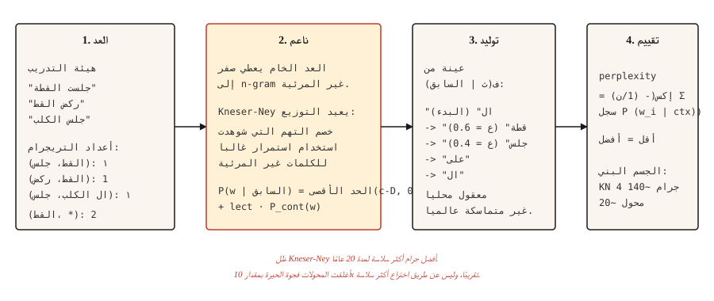

# Text Generation Before Transformers — N-gram Language Models

> إذا كانت الكلمة مفاجئة، فالنموذج سيء. الحيرة makes مفاجأة رقم. التنعيم يبقيه محدودًا.

**النوع:** بناء
** اللغات: ** بايثون
** المتطلبات الأساسية: ** المرحلة 5 · 01 (معالجة النصوص)، المرحلة 2 · 14 (نايف بايز)
**الوقت:** ~45 دقيقة

## The Problem

قبل المحولات، وقبل شبكات RNN، وقبل تضمين الكلمات، تنبأ نموذج اللغة بالكلمة التالية عن طريق حساب عدد المرات التي اتبعت فيها الكلمات `n-1` السابقة. عد "القطة" ← "جلست" 47 مرة، "القطة" ← "قفزت" 12 مرة، "القطة" ← "الثلاجة" 0 مرة. تطبيع للحصول على التوزيع الاحتمالي.

هذا هو نموذج لغة n-gram. لقد قام بتشغيل كل أدوات التعرف على الكلام، وكل المدقق الإملائي، وكل نظام ترجمة آلي قائم على العبارات من عام 1980 حتى عام 2015. ولا يزال يعمل عندما تحتاج إلى نمذجة لغة رخيصة على الجهاز.

المشكلة المثيرة للاهتمام هي ما يجب فعله بشأن n-grams غير المرئية. يعين النموذج القائم على العد الأولي احتمالية صفر لأي شيء لم يراه، وهو أمر كارثي لأن الجمل طويلة وكل جملة طويلة تقريبًا تحتوي على تسلسل واحد غير مرئي على الأقل. خمسون عامًا من أبحاث التجانس أصلحت ذلك. وكانت النتيجة تجانس Kneser-Ney، وقد ورث التعلم العميق الحديث تقاليده التجريبية.

## The Concept



**احتمال N-gram:** `P(w_i | w_{i-n+1},..., w_{i-1})`. أصلح `n` (عادةً 3 لثلاثيات، و4 لـ 4 جرام). حساب من الأعداد:

```text
P(w | context) = count(context, w) / count(context)
```

**مسألة العد الصفري.** أي n-gram لم يتم رؤيته في التدريب يحصل على احتمال صفر. وجدت دراسة أجريت عام 2007 على مجموعة براون أنه حتى النموذج الذي يزن 4 جرامات كان لديه 30% من الـ 4 جرامات التي لم يتم رؤيتها أثناء التدريب. لا يمكنك التقييم على أي نص حقيقي دون تجانسه.

**أساليب التجانس من حيث التعقيد:**

1. ** لابلاس (إضافة واحد).** أضف 1 إلى كل عدد. بسيطة، رهيبة في الأحداث النادرة.
2. ** تورينج الجيد. ** إعادة تخصيص الكتلة الاحتمالية من الأحداث ذات التردد العالي إلى الأحداث غير المرئية بناءً على تردد الترددات.
3. ** الاستيفاء. ** اجمع بين تقديرات n-gram و(n-1)-gram وما إلى ذلك مع الأوزان القابلة للضبط.
4. **التراجع.** إذا كان عدد n-gram صفرًا، فارجع إلى (n-1)-gram. تراجع كاتز يطبع هذا.
5. **الخصم المطلق.** اطرح خصمًا ثابتًا `D` من جميع الأعداد، وأعد توزيعه على غير المرئي.
6. **Kneser-Ney.** الخصم المطلق بالإضافة إلى الاختيار الذكي لنموذج الترتيب الأدنى: استخدم *احتمال الاستمرارية* (عدد السياقات التي تظهر فيها الكلمة) بدلاً من التكرار الأولي.

إن رؤية Kneser-Ney عميقة. "سان فرانسيسكو" هو بيغرام شائع. يظهر Unigram "Francisco" في الغالب بعد "San". الخصم المطلق الساذج يعطي "فرانسيسكو" احتمالية عالية لليونيجرام (لأن العدد مرتفع). لاحظ Kneser-Ney أن كلمة "Francisco" تظهر في سياق واحد فقط وتقلل من احتمالية استمرارها وفقًا لذلك. النتيجة: رواية كبيرة تنتهي بـ "فرانسيسكو" تحصل على الاحتمالية المنخفضة المناسبة.

**التقييم: حيرة.** أس متوسط ​​احتمالية السجل السلبي لكل كلمة في مجموعة اختبار معلقة. أقل هو أفضل. والحيرة البالغة 100 تعني أن النموذج مرتبك بقدر ما سيختار بشكل موحد بين 100 كلمة.

```text
perplexity = exp(- (1/N) * Σ log P(w_i | context_i))
```

## Build It

### Step 1: trigram counts

```python
from collections import Counter, defaultdict


def train_ngram(corpus_tokens, n=3):
    ngrams = Counter()
    contexts = Counter()
    for sentence in corpus_tokens:
        padded = ["<s>"] * (n - 1) + sentence + ["</s>"]
        for i in range(len(padded) - n + 1):
            ctx = tuple(padded[i:i + n - 1])
            word = padded[i + n - 1]
            ngrams[ctx + (word,)] += 1
            contexts[ctx] += 1
    return ngrams, contexts


def raw_probability(ngrams, contexts, context, word):
    ctx = tuple(context)
    if contexts.get(ctx, 0) == 0:
        return 0.0
    return ngrams.get(ctx + (word,), 0) / contexts[ctx]
```

الإدخال عبارة عن قائمة من الجمل المميزة. الإخراج هو عدد n-gram وعدد السياق. `<s>` و `</s>` هي حدود الجملة.

### Step 2: Laplace smoothing

```python
def laplace_probability(ngrams, contexts, vocab_size, context, word):
    ctx = tuple(context)
    numerator = ngrams.get(ctx + (word,), 0) + 1
    denominator = contexts.get(ctx, 0) + vocab_size
    return numerator / denominator
```

أضف 1 إلى كل عدد. ينعم الأحداث غير المرئية ولكنه يبالغ في تخصيصها، مما يضر بالأحداث النادرة المعروفة أيضًا.

### Step 3: Kneser-Ney (bigram, interpolated)

```python
def kneser_ney_bigram_model(corpus_tokens, discount=0.75):
    unigrams = Counter()
    bigrams = Counter()
    unigram_contexts = defaultdict(set)

    for sentence in corpus_tokens:
        padded = ["<s>"] + sentence + ["</s>"]
        for i, w in enumerate(padded):
            unigrams[w] += 1
            if i > 0:
                prev = padded[i - 1]
                bigrams[(prev, w)] += 1
                unigram_contexts[w].add(prev)

    total_unique_bigrams = sum(len(ctx_set) for ctx_set in unigram_contexts.values())
    continuation_prob = {
        w: len(ctx_set) / total_unique_bigrams for w, ctx_set in unigram_contexts.items()
    }

    context_totals = Counter()
    for (prev, w), count in bigrams.items():
        context_totals[prev] += count

    unique_follow = defaultdict(set)
    for (prev, w) in bigrams:
        unique_follow[prev].add(w)

    def prob(prev, w):
        count = bigrams.get((prev, w), 0)
        denom = context_totals.get(prev, 0)
        if denom == 0:
            return continuation_prob.get(w, 1e-9)
        first_term = max(count - discount, 0) / denom
        lambda_prev = discount * len(unique_follow[prev]) / denom
        return first_term + lambda_prev * continuation_prob.get(w, 1e-9)

    return prob
```

ثلاثة أجزاء متحركة. `continuation_prob` يلتقط "كم عدد السياقات المختلفة التي تظهر فيها هذه الكلمة؟" (ابتكار كينسير-ناي). `lambda_prev` هي الكتلة التي تم تحريرها بواسطة الخصم، والتي يتم استخدامها لترجيح التراجع. الاحتمال النهائي هو الحد الرئيسي المخصوم بالإضافة إلى الحد الاستمراري المرجح.

### Step 4: generating text with sampling

```python
import random


def generate(prob_fn, vocab, prefix, max_len=30, seed=0):
    rng = random.Random(seed)
    tokens = list(prefix)
    for _ in range(max_len):
        candidates = [(w, prob_fn(tokens[-1], w)) for w in vocab]
        total = sum(p for _, p in candidates)
        r = rng.random() * total
        acc = 0.0
        for w, p in candidates:
            acc += p
            if r <= acc:
                tokens.append(w)
                break
        if tokens[-1] == "</s>":
            break
    return tokens
```

أخذ العينات يتناسب مع الاحتمال. يعطي دائمًا مخرجات مختلفة لكل بذرة. للحصول على مخرجات تشبه بحث الشعاع، اختر argmax في كل خطوة (الجشع) وأضف مقبض عشوائي صغير (درجة الحرارة).

### Step 5: perplexity

```python
import math


def perplexity(prob_fn, sentences):
    total_log_prob = 0.0
    total_tokens = 0
    for sentence in sentences:
        padded = ["<s>"] + sentence + ["</s>"]
        for i in range(1, len(padded)):
            p = prob_fn(padded[i - 1], padded[i])
            total_log_prob += math.log(max(p, 1e-12))
            total_tokens += 1
    return math.exp(-total_log_prob / total_tokens)
```

أقل هو أفضل. بالنسبة إلى الجسم البني، يصل نموذج 4 جرام KN المضبوط جيدًا إلى درجة حيرة حوالي 140. ويصل المحول LM إلى 15-30 في نفس مجموعة الاختبار. الفجوة حوالي 10x. هذه الفجوة هي سبب تحرك المجال.

## Use It

- **التدريس الكلاسيكي NLP.** أوضح تعرض يمكنك الحصول عليه للتنعيم وMLE والحيرة.
- **KenLM.** مكتبة إنتاج n-gram. يُستخدم كأداة إنقاذ في أنظمة الكلام وMT حيث يكون الكمون المنخفض مهمًا.
- **الإكمال التلقائي على الجهاز.** نماذج Trigram في لوحات المفاتيح. ما زال.
- **خطوط الأساس.** قم دائمًا بحساب n-gram LM الحيرة قبل الإعلان عن أن LM العصبي الخاص بك جيد. إذا لم يتغلب محولك على KN بهامش واسع، فهذا يعني أن هناك خطأ ما.

## Ship It

حفظ باسم `outputs/prompt-lm-baseline.md`:

```markdown
---
name: lm-baseline
description: Build a reproducible n-gram language model baseline before training a neural LM.
phase: 5
lesson: 16
---

Given a corpus and target use (next-word prediction, rescoring, perplexity baseline), output:

1. N-gram order. Trigram for general English, 4-gram if corpus is large, 5-gram for speech rescoring.
2. Smoothing. Modified Kneser-Ney is the default; Laplace only for teaching.
3. Library. `kenlm` for production, `nltk.lm` for teaching, roll your own only to learn.
4. Evaluation. Held-out perplexity with consistent tokenization between train and test sets.

Refuse to report perplexity computed with different tokenization between systems being compared — perplexity numbers are comparable only under identical tokenization. Flag OOV rate in test set; KN handles OOV poorly unless you reserve a special <UNK> token during training.
```

## Exercises

1. **سهل.** قم بتدريب شكل ثلاثي الأبعاد LM على مجموعة مؤلفة من 1000 جملة لشكسبير. توليد 20 جملة. وسوف تكون معقولة محلياً ولكنها غير متماسكة عالمياً. هذا هو العرض الكنسي.
2. **متوسط.** قم بتنفيذ الحيرة لنموذج KN الخاص بك على تقسيم شكسبير المعلق. قارن ضد لابلاس. يجب أن ترى KN حيرة أقل بنسبة 30-50%.
3. **صعب.** أنشئ مصححًا إملائيًا ثلاثي الأبعاد: نظرًا لكلمة بها أخطاء إملائية وسياقها، قم بإنشاء تصحيحات وترتيبها حسب احتمالية السياق ضمن LM. قم بالتقييم في مجموعة تهجئة بيركبيك (عامة).

## Key Terms

| مصطلح | ماذا يقول الناس | ماذا يعني في الواقع |
|------|-|--------------------------------------|
| ن جرام | تسلسل الكلمات | تسلسل الرموز المميزة `n` المتتالية. |
| تنعيم | تجنب الأصفار | إعادة توزيع كتلة الاحتمالية بحيث تحصل الأحداث غير المرئية على احتمالية غير صفرية. |
| الحيرة | LM مقياس الجودة | `exp(-average log-prob)` على البيانات المحفوظة. أقل هو أفضل. |
| التراجع | الرجوع إلى سياق أقصر | إذا كان عدد التريجرام صفرًا، فاستخدم البيجرام. تراجع كاتز يضفي الطابع الرسمي على هذا. |
| كنيسر-ناي | أفضل تجانس لـ n-gram | الخصم المطلق + احتمال الاستمرارية لنموذج الترتيب الأدنى. |
| احتمال الاستمرار | KN- خاص | يظهر `P(w)` مرجح بعدد السياقات `w`، وليس حسب العدد الأولي. |

## Further Reading

- [Jurafsky and Martin — Speech and Language Processing, Chapter 3 (2026 draft)](https://web.stanford.edu/~jurafsky/slp3/3.pdf) — the canonical treatment of n-gram LMs and smoothing.
- [Chen and Goodman (1998). دراسة تجريبية لتقنيات التجانس لنمذجة اللغة](https://dash.harvard.edu/handle/1/25104739) — الورقة التي حسمت Kneser-Ney كأفضل غرام n أكثر سلاسة.
- [كنيسر وناي (1995). تحسين النسخ الاحتياطي لنمذجة لغة M-gram](https://ieeexplore.ieee.org/document/479394) — الورقة KN الأصلية.
- [KenLM](https://kheafield.com/code/kenlm/) — إنتاج سريع لـ n-gram LM، لا يزال يستخدم في عام 2026 للتطبيقات الحساسة لزمن الوصول.
