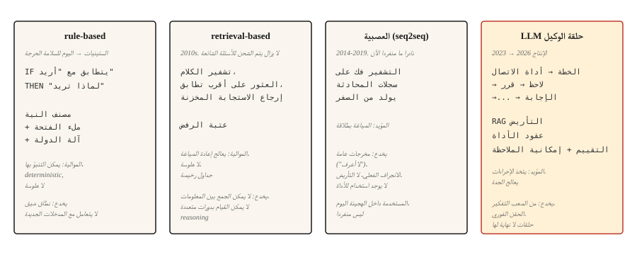

# Chatbots — Rule-Based to Neural to LLM Agents

> ELIZA تم الرد بمطابقات النمط. DialogFlow المعينة النوايا. GPT الجواب من الأوزان. يقوم كلود بتشغيل الأدوات والتحقق. كل عصر حل أسوأ فشل في العصر السابق.

**النوع:** تعلم
** اللغات: ** بايثون
**المتطلبات الأساسية:** المرحلة 5 · 13 (الإجابة على الأسئلة)، المرحلة 5 · 14 (استرجاع المعلومات)
**الوقت:** ~75 دقيقة

## The Problem

يقول أحد المستخدمين "أريد تغيير رحلتي". يجب على النظام معرفة ما يريدون، وما هي المعلومات المفقودة، وكيفية الحصول عليها، وكيفية إكمال الإجراء. ثم يقول المستخدم "انتظر، ماذا لو قمت بالإلغاء بدلاً من ذلك؟" ويجب على النظام أن يتذكر السياق، ويبدل المهام، ويحافظ على الحالة.

المحادثة صعبة بالنسبة لنظام ML. الإدخال مفتوح. يجب أن يكون الناتج متماسكًا على مدار العديد من المنعطفات. قد يحتاج النظام إلى التصرف في العالم (تغيير رحلة الطيران، شحن البطاقة). كل خطوة خاطئة تكون مرئية للمستخدم.

لقد مرت بنيات Chatbot عبر أربعة نماذج، تم تقديم كل منها لأن النموذج السابق فشل بشكل واضح للغاية. هذا الدرس يرشدهم بالترتيب. يعتبر مشهد الإنتاج لعام 2026 مزيجًا من الاثنين الأخيرين.

## The Concept



** المستندة إلى القواعد (ELIZA، AIML، DialogFlow).** تتطابق الأنماط المكتوبة يدويًا مع مدخلات المستخدم وتنتج استجابات. تقوم مصنفات النوايا بتوجيه التدفقات المحددة مسبقًا. تقوم أجهزة حالة ملء الفتحات بجمع المعلومات المطلوبة. يعمل ببراعة داخل النطاق الضيق الذي صمم من أجله. فشل على الفور خارجها. لا يزال يتم الشحن في مجالات السلامة الحرجة (المصادقة المصرفية، وحجز شركات الطيران) حيث لا يتم التسامح مع الهلوسة.

** يعتمد على الاسترجاع. ** نظام على طراز FAQ. تشفير كل زوج من (النطق، الاستجابة). في وقت التشغيل، قم بتشفير رسالة المستخدم واسترجاع أقرب استجابة مخزنة. فكر في ميزة "المقالات المشابهة" الكلاسيكية في Zendesk. يتعامل مع إعادة الصياغة بشكل أفضل من القواعد. لا يوجد جيل، لذلك لا هلوسة.

** العصبية (seq2seq). ** تم تدريب أداة التشفير وفك التشفير على سجلات المحادثة. يولد ردود من الصفر. بطلاقة ولكن عرضة للمخرجات العامة ("لا أعرف") والانجراف الواقعي. لا يمكن الاعتماد عليها أبدا في الموضوع. السبب وراء ظهور روبوتات الدردشة المخيبة للآمال في Google وFacebook وMicrosoft في 2016-2019

**LLM وكلاء.** نموذج لغة ملفوف في حلقة تخطط وتستدعي الأدوات وتتحقق من النتائج. ليس chatbot مع مطالبة طويلة. حلقة الوكيل: التخطيط ← أداة الاتصال ← مراقبة النتيجة ← تحديد الخطوة التالية. التأريض بالاسترجاع أولاً (RAG) يمنعه من الهلوسة. تتيح استدعاءات الأداة لها القيام بالأشياء بالفعل. هذه هي بنية 2026.

النماذج الأربعة ليست بدائل تسلسلية. يتنقل روبوت الدردشة الإنتاجي لعام 2026 عبر الأربعة: القائم على القواعد للمصادقة والإجراءات التدميرية، واسترجاع FAQ، والجيل العصبي للصياغة الطبيعية، ووكيل LLM للاستعلامات الغامضة المفتوحة.

## Build It

### Step 1: rule-based pattern matching

```python
import re


class RulePattern:
    def __init__(self, pattern, response_template):
        self.regex = re.compile(pattern, re.IGNORECASE)
        self.template = response_template


PATTERNS = [
    RulePattern(r"my name is (\w+)", "Nice to meet you, {0}."),
    RulePattern(r"i (need|want) (.+)", "Why do you {0} {1}?"),
    RulePattern(r"i feel (.+)", "Why do you feel {0}?"),
    RulePattern(r"(.*)", "Tell me more about that."),
]


def rule_based_respond(user_input):
    for pattern in PATTERNS:
        m = pattern.regex.match(user_input.strip())
        if m:
            return pattern.template.format(*m.groups())
    return "I don't understand."
```

ELIZA في 20 سطراً. إن خدعة التفكير ("أشعر بالحزن" → "لماذا تشعر بالحزن") هي العرض التوضيحي الأساسي للمعالج النفسي من Weizenbaum 1966. ولا يزال مفيدًا.

### Step 2: retrieval-based (FAQ)

يتطلب هذا المقتطف التوضيحي `pip install sentence-transformers` (الذي يسحب الشعلة). يستخدم الملف القابل للتشغيل `code/main.py` لهذا الدرس تشابه stdlib Jaccard بدلاً من ذلك، بحيث يتم تشغيل الدرس بدون تبعيات خارجية.

```python
from sentence_transformers import SentenceTransformer
import numpy as np


FAQ = [
    ("how do i reset my password", "Go to Settings > Security > Reset Password."),
    ("how do i cancel my order", "Go to Orders, find the order, click Cancel."),
    ("what is your return policy", "30-day returns on unused items, original packaging."),
]


encoder = SentenceTransformer("sentence-transformers/all-MiniLM-L6-v2")
faq_questions = [q for q, _ in FAQ]
faq_embeddings = encoder.encode(faq_questions, normalize_embeddings=True)


def faq_respond(user_input, threshold=0.5):
    q_emb = encoder.encode([user_input], normalize_embeddings=True)[0]
    sims = faq_embeddings @ q_emb
    best = int(np.argmax(sims))
    if sims[best] < threshold:
        return None
    return FAQ[best][1]
```

الرفض على أساس العتبة هو خيار التصميم الرئيسي. إذا لم تكن أفضل مطابقة قريبة بدرجة كافية، فارجع `None` ودع النظام يتصاعد.

### Step 3: neural generation (baseline)

استخدم وحدة فك ترميز وتشفير صغيرة مضبوطة للتعليمات (FLAN-T5) أو نموذج محادثة مضبوط بدقة. الإنتاج غير صالح للاستخدام من تلقاء نفسه في عام 2026 (تناقض، انحراف خارج الموضوع، هراء واقعي)، ولكنه يتم شحنه داخل أنظمة هجينة للصياغة الطبيعية. تحتاج نماذج وحدة فك التشفير فقط بنمط DialoGPT إلى فواصل دوران واضحة ومعالجة EOS لإنتاج ردود متماسكة؛ FLAN-T5 text2text pipeline يعمل خارج الصندوق للحصول على مثال تعليمي.

```python
from transformers import pipeline

chatbot = pipeline("text2text-generation", model="google/flan-t5-small")

response = chatbot("Respond politely to: Hi there!", max_new_tokens=40)
print(response[0]["generated_text"])
```

### Step 4: LLM agent loop

شكل الإنتاج 2026:

```python
def agent_loop(user_message, tools, llm, max_steps=5):
    history = [{"role": "user", "content": user_message}]
    for _ in range(max_steps):
        response = llm(history, tools=tools)
        tool_call = response.get("tool_call")
        if tool_call:
            tool_name = tool_call.get("name")
            args = tool_call.get("arguments")
            if not isinstance(tool_name, str) or tool_name not in tools:
                history.append({"role": "assistant", "tool_call": tool_call})
                history.append({"role": "tool", "name": str(tool_name), "content": f"error: unknown tool {tool_name!r}"})
                continue
            if not isinstance(args, dict):
                history.append({"role": "assistant", "tool_call": tool_call})
                history.append({"role": "tool", "name": tool_name, "content": f"error: arguments must be a dict, got {type(args).__name__}"})
                continue
            fn = tools[tool_name]
            result = fn(**args)
            history.append({"role": "assistant", "tool_call": tool_call})
            history.append({"role": "tool", "name": tool_name, "content": result})
        else:
            return response["content"]
    return "I could not complete the task in the step budget."
```

ثلاثة أشياء لتسميتها. الأدوات هي وظائف قابلة للاستدعاء يمكن أن يستدعيها LLM. تنتهي الحلقة عندما يقوم LLM بإرجاع الإجابة النهائية بدلاً من استدعاء الأداة. تمنع ميزانية الخطوة الحلقات اللانهائية في المهام الغامضة.

يضيف الإنتاج الحقيقي: أسس الاسترجاع أولاً (إدخال المستندات ذات الصلة قبل كل مكالمة LLM)، وحواجز الحماية (رفض الإجراءات التدميرية دون تأكيد)، وإمكانية المراقبة (تسجيل كل خطوة)، والتقييمات (الفحوصات الآلية التي تثبت أن سلوك الوكيل يظل وفقًا للمواصفات).

### Step 5: hybrid routing

```python
def hybrid_chat(user_input):
    if is_destructive_action(user_input):
        return structured_flow(user_input)

    faq_answer = faq_respond(user_input, threshold=0.6)
    if faq_answer:
        return faq_answer

    return agent_loop(user_input, tools, llm)


def is_destructive_action(text):
    danger_words = ["delete", "cancel", "charge", "refund", "transfer"]
    return any(w in text.lower() for w in danger_words)
```

النمط: قواعد حتمية لأي شيء مدمر، استرجاع للأسئلة الشائعة المعلبة، وكلاء LLM لكل شيء آخر. هذا ما يأتي في 2026 أنظمة دعم العملاء.

## Use It

مكدس 2026:

| حالة الاستخدام | العمارة |
|---------|--------------|
| الحجز والدفع والتوثيق | آلات الدولة القائمة على القواعد + ملء الفتحات |
| الأسئلة الشائعة حول دعم العملاء | استرجاع الإجابات المنسقة |
| دردشة مساعدة مفتوحة | LLM الوكيل مع RAG + مكالمات الأداة |
| الأدوات الداخلية / IDE مساعدين | LLM وكيل مع استدعاءات الأداة (بحث، قراءة، كتابة) |
| روبوتات الدردشة المصاحبة/الشخصية | تم ضبطه LLM مع موجه نظام الشخصية، واسترجاع المعرفة |

استخدم دائمًا التوجيه المختلط في الإنتاج. لا توجد بنية واحدة تتعامل مع كل طلب بشكل جيد. عادةً ما تكون طبقة التوجيه نفسها عبارة عن مصنف صغير للقصد.

## Failure modes that still ship

- **تلفيق واثق.** LLM الوكيل يدعي أنه أكمل إجراءً لم يقم به. التخفيف: التحقق من النتائج، وتسجيل استدعاءات الأداة، ولا تدع LLM تدعي أنها فعلت شيئًا دون عودة ناجحة للأداة.
- **الإدخال الفوري.** يقوم المستخدم بإدخال النص الذي يتجاوز مطالبة النظام. حصل على تصنيف LLM01 في OWASP أفضل 10 تطبيقات LLM لعام 2025. نكهتان: الحقن المباشر (يتم لصقه في الدردشة) والحقن غير المباشر (مخفي في المستندات أو رسائل البريد الإلكتروني أو مخرجات الأداة التي يقرأها الوكيل).

  تختلف معدلات الهجوم حسب السيناريو. تتراوح معدلات النجاح المُقاسة بين 0.5% إلى 8.5% عبر النماذج الرائدة في استخدام الأدوات العامة ومعايير الترميز. وصلت الإعدادات المحددة عالية المخاطر (الهجمات التكيفية ضد وكلاء الترميز AI والتنسيق الضعيف) إلى 84% تقريبًا. تشتمل التهديدات المشتركة للإنتاج على EchoLeak (CVE-2025-32711، CVSS 9.3) - وهو ثغرة في استخراج البيانات بدون نقرة في Microsoft 365 Copilot والتي يتم تشغيلها بواسطة بريد إلكتروني يتحكم فيه المهاجم.

  إجراءات التخفيف: التعامل مع مدخلات المستخدم على أنها غير موثوقة طوال الحلقة؛ التعقيم قبل استدعاء الأداة؛ عزل مخرجات الأداة عن الموجه الرئيسي؛ استخدم نمط الخطة-التحقق-التنفيذ (PVE) حيث يخطط الوكيل أولاً، ثم يتحقق من كل إجراء مقابل تلك الخطة قبل التنفيذ (تنتج أداة الإيقاف هذه عن إدخال إجراءات جديدة غير مخطط لها)؛ طلب تأكيد المستخدم للإجراءات التدميرية؛ تطبيق الامتياز الأقل على نطاقات الأداة.

  ولا يوجد أي قدر من الهندسة السريعة يزيل هذا الخطر تمامًا. طبقات الدفاع الخارجية في وقت التشغيل (LLM الحماية، والتحقق من صحة القائمة المسموح بها، والكشف عن الشذوذ الدلالي) مطلوبة.
- **زحف النطاق.** يخرج الوكيل عن المهمة نظرًا لأن استدعاء الأداة أدى إلى إرجاع معلومات ذات صلة بشكل عرضي. التخفيف: عقود الأدوات الضيقة؛ الحفاظ على تركيز موجه النظام؛ إضافة تقييمات لمعدل خارج المهمة.
- **حلقات لا نهائية.** يستمر العميل في الاتصال بنفس الأداة. التخفيف: ميزانية الخطوة، وإلغاء تكرار استدعاء الأداة، LLM الحكم على "هل نحرز تقدمًا".
- **استنفاد نافذة السياق.** المحادثات الطويلة تدفع المشاهد الأولى إلى خارج السياق. التخفيف: تلخيص المنعطفات القديمة، أو استرداد المنعطفات السابقة ذات الصلة عن طريق التشابه، أو استخدام نموذج سياق طويل.

## Ship It

حفظ باسم `outputs/skill-chatbot-architect.md`:

```markdown
---
name: chatbot-architect
description: Design a chatbot stack for a given use case.
version: 1.0.0
phase: 5
lesson: 17
tags: [nlp, agents, chatbot]
---

Given a product context (user need, compliance constraints, available tools, data volume), output:

1. Architecture. Rule-based, retrieval, neural, LLM agent, or hybrid (specify which paths go where).
2. LLM choice if applicable. Name the model family (Claude, GPT-4, Llama-3.1, Mixtral). Match to tool-use quality and cost.
3. Grounding strategy. RAG sources, retrieval method (see lesson 14), tool contracts.
4. Evaluation plan. Task success rate, tool-call correctness, off-task rate, hallucination rate on held-out dialogs.

Refuse to recommend a pure-LLM agent for any destructive action (payments, account deletion, data modification) without a structured confirmation flow. Refuse to skip the prompt-injection audit if the agent has write access to anything.
```

## Exercises

1. **سهل.** قم بتنفيذ الاستجابة المستندة إلى القواعد أعلاه باستخدام 10 أنماط لروبوت الطلب في المقهى. حالات حافة الاختبار: الأوامر المزدوجة، التعديلات، الإلغاء، النية غير الواضحة.
2. **متوسط.** قم ببناء هجين FAQ + LLM احتياطي. 50 إدخالًا معلبًا FAQ لمنتج SaaS، LLM احتياطي مع استرجاعها عبر موقع المستندات. قياس معدل الرفض والدقة في 100 سؤال دعم حقيقي.
3. **صعب.** قم بتنفيذ حلقة الوكيل أعلاه باستخدام ثلاث أدوات (البحث، وقراءة بيانات المستخدم، وإرسال البريد الإلكتروني). قم بإجراء تقييم باستخدام 50 سيناريو اختبار بما في ذلك محاولات الحقن الفوري. قم بالإبلاغ عن معدل الخروج من المهمة، ومعدل المهام الفاشلة، وأي نجاح في الحقن.

## Key Terms

| مصطلح | ماذا يقول الناس | ماذا يعني في الواقع |
|------|-|--------------------------------------|
| النية | ما يريده المستخدم | التسمية الفئوية (book_flight، إعادة تعيين_كلمة المرور). تم توجيهها إلى المعالج. |
| فتحة | معلومة | المعلمة التي يحتاجها الروبوت (التاريخ، الوجهة). ملء الفتحة هو تسلسل الطلبات. |
| RAG | الاسترجاع بالإضافة إلى الجيل | استرجع المستندات ذات الصلة، ثم قم بتأسيس استجابة LLM. |
| استدعاء الأداة | استدعاء الدالة | LLM يصدر مكالمة منظمة بالاسم + الوسائط. يتم تنفيذ وقت التشغيل، وإرجاع النتيجة. |
| حلقة الوكيل | خطط، تصرف، تحقق | وحدة التحكم التي تقوم بتشغيل LLM مكالمات متقطعة مع مكالمات الأداة حتى تكتمل المهمة. |
| الحقن الفوري | هجمات المستخدم موجه | مدخلات ضارة تحاول تجاوز موجه النظام. |

## Further Reading

- [Weizenbaum (1966). ELIZA — A Computer Program For the Study of Natural Language Communication](https://web.stanford.edu/class/cs124/p36-weizenabaum.pdf) — the original rule-based chatbot paper.
- [Thoppilan et al. (2022). LaMDA: نماذج اللغة لتطبيقات الحوار](https://arxiv.org/abs/2201.08239) — ورقة الدردشة العصبية المتأخرة من Google، قبل تولي وكلاء LLM المسؤولية مباشرة.
- [Yao et al. (2022). ReAct: Synergizing Reasoning and Acting in Language Models](https://arxiv.org/abs/2210.03629) — the paper that named the agent loop pattern.
- [Anthropic's guide on building effective agents](https://www.anthropic.com/research/building-effective-agents) — 2024 production guidance that still holds in 2026.
- [Greshake et al. (2023). ليس ما قمت بالتسجيل فيه: التنازل عن العالم الحقيقي LLM-التطبيقات المتكاملة مع الحقن الفوري غير المباشر](https://arxiv.org/abs/2302.12173) - ورقة الحقن الفوري.
- [OWASP Top 10 for LLM Applications 2025 — LLM0101 Prompt Injection](https://genai.owasp.org/llmrisk/llm01-prompt-injection/) — the ranking that made prompt injection the top security concern.
- [AWS — Securing Amazon Bedrock Agents against Indirect Prompt Injections](https://aws.amazon.com/blogs/machine-learning/securing-amazon-bedrock-agents-a-guide-to-safeguarding-against-indirect-prompt-injections/) — practical orchestration-layer defenses including Plan-Verify-Execute and user-confirmation flows.
- [EchoLeak (CVE-2025-32711)](https://www.vectra.ai/topics/prompt-injection) — استخراج البيانات الأساسي بنقرة صفرية CVE من الحقن الفوري غير المباشر. حالة مرجعية لسبب احتياج وكلاء الوصول للكتابة إلى دفاعات وقت التشغيل.
