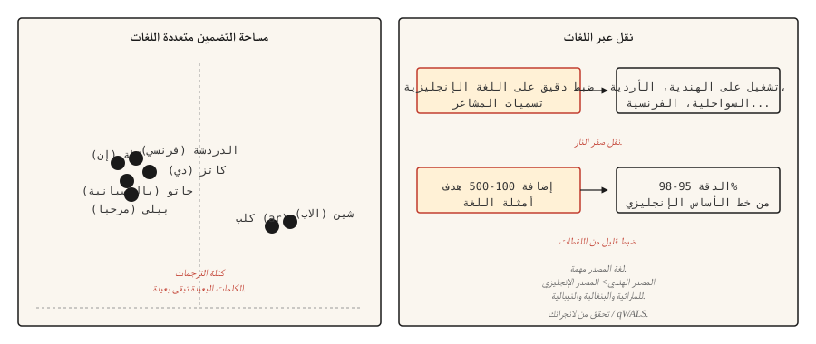

# Multilingual NLP

> نموذج واحد، أكثر من 100 لغة، ولا توجد بيانات تدريب لمعظمها. يعد النقل بين اللغات المعجزة العملية لعقد 2020.

**النوع:** تعلم
** اللغات: ** بايثون
** المتطلبات الأساسية: ** المرحلة 5 · 04 (GloVe، FastText، Subword)، المرحلة 5 · 11 (الترجمة الآلية)
**الوقت:** ~45 دقيقة

## The Problem

تحتوي اللغة الإنجليزية على مليارات الأمثلة المصنفة. الأردية لديها الآلاف. مايثيلي ليس لديه أي شيء تقريبًا. أي نظام NLP عملي يخدم جمهورًا عالميًا يجب أن يعمل على ذيل طويل من اللغات التي لا توجد فيها بيانات تدريب خاصة بالمهمة.

تحل النماذج متعددة اللغات هذه المشكلة عن طريق تدريب نموذج واحد على العديد من اللغات في وقت واحد. يتيح التمثيل المشترك للنموذج نقل المهارات المكتسبة في اللغات ذات الموارد العالية إلى اللغات منخفضة الموارد. قم بضبط النموذج على تحليل المشاعر باللغة الإنجليزية، وسينتج تنبؤات جيدة بشكل مدهش بشأن المشاعر باللغة الأردية. هذا هو النقل الصفري عبر اللغات، وقد أعاد تشكيل كيفية شحن NLP إلى العالم.

يذكر هذا الدرس المفاضلات والنماذج الأساسية والقرار الوحيد الذي يدفع الفرق الجديدة إلى العمل متعدد اللغات: اختيار لغة مصدر للنقل.

## The Concept



**المفردات المشتركة.** تستخدم النماذج متعددة اللغات SentencePiece أو WordPiece رمز مميز تم تدريبه على نص من جميع اللغات المستهدفة. يتم مشاركة المفردات: نفس وحدة الكلمات الفرعية تمثل نفس المورفيم عبر اللغات ذات الصلة. `anti-` باللغتين الإنجليزية والإيطالية تحصل على نفس الرمز.

**التمثيل المشترك.** يتعلم المحول الذي تم تدريبه مسبقًا على نمذجة اللغة المقنعة عبر العديد من اللغات أن الجمل المتشابهة لغويًا في اللغات المختلفة تنتج حالات مخفية مماثلة. mBERT و XLM-R و NLLB جميعهم يعرضون هذا. مجموعة التضمينات لـ "cat" باللغة الإنجليزية بالقرب من "chat" بالفرنسية و"gato" بالإسبانية، وكذلك عمليات التضمين في الجملة الكاملة.

**نقل لقطة صفرية.** قم بضبط النموذج على البيانات المصنفة بلغة واحدة (عادةً الإنجليزية). عند الاستدلال، قم بتشغيله على أي لغة أخرى يدعمها النموذج. ليست هناك حاجة إلى تسميات اللغة المستهدفة. تكون النتائج قوية بالنسبة للغات ذات الصلة النموذجية وأضعف بالنسبة للغات البعيدة.

**ضبط دقيق لعدد قليل من اللقطات.** أضف 100-500 مثال مصنف في اللغة المستهدفة. تقفز الدقة إلى 95-98% من خط الأساس الإنجليزي في مهام التصنيف. هذه هي الرافعة الوحيدة الأكثر فعالية من حيث التكلفة في NLP متعددة اللغات.

## The models

| نموذج | سنة | التغطية | ملاحظات |
|-------|------|----------|-------|
| امبيرت | 2018 | 104 لغة | تدربت على ويكيبيديا. أول عملي متعدد اللغات LM. ضعيف على الموارد المنخفضة. |
| XLM-ر | 2019 | 100 لغة | تدرب على CommonCrawl (أكبر بكثير من ويكيبيديا). يضبط خط الأساس عبر اللغات. القاعدة 270 م، الكبيرة 550 م. |
| XLM-V | 2023 | 100 لغة | XLM-R مع مفردات رمزية تبلغ مليونًا (مقابل 250 ألفًا). أفضل على الموارد المنخفضة. |
| ام تي 5 | 2020 | 101 لغة | T5 هندسة معمارية للجيل متعدد اللغات. |
| NLLB -200 | 2022 | 200 لغة | نموذج ترجمة ميتا؛ يتضمن 55 لغة منخفضة الموارد. |
| BLOOM | 2022 | 46 لغة + 13 برمجة | افتح 176B LLM مدربًا بعدة لغات. |
| آية-23 | 2024 | 23 لغة | Cohere متعدد اللغات LLM. قوية في اللغة العربية والهندية والسواحيلية. |

اختر حسب حالة الاستخدام. يعمل التصنيف بشكل جيد مع XLM-R-base باعتباره الإعداد الافتراضي المعقول. تتطلب مهام الإنشاء mT5 أو NLLB اعتمادًا على الترجمة مقابل الإنشاء المفتوح. LLM أزواج عمل بأسلوب Aya-23 أو Claude باستخدام مطالبة صريحة متعددة اللغات.

## The source-language decision (2026 research)

تستخدم معظم الفرق اللغة الإنجليزية كمصدر للضبط الدقيق. تظهر الأبحاث الحديثة (2026) أن هذا غالبًا ما يكون خاطئًا.

يتنبأ تشابه اللغة بجودة النقل بشكل أفضل من حجم المجموعة الأولية. بالنسبة للأهداف السلافية، غالبًا ما تتفوق الألمانية أو الروسية على اللغة الإنجليزية. بالنسبة للأهداف الهندية، غالبًا ما تتفوق اللغة الهندية على اللغة الإنجليزية. ويقيس مقياس التشابه **qWALS** (2026، استنادًا إلى ميزات الأطلس العالمي لبنيات اللغة) ذلك. **LANGRANK** (Lin et al., ACL 2019) هي طريقة منفصلة سابقة تقوم بتصنيف اللغات المصدر المرشحة من خلال مزيج من التشابه اللغوي وحجم المجموعة والارتباط الجيني.

القاعدة العملية: إذا كانت لغتك المستهدفة لها لغة قريبة من الناحية النموذجية وذات موارد عالية، فحاول ضبطها أولاً، ثم قارنها بالضبط الدقيق للغة الإنجليزية.

## Build It

### Step 1: zero-shot cross-lingual classification

```python
from transformers import AutoTokenizer, AutoModelForSequenceClassification
import torch

tok = AutoTokenizer.from_pretrained("joeddav/xlm-roberta-large-xnli")
model = AutoModelForSequenceClassification.from_pretrained("joeddav/xlm-roberta-large-xnli")


def classify(text, candidate_labels, hypothesis_template="This text is about {}."):
    scores = {}
    for label in candidate_labels:
        hypothesis = hypothesis_template.format(label)
        inputs = tok(text, hypothesis, return_tensors="pt", truncation=True)
        with torch.no_grad():
            logits = model(**inputs).logits[0]
        entail_score = torch.softmax(logits, dim=-1)[2].item()
        scores[label] = entail_score
    return dict(sorted(scores.items(), key=lambda x: -x[1]))


print(classify("I love this product!", ["positive", "negative", "neutral"]))
print(classify("मुझे यह उत्पाद पसंद है!", ["positive", "negative", "neutral"]))
print(classify("J'adore ce produit !", ["positive", "negative", "neutral"]))
```

نموذج واحد، ثلاث لغات، نفس API. XLM-R تم تدريبه على NLI نقل البيانات بشكل جيد للتصنيف عبر خدعة الاستحقاق.

### Step 2: multilingual embedding space

```python
from sentence_transformers import SentenceTransformer
import numpy as np

model = SentenceTransformer("sentence-transformers/paraphrase-multilingual-MiniLM-L12-v2")

pairs = [
    ("The cat is sleeping.", "Le chat dort."),
    ("The cat is sleeping.", "El gato está durmiendo."),
    ("The cat is sleeping.", "Die Katze schläft."),
    ("The cat is sleeping.", "The dog is barking."),
]

for eng, other in pairs:
    emb_eng = model.encode([eng], normalize_embeddings=True)[0]
    emb_other = model.encode([other], normalize_embeddings=True)[0]
    sim = float(np.dot(emb_eng, emb_other))
    print(f"  {eng!r} <-> {other!r}: cos={sim:.3f}")
```

الترجمات تقترب من مساحة التضمين. جملة إنجليزية مختلفة تصل إلى أبعد من ذلك. هذا هو عمل make في الاسترجاع والتجميع والتشابه عبر اللغات.

### Step 3: few-shot fine-tuning strategy

```python
from transformers import TrainingArguments, Trainer
from datasets import Dataset


def few_shot_finetune(base_model, base_tokenizer, examples):
    ds = Dataset.from_list(examples)

    def tokenize_fn(ex):
        out = base_tokenizer(ex["text"], truncation=True, max_length=128)
        out["labels"] = ex["label"]
        return out

    ds = ds.map(tokenize_fn)
    args = TrainingArguments(
        output_dir="out",
        per_device_train_batch_size=8,
        num_train_epochs=5,
        learning_rate=2e-5,
        save_strategy="no",
    )
    trainer = Trainer(model=base_model, args=args, train_dataset=ds)
    trainer.train()
    return base_model
```

بالنسبة إلى 100-500 من أمثلة اللغة الهدف، فإن `num_train_epochs=5` و`learning_rate=2e-5` هي الإعدادات الافتراضية الآمنة. تؤدي معدلات التعلم المرتفعة إلى انهيار التوافق متعدد اللغات وتحصل على نموذج باللغة الإنجليزية فقط.

## Evaluation that actually works

- **الدقة لكل لغة في المجموعات المعلقة.** غير مجمعة. المجموع يخفي الذيل الطويل.
- **مقياس مرجعي مقابل خط الأساس أحادي اللغة.** بالنسبة للغات التي تحتوي على بيانات كافية، أحيانًا ما يتفوق النموذج أحادي اللغة الذي تم تدريبه من الصفر على النموذج متعدد اللغات. امتحان.
- **اختبارات على مستوى الكيان.** الكيانات المسماة باللغة الهدف. غالبًا ما تحتوي النماذج متعددة اللغات على ترميز ضعيف للنصوص البعيدة عن اللاتينية.
- **التناسق بين اللغات.** نفس المعنى في لغتين يجب أن يؤدي إلى نفس التنبؤ. قياس الفجوة.

## Use It

مكدس 2026:

| مهمة | موصى به |
|-----|------------|
| التصنيف، 100 لغة | XLM-قاعدة R (~270 م) مضبوطة بدقة |
| تصنيف النص بالرصاص الصفري | `joeddav/xlm-roberta-large-xnli` |
| تضمينات الجملة متعددة اللغات | `sentence-transformers/paraphrase-multilingual-MiniLM-L12-v2` |
| ترجمة، 200 لغة | `facebook/nllb-200-distilled-600M` (راجع الدرس ١١) |
| متعدد اللغات التوليدية | كلود، GPT-4، آية-23، mT5-XXL |
| لغة منخفضة الموارد NLP | XLM-V أو ضبط دقيق خاص بالمجال على اللغة عالية الموارد ذات الصلة |

قم دائمًا بتخصيص ميزانية للضبط الدقيق للغة الهدف إذا كان الأداء مهمًا. نقطة الصفر هي نقطة البداية، وليست إجابة نهائية.

### The tokenization tax (what goes wrong for low-resource languages)

تتشارك النماذج متعددة اللغات في رمز مميز واحد بجميع لغاتها. يتم تدريب هذه المفردات على مجموعة تهيمن عليها اللغات الإنجليزية والفرنسية والإسبانية والصينية والألمانية. بالنسبة لأي لغة خارج المجموعة المهيمنة، هناك ثلاث ضرائب تتراكم بصمت:

- **ضريبة الخصوبة.** يتم تحويل النصوص المكتوبة بلغة منخفضة الموارد إلى عدد أكبر بكثير من الرموز لكل كلمة مقارنة باللغة الإنجليزية. يمكن أن تحتاج الجملة الهندية إلى 3-5 أضعاف الرموز المميزة للجملة الإنجليزية المكافئة. يأكل هذا 3-5x نافذة السياق الخاصة بك وكفاءة التدريب ووقت الاستجابة.
- **ضريبة استرداد المتغير.** كل خطأ مطبعي، أو متغير تشكيل، أو عدم تطابق تسوية Unicode، أو اختلاف الحالة يصبح تسلسلًا غير ذي صلة ببداية باردة في مساحة التضمين. لا يمكن للنموذج أن يتعلم المراسلات الإملائية التي يعتبرها المتحدث الأصلي واضحة.
- **ضريبة السعة غير المباشرة.** تستهلك الضرائب 1 و2 مواضع السياق وعمق الطبقة وأبعاد التضمين. ما يتبقى من الاستدلال الفعلي هو أصغر بشكل منهجي مما تحصل عليه لغة عالية الموارد من نفس النموذج.

العَرَض العملي: يتدرب نموذجك بشكل طبيعي على اللغة الهندية، ويبدو منحنى الخسارة صحيحًا، وتبدو حيرة التقييم معقولة، ومخرجات الإنتاج خاطئة تمامًا. ينهار الصرف في منتصف الجملة. التصريفات النادرة تبقى غير قابلة للاسترداد. **لا يمكنك قياس حجم البيانات للخروج من أداة الرموز المميزة المعطلة.**

عمليات التخفيف: اختر أداة رمزية ذات تغطية جيدة للغتك المستهدفة (تعد مفردات الرمز المميز XLM-V التي يبلغ عددها مليون رمز حلًا مباشرًا)؛ التحقق من خصوبة الترميز على النص المستهدف المحفوظ قبل التدريب؛ استخدم التراجع على مستوى البايت (SentencePiece `byte_fallback=True`، GPT-2-نمط البايت على مستوى BPE) للنصوص الطويلة حقًا بحيث لا يوجد شيء على الإطلاق OOV.

## Ship It

حفظ باسم `outputs/skill-multilingual-picker.md`:

```markdown
---
name: multilingual-picker
description: Pick source language, target model, and evaluation plan for a multilingual NLP task.
version: 1.0.0
phase: 5
lesson: 18
tags: [nlp, multilingual, cross-lingual]
---

Given requirements (target languages, task type, available labeled data per language), output:

1. Source language for fine-tuning. Default English; check LANGRANK or qWALS if target language has a typologically close high-resource language.
2. Base model. XLM-R (classification), mT5 (generation), NLLB (translation), Aya-23 (generative LLM).
3. Few-shot budget. Start with 100-500 target-language examples if available. Zero-shot only if labeling is infeasible.
4. Evaluation plan. Per-language accuracy (not aggregate), cross-lingual consistency, entity-level F1 on non-Latin scripts.

Refuse to ship a multilingual model without per-language evaluation — aggregate metrics hide long-tail failures. Flag scripts with low tokenization coverage (Amharic, Tigrinya, many African languages) as needing a model with byte-fallback (SentencePiece with byte_fallback=True, or byte-level tokenizer like GPT-2).
```

## Exercises

1. **سهل.** قم بتشغيل التصنيف الصفري pipeline على 10 جمل لكل لغة عبر الإنجليزية والفرنسية والهندية والعربية. دقة التقرير على كل منهما. ينبغي أن ترى لغة فرنسية قوية، ولغة هندية لائقة، ولغة عربية متغيرة.
2. **متوسط.** استخدم `paraphrase-multilingual-MiniLM-L12-v2` لإنشاء مسترد متعدد اللغات على مجموعة صغيرة من اللغات المختلطة. الاستعلام باللغة الإنجليزية، واسترجاع المستندات بأي لغة. قياس الاستدعاء@5.
3. **صعب.** قارن بين الضبط الدقيق للمصدر الإنجليزي والمصدر الهندي لمهمة تصنيف اللغة الهندية. استخدم 500 مثال للغة الهدف لضبط اللقطات القليلة في كلا النظامين. قم بالإبلاغ عن المصدر الذي ينتج دقة هندية أفضل وبأي قدر. هذه هي أطروحة لانجرانك في صورة مصغرة.

## Key Terms

| مصطلح | ماذا يقول الناس | ماذا يعني في الواقع |
|------|-|--------------------------------------|
| نموذج متعدد اللغات | نموذج واحد بعدة لغات | المفردات والمعلمات المشتركة عبر اللغات. |
| نقل عبر اللغات | تدرب على لغة، واركض على لغة أخرى | قم بضبط المصدر وتقييمه على الهدف دون تسميات اللغة الهدف. |
| طلقة صفر | لا توجد تسميات باللغة الهدف | النقل دون ضبط اللغة الهدف. |
| طلقة قليلة | تسميات الهدف الصغيرة | 100-500 مثال للغة الهدف المستخدمة للضبط الدقيق. |
| امبيرت | أول متعدد اللغات LM | 104-لغة BERT متدربة مسبقًا على ويكيبيديا. |
| XLM-ر | خط الأساس القياسي عبر اللغات | تم تدريب RoBERTa بـ 100 لغة مسبقًا على CommonCrawl. |
| NLLB | ميتا 200 لغة MT | لم تترك أي لغة وراءها. يتضمن 55 لغة منخفضة الموارد. |

## Further Reading

- [Conneau et al. (2019). Unsupervised Cross-lingual Representation Learning at Scale](https://arxiv.org/abs/1911.02116) — the XLM-R paper.
- [Pires, Schlinger, Garrette (2019). كيف يكون تعدد اللغات متعدد اللغات BERT؟](https://arxiv.org/abs/1906.01502) — ورقة التحليل التي بدأت خط بحث النقل عبر اللغات.
- [Costa-jussà et al. (2022). No Language Left Behind]( — https-200 paper.
- [Üstün et al. (2024). نموذج آية: نموذج لغة متعدد اللغات مفتوح الوصول ومُحسَّن للتعليمات](https://arxiv.org/abs/2402.07827) — آية، نموذج كوهير متعدد اللغات LLM.
- [التشابه اللغوي يتنبأ بأداء التعلم عبر اللغات (2026)](https://www.mdpi.com/2504-4990/8/3/65) — ورقة اللغة المصدر qWALS / LANGRANK.
