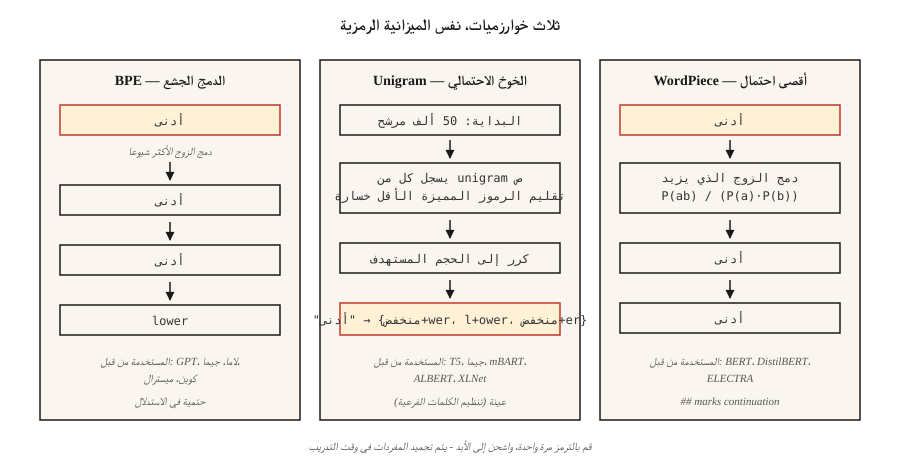

# ترميز الكلمات الفرعية — BPE، WordPiece، Unigram، SentencePiece
> رموز الكلمات تختنق بالكلمات غير المرئية. تعمل الرموز المميزة للشخصية على تفجير طول التسلسل. تعمل رموز الكلمات الفرعية على تقسيم الفرق. يتم شحن كل LLM الحديثة على واحدة.
**النوع:** تعلم
** اللغات: ** بايثون
** المتطلبات الأساسية: ** المرحلة 5 · 01 (معالجة النصوص)، المرحلة 5 · 04 (GloVe / FastText / Subword)
**الوقت:** ~60 دقيقة
## المشكلة
تحتوي مفرداتك على 50000 كلمة. يقوم المستخدم بكتابة "غير قابل للرمز". يعرض رمزك المميز `[UNK]`. النموذج الآن ليس لديه إشارة حول الكلمة. والأسوأ من ذلك: أن المستند المئوي التسعين في مجموعتك يحتوي على 40 كلمة نادرة، مما يعني 40 بت من المعلومات المسقطة لكل مستند.
ترميز الكلمات الفرعية يحل هذا. الكلمات الشائعة تبقى رموزًا منفردة. الكلمات النادرة تتحلل إلى أجزاء ذات معنى: `untokenizable` → `un`، `token`، `izable`. تغطي بيانات التدريب كل شيء لأن أي سلسلة هي في النهاية سلسلة من البايتات.
يتم شحن كل حدود LLM في عام 2026 على واحدة من ثلاث خوارزميات (BPE، Unigram، WordPiece)، ملفوفة في واحدة من ثلاث مكتبات (tiktoken، SentencePiece، HF Tokenizers). لا يمكنك شحن نموذج لغة دون اختيار واحد.
##المفهوم

**BPE (تشفير زوج البايت).** ابدأ بمفردات على مستوى الأحرف. عد كل زوج مجاور. قم بدمج الزوج الأكثر تكرارًا في رمز مميز جديد. كرر ذلك حتى تصل إلى حجم المفردات المستهدف. الخوارزمية المهيمنة: GPT-2/3/4، Llama، Gemma، Qwen2، Mistral.
**مستوى البايت BPE.** نفس الخوارزمية ولكن عبر البايتات الأولية (256 رمزًا أساسيًا) بدلاً من أحرف Unicode. يضمن عدم وجود رموز `[UNK]` المميزة - يتم تشفير أي تسلسل بايت. GPT-2 يستخدم 50,257 رمزًا مميزًا (256 بايت + 50,000 عملية دمج + 1 خاص).
**Unigram.** ابدأ بمفردات ضخمة. قم بتعيين كل رمز مميز لاحتمال unigram. قم بتقليم الرموز المميزة التي تؤدي إزالتها إلى الحد الأدنى من زيادة احتمالية تسجيل المجموعة. احتمالية في الاستدلال: يمكن أخذ عينات من الرموز المميزة (مفيدة لزيادة البيانات عبر تنظيم الكلمات الفرعية). يستخدم بواسطة T5، mBART، ALBERT، XLNet، Gemma.
**WordPiece.** دمج الأزواج التي تزيد من احتمالية مجموعة التدريب بدلاً من التكرار الأولي. مستخدم بواسطة BERT، DistilBERT، ELECTRA.
**SentencePiece vs tiktoken.** SentencePiece هي المكتبة التي *تدرب* المفردات (BPE أو Unigram) مباشرة على نص Unicode الخام، مع تشفير المسافة البيضاء كـ `▁`. tiktoken هو *أداة التشفير* السريعة لـ OpenAI ضد المفردات المعدة مسبقًا؛ لا يتدرب.
القاعدة الأساسية:
- **التدريب على مفردات جديدة:** SentencePiece (متعددة اللغات، لا يوجد ترميز مسبق) أو HF الرموز المميزة.
- **استدلال سريع مقابل GPT vocab:** tiktoken (cl100k_base, o200k_base).
- **كلاهما:** HF الرموز المميزة — مكتبة واحدة، تدريب + خدمة.
## بنائها
### الخطوة 1: BPE من الصفر
انظر `code/main.py`. الحلقة:
```python
def train_bpe(corpus, num_merges):
    vocab = {tuple(word) + ("</w>",): count for word, count in corpus.items()}
    merges = []
    for _ in range(num_merges):
        pairs = Counter()
        for symbols, freq in vocab.items():
            for a, b in zip(symbols, symbols[1:]):
                pairs[(a, b)] += freq
        if not pairs:
            break
        best = pairs.most_common(1)[0][0]
        merges.append(best)
        vocab = apply_merge(vocab, best)
    return merges
```

ثلاث حقائق تشفرها الخوارزمية. `</w>` يضع علامة على نهاية الكلمة بحيث يظل "منخفض" (لاحقة) و"أقل" (بادئة) مختلفين. ترجيح التردد make أزواج عالية التردد تفوز مبكرًا. قائمة الدمج مرتبة - يطبق الاستدلال عمليات الدمج بترتيب التدريب.
### الخطوة الثانية: التشفير باستخدام عمليات الدمج التي تم تعلمها
```python
def encode_bpe(word, merges):
    symbols = list(word) + ["</w>"]
    for a, b in merges:
        i = 0
        while i < len(symbols) - 1:
            if symbols[i] == a and symbols[i + 1] == b:
                symbols = symbols[:i] + [a + b] + symbols[i + 2:]
            else:
                i += 1
    return symbols
```

ساذج يا(ن·|دمج|). تستخدم تطبيقات الإنتاج (tiktoken، HF Tokenizers) البحث عن رتبة الدمج مع قوائم الانتظار ذات الأولوية ويتم تشغيلها في وقت شبه خطي.
### الخطوة 3: الجملة في الممارسة العملية
```python
import sentencepiece as spm

spm.SentencePieceTrainer.train(
    input="corpus.txt",
    model_prefix="my_tokenizer",
    vocab_size=8000,
    model_type="bpe",          # or "unigram"
    character_coverage=0.9995, # lower for CJK (e.g. 0.9995 for English, 0.995 for Japanese)
    normalization_rule_name="nmt_nfkc",
)

sp = spm.SentencePieceProcessor(model_file="my_tokenizer.model")
print(sp.encode("untokenizable", out_type=str))
# ['▁un', 'token', 'izable']
```

ملاحظة: لا يلزم إنشاء رموز مميزة مسبقًا، فالمسافة المشفرة كـ `▁`، `character_coverage` تتحكم في مدى قوة الحفاظ على الأحرف النادرة مقابل تعيينها إلى `<unk>`.
### الخطوة 4: tiktoken للمفردات المتوافقة مع OpenAI
```python
import tiktoken
enc = tiktoken.get_encoding("o200k_base")
print(enc.encode("untokenizable"))        # [127340, 101028]
print(len(enc.encode("Hello, world!")))   # 4
```

الترميز فقط. سريع (Rust الخلفية). تطابق تام مع GPT-4/5 الرمز المميز لحساب البايت وتقدير التكلفة ووضع ميزانية نافذة السياق.
## المزالق التي لا تزال تشحن في عام 2026
- **انجراف الرمز المميز.** التدريب على المفردة أ، والنشر مقابل المفردة ب. تختلف معرفات الرمز المميز؛ نموذج يخرج القمامة. تحقق من تجزئة `tokenizer.json` في CI.
- **غموض المسافات البيضاء.** BPE ينتج عن "hello" مقابل "hello" رموز مميزة مختلفة. حدد دائمًا `add_special_tokens` و`add_prefix_space` بشكل صريح.
- **التدريب الناقص متعدد اللغات.** تُنتج مجموعات اللغة الإنجليزية المكثفة مفردات تقسم النصوص غير اللاتينية إلى رموز أكثر بمقدار 5 إلى 10 مرات. تكلفة المطالبة نفسها تزيد بمقدار 5 إلى 10 أضعاف باللغة اليابانية/العربية في GPT-3.5. o200k_base أصلحت هذا جزئيًا.
- **رموز تعبيرية مقسمة.** رمز تعبيري واحد يمكن أن يأخذ 5 رموز. التعامل مع الرموز التعبيرية عند نقطة التفتيش عند وضع الميزانية.
## استخدمه
مكدس 2026:
| الوضع | اختر |
|-----------|------|
| تدريب نموذج أحادي اللغة من الصفر | HF الرموز المميزة (BPE) |
| تدريب نموذج متعدد اللغات | قطعة الجملة (يونيجرام، `character_coverage=0.9995`) |
| عرض OpenAI متوافق مع API | تيكتوكين (`o200k_base` لـ GPT-4+) |
| مفردات خاصة بالمجال (الكود، الرياضيات، البروتين) | تدريب BPE المخصص على مجموعة النطاق، ودمجه مع المفردات الأساسية |
| استنتاج الحافة، نموذج صغير | Unigram (المفردات الصغيرة تعمل بشكل أفضل) |
حجم المفردات هو قرار التوسع، وليس ثابتا. إرشادي تقريبي: 32k لـ <1B params، 50-100k لـ 1-10B، 200k+ لمتعدد اللغات/الحدود.
## اشحنها
حفظ باسم `outputs/skill-bpe-vs-wordpiece.md`:
```markdown
---
name: tokenizer-picker
description: Pick tokenizer algorithm, vocab size, library for a given corpus and deployment target.
version: 1.0.0
phase: 5
lesson: 19
tags: [nlp, tokenization]
---

Given a corpus (size, languages, domain) and deployment target (training from scratch / fine-tuning / API-compatible inference), output:

1. Algorithm. BPE, Unigram, or WordPiece. One-sentence reason.
2. Library. SentencePiece, HF Tokenizers, or tiktoken. Reason.
3. Vocab size. Rounded to nearest 1k. Reason tied to model size and language coverage.
4. Coverage settings. `character_coverage`, `byte_fallback`, special-token list.
5. Validation plan. Average tokens-per-word on held-out set, OOV rate, compression ratio, round-trip decode equality.

Refuse to train a character-coverage <0.995 tokenizer on corpora with rare-script content. Refuse to ship a vocab without a frozen `tokenizer.json` hash check in CI. Flag any monolingual tokenizer under 16k vocab as likely under-spec.
```

## تمارين
1. **سهل.** قم بتدريب BPE المكون من 500 دمج على مجموعة `code/main.py` الصغيرة. قم بتشفير ثلاث كلمات معلقة. كم عدد الرموز المنتجة بالضبط مقابل > رمز واحد؟
2. **متوسط.** قارن عدد الرموز المميزة في 100 جملة ويكيبيديا الإنجليزية بين `cl100k_base` و`o200k_base` وقطعة الجملة BPE التي تدربها باستخدام vocab=32k. قم بالإبلاغ عن نسبة الضغط لكل منها.
3. **صعب.** تدرب على نفس المجموعة باستخدام BPE وUnigram وWordPiece. قم بقياس الدقة النهائية عند استخدام كل منها على مصنف مشاعر صغير. هل يحرك الاختيار الإبرة بأكثر من نقطة واحدة F1؟
## المصطلحات الرئيسية
| مصطلح | ماذا يقول الناس | ماذا يعني في الواقع |
|------|-|--------------------------------------|
| __المصطلح_2__ | ترميز زوج البايت | الدمج الجشع لأزواج الأحرف الأكثر تكرارًا حتى يصل حجم المفردات المستهدف. |
| مستوى البايت BPE | لا توجد رموز غير معروفة على الإطلاق | BPE على 256 بايت أولية؛ GPT-2 / اللاما تستخدم هذا. |
| يونيجرام | الرمز الاحتمالي | البرقوق من مجموعة مرشحة كبيرة باستخدام احتمالية السجل؛ تم استخدامه بواسطة T5، جيما. |
| جملة | المسافة البيضاء | المكتبة التي تدرب BPE/Unigram على النص الخام؛ المساحة المشفرة كـ `▁`. |
| تيك توكين | السريع | برنامج تشفير OpenAI's Rust المدعوم BPE للمفردات المعدة مسبقًا. لا يوجد تدريب. |
| دمج القائمة | الارقام السحرية | قائمة مرتبة من عمليات الدمج `(a, b) → ab`؛ ينطبق الاستدلال بالترتيب. |
| تغطية الشخصية | ما مدى نادر نادر جدا؟ | جزء من الشخصيات في مجموعة التدريب التي يجب أن يغطيها الرمز المميز؛ ~0.9995 نموذجي. |
## مزيد من القراءة
- [Sennrich, Haddow, Birch (2015). Neural Machine Translation of Rare Words with Subword Units](https://arxiv.org/abs/1508.07909) — الورقة BPE.
- [Kudo (2018). Subword Regularization with Unigram Language Model](https://arxiv.org/abs/1804.10959) — ورقة يونيجرام.
- [Kudo, Richardson (2018). SentencePiece: A simple and language independent subword tokenizer](https://arxiv.org/abs/1808.06226) — المكتبة.
- [Hugging Face — Summary of the tokenizers](https://huggingface.co/docs/transformers/tokenizer_summary) — مرجع موجز.
- [OpenAI tiktoken repo](https://github.com/openai/tiktoken) — كتاب الطبخ + قائمة الترميز.