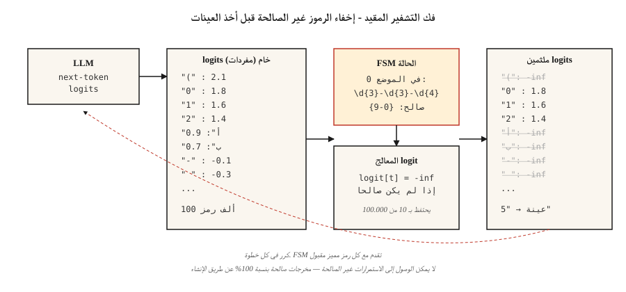

# المخرجات المنظمة وفك التشفير المقيد
> اطرح LLM لـ JSON. احصل على JSON في معظم الأوقات. في الإنتاج، "الأكثر" هو المشكلة. يقوم فك التشفير المقيد بتحويل "معظم" إلى "دائمًا" عن طريق تحرير logits قبل أخذ العينات.
**النوع:** بناء
** اللغات: ** بايثون
**المتطلبات الأساسية:** المرحلة 5 · 17 (روبوتات الدردشة)، المرحلة 5 · 19 (ترميز الكلمات الفرعية)
**الوقت:** ~60 دقيقة
## المشكلة
يطالب المصنف LLM: "إرجاع واحد من {إيجابي، سلبي، محايد}." يُرجع النموذج "الميول إيجابية - هذه المراجعة مواتية إلى حد كبير لأن العميل ينص صراحةً على أنه ...". تعطل المحلل اللغوي الخاص بك. F1 الخاص بمصنفك هو 0.0.
الجيل الحر ليس عقدًا. إنه اقتراح. يحتاج نظام الإنتاج إلى عقد.
توجد ثلاث طبقات في عام 2026.
1. **الحث.** اسأل بلطف. "إرجاع الكائن JSON فقط." يعمل بنسبة 80% تقريبًا على الطرز الرائدة، وأقل على الطرز الأصغر حجمًا.
2. **واجهات برمجة التطبيقات الأصلية المنظمة للمخرجات.** OpenAI `response_format`، استخدام الأدوات البشرية، وضع Gemini JSON. موثوقة على المخططات المدعومة. مقفل البائع.
3. **فك تشفير مقيد.** قم بتعديل logits في كل خطوة إنشاء بحيث *لا* يمكن* أن يصدر النموذج رموزًا غير صالحة. 100% صالحة للبناء. يعمل على أي نموذج محلي.
يبني هذا الدرس الحدس لجميع العناصر الثلاثة ويحدد متى يجب الوصول إليها.
##المفهوم

**كيف يعمل فك التشفير المقيد.** في كل خطوة توليد، يُنتج LLM متجه logit عبر المفردات الكاملة (~100 ألف رمز). يوجد معالج *logit* بين النموذج وجهاز أخذ العينات. فهو يحسب الرموز المميزة الصالحة بالنظر إلى الموضع الحالي في القواعد النحوية المستهدفة - JSON المخطط، والتعبير العادي، والقواعد النحوية الخالية من السياق - ويعين logits لجميع الرموز المميزة غير الصالحة على اللانهاية السالبة. إن softmax على logits المتبقية تضع كتلة الاحتمال على الاستمرارية الصحيحة فقط.
التنفيذ في عام 2026:
- **المخططات التفصيلية.** يجمع المخطط JSON أو التعبير العادي في آلة الحالة المحدودة. يحصل كل رمز مميز على بحث O(1) صالح للرمز التالي. تعتمد على FSM، لذا تحتاج المخططات العودية إلى التسوية.
- **XGrammar / llguidance.** محركات نحوية خالية من السياق. التعامل مع مخطط JSON العودي. ما يقرب من الصفر النفقات العامة فك التشفير. OpenAI نسبوا الفضل إلى الإرشادات في تنفيذ المخرجات المنظمة لعام 2025.
- **فك التشفير الموجه بـ vLLM.** المدمج في `guided_json`، `guided_regex`، `guided_choice`، `guided_grammar` عبر الخطوط العريضة، أو XGrammar، أو الواجهات الخلفية لتنسيق lm.
- **المدرس.** غلاف مستند إلى Pydantic على أي LLM. إعادة المحاولة عند فشل التحقق من الصحة. موفر مشترك، لكنه لا يعدل logits - فهو يعتمد على عمليات إعادة المحاولة + المطالبات المدركة للإخراج المنظم.
### النتيجة غير المتوقعة
غالبًا ما يكون فك التشفير المقيد *أسرع* من الجيل غير المقيد. سببين. أولاً، يعمل على تقليص مساحة البحث عن الرمز المميز التالي. ثانيًا، تتخطى التطبيقات الذكية إنشاء الرموز المميزة تمامًا للرموز المميزة القسرية (السقالات مثل `{"name": "` - يتم تحديد كل بايت).
### المأزق الذي يكلفك
النظام الميداني مهم. ضع `answer` قبل `reasoning`، وسيلتزم النموذج بالإجابة قبل أن يفكر. JSON صالح. الإجابة خاطئة. لا يوجد التحقق من الصحة يمسك به.
```json
// BAD
{"answer": "yes", "reasoning": "because ..."}

// GOOD
{"reasoning": "... therefore ...", "answer": "yes"}
```

ترتيب حقل المخطط منطقي، وليس تنسيقًا.
## بنائها
### الخطوة 1: إنشاء مقيد بالتعبير العادي من البداية
راجع `code/main.py` للتعرف على التنفيذ المستقل FSM. الفكرة الأساسية في 30 سطرًا:
```python
def mask_logits(logits, valid_token_ids):
    mask = [float("-inf")] * len(logits)
    for tid in valid_token_ids:
        mask[tid] = logits[tid]
    return mask


def generate_constrained(model, tokenizer, prompt, fsm):
    ids = tokenizer.encode(prompt)
    state = fsm.initial_state
    while not fsm.is_accept(state):
        logits = model.next_token_logits(ids)
        valid = fsm.valid_tokens(state, tokenizer)
        logits = mask_logits(logits, valid)
        tok = sample(logits)
        ids.append(tok)
        state = fsm.transition(state, tok)
    return tokenizer.decode(ids)
```

يتتبع FSM أجزاء القواعد النحوية التي استوفيناها حتى الآن. يحسب `valid_tokens(state, tokenizer)` الرموز المميزة للمفردات التي يمكنها تقديم FSM دون ترك مسار قبول.
### الخطوة 2: الخطوط العريضة لمخطط JSON
```python
from pydantic import BaseModel
from typing import Literal
import outlines


class Review(BaseModel):
    sentiment: Literal["positive", "negative", "neutral"]
    confidence: float
    evidence_span: str


model = outlines.models.transformers("meta-llama/Llama-3.2-3B-Instruct")
generator = outlines.generate.json(model, Review)

result = generator("Classify: 'The wait staff was attentive and the food arrived hot.'")
print(result)
# Review(sentiment='positive', confidence=0.93, evidence_span='attentive ... hot')
```

أخطاء التحقق من الصحة صفر. أبدًا. لا يمكن الوصول إلى مخرجات FSM makes غير الصالحة.
### الخطوة 3: مدرب Pydantic غير الملتزم بمزود الخدمة
```python
import instructor
from anthropic import Anthropic
from pydantic import BaseModel, Field


class Invoice(BaseModel):
    vendor: str
    total_usd: float = Field(ge=0)
    line_items: list[str]


client = instructor.from_anthropic(Anthropic())
invoice = client.messages.create(
    model="claude-opus-4-7",
    max_tokens=1024,
    response_model=Invoice,
    messages=[{"role": "user", "content": "Extract from: 'Acme Corp $420. Widget, Gizmo.'"}],
)
```

آلية مختلفة. لا يتطرق المدرس إلى logits. يقوم بتنسيق المخطط في الموجه، ويوزع الإخراج، ويعيد المحاولة عند فشل التحقق من الصحة (الافتراضي 3 مرات). يعمل مع أي مزود. تضيف عمليات إعادة المحاولة زمن الوصول والتكلفة. تعد إمكانية النقل عبر الموفرين هي نقطة البيع.
### الخطوة 4: واجهات برمجة التطبيقات للمورد الأصلي
```python
from openai import OpenAI

client = OpenAI()
response = client.responses.create(
    model="gpt-5",
    input=[{"role": "user", "content": "Classify: 'The food was cold.'"}],
    text={"format": {"type": "json_schema", "name": "sentiment",
          "schema": {"type": "object", "required": ["sentiment"],
                     "properties": {"sentiment": {"type": "string",
                                                  "enum": ["positive", "negative", "neutral"]}}}}},
)
print(response.output_parsed)
```

فك التشفير المقيد من جانب الخادم. تكافؤ الموثوقية مع الخطوط العريضة للمخططات المدعومة. لا توجد إدارة النموذج المحلي. يقفل لك للبائع.
## مطبات
- **المخططات العودية.** تحدد الخطوط العريضة لتسوية العودية إلى عمق ثابت. تحتاج المخرجات ذات البنية الشجرية (التعليقات المتداخلة، AST) إلى قواعد X نحوية أو إرشادات (تعتمد على CFG).
- **تعدادات ضخمة.** يتم تجميع التعداد ذو الـ 10000 خيار ببطء أو تنتهي مهلته. قم بالتبديل إلى المسترد: توقع المرشحين من الدرجة الأولى أولاً، واقتصر على هؤلاء.
- **القواعد النحوية صارمة جدًا.** فرض `date: "YYYY-MM-DD"` regex ولا يمكن للنموذج إخراج `"unknown"` للتواريخ المفقودة. نموذج يعوض عن طريق اختراع التاريخ. السماح بـ `null` أو الحارس.
- **الالتزام المبكر.** راجع مأزق الطلب الميداني أعلاه. دائما ضع المنطق أولا.
- **وضع البائع JSON بدون مخطط.** يضمن وضع JSON النقي فقط صلاحية JSON، وغير صالحة *لحالة الاستخدام الخاصة بك*. قم دائمًا بتوفير مخطط كامل.
## استخدمه
مكدس 2026:
| الوضع | اختر |
|-----------|------|
| OpenAI/نموذج أنثروبي/Google، مخطط بسيط | المخرج المنظم للبائع الأصلي |
| يمكن لأي مزود سير عمل Pydantic أن يتحمل إعادة المحاولة | مدرس |
| نموذج محلي، يحتاج إلى صلاحية 100%، مخطط مسطح | الخطوط العريضة (FSM) |
| نموذج محلي، مخطط عودي | XGrammar أو llguidance |
| خادم الاستدلال المستضاف ذاتيًا | فك التشفير الموجه vLLM |
| معالجة الدفعات مع إعادة المحاولة مقبولة | مدرب + أرخص موديل |
## اشحنها
حفظ باسم `outputs/skill-structured-output-picker.md`:
```markdown
---
name: structured-output-picker
description: Choose a structured output approach, schema design, and validation plan.
version: 1.0.0
phase: 5
lesson: 20
tags: [nlp, llm, structured-output]
---

Given a use case (provider, latency budget, schema complexity, failure tolerance), output:

1. Mechanism. Native vendor structured output, Instructor retries, Outlines FSM, or XGrammar CFG. One-sentence reason.
2. Schema design. Field order (reasoning first, answer last), nullable fields for "unknown", enum vs regex, required fields.
3. Failure strategy. Max retries, fallback model, graceful `null` handling, out-of-distribution refusal.
4. Validation plan. Schema compliance rate (target 100%), semantic validity (LLM-judge), field-coverage rate, latency p50/p99.

Refuse any design that puts `answer` or `decision` before reasoning fields. Refuse to use bare JSON mode without a schema. Flag recursive schemas behind an FSM-only library.
```

## تمارين
1. **سهل.** اطلب نموذجًا صغيرًا بأوزان مفتوحة (على سبيل المثال، Llama-3.2-3B) بدون فك تشفير مقيد لـ `Review(sentiment, confidence, evidence_span)`. قم بقياس الكسر الذي تم تحليله على أنه صالح JSON على 100 مراجعة.
2. **متوسط.** نفس المجموعة مع وضع الخطوط العريضة JSON. قارن معدل الامتثال وزمن الوصول والدقة الدلالية.
3. **صعب.** تنفيذ وحدة فك ترميز مقيدة بالتعبير العادي من البداية لأرقام الهواتف (`\d{3}-\d{3}-\d{4}`). التحقق من عدم وجود مخرجات غير صالحة على 1000 عينة.
## المصطلحات الرئيسية
| مصطلح | ماذا يقول الناس | ماذا يعني في الواقع |
|------|-|--------------------------------------|
| فك التشفير المقيد | فرض إخراج صالح | قم بإخفاء logits للرمز المميز غير الصالح في كل خطوة إنشاء. |
| معالج Logit | الشيء الذي يقيد | الوظيفة: `(logits, state) -> masked_logits`. |
| __المصطلح_3__ | آلة الحالة المحدودة | التمثيل النحوي المجمّع؛ O(1) بحث صالح للرمز المميز التالي. |
| CFG | قواعد خالية من السياق | القواعد التي تتعامل مع العودية؛ أبطأ ولكن أكثر تعبيرًا من FSM. |
| ترتيب حقل المخطط | هل يهم؟ | نعم - الالتزامات الميدانية الأولى؛ دائما وضع المنطق قبل الإجابة. |
| فك التشفير الموجه | اسم vLLM لذلك | نفس المفهوم، مدمج في خادم الاستدلال. |
| JSON الوضع | النسخة المبكرة من OpenAI | يضمن بناء الجملة JSON؛ هل يضمن NOT تطابق المخطط. |
## مزيد من القراءة
- [Willard, Louf (2023). Efficient Guided Generation for LLMs](https://arxiv.org/abs/2307.09702) — ورقة الخطوط العريضة.
- [XGrammar paper (2024)](https://arxiv.org/abs/2411.15100) — فك تشفير سريع ومقيد يعتمد على CFG.
- [vLLM — Structured Outputs](https://docs.vllm.ai/en/latest/features/structured_outputs.html) — تكامل خادم الاستدلال.
- [OpenAI — Structured Outputs guide](https://platform.openai.com/docs/guides/structured-outputs) — API مرجع + مسكتك.
- [Instructor library](https://python.useinstructor.com/) — Pydantic + إعادة المحاولة عبر مقدمي الخدمة.
- [JSONSchemaBench (2025)](https://arxiv.org/abs/2501.10868) — قياس 6 أطر فك التشفير المقيدة.