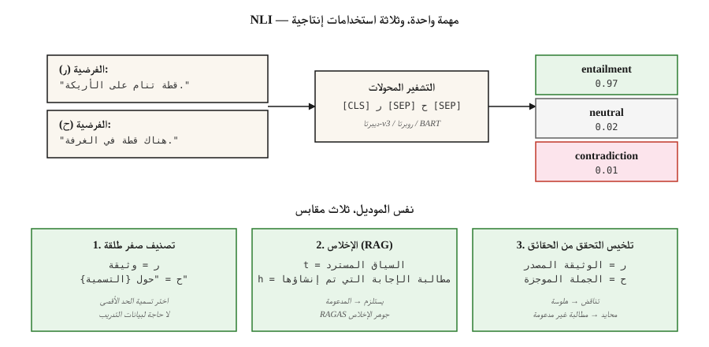

# الاستدلال باللغة الطبيعية – الاستلزام النصي
> "t يستلزم h" يعني أن القراءة البشرية t ستستنتج أن h صحيح. NLI هي مهمة التنبؤ بالاستلزام / التناقض / الحياد. مملة على السطح، الحاملة في الإنتاج.
**النوع:** تعلم
** اللغات: ** بايثون
**المتطلبات الأساسية:** المرحلة 5 · 05 (تحليل المشاعر)، المرحلة 5 · 13 (الإجابة على الأسئلة)
**الوقت:** ~60 دقيقة
## المشكلة
لقد قمت ببناء ملخص. أنتجت ملخصا. كيف تعرف أن الملخص لا يحتوي على هلوسة؟
لقد قمت ببناء روبوت الدردشة. أجاب "نعم". كيف تعرف أن الإجابة مدعومة بالمقطع المسترجع؟
تحتاج إلى تصنيف 10000 مقالة إخبارية حسب الموضوع. ليس لديك أي تسميات التدريب. هل يمكنك إعادة استخدام النموذج؟
يتم تقليل جميع المشاكل الثلاثة إلى استنتاج اللغة الطبيعية. NLI يسأل: بالنظر إلى المقدمة `t` والفرضية `h`، هل `h` يستلزم `t`، متناقضًا، أو محايدًا (غير ذي صلة)؟
- **فحص الهلوسة:** `t` = مستند المصدر، `h` = مطالبة ملخصة. لا يستلزم = الهلوسة.
- ** مؤرض QA:** `t` = المقطع المسترجع، `h` = الإجابة التي تم إنشاؤها. لا استلزام = تلفيق.
- **تصنيف اللقطة الصفرية:** `t` = مستند، `h` = تسمية لفظية ("هذا يتعلق بالرياضة"). الاستحقاق = التسمية المتوقعة.
مهمة واحدة، ثلاثة استخدامات إنتاجية. وهذا هو السبب في أن كل إطار عمل تقييم RAG يشحن نموذج NLI تحت الغطاء.
##المفهوم

**المسميات الثلاثة.**
- **التبعية.** `t` → `h`. "القط على السجادة" يستلزم "هناك قطة".
- **تناقض.** `t` → ¬`h`. "القط على السجادة" يتناقض مع "ليس هناك قطة".
- **محايد.** لا يوجد استنتاج في كلتا الحالتين. "القطة على السجادة" محايدة لـ "القطة جائعة".
**ليس استدلالًا منطقيًا.** NLI هو *استدلال لغوي *طبيعي* - وهو ما قد يستنتجه القارئ البشري العادي، وليس منطقًا صارمًا. "جون كان يمشي مع كلبه" يستلزم "جون لديه كلب" في NLI، ولكن المنطق الصارم من الدرجة الأولى لن يعترف بذلك إلا إذا قمت بإضفاء طابع بديهي على الحيازة.
**مجموعات البيانات.**
- **SNLI** (2015). 570 ألف زوج من التعليقات التوضيحية البشرية، والتعليقات التوضيحية للصور كمقرات عمل. المجال الضيق.
- **مالتي إنلي** (2017). 433 ألف زوجًا عبر 10 أنواع. مجموعة التدريب القياسية في عام 2026
- **ANLI** (2019). الخصومة NLI. كتب البشر أمثلة مصممة خصيصًا لكسر النماذج الموجودة. أصعب.
- **DocNLI, ConTRoL** (2020–21). أماكن بطول الوثيقة. اختبارات القفزات المتعددة والاستدلال بعيد المدى.
**الهندسة المعمارية.** يقرأ برنامج تشفير المحولات (BERT، RoBERTa، DeBERTa) `[CLS] premise [SEP] hypothesis [SEP]`. يغذي تمثيل `[CLS]` softmax ثلاثي الاتجاهات. تدرب على MNLI، وقم بالتقييم وفقًا للمعايير المرجعية، واحصل على دقة تزيد عن 90% في الأزواج داخل التوزيع.
**لقطة صفرية عبر NLI.** بالنظر إلى مستند وتسميات المرشحين، قم بتحويل كل تسمية إلى فرضية ("هذا النص يدور حول الرياضة"). حساب احتمالية الاستلزام لكل منها. اختر الحد الأقصى. هذه هي الآلية وراء Hugging Face's `zero-shot-classification` pipeline.
## بنائها
### الخطوة 1: تشغيل نموذج NLI مُدرب مسبقًا
```python
from transformers import pipeline

nli = pipeline("text-classification",
               model="facebook/bart-large-mnli",
               top_k=None)  # return all labels; replaces deprecated return_all_scores=True

premise = "The cat is sleeping on the couch."
hypothesis = "There is a cat in the room."

result = nli({"text": premise, "text_pair": hypothesis})[0]
print(result)
# [{'label': 'entailment', 'score': 0.97},
#  {'label': 'neutral', 'score': 0.02},
#  {'label': 'contradiction', 'score': 0.01}]
```

بالنسبة للإنتاج NLI، `facebook/bart-large-mnli` و`microsoft/deberta-v3-large-mnli` هي الإعدادات الافتراضية المفتوحة. يتصدر DeBERTa-v3 قوائم المتصدرين.
### الخطوة الثانية: تصنيف الطلقة الصفرية
```python
zs = pipeline("zero-shot-classification", model="facebook/bart-large-mnli")

text = "The stock market rallied after the central bank cut interest rates."
labels = ["finance", "sports", "politics", "technology"]

result = zs(text, candidate_labels=labels)
print(result)
# {'labels': ['finance', 'politics', 'technology', 'sports'],
#  'scores': [0.92, 0.05, 0.02, 0.01]}
```

القالب هو "هذا المثال يدور حول {label}." بشكل افتراضي. التخصيص باستخدام `hypothesis_template`. لا توجد بيانات التدريب المطلوبة. لا صقل. يعمل خارج منطقة الجزاء.
### الخطوة 3: التحقق من صحة RAG
```python
def is_faithful(answer, context, threshold=0.5):
    result = nli({"text": context, "text_pair": answer})[0]
    entail = next(s for s in result if s["label"] == "entailment")
    return entail["score"] > threshold
```

هذا هو جوهر الإخلاص RAGAS. قم بتقسيم الإجابة الناتجة إلى مطالبات ذرية. تحقق من كل مطالبة مقابل السياق المسترد. قم بالإبلاغ عن الكسر الذي يستلزم ذلك.
### الخطوة 4: مصنف NLI ملفوف يدويًا (مفاهيمي)
راجع `code/main.py` للحصول على لعبة stdlib فقط: تتم مقارنة الفرضية والفرضية من خلال التداخل المعجمي + اكتشاف النفي. ليست تنافسية مع نماذج المحولات - ولكنها تظهر شكل المهمة: نصان في، تسمية ثلاثية الاتجاه، الخسارة = إنتروبيا متقاطعة على `{entail, contradict, neutral}`.
## مطبات
- **اختصارات الفرضية فقط.** يمكن للنماذج التنبؤ بالتسمية من الفرضية وحدها بنسبة ~60% في SNLI لأن "لا"، "لا أحد"، "أبدًا" ترتبط بالتناقض. خط أساس قوي للكشف عن تسرب الملصقات.
- **استرشادي للتداخل المعجمي.** ارشادي للتسلسل اللاحق ("كل لاحقة مستلزمة") يمرر SNLI لكنه يفشل HANS/ANLI. استخدام معايير الخصومة.
- **تدهور طول المستند.** تسقط نماذج NLI ذات الجملة الواحدة 20+ F1 في المباني ذات طول المستند. استخدم النماذج المدربة بواسطة DocNLI للسياق الطويل.
- **حساسية قالب اللقطة الصفرية.** "هذا المثال يدور حول {label}" مقابل "{label}" مقابل "الموضوع هو {label}" يمكن أن يتأرجح الدقة بما يزيد عن 10 نقاط. ضبط القالب.
- **النطاق غير متطابق.** MNLI يتدرب على اللغة الإنجليزية العامة. يحتاج النص القانوني والطبي والعلمي إلى نماذج NLI خاصة بالمجال (على سبيل المثال، SciNLI، MedNLI).
## استخدمه
مكدس 2026:
| حالة الاستخدام | نموذج |
|---------|------|
| للأغراض العامة NLI | `microsoft/deberta-v3-large-mnli` |
| سريع / الحافة | __الكود_1__ |
| تصنيف الصفر شوت (خفيف) | __الكود_2__ |
| على مستوى الوثيقة NLI | __الكود_3__ |
| متعدد اللغات | __الكود_4__ |
| كشف الهلوسة في RAG | طبقة NLI داخل RAGAS / DeepEval |
النمط التعريفي لعام 2026: NLI هو الشريط اللاصق لفهم النص. عندما تحتاج إلى "هل يدعم A B؟" أو "هل يتعارض أ مع ب؟" - الوصول إلى NLI قبل الوصول إلى مكالمة LLM أخرى.
## اشحنها
حفظ باسم `outputs/skill-nli-picker.md`:
```markdown
---
name: nli-picker
description: Pick an NLI model, label template, and evaluation setup for a classification / faithfulness / zero-shot task.
version: 1.0.0
phase: 5
lesson: 21
tags: [nlp, nli, zero-shot]
---

Given a use case (faithfulness check, zero-shot classification, document-level inference), output:

1. Model. Named NLI checkpoint. Reason tied to domain, length, language.
2. Template (if zero-shot). Verbalization pattern. Example.
3. Threshold. Entailment cutoff for the decision rule. Reason based on calibration.
4. Evaluation. Accuracy on held-out labeled set, hypothesis-only baseline, adversarial subset.

Refuse to ship zero-shot classification without a 100-example labeled sanity check. Refuse to use a sentence-level NLI model on document-length premises. Flag any claim that NLI solves hallucination — it reduces it; it does not eliminate it.
```

## تمارين
1. **سهل.** قم بتشغيل `facebook/bart-large-mnli` على 20 ثلاثية مصنوعة يدويًا (مقدمة، فرضية، تسمية) تغطي جميع الفئات الثلاثة. دقة القياس. أضف مصائد "الاستدلال اللاحق" الخصومة ("لم آكل الكعكة" مقابل "أكلت الكعكة") ومعرفة ما إذا كانت ستنكسر.
2. **متوسط.** قارن نموذج اللقطة الصفرية `"This text is about {label}"` مع `"The topic is {label}"` و`"{label}"` في 100 AG من عناوين الأخبار. تقرير تأرجح الدقة.
3. **صعب.** أنشئ أداة فحص الإخلاص RAG: تحليل المطالبات الذرية + NLI لكل مطالبة. قم بتقييم 50 إجابة تم إنشاؤها بواسطة RAG ذات سياق ذهبي. قم بقياس المعدلات الإيجابية الكاذبة والسلبية الكاذبة مقابل الملصقات اليدوية.
## المصطلحات الرئيسية
| مصطلح | ماذا يقول الناس | ماذا يعني في الواقع |
|------|-|--------------------------------------|
| NLI | الاستدلال باللغة الطبيعية | 3-طريقة تصنيف العلاقة بين الفرضية والفرضية. |
| __المصطلح_1__ | التعرف على المتضمن النصي | الاسم الأقدم لـ NLI؛ نفس المهمة. |
| استلزم | "ر يعني ح" | قد يستنتج القارئ النموذجي أن h صحيح بالنظر إلى t. |
| تناقض | "t يستبعد h" | قد يستنتج القارئ النموذجي أن h خطأ نظرًا لـ t. |
| محايد | "متردد" | لا يوجد استنتاج من t إلى h في كلتا الحالتين. |
| تصنيف صفر طلقة | NLI كمصنف | قم بصياغة التسميات لفظيًا على أنها فرضيات، واختر الحد الأقصى من التبعات. |
| الإخلاص | هل الجواب مدعوم؟ | NLI انتهى (السياق المسترد، الإجابة التي تم إنشاؤها). |
## مزيد من القراءة
- [Bowman et al. (2015). A large annotated corpus for learning natural language inference](https://arxiv.org/abs/1508.05326) — SNLI.
- [Williams, Nangia, Bowman (2017). A Broad-Coverage Challenge Corpus for Sentence Understanding through Inference](https://arxiv.org/abs/1704.05426) — متعدد NLI.
- [Nie et al. (2019). Adversarial NLI](https://arxiv.org/abs/1910.14599) — معيار ANLI.
- [Yin, Hay, Roth (2019). Benchmarking Zero-shot Text Classification](https://arxiv.org/abs/1909.00161) — NLI-كمصنف.
- [He et al. (2021). DeBERTa: Decoding-enhanced BERT with Disentangled Attention](https://arxiv.org/abs/2006.03654) — العمود الفقري لعام 2026 NLI.