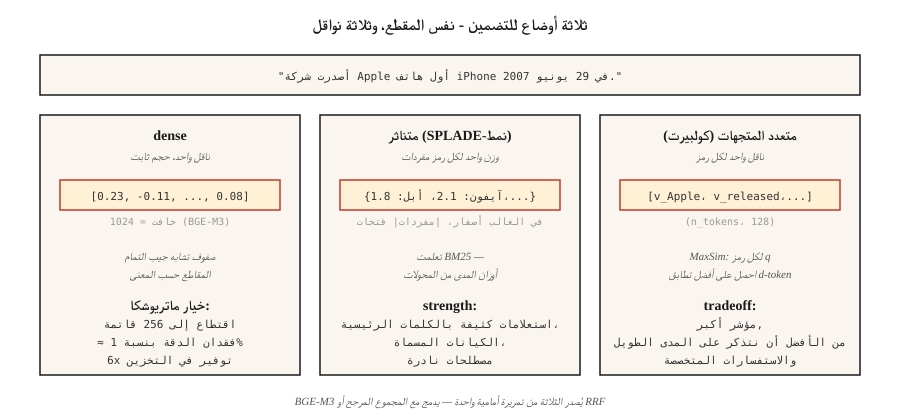

# نماذج التضمين - الغوص العميق لعام 2026
> أعطاك Word2Vec ناقلًا لكل كلمة. تمنحك نماذج التضمين الحديثة متجهًا لكل مقطع، متعدد اللغات، مع عروض متفرقة وكثيفة ومتعددة المتجهات، بحجم يناسب الفهرس الخاص بك. اختر خطأ وسيقوم RAG باسترداد الشيء الخطأ.
**النوع:** تعلم
** اللغات: ** بايثون
** المتطلبات الأساسية: ** المرحلة 5 · 03 (Word2Vec)، المرحلة 5 · 14 (استرجاع المعلومات)
**الوقت:** ~60 دقيقة
## المشكلة
يقوم نظام RAG الخاص بك باسترداد المقطع الخاطئ بنسبة 40% من الوقت. نادرًا ما يكون الجاني هو قاعدة بيانات المتجهات أو الموجه. إنه نموذج التضمين.
إن اختيار التضمين في عام 2026 يعني الاختيار عبر خمسة محاور:
1. ** كثيف مقابل متفرق مقابل ناقلات متعددة. ** متجه واحد لكل مقطع، أو واحد لكل رمز، أو حقيبة كلمات متناثرة.
2. **التغطية اللغوية.** لا تزال النماذج الإنجليزية أحادية اللغة تفوز في المهام التي تستخدم اللغة الإنجليزية فقط. تفوز النماذج متعددة اللغات عندما يتم خلط المجموعات.
3. **طول السياق.** 512 رمزًا مميزًا مقابل 8,192 رمزًا مقابل 32,768 — وغالبًا ما تتراوح السعة الفعالة الحقيقية بين 60 و70% من الحد الأقصى المُعلن عنه.
4. **ميزانية البعد.** 3,072 عائمًا بدقة كاملة = 12 KB لكل متجه. عند 100 مليون ناقل، يبلغ التخزين 1300 دولار شهريًا. قطع ماتريوشكا هذا 4×.
5. ** مفتوح مقابل مستضاف. ** الوزن المفتوح يعني أنك تتحكم في المكدس والبيانات. الاستضافة تعني أنك تتاجر بالتحكم بالأحدث دائمًا.
يسمي هذا الدرس المفاضلات حتى تتمكن من اختيار الأدلة، وليس ما كان شائعًا في الربع الأخير.
##المفهوم

**التضمينات الكثيفة.** متجه واحد لكل مقطع (عادةً 384-3,072 بُعدًا). يصنف تشابه جيب التمام المقاطع حسب القرب الدلالي. OpenAI `text-embedding-3-large`، BGE-M3 الوضع الكثيف، Voyage-3. الاختيار الافتراضي.
**تضمينات متفرقة.** SPLADE-style. يتنبأ المحول بوزن كل رمز مميز للمفردات، ثم يقوم بحذف معظمها من الأصفار. والنتيجة هي متجه متفرق للحجم |مفردات|. يلتقط المطابقة المعجمية (مثل BM25) ولكن مع أوزان المصطلحات المستفادة. قوية في الاستعلامات الثقيلة بالكلمات الرئيسية.
**متعدد المتجهات (التفاعل المتأخر).** ColBERTv2، Jina-ColBERT. ناقل واحد لكل رمز. تسجيل النقاط باستخدام MaxSim: لكل رمز استعلام، ابحث عن رمز المستند الأكثر تشابهًا، وقم بجمع الدرجات. يعد التخزين والتسجيل أكثر تكلفة، ولكنه يفوز في الاستعلامات الطويلة والمجموعات الخاصة بالمجال.
**BGE-M3: الثلاثة جميعًا في وقت واحد.** يقوم النموذج الفردي بإخراج تمثيلات كثيفة ومتفرقة ومتعددة المتجهات في وقت واحد. يمكن الاستعلام عن كل منها بشكل مستقل؛ تندمج الدرجات عبر المبلغ المرجح. الافتراضي 2026 عندما تريد المرونة من نقطة تفتيش واحدة.
**تعلم تمثيل الماتريوشكا.** تم التدريب بحيث تشكل أبعاد N الأولى للمتجه تضمينًا مستقلاً مفيدًا. قم باقتطاع ناقل ذو 1536 خافتًا إلى 256 خافتًا وادفع دقة تصل إلى 1% مقابل 6× توفير في التخزين. مدعوم بواسطة OpenAI text-3، وCohere v4، وVoyage-4، وJina v5، وGemini Embedding 2، وNomic v1.5+.
### لوحة المتصدرين MTEB تحكي قصة جزئية
معيار تضمين النص الضخم — 56 مهمة عبر 8 أنواع مهام عند الإطلاق (2022)، تم توسيعها إلى أكثر من 100 مهمة في MTEB الإصدار الثاني. في أوائل عام 2026، يتصدر Gemini Embedding 2 الاسترجاع (67.71 MTEB-R). Cohere embed-v4 يؤدي بشكل عام (65.2 MTEB). BGE-M3 يقود متعدد اللغات ذو الوزن المفتوح (63.0). لوحة المتصدرين ضرورية ولكنها ليست كافية — فهي دائمًا معيار مرجعي لمجالك.
### النمط الثلاثي الطبقات
| حالة الاستخدام | نمط |
|----------|--------|
| تمريرة أولى سريعة | جهاز تشفير ثنائي كثيف (BGE-M3، نص-3-صغير) |
| أذكر دفعة | متناثر (SPLADE، BGE-M3 متناثر) + RRF فتيل |
| الدقة في أعلى 50 | متعدد المتجهات (ColBERTv2) أو أداة إعادة ترتيب التشفير المتقاطع |
تستخدم معظم مجموعات الإنتاج الثلاثة.
## بنائها
### الخطوة 1: خط الأساس — التضمينات الكثيفة مع الجملة-BERT
```python
from sentence_transformers import SentenceTransformer
import numpy as np

encoder = SentenceTransformer("BAAI/bge-small-en-v1.5")
corpus = [
    "The first iPhone launched in 2007.",
    "Apple released the iPod in 2001.",
    "Android is an operating system from Google.",
]
emb = encoder.encode(corpus, normalize_embeddings=True)

query = "When was the iPhone released?"
q_emb = encoder.encode([query], normalize_embeddings=True)[0]
scores = emb @ q_emb
print(sorted(enumerate(scores), key=lambda x: -x[1]))
```

`normalize_embeddings=True` makes حاصل الضرب النقطي يساوي تشابه جيب التمام. اضبطه دائمًا.
### الخطوة 2: اقتطاع ماتريوشكا
```python
def truncate(vectors, dim):
    out = vectors[:, :dim]
    return out / np.linalg.norm(out, axis=1, keepdims=True)

emb_256 = truncate(emb, 256)
emb_128 = truncate(emb, 128)
```

إعادة التطبيع بعد الاقتطاع. تم تدريب Nomic v1.5 وOpenAI text-3 وVoyage-4 بحيث لا يفقد هذا المستوى في المستويات القليلة الأولى. النماذج غير الماتريوشكا (الجملة الأصلية-BERT) تتدهور بشكل حاد عند اقتطاعها.
### الخطوة 3: BGE-M3 متعددة الوظائف
```python
from FlagEmbedding import BGEM3FlagModel

model = BGEM3FlagModel("BAAI/bge-m3", use_fp16=True)

output = model.encode(
    corpus,
    return_dense=True,
    return_sparse=True,
    return_colbert_vecs=True,
)
# output["dense_vecs"]:    (n_docs, 1024)
# output["lexical_weights"]: list of dict {token_id: weight}
# output["colbert_vecs"]:  list of (n_tokens, 1024) arrays
```

ثلاثة فهارس، استدعاء استدلال واحد. درجة الانصهار:
```python
dense_score = ... # cosine over dense_vecs
sparse_score = model.compute_lexical_matching_score(q_lex, d_lex)
colbert_score = model.colbert_score(q_col, d_col)
final = 0.4 * dense_score + 0.2 * sparse_score + 0.4 * colbert_score
```

ضبط الأوزان على المجال الخاص بك.
### الخطوة 4: MTEB تقييم مهمة مخصصة
```python
from mteb import MTEB

tasks = ["ArguAna", "SciFact", "NFCorpus"]
evaluation = MTEB(tasks=tasks)
results = evaluation.run(encoder, output_folder="./mteb-results")
```

قم بتشغيل نماذجك المرشحة على مجموعة فرعية *ممثلة*. لا تثق في تصنيف المتصدرين وحده، فنطاقك مهم.
### الخطوة 5: جيب التمام ملفوف يدويًا من الصفر
انظر `code/main.py`. متوسط ​​عمليات تضمين خدعة التجزئة (stdlib فقط). لا يتنافس مع تضمينات المحولات، ولكنه يظهر الشكل: رمز مميز → ناقل → تطبيع → منتج نقطي.
## مطبات
- **نفس النموذج للاستعلام والمستندات.** تستخدم بعض النماذج (Voyage، Jina-ColBERT) ترميزًا غير متماثل — حيث يمر الاستعلام والمستندات عبر مسارات مختلفة. تحقق دائمًا من بطاقة الطراز.
- **بادئة مفقودة.** تحتاج نماذج `bge-*` إلى إضافة `"Represent this sentence for searching relevant passages: "` مسبقًا للاستعلامات. فجوة تذكر من 3 إلى 5 نقاط إذا نسيت.
- **الإفراط في تشذيب ماتريوشكا.** 1,536 ← 256 عادةً ما يكون آمنًا. 1,536 → 64 ليس كذلك. التحقق من صحة مجموعة التقييم الخاصة بك.
- **اقتطاع السياق.** تقوم معظم النماذج باقتطاع المدخلات بصمت على الحد الأقصى لطولها. تحتاج المستندات الطويلة إلى التقطيع (راجع الدرس 23).
- **تجاهل ذيل زمن الاستجابة.** تخفي نتائج MTEB زمن الاستجابة p99. قد يتفوق نموذج 600M على نموذج 335M بنقطتين ولكنه يكلف 3 مرات أكثر لكل استعلام.
## استخدمه
مكدس 2026:
| الوضع | اختر |
|-----------|------|
| الإنجليزية فقط، سريع، API | `text-embedding-3-large` أو `voyage-3-large` |
| الوزن المفتوح، إنجليزي | __الكود_2__ |
| مفتوح الوزن، متعدد اللغات | `BAAI/bge-m3` أو `Qwen3-Embedding-8B` |
| سياق طويل (32 كيلو بايت +) | Voyage-3-large، Cohere embed-v4، Qwen3-Embedding-8B |
| CPU-النشر فقط | Nomic Embed v2 (137 مليون معلمة، MoE) |
| التخزين مقيد | ماتريوشكا مقطوعة + تكميم int8 |
| استعلامات كثيفة الكلمات الرئيسية | أضف SPLADE متفرق، RRF-مصهر مع كثيف |
نمط 2026: ابدأ بـ BGE-M3 أو text-3-large، وقم بتقييم نطاقك باستخدام MTEB، وقم بالتبديل إذا فاز النموذج الخاص بالمجال بأكثر من 3 نقاط.
## اشحنها
حفظ باسم `outputs/skill-embedding-picker.md`:
```markdown
---
name: embedding-picker
description: Pick embedding model, dimension, and retrieval mode for a given corpus and deployment.
version: 1.0.0
phase: 5
lesson: 22
tags: [nlp, embeddings, retrieval]
---

Given a corpus (size, languages, domain, avg length), deployment target (cloud / edge / on-prem), latency budget, and storage budget, output:

1. Model. Named checkpoint or API. One-sentence reason.
2. Dimension. Full / Matryoshka-truncated / int8-quantized. Reason tied to storage budget.
3. Mode. Dense / sparse / multi-vector / hybrid. Reason.
4. Query prefix / template if required by the model card.
5. Evaluation plan. MTEB tasks relevant to domain + held-out domain eval with nDCG@10.

Refuse recommendations that truncate Matryoshka to <64 dims without domain validation. Refuse ColBERTv2 for corpora under 10k passages (overhead not justified). Flag long-document corpora (>8k tokens) routed to models with 512-token windows.
```

## تمارين
1. **سهل.** قم بتشفير 100 جملة باستخدام `bge-small-en-v1.5` في وضع التعتيم الكامل (384)، ثم في Matryoshka 128. قم بقياس MRR على 10 استعلامات.
2. **متوسط.** قارن BGE-M3 كثيف ومتفرق وكولبرت على 500 مقطع من نطاقك. من يفوز في Recall@10؟ هل يتفوق دمج RRF على أفضل وضع فردي؟
3. **صعب.** قم بتشغيل MTEB على ثلاثة نماذج مرشحة عبر أهم مهمتين في المجال. قم بالإبلاغ عن درجة MTEB ووقت الاستجابة p99 لمجموعة مكونة من 100 استعلام واستعلامات $/1M. اختر باريتو الأمثل.
## المصطلحات الرئيسية
| مصطلح | ماذا يقول الناس | ماذا يعني في الواقع |
|------|-|--------------------------------------|
| التضمين الكثيف | المتجه | ناقل واحد ذو حجم ثابت لكل نص. تشابه جيب التمام للترتيب. |
| التضمين المتناثر | تعلمت BM25 | وزن واحد لكل رمز مفردات؛ في الغالب أصفار؛ تدريب نهاية إلى نهاية. |
| متعدد المتجهات | كولبيرت ستايل | ناقل واحد لكل رمز مميز؛ تسجيل ماكس سيم؛ مؤشر أكبر، أذكر أفضل. |
| ماتريوشكا | خدعة الدمية الروسية | تعد عمليات التعتيم الأولى N بمثابة تضمين أصغر صالحًا من تلقاء نفسها. |
| __المصطلح_1__ | المعيار | معيار ضخم لتضمين النصوص — 56 مهمة عند الإطلاق، وأكثر من 100 مهمة في الإصدار الثاني. |
| __المصطلح_2__ | معيار الاسترجاع | 18 مهمة استرجاع بدون طلقة؛ غالبًا ما يتم الاستشهاد به من أجل المتانة عبر المجالات. |
| ترميز غير متماثل | الاستعلام ≠ مسار الوثيقة | يستخدم النموذج توقعات مختلفة للاستعلامات والمستندات. |
## مزيد من القراءة
- [Reimers, Gurevych (2019). Sentence-BERT](https://arxiv.org/abs/1908.10084) — ورقة التشفير الثنائي.
- [Muennighoff et al. (2022). MTEB: Massive Text Embedding Benchmark](https://arxiv.org/abs/2210.07316) — ورقة المتصدرين.
- [Chen et al. (2024). BGE-M3: Multi-lingual, Multi-functionality, Multi-granularity](https://arxiv.org/abs/2402.03216) — النموذج الموحد ثلاثي الأوضاع.
- [Kusupati et al. (2022). Matryoshka Representation Learning](https://arxiv.org/abs/2205.13147) — الهدف التدريبي لسلم الأبعاد.
- [Santhanam et al. (2022). ColBERTv2: Effective and Efficient Retrieval via Lightweight Late Interaction](https://arxiv.org/abs/2112.01488) — التفاعل المتأخر في الإنتاج.
- [MTEB leaderboard on Hugging Face](https://huggingface.co/spaces/mteb/leaderboard) — التصنيف المباشر.