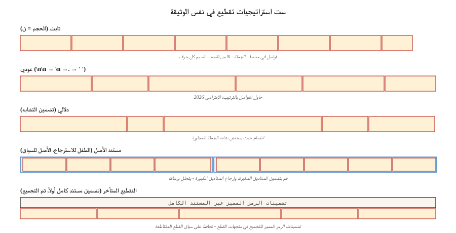

# استراتيجيات التقطيع لـ RAG
> يؤثر تكوين القطع على جودة الاسترجاع بقدر ما يؤثر على اختيار نموذج التضمين (Vectara NAACL 2025). أخطأ في التقطيع ولن يوفر عليك أي قدر من إعادة الترتيب.
**النوع:** بناء
** اللغات: ** بايثون
**المتطلبات الأساسية:** المرحلة 5 · 14 (استرجاع المعلومات)، المرحلة 5 · 22 (نماذج التضمين)
**الوقت:** ~60 دقيقة
## المشكلة
لقد قمت بوضع عقد مكون من 50 صفحة في نظام RAG. يسأل المستخدم: "ما هو شرط الإنهاء؟" يقوم المسترد بإرجاع صفحة الغلاف. لماذا؟ نظرًا لأنه تم تدريب النموذج على أجزاء مكونة من 512 رمزًا مميزًا، ويتكون شرط الإنهاء من 20 صفحة، مقسمة عبر فاصل الصفحات، مع عدم وجود كلمات رئيسية محلية تربطه بالاستعلام.
الإصلاح ليس "شراء نموذج تضمين أفضل". الإصلاح هو القطع. كيف كبيرة؟ تداخل؟ أين تقسيم؟ مع السياق المحيط؟
تظهر معايير فبراير 2026 نتائج مذهلة:
- دراسة Vectara لعام 2026: التقطيع العودي المكون من 512 رمزًا يتفوق على التقطيع الدلالي بنسبة 69% → 54% من الدقة.
- SPLADE + ميسترال-8ب في المسائل الطبيعية: لم يوفر التداخل أي فائدة قابلة للقياس.
- جرف السياق: تنخفض جودة الاستجابة بشكل حاد عند حوالي 2500 رمزًا للسياق.
غالبًا ما تكون الإجابة "الواضحة" (التقطيع الدلالي، تداخل 20%، 1000 رمز مميز) خاطئة. يبني هذا الدرس الحدس لستة إستراتيجيات ويخبرك متى يجب عليك الوصول إليها.
##المفهوم

** تم إصلاح التقطيع. ** قم بتقسيم كل حرف N أو الرموز المميزة. أبسط خط الأساس. يقطع منتصف الجملة. ضغط جيد، وتماسك سيء.
**عودي.** LangChain's `RecursiveCharacterTextSplitter`. حاول التقسيم على `\n\n` أولاً، ثم `\n`، ثم `.`، ثم مسافة. يعود بشكل نظيف. الافتراضي 2026
**الدلالي.** قم بتضمين كل جملة. حساب تشابه جيب التمام بين الجمل المجاورة. انقسام حيث ينخفض ​​​​التشابه إلى ما دون العتبة. يحافظ على تماسك الموضوع. أبطأ؛ ينتج أحيانًا أجزاء صغيرة مكونة من 40 رمزًا مما يضر باسترجاعها.
** الجملة. ** تقسيم على حدود الجملة. جملة واحدة لكل قطعة أو نافذة مكونة من N جمل. يطابق التقطيع الدلالي لما يصل إلى 5 آلاف رمز مميز بجزء بسيط من التكلفة.
**المستند الأصلي.** قم بتخزين الأجزاء الفرعية الصغيرة لاسترجاعها *و* القطعة الأصلية الأكبر حجمًا من أجل السياق. الاسترجاع بواسطة الطفل؛ عودة الوالدين. يتحلل برشاقة: لا تزال قطع الأطفال السيئة تعيد الآباء المعقولين.
**التقطيع المتأخر (2024).** قم بتضمين المستند بأكمله على مستوى الرمز المميز أولاً، ثم قم بتجميع تضمينات الرمز المميز في تضمينات القطع. يحافظ على السياق المتقاطع. يعمل مع أدوات تضمين السياق الطويل (BGE-M3، Jina v3). حساب أعلى.
** الاسترجاع السياقي (Anthropic, 2024).** ألحق كل جزء بملخص تم إنشاؤه بواسطة LLM لموضعه في المستند ("هذا الجزء هو القسم 3.2 من بنود الإنهاء..."). تحسن في الاسترجاع بنسبة 35-50% في المعيار الأنثروبي الخاص. مكلفة للفهرسة.
### القاعدة التي تتغلب على كل التقصير
مطابقة حجم القطعة مع نوع الاستعلام:
| نوع الاستعلام | حجم القطعة |
|------------|-----------|
| Factoid ("ما هو اسم CEO؟") | 256-512 الرموز |
| تحليلي / متعدد القفزات | 512-1024 الرموز |
| فهم القسم بالكامل | 1024-2048 الرموز |
معيار NVIDIA لعام 2026. يجب أن تكون القطعة كبيرة بما يكفي لاحتواء الإجابة بالإضافة إلى السياق المحلي، وصغيرة بما يكفي بحيث يُرجع الجزء العلوي K الخاص بالمسترد التركيز على الإجابة بدلاً من ضجيج السياق.
## بنائها
### الخطوة 1: التقطيع الثابت والمتكرر
```python
def chunk_fixed(text, size=512, overlap=0):
    step = size - overlap
    return [text[i:i + size] for i in range(0, len(text), step)]


def chunk_recursive(text, size=512, seps=("\n\n", "\n", ". ", " ")):
    if len(text) <= size:
        return [text]
    for sep in seps:
        if sep not in text:
            continue
        parts = text.split(sep)
        chunks = []
        buf = ""
        for p in parts:
            if len(p) > size:
                if buf:
                    chunks.append(buf)
                    buf = ""
                chunks.extend(chunk_recursive(p, size=size, seps=seps[1:] or (" ",)))
                continue
            candidate = buf + sep + p if buf else p
            if len(candidate) <= size:
                buf = candidate
            else:
                if buf:
                    chunks.append(buf)
                buf = p
        if buf:
            chunks.append(buf)
        return [c for c in chunks if c.strip()]
    return chunk_fixed(text, size)
```

### الخطوة الثانية: التقطيع الدلالي
```python
def chunk_semantic(text, encoder, threshold=0.6, min_chars=200, max_chars=2048):
    sentences = split_sentences(text)
    if not sentences:
        return []
    embs = encoder.encode(sentences, normalize_embeddings=True)
    chunks = [[sentences[0]]]
    for i in range(1, len(sentences)):
        sim = float(embs[i] @ embs[i - 1])
        current_len = sum(len(s) for s in chunks[-1])
        if sim < threshold and current_len >= min_chars:
            chunks.append([sentences[i]])
        else:
            chunks[-1].append(sentences[i])

    result = []
    for group in chunks:
        text_group = " ".join(group)
        if len(text_group) > max_chars:
            result.extend(chunk_recursive(text_group, size=max_chars))
        else:
            result.append(text_group)
    return result
```

قم بضبط `threshold` على نطاقك. عالية جدًا → شظايا. منخفض جدًا → قطعة واحدة عملاقة.
### الخطوة 3: الوثيقة الأصلية
```python
def chunk_parent_child(text, parent_size=2048, child_size=256):
    parents = chunk_recursive(text, size=parent_size)
    mapping = []
    for p_idx, parent in enumerate(parents):
        children = chunk_recursive(parent, size=child_size)
        for child in children:
            mapping.append({"child": child, "parent_idx": p_idx, "parent": parent})
    return mapping


def retrieve_parent(child_query, mapping, encoder, top_k=3):
    child_embs = encoder.encode([m["child"] for m in mapping], normalize_embeddings=True)
    q_emb = encoder.encode([child_query], normalize_embeddings=True)[0]
    scores = child_embs @ q_emb
    top = np.argsort(-scores)[:top_k]
    seen, parents = set(), []
    for i in top:
        if mapping[i]["parent_idx"] not in seen:
            parents.append(mapping[i]["parent"])
            seen.add(mapping[i]["parent_idx"])
    return parents
```

البصيرة الرئيسية: خداع الوالدين. يمكن للعديد من الأطفال تعيين نفس الوالد؛ إعادة كل شيء من شأنه أن يضيع السياق.
### الخطوة 4: الاسترجاع السياقي (النمط الأنثروبي)
```python
def contextualize_chunks(document, chunks, llm):
    context_prompts = [
        f"""<document>{document}</document>
Here is the chunk to situate: <chunk>{c}</chunk>
Write 50-100 words placing this chunk in the document's context."""
        for c in chunks
    ]
    contexts = llm.batch(context_prompts)
    return [f"{ctx}\n\n{c}" for ctx, c in zip(contexts, chunks)]
```

فهرسة القطع السياقية. وفي وقت الاستعلام، يستفيد الاسترجاع من الإشارة المحيطة الإضافية.
### الخطوة الخامسة: التقييم
```python
def recall_at_k(queries, corpus_chunks, encoder, k=5):
    chunk_embs = encoder.encode(corpus_chunks, normalize_embeddings=True)
    hits = 0
    for q_text, gold_idxs in queries:
        q_emb = encoder.encode([q_text], normalize_embeddings=True)[0]
        top = np.argsort(-(chunk_embs @ q_emb))[:k]
        if any(i in gold_idxs for i in top):
            hits += 1
    return hits / len(queries)
```

دائما المعيار. قد لا تتطابق الإستراتيجية "الأفضل" لمجموعتك مع أي مشاركة مدونة.
## مطبات
- **يتم تقييم التجزئة فقط بناءً على استعلامات واقعية.** تكشف استعلامات القفزات المتعددة عن فائزين مختلفين تمامًا. استخدم مجموعة تقييم طبقية من نوع الاستعلام.
- **التقطيع الدلالي بدون حد أدنى للحجم.** ينتج 40 جزءًا من الرمز المميز مما يضر باسترجاعها. قم دائمًا بتنفيذ `min_tokens`.
- **التداخل كـ cargo عبادة.** توصلت دراسات عام 2026 إلى أن التداخل غالبًا ما لا يوفر أي فائدة ويضاعف تكلفة المؤشر. قياس، لا تفترض.
- **لا يوجد تطبيق للحد الأدنى/الحد الأقصى.** قطع من 5 رموز مميزة أو 5000 رمز مميز كلاهما يعطل الاسترجاع. المشبك.
- **تقسيم المستندات المتقاطعة.** لا تدع أي جزء يمتد إلى مستندين. قم دائمًا بتقسيم كل مستند، ثم دمجه.
## استخدمه
مكدس 2026:
| الوضع | استراتيجية |
|-----------|----------|
| البناء الأول، مجموعة غير معروفة | متكرر، 512 رمزًا، بدون تداخل |
| الحقيقة QA | عودي، 256-512 رمزًا |
| تحليلي / متعدد القفزات | متكرر، 512-1024 الرموز المميزة + المستند الأصلي |
| الإسناد الترافقي الثقيل (العقود، الأوراق) | التقطيع المتأخر أو الاسترجاع السياقي |
| المحادثة / الحوار مجموعة | قطع مستوى الدوران + البيانات التعريفية للمتحدث |
| كلام قصير (تغريدات، تعليقات) | وثيقة واحدة = قطعة واحدة |
ابدأ بالتكرار 512. قم بقياس استدعاء @ 5 على مجموعة تقييم مكونة من 50 استعلامًا. لحن من هناك.
## اشحنها
حفظ باسم `outputs/skill-chunker.md`:
```markdown
---
name: chunker
description: Pick a chunking strategy, size, and overlap for a given corpus and query distribution.
version: 1.0.0
phase: 5
lesson: 23
tags: [nlp, rag, chunking]
---

Given a corpus (document types, avg length, domain) and query distribution (factoid / analytical / multi-hop), output:

1. Strategy. Recursive / sentence / semantic / parent-document / late / contextual. Reason.
2. Chunk size. Token count. Reason tied to query type.
3. Overlap. Default 0; justify if >0.
4. Min/max enforcement. `min_tokens`, `max_tokens` guards.
5. Evaluation plan. Recall@5 on 50-query stratified eval set (factoid, analytical, multi-hop).

Refuse any chunking strategy without min/max chunk size enforcement. Refuse overlap above 20% without an ablation showing it helps. Flag semantic chunking recommendations without a min-token floor.
```

## تمارين
1. **سهل.** قم بتقطيع مستند واحد مكون من 20 صفحة مع العناصر الثابتة (512، 0)، والعودية (512، 0)، والعودية (512، 100). قارن بين أعداد القطع وجودة الحدود.
2. **متوسط.** أنشئ مجموعة تقييم مكونة من 30 استعلامًا تتكون من 5 مستندات. قم بقياس استدعاء @ 5 للوثيقة العودية والدلالية والمستند الأصلي. الذي يفوز؟ هل يتطابق مع مشاركات المدونة؟
3. **صعب.** تنفيذ استرجاع السياق. قياس MRR التحسن على خط الأساس العودي. تقرير تكلفة الفهرس (LLM المكالمات) مقابل زيادة الدقة.
## المصطلحات الرئيسية
| مصطلح | ماذا يقول الناس | ماذا يعني في الواقع |
|------|-|--------------------------------------|
| قطعة | قطعة من الوثيقة | وحدة المستند الفرعية التي يتم تضمينها وفهرستها واسترجاعها. |
| تداخل | هامش الأمان | الرموز المميزة N المشتركة بين القطع المجاورة؛ غالبًا ما تكون عديمة الفائدة في معايير 2026. |
| التقطيع الدلالي | التقطيع الذكي | انقسم حيث يسقط تشابه تضمين الجملة المجاورة. |
| وثيقة الوالدين | استرجاع ذو مستويين | استرداد الأطفال الصغار، وإرجاع الآباء الأكبر. |
| التقطيع المتأخر | قطعة بعد التضمين | قم بتضمين مستند كامل على مستوى الرمز المميز، ثم قم بتجميعه في ناقلات مقطعية. |
| استرجاع سياقي | خدعة الأنثروبي | LLM- ملخص تم إنشاؤه مُلحق بكل قطعة قبل الفهرسة. |
| جرف السياق | جدار 2500 رمز | تمت ملاحظة انخفاض الجودة بحوالي 2.5 ألف رمز مميز للسياق في RAG (يناير 2026). |
## مزيد من القراءة
- [Yepes et al. / LangChain — Recursive Character Splitting docs](https://python.langchain.com/docs/how_to/recursive_text_splitter/) — الافتراضي في الإنتاج.
- [Vectara (2024, NAACL 2025). Chunking configurations analysis](https://arxiv.org/abs/2410.13070) — التقسيم مهم بقدر أهمية تضمين الاختيار.
- [Jina AI — Late Chunking in Long-Context Embedding Models (2024)](https://jina.ai/news/late-chunking-in-long-context-embedding-models/) — ورق التقطيع المتأخر.
- [Anthropic — Contextual Retrieval](https://www.anthropic.com/news/contextual-retrieval) — تحسن في الاسترجاع بنسبة 35-50% باستخدام بادئات السياق التي تم إنشاؤها بواسطة LLM.
- [NVIDIA 2026 chunk-size benchmark — Premai summary](https://blog.premai.io/rag-chunking-strategies-the-2026-benchmark-guide/) — حجم القطعة حسب نوع الاستعلام.