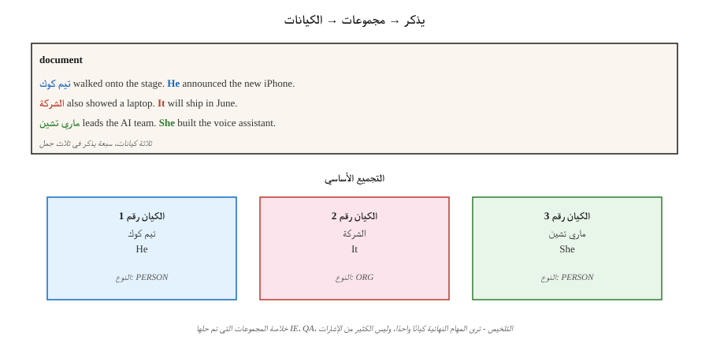

# Coreference Resolution

> "اتصلت به. ولم يرد. كان الطبيب يتناول الغداء." ثلاث إشارات إلى شخصين ولم يتم ذكر أحد. يحدد القرار الأساسي من هو من.

**النوع:** تعلم
** اللغات: ** بايثون
**المتطلبات:** المرحلة 5 · 06 (NER)، المرحلة 5 · 07 (POS والتحليل)
**الوقت:** ~60 دقيقة

## The Problem

استخرج كل ذكر لشركة Apple Inc. من مقالة مكونة من 300 كلمة. سهل عندما يقول المقال "أبل". يكون الأمر صعبًا عندما تقول "الشركة" أو "هم" أو "شركة كوبرتينو التكنولوجية العملاقة" أو "شركة جوبز". بدون حل هذه الإشارات لنفس الكيان، فإن خطك NER pipe يفتقد 60-80% من الإشارات.

يربط دقة المرجع الأساسي كل تعبير يشير إلى نفس كيان العالم الحقيقي في مجموعة واحدة. إنه الغراء بين المستوى السطحي NLP (NER، التحليل) ودلالات المصب (IE، QA، التلخيص، KG).

لماذا يهم في عام 2026:

- التلخيص: "أعلن CEO..." مقابل "أعلن تيم كوك..." - يجب أن يذكر الملخص CEO.
- الإجابة على السؤال: "بمن اتصلت؟" يتطلب حل "هي".
- استخراج المعلومات: رسم بياني معرفي يحتوي على "PER1 أسس شركة Apple" و"Jobs أسس شركة Apple" كإدخالات منفصلة أمر خاطئ.
- مستند متعدد IE: دمج الإشارات عبر المقالات حول نفس الحدث هو مرجع مشترك للمستندات.

## The Concept



**المهمة.** الإدخال: مستند. المخرجات: مجموعة من الإشارات (الامتدادات) حيث تشير كل مجموعة إلى كيان واحد.

**أنواع الإشارة.**

- **الكيان المُسمى.** "تيم كوك"
- **الاسمية.** "CEO"، "الشركة"
- **الضمير.** "هو"، "هي"، "هم"، "هو"
- **إيجابي.** "تيم كوك، أبل CEO،"

**Architectures.**

1. **استنادًا إلى القواعد (هوبز، 1978).** تحليل الضمائر القائم على الشجرة النحوية باستخدام القواعد النحوية. خط أساس جيد. من الصعب بشكل مدهش التغلب على الضمائر.
2. **مصنف أزواج الإشارات.** لكل زوج من الإشارات (m_i، m_j)، توقع ما إذا كانت أساسية أم لا. الكتلة عن طريق الإغلاق المتعدي. القياسية قبل عام 2016.
3. **تصنيف الذكر.** لكل ذكر، قم بترتيب أسلاف المرشح (بما في ذلك "لا يوجد سابق"). اختر القمة.
4. **نهاية إلى نهاية قائمة على الامتداد (Lee et al., 2017).** جهاز تشفير المحولات. قم بتعداد جميع الامتدادات المرشحة حتى الحد الأقصى للطول. توقع درجات الذكر. توقع الاحتمالية السابقة لكل فترة. الكتلة بجشع. الافتراضي الحديث
5. **توليدي (2024+).** اطلب LLM: "أدرج كل ضمير في هذا النص وسابقه." يعمل بشكل جيد في الحالات السهلة، ويواجه صعوبة في المستندات الطويلة والمراجع النادرة.

**مقاييس التقييم.** خمسة مقاييس قياسية (MUC، B³، CEAF، BLANC، LEA) لأنه لا يوجد مقياس واحد يلتقط جودة التجميع. قم بالإبلاغ عن متوسط ​​الثلاثة الأولى كـ CoNLL F1. أحدث ما توصلت إليه التكنولوجيا في عام 2026 في CoNLL-2012: ~83 F1.

**الحالات الصعبة المعروفة.**

- أوصاف محددة تشير إلى الكيانات التي تم تقديمها في الصفحات السابقة.
- الجناس الجسور ("العجلات" ← سيارة سبق ذكرها).
- صفر الجناس في لغات مثل الصينية واليابانية.
- كاتافورا (ضمير قبل المرجع): "عندما دخلت، ابتسمت مريم."

## Build It

### Step 1: pretrained neural coreference (AllenNLP / spaCy-experimental)

```python
import spacy
nlp = spacy.load("en_coreference_web_trf")   # experimental model
doc = nlp("Apple announced new products. The company said they would ship soon.")
for cluster in doc._.coref_clusters:
    print(cluster, "->", [m.text for m in cluster])
```

في مستند أطول، تحصل على شيء مثل:
- المجموعة 1: [أبل، الشركة، هم]
- المجموعة 2: [المنتجات الجديدة]

### Step 2: rule-based pronoun resolver (teaching)

راجع `code/main.py` للتعرف على تطبيق stdlib فقط:

1. استخراج الإشارات: الكيانات المسماة (امتدادات كبيرة)، الضمائر (بحث الإملاء)، الأوصاف المحددة ("X").
2. لكل ضمير، انظر إلى إشارات K السابقة وسجلها حسب: - اتفاق الجنس/الرقم (ارشادي) - الحداثة (انتصارات أقرب) - الدور النحوي (المواضيع المفضلة)
3. ربط السوابق التي حصلت على أعلى الدرجات.

ليست قادرة على المنافسة مع النماذج العصبية. ولكنه يوضح مساحة البحث والقرارات التي يجب أن يكون عليها النموذج الشامل make.

### Step 3: using LLMs for coreference

```python
prompt = f"""Text: {text}

List every pronoun and noun phrase that refers to a person or company.
Cluster them by what they refer to. Output JSON:
[{{"entity": "Apple", "mentions": ["Apple", "the company", "it"]}}, ...]
"""
```

وضعان للفشل للمشاهدة. أولاً، LLMs الإفراط في الدمج ("هو" و"هي" يشيران إلى شخصين مختلفين). ثانيًا، LLMs قم بإسقاط الإشارات بصمت في المستندات الطويلة. تحقق دائمًا من خلال عمليات فحص الإزاحة.

### Step 4: evaluation

يحسب البرنامج النصي القياسي conll-2012 MUC، B³، CEAF-φ4 ويبلغ عن المتوسط. لإجراء تقييم داخلي، ابدأ بدقة على مستوى النطاق واسترجع مجموعة الاختبار المشروحة الخاصة بك، ثم أضف رابط الإشارة F1.

## Pitfalls

- **انفجار مفرد.** تُبلغ بعض الأنظمة عن كل إشارة على أنها مجموعة خاصة بها. B³ متساهل. MUC يعاقب على ذلك. تحقق دائمًا من المقاييس الثلاثة.
- **الضمائر في السياق الطويل.** ينخفض ​​الأداء ~15 F1 في المستندات التي يزيد عددها عن 2000 رمز. قطعة بعناية.
- **الافتراضات المتعلقة بالجنسين.** تخالف القواعد الصارمة المتعلقة بالجنسين المراجع والمنظمات والحيوانات غير الثنائية. استخدم النماذج المستفادة أو التسجيل المحايد.
- ** LLM الانجراف على المستندات الطويلة. ** لا يمكن لمكالمة API واحدة تجميع الإشارات بشكل موثوق عبر أكثر من 50 فقرة. استخدم النافذة المنزلقة + الدمج.

## Use It

مكدس 2026:

| الوضع | اختر |
|-----------|------|
| الإنجليزية، وثيقة واحدة | `en_coreference_web_trf` (spaCy-Experimental) أو AllenNLP neural coref |
| متعدد اللغات | SpanBERT / XLM-R تم تدريبه على OntoNotes أو CoNLL متعدد اللغات |
| الحدث عبر المستند الأساسي | نماذج شاملة متخصصة (2025–26 SOTA) |
| سريع LLM خط الأساس | GPT-4o / كلود مع موجه الإخراج المنظم |
| أنظمة حوار الإنتاج | احتياطي قائم على القواعد + أساسي عصبي + مراجعة يدوية للفتحات المهمة |

نمط التكامل الذي سيتم طرحه في عام 2026: تشغيل NER أولاً، تشغيل coref، دمج مجموعات coref في NER كيانات. ترى المهام النهائية كيانًا واحدًا لكل مجموعة، وليس كيانًا واحدًا لكل إشارة.

## Ship It

حفظ باسم `outputs/skill-coref-picker.md`:

```markdown
---
name: coref-picker
description: Pick a coreference approach, evaluation plan, and integration strategy.
version: 1.0.0
phase: 5
lesson: 24
tags: [nlp, coref, information-extraction]
---

Given a use case (single-doc / multi-doc, domain, language), output:

1. Approach. Rule-based / neural span-based / LLM-prompted / hybrid. One-sentence reason.
2. Model. Named checkpoint if neural.
3. Integration. Order of operations: tokenize → NER → coref → downstream task.
4. Evaluation. CoNLL F1 (MUC + B³ + CEAF-φ4 average) on held-out set + manual cluster review on 20 documents.

Refuse LLM-only coref for documents over 2,000 tokens without sliding-window merge. Refuse any pipeline that runs coref without a mention-level precision-recall report. Flag gender-heuristic systems deployed in demographically diverse text.
```

## Exercises

1. **سهل.** قم بتشغيل المحلل المستند إلى القواعد في `code/main.py` على 5 فقرات مصنوعة يدويًا. قياس دقة الارتباط المذكور مقابل الحقيقة الأرضية.
2. **متوسط.** استخدم نموذجًا عصبيًا تم تدريبه مسبقًا في مقالة إخبارية. قارن المجموعات بالتعليقات التوضيحية اليدوية الخاصة بك. أين فشلت؟
3. **صعب.** قم ببناء خط محسّن NER pipeline: NER أولاً، ثم ادمجه عبر مجموعات coref. قم بقياس تحسين تغطية الكيان مقابل NER-فقط في 100 مقالة.

## Key Terms

| مصطلح | ماذا يقول الناس | ماذا يعني في الواقع |
|------|-|--------------------------------------|
| أذكر | مرجع | نطاق من النص يشير إلى كيان (الاسم، الضمير، العبارة الاسمية). |
| سابقة | ما تشير إليه كلمة "هو" | ذكر في وقت سابق واحد في وقت لاحق corefers مع. |
| الكتلة | ذكر الكيان | مجموعة من الإشارات التي تشير جميعها إلى نفس الكيان الواقعي. |
| الجناس | مرجع رجعي | الإشارة اللاحقة تشير إلى ما سبق ("هو" → "يوحنا"). |
| كاتافورا | مرجع للأمام | الإشارة السابقة تشير إلى وقت لاحق ("عندما وصل، جون..."). |
| التجسير | مرجع ضمني | "اشتريت سيارة. عجلاتها كانت سيئة." (عجلات THAT السيارة.) |
| كونلل F1 | الرقم الموجود على المتصدرين | متوسط ​​MUC، B³، CEAF-φ4 F1 الدرجات. |

## Further Reading

- [Jurafsky & Martin, SLP3 Ch. 26 — Coreference Resolution and Entity Linking](https://web.stanford.edu/~jurafsky/slp3/26.pdf) — canonical textbook chapter.
- [Lee et al. (2017). دقة المرجع العصبي من طرف إلى طرف](https://arxiv.org/abs/1707.07045) — من طرف إلى طرف على أساس الامتداد.
- [Joshi et al. (2020). SpanBERT](https://arxiv.org/abs/1907.10529) — pretraining that improves coref.
- [Pradhan et al. (2012). مهمة CoNLL-2012 المشتركة](https://aclanthology.org/W12-4501/) — المعيار.
- [هوبز (1978). حل مراجع الضمائر](https://www.sciencedirect.com/science/article/pii/0024384178900064) — الكلاسيكية القائمة على القواعد.
