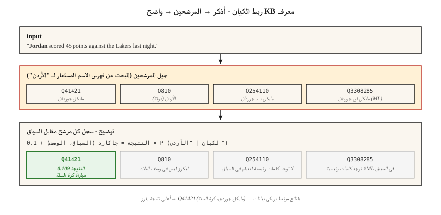

# Entity Linking & Disambiguation

> NER تم العثور على "باريس". ربط الكيان يقرر: باريس، فرنسا؟ باريس هيلتون؟ باريس، تكساس؟ باريس (أمير طروادة)؟ بدون الربط، يظل الرسم البياني المعرفي الخاص بك غامضًا.

**النوع:** بناء
** اللغات: ** بايثون
**المتطلبات الأساسية:** المرحلة 5 · 06 (NER)، المرحلة 5 · 24 (القرار المرجعي)
**الوقت:** ~60 دقيقة

## The Problem

وجاء في الجملة: "الأردن فاز على الصحافة". الخاص بك NER يشير إلى "الأردن" كـ PERSON. جيد. لكن *أي* الأردن؟

- مايكل جوردان (كرة السلة)؟
- مايكل ب. جوردان (ممثل)؟
- مايكل آي جوردان (بيركلي ML أستاذ — نعم، هذا الارتباك حقيقي في ML الأوراق)؟
- الأردن (البلد)؟
- جوردن (الاسم الأول العبري)؟

ربط الكيان (EL) يحل كل إشارة إلى إدخال فريد في قاعدة المعرفة: Wikidata، Wikipedia، DBpedia، أو المجال الخاص بك KB. مهمتان فرعيتان:

1. **جيل المرشحين.** بالنظر إلى "الأردن"، ما هي الإدخالات KB المعقولة؟
2. **توضيح.** بالنظر إلى السياق، من هو المرشح المناسب؟

كلتا الخطوتين قابلة للتعلم. كلاهما يتم قياسهما. لقد ظل خط pipe المدمج مستقرًا لمدة عقد من الزمن - ما يتغير هو جودة أداة توضيح الغموض.

## The Concept



**جيل المرشح.** بالنظر إلى صيغة الإشارة ("الأردن")، ابحث عن المرشحين في فهرس الأسماء المستعارة. تغطي قواميس ويكيبيديا المستعارة معظم الكيانات المسماة: "JFK" → جون إف كينيدي، جاكلين كينيدي، JFK مطار، JFK (فيلم). يُرجع الفهرس النموذجي 10-30 مرشحًا لكل ذكر.

**توضيح: ثلاثة مقاربات.**

1. ** السياق السابق + (ميلن وويتن، 2008).** `P(entity | mention) × context-similarity(entity, text)`. يعمل بشكل جيد، سريع، لا يوجد تدريب.
2. ** يعتمد على التضمين (ESS / REL / Blink).** تشفير الإشارة + السياق. قم بتشفير وصف كل مرشح. اختر الحد الأقصى لجيب التمام. الافتراضي 2020-2024.
3. ** مولد (GENRE، 2021؛ LLM، 2023+).** فك تشفير الاسم المتعارف عليه للكيان رمزًا تلو الآخر. يقتصر على تجربة أسماء الكيانات الصالحة، لذلك يتم ضمان أن يكون الإخراج معرفًا صالحًا KB.

** نهاية إلى نهاية مقابل pipeline.** النماذج الحديثة (ELQ، BLINK، ExtEnD، GENRE) تعمل NER + جيل المرشح + توضيح في مسار واحد. لا تزال أنظمة خطوط الأنابيب تهيمن على الإنتاج لأنه يمكنك تبديل المكونات.

### The two measurements

- **ذكر الاستدعاء (جيل المرشح).** جزء من الذهب يذكر المكان الذي يظهر فيه الإدخال الصحيح KB في قائمة المرشحين. الارضية لكامل pipeline.
- **دقة التوضيح / F1.** بالنظر إلى المرشحين الصحيحين، كم مرة يكون صاحب المركز الأول على حق.

أبلغ دائمًا عن كليهما. النظام الذي يحتوي على توضيح بنسبة 99% على استدعاء المرشح بنسبة 80% هو 80% pipeline.

## Build It

### Step 1: build an alias index from Wikipedia redirects

```python
alias_to_entities = {
    "jordan": ["Q41421 (Michael Jordan)", "Q810 (Jordan, country)", "Q254110 (Michael B. Jordan)"],
    "paris":  ["Q90 (Paris, France)", "Q663094 (Paris, Texas)", "Q55411 (Paris Hilton)"],
    "apple":  ["Q312 (Apple Inc.)", "Q89 (apple, fruit)"],
}
```

بيانات الاسم المستعار لويكيبيديا: ~18 مليون زوج (اسم مستعار، كيان). التنزيل من مقالب ويكي بيانات. تخزين كمؤشر مقلوب.

### Step 2: context-based disambiguation

```python
def disambiguate(mention, context, alias_index, entity_desc):
    candidates = alias_index.get(mention.lower(), [])
    if not candidates:
        return None, 0.0
    context_words = set(tokenize(context))
    best, best_score = None, -1
    for entity_id in candidates:
        desc_words = set(tokenize(entity_desc[entity_id]))
        union = len(context_words | desc_words)
        score = len(context_words & desc_words) / union if union else 0.0
        if score > best_score:
            best, best_score = entity_id, score
    return best, best_score
```

تداخل Jaccard هو لعبة. استبدل بتشابه جيب التمام على التضمينات (راجع `code/main.py` الخطوة 2 للحصول على إصدار المحول).

### Step 3: embedding-based (BLINK-style)

```python
from sentence_transformers import SentenceTransformer
encoder = SentenceTransformer("sentence-transformers/all-MiniLM-L6-v2")

def embed_mention(text, mention_span):
    start, end = mention_span
    marked = f"{text[:start]} [MENTION] {text[start:end]} [/MENTION] {text[end:]}"
    return encoder.encode([marked], normalize_embeddings=True)[0]

def embed_entity(entity_id, description):
    return encoder.encode([f"{entity_id}: {description}"], normalize_embeddings=True)[0]
```

في وقت الفهرس، قم بتضمين كل كيان KB مرة واحدة. في وقت الاستعلام، قم بتضمين سياق الإشارة + مرة واحدة، ثم المنتج النقطي مقابل مجموعة المرشحين، واختر الحد الأقصى.

### Step 4: generative entity linking (concept)

GENRE يقوم بفك تشفير عنوان ويكيبيديا الخاص بالكيان حرفًا بحرف. يضمن فك التشفير المقيد (راجع الدرس 20) إمكانية إخراج العناوين الصالحة فقط. تكامل محكم مع محاولة مدعومة KB. السليل الحديث هو REL-GEN و LLM-مطالب EL بمخرجات منظمة.

```python
prompt = f"""Text: {text}
Mention: {mention}
List the best Wikipedia title for this mention.
Respond with JSON: {{"title": "..."}}"""
```

بالاشتراك مع القائمة البيضاء (المخططات `choice`)، هذا هو أبسط خط EL pipe ليتم شحنه في عام 2026.

### Step 5: evaluate on AIDA-CoNLL

AIDA-CoNLL هو المعيار EL المعياري: 1,393 مقالة من رويترز، 34 ألف إشارة، كيانات ويكيبيديا. الإبلاغ عن دقة KB (`P@1`) ومعدل اكتشاف خارج KB NIL.

## Pitfalls

- **NIL التعامل.** بعض الإشارات ليست في KB (الكيانات الناشئة، الأشخاص الغامضون). يجب أن تتنبأ الأنظمة بـ NIL بدلاً من تخمين الكيان الخاطئ. تقاس بشكل منفصل.
- **أذكر أخطاء الحدود.** يفتقد المنبع NER امتدادات جزئية ("تم وضع علامة على Bank of America" ​​على أنها "Bank" فقط). EL قطرات الاستدعاء.
- **التحيز الشعبي.** تبالغ الأنظمة المدربة في التنبؤ بالكيانات المتكررة. غالبًا ما يرتبط ذكر "مايكل آي جوردان" على ورقة ML بكرة السلة بالأردن.
- ** متعدد اللغات EL.** تعيين الإشارات في النص الصيني إلى كيانات ويكيبيديا الإنجليزية. يتطلب برنامج تشفير متعدد اللغات أو خطوة ترجمة.
- **KB الجمود.** الشركات الجديدة، والأحداث، والأشخاص ليسوا في تفريغ ويكيبيديا العام الماضي. تحتاج خطوط الإنتاج pip إلى حلقة تحديث.

## Use It

مكدس 2026:

| الوضع | اختر |
|-----------|------|
| الإنجليزية للأغراض العامة + ويكيبيديا | BLINK أو REL |
| متعدد اللغات، KB = ويكيبيديا | النوع |
| LLM-مناسب، عدد قليل من الإشارات/اليوم | موجه كلود/GPT-4 مع قائمة المرشحين + مقيد JSON |
| خاص بالمجال KB (طبي، قانوني) | مخصص BERT مع استرجاع KB مدرك + ضبط دقيق على مجموعة أنماط المجال AIDA |
| الكمون منخفض للغاية | التطابق التام السابق فقط (خط الأساس لميلن-ويتن) |
| بحث SOTA | GENRE / ممتد / توليدي LLM-EL |

نمط الإنتاج الذي سيتم شحنه في عام 2026: NER → coref → EL عند كل ذكر → انهيار المجموعات إلى كيان قانوني واحد لكل مجموعة. المخرجات: معرف KB واحد لكل كيان في الوثيقة، وليس معرف واحد لكل ذكر.

## Ship It

حفظ باسم `outputs/skill-entity-linker.md`:

```markdown
---
name: entity-linker
description: Design an entity linking pipeline — KB, candidate generator, disambiguator, evaluation.
version: 1.0.0
phase: 5
lesson: 25
tags: [nlp, entity-linking, knowledge-graph]
---

Given a use case (domain KB, language, volume, latency budget), output:

1. Knowledge base. Wikidata / Wikipedia / custom KB. Version date. Refresh cadence.
2. Candidate generator. Alias-index, embedding, or hybrid. Target mention recall @ K.
3. Disambiguator. Prior + context, embedding-based, generative, or LLM-prompted.
4. NIL strategy. Threshold on top score, classifier, or explicit NIL candidate.
5. Evaluation. Mention recall @ 30, top-1 accuracy, NIL-detection F1 on held-out set.

Refuse any EL pipeline without a mention-recall baseline (you cannot evaluate a disambiguator without knowing candidate gen surfaced the right entity). Refuse any pipeline using LLM-prompted EL without constrained output to valid KB ids. Flag systems where popularity bias affects minority entities (e.g. name-clashes) without domain fine-tuning.
```

## Exercises

1. **سهل.** قم بتنفيذ أداة توضيح السياق + السابقة في `code/main.py` على 10 إشارات غامضة (باريس، الأردن، Apple). قم بتسمية الكيان الصحيح يدويًا. دقة القياس.
2. **متوسط.** قم بتشفير 50 ​​إشارة غامضة باستخدام محول الجملة. تضمين وصف كل مرشح. قارن التوضيح القائم على التضمين بتداخل سياق Jaccard.
3. **صعب.** أنشئ نطاق كيان مكون من 1 ألف KB (مثل الموظفين + المنتجات في شركتك). تنفيذ NER + EL من البداية إلى النهاية. قم بقياس الدقة واسترجاع 100 جملة معلقة.

## Key Terms

| مصطلح | ماذا يقول الناس | ماذا يعني في الواقع |
|------|-|--------------------------------------|
| ربط الكيان (EL) | رابط ويكيبيديا | قم بتعيين إشارة إلى إدخال KB فريد. |
| جيل المرشح | من يمكن أن يكون؟ | قم بإرجاع قائمة مختصرة من الإدخالات KB المعقولة للإشارة إليها. |
| توضيح | اختر الخيار الصحيح | سجل المرشحين باستخدام السياق، واختيار الفائز. |
| فهرس الاسم المستعار | جدول البحث | خريطة من النموذج السطحي → الكيانات المرشحة. |
| NIL | ليس في KB | توقع صريح بعدم تطابق أي إدخال KB. |
| KB | قاعدة المعرفة | ويكي بيانات، ويكيبيديا، DBpedia، أو المجال الخاص بك KB. |
| AIDA-كونل | المعيار | 1,393 مقالة من رويترز بروابط كيان ذهبي. |

## Further Reading

- [Milne, Witten (2008). Learning to Link with Wikipedia](https://www.cs.waikato.ac.nz/~ihw/papers/08-DM-IHW-LearningToLinkWithWikipedia.pdf) — the foundational prior+context approach.
- [Wu et al. (2020). ربط الكيان بدون لقطة مع استرجاع الكيانات الكثيفة (BLINK)](https://arxiv.org/abs/1911.03814) — العمود الفقري القائم على التضمين.
- [De Cao et al. (2021). Autoregressive Entity Retrieval (GENRE)](https://arxiv.org/abs/2010.00904) — generative EL with constrained decoding.
- [Hoffart et al. (2011). توضيح قوي للكيانات المسماة في النص (AIDA)](https://www.aclweb.org/anthology/D11-1072.pdf) — الورقة المرجعية.
- [REL: رابط كيان يقف على أكتاف العمالقة (2020)](https://arxiv.org/abs/2006.01969) — مكدس الإنتاج المفتوح.
